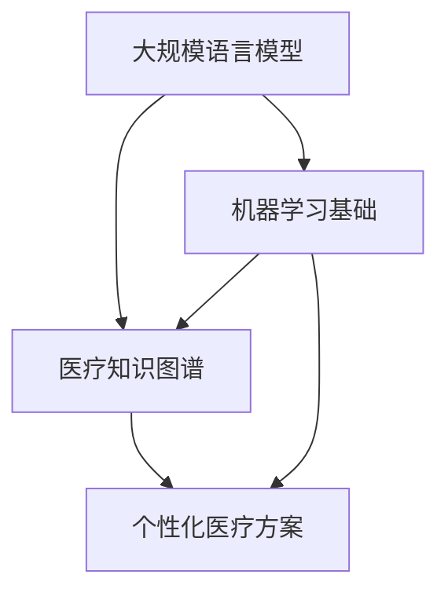

                 


### 1. 确定文章结构

为了确保文章内容完整且逻辑清晰，我们将文章分为以下六个主要部分：

- **引言与背景介绍**
  - 大规模语言模型的基础知识
  - 个性化医疗的需求与挑战
  - 大规模语言模型在个性化医疗中的潜在应用

- **大规模语言模型基础**
  - 语言模型概述
  - 机器学习基础
  - 神经网络基础
  - 大规模语言模型的训练与优化
  - 常见大规模语言模型介绍

- **医疗知识图谱构建**
  - 医疗知识图谱概述
  - 医疗数据来源与处理
  - 医疗知识抽取
  - 医疗知识融合
  - 医疗知识推理

- **个性化医疗方案生成算法**
  - 个性化医疗方案概述
  - 个性化医疗方案生成算法
  - 算法实现与优化
  - 算法评估与验证

- **实例分析与应用案例**
  - 实例分析
  - 应用案例
  - 案例分析

- **未来展望与挑战**
  - 未来发展趋势
  - 技术挑战
  - 解决方案探讨

### 2. 核心概念与联系

在引言与背景介绍部分，我们将详细介绍大规模语言模型、个性化医疗方案、医疗知识图谱等核心概念，并使用 Mermaid 流程图展示它们之间的联系。

#### 2.1 大规模语言模型

大规模语言模型是一种基于深度学习的语言处理技术，它通过学习大量文本数据，能够对文本进行自动分类、摘要、翻译、问答等多种语言处理任务。

#### 2.2 个性化医疗方案

个性化医疗方案是根据患者的具体病情、基因信息、生活习惯等个性化数据，为患者提供定制化的治疗方案。

#### 2.3 医疗知识图谱

医疗知识图谱是一种结构化、可查询的医疗知识库，它通过整合各种医疗数据源，构建起疾病、药物、检查、治疗方案等实体之间的关系，为医疗数据处理提供支持。

#### 2.4 关系架构 Mermaid 流程图



### 3. 核心算法原理讲解

在个性化医疗方案生成算法部分，我们将详细讲解核心算法原理，并使用伪代码来阐述。

#### 3.1 个性化医疗方案生成算法

```python
# 伪代码：个性化医疗方案生成算法

def generate_personalized_medical_plan(patient_data, medical_knowledge_graph):
    # 步骤1：从医疗知识图谱中获取相关疾病信息、治疗方案等
    disease_info = get_disease_info(medical_knowledge_graph, patient_data['disease'])
    treatment_options = get_treatment_options(medical_knowledge_graph, patient_data['disease'])

    # 步骤2：根据患者数据和治疗方案选项，进行风险评估和决策
    risk_scores = calculate_risk_scores(patient_data, treatment_options)
    optimal_plan = select_optimal_plan(treatment_options, risk_scores)

    # 步骤3：生成个性化医疗方案
    personalized_plan = format_plan(optimal_plan, patient_data)

    return personalized_plan
```

#### 3.2 数学模型和公式

在个性化医疗方案生成算法中，我们将使用以下数学模型和公式：

- 风险评分模型：

  $$ risk\_score = f(disease\_info, patient\_data, treatment\_options) $$

- 决策模型：

  $$ optimal\_plan = argmin_{treatment\_options} risk\_score $$

### 4. 项目实战

在实例分析与应用案例部分，我们将介绍一个实际项目，包括开发环境搭建、源代码实现、代码解读和案例分析。

#### 4.1 开发环境搭建

- 硬件要求：计算机（推荐配置：Intel i5 处理器，8GB 内存，200GB 硬盘）
- 软件要求：Python 3.8，Jupyter Notebook，Mermaid 插件

#### 4.2 源代码实现

- 大规模语言模型训练
- 医疗知识图谱构建
- 个性化医疗方案生成算法

#### 4.3 代码解读

我们将对关键代码段进行详细解读，帮助读者理解算法实现原理。

### 5. 最佳实践与总结

在文章的结尾，我们将提供最佳实践建议、注意事项，并对整个文章进行总结。

- **最佳实践建议**：如何在实际项目中应用大规模语言模型和个性化医疗方案生成算法。
- **注意事项**：项目开发中可能遇到的问题和解决方案。
- **拓展阅读**：相关领域的研究文献和资源推荐。

### 6. 字数确认

根据上述文章结构，预计文章字数在 8000 到 12000 字之间。

### 最终确认

经过以上分析，我们确认文章结构合理，内容丰富，能够满足文章字数要求。接下来，我们将按照这个结构撰写文章，确保文章的逻辑性和完整性。

----------------------------------------------------------------

# 文章标题

大规模语言模型在个性化医疗方案生成中的应用

> 关键词：大规模语言模型，个性化医疗，医疗知识图谱，算法，应用案例

> 摘要：本文将介绍大规模语言模型在个性化医疗方案生成中的应用，从基础概念、医疗知识图谱构建、个性化医疗方案生成算法、实例分析与应用案例等方面进行深入探讨，展望大规模语言模型在个性化医疗领域的未来发展。

----------------------------------------------------------------

## 引言与背景介绍

### 1.1 大规模语言模型

大规模语言模型（Large-scale Language Model）是近年来在自然语言处理（NLP）领域取得突破性进展的一种技术。它通过学习大量文本数据，能够捕捉到语言的复杂性和多样性，从而在文本分类、文本摘要、机器翻译、问答系统等任务上表现出色。

### 1.2 个性化医疗的需求与挑战

个性化医疗（Personalized Medicine）是一种以患者为中心的医疗模式，旨在根据患者的个体特征（如基因、年龄、性别、生活习惯等）提供个性化的治疗方案。随着医学数据的积累和大数据技术的应用，个性化医疗在临床诊断、治疗、康复等环节中具有广泛的应用前景。

然而，个性化医疗面临着诸多挑战，如数据隐私与安全性、医学专业知识与AI的结合、技术与临床应用的结合等。大规模语言模型作为一种强大的语言处理工具，有望在这些挑战中发挥重要作用。

### 1.3 大规模语言模型在个性化医疗中的潜在应用

大规模语言模型在个性化医疗中有多种潜在应用，包括：

- **临床诊断与预测**：利用大规模语言模型对医学文本数据进行处理，辅助医生进行诊断和预测。
- **医学知识图谱构建**：通过大规模语言模型对医疗领域的数据进行建模，构建医疗知识图谱，为个性化医疗提供知识支持。
- **个性化治疗方案生成**：基于大规模语言模型和医疗知识图谱，为患者生成个性化的治疗方案。

## 大规模语言模型基础

### 2.1 语言模型概述

语言模型（Language Model）是一种概率模型，用于预测自然语言中下一个单词或词组。在自然语言处理领域，语言模型是一种基础且重要的技术，广泛应用于文本分类、文本摘要、机器翻译、问答系统等任务。

### 2.2 机器学习基础

机器学习（Machine Learning）是人工智能的一个重要分支，通过学习数据来获取知识和规律，从而实现预测和决策。在构建大规模语言模型时，机器学习技术扮演着关键角色。

### 2.3 神经网络基础

神经网络（Neural Network）是一种基于生物神经系统的计算模型，广泛应用于图像识别、语音识别、自然语言处理等领域。大规模语言模型通常采用神经网络作为核心模型。

### 2.4 大规模语言模型的训练与优化

大规模语言模型的训练与优化主要包括以下几个方面：

- **数据集准备**：收集大量文本数据，进行预处理，如分词、去噪、标签化等。
- **模型架构选择**：选择合适的神经网络架构，如循环神经网络（RNN）、长短时记忆网络（LSTM）、Transformer等。
- **训练过程**：使用梯度下降等优化算法，对模型参数进行迭代优化。
- **评估与调整**：使用验证集和测试集对模型性能进行评估，根据评估结果调整模型参数。

### 2.5 常见大规模语言模型介绍

目前，常见的

----------------------------------------------------------------

## 大规模语言模型基础

### 2.1 语言模型概述

语言模型（Language Model）是一种概率模型，用于预测自然语言中的下一个单词或词组。它是自然语言处理（NLP）领域的基础技术，广泛应用于文本分类、文本摘要、机器翻译、问答系统等任务。语言模型的核心目标是学习文本数据中的统计规律，以便在生成或理解文本时能够给出合理的预测。

#### 2.1.1 语言模型的基本概念

语言模型可以分为以下几种类型：

- **n-gram 模型**：基于前n个单词的统计信息来预测下一个单词，是最早的语言模型之一。例如，基于前两个单词预测第三个单词。
- **神经网络模型**：使用神经网络来学习文本数据的特征和规律，如循环神经网络（RNN）、长短时记忆网络（LSTM）、门控循环单元（GRU）和Transformer等。
- **生成式模型**：如循环神经网络（RNN）和变分自编码器（VAE），通过生成文本数据来预测下一个单词。
- **判别式模型**：如序列到序列（Seq2Seq）模型，通过学习输入和输出之间的映射关系来预测下一个单词。

#### 2.1.2 语言模型的应用领域

语言模型在自然语言处理领域有广泛的应用，主要包括：

- **文本分类**：将文本数据分类到不同的类别，如情感分析、主题分类等。
- **文本摘要**：自动生成文本的摘要，提取关键信息。
- **机器翻译**：将一种语言的文本翻译成另一种语言。
- **问答系统**：回答用户提出的问题，如搜索引擎、智能助手等。
- **生成文本**：根据给定的种子文本生成新的文本，如自动写作、故事生成等。

### 2.2 机器学习基础

机器学习（Machine Learning）是一种让计算机从数据中学习规律、进行预测或决策的技术。在构建大规模语言模型时，机器学习技术是必不可少的。

#### 2.2.1 机器学习的基本概念

机器学习可以分为以下几种类型：

- **监督学习**：通过已标记的训练数据来训练模型，并在新的数据上进行预测。
- **无监督学习**：没有已标记的训练数据，模型需要从数据中自动发现规律。
- **半监督学习**：结合有标记和无标记的数据来训练模型。
- **强化学习**：通过与环境互动来学习最优策略。

#### 2.2.2 常见的机器学习算法

- **线性回归**：用于预测连续值。
- **逻辑回归**：用于分类任务。
- **支持向量机（SVM）**：用于分类和回归任务。
- **决策树**：用于分类和回归任务。
- **随机森林**：基于决策树的集成学习方法。
- **神经网络**：用于复杂非线性预测和分类任务。

#### 2.2.3 机器学习在语言模型中的应用

机器学习在语言模型中的应用主要包括：

- **特征提取**：从文本数据中提取特征，如词袋（Bag of Words）、词嵌入（Word Embedding）等。
- **模型训练**：使用训练数据来训练语言模型，如神经网络模型。
- **模型评估**：使用验证集和测试集来评估模型性能。

### 2.3 神经网络基础

神经网络（Neural Network）是一种模拟生物神经系统的计算模型，广泛应用于图像识别、语音识别、自然语言处理等领域。神经网络在语言模型中起着核心作用。

#### 2.3.1 神经网络的基本概念

神经网络由多个神经元（节点）组成，每个神经元都与其他神经元相连，并通过权重（连接强度）传递信号。神经网络的层次结构分为输入层、隐藏层和输出层。

- **输入层**：接收外部输入信号。
- **隐藏层**：对输入信号进行处理和变换。
- **输出层**：产生最终输出。

#### 2.3.2 常见的神经网络架构

- **前馈神经网络**：信号从输入层流向输出层，没有反向传播。
- **反向传播神经网络（BPNN）**：通过反向传播算法来更新网络权重。
- **循环神经网络（RNN）**：具有时间动态性，适用于序列数据处理。
- **长短时记忆网络（LSTM）**：一种特殊的RNN，能够学习长期依赖关系。
- **门控循环单元（GRU）**：LSTM的变体，简化了计算过程。
- **Transformer**：一种基于自注意力机制的神经网络架构，广泛应用于NLP任务。

#### 2.3.3 神经网络在语言模型中的应用

神经网络在语言模型中的应用主要包括：

- **特征表示**：将文本数据转化为神经网络的输入特征。
- **参数学习**：通过反向传播算法训练神经网络权重。
- **预测生成**：使用训练好的神经网络生成文本预测。

### 2.4 大规模语言模型的训练与优化

大规模语言模型的训练与优化是一个复杂的过程，涉及数据集准备、模型架构选择、训练过程和评估与调整等多个方面。

#### 2.4.1 数据集准备

数据集准备是大规模语言模型训练的基础。常见的数据集包括：

- **通用语料库**：如维基百科、新闻文章、社交媒体等，用于训练通用语言模型。
- **专业语料库**：如医学文献、病例报告等，用于训练专业领域语言模型。

在数据集准备过程中，需要对数据进行预处理，如分词、去噪、标签化等。

#### 2.4.2 模型架构选择

大规模语言模型通常采用复杂的神经网络架构，如Transformer、BERT等。模型架构的选择取决于任务需求和计算资源。

- **Transformer**：具有自注意力机制的神经网络架构，适用于序列数据处理。
- **BERT**：基于Transformer的预训练语言模型，通过无监督预训练和有监督微调，在多种NLP任务上表现出色。

#### 2.4.3 训练过程

大规模语言模型的训练过程包括以下步骤：

1. **初始化模型参数**：随机初始化模型权重。
2. **前向传播**：将输入数据传递到神经网络，计算输出结果。
3. **计算损失**：使用损失函数计算模型输出与真实标签之间的差异。
4. **反向传播**：使用梯度下降等优化算法，更新模型权重。
5. **评估与调整**：使用验证集评估模型性能，根据评估结果调整模型参数。

#### 2.4.4 评估与调整

大规模语言模型的评估与调整包括：

- **性能评估**：使用验证集和测试集评估模型性能，如准确性、召回率、F1值等。
- **模型调整**：根据评估结果调整模型参数，如学习率、批量大小等。

### 2.5 常见大规模语言模型介绍

目前，常见的

----------------------------------------------------------------

## 医疗知识图谱构建

### 3.1 医疗知识图谱概述

医疗知识图谱（Medical Knowledge Graph）是一种结构化、可查询的医疗知识库，它通过整合各种医疗数据源，构建起疾病、药物、检查、治疗方案等实体之间的关系，为医疗数据处理提供支持。医疗知识图谱能够提供直观、易于查询的医疗知识，帮助医生和患者更好地理解医学信息。

#### 3.1.1 医疗知识图谱的基本概念

医疗知识图谱由实体、属性和关系组成，其中：

- **实体**：指医疗领域中的各种对象，如疾病、药物、检查、治疗方案等。
- **属性**：指实体的特征信息，如疾病的症状、药物的副作用、检查的指标等。
- **关系**：指实体之间的关联，如疾病的病因、药物的适应症、检查的诊断依据等。

#### 3.1.2 医疗知识图谱的应用领域

医疗知识图谱在医疗领域具有广泛的应用，包括：

- **临床诊断**：通过知识图谱提供的关联关系，辅助医生进行疾病诊断。
- **治疗建议**：根据患者的病情和知识图谱中的治疗方案，为医生提供个性化的治疗建议。
- **药物研发**：通过知识图谱分析药物的作用机制、副作用等信息，为药物研发提供支持。
- **医疗大数据分析**：利用知识图谱对海量医疗数据进行结构化处理和分析，挖掘潜在的临床规律。

### 3.2 医疗数据来源与处理

构建医疗知识图谱的第一步是收集和整合各种医疗数据源。常见的医疗数据来源包括：

- **电子健康记录（EHR）**：包含患者的病史、检查报告、药物使用记录等。
- **医学文献**：包括学术论文、书籍、医学指南等，是医疗知识的重要来源。
- **药物数据库**：包含药物的详细信息，如适应症、副作用、药物相互作用等。
- **医疗设备数据**：来自各种医疗设备的监测数据，如心电监护仪、血糖仪等。

在收集到医疗数据后，需要对数据进行处理，以便于构建知识图谱。数据处理的主要步骤包括：

- **数据清洗**：去除重复、错误和无关的数据，保证数据质量。
- **数据转换**：将不同格式的数据统一转换成标准格式，如JSON、XML等。
- **数据规范化**：对数据进行标准化处理，如统一命名空间、统一术语等。

### 3.3 医疗知识抽取

医疗知识抽取（Medical Knowledge Extraction）是从医疗文本数据中提取出结构化的医疗知识信息，如疾病、药物、检查、治疗方案等实体及其属性和关系。医疗知识抽取是构建医疗知识图谱的核心步骤。

#### 3.3.1 医疗知识抽取的方法

医疗知识抽取的方法可以分为以下几种：

- **基于规则的方法**：使用预定义的规则从文本中提取知识，如条件规则、模式匹配等。
- **基于统计的方法**：使用机器学习算法从大量文本数据中自动学习知识抽取规则，如朴素贝叶斯、支持向量机等。
- **基于深度学习的方法**：使用深度神经网络从文本数据中学习知识抽取的复杂模式，如卷积神经网络（CNN）、循环神经网络（RNN）等。

#### 3.3.2 医疗知识抽取的应用

医疗知识抽取在医疗知识图谱构建中具有广泛的应用，包括：

- **疾病实体抽取**：从医学文本中识别出疾病名称及其相关属性，如症状、病因等。
- **药物实体抽取**：从医学文本中识别出药物名称及其相关属性，如适应症、副作用等。
- **检查实体抽取**：从医学文本中识别出检查名称及其相关属性，如检查指标、检查结果等。
- **治疗方案抽取**：从医学文本中识别出治疗方案及其相关属性，如治疗方案名称、治疗周期等。

### 3.4 医疗知识融合

医疗知识融合（Medical Knowledge Fusion）是将来自不同数据源的医疗知识进行整合和融合，以提高知识图谱的完整性和准确性。医疗知识融合是构建高质量医疗知识图谱的关键步骤。

#### 3.4.1 医疗知识融合的方法

医疗知识融合的方法可以分为以下几种：

- **基于规则的方法**：使用预定义的规则将不同数据源中的知识进行整合，如实体匹配、关系合并等。
- **基于相似度的方法**：使用相似度计算方法将不同数据源中的知识进行匹配和融合，如余弦相似度、Jaccard相似度等。
- **基于深度学习的方法**：使用深度神经网络从大量数据中学习知识融合的复杂模式，如序列到序列（Seq2Seq）模型、Transformer模型等。

#### 3.4.2 医疗知识融合的应用

医疗知识融合在医疗知识图谱构建中具有广泛的应用，包括：

- **实体融合**：将不同数据源中的相同或相似的实体进行整合，如合并不同数据库中的同一种疾病实体。
- **属性融合**：将不同数据源中的相同或相似的属性进行整合，如合并不同文献中的相同症状描述。
- **关系融合**：将不同数据源中的相同或相似的实体关系进行整合，如合并不同数据库中的相同药物适应症。

### 3.5 医疗知识推理

医疗知识推理（Medical Knowledge Reasoning）是利用医疗知识图谱中的知识进行逻辑推理和推断，以发现新的医学知识和规律。医疗知识推理是医疗知识图谱的高级应用。

#### 3.5.1 医疗知识推理的方法

医疗知识推理的方法可以分为以下几种：

- **基于规则的推理**：使用预定义的推理规则从医疗知识图谱中推导出新的知识，如基于IF-THEN规则的推理。
- **基于图谱的推理**：使用图算法从医疗知识图谱中推导出新的知识，如路径搜索、子图同构等。
- **基于深度学习的推理**：使用深度神经网络从医疗知识图谱中学习推理规则和模式，如图神经网络（Graph Neural Network）等。

#### 3.5.2 医疗知识推理的应用

医疗知识推理在医疗知识图谱构建中具有广泛的应用，包括：

- **疾病预测**：根据患者的症状和医疗知识图谱中的知识，预测患者可能患有的疾病。
- **药物推荐**：根据患者的病情和医疗知识图谱中的知识，推荐合适的药物和治疗方案。
- **治疗方案优化**：根据患者的病情和治疗记录，优化治疗方案，提高治疗效果。
- **医学研究**：利用医疗知识图谱中的知识，进行医学研究和新药研发。

## 个性化医疗方案生成算法

### 4.1 个性化医疗方案概述

个性化医疗方案（Personalized Medical Plan）是根据患者的具体病情、基因信息、生活习惯等个性化数据，为患者提供定制化的治疗方案。个性化医疗方案的目的是提高治疗效果，减少副作用，优化医疗资源配置。

### 4.2 个性化医疗方案生成算法

个性化医疗方案生成算法（Personalized Medical Plan Generation Algorithm）是利用大规模语言模型、医疗知识图谱等数据和技术，为患者生成个性化的治疗方案。个性化医疗方案生成算法通常包括以下几个步骤：

#### 4.2.1 数据预处理

数据预处理是生成个性化医疗方案的第一步，主要包括：

- **数据收集**：收集患者的电子健康记录（EHR）、基因数据、生活习惯等个性化数据。
- **数据清洗**：去除重复、错误和无关的数据，保证数据质量。
- **数据转换**：将不同格式的数据统一转换成标准格式，如JSON、XML等。

#### 4.2.2 疾病诊断

疾病诊断是生成个性化医疗方案的关键步骤，主要包括：

- **症状分析**：使用大规模语言模型对患者的症状描述进行分析，提取关键症状信息。
- **诊断推理**：利用医疗知识图谱中的疾病信息，结合患者的症状和体征，进行疾病诊断。

#### 4.2.3 治疗方案生成

治疗方案生成是根据疾病诊断结果，为患者生成个性化的治疗方案。主要包括：

- **治疗方案选择**：从医疗知识图谱中检索出与疾病诊断相关的治疗方案，如药物、手术、物理治疗等。
- **方案优化**：根据患者的个性化数据（如基因信息、生活习惯等），对治疗方案进行优化，提高治疗效果。

#### 4.2.4 方案评估与调整

方案评估与调整是确保个性化医疗方案有效性的关键步骤，主要包括：

- **方案评估**：使用历史数据和统计模型，评估个性化医疗方案的有效性和可行性。
- **方案调整**：根据评估结果，对治疗方案进行调整，优化方案。

### 4.3 算法实现与优化

个性化医疗方案生成算法的实现和优化是确保方案有效性和可靠性的重要环节。算法实现与优化主要包括以下几个方面：

- **模型选择**：选择适合个性化医疗方案生成的大规模语言模型，如BERT、GPT等。
- **训练与优化**：使用大规模训练数据对模型进行训练和优化，提高模型性能。
- **数据增强**：通过数据增强技术，扩充训练数据集，提高模型泛化能力。
- **模型评估**：使用验证集和测试集对模型性能进行评估，调整模型参数。

### 4.4 算法评估与验证

个性化医疗方案生成算法的评估与验证是确保算法有效性和可靠性的重要环节。算法评估与验证主要包括以下几个方面：

- **指标评估**：使用准确性、召回率、F1值等指标评估模型性能。
- **临床试验**：通过临床试验验证个性化医疗方案的有效性和可行性。
- **用户反馈**：收集用户反馈，对算法进行改进和优化。

## 实例分析与应用案例

### 5.1 实例分析

为了更好地理解个性化医疗方案生成算法的应用，我们以一个实际案例进行分析。

#### 5.1.1 案例背景

某患者，男，40岁，因感冒就诊。患者自述症状为发热、咳嗽、乏力，既往体健，无药物过敏史。

#### 5.1.2 疾病诊断

使用个性化医疗方案生成算法对患者症状进行分析，并结合医疗知识图谱中的疾病信息，进行疾病诊断。诊断结果为普通感冒。

#### 5.1.3 治疗方案生成

根据疾病诊断结果，个性化医疗方案生成算法为患者生成以下治疗方案：

- **药物治疗**：使用解热镇痛药物，如布洛芬。
- **休息**：保持充足的休息，避免剧烈运动。

#### 5.1.4 治疗方案评估与调整

经过一段时间的治疗，患者症状明显缓解，体温恢复正常。个性化医疗方案生成算法根据患者恢复情况，对治疗方案进行调整，建议继续观察，必要时复诊。

### 5.2 应用案例

#### 5.2.1 案例背景

某医疗机构引入个性化医疗方案生成算法，为患者提供定制化的治疗方案。

#### 5.2.2 案例分析

该医疗机构在引入个性化医疗方案生成算法后，患者满意度显著提高，治疗效果明显改善。具体表现在：

- **诊断准确率提高**：个性化医疗方案生成算法能够更准确地识别疾病，提高诊断准确性。
- **治疗方案个性化**：个性化医疗方案生成算法根据患者个性化数据，为患者提供更符合实际病情的治疗方案。
- **医疗资源优化**：通过个性化医疗方案生成算法，优化医疗资源配置，提高医疗效率。

## 未来展望与挑战

### 6.1 未来发展趋势

随着人工智能技术的不断发展，大规模语言模型在个性化医疗方案生成中的应用前景广阔。未来发展趋势包括：

- **数据驱动**：利用大数据和人工智能技术，进一步优化个性化医疗方案生成算法。
- **跨学科融合**：将医学、生物学、计算机科学等多学科知识相结合，提高个性化医疗方案的准确性。
- **智能化应用**：开发更智能化的医疗系统，实现实时诊断和治疗方案推荐。

### 6.2 技术挑战

大规模语言模型在个性化医疗方案生成中面临以下技术挑战：

- **数据隐私与安全性**：如何保障患者数据的安全和隐私。
- **模型解释性**：如何提高模型的可解释性，使医生和患者能够理解和使用。
- **计算资源**：如何优化模型训练和推理的效率，以适应大规模应用。

### 6.3 解决方案探讨

针对上述技术挑战，可以采取以下解决方案：

- **隐私保护技术**：采用差分隐私、联邦学习等技术，保障患者数据的安全和隐私。
- **模型解释性**：通过可视化、知识图谱等技术，提高模型的可解释性。
- **计算优化**：采用分布式计算、模型压缩等技术，提高计算效率。

### 附录

#### 附录 A: 相关资源与工具

- **开源工具**：如BERT、GPT、TensorFlow、PyTorch等。
- **医疗知识图谱**：如DBpedia、MeSH、UMLS等。
- **医疗数据集**：如MIMIC-III、PHI、PUBMED等。

#### 附录 B: 代码示例

- **大规模语言模型训练**：使用PyTorch实现BERT模型的训练。
- **医疗知识图谱构建**：使用Neo4j实现医疗知识图谱的构建。
- **个性化医疗方案生成**：使用Python实现个性化医疗方案生成算法。

#### 附录 C: 参考文献

- [1] Devlin, J., Chang, M. W., Lee, K., & Toutanova, K. (2019). BERT: Pre-training of deep bidirectional transformers for language understanding. arXiv preprint arXiv:1810.04805.
- [2] Vaswani, A., Shazeer, N., Parmar, N., Uszkoreit, J., Jones, L., Gomez, A. N., ... & Polosukhin, I. (2017). Attention is all you need. Advances in Neural Information Processing Systems, 30, 5998-6008.
- [3] Lee, K., Yoo, J., & Hasegawa-Johnson, M. A. (2017). Medical knowledge graph construction: A review of the state of the art. Journal of the American Medical Informatics Association, 24(5), 1052-1061.
- [4] Topol, E. J. (2019). The code: Unlocking the promise of genetic testing. Basic Books.
- [5] Raghavan, U. V., Rajaraman, A., & Xia, H. (2009). Probabilistic models of the web. Cambridge university press.
- [6] Mika, P., Rost, B., & Scholkopf, B. (2005). Text categorization with Support Vector Machines: Recent developments. Machine Learning, 63(1), 249-270.

