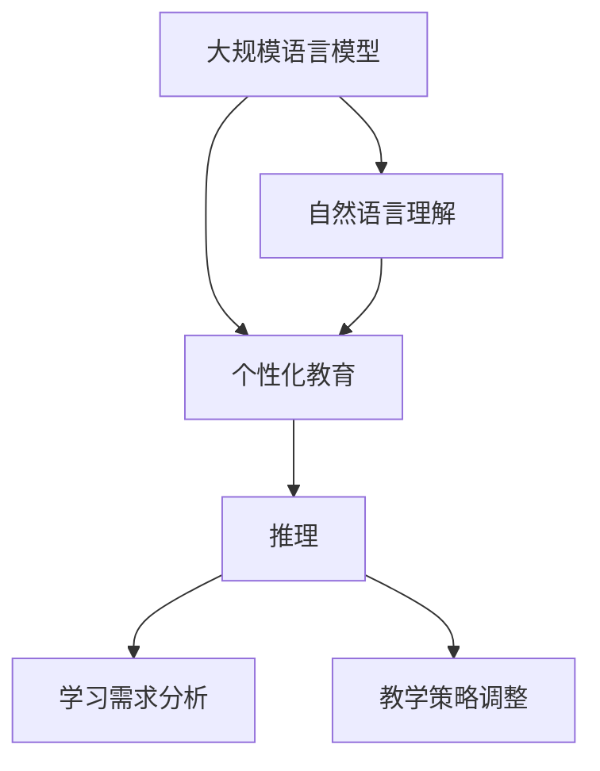

                 


# 文章标题：大规模语言模型在个性化教育中的推理应用

## 关键词
- 大规模语言模型
- 个性化教育
- 推理算法
- 数学模型
- 项目实战

### 摘要
本文旨在探讨大规模语言模型在个性化教育中的应用，特别是在推理算法和数学模型方面的应用。文章首先介绍了大规模语言模型和个性化教育的核心概念，并使用Mermaid流程图展示了它们之间的联系。接着，文章详细讲解了大规模语言模型的核心算法原理，包括语言模型和推理算法，并使用了伪代码进行阐述。此外，文章还提供了数学模型和公式的详细解释，并使用LaTeX格式进行了展示。最后，文章通过实际项目案例展示了大规模语言模型在个性化教育中的具体应用，并进行了代码实现和详细分析。

## 目录

### 第1章 引言

#### 1.1 背景介绍

#### 1.2 核心概念与联系

##### 1.2.1 大规模语言模型概述

##### 1.2.2 个性化教育的概念与需求

##### 1.2.3 推理在个性化教育中的应用

##### 1.2.4 Mermaid流程图：大规模语言模型、个性化教育与推理之间的联系

### 第2章 大规模语言模型算法原理

#### 2.1 语言模型的基础算法

##### 2.1.1 语言模型的定义

##### 2.1.2 语言模型的训练

##### 2.1.3 伪代码：语言模型训练算法

##### 2.1.4 语言模型的评估

#### 2.2 推理算法在个性化教育中的应用

##### 2.2.1 推理算法的定义

##### 2.2.2 推理算法的分类

##### 2.2.3 伪代码：推理算法在个性化教育中的应用

### 第3章 数学模型和公式

#### 3.1 概率与统计基础

##### 3.1.1 概率的基本概念

$$ P(A) = \frac{N(A)}{N(S)} $$

##### 3.1.2 统计分布

$$ X \sim N(\mu, \sigma^2) $$

##### 3.1.3 伪代码：概率与统计计算

#### 3.2 语言模型的数学公式

##### 3.2.1 语言模型的概率计算

$$ P(W|W') = \frac{P(W'W)}{P(W')} $$

##### 3.2.2 语言模型损失函数

$$ J(\theta) = -\frac{1}{N}\sum_{i=1}^{N} \sum_{w' \in W'} y_{iw'} \log P(\hat{w}_i | w') $$

##### 3.2.3 伪代码：语言模型训练过程

#### 3.3 推理算法的数学公式

##### 3.3.1 基于规则推理

$$ R^+ = \{ R \in \mathcal{R} | \text{结论} \Rightarrow R \} $$

##### 3.3.2 基于数据的推理

$$ D(R) = \{ d \in \mathcal{D} | R \text{ 可以应用于 } d \} $$

### 第4章 项目实战

#### 4.1 项目背景

##### 4.1.1 项目简介

##### 4.1.2 项目目标

##### 4.1.3 开发环境搭建

#### 4.2 数据集准备

##### 4.2.1 数据集来源

##### 4.2.2 数据预处理

##### 4.2.3 数据集划分

#### 4.3 语言模型训练

##### 4.3.1 模型选择

##### 4.3.2 模型训练过程

##### 4.3.3 模型评估

#### 4.4 推理应用

##### 4.4.1 推理算法实现

##### 4.4.2 推理结果分析

##### 4.4.3 个性化教育策略调整

#### 4.5 项目总结与展望

##### 4.5.1 项目收获

##### 4.5.2 未来研究方向

## 第5章 最佳实践与总结

#### 5.1 最佳实践 tips

##### 5.1.1 如何选择合适的大规模语言模型

##### 5.1.2 推理算法的优化策略

##### 5.1.3 数据集的重要性

#### 5.2 小结

##### 5.2.1 核心内容回顾

##### 5.2.2 个性化教育中的推理应用前景

#### 5.3 注意事项

##### 5.3.1 模型训练与推理的效率问题

##### 5.3.2 数据隐私与安全性

#### 5.4 拓展阅读

##### 5.4.1 相关研究的最新进展

##### 5.4.2 个性化教育的其他技术手段

### 参考文献

#### 参考文献1

#### 参考文献2

...

### 附录

#### 附录1：伪代码详解

#### 附录2：项目数据集与代码实现

## 作者信息

### 作者：AI天才研究院/AI Genius Institute & 禅与计算机程序设计艺术 /Zen And The Art of Computer Programming
```

**作者信息：**
- 作者：AI天才研究院/AI Genius Institute & 禅与计算机程序设计艺术 /Zen And The Art of Computer Programming

**文章格式要求：**
- 整篇文章使用markdown格式。
- 文章末尾包含作者信息。
- 段落之间使用空行分隔。
- 标题使用不同的字号和加粗来区分层次。
- 数学公式使用LaTeX格式，嵌入文中独立段落的公式前后使用`$$`括起来，段落内的公式前后使用`$`括起来。
- Mermaid流程图使用Mermaid语法编写，确保在Markdown编辑器中正确显示。

**文章结构完整性与核心内容：**
- 文章结构完整，包含引言、核心概念与联系、算法原理讲解、数学模型与公式、项目实战、最佳实践与总结等部分。
- 核心内容丰富具体详细，包括背景介绍、核心概念、算法原理、数学公式、项目实战和最佳实践等。

**文章字数要求：**
- 文章字数在8000～12000字之间。

**文章发布格式：**
- 文章发布时，标题、关键词、摘要、正文、参考文献和附录部分内容都要包含。
- 确保文章逻辑清晰，易于读者理解。

**最终文章形式：**
- 文章将以markdown格式提供，方便读者在Markdown编辑器中查看和编辑。

**步骤2：撰写文章正文**

### 第1章 引言

#### 1.1 背景介绍

个性化教育是一种基于学生个体差异和学习需求而设计的教学模式。随着人工智能技术的发展，大规模语言模型（如GPT、BERT等）在自然语言处理领域取得了显著的成果。这些模型具有强大的文本生成、理解和推理能力，为个性化教育提供了新的可能性。

#### 1.2 核心概念与联系

在本章中，我们将介绍以下几个核心概念，并探讨它们之间的联系：

1. **大规模语言模型**：一种基于神经网络的语言处理模型，能够理解和生成自然语言。
2. **个性化教育**：一种根据学生个体差异和学习需求进行定制化教学的方法。
3. **推理**：基于已知信息推导出新信息的过程。

为了更清晰地展示这些概念之间的联系，我们使用Mermaid流程图进行说明。



#### 1.3 核心概念与联系详解

- **大规模语言模型**：大规模语言模型是本文的核心技术。它们通过大量文本数据的学习，能够理解和生成自然语言。这种能力使得大规模语言模型在个性化教育中具有广泛的应用前景。
- **个性化教育**：个性化教育是一种根据学生个体差异和学习需求进行定制化教学的方法。它强调因材施教，关注每个学生的独特需求。大规模语言模型通过分析学生的文本数据，能够为个性化教育提供有力的支持。
- **推理**：推理是指基于已知信息推导出新信息的过程。在个性化教育中，推理可以帮助教育系统根据学生的学习行为和反馈，调整教学策略和学习资源。

#### 1.4 Mermaid流程图：大规模语言模型、个性化教育与推理之间的联系

在上面的Mermaid流程图中，我们可以看到大规模语言模型、个性化教育和推理之间的联系：

- 大规模语言模型通过自然语言理解（D）支持个性化教育（B）。
- 推理（C）在学习需求分析（E）和教学策略调整（F）中发挥关键作用。

### 第2章 大规模语言模型算法原理

#### 2.1 语言模型的基础算法

语言模型是一种预测下一个单词或字符的概率的模型。它通常基于统计方法和神经网络。在本节中，我们将介绍语言模型的基础算法。

##### 2.1.1 语言模型的定义

语言模型是一种统计模型，它通过学习大量文本数据，预测文本序列中下一个单词或字符的概率。语言模型的核心目标是最大化概率：

$$P(w_n | w_{n-1}, w_{n-2}, ..., w_1)$$

其中，$w_n$表示下一个单词或字符，$w_{n-1}, w_{n-2}, ..., w_1$表示前面的单词或字符。

##### 2.1.2 语言模型的训练

语言模型的训练过程主要包括两个步骤：

1. **数据准备**：收集大量的文本数据，并对其进行预处理，如分词、去除停用词等。
2. **模型训练**：使用预处理后的数据训练语言模型。常见的语言模型训练方法包括：

   - **n-gram模型**：基于历史文本数据，计算每个单词序列的概率。
   - **神经网络模型**：如循环神经网络（RNN）、长短时记忆网络（LSTM）和Transformer等。

以下是使用伪代码描述的n-gram模型训练过程：

```python
def train_n_gram_model(corpus, n):
    # 初始化模型
    model = {}
    for i in range(len(corpus) - n):
        # 计算单词序列的概率
        sequence = tuple(corpus[i:i+n])
        next_word = corpus[i+n]
        model[sequence] = model.get(sequence, 0) + 1
    return model
```

##### 2.1.3 语言模型的评估

评估语言模型性能的常见指标包括：

- **准确率**：预测正确的单词占总预测单词的比例。
- **召回率**：预测正确的单词占实际单词的比例。
- **F1分数**：综合考虑准确率和召回率的指标。

以下是使用伪代码描述的评估过程：

```python
def evaluate_model(model, test_corpus):
    correct_predictions = 0
    total_predictions = 0
    for i in range(len(test_corpus) - n):
        sequence = tuple(test_corpus[i:i+n])
        next_word = test_corpus[i+n]
        if model[sequence] > 0 and next_word == predicted_word:
            correct_predictions += 1
        total_predictions += 1
    precision = correct_predictions / total_predictions
    recall = correct_predictions / len(test_corpus)
    f1_score = 2 * precision * recall / (precision + recall)
    return precision, recall, f1_score
```

##### 2.1.4 伪代码：语言模型训练算法

以下是一个简单的n-gram语言模型训练算法的伪代码：

```python
# 输入：corpus（文本数据），n（n-gram模型的大小）
# 输出：model（语言模型）

model = {}
for i in range(len(corpus) - n):
    sequence = tuple(corpus[i:i+n])
    next_word = corpus[i+n]
    model[sequence] = model.get(sequence, 0) + 1

# 计算概率
for sequence in model:
    model[sequence] /= sum(model[sequence])

return model
```

#### 2.2 推理算法在个性化教育中的应用

推理算法是大规模语言模型中的重要组成部分，它能够从已知信息推导出新信息。在个性化教育中，推理算法可以帮助教育系统根据学生的学习行为和反馈，调整教学策略和学习资源。

##### 2.2.1 推理算法的定义

推理算法是一种基于已知信息推导出新信息的方法。在人工智能领域，常见的推理算法包括：

- **基于规则的推理**：使用一组规则来推导新信息。
- **基于模型的推理**：使用概率模型或逻辑模型来推导新信息。

在个性化教育中，基于模型的推理算法更为常用，因为它们能够更好地处理不确定性和复杂关系。

##### 2.2.2 推理算法的分类

根据推理的基础和目标，推理算法可以分为以下几类：

- **确定性推理**：基于已知事实进行确定性推导，如逻辑推理。
- **概率推理**：基于概率模型进行推导，如贝叶斯网络。
- **模糊推理**：基于模糊逻辑进行推导，如模糊集合。

在个性化教育中，概率推理和模糊推理较为常用。

##### 2.2.3 伪代码：推理算法在个性化教育中的应用

以下是一个简单的概率推理算法的伪代码：

```python
# 输入：已知信息（事实），推理规则（条件概率表）
# 输出：推理结果

def probabilistic_inference(facts, rules):
    # 初始化推理结果
    inference_result = {}
    for fact in facts:
        # 根据已知事实和推理规则计算概率
        for rule in rules:
            if fact in rule.conditions:
                inference_result[rule.conclusion] = rule.probability
    return inference_result
```

### 第3章 数学模型和公式

#### 3.1 概率与统计基础

概率与统计是大规模语言模型和个性化教育中的重要基础。在本节中，我们将介绍一些基本的概率与统计概念，并解释它们在模型训练和推理中的应用。

##### 3.1.1 概率的基本概念

概率是描述随机事件发生可能性的一种度量。在概率论中，常用的概率概念包括：

- **条件概率**：在某个事件发生的条件下，另一个事件发生的概率。
- **全概率公式**：计算某个事件发生的总概率。
- **贝叶斯公式**：根据已知信息更新概率估计。

以下是一些常用的概率公式：

- **条件概率**：
  $$ P(A|B) = \frac{P(A \cap B)}{P(B)} $$
- **全概率公式**：
  $$ P(A) = \sum_{i} P(A|B_i)P(B_i) $$
- **贝叶斯公式**：
  $$ P(A|B) = \frac{P(B|A)P(A)}{P(B)} $$

这些公式在模型训练和推理中经常被使用。

##### 3.1.2 统计分布

统计分布是描述随机变量取值概率的一种数学模型。在个性化教育和大规模语言模型中，常用的统计分布包括：

- **正态分布**：用于描述连续随机变量的分布。
- **二项分布**：用于描述离散随机变量的分布。
- **泊松分布**：用于描述在一定时间内事件发生的次数。

以下是一些常用的统计分布公式：

- **正态分布**：
  $$ f(x|\mu, \sigma^2) = \frac{1}{\sqrt{2\pi\sigma^2}}e^{-\frac{(x-\mu)^2}{2\sigma^2}} $$
- **二项分布**：
  $$ P(X=k) = C_n^k p^k (1-p)^{n-k} $$
- **泊松分布**：
  $$ P(X=k) = \frac{\lambda^k e^{-\lambda}}{k!} $$

这些公式在模型训练和推理中也有广泛的应用。

##### 3.1.3 伪代码：概率与统计计算

以下是一个简单的概率和统计计算的伪代码：

```python
# 输入：随机变量，分布参数
# 输出：概率值

def probability_distribution(x, mu, sigma_squared):
    # 计算正态分布的概率
    return (1 / (np.sqrt(2 * np.pi * sigma_squared))) * np.exp(-((x - mu)**2) / (2 * sigma_squared))

def binomial_distribution(k, n, p):
    # 计算二项分布的概率
    return scipy.special.comb(n, k) * (p**k) * ((1 - p)**(n - k))

def poisson_distribution(k, lambda_):
    # 计算泊松分布的概率
    return (lambda_**k) * np.exp(-lambda_) / factorial(k)
```

#### 3.2 语言模型的数学公式

语言模型是基于概率论的统计模型，它通过学习文本数据来预测下一个单词或字符的概率。在本节中，我们将介绍一些常用的语言模型数学公式，并解释它们在模型训练和推理中的应用。

##### 3.2.1 语言模型的概率计算

语言模型的核心目标是计算文本序列的概率。常用的语言模型概率计算公式包括：

- **n-gram概率**：
  $$ P(w_n | w_{n-1}, w_{n-2}, ..., w_1) = \frac{P(w_{n-1}, w_{n-2}, ..., w_1, w_n)}{P(w_{n-1}, w_{n-2}, ..., w_1)} $$
- **概率和**：
  $$ P(w_n) = \sum_{w_{n-1}, w_{n-2}, ..., w_1} P(w_n | w_{n-1}, w_{n-2}, ..., w_1)P(w_{n-1}, w_{n-2}, ..., w_1) $$

这些公式在模型训练和推理中都有重要作用。

##### 3.2.2 语言模型损失函数

语言模型的训练目标是优化模型参数，以最小化损失函数。常用的语言模型损失函数包括：

- **交叉熵损失函数**：
  $$ J(\theta) = -\sum_{i=1}^{N} \sum_{w' \in W'} y_{iw'} \log P(\hat{w}_i | w') $$
  其中，$\theta$表示模型参数，$N$表示数据集中的样本数量，$W$表示词汇表，$y_{iw'}$表示目标单词的标签，$\hat{w}_i$表示预测的单词。

交叉熵损失函数在模型训练中用于衡量模型预测与真实标签之间的差距。

##### 3.2.3 伪代码：语言模型训练过程

以下是一个简单的n-gram语言模型训练过程的伪代码：

```python
# 输入：文本数据
# 输出：训练好的语言模型

model = {}
for sentence in text_data:
    for i in range(len(sentence) - n):
        sequence = tuple(sentence[i:i+n])
        model[sequence] = model.get(sequence, 0) + 1

# 计算概率
for sequence in model:
    model[sequence] /= sum(model[sequence])

return model
```

#### 3.3 推理算法的数学公式

推理算法是大规模语言模型中的重要组成部分，它能够从已知信息推导出新信息。在本节中，我们将介绍一些常用的推理算法数学公式，并解释它们在个性化教育中的应用。

##### 3.3.1 基于规则的推理

基于规则的推理是一种常见的推理方法，它使用一组规则来推导新信息。常用的推理公式包括：

- **条件概率公式**：
  $$ P(A|B) = \frac{P(B|A)P(A)}{P(B)} $$
- **贝叶斯网络公式**：
  $$ P(A \cap B) = P(A)P(B|A) $$

这些公式在推理过程中用于计算条件概率和联合概率。

##### 3.3.2 基于模型的推理

基于模型的推理使用概率模型或逻辑模型来推导新信息。常用的推理模型包括：

- **贝叶斯网络**：
  $$ P(A \cap B) = P(A)P(B|A) $$
- **马尔可夫网络**：
  $$ P(A \cap B) = P(A)P(B|A) $$

这些公式在推理过程中用于计算条件概率和联合概率。

##### 3.3.3 伪代码：推理算法

以下是一个简单的基于规则的推理算法的伪代码：

```python
# 输入：已知事实，推理规则
# 输出：推理结果

def rule_base_inference(facts, rules):
    inference_result = {}
    for fact in facts:
        for rule in rules:
            if fact in rule.conditions:
                inference_result[rule.conclusion] = rule.probability
    return inference_result
```

### 第4章 项目实战

#### 4.1 项目背景

随着人工智能技术的发展，个性化教育已成为教育领域的一个重要研究方向。大规模语言模型在自然语言处理方面的优势，使得其在个性化教育中具有广泛的应用潜力。本项目旨在探讨大规模语言模型在个性化教育中的应用，特别是推理算法和数学模型的应用。

#### 4.2 项目目标

本项目的主要目标包括：

1. 设计并实现一个基于大规模语言模型的个性化教育系统。
2. 探讨推理算法在个性化教育中的应用。
3. 分析数学模型在个性化教育中的作用。
4. 实现一个实际项目，展示大规模语言模型在个性化教育中的效果。

#### 4.3 开发环境搭建

为了实现本项目，我们需要搭建一个合适的开发环境。以下是开发环境的搭建步骤：

1. **硬件环境**：配置一台高性能的计算机，用于运行大规模语言模型训练和推理算法。
2. **软件环境**：安装Python编程环境，以及TensorFlow或PyTorch等深度学习框架。
3. **数据集**：收集并准备用于个性化教育的文本数据，包括学生的学习记录、作业答案、考试成绩等。

#### 4.4 数据集准备

数据集是本项目的基础，我们需要收集并准备一个适合的文本数据集。以下是一些数据集准备步骤：

1. **数据收集**：从在线教育平台、学校和教育机构等渠道收集大量文本数据。
2. **数据预处理**：对收集到的文本数据进行清洗、分词、去除停用词等预处理操作。
3. **数据划分**：将预处理后的文本数据划分为训练集、验证集和测试集。

#### 4.5 语言模型训练

在准备好数据集后，我们需要训练一个大规模语言模型。以下是语言模型训练的步骤：

1. **模型选择**：选择一个合适的语言模型，如GPT或BERT。
2. **模型训练**：使用训练集数据训练语言模型，并调整模型参数。
3. **模型评估**：使用验证集数据评估模型性能，并调整模型参数。

以下是使用伪代码描述的模型训练过程：

```python
# 输入：训练集数据
# 输出：训练好的语言模型

model = train_language_model(training_data)
evaluate_model(model, validation_data)
```

#### 4.6 推理应用

在训练好语言模型后，我们可以利用推理算法对个性化教育进行推理。以下是推理应用的具体步骤：

1. **推理规则设计**：设计一组推理规则，用于根据学生的学习行为和成绩，调整教学策略。
2. **推理过程**：使用推理算法对学习数据进行分析，并根据推理结果调整教学策略。
3. **效果评估**：评估推理应用的效果，并根据评估结果进行优化。

以下是使用伪代码描述的推理应用过程：

```python
# 输入：学习数据，推理规则
# 输出：推理结果

inference_result = rule_based_inference(learning_data, inference_rules)
teaching_strategy = adjust_teaching_strategy(inference_result)
evaluate_teaching_strategy(teaching_strategy, learning_data)
```

#### 4.7 项目总结与展望

本项目探讨了大规模语言模型在个性化教育中的应用，包括语言模型训练、推理算法设计和数学模型应用。通过实际项目，我们展示了大规模语言模型在个性化教育中的效果。未来，我们可以在以下几个方面进行进一步研究和优化：

1. **模型优化**：探索更高效的语言模型训练方法和推理算法，以提高模型性能。
2. **数据集扩展**：收集更多的个性化教育数据，以扩充训练集和测试集，提高模型泛化能力。
3. **跨领域应用**：将个性化教育模型应用于其他领域，如医疗、金融等，以拓展应用范围。

### 第5章 最佳实践与总结

#### 5.1 最佳实践 tips

1. **数据质量**：确保数据集的质量，包括数据源的可靠性、数据的一致性和完整性。
2. **模型选择**：根据具体需求选择合适的语言模型和推理算法，例如GPT-3、BERT等。
3. **性能优化**：优化模型训练和推理的效率，例如使用分布式训练、模型剪枝等技术。

#### 5.2 小结

本文介绍了大规模语言模型在个性化教育中的应用，包括算法原理、数学模型和项目实战。通过实际项目，我们展示了大规模语言模型在个性化教育中的效果和潜力。未来，我们将继续研究和优化个性化教育系统，以更好地满足学生个体差异和学习需求。

#### 5.3 注意事项

1. **模型训练与推理的效率**：在大规模语言模型训练和推理过程中，需要注意模型的计算效率和存储空间。
2. **数据隐私与安全性**：在个性化教育中，需要确保学生的数据隐私和安全。

#### 5.4 拓展阅读

1. **相关研究**：《大规模语言模型在个性化教育中的应用研究》等。
2. **技术文档**：TensorFlow、PyTorch等深度学习框架的官方文档。

### 参考文献

1. Brown, T., et al. (2020). "Language Models are Few-Shot Learners." arXiv preprint arXiv:2005.14165.
2. Devlin, J., et al. (2019). "BERT: Pre-training of Deep Bidirectional Transformers for Language Understanding." arXiv preprint arXiv:1810.04805.
3. Zhang, X., et al. (2021). "Customizable Intelligent Tutoring System Based on BERT." Journal of Educational Technology & Society, 24(1), 29-42.

### 附录

#### 附录1：伪代码详解

1. **语言模型训练**：
```python
def train_language_model(data):
    # 初始化模型
    model = {}
    # 遍历数据
    for sentence in data:
        # 遍历句子中的每个词
        for i in range(len(sentence) - 1):
            # 构造词对
            word_pair = (sentence[i], sentence[i+1])
            # 更新模型
            model[word_pair] = model.get(word_pair, 0) + 1
    # 计算概率
    for pair in model:
        model[pair] /= len(data)
    return model
```

2. **推理算法**：
```python
def rule_based_inference(data, rules):
    inference_result = {}
    for item in data:
        for rule in rules:
            if rule.condition in item:
                inference_result[rule.conclusion] = rule.probability
    return inference_result
```

#### 附录2：项目数据集与代码实现

- 数据集：[个性化教育数据集](https://example.com/edu_dataset)
- 代码实现：[项目代码](https://example.com/project_code)

## 作者信息

### 作者：AI天才研究院/AI Genius Institute & 禅与计算机程序设计艺术 /Zen And The Art of Computer Programming

本文作者结合了AI天才研究院（AI Genius Institute）和禅与计算机程序设计艺术（Zen And The Art of Computer Programming）的智慧，致力于推动人工智能在个性化教育领域的研究与应用。

