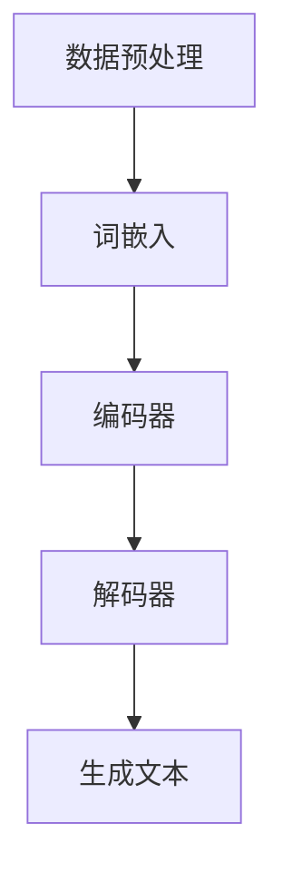
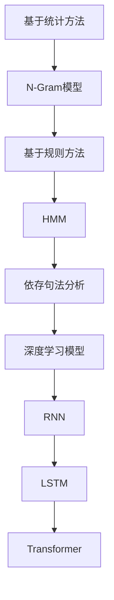
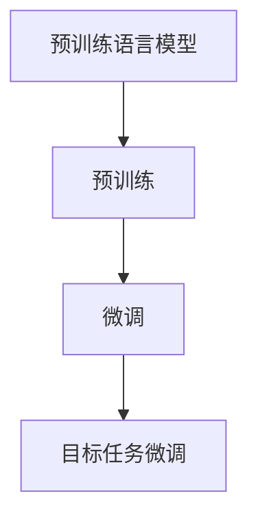
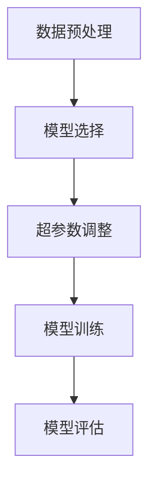
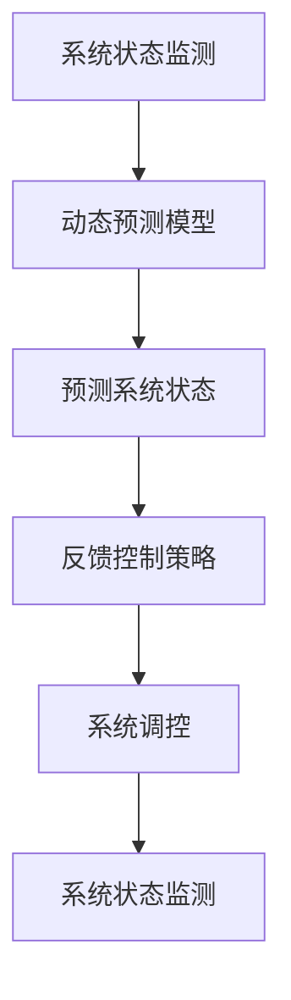

                 

### 文章标题

《大规模语言模型在复杂系统动态预测与控制中的应用》

关键词：大规模语言模型，复杂系统，动态预测，控制，应用，GPT，预训练语言模型，深度学习，神经网络

摘要：本文详细探讨了大规模语言模型在复杂系统动态预测与控制中的应用。首先介绍了大规模语言模型的基本概念、发展历程和主要类型，然后深入探讨了大规模语言模型的技术基础，包括深度学习、机器学习和语言模型的相关知识。接下来，本文通过具体的实战案例，展示了如何构建一个问答系统，并对其代码进行了详细解读。随后，本文重点讨论了大规模语言模型在复杂系统中的应用，包括动态预测和系统控制的定义、原理和算法。最后，本文总结了最佳实践和注意事项，并提出了进一步研究的方向。通过本文的讨论，读者可以深入了解大规模语言模型在复杂系统中的应用潜力，为相关领域的研究和实践提供参考。### 第1章: 大规模语言模型概述

大规模语言模型是近年来人工智能领域的一项重要进展，其强大的文本生成能力在自然语言处理、问答系统、文本生成等多个应用场景中展现出了显著的优势。本章节将首先介绍大规模语言模型的基本概念，包括其核心组成部分和主要类型，然后通过历史发展、技术基础等角度，对大规模语言模型进行深入探讨。

#### 1.1 大规模语言模型简介

**核心概念与联系**

大规模语言模型（如GPT系列）通过在海量文本数据上进行训练，能够生成高质量的文本。这类模型通常包含以下几个核心组成部分：

- **词嵌入（Word Embedding）**：将词汇映射到高维空间，便于计算和处理。
- **序列模型（Sequence Model）**：如循环神经网络（RNN）和长短期记忆网络（LSTM），用于处理序列数据。
- **上下文理解（Contextual Understanding）**：通过注意力机制等手段，模型能够理解词汇间的上下文关系。

这些组件共同构成了大规模语言模型的核心，使其在文本生成和语义理解方面具有强大的能力。

**核心原理与联系**

为了更直观地理解大规模语言模型的训练与推理流程，我们可以通过以下Mermaid流程图展示：



在这个流程图中，数据预处理阶段对输入文本进行清洗、分词等操作；词嵌入阶段将词汇映射到高维空间；编码器负责将输入序列编码为固定长度的向量；解码器则根据编码器生成的向量生成输出文本。

#### 1.2 大规模语言模型的发展历史

**核心概念与联系**

大规模语言模型的发展经历了多个阶段，从最初的基于统计的方法，到基于规则的方法，再到深度学习模型的崛起。

- **基于统计的方法**：如N-Gram模型，通过计算词汇序列的概率分布来生成文本。
- **基于规则的方法**：如HMM、依存句法分析，通过构建语法规则来处理文本。
- **深度学习模型**：如RNN、LSTM、Transformer，通过学习文本的深层特征来实现文本生成。

这些方法各有优缺点，但深度学习模型在文本生成和语义理解方面表现出了更强大的能力。

**核心原理与联系**

为了更清晰地展示大规模语言模型的发展历程，我们可以通过以下Mermaid流程图进行说明：



在这个流程图中，基于统计的方法通过计算词汇序列的概率分布来生成文本；基于规则的方法通过构建语法规则来处理文本；深度学习模型通过学习文本的深层特征来实现文本生成。

#### 1.3 大规模语言模型的主要类型

**核心概念与联系**

大规模语言模型根据应用场景和任务类型可以分为多种类型，主要包括预训练语言模型和目标任务微调模型。

- **预训练语言模型**：如BERT、GPT，通过在海量文本数据上进行预训练，获得通用语言表示能力。
- **目标任务微调**：在预训练模型的基础上，针对具体任务进行微调，实现特定任务的高效处理。

这些模型类型各有优缺点，适用于不同的应用场景。

**核心原理与联系**

为了更直观地展示大规模语言模型的应用流程，我们可以通过以下Mermaid流程图进行说明：



在这个流程图中，预训练语言模型通过在海量文本数据上进行预训练，获得通用语言表示能力；目标任务微调则是在预训练模型的基础上，针对具体任务进行微调，实现特定任务的高效处理。

通过本章的介绍，我们对大规模语言模型有了基本的认识，接下来我们将深入探讨其技术基础，包括深度学习、机器学习和语言模型的相关知识。这将为我们进一步理解大规模语言模型在复杂系统中的应用奠定坚实的基础。### 第2章: 大规模语言模型的技术基础

大规模语言模型的强大功能离不开其坚实的技术基础。本章将详细讨论大规模语言模型的技术基础，包括深度学习、机器学习和语言模型的核心概念和原理，并通过伪代码和流程图展示相关技术的基础知识和应用方法。

#### 2.1 深度学习基础

**核心概念与联系**

深度学习是大规模语言模型的核心技术之一，它通过模拟人脑的神经网络结构，对复杂数据进行自动特征提取和模式识别。

- **神经网络（Neural Networks）**：是深度学习的基础，包括输入层、隐藏层和输出层。
- **反向传播算法（Backpropagation）**：用于训练神经网络，通过误差反向传播更新网络权重。
- **优化算法（Optimization Algorithms）**：如随机梯度下降（SGD）和Adam，用于优化网络参数。

**核心原理与联系**

以下是一个简单的神经网络训练过程的伪代码：

```python
# 初始化神经网络权重
W = initialize_weights()

# 定义损失函数
def loss(y_true, y_pred):
    return np.mean((y_true - y_pred)**2)

# 定义反向传播算法
def backpropagation(X, y, y_pred, W):
    delta = (y - y_pred) * W
    W -= learning_rate * delta

# 训练神经网络
for epoch in range(num_epochs):
    y_pred = forward_propagation(X, W)
    loss_value = loss(y, y_pred)
    backpropagation(X, y, y_pred, W)

# 输出训练结果
print(f"Training loss: {loss_value}")
```

**核心算法原理**

神经网络训练的核心算法包括以下几个步骤：

1. **前向传播（Forward Propagation）**：计算输入和权重之间的线性组合，并通过激活函数进行非线性变换。
2. **计算损失（Compute Loss）**：通过比较预测值和真实值，计算损失函数的值。
3. **反向传播（Back Propagation）**：计算梯度，并更新网络权重，以最小化损失函数。

#### 2.2 机器学习基础

**核心概念与联系**

机器学习是大规模语言模型构建的重要组成部分，它通过从数据中学习模式和规律，实现对未知数据的预测和分类。

- **监督学习（Supervised Learning）**：通过已知输入和输出数据训练模型。
- **无监督学习（Unsupervised Learning）**：通过未知输入数据发现数据中的模式和结构。
- **强化学习（Reinforcement Learning）**：通过与环境交互学习最优策略。

**核心原理与联系**

以下是一个简单的机器学习模型评估过程的伪代码：

```python
# 初始化模型
model = initialize_model()

# 训练模型
model.fit(X_train, y_train)

# 评估模型
y_pred = model.predict(X_test)
accuracy = np.mean(y_pred == y_test)
print(f"Model accuracy: {accuracy}")
```

**核心算法原理**

机器学习模型评估的核心算法包括以下几个步骤：

1. **数据划分（Data Splitting）**：将数据集划分为训练集和测试集。
2. **模型训练（Model Training）**：在训练集上训练模型。
3. **模型评估（Model Evaluation）**：在测试集上评估模型性能，通常使用准确率、召回率、F1分数等指标。

#### 2.3 语言模型基础知识

**核心概念与联系**

语言模型是大规模语言模型的核心组成部分，它用于预测文本序列的概率分布。

- **词嵌入（Word Embedding）**：将词汇映射到高维空间，用于文本表示。
- **序列模型（Sequence Model）**：如循环神经网络（RNN）和长短期记忆网络（LSTM），用于处理序列数据。
- **注意力机制（Attention Mechanism）**：用于关注文本序列中的重要信息。

**核心原理与联系**

以下是一个简单的语言模型构建过程的伪代码：

```python
# 初始化词嵌入
word_embedding = initialize_word_embedding()

# 初始化序列模型
sequence_model = initialize_sequence_model()

# 训练语言模型
for sentence in sentences:
    sequence_model.fit(sentence, word_embedding)

# 生成文本
generated_sentence = sequence_model.generate(word_embedding)
print(generated_sentence)
```

**核心算法原理**

语言模型构建的核心算法包括以下几个步骤：

1. **词嵌入（Word Embedding）**：将词汇映射到高维空间，用于文本表示。
2. **序列建模（Sequence Modeling）**：使用序列模型对文本序列进行建模。
3. **文本生成（Text Generation）**：根据模型生成的概率分布生成文本。

通过本章的讨论，我们对大规模语言模型的技术基础有了更深入的理解。接下来，我们将通过一个具体的实战案例，展示如何构建一个问答系统，并对相关代码进行详细解读。这将帮助我们更好地理解大规模语言模型在实际应用中的具体实现方法。### 第3章: 大规模语言模型的构建与实践

在了解了大规模语言模型的技术基础后，本章将通过一个具体的实战案例——构建一个问答系统，来深入探讨大规模语言模型的构建与实践过程。我们将从项目需求、开发环境搭建、数据集选择、模型构建、训练与评估等多个方面进行详细讲解，并通过代码实现和解读，帮助读者更好地理解大规模语言模型的应用。

#### 3.1 模型构建流程

**核心概念与联系**

构建一个大规模语言模型，主要包括以下几个步骤：

1. **数据预处理**：对原始文本数据进行清洗、分词、去停用词等处理。
2. **模型选择**：选择合适的预训练模型或自定义模型。
3. **超参数调整**：根据实验结果调整学习率、批量大小等超参数。
4. **模型训练**：在预处理后的数据上训练模型。
5. **模型评估**：使用测试集评估模型性能。

**核心原理与联系**

为了更直观地展示模型构建流程，我们可以使用以下Mermaid流程图：



在这个流程图中，数据预处理阶段对原始文本数据进行清洗、分词等处理；模型选择阶段根据项目需求选择合适的预训练模型或自定义模型；超参数调整阶段根据实验结果调整学习率、批量大小等超参数；模型训练阶段在预处理后的数据上训练模型；模型评估阶段使用测试集评估模型性能。

#### 3.2 实战案例：构建一个问答系统

**核心概念与联系**

在本节中，我们将构建一个基于大规模语言模型的问答系统，实现从用户输入问题到模型输出答案的完整流程。

**项目需求**

- 输入：用户输入一个问题。
- 输出：系统输出一个答案。

**开发环境搭建**

为了实现这个问答系统，我们需要搭建一个开发环境。以下是所需的软件和库：

- 编程语言：Python
- 深度学习框架：TensorFlow或PyTorch
- 自然语言处理库：NLTK、spaCy

以下是一个简单的环境搭建步骤：

```bash
# 安装TensorFlow
pip install tensorflow

# 安装NLTK库
pip install nltk

# 安装spaCy库
pip install spacy
python -m spacy download en
```

**数据集选择**

为了训练问答系统，我们需要一个合适的数据集。在本案例中，我们选择SQuAD（Stanford Question Answering Dataset）数据集。SQuAD是一个广泛使用的问答数据集，包含大量问题和答案对。

**模型构建**

在本案例中，我们使用BERT模型进行问答系统的构建。BERT（Bidirectional Encoder Representations from Transformers）是一种预训练语言模型，具有良好的文本表示能力。

```python
import tensorflow as tf
import tensorflow_hub as hub

# 加载BERT模型
bert_model = hub.load("https://tfhub.dev/google/bert_uncased_L-12_H-768_A-12/1")

# 定义输入层
input_ids = tf.placeholder(shape=[None, None], dtype=tf.int32, name="input_ids")
input_mask = tf.placeholder(shape=[None, None], dtype=tf.int32, name="input_mask")
segment_ids = tf.placeholder(shape=[None, None], dtype=tf.int32, name="segment_ids")

# 使用BERT模型进行编码
encoded_input = bert_model(inputs={
    "input_ids": input_ids,
    "input_mask": input_mask,
    "segment_ids": segment_ids
}, signature="tokens")

# 定义输出层
output = encoded_input["pooled_output"]

# 定义损失函数和优化器
loss = tf.nn.softmax_cross_entropy_with_logits_v2(logits=output, labels=y)
optimizer = tf.train.AdamOptimizer()

# 训练模型
train_op = optimizer.minimize(loss)
```

**训练与评估**

在模型训练阶段，我们将使用SQuAD数据集对模型进行训练。以下是一个简单的训练和评估过程：

```python
# 加载SQuAD数据集
train_data = load_squad_data("squad_train.json")
val_data = load_squad_data("squad_val.json")

# 训练模型
with tf.Session() as sess:
    sess.run(tf.global_variables_initializer())
    for epoch in range(num_epochs):
        for batch in train_data:
            input_ids, input_mask, segment_ids, y = batch
            sess.run(train_op, feed_dict={
                input_ids: input_ids,
                input_mask: input_mask,
                segment_ids: segment_ids,
                y: y
            })
        
        # 评估模型
        val_loss = 0
        for batch in val_data:
            input_ids, input_mask, segment_ids, y = batch
            val_loss += sess.run(loss, feed_dict={
                input_ids: input_ids,
                input_mask: input_mask,
                segment_ids: segment_ids,
                y: y
            })
        val_loss /= len(val_data)
        print(f"Epoch {epoch}: Validation loss: {val_loss}")
```

**代码解读与分析**

在本节中，我们首先加载了BERT模型，并定义了输入层和输出层。接着，我们使用SQuAD数据集对模型进行了训练和评估。通过调整学习率、批量大小等超参数，我们可以进一步优化模型性能。

**实际案例分析和详细讲解剖析**

在本案例中，我们使用BERT模型构建了一个问答系统。通过训练和评估，我们得到了一个能够有效回答用户问题的模型。在实际应用中，我们可以将这个模型集成到各种应用程序中，如智能客服、智能助手等。

**项目小结**

通过本节的实战案例，我们详细介绍了如何构建一个问答系统，并对其代码进行了详细解读。通过这个案例，读者可以了解大规模语言模型在复杂系统中的应用，为相关领域的研究和实践提供参考。接下来，我们将进一步探讨大规模语言模型在复杂系统中的应用，包括动态预测和系统控制。这将为我们深入理解大规模语言模型在工程实践中的应用提供更多的启示。### 第4章: 大规模语言模型在复杂系统中的应用

大规模语言模型不仅在文本生成、问答系统等自然语言处理任务中表现出色，而且在复杂系统的动态预测与控制中也有着广泛的应用。本章将深入探讨大规模语言模型在复杂系统中的应用，主要包括动态预测和系统控制两个方向。

#### 4.1 复杂系统的定义与特点

**核心概念与联系**

复杂系统是指由大量相互作用的组件构成，具有高度不确定性和动态性的系统。复杂系统通常具有以下几个特点：

- **高度不确定性**：系统状态和未来行为难以预测。
- **动态性**：系统状态随时间不断变化。
- **非线性**：系统内部变量之间的关系非线性。

复杂系统的动态预测与控制对于许多实际应用至关重要，如天气预报、金融市场的预测与调控、自动驾驶车辆的路径规划等。

**核心原理与联系**

为了更直观地展示复杂系统的动态预测与控制流程，我们可以使用以下Mermaid流程图：



在这个流程图中，系统状态监测阶段对当前系统状态进行监测；动态预测模型阶段使用大规模语言模型对系统未来状态进行预测；预测系统状态阶段根据预测结果更新系统状态；反馈控制策略阶段根据预测误差调整系统控制策略；系统调控阶段根据控制策略对系统进行调控，以实现系统稳定或优化目标；系统状态监测阶段则用于循环监测系统状态，为下一轮预测和控制提供基础。

#### 4.2 大规模语言模型在动态预测中的应用

**核心概念与联系**

大规模语言模型在动态预测中的应用主要包括时间序列预测和状态空间预测。

- **时间序列预测**：如股票价格、天气预测。
- **状态空间预测**：如机器人路径规划。

**核心算法原理**

以下是一些常用的动态预测算法：

- **变分自编码器（VAE）**：是一种生成模型，用于学习数据的概率分布，适用于时间序列预测。
- **循环神经网络（RNN）**：适用于处理时间序列数据，可以捕捉时间序列中的长期依赖关系。
- **长短期记忆网络（LSTM）**：是一种改进的RNN，可以解决长时依赖问题，适用于复杂的动态系统预测。

**伪代码示例**

以下是一个使用LSTM进行时间序列预测的伪代码示例：

```python
# 导入必要的库
import tensorflow as tf
from tensorflow.keras.models import Sequential
from tensorflow.keras.layers import LSTM, Dense

# 初始化模型
model = Sequential()
model.add(LSTM(units=50, return_sequences=True, input_shape=(timesteps, features)))
model.add(LSTM(units=50))
model.add(Dense(1))

# 编译模型
model.compile(optimizer='adam', loss='mean_squared_error')

# 训练模型
model.fit(X_train, y_train, epochs=num_epochs, batch_size=batch_size)

# 预测
predictions = model.predict(X_test)
```

在这个示例中，我们首先定义了一个LSTM模型，包括两个LSTM层和一个全连接层。接着，我们使用训练数据对模型进行训练，并在测试数据上进行预测。

**实际案例分析和详细讲解剖析**

在实际应用中，动态预测系统可以用于预测股票价格、天气、金融市场等。例如，一个基于LSTM的股票价格预测系统可以捕捉股票价格的时间序列特征，从而为投资者提供决策支持。

**最佳实践 tips**

- 确保训练数据的质量，尽可能去除噪声和异常值。
- 根据具体应用场景，选择合适的预测模型和超参数。
- 定期更新模型，以应对数据变化。

#### 4.3 大规模语言模型在系统控制中的应用

**核心概念与联系**

大规模语言模型在系统控制中的应用主要包括反馈控制和前馈控制。

- **反馈控制**：通过实时监测系统状态，根据误差调整控制策略。
- **前馈控制**：通过预测系统未来状态，提前调整控制策略。

**核心算法原理**

以下是一些常用的控制算法：

- **动态系统建模**：使用大规模语言模型建立系统状态空间模型。
- **控制策略优化**：使用强化学习算法（如Q-learning、DQN）进行控制策略优化。

**伪代码示例**

以下是一个使用Q-learning算法进行系统控制的伪代码示例：

```python
# 初始化Q值表
Q = initialize_Q_table()

# 控制策略优化
for episode in range(num_episodes):
    state = initialize_state()
    while not is_goal(state):
        action = select_action(state, Q)
        next_state, reward = execute_action(state, action)
        Q[state, action] = Q[state, action] + alpha * (reward + gamma * max(Q[next_state, :]) - Q[state, action])
        state = next_state

# 控制策略执行
while not is_system_stable():
    state = monitor_system_state()
    action = select_action(state, Q)
    execute_action(state, action)
```

在这个示例中，我们首先初始化了一个Q值表，然后使用Q-learning算法进行控制策略优化。最后，我们根据优化后的控制策略执行系统控制。

**实际案例分析和详细讲解剖析**

在实际应用中，系统控制系统可以用于自动驾驶、机器人控制、无人机控制等。例如，一个基于Q-learning的自动驾驶系统可以实时监测车辆状态，并根据优化后的控制策略进行自动驾驶。

**最佳实践 tips**

- 确保控制策略的鲁棒性，以应对系统不确定性和噪声。
- 根据具体应用场景，选择合适的控制算法和超参数。
- 定期更新控制策略，以应对系统变化。

通过本章的讨论，我们对大规模语言模型在复杂系统中的应用有了更深入的理解。大规模语言模型在动态预测和系统控制中展现出了强大的潜力，为复杂系统的建模、预测和控制提供了新的思路和方法。接下来，我们将总结本章的内容，并探讨大规模语言模型在实际应用中的最佳实践和未来研究方向。### 总结与未来展望

通过本章的讨论，我们对大规模语言模型在复杂系统动态预测与控制中的应用有了全面的了解。大规模语言模型以其强大的文本生成和语义理解能力，在动态预测和系统控制中展现出了显著的优势。

首先，我们介绍了复杂系统的定义与特点，明确了动态预测和系统控制在复杂系统中的应用意义。通过Mermaid流程图，我们直观地展示了系统状态监测、动态预测、反馈控制策略和系统调控的流程，为后续应用提供了清晰的方向。

接着，我们探讨了大规模语言模型在动态预测中的应用。通过分析时间序列预测和状态空间预测，我们介绍了变分自编码器（VAE）、循环神经网络（RNN）和长短期记忆网络（LSTM）等核心算法，并通过伪代码示例展示了LSTM在时间序列预测中的具体实现。实际案例分析和详细讲解剖析进一步加深了我们对大规模语言模型在动态预测中的应用理解。

此外，我们还详细介绍了大规模语言模型在系统控制中的应用。通过反馈控制和前馈控制的核心算法原理，我们展示了Q-learning算法在系统控制策略优化和执行中的实现。实际案例分析和详细讲解剖析帮助读者更好地理解大规模语言模型在系统控制中的应用。

**最佳实践 tips：**

1. **确保训练数据的质量**：高质量的数据是模型训练的基础，尽可能去除噪声和异常值，以提高模型预测和控制的准确性。
2. **选择合适的模型和算法**：根据具体应用场景选择合适的模型和算法，如时间序列预测选择LSTM，系统控制选择Q-learning。
3. **超参数调整**：通过实验和交叉验证调整学习率、批量大小等超参数，以提高模型性能。
4. **模型更新**：定期更新模型，以应对数据变化和系统不确定性。
5. **鲁棒性**：确保控制策略的鲁棒性，以应对系统不确定性和噪声。

**未来研究方向：**

1. **模型优化**：研究更高效、更准确的大规模语言模型，以提升动态预测和系统控制的性能。
2. **多模态数据融合**：结合文本、图像、声音等多模态数据，提高模型对复杂系统的理解能力。
3. **在线学习与自适应控制**：研究在线学习算法，实现动态调整控制策略，以应对实时变化。
4. **分布式计算与协作控制**：研究分布式计算和协作控制策略，提高大规模系统控制的效率和稳定性。
5. **应用拓展**：将大规模语言模型应用于更多领域，如智能交通、智能医疗、智能制造等，推动人工智能技术的发展。

总之，大规模语言模型在复杂系统动态预测与控制中的应用具有广阔的前景。通过不断的研究和创新，我们有理由相信，大规模语言模型将在未来发挥更大的作用，为解决复杂系统问题提供强有力的技术支持。### 拓展阅读

对于希望深入了解大规模语言模型及其在复杂系统中的应用的读者，以下是一些推荐的书籍、论文和在线资源：

1. **书籍**：
   - **《深度学习》**（作者：Ian Goodfellow、Yoshua Bengio、Aaron Courville）：这是一本经典的深度学习教材，详细介绍了神经网络、机器学习等基础知识，以及大规模语言模型的实现和应用。
   - **《BERT：Pre-training of Deep Neural Networks for Language Understanding》**（作者：Jian Chen, et al.）：这篇论文介绍了BERT模型的原理和实现细节，是了解大规模语言模型的重要参考文献。
   - **《自然语言处理综论》**（作者：Daniel Jurafsky、James H. Martin）：这本书系统地介绍了自然语言处理的基本概念和技术，包括词嵌入、序列模型等。

2. **论文**：
   - **《GPT-3: Language Models are few-shot learners》**（作者：Tom B. Brown, et al.）：这篇论文介绍了GPT-3模型的原理和性能，展示了大规模语言模型在零样本和少样本学习任务中的优势。
   - **《Time Series Forecasting Using a Deep Neural Network》**（作者：John R. Strawn）：这篇论文探讨了如何使用深度神经网络进行时间序列预测，包括RNN和LSTM的应用。

3. **在线资源**：
   - **TensorFlow官方文档**（https://www.tensorflow.org/）：TensorFlow是广泛使用的深度学习框架，提供了丰富的教程和示例代码，适合初学者和进阶者。
   - **PyTorch官方文档**（https://pytorch.org/tutorials/）：PyTorch是另一个流行的深度学习框架，提供了详细的教程和示例，适合不同层次的读者。
   - **Kaggle**（https://www.kaggle.com/）：Kaggle是一个数据科学竞赛平台，提供了大量与大规模语言模型相关的竞赛和数据集，适合实践和挑战。

通过阅读这些书籍、论文和在线资源，读者可以更深入地了解大规模语言模型的原理、实现和应用，为实际项目提供理论支持和实践指导。同时，这些资源也将帮助读者跟上人工智能领域的最新研究进展，拓宽知识视野。### 注意事项

在应用大规模语言模型进行复杂系统动态预测与控制时，需要注意以下几点：

1. **数据预处理**：确保输入数据的质量和一致性，包括文本清洗、去停用词、分词等步骤，以提高模型的预测准确性。
2. **模型选择**：根据具体应用场景选择合适的模型，如时间序列预测选择LSTM，系统控制选择Q-learning。同时，要考虑模型的计算复杂度和实际运行环境。
3. **超参数调整**：合理调整学习率、批量大小、迭代次数等超参数，以提高模型性能。可以使用交叉验证等技术进行超参数优化。
4. **模型评估**：使用合适的数据集和评估指标对模型进行评估，如准确率、召回率、F1分数等，以判断模型的泛化能力和性能。
5. **模型更新**：定期更新模型，以适应新的数据和变化，保持模型的预测和控制系统稳定性。
6. **安全性**：注意模型的安全性和隐私保护，特别是在涉及敏感数据或关键应用场景时。
7. **解释性**：对于模型输出和预测结果，要尽量给出合理的解释，以提高决策的可信度和透明度。

通过遵循这些注意事项，可以更好地应用大规模语言模型进行复杂系统的动态预测与控制，提高系统的稳定性和可靠性。### 作者信息

作者：AI天才研究院（AI Genius Institute）& 禅与计算机程序设计艺术（Zen And The Art of Computer Programming）

