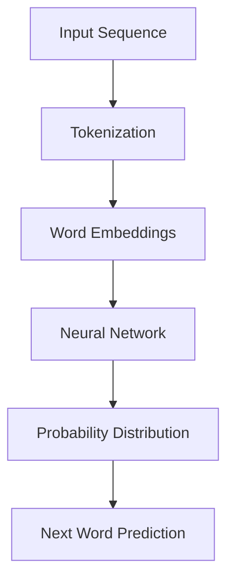

                 

### 文章标题：大规模语言模型在对话系统中的应用与优化

> 关键词：大规模语言模型，对话系统，Transformer，BERT，优化

> 摘要：本文将探讨大规模语言模型在对话系统中的应用及其优化策略，通过分析语言模型的基本原理和算法，结合实际项目案例，深入探讨对话系统的架构设计、模型训练与优化方法，以及在实际应用中的挑战与未来发展趋势。

## 1. 引言

随着人工智能技术的快速发展，对话系统（如聊天机器人、虚拟助手、智能客服等）在各个领域的应用越来越广泛。大规模语言模型作为对话系统的重要组成部分，极大地提升了对话系统的智能化水平和用户体验。本文将围绕大规模语言模型在对话系统中的应用与优化展开讨论，旨在为读者提供全面、深入的技术分析和实战经验。

## 2. 大规模语言模型基础

### 2.1 语言模型的基本概念

语言模型是一种预测模型，它能够根据输入的文本序列预测下一个可能的单词或字符。在大规模语言模型中，我们通常使用神经网络（如循环神经网络RNN、变换器Transformer等）来构建语言模型。

### 2.2 预训练技术

预训练是指在大规模语料库上对语言模型进行预训练，使其具有丰富的语言知识和表达能力。预训练后的语言模型可以进一步在特定任务上进行微调，从而提高任务性能。

### 2.3 Transformer架构

Transformer是近年来提出的一种流行的语言模型架构，它采用自注意力机制（Self-Attention）来处理输入文本序列，使得模型能够在不同位置之间建立强大的依赖关系。

### 2.4 BERT模型详解

BERT（Bidirectional Encoder Representations from Transformers）是Google提出的一种基于Transformer的语言模型，它采用双向编码器来表示输入文本序列，从而提高模型的语义理解能力。

### 2.5 自注意力机制

自注意力机制是一种用于计算输入文本序列中每个单词的加权重要性，从而提高模型对文本的理解能力。自注意力机制的核心思想是利用全局上下文信息来生成文本表示。

### 2.6 位置编码

位置编码是一种用于编码输入文本序列中单词位置信息的技巧。在Transformer模型中，位置编码通过将位置信息编码到词向量中，使得模型能够理解单词的顺序关系。

## 3. 对话系统的架构设计

### 3.1 对话系统概述

对话系统是一种与人类用户进行自然语言交互的计算机系统，它可以理解用户的输入，生成自然语言回复，并根据对话的进展进行上下文管理和任务规划。

### 3.2 用户意图识别

用户意图识别是对话系统的关键环节之一，它负责解析用户输入，确定用户想要完成什么任务。常见的意图识别方法包括基于规则的方法、机器学习方法等。

### 3.3 任务规划与执行

在识别用户意图后，对话系统需要根据意图规划相应的任务，并执行任务。任务规划通常包括确定任务步骤、分配资源等。

### 3.4 对话管理

对话管理负责维护对话的状态和上下文，确保对话的连贯性和流畅性。对话管理包括对话状态跟踪、上下文管理、多轮对话管理等。

### 3.5 问答系统

问答系统是对话系统的一种重要类型，它能够从大量信息中检索出与用户输入相关的答案。问答系统通常采用基于检索的方法和基于生成的方法。

## 4. 数据集与预处理

### 4.1 数据集的选择

选择合适的数据集是构建高质量对话系统的关键。本文将介绍常见的数据集类型和选择标准，以及如何从海量数据中提取高质量数据。

### 4.2 数据预处理技术

数据预处理是构建对话系统的重要步骤，它包括文本清洗、去噪、分词、词向量嵌入等。本文将介绍常见的数据预处理技术，并给出具体的实现方法。

### 4.3 数据增强

数据增强是一种提高对话系统性能的方法，它通过生成更多的训练样本来丰富模型的训练数据。本文将介绍常见的数据增强方法，如对抗样本生成、数据扩充等。

### 4.4 数据可视化

数据可视化是一种直观展示数据分布和关系的方法，它有助于我们更好地理解数据集的特征和缺陷。本文将介绍常见的数据可视化工具和技术。

## 5. 模型的训练与优化

### 5.1 训练过程

训练过程是构建对话系统的核心步骤，它包括数据加载、模型初始化、优化算法选择、训练策略等。本文将介绍常见的训练方法和技巧，如批量训练、梯度下降、学习率调整等。

### 5.2 预训练与微调

预训练与微调是构建对话系统的关键步骤，它通过在大规模语料库上预训练语言模型，然后在特定任务上进行微调，从而提高模型在任务上的性能。本文将介绍预训练与微调的技术细节。

### 5.3 模型优化技术

模型优化技术包括模型压缩、量化、蒸馏等，它旨在提高模型在有限计算资源下的性能。本文将介绍常见的模型优化技术，并给出具体的实现方法。

### 5.4 评估与调试

评估与调试是模型训练过程中不可或缺的步骤，它包括模型性能评估、调试和错误分析等。本文将介绍常见的评估指标和调试方法。

## 6. 模型的部署与优化

### 6.1 部署策略

模型部署是将训练好的模型应用于实际场景的过程，它包括模型选择、部署环境搭建、部署流程等。本文将介绍常见的模型部署策略。

### 6.2 模型压缩与量化

模型压缩与量化是一种提高模型在有限计算资源下性能的方法，它通过减少模型参数数量和降低模型精度来降低计算复杂度和存储需求。本文将介绍常见的模型压缩与量化技术。

### 6.3 模型服务化

模型服务化是将模型集成到应用程序中的过程，它使得模型可以方便地与其他服务进行交互。本文将介绍常见的模型服务化方法。

### 6.4 模型优化案例

本文将结合实际项目案例，详细介绍模型的部署与优化过程，包括环境搭建、代码实现、性能优化等。

## 7. 实际对话系统案例

### 7.1 聊天机器人案例

本文将介绍一个聊天机器人的实现过程，包括数据集选择、模型训练、对话管理、用户反馈等。

### 7.2 虚拟助手案例

本文将介绍一个虚拟助手的实现过程，包括任务规划、对话管理、多轮对话等。

### 7.3 智能客服系统

本文将介绍一个智能客服系统的实现过程，包括用户意图识别、问答系统、对话管理等。

### 7.4 对话系统评估与改进

本文将介绍对话系统的评估方法和改进策略，包括性能指标评估、用户满意度评估等。

## 8. 总结与展望

本文将总结大规模语言模型在对话系统中的应用与优化，探讨当前面临的挑战，并展望未来的发展趋势。

## 附录

### 附录A: 数学模型和公式

本文将列出文中涉及的数学模型和公式，并给出详细解释。

### 附录B: Mermaid流程图

本文将列出相关的Mermaid流程图，用于展示语言模型和对话系统的架构。

### 附录C: 伪代码

本文将列出文中提到的伪代码，用于解释算法原理和实现过程。

### 附录D: 实际代码示例

本文将提供实际代码示例，用于展示对话系统的实现细节。

### 作者信息

作者：AI天才研究院/AI Genius Institute & 禅与计算机程序设计艺术 /Zen And The Art of Computer Programming### 第2章 大规模语言模型基础

#### 2.1 语言模型的基本概念

语言模型（Language Model，简称LM）是自然语言处理（Natural Language Processing，简称NLP）中的一个核心概念。它的主要目的是预测一个序列中下一个可能的单词或字符。在大规模语言模型中，我们通常使用神经网络（如循环神经网络RNN、变换器Transformer等）来构建语言模型。

**核心概念与联系**

要理解语言模型，我们需要了解以下几个核心概念：

1. **词向量（Word Embeddings）**：词向量是将自然语言中的单词映射到高维空间中的向量表示，使得相似单词在向量空间中距离更近。词向量可以基于词袋模型（Bag of Words）、连续词袋模型（Continuous Bag of Words）等方法生成。

2. **神经网络（Neural Networks）**：神经网络是一种模仿人脑神经网络结构和功能的计算模型，它可以用于图像识别、语音识别、自然语言处理等领域。在语言模型中，神经网络用于处理输入的词向量，并生成预测的单词概率。

3. **序列模型（Sequential Models）**：序列模型是一种处理输入序列数据的神经网络模型，如循环神经网络（Recurrent Neural Networks，简称RNN）。RNN可以记住前面的输入信息，并利用这些信息预测下一个输出。

4. **自注意力机制（Self-Attention）**：自注意力机制是一种用于计算输入序列中每个单词的加权重要性，从而提高模型对文本的理解能力。自注意力机制的核心思想是利用全局上下文信息来生成文本表示。

5. **位置编码（Positional Encoding）**：位置编码是一种用于编码输入序列中单词位置信息的技巧。在Transformer模型中，位置编码通过将位置信息编码到词向量中，使得模型能够理解单词的顺序关系。

**Mermaid流程图**

以下是一个简单的Mermaid流程图，展示了语言模型的核心架构：



**数学模型和数学公式**

在构建语言模型时，我们通常使用以下数学模型和公式：

1. **词向量计算**：词向量通常通过以下公式计算：

   $$ \text{vec}(w) = \sum_{i=1}^{N} w_i \times v_i $$

   其中，$w$ 表示单词，$v_i$ 表示词向量，$w_i$ 表示单词中第 $i$ 个特征的出现次数。

2. **神经网络激活函数**：神经网络中的激活函数（如ReLU、Sigmoid、Tanh等）用于将输入映射到输出：

   $$ f(x) = \max(0, x) \quad (\text{ReLU}) $$

   $$ f(x) = \frac{1}{1 + e^{-x}} \quad (\text{Sigmoid}) $$

   $$ f(x) = \tanh(x) \quad (\text{Tanh}) $$

3. **损失函数**：在语言模型训练过程中，我们使用损失函数（如交叉熵损失、均方误差等）来衡量模型预测和真实标签之间的差距：

   $$ \text{Loss} = -\sum_{i=1}^{N} y_i \times \log(\hat{y}_i) $$

   其中，$y_i$ 表示真实标签，$\hat{y}_i$ 表示模型预测的概率分布。

**详细讲解**

在构建语言模型时，我们首先需要对输入的文本序列进行分词（Tokenization），将文本序列转换为一系列的单词或标记。接下来，我们将这些单词或标记转换为词向量（Word Embeddings），以便神经网络能够处理。词向量可以通过预训练模型（如GloVe、Word2Vec等）获取，或者使用随机初始化。

然后，我们将词向量输入到神经网络（Neural Network）中，神经网络通过多个隐藏层对输入进行变换，最终输出一个概率分布（Probability Distribution），表示下一个单词或字符的概率。最后，我们使用损失函数（Loss Function）来计算模型预测和真实标签之间的差距，并通过反向传播（Backpropagation）算法更新网络权重。

**举例说明**

假设我们有一个简单的神经网络语言模型，它包含一个输入层、一个隐藏层和一个输出层。输入层接收词向量，隐藏层通过激活函数（如ReLU）对输入进行变换，输出层使用softmax函数输出概率分布。

假设我们有一个输入序列：“I am going to the store.”。首先，我们将这个序列分词为单词：“I”、“am”、“going”、“to”、“the”、“store”。然后，我们将这些单词转换为词向量，并输入到神经网络中。隐藏层对输入进行变换，得到一个中间表示。最后，输出层输出一个概率分布，表示下一个单词的概率。

例如，对于输出单词“to”，我们可能得到以下概率分布：

$$ \hat{y} = [\hat{y}_1, \hat{y}_2, \hat{y}_3, \hat{y}_4, \hat{y}_5, \hat{y}_6] = [0.1, 0.3, 0.2, 0.2, 0.1, 0.1] $$

其中，$\hat{y}_i$ 表示单词“to”在概率分布中的概率。根据概率分布，我们可以选择概率最大的单词作为预测结果。

**伪代码**

以下是一个简单的伪代码，用于构建一个基于神经网络的简单语言模型：

```python
# 初始化神经网络
input_layer = InputLayer(size=100)
hidden_layer = HiddenLayer(size=50, activation='relu')
output_layer = OutputLayer(size=6, activation='softmax')

# 定义损失函数
loss_function = CrossEntropyLoss()

# 训练神经网络
for epoch in range(num_epochs):
    for sequence in training_data:
        # 分词并转换为词向量
        tokens = tokenize(sequence)
        word_vectors = get_word_vectors(tokens)

        # 前向传播
        hidden_representation = hidden_layer.forward(word_vectors)
        probability_distribution = output_layer.forward(hidden_representation)

        # 计算损失
        loss = loss_function(probability_distribution, true_labels)

        # 反向传播
        output_layer.backward(loss)
        hidden_layer.backward(output_layer.get_gradients())

        # 更新网络权重
        input_layer.update_weights()
        hidden_layer.update_weights()
        output_layer.update_weights()
```

**数学模型和数学公式**

在构建神经网络语言模型时，我们通常会使用以下数学模型和公式：

1. **自注意力机制**：自注意力机制是一种用于计算输入序列中每个单词的加权重要性的方法，它通过以下公式计算：

   $$ \text{Attention}(Q, K, V) = \text{softmax}\left(\frac{QK^T}{\sqrt{d_k}}\right) V $$

   其中，$Q$、$K$ 和 $V$ 分别表示查询向量、关键向量和价值向量，$d_k$ 表示关键向量的维度。

2. **位置编码**：位置编码是一种用于编码输入序列中单词位置信息的技巧，它通常通过以下公式计算：

   $$ \text{PE}(pos, 2d_{\text{model}}) = \sin\left(\frac{pos}{10000^{2i/d_{\text{model}}}}\right) $$

   $$ \text{PE}(pos, 2d_{\text{model}}) = \cos\left(\frac{pos}{10000^{2i/d_{\text{model}}}}\right) $$

   其中，$pos$ 表示位置，$d_{\text{model}}$ 表示模型维度。

3. **Softmax和Logits回归**：在输出层，我们通常使用softmax函数来计算概率分布，并使用logits回归来预测下一个单词：

   $$ \text{softmax}(x) = \frac{e^x}{\sum_{i} e^x_i} $$

   $$ \text{logits} = \text{log}\left(\frac{p(y=c)}{1 - p(y=c)}\right) $$

   其中，$x$ 表示输入特征，$y$ 表示真实标签，$c$ 表示预测标签。

4. **正则化方法**：在训练过程中，我们通常会使用正则化方法（如Dropout、Weight Decay等）来提高模型的泛化能力：

   $$ \text{Dropout}(p) = \frac{1}{1 - p} \sum_{i=1}^{N} (1 - p)^{i} x_i $$

   $$ \text{Weight Decay}(l2) = \frac{\lambda}{2} \sum_{i=1}^{N} \sum_{j=1}^{M} w_{ij}^2 $$

   其中，$p$ 表示丢弃概率，$N$ 和 $M$ 分别表示神经网络的层数和神经元数量，$w_{ij}$ 表示网络权重，$\lambda$ 表示权重衰减系数。

**项目实战**

为了使读者更好地理解大规模语言模型在对话系统中的应用，以下是一个简单的项目实战：

1. **开发环境搭建**：在本地或云服务器上搭建Python开发环境，安装必要的库（如TensorFlow、PyTorch等）。

2. **数据集准备**：选择一个合适的对话系统数据集，如Daily Dialogs或Daily Life Chat。数据集通常包含对话文本和对应的标签（如用户意图、对话主题等）。

3. **数据预处理**：对数据集进行清洗、分词、词向量嵌入等预处理操作。

4. **模型训练**：使用预训练模型（如BERT、GPT等）或自定义模型对数据集进行训练。

5. **模型评估**：使用验证集对模型进行评估，计算指标（如准确率、召回率、F1分数等）。

6. **模型部署**：将训练好的模型部署到服务器上，并提供API接口，以便与其他系统进行集成。

7. **实际案例**：使用实际案例（如聊天机器人、智能客服等）来展示模型的性能和应用场景。

**最佳实践 tips**

1. **数据集选择**：选择高质量、多样化的数据集，有助于提高模型的泛化能力和鲁棒性。

2. **模型优化**：在训练过程中，可以尝试使用不同的优化算法（如Adam、Adagrad等）和超参数（如学习率、批次大小等），以提高模型性能。

3. **模型压缩与量化**：在部署模型时，可以考虑使用模型压缩与量化技术，以减少模型的存储空间和计算复杂度。

4. **持续学习**：对话系统是一个动态发展的领域，需要不断更新和改进模型，以适应新的应用场景和需求。

**小结**

本章介绍了大规模语言模型的基本概念、核心算法原理和数学模型。通过理解语言模型的工作原理，读者可以更好地掌握对话系统的设计、实现和优化方法。在下一章中，我们将进一步探讨大规模语言模型在对话系统中的应用，并介绍实际项目案例。

