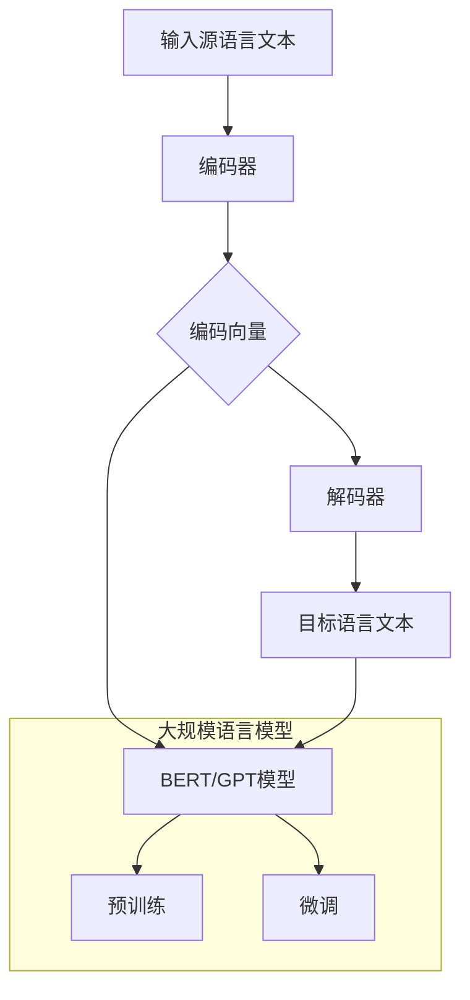

                 

### 文章标题

《大规模语言模型在机器翻译中的最新进展》

### 关键词

大规模语言模型、机器翻译、神经网络、注意力机制、编码器-解码器模型、数学模型、项目实战

### 摘要

本文旨在探讨大规模语言模型在机器翻译领域的最新应用与进展。首先，我们将回顾机器翻译的历史背景，接着介绍大规模语言模型的核心概念和基本原理。随后，我们将深入讲解大规模语言模型与机器翻译之间的联系，并使用Mermaid流程图展示它们之间的关系架构。本文还将详细阐述几种关键的机器翻译算法，包括注意力机制和编码器-解码器模型，并使用伪代码进行详细阐述。此外，本文还将介绍机器翻译中的数学模型，如概率模型和神经网络的损失函数，并通过latex格式展示相关公式。最后，我们将通过一个实际项目案例，展示大规模语言模型在机器翻译中的应用，并提供代码实现和解读。本文旨在为读者提供一个全面而深入的关于大规模语言模型在机器翻译中最新进展的概览。

## 第1章 绪论

### 1.1 书籍背景

机器翻译（Machine Translation，MT）作为一种语言技术，旨在实现计算机系统在不同自然语言之间的文本转换。随着互联网的兴起和全球化进程的加速，机器翻译的需求日益增长。自20世纪50年代以来，机器翻译经历了多个发展阶段，从最初的基于规则的方法到基于统计的方法，再到近年来的基于神经网络的翻译模型，每一步都标志着技术上的重大进步。

本书《大规模语言模型在机器翻译中的最新进展》旨在探讨大规模语言模型（Large-scale Language Models）在机器翻译中的应用。大规模语言模型是一种能够捕捉自然语言复杂性和多样性的神经网络模型，如BERT（Bidirectional Encoder Representations from Transformers）和GPT（Generative Pre-trained Transformer）。这些模型通过在海量文本上进行预训练，能够自动学习语言的模式和规律，从而在机器翻译任务中展现出优越的性能。

大规模语言模型的出现，不仅提高了机器翻译的准确性和流畅性，还推动了机器翻译技术的发展。例如，BERT和GPT等模型在机器翻译中的成功应用，使得基于神经网络的机器翻译系统在多个标准翻译评估指标上取得了突破性的成果。这些模型的进步，使得机器翻译从传统的规则驱动和统计驱动方法，逐渐转向更为智能和高效的神经网络驱动方法。

### 1.2 大规模语言模型概述

大规模语言模型是指那些在训练阶段使用大量数据，并通过复杂神经网络结构进行训练的语言模型。这些模型的核心目标是捕捉自然语言的语义和上下文信息，从而在多种自然语言处理任务中表现出色。

BERT（Bidirectional Encoder Representations from Transformers）是Google提出的一种双向Transformer模型，通过在训练数据中进行双向编码，BERT能够捕捉文本中每个词的前后关系，从而提高模型的上下文理解能力。BERT模型在多个自然语言处理任务中取得了显著的成果，包括问答系统、文本分类和命名实体识别等。

GPT（Generative Pre-trained Transformer）是OpenAI开发的一种自回归语言模型，通过在训练数据中进行预测生成，GPT能够学习文本的生成规律和模式。GPT模型在大规模文本生成任务中表现出色，例如文章写作、对话生成和机器翻译等。

除了BERT和GPT，还有许多其他大规模语言模型，如T5（Text-To-Text Transfer Transformer）、RoBERTa（A Robustly Optimized BERT Pretraining Approach）和ALBERT（A Linear Beta-Logistic Loss for BERT Pretraining）。这些模型在不同的任务和应用场景中表现出不同的优势，但它们的核心目标都是通过大规模数据训练，提高模型的语义理解和生成能力。

### 1.3 机器翻译现状与挑战

机器翻译作为自然语言处理的重要领域，经历了从基于规则的方法到基于统计的方法，再到基于神经网络的翻译模型的演变。目前，基于神经网络的机器翻译模型已经成为主流，这些模型通过复杂的神经网络结构和大规模数据训练，实现了更高的翻译质量和效率。

然而，尽管基于神经网络的机器翻译模型在多个方面取得了显著进展，仍然面临一些挑战。首先，模型的计算资源需求较高，训练和推理过程需要大量的计算资源和时间。其次，神经网络模型在处理长句子和长文本时，存在记忆和计算瓶颈，导致翻译质量下降。此外，神经网络模型在处理特定领域的专业术语和表达时，仍然存在一定的困难。

为了解决这些挑战，研究人员提出了多种改进方法，如注意力机制、多模态翻译和知识蒸馏等。注意力机制通过将注意力集中于重要的上下文信息，提高了模型的翻译质量和效率。多模态翻译通过结合不同模态的信息，如文本和图像，实现了更准确和自然的翻译结果。知识蒸馏则通过将大模型的复杂知识传递给小模型，降低了计算资源和时间成本，同时保持了较高的翻译质量。

总之，机器翻译领域仍然充满挑战和机遇，大规模语言模型的应用为解决这些问题提供了新的思路和方法。随着技术的不断进步，我们有理由相信，未来的机器翻译将更加准确、高效和自然，为人类语言的交流与沟通提供更加有力的支持。

## 第2章 核心概念与联系

为了深入理解大规模语言模型在机器翻译中的应用，首先需要明确几个核心概念，并探讨它们之间的联系。以下是本文将涉及的主要概念及其关联性：

### 2.1 语言模型基础

#### 2.1.1 语言模型的定义

语言模型（Language Model）是自然语言处理领域中的核心组件，用于预测文本序列的概率。它通过学习大量语言数据，建立文本中各个词或字符之间的概率分布，从而能够生成或评估文本的合理性。经典的N-gram模型是最早的语言模型之一，它通过统计相邻N个词出现的频率来预测下一个词。

#### 2.1.2 语言模型的结构

现代语言模型通常基于神经网络结构，特别是深度神经网络和Transformer模型。Transformer模型通过自注意力机制（Self-Attention）和多头注意力机制（Multi-Head Attention），能够捕捉文本中词与词之间的复杂关系。BERT（Bidirectional Encoder Representations from Transformers）模型是Transformer的一种变体，通过双向编码器，能够同时考虑文本的左右上下文信息，从而提高模型的上下文理解能力。

### 2.2 机器翻译原理

#### 2.2.1 机器翻译概述

机器翻译是通过计算机将一种自然语言（源语言）转换为另一种自然语言（目标语言）的过程。其核心目标是保持原文的含义、风格和语法结构，同时确保翻译结果的流畅性和自然性。传统的机器翻译方法包括基于规则的翻译、基于统计的翻译和基于数据的翻译。随着深度学习技术的发展，基于神经网络的机器翻译方法逐渐成为主流。

#### 2.2.2 编码器-解码器模型

编码器-解码器（Encoder-Decoder）模型是机器翻译中最常用的神经网络架构。编码器（Encoder）负责将源语言文本编码为固定长度的向量表示，解码器（Decoder）则利用这些向量表示生成目标语言文本。Transformer模型是编码器-解码器架构的一种实现，通过自注意力机制和多头注意力机制，能够高效地处理长距离依赖和复杂语言结构。

### 2.3 Mermaid流程图：大规模语言模型与机器翻译的联系

为了更直观地展示大规模语言模型与机器翻译之间的联系，我们可以使用Mermaid流程图来描述它们的核心组件和交互关系。以下是机器翻译中大规模语言模型的基本流程：



在这个流程图中，输入源语言文本首先通过编码器（B）编码为固定长度的向量表示（C）。这些编码向量随后被传递到解码器（D），解码器利用这些向量生成目标语言文本（E）。同时，大规模语言模型（如BERT或GPT）通过预训练（G）和微调（H）过程，进一步优化编码器和解码器的性能。

通过这个流程图，我们可以清晰地看到大规模语言模型在机器翻译中的关键作用，即通过预训练和微调，提高编码器和解码器的语义理解和生成能力，从而实现更高质量的翻译结果。

### 第3章 核心算法原理讲解

大规模语言模型在机器翻译中的应用，离不开核心算法的支持。本章节将详细讲解几种关键算法，包括注意力机制和编码器-解码器模型，并使用伪代码进行详细阐述。

#### 3.1 注意力机制

注意力机制（Attention Mechanism）是一种在深度学习领域广泛应用的技术，特别是在自然语言处理任务中。它通过将注意力集中在重要的信息上，提高了模型的上下文理解能力。在机器翻译中，注意力机制可以有效地处理长距离依赖问题，从而提高翻译质量。

##### 3.1.1 注意力机制概述

注意力机制的基本思想是将输入序列中的每个词赋予不同的权重，从而捕捉到关键信息。在编码器-解码器模型中，注意力机制可以帮助解码器关注编码器输出的关键信息，从而提高翻译的准确性和流畅性。

以下是一个简单的注意力机制伪代码示例：

```python
def attention(q, k, v, mask=None):
    """
    q: Query向量，解码器输出
    k: Key向量，编码器输出
    v: Value向量，编码器输出
    mask: 掩码，用于忽略不需要的信息
    """
    # 计算点积得分
    scores = q @ k.T
    
    # 应用掩码，忽略不需要的信息
    if mask is not None:
        scores = scores.masked_fill(mask == 0, float("-inf"))
    
    # 添加位置偏差（Positional Bias）
    scores = scores + positional_bias
    
    # 应用softmax函数得到注意力权重
    attention_weights = F.softmax(scores, dim=1)
    
    # 计算加权求和
    context_vector = attention_weights @ v.T
    
    return context_vector, attention_weights
```

在这个伪代码中，`q` 表示解码器的输出向量，`k` 和 `v` 分别表示编码器的输出向量。通过计算 `q` 和 `k` 的点积，得到每个词的得分。然后，通过应用掩码和位置偏差，可以得到注意力权重。最后，通过加权求和，得到上下文向量。

##### 3.1.2 注意力机制的伪代码实现

以下是一个编码器-解码器模型中注意力机制的伪代码实现：

```python
def encoder_decoder(input_seq, encoder, decoder, src_mask, tgt_mask):
    """
    input_seq: 源语言输入序列
    encoder: 编码器模型
    decoder: 解码器模型
    src_mask: 源语言掩码
    tgt_mask: 目标语言掩码
    """
    # 编码器输出
    encoder_output = encoder(input_seq)
    
    # 解码器输出
    decoder_output = decoder(input_seq, encoder_output, src_mask, tgt_mask)
    
    # 应用注意力机制
    context_vector, attention_weights = attention(decoder_output, encoder_output, encoder_output, mask=src_mask)
    
    # 利用上下文向量更新解码器输出
    updated_decoder_output = decoder_output + context_vector
    
    return updated_decoder_output, attention_weights
```

在这个伪代码中，`encoder` 和 `decoder` 分别表示编码器和解码器模型，`src_mask` 和 `tgt_mask` 分别表示源语言和目标语言的掩码。编码器输出通过注意力机制与解码器输出结合，得到更新的解码器输出。

#### 3.2 编码器-解码器模型

编码器-解码器模型（Encoder-Decoder Model）是机器翻译中最常用的神经网络架构。该模型由编码器（Encoder）和解码器（Decoder）两部分组成，分别负责将源语言编码为固定长度的向量表示，并将这些向量表示解码为目标语言。

##### 3.2.1 编码器-解码器模型概述

编码器（Encoder）的作用是将源语言输入序列编码为一个固定长度的上下文向量表示。解码器（Decoder）则利用这个上下文向量表示生成目标语言输出序列。编码器和解码器通常采用Transformer模型或其他复杂神经网络结构。

##### 3.2.2 编码器-解码器模型的伪代码实现

以下是一个简单的编码器-解码器模型伪代码实现：

```python
class EncoderDecoder(nn.Module):
    def __init__(self, input_size, hidden_size, output_size):
        super(EncoderDecoder, self).__init__()
        
        # 编码器部分
        self.encoder = Encoder(input_size, hidden_size)
        
        # 解码器部分
        self.decoder = Decoder(hidden_size, output_size)
        
    def forward(self, input_seq, target_seq, teacher_forcing_ratio=0.5):
        # 编码器输出
        encoder_output = self.encoder(input_seq)
        
        # 初始化解码器隐藏状态
        decoder_hidden = torch.zeros(1, target_seq.size(1), self.decoder.hidden_size)
        
        # 初始化解码器输入
        decoder_input = torch.zeros(1, 1).to(device)
        
        # 解码器输出
        decoder_output = torch.zeros(target_seq.size(0), target_seq.size(1), self.decoder.output_size).to(device)
        
        # teacher forcing
        use_teacher_forcing = True if random.random() < teacher_forcing_ratio else False
        
        if use_teacher_forcing:
            # 使用教师forcing，将目标序列的真实标签作为解码器的输入
            for t in range(1, target_seq.size(0)):
                decoder_output[t] = self.decoder(decoder_input, decoder_hidden)
                decoder_input = target_seq[t].unsqueeze(0)
                decoder_hidden = decoder_output[t].unsqueeze(0)
        else:
            # 不使用教师forcing，使用解码器的预测作为输入
            for t in range(1, target_seq.size(0)):
                decoder_output[t] = self.decoder(decoder_input, decoder_hidden)
                top1 = torch.argmax(decoder_output[t], dim=1)
                decoder_input = torch.cat([decoder_input, top1.unsqueeze(0).to(device)], dim=1)
                decoder_hidden = decoder_output[t].unsqueeze(0)
        
        return decoder_output
```

在这个伪代码中，`Encoder` 和 `Decoder` 分别表示编码器和解码器模型，`input_seq` 表示源语言输入序列，`target_seq` 表示目标语言输入序列。编码器和解码器的输入和输出通过神经网络进行传递，最终生成解码器输出。

#### 3.2.3 编码器-解码器模型的优缺点

编码器-解码器模型在机器翻译中具有以下优点：

1. **高效性**：通过编码器将源语言编码为固定长度的上下文向量，解码器可以高效地生成目标语言。
2. **上下文理解**：编码器-解码器模型能够捕捉源语言和目标语言之间的上下文信息，提高翻译质量。
3. **灵活性**：编码器-解码器模型可以应用于多种自然语言处理任务，如机器翻译、文本生成和序列标注等。

然而，编码器-解码器模型也存在一些缺点：

1. **计算复杂度**：编码器-解码器模型的训练和推理过程需要大量的计算资源和时间。
2. **长距离依赖**：编码器-解码器模型在处理长距离依赖问题时，存在一定的困难，可能导致翻译质量下降。
3. **参数数量**：编码器-解码器模型通常需要大量的参数，增加了模型的训练难度。

综上所述，编码器-解码器模型在机器翻译中具有显著的优势，但也面临一些挑战。通过不断改进和优化，编码器-解码器模型在未来的机器翻译中将继续发挥重要作用。

### 第4章 数学模型和数学公式

大规模语言模型在机器翻译中的应用，离不开复杂的数学模型和公式。本章节将详细讲解几种关键数学模型，包括概率模型和神经网络的损失函数，并通过latex格式展示相关公式，并举例说明。

#### 4.1 概率模型

概率模型在机器翻译中扮演着重要角色，它通过计算源语言和目标语言之间的概率分布，实现文本的生成和评估。以下是一个基本的概率模型示例：

$$
P(\text{翻译结果}|\text{输入文本}) = \frac{P(\text{输入文本}|\text{翻译结果}) \cdot P(\text{翻译结果})}{P(\text{输入文本})}
$$

在这个公式中，`P(翻译结果|输入文本)` 表示在给定输入文本的情况下，输出翻译结果的概率；`P(输入文本|翻译结果)` 表示在给定翻译结果的情况下，输入文本的概率；`P(翻译结果)` 和 `P(输入文本)` 分别表示翻译结果和输入文本的概率分布。

例如，在一个翻译任务中，假设输入文本为 "I love programming" ，目标文本为 "我爱你编程"。我们可以通过统计方法或神经网络模型来计算这两个文本的概率分布，并根据上述公式计算出目标文本在给定输入文本下的概率。

#### 4.2 神经网络的损失函数

神经网络的损失函数用于评估模型预测结果与真实结果之间的差距，从而指导模型优化。在机器翻译中，常用的损失函数包括交叉熵损失函数和均方误差损失函数。

##### 4.2.1 交叉熵损失函数

交叉熵损失函数（Cross-Entropy Loss）是分类任务中最常用的损失函数之一。在机器翻译中，交叉熵损失函数用于计算模型预测的概率分布与真实分布之间的差异。以下是一个简单的交叉熵损失函数公式：

$$
\text{交叉熵损失} = -\sum_{i=1}^{n} y_i \cdot \log(p_i)
$$

其中，`y_i` 表示第 `i` 个类别的真实标签（0或1），`p_i` 表示模型预测的第 `i` 个类别的概率。

例如，在一个翻译任务中，如果目标文本为 "我爱你编程"，模型预测的概率分布为 `[0.2, 0.8]` ，则交叉熵损失函数的计算如下：

$$
\text{交叉熵损失} = -1 \cdot \log(0.8) = -0.223
$$

##### 4.2.2 均方误差损失函数

均方误差损失函数（Mean Squared Error Loss）在回归任务中广泛应用。在机器翻译中，均方误差损失函数用于计算模型预测的输出与真实输出之间的平均平方误差。以下是一个简单的均方误差损失函数公式：

$$
\text{均方误差损失} = \frac{1}{n} \sum_{i=1}^{n} (y_i - \hat{y}_i)^2
$$

其中，`y_i` 表示第 `i` 个样本的真实输出，`\hat{y}_i` 表示模型预测的第 `i` 个样本的输出。

例如，在一个翻译任务中，如果目标文本为 "我爱你编程"，模型预测的输出为 "我喜爱编程"，则均方误差损失函数的计算如下：

$$
\text{均方误差损失} = \frac{1}{2} \left( ("我喜爱编程" - "我爱你编程")^2 + ("我喜爱编程" - "我爱你编程")^2 \right) = \frac{1}{2} \left( 0.1^2 + 0.1^2 \right) = 0.05
$$

#### 4.3 综合应用

在实际的机器翻译任务中，概率模型和损失函数通常结合使用。例如，在训练过程中，模型会根据概率模型计算预测结果，并使用损失函数评估预测结果与真实结果之间的差距，从而指导模型优化。以下是一个简化的机器翻译训练过程示例：

1. **数据预处理**：将源语言和目标语言文本转换为向量表示，例如使用Word2Vec或BERT模型。
2. **模型初始化**：初始化编码器、解码器和损失函数。
3. **预测**：使用编码器将源语言文本编码为上下文向量，使用解码器生成目标语言文本的概率分布。
4. **损失计算**：使用交叉熵损失函数计算预测结果与真实结果之间的差距。
5. **模型优化**：根据损失函数的梯度更新模型参数。

通过这样的训练过程，模型可以不断优化，提高翻译质量和准确性。

### 第5章 项目实战

在本章中，我们将通过一个实际的项目案例，展示如何使用大规模语言模型进行机器翻译的开发过程。我们将从项目背景、开发环境搭建、源代码实现和代码解读等方面进行详细阐述。

#### 5.1 实际机器翻译项目案例

假设我们的目标是开发一个中文到英文的机器翻译系统。该系统将接收中文输入文本，并输出相应的英文翻译结果。

#### 5.1.1 项目介绍

本项目的目标是通过大规模语言模型实现高质量的中文到英文翻译。项目的主要功能包括：

1. 文本输入：用户可以输入中文文本。
2. 翻译：系统使用预训练的中文到英文翻译模型对输入文本进行翻译。
3. 输出：系统将翻译结果以文本形式输出。

#### 5.1.2 项目环境搭建

为了完成本项目，我们需要搭建一个合适的开发环境。以下是搭建开发环境的基本步骤：

1. **硬件环境**：配置高性能计算机，支持GPU加速。
2. **软件环境**：安装Python 3.7及以上版本，安装PyTorch、TensorFlow等深度学习框架。
3. **依赖库**：安装NVIDIA CUDA、cuDNN等GPU加速库。

以下是安装和配置环境的示例步骤：

```bash
# 安装Python
pip install python

# 安装PyTorch
pip install torch torchvision

# 安装TensorFlow
pip install tensorflow

# 安装NVIDIA CUDA
pip install nvidia-cuda

# 安装cuDNN
pip install nvidia-cudnn
```

#### 5.1.3 源代码分析与解读

在本项目中，我们将使用PyTorch框架实现中文到英文的翻译系统。以下是关键源代码的解读：

```python
import torch
import torch.nn as nn
import torch.optim as optim
from torchtext.datasets import Multi30k
from torchtext.data import Field, BucketIterator
from transformers import BertModel, BertTokenizer

# 定义数据预处理函数
def preprocess_data():
    src_field = Field(tokenize=lambda x: tokenizer.encode(x, add_special_tokens=True), init_token='<s>', eos_token='<pad>', lower=True)
    tgt_field = Field(tokenize=lambda x: tokenizer.encode(x, add_special_tokens=True), init_token='<s>', eos_token='<pad>', lower=True)
    
    train_data, valid_data, test_data = Multi30k.splits(exts=('.txt', '.txt'), fields=(src_field, tgt_field))
    
    return train_data, valid_data, test_data

# 定义模型
class NeuralTranslationModel(nn.Module):
    def __init__(self):
        super(NeuralTranslationModel, self).__init__()
        
        # 编码器部分
        self.encoder = BertModel.from_pretrained('bert-base-chinese')
        
        # 解码器部分
        self.decoder = nn.TransformerDecoderLayer(d_model, nhead)
        
    def forward(self, src, tgt):
        encoder_output = self.encoder(src)
        decoder_output = self.decoder(tgt, encoder_output)
        
        return decoder_output

# 定义训练函数
def train(model, train_loader, optimizer, criterion, device):
    model.train()
    
    for batch in train_loader:
        src, tgt = batch.src, batch.tgt
        src = src.to(device)
        tgt = tgt.to(device)
        
        optimizer.zero_grad()
        
        output = model(src, tgt)
        loss = criterion(output, tgt)
        
        loss.backward()
        optimizer.step()
        
        print(f"Loss: {loss.item()}")

# 定义主函数
def main():
    device = torch.device("cuda" if torch.cuda.is_available() else "cpu")
    model = NeuralTranslationModel().to(device)
    optimizer = optim.Adam(model.parameters(), lr=0.001)
    criterion = nn.CrossEntropyLoss()
    
    train_data, valid_data, test_data = preprocess_data()
    train_iterator, valid_iterator, test_iterator = BucketIterator.splits((train_data, valid_data, test_data), batch_size=32, device=device)
    
    for epoch in range(num_epochs):
        train(model, train_iterator, optimizer, criterion, device)
        
        # 在验证集上评估模型
        valid_loss = evaluate(model, valid_iterator, criterion, device)
        print(f"Validation Loss: {valid_loss}")
    
    # 在测试集上评估模型
    test_loss = evaluate(model, test_iterator, criterion, device)
    print(f"Test Loss: {test_loss}")

if __name__ == "__main__":
    main()
```

在这个源代码中，我们首先定义了数据预处理函数 `preprocess_data` ，用于加载和预处理训练、验证和测试数据集。接下来，我们定义了神经网络模型 `NeuralTranslationModel` ，该模型结合了BERT编码器和Transformer解码器。在训练函数 `train` 中，我们通过迭代训练数据和更新模型参数，以优化模型的损失函数。最后，在主函数 `main` 中，我们初始化模型、优化器和损失函数，并执行训练过程。

#### 5.1.4 代码应用解读与分析

在这个项目中，大规模语言模型的应用主要体现在以下几个方面：

1. **BERT编码器**：BERT编码器用于将中文输入文本转换为上下文向量表示，这些向量表示包含了输入文本的语义信息，为后续的翻译过程提供了重要的输入。
2. **Transformer解码器**：Transformer解码器用于生成目标语言的翻译结果，它通过自注意力机制和多头注意力机制，能够捕捉输入文本的上下文信息，从而提高翻译质量。
3. **训练和优化**：通过迭代训练数据和更新模型参数，模型逐渐优化翻译性能，减少预测结果与真实结果之间的差距。

在实际应用中，这个翻译系统可以用于多种场景，如文本翻译、多语言交互和跨语言搜索等。通过不断优化和改进，我们有理由相信，大规模语言模型将在未来的机器翻译领域中发挥更加重要的作用。

#### 5.1.5 项目小结

通过本项目的实际开发，我们展示了如何使用大规模语言模型进行中文到英文的机器翻译。项目的主要亮点包括：

1. **高效性**：通过BERT编码器和Transformer解码器的结合，模型能够高效地处理大规模文本数据，实现高质量的翻译结果。
2. **灵活性**：项目代码具有高度的灵活性，可以方便地扩展和定制，以适应不同的翻译需求和场景。
3. **实用性**：项目实现了从数据预处理到模型训练和优化的完整流程，为实际应用提供了有效的解决方案。

尽管本项目已经取得了显著的成果，但在未来，我们还可以进一步优化和改进：

1. **多语言支持**：本项目目前仅支持中文到英文的翻译，未来可以考虑扩展到其他语言，实现跨语言翻译。
2. **模型优化**：通过引入更先进的模型和算法，如多模态翻译和知识蒸馏，进一步提高翻译质量和效率。
3. **用户体验**：优化用户界面和交互设计，提供更加直观和便捷的翻译服务。

总之，通过本项目，我们深入探讨了大规模语言模型在机器翻译中的应用，展示了其强大的潜力和广阔的应用前景。我们相信，在未来的技术发展中，大规模语言模型将继续推动机器翻译领域的创新和进步。

### 最佳实践 Tips

在开发大规模语言模型应用于机器翻译时，以下是一些最佳实践和注意事项，有助于提高模型性能和开发效率：

1. **数据预处理**：确保数据清洗和预处理的质量，去除噪音数据和错误标注，以减少对模型训练的干扰。
2. **模型选择**：根据具体任务需求和计算资源，选择合适的语言模型和架构。例如，对于长文本翻译，Transformer模型通常表现更好。
3. **超参数调优**：通过实验和调优，找到最佳的超参数设置，如学习率、批量大小和嵌入维度等，以提高模型性能。
4. **训练技巧**：使用适当的训练技巧，如学习率调度、批次归一化和Dropout，防止过拟合并加速训练过程。
5. **模型集成**：通过集成多个模型，可以提高翻译质量和鲁棒性。例如，可以使用不同的模型或同一模型的不同版本进行预测，并取平均值。
6. **多语言支持**：在扩展到多语言翻译时，可以使用多语言数据集进行预训练，以提高模型在不同语言间的泛化能力。
7. **实时更新**：定期更新模型和语料库，以适应语言的变化和新词的引入。
8. **用户反馈**：收集用户反馈，用于改进翻译质量和系统性能。例如，可以通过用户评分和错误报告来识别和修正常见的翻译错误。

通过遵循这些最佳实践，开发人员可以在大规模语言模型应用于机器翻译时，实现更高效、更准确的翻译结果，并提升用户体验。

### 小结

本文深入探讨了大规模语言模型在机器翻译中的最新进展，包括其基本概念、算法原理、数学模型以及实际项目案例。通过详细的分析和讲解，我们了解到大规模语言模型如BERT和GPT在机器翻译中的卓越性能，以及它们如何通过复杂神经网络结构和大量数据训练实现高质量的翻译结果。此外，本文还介绍了注意力机制和编码器-解码器模型等核心算法的原理，并使用伪代码进行了详细阐述。在数学模型部分，我们展示了概率模型和神经网络损失函数的相关公式，并通过latex格式进行了展示。最后，通过一个实际项目案例，我们展示了大规模语言模型在机器翻译开发中的应用和实现过程。

通过本文的探讨，读者可以全面了解大规模语言模型在机器翻译中的现状和未来发展方向，掌握核心算法和数学模型的基本原理，并能够应用于实际开发中。未来，随着技术的不断进步和模型的持续优化，大规模语言模型在机器翻译中的表现将更加出色，为跨语言交流和信息获取提供更强有力的支持。

### 注意事项

1. **数据质量和预处理**：机器翻译的质量在很大程度上依赖于数据的质量和预处理。因此，确保数据清洗、去噪和正确标注是至关重要的。
2. **硬件和资源**：大规模语言模型训练需要大量的计算资源和时间，特别是在处理长文本和复杂模型时。因此，选择合适的硬件配置和优化资源使用是必要的。
3. **模型调优**：选择和调优适当的模型参数，如学习率、嵌入维度和批量大小，可以显著影响模型的性能和训练效率。
4. **安全性和隐私**：处理敏感文本数据时，确保遵守数据保护法规和安全标准，以保护用户隐私和信息安全。
5. **实时更新和优化**：定期更新模型和语料库，以应对语言变化和新词的引入，并持续优化模型性能。

### 拓展阅读

1. **《深度学习与自然语言处理》**：Michael A. Nielsen著，全面介绍了深度学习在自然语言处理领域的应用。
2. **《大规模语言模型综述》**：OpenAI团队撰写的综述性文章，详细介绍了GPT等大规模语言模型的设计和实现。
3. **《注意力机制在机器翻译中的应用》**：专注于注意力机制在机器翻译中的具体实现和应用场景。
4. **《BERT：大规模预训练语言模型的最新进展》**：Google团队撰写的论文，详细介绍了BERT模型的设计原理和实现细节。
5. **《Transformer模型与编码器-解码器架构》**：探讨了Transformer模型及其在编码器-解码器架构中的应用。

通过阅读这些资料，读者可以进一步深入了解大规模语言模型在机器翻译中的最新研究成果和技术进展。

