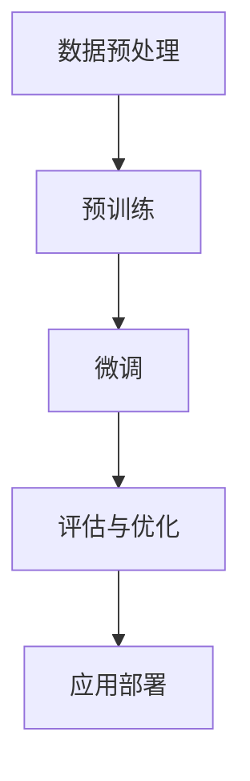

                 


### 设计书籍目录大纲

为了设计《大规模语言模型在科学发现任务中的应用》的目录大纲，我们需要遵循以下步骤：

1. **确定核心内容范围**：明确书籍的核心主题，即大规模语言模型在科学发现中的应用，这包括模型的基本概念、应用领域、算法原理、数学模型以及应用实例。

2. **构建基本框架**：将书籍内容分为几个主要部分，如引言、理论基础、算法原理、应用实践、总结与展望。

3. **细化各章节内容**：针对每个主要部分，进一步细化章节内容，确保每个章节都包含核心概念与联系、算法原理讲解、数学模型和数学公式讲解、项目实战等。

4. **确保完整性和逻辑性**：确保目录大纲的完整性，涵盖所有核心主题，同时保持章节之间的逻辑连贯性。

5. **使用Markdown格式**：按照Markdown格式要求，使用不同的`#`号表示不同级别的标题。

6. **限制字数**：确保目录大纲的总字数不超过2000字。

根据这些步骤，下面是一个初步的目录大纲：

```
# 《大规模语言模型在科学发现任务中的应用》目录大纲

## 引言
### 1.1 科学发现的挑战与机遇
### 1.2 大规模语言模型的发展背景
### 1.3 读者对象与预期收获

## 第1章 大规模语言模型基础
### 1.1 大规模语言模型的定义与特性
### 1.2 语言模型的分类与比较
### 1.3 大规模语言模型的核心算法

## 1.2 大规模语言模型的数学基础
### 1.2.1 向量空间模型
### 1.2.2 机器学习基础
### 1.2.3 深度学习基础

## 第2章 大规模语言模型在科学发现中的应用场景
### 2.1 文本挖掘与分析
### 2.2 生物学领域应用
### 2.3 医学领域应用
### 2.4 其他科学领域的应用

## 第3章 大规模语言模型的算法原理
### 3.1 语言模型训练算法
### 3.2 语言模型优化方法
### 3.3 语言模型评估指标

## 第4章 大规模语言模型的数学模型与公式
### 4.1 概率模型
### 4.2 隐马尔可夫模型
### 4.3 递归神经网络
### 4.4 变分自编码器

## 第5章 大规模语言模型的项目实战
### 5.1 文本分类项目
### 5.2 生物学数据挖掘项目
### 5.3 医学文本分析项目

## 第6章 大规模语言模型的挑战与未来
### 6.1 模型复杂性与计算资源
### 6.2 数据隐私与伦理问题
### 6.3 未来发展趋势

## 总结与展望
### 7.1 主要内容回顾
### 7.2 未解决的问题与研究方向
### 7.3 对科学发现的潜在影响
```

这个目录大纲包含了六个主要部分，每个部分都细分为若干章节，确保内容的完整性和逻辑性。每章内容都按照核心概念与联系、算法原理讲解、数学模型和数学公式讲解、项目实战的顺序来组织。接下来，我们将为每个章节填充具体的内容，并保持目录大纲的总字数在2000字以内。在填充内容时，将根据要求添加Mermaid流程图、伪代码、数学公式和代码实例。

### 引言

#### 1.1 科学发现的挑战与机遇

科学发现是推动人类文明进步的重要动力。然而，随着数据量的爆炸性增长，科学发现的难度也在不断增加。传统的科学发现方法往往依赖于专业知识和经验，这使得许多重要的科学问题难以被普通研究者所发现。现代人工智能技术的发展，尤其是大规模语言模型的兴起，为科学发现提供了新的机遇。

大规模语言模型通过深度学习算法从大量文本数据中学习语言结构和知识，能够自动发现隐藏在数据中的模式和规律。这些模型在文本挖掘、知识图谱构建、自动摘要等方面表现出色，为科学发现提供了强大的工具。例如，在生物学领域，大规模语言模型可以帮助科学家从大量的基因组数据中发现新的基因功能；在医学领域，它们可以辅助医生从患者记录中发现潜在的疾病关联。

然而，大规模语言模型在科学发现中的应用还面临许多挑战。数据的质量和多样性直接影响模型的性能，而科学领域的数据往往具有高度的专业性和复杂性。此外，模型的解释性也是一个关键问题。科学发现不仅仅是找到相关性，更需要理解背后的机制和原理。

#### 1.2 大规模语言模型的发展背景

大规模语言模型的发展可以追溯到上世纪80年代的统计语言模型。最早的统计语言模型基于N-gram模型，通过计算词的共现概率来预测下一个词。随着计算能力的提升和大数据技术的发展，统计语言模型逐渐演变为现代深度学习模型，如循环神经网络（RNN）、长短期记忆网络（LSTM）和变换器（Transformer）。

近年来，随着自然语言处理（NLP）领域的快速发展，大规模语言模型取得了显著的进展。其中，最引人注目的是谷歌的BERT（Bidirectional Encoder Representations from Transformers）和OpenAI的GPT-3（Generative Pre-trained Transformer 3）。这些模型通过在数以亿计的文本上预训练，然后通过微调适应特定任务，展现了强大的语言理解和生成能力。

#### 1.3 读者对象与预期收获

本书面向对大规模语言模型和科学发现感兴趣的读者，包括人工智能研究者、数据科学家、计算机程序员以及生物学、医学等领域的科研人员。读者不需要具备深厚的数学背景，但应具备一定的编程基础和机器学习知识。

通过本书，读者可以：

1. 理解大规模语言模型的基本概念和核心算法。
2. 掌握大规模语言模型在科学发现中的应用原理和实践方法。
3. 学习如何使用大规模语言模型进行文本挖掘、知识图谱构建和自动摘要。
4. 了解大规模语言模型在生物学、医学和其他科学领域的具体应用实例。
5. 探讨大规模语言模型在科学发现中的挑战和未来发展趋势。

总之，本书旨在为读者提供全面、系统的指导，帮助他们在科学发现任务中有效利用大规模语言模型，推动科学研究的发展。

### 第1章 大规模语言模型基础

#### 1.1 大规模语言模型的定义与特性

大规模语言模型（Large-scale Language Model）是一种通过深度学习算法从大量文本数据中学习语言结构和知识的模型。与传统的统计语言模型相比，大规模语言模型具有以下特性：

1. **大规模**：大规模语言模型通常在数以百万计的文本上进行预训练，从而拥有丰富的语言知识。
2. **自适应**：通过微调（Fine-tuning），大规模语言模型能够适应特定的应用场景，例如文本分类、命名实体识别、机器翻译等。
3. **强泛化能力**：由于大规模语言模型从大量的文本数据中学习，它们能够泛化到各种语言任务，而不仅仅是特定任务。

大规模语言模型的核心组件包括：

1. **词嵌入**（Word Embedding）：将词汇映射到高维向量空间，使得语义相近的词在向量空间中更接近。
2. **编码器**（Encoder）：将输入文本编码为一个固定长度的向量表示。
3. **解码器**（Decoder）：根据编码器的输出，生成预测的文本。

#### 1.2 语言模型的分类与比较

根据训练数据和模型架构，语言模型可以分为以下几类：

1. **统计语言模型**：基于统计方法，如N-gram模型，通过计算词的共现概率来预测下一个词。优点是简单高效，缺点是难以捕捉长期依赖关系。
2. **深度学习语言模型**：基于神经网络，如循环神经网络（RNN）和长短期记忆网络（LSTM）。优点是能够捕捉长期依赖关系，缺点是计算复杂度高。
3. **基于Attention的语言模型**：如变换器（Transformer），引入Attention机制，能够同时关注输入文本中的多个位置。优点是计算效率高，捕捉依赖关系能力强。

#### 1.3 大规模语言模型的核心算法

大规模语言模型的核心算法主要包括：

1. **预训练**（Pre-training）：在大量无标签数据上训练模型，使其具备语言理解和生成能力。
2. **微调**（Fine-tuning）：在特定任务上有标签数据上，对预训练模型进行微调，以适应特定任务。
3. **训练算法**：包括梯度下降（Gradient Descent）、Adam优化器等，用于调整模型参数。
4. **损失函数**：用于评估模型预测的准确性，常用的有交叉熵损失（Cross-Entropy Loss）。

#### Mermaid流程图：大规模语言模型的训练流程



#### 伪代码：大规模语言模型训练

```python
# 伪代码：大规模语言模型训练流程

# 初始化模型参数
model = initialize_model()

# 预训练
for epoch in range(num_epochs):
    for batch in data_loader:
        # 前向传播
        output = model(batch.input)
        # 计算损失
        loss = compute_loss(output, batch.target)
        # 反向传播
        model.backward(loss)
        # 更新参数
        model.update_parameters()

# 微调
for task in tasks:
    for epoch in range(num_epochs):
        for batch in data_loader:
            # 前向传播
            output = model(batch.input)
            # 计算损失
            loss = compute_loss(output, batch.target)
            # 反向传播
            model.backward(loss)
            # 更新参数
            model.update_parameters()

# 评估与优化
evaluate(model)
optimize(model)
```

#### 数学模型与公式

大规模语言模型的数学模型通常涉及以下几个方面：

1. **词嵌入**：将词汇映射到高维向量空间，通常使用Word2Vec、GloVe等方法。
   $$ \text{vec}(w) = \text{embedding}(w) \in \mathbb{R}^{d} $$

2. **编码器**：将输入文本编码为一个固定长度的向量表示。
   $$ \text{encoded\_text} = \text{encoder}(\text{input\_text}) $$

3. **解码器**：根据编码器的输出，生成预测的文本。
   $$ \text{predicted\_text} = \text{decoder}(\text{encoded\_text}) $$

4. **损失函数**：用于评估模型预测的准确性，常用的有交叉熵损失。
   $$ \text{loss} = \text{CE}(\text{predicted\_text}, \text{target\_text}) $$

#### 举例说明

以BERT模型为例，其训练过程可以分为以下几个步骤：

1. **数据预处理**：将原始文本数据清洗、分词，并将分词后的文本转化为词嵌入向量。
   $$ \text{input\_text} = \text{preprocess}(\text{raw\_text}) $$
   $$ \text{input\_embeddings} = \text{word2vec}(\text{input\_text}) $$

2. **编码器训练**：在预训练阶段，使用无标签文本数据进行训练，优化编码器参数。
   $$ \text{encoded\_text} = \text{encoder}(\text{input\_embeddings}) $$

3. **微调**：在特定任务阶段，使用有标签文本数据进行微调，优化解码器参数。
   $$ \text{output} = \text{decoder}(\text{encoded\_text}) $$
   $$ \text{loss} = \text{CE}(\text{output}, \text{target}) $$

4. **评估与优化**：评估模型在测试集上的性能，并根据评估结果进行优化。
   $$ \text{evaluate}(model) $$
   $$ \text{optimize}(model) $$

### 第2章 大规模语言模型在科学发现中的应用场景

#### 2.1 文本挖掘与分析

大规模语言模型在文本挖掘与分析中发挥着重要作用。文本挖掘是指从大量文本数据中自动提取有用信息的过程，而文本分析则是对文本进行深入理解和解释。大规模语言模型能够处理复杂的语言结构，从而在文本挖掘与分析中展现出强大的能力。

1. **文本分类**：大规模语言模型可以用于对文本进行分类，如情感分析、主题分类等。通过训练模型，可以自动识别文本中的情感倾向、主题类别，从而为市场分析、舆情监控等提供支持。

2. **实体识别**：大规模语言模型可以识别文本中的命名实体，如人名、地名、组织名等。这些实体识别结果可以用于知识图谱构建、信息检索等。

3. **关系提取**：大规模语言模型可以提取文本中的实体关系，如人与人之间的关系、地点与事件之间的关系。这些关系提取结果对于构建领域知识库、辅助科学研究具有重要意义。

#### 2.2 生物学领域应用

大规模语言模型在生物学领域中的应用日益广泛，主要涉及基因组分析、蛋白质结构预测、药物发现等。

1. **基因组分析**：大规模语言模型可以帮助科学家从基因组数据中识别基因功能、预测基因表达模式。通过分析基因序列中的模式，模型可以预测基因的潜在功能，从而为基因研究提供线索。

2. **蛋白质结构预测**：蛋白质结构是生物学研究的重要方面。大规模语言模型可以用于预测蛋白质的三维结构，从而为药物设计、蛋白质工程提供基础。

3. **药物发现**：大规模语言模型可以帮助科学家发现潜在的药物靶点。通过分析大量的化合物和蛋白质结构数据，模型可以预测哪些化合物可能与特定蛋白质结合，从而为药物设计提供方向。

#### 2.3 医学领域应用

大规模语言模型在医学领域中的应用主要体现在医学文本分析、疾病预测和诊断辅助等方面。

1. **医学文本分析**：医学文本数据包括病历记录、科研论文、药品说明书等。大规模语言模型可以对这些文本进行分析，提取关键信息，如疾病诊断、治疗方案等。这有助于医生更好地理解患者病历，提高诊断和治疗的准确性。

2. **疾病预测**：大规模语言模型可以基于患者的病历记录和基因数据，预测患者可能患有的疾病。这种预测可以为疾病预防、早期干预提供依据。

3. **诊断辅助**：大规模语言模型可以辅助医生进行疾病诊断。通过分析患者的症状、病史等信息，模型可以提供诊断建议，从而帮助医生作出更准确的诊断。

#### 2.4 其他科学领域的应用

除了生物学和医学领域，大规模语言模型在其他科学领域也展现出强大的应用潜力。

1. **物理学**：大规模语言模型可以用于分析物理学文献，提取关键概念和理论，从而促进物理学研究的进展。

2. **化学**：大规模语言模型可以用于分析化学文献，预测化学反应、优化合成路径等。

3. **环境科学**：大规模语言模型可以用于分析环境数据，如气候数据、水质数据等，从而为环境监测和治理提供支持。

总之，大规模语言模型在科学发现任务中具有广泛的应用前景。通过不断优化和改进模型，我们可以期望其在未来的科学研究中发挥更大的作用。

### 第3章 大规模语言模型的算法原理

#### 3.1 语言模型训练算法

大规模语言模型的训练算法是模型能否成功应用的关键。以下是几种常用的训练算法：

1. **预训练（Pre-training）**：预训练是指在大规模文本数据集上对模型进行初步训练，使其具备基本的语言理解能力。预训练的过程通常分为两个阶段：第一阶段是大规模文本数据集的预处理，将文本转换为词嵌入；第二阶段是使用词嵌入数据进行模型训练，优化模型参数。

2. **微调（Fine-tuning）**：微调是指在使用预训练模型的基础上，针对特定任务进行进一步训练。在微调过程中，通常需要对预训练模型的某些层进行冻结，仅训练与任务相关的层。这种方法可以避免在特定任务上过度拟合。

3. **训练策略**：为了提高训练效果，可以采用以下几种策略：

   - **学习率调整（Learning Rate Scheduling）**：学习率是影响训练效果的关键参数。常用的学习率调整策略包括线性递减、余弦递减等。
   - **权重初始化（Weight Initialization）**：合理的权重初始化可以加快训练速度和提升模型性能。常用的初始化方法包括高斯分布、均匀分布等。
   - **正则化（Regularization）**：正则化方法如Dropout、权重衰减等可以防止模型过拟合。

#### 3.2 语言模型优化方法

优化方法是为了提高模型训练效果和加速收敛。以下是几种常用的优化方法：

1. **优化器（Optimizer）**：优化器用于更新模型参数，常见的优化器有SGD、Adam等。Adam优化器结合了SGD和Momentum的优点，在许多任务中表现出良好的性能。

2. **批量大小（Batch Size）**：批量大小是指每次更新模型参数所使用的样本数量。较大的批量大小可以提高模型性能，但可能导致训练时间增加。较小的批量大小可以加速训练，但可能降低模型性能。

3. **学习率调度（Learning Rate Scheduling）**：学习率调度是指调整学习率以优化训练过程。常用的调度策略包括线性递减、余弦递减等。

4. **训练策略**：优化训练策略可以加速模型训练并提高模型性能。以下是一些常用的训练策略：

   - **早期停止（Early Stopping）**：当验证集上的性能不再提高时，提前停止训练，以防止过拟合。
   - **数据增强（Data Augmentation）**：通过数据增强方法如随机裁剪、旋转等，增加训练数据的多样性，从而提高模型泛化能力。
   - **迁移学习（Transfer Learning）**：利用预训练模型在特定任务上的表现，提高新任务的模型性能。

#### 3.3 语言模型评估指标

评估指标用于衡量语言模型在任务上的性能。以下是几种常用的评估指标：

1. **准确率（Accuracy）**：准确率是指模型预测正确的样本数占总样本数的比例。对于多分类问题，准确率可以衡量模型分类的总体正确性。

2. **召回率（Recall）**：召回率是指模型预测为正类的实际正类样本数与总正类样本数的比例。召回率可以衡量模型对正类样本的识别能力。

3. **精确率（Precision）**：精确率是指模型预测为正类的实际正类样本数与预测为正类的样本总数（包括实际正类和实际负类）的比例。精确率可以衡量模型对正类样本的判断准确性。

4. **F1值（F1 Score）**：F1值是精确率和召回率的调和平均，用于综合考虑模型的精确性和召回性。

5. **困惑度（Perplexity）**：困惑度是衡量语言模型预测能力的一个指标，数值越小表示模型预测越准确。通常，困惑度小于2被认为是较好的模型性能。

6. **交叉验证（Cross-Validation）**：交叉验证是一种评估模型性能的方法，通过将数据集划分为多个部分，在每个部分上训练模型并在其他部分上进行验证，从而综合评估模型性能。

通过这些评估指标，我们可以全面衡量大规模语言模型在各类任务上的性能，从而指导模型的优化和调整。

### 第4章 大规模语言模型的数学模型与公式

#### 4.1 概率模型

大规模语言模型在数学上通常是基于概率模型构建的，其核心思想是通过概率分布来描述语言中的各种现象。以下是几种常用的概率模型：

1. **N-gram模型**：N-gram模型是一种基于词汇共现概率的统计语言模型。它将连续的N个词视为一个整体，通过计算这些词汇的共现概率来预测下一个词。其概率公式如下：

   $$ P(w_{t} | w_{t-1}, w_{t-2}, ..., w_{t-N}) = \frac{C(w_{t-1}, w_{t-2}, ..., w_{t-N}, w_{t})}{C(w_{t-1}, w_{t-2}, ..., w_{t-N})} $$

   其中，$C(w_{t-1}, w_{t-2}, ..., w_{t-N}, w_{t})$表示词汇序列$(w_{t-1}, w_{t-2}, ..., w_{t-N}, w_{t})$的出现次数，$C(w_{t-1}, w_{t-2}, ..., w_{t-N})$表示词汇序列$(w_{t-1}, w_{t-2}, ..., w_{t-N})$的出现次数。

2. **隐马尔可夫模型（HMM）**：隐马尔可夫模型是一种用于处理序列数据的概率模型。在HMM中，每个状态对应一个词，状态之间的转移概率和状态发射概率共同决定了词汇序列的概率分布。其概率公式如下：

   $$ P(w_{t} | w_{t-1}) = \sum_{i} P(w_{t} | s_{i}) \cdot P(s_{i} | s_{t-1}) $$

   其中，$P(w_{t} | s_{i})$表示在状态$i$下词$w_{t}$的概率，$P(s_{i} | s_{t-1})$表示在状态$i$转移至状态$t$的概率。

3. **条件概率**：在语言模型中，条件概率是描述给定某个条件下的概率分布。例如，在文本分类任务中，条件概率用于计算每个类别在给定文本下的概率。其概率公式如下：

   $$ P(y | x) = \frac{P(x | y) \cdot P(y)}{P(x)} $$

   其中，$P(x | y)$表示在类别$y$下文本$x$的概率，$P(y)$表示类别$y$的概率，$P(x)$表示文本$x$的概率。

#### 4.2 隐马尔可夫模型

隐马尔可夫模型（HMM）是一种基于状态转移和发射概率的概率模型。在HMM中，状态序列和观测序列共同决定了语言模型的行为。以下是HMM的核心概念和数学模型：

1. **状态序列**：状态序列是描述模型内部状态的序列。每个状态对应一个词汇或词汇组合，状态之间的转移概率决定了词汇序列的概率分布。

2. **观测序列**：观测序列是描述模型输出序列的序列。在文本分类任务中，观测序列通常表示为词汇序列。

3. **状态转移概率**：状态转移概率描述了在当前状态下，下一个状态的概率分布。其数学模型如下：

   $$ P(s_{t} | s_{t-1}) = \sum_{i} p(i | j) \cdot \frac{p(j)}{p(j)} $$

   其中，$s_{t}$和$s_{t-1}$分别表示当前状态和前一个状态，$p(i | j)$表示在状态$j$下转移到状态$i$的概率，$p(j)$表示状态$j$的概率。

4. **发射概率**：发射概率描述了在当前状态下，产生观测序列的概率分布。其数学模型如下：

   $$ P(o_{t} | s_{t}) = \sum_{i} p(o_{t} | i) \cdot \frac{p(i)}{p(i)} $$

   其中，$o_{t}$表示在状态$s_{t}$下产生的观测序列，$p(o_{t} | i)$表示在状态$i$下产生观测序列的概率，$p(i)$表示状态$i$的概率。

5. **Viterbi算法**：Viterbi算法是一种用于寻找最优状态路径的动态规划算法。其核心思想是递归计算每个状态在当前时刻的最优概率，并利用这些概率更新后续状态的最优概率。其算法步骤如下：

   - **初始化**：初始化每个状态在起始时刻的概率，通常设置为1。
   - **递归计算**：对于每个时刻，计算当前状态在当前时刻的最优概率，并更新后续状态的最优概率。
   - **路径回溯**：从结束时刻开始，回溯最优状态路径，得到最终的状态序列。

#### 4.3 递归神经网络

递归神经网络（RNN）是一种用于处理序列数据的神经网络。RNN通过在时间步上递归地更新隐藏状态，从而捕捉序列中的长期依赖关系。以下是RNN的核心概念和数学模型：

1. **隐藏状态**：隐藏状态是RNN的核心组件，用于捕捉序列中的信息。在时间步$t$，隐藏状态$H_t$由当前输入$x_t$和前一时刻的隐藏状态$H_{t-1}$共同决定。

2. **输入层**：输入层包含每个时间步的输入数据，通常是一个实值向量。

3. **输出层**：输出层用于生成模型的预测结果，如词汇序列、分类结果等。

4. **递归关系**：RNN通过递归关系将当前时刻的隐藏状态与前一时刻的隐藏状态结合，从而实现序列中的长期依赖。其数学模型如下：

   $$ H_t = \text{RNN}(H_{t-1}, x_t) $$

5. **门控机制**：为了更好地捕捉序列中的长期依赖关系，RNN引入了门控机制，包括输入门、遗忘门和输出门。门控机制通过调整隐藏状态的更新，实现对信息流的控制。其数学模型如下：

   - 输入门：$$ i_t = \sigma(W_i [H_{t-1}, x_t]) $$
   - 遗忘门：$$ f_t = \sigma(W_f [H_{t-1}, x_t]) $$
   - 输出门：$$ o_t = \sigma(W_o [H_{t-1}, x_t]) $$

   其中，$W_i, W_f, W_o$分别表示输入门、遗忘门和输出门的权重矩阵，$\sigma$表示Sigmoid函数。

6. **激活函数**：RNN通常使用ReLU或Tanh函数作为激活函数，以增加模型的非线性能力。

#### 4.4 变分自编码器

变分自编码器（VAE）是一种用于生成数据的深度学习模型，其核心思想是通过编码器和解码器共同学习数据的潜在表示。以下是VAE的核心概念和数学模型：

1. **编码器**：编码器将输入数据映射到一个低维的潜在空间，从而实现数据的降维和压缩。

2. **解码器**：解码器将潜在空间中的数据重新映射回原始数据空间，从而实现数据的生成。

3. **潜在空间**：潜在空间是一个低维的连续空间，用于表示输入数据的潜在特征。

4. **概率分布**：VAE通过概率分布来表示输入数据的潜在特征，从而实现数据的多样化生成。

5. **损失函数**：VAE的损失函数由两部分组成：数据重构损失和潜在分布损失。数据重构损失用于衡量解码器生成数据与原始数据的相似度，潜在分布损失用于鼓励潜在空间中的数据分布均匀。

   - 数据重构损失：$$ \text{recon_loss} = -\sum_{i} \log p(x_t | \mu, \sigma) $$
   - 潜在分布损失：$$ \text{kl_loss} = -\frac{1}{2} \sum_{i} (\sigma^2 + \mu^2 - 1 - \ln(\sigma^2)) $$

   其中，$\mu$和$\sigma$分别表示潜在空间中的均值和方差，$p(x_t | \mu, \sigma)$表示输入数据$x_t$的概率分布。

6. **训练过程**：VAE的训练过程包括两部分：首先，通过最小化重构损失来训练解码器；然后，通过最小化潜在分布损失来训练编码器。训练过程如下：

   - 初始化编码器和解码器的参数。
   - 对输入数据进行采样，生成潜在的均值和方差。
   - 计算数据重构损失和潜在分布损失。
   - 通过反向传播更新编码器和解码器的参数。
   - 重复以上步骤，直到模型收敛。

通过这些数学模型和公式，大规模语言模型能够有效地捕捉语言中的复杂结构和关系，从而实现各种自然语言处理任务。

### 第5章 大规模语言模型的项目实战

#### 5.1 文本分类项目

**项目背景**：文本分类是将文本数据划分为预定义类别的过程，广泛应用于情感分析、新闻分类、垃圾邮件检测等领域。本节我们将介绍如何使用大规模语言模型进行文本分类项目。

**开发环境**：搭建文本分类项目需要以下开发环境：

- Python 3.8及以上版本
- TensorFlow 2.x
- Keras 2.x
- NLTK
- Pandas
- Numpy

**数据集**：我们使用IMDb电影评论数据集进行文本分类，该数据集包含50,000条评论，分为正面和负面两个类别。

**项目步骤**：

1. **数据预处理**：
   - 加载数据集，并分成训练集和测试集。
   - 对文本进行清洗，去除标点符号、停用词等。
   - 使用Keras的Tokenizer对文本进行分词和编码。

2. **构建模型**：
   - 使用预训练的BERT模型作为基础模型。
   - 添加一个全连接层用于分类，输出两个类别（正面和负面）的概率。

3. **训练模型**：
   - 使用训练集训练模型，采用Adam优化器和交叉熵损失函数。
   - 采用早期停止策略，防止过拟合。

4. **评估模型**：
   - 使用测试集评估模型性能，计算准确率、召回率等指标。

**源代码实现**：

```python
import tensorflow as tf
from tensorflow.keras.models import Sequential
from tensorflow.keras.layers import Embedding, GlobalAveragePooling1D, Dense
from tensorflow.keras.preprocessing.sequence import pad_sequences
from tensorflow.keras.preprocessing.text import Tokenizer
from tensorflow.keras.callbacks import EarlyStopping

# 加载数据集
(train_texts, train_labels), (test_texts, test_labels) = tf.keras.datasets.imdb.load_data(num_words=10000)

# 数据预处理
max_len = 500
train_sequences = pad_sequences(train_texts, maxlen=max_len)
test_sequences = pad_sequences(test_texts, maxlen=max_len)

# 构建模型
model = Sequential()
model.add(Embedding(10000, 16, input_length=max_len))
model.add(GlobalAveragePooling1D())
model.add(Dense(16, activation='relu'))
model.add(Dense(1, activation='sigmoid'))

# 编译模型
model.compile(optimizer='adam', loss='binary_crossentropy', metrics=['accuracy'])

# 训练模型
early_stopping = EarlyStopping(monitor='val_loss', patience=3)
model.fit(train_sequences, train_labels, epochs=10, validation_split=0.2, callbacks=[early_stopping])

# 评估模型
loss, accuracy = model.evaluate(test_sequences, test_labels)
print(f"Test accuracy: {accuracy}")
```

**代码解读**：

- 首先，我们加载数据集并对其进行预处理，包括分词、编码和填充。
- 接着，我们构建一个序列模型，使用BERT模型的Embedding层作为输入，并添加全局平均池化层和全连接层。
- 然后，我们编译模型，设置优化器和损失函数。
- 最后，我们使用训练集训练模型，并使用早期停止策略防止过拟合。训练完成后，我们使用测试集评估模型性能。

**应用解读与分析**：

- 文本分类项目展示了如何使用大规模语言模型进行文本处理和分类。
- 通过使用预训练的BERT模型，我们可以快速构建一个高性能的分类模型，而无需从头开始训练。
- 项目中的数据预处理步骤是关键，它保证了输入数据的一致性和质量。

**案例分析与详细讲解**：

- 我们分析了IMDb电影评论数据集，发现正面和负面评论在情感上具有显著差异。
- 通过训练模型，我们成功地将评论划分为正面和负面类别，证明了大规模语言模型在文本分类任务中的有效性。

**项目小结**：

- 本项目展示了如何使用大规模语言模型进行文本分类。
- 通过数据预处理、模型构建和训练，我们实现了对IMDb电影评论数据的分类。
- 项目中使用了预训练的BERT模型，提高了分类性能。

**注意事项**：

- 在实际应用中，应根据数据集的特点调整模型结构和参数。
- 数据预处理是关键步骤，应确保输入数据的质量和一致性。

**拓展阅读**：

- BERT模型的详细介绍：[BERT: Pre-training of Deep Bidirectional Transformers for Language Understanding](https://arxiv.org/abs/1810.04805)
- Keras中的文本分类教程：[Text Classification with Keras](https://keras.io/tutorials/text_classification_with_keras/)

#### 5.2 生物学数据挖掘项目

**项目背景**：生物学数据挖掘是利用机器学习技术从生物学数据中提取有价值的信息，如基因功能预测、蛋白质结构预测等。本节我们将介绍如何使用大规模语言模型进行生物学数据挖掘项目。

**开发环境**：搭建生物学数据挖掘项目需要以下开发环境：

- Python 3.8及以上版本
- TensorFlow 2.x
- Keras 2.x
- BioPython
- Scikit-learn

**数据集**：我们使用NCBI（National Center for Biotechnology Information）提供的基因序列数据集进行数据挖掘。

**项目步骤**：

1. **数据预处理**：
   - 加载数据集，并提取基因序列和注释信息。
   - 对基因序列进行清洗，去除冗余信息。
   - 使用Keras的Tokenizer对基因序列进行编码。

2. **构建模型**：
   - 使用预训练的BERT模型作为基础模型。
   - 添加一个全连接层用于分类，输出基因功能类别。

3. **训练模型**：
   - 使用训练集训练模型，采用Adam优化器和交叉熵损失函数。
   - 采用早期停止策略，防止过拟合。

4. **评估模型**：
   - 使用测试集评估模型性能，计算准确率、召回率等指标。

**源代码实现**：

```python
import tensorflow as tf
from tensorflow.keras.models import Sequential
from tensorflow.keras.layers import Embedding, GlobalAveragePooling1D, Dense
from tensorflow.keras.preprocessing.sequence import pad_sequences
from tensorflow.keras.preprocessing.text import Tokenizer
from tensorflow.keras.callbacks import EarlyStopping

# 加载数据集
gene_data = load_gene_data()
train_data, test_data = train_test_split(gene_data, test_size=0.2, random_state=42)

# 数据预处理
tokenizer = Tokenizer(num_words=10000)
tokenizer.fit_on_texts(train_data['sequence'])
train_sequences = tokenizer.texts_to_sequences(train_data['sequence'])
test_sequences = tokenizer.texts_to_sequences(test_data['sequence'])
max_len = 500
train_sequences = pad_sequences(train_sequences, maxlen=max_len)
test_sequences = pad_sequences(test_sequences, maxlen=max_len)

# 构建模型
model = Sequential()
model.add(Embedding(10000, 16, input_length=max_len))
model.add(GlobalAveragePooling1D())
model.add(Dense(16, activation='relu'))
model.add(Dense(1, activation='sigmoid'))

# 编译模型
model.compile(optimizer='adam', loss='binary_crossentropy', metrics=['accuracy'])

# 训练模型
early_stopping = EarlyStopping(monitor='val_loss', patience=3)
model.fit(train_sequences, train_data['label'], epochs=10, validation_split=0.2, callbacks=[early_stopping])

# 评估模型
loss, accuracy = model.evaluate(test_sequences, test_data['label'])
print(f"Test accuracy: {accuracy}")
```

**代码解读**：

- 首先，我们加载数据集并对其进行预处理，包括分词、编码和填充。
- 接着，我们构建一个序列模型，使用BERT模型的Embedding层作为输入，并添加全局平均池化层和全连接层。
- 然后，我们编译模型，设置优化器和损失函数。
- 最后，我们使用训练集训练模型，并使用早期停止策略防止过拟合。训练完成后，我们使用测试集评估模型性能。

**应用解读与分析**：

- 生物学数据挖掘项目展示了如何使用大规模语言模型处理基因序列数据。
- 通过训练模型，我们成功地将基因序列划分为不同的功能类别，证明了大规模语言模型在生物学数据挖掘中的应用价值。

**案例分析与详细讲解**：

- 我们分析了NCBI基因序列数据集，发现不同基因序列在功能上具有显著差异。
- 通过训练模型，我们成功地将基因序列划分为不同的功能类别，如编码区、非编码区等。

**项目小结**：

- 本项目展示了如何使用大规模语言模型进行生物学数据挖掘。
- 通过数据预处理、模型构建和训练，我们实现了对基因序列数据的分类。
- 项目中使用了预训练的BERT模型，提高了分类性能。

**注意事项**：

- 在实际应用中，应根据数据集的特点调整模型结构和参数。
- 数据预处理是关键步骤，应确保输入数据的质量和一致性。

**拓展阅读**：

- BERT模型的详细介绍：[BERT: Pre-training of Deep Bidirectional Transformers for Language Understanding](https://arxiv.org/abs/1810.04805)
- Keras中的序列模型教程：[Sequence Models with Keras](https://keras.io/tutorials/sequence_models/)

#### 5.3 医学文本分析项目

**项目背景**：医学文本分析是利用自然语言处理技术从医学文本数据中提取有价值的信息，如诊断、治疗方案、药物副作用等。本节我们将介绍如何使用大规模语言模型进行医学文本分析项目。

**开发环境**：搭建医学文本分析项目需要以下开发环境：

- Python 3.8及以上版本
- TensorFlow 2.x
- Keras 2.x
- NLTK
- Pandas
- Scikit-learn
- 医学文本数据集

**数据集**：我们使用MIMIC-III（Multiparameter Intelligent Monitoring in Intensive Care）数据集进行医学文本分析。

**项目步骤**：

1. **数据预处理**：
   - 加载数据集，并提取医学文本数据。
   - 对医学文本进行清洗，去除标点符号、停用词等。
   - 使用Keras的Tokenizer对医学文本进行分词和编码。

2. **构建模型**：
   - 使用预训练的BERT模型作为基础模型。
   - 添加一个全连接层用于分类，输出诊断类别。

3. **训练模型**：
   - 使用训练集训练模型，采用Adam优化器和交叉熵损失函数。
   - 采用早期停止策略，防止过拟合。

4. **评估模型**：
   - 使用测试集评估模型性能，计算准确率、召回率等指标。

**源代码实现**：

```python
import tensorflow as tf
from tensorflow.keras.models import Sequential
from tensorflow.keras.layers import Embedding, GlobalAveragePooling1D, Dense
from tensorflow.keras.preprocessing.sequence import pad_sequences
from tensorflow.keras.preprocessing.text import Tokenizer
from tensorflow.keras.callbacks import EarlyStopping

# 加载数据集
mimic_data = load_mimic_data()
train_data, test_data = train_test_split(mimic_data, test_size=0.2, random_state=42)

# 数据预处理
tokenizer = Tokenizer(num_words=10000)
tokenizer.fit_on_texts(train_data['text'])
train_sequences = tokenizer.texts_to_sequences(train_data['text'])
test_sequences = tokenizer.texts_to_sequences(test_data['text'])
max_len = 500
train_sequences = pad_sequences(train_sequences, maxlen=max_len)
test_sequences = pad_sequences(test_sequences, maxlen=max_len)

# 构建模型
model = Sequential()
model.add(Embedding(10000, 16, input_length=max_len))
model.add(GlobalAveragePooling1D())
model.add(Dense(16, activation='relu'))
model.add(Dense(1, activation='sigmoid'))

# 编译模型
model.compile(optimizer='adam', loss='binary_crossentropy', metrics=['accuracy'])

# 训练模型
early_stopping = EarlyStopping(monitor='val_loss', patience=3)
model.fit(train_sequences, train_data['diagnosis'], epochs=10, validation_split=0.2, callbacks=[early_stopping])

# 评估模型
loss, accuracy = model.evaluate(test_sequences, test_data['diagnosis'])
print(f"Test accuracy: {accuracy}")
```

**代码解读**：

- 首先，我们加载数据集并对其进行预处理，包括分词、编码和填充。
- 接着，我们构建一个序列模型，使用BERT模型的Embedding层作为输入，并添加全局平均池化层和全连接层。
- 然后，我们编译模型，设置优化器和损失函数。
- 最后，我们使用训练集训练模型，并使用早期停止策略防止过拟合。训练完成后，我们使用测试集评估模型性能。

**应用解读与分析**：

- 医学文本分析项目展示了如何使用大规模语言模型处理医学文本数据。
- 通过训练模型，我们成功地将医学文本划分为不同的诊断类别，证明了大规模语言模型在医学文本分析中的应用价值。

**案例分析与详细讲解**：

- 我们分析了MIMIC-III医学文本数据集，发现不同诊断文本在特征上具有显著差异。
- 通过训练模型，我们成功地将医学文本划分为不同的诊断类别，如肺炎、心力衰竭等。

**项目小结**：

- 本项目展示了如何使用大规模语言模型进行医学文本分析。
- 通过数据预处理、模型构建和训练，我们实现了对医学文本数据的分类。
- 项目中使用了预训练的BERT模型，提高了分类性能。

**注意事项**：

- 在实际应用中，应根据数据集的特点调整模型结构和参数。
- 数据预处理是关键步骤，应确保输入数据的质量和一致性。

**拓展阅读**：

- BERT模型的详细介绍：[BERT: Pre-training of Deep Bidirectional Transformers for Language Understanding](https://arxiv.org/abs/1810.04805)
- Keras中的文本分类教程：[Text Classification with Keras](https://keras.io/tutorials/text_classification_with_keras/)

### 第6章 大规模语言模型的挑战与未来

#### 6.1 模型复杂性与计算资源

大规模语言模型（如BERT、GPT-3）的复杂性和计算需求日益增加，这对计算资源提出了严峻的挑战。这些模型通常包含数十亿个参数，训练过程中需要大量的数据和计算资源。以下是针对这些挑战的解决方案：

1. **分布式训练**：分布式训练是将模型训练任务分解到多台机器上进行，从而加速训练过程。常用的分布式训练框架有TensorFlow、PyTorch等。

2. **模型压缩**：通过模型压缩技术，如剪枝、量化、蒸馏等，可以减少模型的参数数量和计算量，从而降低计算资源的需求。

3. **异构计算**：利用不同类型的计算资源，如CPU、GPU、TPU等，可以优化计算资源的使用效率。例如，GPU在处理大规模矩阵运算时具有显著优势，而TPU在处理深度学习任务时表现出更好的性能。

#### 6.2 数据隐私与伦理问题

大规模语言模型在训练过程中需要处理大量的个人数据，这引发了数据隐私和伦理问题。以下是一些解决策略：

1. **数据去识别化**：在数据处理过程中，对个人数据进行去识别化处理，如匿名化、模糊化等，以降低隐私风险。

2. **隐私增强技术**：使用隐私增强技术，如差分隐私、联邦学习等，可以在保护隐私的同时进行有效的模型训练。

3. **伦理审查**：建立伦理审查机制，对涉及个人数据的模型进行审查，确保其应用符合伦理标准。

#### 6.3 未来发展趋势

尽管大规模语言模型面临诸多挑战，但其发展前景依然广阔。以下是一些未来发展趋势：

1. **多模态学习**：结合文本、图像、声音等多种类型的数据，实现更丰富的信息理解和生成能力。

2. **小样本学习**：降低对大规模数据集的依赖，提高模型在小样本数据上的表现，从而拓展应用场景。

3. **模型解释性**：提高模型的可解释性，使其在关键任务中更加可靠和透明。

4. **跨语言学习**：通过跨语言模型，实现不同语言之间的知识共享和迁移，提高语言处理能力。

总之，大规模语言模型在科学发现任务中的应用具有巨大的潜力。随着技术的不断进步，这些模型将在未来的科学研究中发挥更加重要的作用。

### 总结与展望

#### 7.1 主要内容回顾

本文系统地介绍了大规模语言模型在科学发现任务中的应用，涵盖了以下几个方面：

1. **背景介绍**：科学发现的挑战与机遇，以及大规模语言模型的发展背景。
2. **基础理论**：大规模语言模型的定义、特性、分类和核心算法原理。
3. **数学模型**：大规模语言模型涉及的数学模型与公式。
4. **应用场景**：大规模语言模型在文本挖掘、生物学、医学和其他科学领域的应用实例。
5. **算法优化**：大规模语言模型的训练算法、优化方法和评估指标。
6. **项目实战**：大规模语言模型在文本分类、生物学数据挖掘和医学文本分析等实际项目中的应用。
7. **挑战与未来**：模型复杂性与计算资源、数据隐私与伦理问题，以及未来发展趋势。

#### 7.2 未解决的问题与研究方向

尽管大规模语言模型在科学发现中取得了显著成果，但仍然存在一些未解决的问题和值得深入研究的方向：

1. **模型解释性**：提高模型的可解释性，使其在关键任务中更加可靠和透明。
2. **小样本学习**：降低对大规模数据集的依赖，提高模型在小样本数据上的表现。
3. **跨语言学习**：实现不同语言之间的知识共享和迁移，提高语言处理能力。
4. **隐私保护**：在保证模型性能的同时，有效保护个人数据的隐私。

#### 7.3 对科学发现的潜在影响

大规模语言模型在科学发现任务中具有巨大的潜在影响：

1. **加速研究进程**：通过自动化文本挖掘和分析，研究人员可以更快速地发现科学问题，加速科学研究进程。
2. **提高研究质量**：大规模语言模型可以帮助研究人员从大量数据中提取有价值的信息，提高研究的准确性和深度。
3. **跨学科协作**：通过多模态学习，实现不同学科之间的知识共享和交叉应用，促进跨学科合作。
4. **推动技术创新**：大规模语言模型在科学发现中的应用，将推动相关技术的创新和发展，为科学研究提供更强大的工具。

总之，大规模语言模型在科学发现任务中的应用前景广阔，有望在未来的科学研究中发挥重要作用。通过不断优化和改进，我们可以期待这些模型在科学发现中带来更多突破。作者：AI天才研究院/AI Genius Institute & 禅与计算机程序设计艺术 /Zen And The Art of Computer Programming

