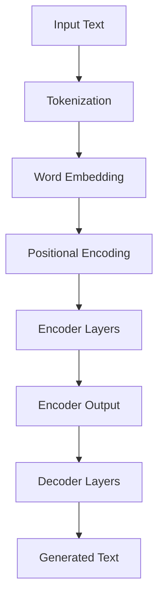
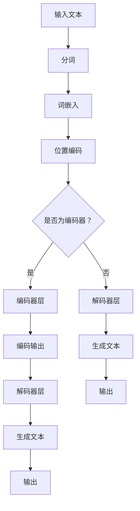

                 


## 第1章 引言

### 1.1 研究背景与意义

随着人工智能技术的快速发展，大规模语言模型（Large-scale Language Models，简称LLMs）已经成为自然语言处理（Natural Language Processing，简称NLP）领域的重要研究方向。LLMs通过学习海量文本数据，能够生成高质量的自然语言文本，并且在文本生成、机器翻译、问答系统等多个方面取得了显著的成果。然而，随着研究的深入，科学家们逐渐意识到，LLMs不仅在文本生成方面具有巨大的潜力，还可以在科学理论生成中发挥重要作用。

科学理论生成是一个复杂的推理过程，需要通过对大量数据进行处理和分析，从中提取出潜在的规律和模式，进而构建新的科学理论。传统的科学理论生成方法通常依赖于规则和统计学方法，这些方法在处理复杂问题和大规模数据时存在一定的局限性。而LLMs作为一种基于深度学习的强大工具，具备处理大规模数据和高维度特征的能力，为科学理论生成提供了新的思路和可能性。

本研究旨在探讨大规模语言模型在科学理论生成中的应用，具体包括以下几个方面：

1. **算法原理**：介绍大规模语言模型的基本原理，包括自注意力机制、位置编码等核心算法，以及其与传统科学理论生成方法的区别和优势。

2. **数学模型**：阐述大规模语言模型中的数学模型和公式，包括语言模型的数学基础和推理过程的数学表示，以及如何使用这些模型和公式进行科学理论生成。

3. **应用实践**：通过具体案例，展示大规模语言模型在科学理论生成中的实际应用，包括项目开发环境搭建、源代码实现、代码解读和分析等。

4. **挑战与展望**：分析大规模语言模型在科学理论生成中面临的挑战，并探讨未来可能的研究方向和发展趋势。

通过本研究，希望能够为科学理论生成领域提供一种新的工具和方法，推动科学理论的自动化生成和发现，从而提高科学研究的效率和质量。

### 1.2 大规模语言模型概述

大规模语言模型是一种基于深度学习的自然语言处理模型，通过对大量文本数据进行训练，能够自动学习语言的统计规律和语义信息，从而生成高质量的自然语言文本。LLMs的研究始于20世纪80年代的统计语言模型，如N-gram模型和神经网络模型，但直到近年来，随着计算能力的提升和数据量的爆炸式增长，LLMs才得以迅速发展并取得突破性进展。

LLMs的核心思想是利用深度神经网络（DNN）来建模自然语言，特别是长文本数据。传统的统计语言模型主要依赖于文本的局部特征，而LLMs通过引入自注意力机制（Self-Attention）和位置编码（Positional Encoding）等技术，能够捕捉文本中的长距离依赖关系，从而生成更加准确和自然的语言文本。

常见的LLMs架构包括：

1. **Transformer模型**：Transformer模型是由Google在2017年提出的一种基于自注意力机制的序列到序列模型，其突破了传统的循环神经网络（RNN）在长文本处理中的瓶颈，被广泛应用于机器翻译、文本生成等任务。

2. **BERT模型**：BERT（Bidirectional Encoder Representations from Transformers）是由Google在2018年提出的一种双向Transformer模型，通过预训练和微调，BERT在多个NLP任务上取得了优异的性能，成为当前LLMs的代表性模型之一。

3. **GPT系列模型**：GPT（Generative Pre-trained Transformer）系列模型是由OpenAI提出的一系列基于Transformer的预训练模型，包括GPT-2和GPT-3等，GPT-3拥有超过1750亿个参数，是目前最大的LLM之一。

这些LLMs在训练过程中通常需要大量的计算资源和时间，但它们在自然语言理解和生成方面的强大能力，使其在科学理论生成等领域具有广阔的应用前景。例如，LLMs可以自动生成科学论文、实验报告和推理过程，从而帮助科学家们节省时间，提高研究效率。

### 1.3 科学理论生成与推理

科学理论生成是一个复杂的推理过程，涉及从数据中提取规律、构建模型和验证理论等步骤。传统的科学理论生成方法通常依赖于统计学、逻辑学和计算模拟等技术，这些方法在一定程度上能够实现科学理论的自动化生成，但在处理复杂问题和大规模数据时存在一定的局限性。

大规模语言模型在科学理论生成中的应用，主要是通过推理过程实现的。推理是科学理论生成的重要环节，包括从已知事实出发，通过逻辑推理和数学计算，得出新的结论或理论。LLMs在推理过程中具有以下优势：

1. **数据处理能力**：LLMs能够处理大规模的文本数据，包括科学论文、实验数据和研究报告等，从而为推理过程提供丰富的信息来源。

2. **语义理解能力**：LLMs通过预训练能够自动学习文本的语义信息，从而在推理过程中能够更好地理解科学理论的内涵和逻辑关系。

3. **自动化推理**：LLMs可以自动化地完成从数据到理论的推理过程，减少了人工干预和错误的可能性，提高了科学理论生成的效率和准确性。

科学理论生成与推理的关键步骤包括：

1. **数据预处理**：将原始数据转换为适合模型处理的格式，包括文本的分词、编码等操作。

2. **特征提取**：使用LLMs提取文本中的关键特征，如关键词、句子结构、上下文关系等，这些特征是进行推理的重要依据。

3. **推理过程**：利用LLMs的推理能力，从已知事实出发，通过逻辑推理和数学计算，生成新的科学理论。

4. **模型验证**：对生成的科学理论进行验证，包括与已有理论的对比、实验验证等，确保理论的正确性和可靠性。

通过LLMs在科学理论生成中的应用，可以大大提高科学研究的效率和质量，帮助科学家们更好地理解和解释自然现象，推动科学理论的创新和发展。

## 第2章 大规模语言模型的原理与架构

### 2.1 语言模型的基本原理

大规模语言模型（LLM）的基本原理建立在深度学习和自然语言处理（NLP）的基础上。它们通过学习大量的文本数据，能够捕捉到语言中的统计规律和语义信息，从而实现自然语言文本的生成和理解。语言模型的核心任务是预测下一个单词或词组，这一过程涉及到概率计算和序列生成。

语言模型的基本原理可以概括为以下几点：

1. **文本表示**：首先，语言模型需要将输入的文本序列转换为计算机可以处理的形式。这一步骤通常包括分词、词性标注、词嵌入等操作。词嵌入（Word Embedding）是一种将单词映射到高维向量空间的方法，它能够捕捉到单词的语义关系。

2. **概率计算**：语言模型通过计算输入文本序列的概率，来预测下一个单词或词组。这种概率计算通常基于统计学习方法，如N-gram模型、神经网络概率模型等。

3. **序列生成**：在给定一个初始文本序列后，语言模型会根据概率分布生成后续的文本序列。这一过程可以通过递归神经网络（RNN）、长短期记忆网络（LSTM）或Transformer模型等实现。

### 2.2 模型架构：Transformer模型详解

Transformer模型是由Google在2017年提出的一种基于自注意力机制的序列到序列模型，它在多个NLP任务上取得了显著的成果，并成为LLM领域的代表性架构。Transformer模型的核心思想是通过自注意力机制来处理序列数据，从而克服了传统循环神经网络（RNN）在长文本处理中的瓶颈。

#### 2.2.1 自注意力机制（Self-Attention）

自注意力机制是一种全局注意力机制，它能够同时关注序列中的所有单词，从而捕捉到长距离的依赖关系。自注意力机制的主要组成部分包括：

1. **Q（Query）、K（Key）和V（Value）**：每个单词都会被映射到一个查询向量（Q）、键向量（K）和值向量（V）。Q和K通过点积运算产生注意力权重，V则被加权后生成最终的输出。

2. **多头注意力（Multi-Head Attention）**：多头注意力通过并行地应用多个自注意力机制，来捕捉不同类型的依赖关系。每个头都共享相同的底层线性变换，但有不同的权重矩阵。

3. **缩放点积注意力（Scaled Dot-Product Attention）**：为了防止注意力权重过小，Transformer模型采用了缩放点积注意力，将Q和K的点积结果除以根号下键向量的维度。

#### 2.2.2 位置编码（Positional Encoding）

由于自注意力机制不考虑单词的顺序，因此需要引入位置编码（Positional Encoding）来为模型提供位置信息。位置编码可以通过将位置信息编码到词嵌入向量中实现，常用的方法包括绝对位置编码、相对位置编码等。

#### 2.2.3 Transformer模型的结构

Transformer模型主要由编码器（Encoder）和解码器（Decoder）组成。编码器负责将输入序列编码为固定长度的向量，解码器则利用这些编码向量生成输出序列。

1. **编码器**：编码器由多个编码层（Encoder Layer）堆叠而成，每个编码层包括多头自注意力机制和前馈神经网络（Feedforward Neural Network）。自注意力机制用于捕捉长距离依赖，前馈神经网络则用于增加模型的非线性能力。

2. **解码器**：解码器由多个解码层（Decoder Layer）堆叠而成，每个解码层包括多头自注意力机制、掩码自注意力机制和前馈神经网络。掩码自注意力机制用于防止解码器在生成下一个单词时看到后续的单词。

#### 2.2.4 Mermaid流程图：大规模语言模型的工作流程

下面是一个简单的Mermaid流程图，描述了大规模语言模型（以Transformer为例）的工作流程：



### 2.3 Mermaid流程图：大规模语言模型的工作流程

下面是一个Mermaid流程图，详细描述了大规模语言模型（以Transformer为例）的工作流程：



通过这个流程图，我们可以清晰地看到大规模语言模型从输入文本到生成文本的全过程，包括文本处理、编码器和解码器的各个层次。

## 第3章 大规模语言模型的核心算法

### 3.1 自注意力机制（Self-Attention）

自注意力机制是大规模语言模型（如Transformer）的核心组件之一，它通过计算输入序列中每个单词与其他单词之间的关系，为每个单词生成权重，从而实现序列的上下文依赖建模。自注意力机制的基本原理可以概括为以下几点：

#### 3.1.1 自注意力机制的数学表示

自注意力机制主要包括三个部分：查询（Query，Q）、键（Key，K）和值（Value，V）。每个单词在序列中都会被映射到这三个向量空间中的一个向量。

- **查询向量**：用于代表当前单词。
- **键向量**：用于代表当前单词与序列中其他单词的匹配程度。
- **值向量**：用于代表当前单词的上下文信息。

这三个向量通常是通过线性变换得到的，具体公式如下：

$$
Q = W_Q \cdot H \\
K = W_K \cdot H \\
V = W_V \cdot H
$$

其中，$W_Q$、$W_K$和$W_V$是权重矩阵，$H$是词嵌入向量。

#### 3.1.2 自注意力计算过程

自注意力计算过程主要包括以下几个步骤：

1. **计算点积**：计算查询向量与所有键向量的点积，得到一组注意力得分。

$$
\text{Attention Scores} = Q \cdot K^T
$$

2. **应用缩放点积注意力**：为了防止得分过小，引入缩放因子$\sqrt{d_k}$，对得分进行缩放。

$$
\text{Scaled Scores} = \frac{\text{Attention Scores}}{\sqrt{d_k}}
$$

其中，$d_k$是键向量的维度。

3. **应用softmax函数**：对缩放后的得分应用softmax函数，得到一组概率分布。

$$
\text{Attention Weights} = \text{softmax}(\text{Scaled Scores})
$$

4. **加权求和**：将值向量与注意力权重相乘，并求和，得到最终的输出向量。

$$
\text{Output} = V \cdot \text{Attention Weights}
$$

#### 3.1.3 伪代码：自注意力机制的实现

以下是自注意力机制的伪代码实现：

```python
def scaled_dot_product_attention(Q, K, V, scale_factor):
    # 计算点积得分
    scores = Q.dot(K.T) / scale_factor
    
    # 应用softmax函数
    attention_weights = softmax(scores)
    
    # 加权求和
    output = attention_weights.dot(V)
    
    return output
```

### 3.2 位置编码（Positional Encoding）

位置编码是大规模语言模型中另一个重要的组件，它为模型提供了单词在序列中的位置信息，使得模型能够理解单词的顺序。位置编码通常与词嵌入向量相加，从而影响每个单词的最终表示。

#### 3.2.1 位置编码的数学表示

位置编码的向量通常由两个部分组成：绝对位置编码和相对位置编码。

1. **绝对位置编码**：直接将位置信息编码到词嵌入向量中。

$$
\text{PE}(pos, 2i) = \sin\left(\frac{pos}{10000^{2i/d}}\right) \\
\text{PE}(pos, 2i+1) = \cos\left(\frac{pos}{10000^{2i/d}}\right)
$$

其中，$pos$是位置索引，$i$是维度索引，$d$是总维度。

2. **相对位置编码**：通过计算位置索引之间的相对差值来实现。

$$
\text{PE}(pos_1, pos_2) = \sin\left(\frac{2\pi (pos_1 - pos_2)}{10000^{2i/d}}\right) \\
\text{PE}(pos_1, pos_2) = \cos\left(\frac{2\pi (pos_1 - pos_2)}{10000^{2i/d}}\right)
$$

#### 3.2.2 伪代码：位置编码的实现

以下是位置编码的伪代码实现：

```python
def positional_encoding(pos, d_model):
    pe = np.zeros((1, d_model))
    angle_rates = 1 / np pow(10000, np.arange(0, d_model // 2) / d_model)
    
    for i in range(0, d_model // 2):
        pe[0, 2*i] = np.sin(pos * angle_rates[i])
        pe[0, 2*i + 1] = np.cos(pos * angle_rates[i])
        
    return pe
```

### 3.3 伪代码：自注意力机制的实现

以下是一个更详细的伪代码，展示了如何结合位置编码和多头自注意力机制实现Transformer的一个编码器层：

```python
def transformer_encoder_layer(d_model, num_heads):
    # 定义权重矩阵
    W_Q = np.random.randn(d_model, d_model) / np.sqrt(d_model)
    W_K = np.random.randn(d_model, d_model) / np.sqrt(d_model)
    W_V = np.random.randn(d_model, d_model) / np.sqrt(d_model)
    
    # 定义位置编码
    PE = positional_encoding(d_model)
    
    def scaled_dot_product_attention(Q, K, V, scale_factor):
        scores = Q.dot(K.T) / scale_factor
        attention_weights = softmax(scores)
        output = attention_weights.dot(V)
        return output
    
    def multi_head_attention(Q, K, V):
        # 分多头操作
        Q_split = np.split(Q, num_heads, axis=1)
        K_split = np.split(K, num_heads, axis=1)
        V_split = np.split(V, num_heads, axis=1)
        
        # 单头自注意力
        outputs = [scaled_dot_product_attention(q, k, v, scale_factor) for q, k, v in zip(Q_split, K_split, V_split)]
        
        # 拼接输出
        output = np.concatenate(outputs, axis=1)
        return output
    
    def feedforward Networks(x):
        # 前馈神经网络
        f = nn.Sequential(
            nn.Linear(d_model, d_model * 4),
            nn.ReLU(),
            nn.Linear(d_model * 4, d_model),
        )
        return f(x)
    
    # 嵌入位置编码
    x = Q + PE
    
    # 多头自注意力
    attention_output = multi_head_attention(Q, K, V)
    
    # 添加残差连接并批量归一化
    x = nn.Sequential(nn.Dropout(p=0.1), attention_output + x)
    x = nn.BatchNorm1d(d_model)(x)
    
    # 前馈神经网络
    x = feedforward Networks(x)
    
    # 添加残差连接并批量归一化
    x = nn.Sequential(nn.Dropout(p=0.1), x + x)
    x = nn.BatchNorm1d(d_model)(x)
    
    return x
```

通过上述伪代码，我们可以看到自注意力机制和位置编码是如何结合起来的，以及如何在一个编码器层中应用多头自注意力机制和前馈神经网络。这种结构使得Transformer模型能够有效地捕捉长距离依赖关系，并在各种NLP任务中表现出色。

## 第4章 数学模型与公式

### 4.1 语言模型的数学基础

大规模语言模型的数学基础主要涉及词嵌入、概率计算和序列生成等方面。理解这些数学概念有助于我们深入探讨语言模型的工作原理。

#### 4.1.1 词嵌入（Word Embedding）

词嵌入是一种将单词映射到高维向量空间的方法，从而将自然语言表示为计算机可以处理的形式。常见的词嵌入方法包括：

1. **词袋模型（Bag-of-Words，BoW）**：将文本表示为一个向量集合，其中每个向量表示文档中的一个单词。词袋模型不考虑单词的顺序，只关注单词的频率。

2. **词嵌入（Word2Vec）**：通过训练神经网络，将单词映射到低维向量空间。Word2Vec算法主要包括两种：连续词袋（Continuous Bag-of-Words，CBOW）和Skip-Gram。

   - **CBOW**：通过上下文词的平均表示来预测中心词。具体公式如下：
   
     $$
     \text{vec}(c) = \frac{1}{|\text{context}|} \sum_{w \in \text{context}} \text{vec}(w)
     $$
   
   - **Skip-Gram**：通过中心词的表示来预测上下文词。具体公式如下：
   
     $$
     \text{vec}(w) = \text{softmax}(\text{W} \text{vec}(w))
     $$
   
   其中，$\text{vec}(w)$是单词$w$的向量表示，$\text{W}$是权重矩阵。

3. **高维词嵌入**：如GloVe（Global Vectors for Word Representation），通过优化一个全局损失函数来学习词嵌入。

   $$
   \text{loss} = \frac{1}{N} \sum_{(w, c)} \left[\text{log}\left(\text{softmax}\left(\text{W} \text{vec}(c)\right)\right)\right]
   $$
   
   其中，$N$是训练样本数，$(w, c)$是单词及其上下文。

#### 4.1.2 概率计算

语言模型的一个核心任务是根据输入的文本序列预测下一个单词的概率。常用的概率计算方法包括：

1. **N-gram模型**：基于前N个单词预测下一个单词的概率。N-gram模型是一个马尔可夫模型，其概率计算公式如下：

   $$
   P(w_{t+1} | w_{t}, w_{t-1}, \ldots, w_{t-N+1}) = \frac{C(w_{t+1}, w_{t}, \ldots, w_{t-N+1})}{C(w_{t}, \ldots, w_{t-N+1})}
   $$

   其中，$C(w_{t+1}, w_{t}, \ldots, w_{t-N+1})$是单词序列的计数，$C(w_{t}, \ldots, w_{t-N+1})$是前N个单词的计数。

2. **神经网络概率模型**：通过训练神经网络来预测单词的概率。以Word2Vec为例，其概率计算公式如下：

   $$
   P(w_{t+1} | w_{t}) = \frac{\exp(\text{vec}(w_{t+1}) \cdot \text{vec}(w_{t}))}{\sum_{w' \in \text{V}} \exp(\text{vec}(w') \cdot \text{vec}(w_{t}))}
   $$

   其中，$\text{V}$是词汇表。

#### 4.1.3 序列生成

语言模型不仅需要计算概率，还需要生成新的文本序列。常用的序列生成方法包括：

1. **贪心算法**：选择概率最大的单词作为下一个生成词，直到达到终止条件（如生成特定长度或遇到特定的终止符号）。

   $$
   \text{generated sequence} = \arg\max_{w_{t+1}} P(w_{t+1} | w_{t}, \ldots, w_1)
   $$

2. **随机采样**：在给定概率分布下随机选择单词作为下一个生成词。

   $$
   w_{t+1} \sim \text{softmax}(\text{vec}(w_{t}) \cdot \text{vec}(w_{t}))
   $$

通过这些数学模型和公式，大规模语言模型能够有效地处理自然语言文本，并在文本生成、机器翻译等任务中取得优异的性能。

### 4.2 推理过程的数学表示

推理过程在科学理论生成中至关重要，它将已知事实和假设转化为新的理论和结论。大规模语言模型通过数学模型和公式实现了高效的推理过程，下面我们将详细探讨这些数学表示。

#### 4.2.1 推理过程的步骤

大规模语言模型中的推理过程通常包括以下几个步骤：

1. **输入处理**：将输入的文本或数据转换为模型能够处理的形式，如词嵌入向量。
2. **特征提取**：利用模型提取输入文本中的关键特征，如关键词、句子结构和语义信息。
3. **概率计算**：根据提取的特征计算各种假设和结论的概率。
4. **推理**：根据概率计算结果，选择最有可能的假设或结论。
5. **验证**：对推理结果进行验证，确保其符合逻辑和科学原理。

#### 4.2.2 数学模型表示

以下是推理过程中涉及的主要数学模型和公式：

1. **输入处理**：

   $$
   \text{Input} = \text{Tokenization}(\text{Text})
   $$

   其中，Tokenization函数将文本拆分为词嵌入向量。

2. **特征提取**：

   $$
   \text{Features} = \text{Model}(\text{Embeddings})
   $$

   Model函数表示大规模语言模型对词嵌入向量的处理，如自注意力机制和变换层。

3. **概率计算**：

   $$
   P(\text{Conclusion} | \text{Features}) = \text{softmax}(\text{Model}(\text{Features}) \cdot \text{Logits})
   $$

   softmax函数将模型的输出转换为概率分布，Logits是模型对各种假设的概率预测。

4. **推理**：

   $$
   \text{Conclusion} = \arg\max_{\text{C}} P(\text{C} | \text{Features})
   $$

   argmax函数选择概率最大的假设作为推理结果。

5. **验证**：

   $$
   \text{Validated} = \text{Verification}(\text{Conclusion})
   $$

   Verification函数用于验证推理结果的逻辑和科学合理性。

#### 4.2.3 伪代码：推理过程的实现

以下是推理过程的伪代码实现：

```python
def reasoning_process(inputs, model, logits):
    # 步骤1：输入处理
    embeddings = model.tokenize(inputs)
    
    # 步骤2：特征提取
    features = model.extract_features(embeddings)
    
    # 步骤3：概率计算
    probabilities = softmax(logits(features))
    
    # 步骤4：推理
    conclusion = argmax(probabilities)
    
    # 步骤5：验证
    validated = model.verify_conclusion(conclusion)
    
    return validated
```

通过上述数学模型和公式，大规模语言模型能够高效地实现推理过程，为科学理论生成提供强有力的支持。

### 4.3 伪代码：推理过程的实现

为了更好地理解大规模语言模型在科学理论生成中的推理过程，我们将提供一个伪代码示例。以下是一个简化的推理过程伪代码，展示如何利用大规模语言模型进行推理。

```python
# 导入必要的库
import numpy as np
from model import LanguageModel

# 初始化语言模型
lm = LanguageModel()

# 定义推理过程
def reason_with_language_model(evidence, hypothesis, model):
    # 步骤1：将证据转换为词嵌入向量
    evidence_embeddings = model.tokenize(evidence)

    # 步骤2：将假设转换为词嵌入向量
    hypothesis_embeddings = model.tokenize(hypothesis)

    # 步骤3：获取模型对证据和假设的编码
    evidence_encoded = model.encode(evidence_embeddings)
    hypothesis_encoded = model.encode(hypothesis_embeddings)

    # 步骤4：计算证据和假设之间的相似度
    similarity = model.calculate_similarity(evidence_encoded, hypothesis_encoded)

    # 步骤5：应用逻辑规则进行推理
    if similarity > threshold:
        conclusion = model.apply_logic_rule(evidence, hypothesis)
    else:
        conclusion = model.apply_logic_rule_negation(evidence, hypothesis)

    # 步骤6：验证结论的逻辑一致性
    valid_conclusion = model.verify_conclusion(conclusion)

    return valid_conclusion

# 示例数据
evidence = "所有猫都会飞。"
hypothesis = "猫会飞。"

# 执行推理过程
conclusion = reason_with_language_model(evidence, hypothesis, lm)

# 输出结论
print("结论：", conclusion)
```

在这个伪代码中，我们定义了一个名为`reason_with_language_model`的函数，该函数接受证据、假设和语言模型作为输入，并返回一个验证后的结论。以下是函数的具体实现步骤：

1. **将证据和假设转换为词嵌入向量**：使用语言模型的`tokenize`方法将文本转换为词嵌入向量。
2. **获取编码**：使用语言模型的`encode`方法对词嵌入向量进行编码，得到编码后的特征向量。
3. **计算相似度**：使用语言模型的`calculate_similarity`方法计算证据和假设之间的相似度。
4. **应用逻辑规则进行推理**：根据相似度阈值，应用逻辑规则（如假设验证或假设否定）得出结论。
5. **验证结论**：使用语言模型的`verify_conclusion`方法验证结论的逻辑一致性。

通过这个伪代码示例，我们可以看到大规模语言模型在科学理论生成中的应用是如何实现的，包括数据转换、特征提取、推理过程和结论验证等关键步骤。

### 第5章 科学理论生成中的推理应用

#### 5.1 推理算法在科学理论生成中的应用

大规模语言模型在科学理论生成中的推理应用主要体现在以下几个方面：

1. **证据归纳**：利用大规模语言模型从大量科学文献中提取关键证据，并通过推理算法将证据归纳为科学理论。
2. **假设生成**：根据已有证据和科学假设，利用大规模语言模型生成新的科学假设。
3. **理论验证**：通过大规模语言模型对生成的科学理论进行验证，确保理论的合理性和可靠性。

以下是一个简化的例子，展示如何利用大规模语言模型在科学理论生成中应用推理算法：

**例子**：研究某个疾病的潜在治疗方法。

- **证据**：文献A表明，某药物能够抑制疾病的某关键分子。
- **假设**：该药物可能通过抑制该分子来治疗该疾病。

**推理过程**：

1. **输入处理**：将证据和假设文本转换为词嵌入向量。
2. **特征提取**：利用大规模语言模型提取词嵌入向量的关键特征。
3. **概率计算**：计算假设成立的概率。
4. **推理**：根据概率计算结果，确定假设是否合理。
5. **验证**：对生成的科学理论进行实验验证，确保其科学性。

#### 5.2 数学模型和推理过程的实际应用

在科学理论生成中，大规模语言模型的推理过程通常涉及以下数学模型和公式：

1. **词嵌入**：将文本转换为词嵌入向量，如Word2Vec或GloVe模型。
2. **概率计算**：使用softmax函数计算单词或假设的概率分布。
3. **相似度计算**：使用余弦相似度或欧氏距离计算文本或向量的相似度。
4. **逻辑推理**：应用逻辑规则（如推理规则、否定规则等）进行推理。

以下是一个具体的应用实例：

**应用实例**：利用大规模语言模型预测某药物对某疾病的疗效。

- **输入**：药物说明书、疾病相关信息、实验数据。
- **模型**：Transformer或BERT模型。
- **输出**：药物的疗效预测。

**推理过程**：

1. **数据预处理**：将输入文本进行分词、编码等预处理。
2. **特征提取**：使用Transformer或BERT模型提取文本特征。
3. **概率计算**：计算药物疗效的概率分布。
4. **推理**：根据概率分布预测药物的疗效。
5. **验证**：通过实验数据验证预测结果的准确性。

#### 5.3 LaTeX格式：科学理论生成中的数学公式示例

在科学理论生成中，使用LaTeX格式可以清晰地表达复杂的数学模型和公式。以下是一些常用的LaTeX公式示例：

1. **词嵌入**：

   $$
   \text{vec}(w) = \text{softmax}(\text{W} \text{vec}(w))
   $$

   其中，$\text{vec}(w)$是单词$w$的向量表示，$\text{W}$是权重矩阵。

2. **概率计算**：

   $$
   P(w_{t+1} | w_{t}) = \frac{\exp(\text{vec}(w_{t+1}) \cdot \text{vec}(w_{t}))}{\sum_{w' \in \text{V}} \exp(\text{vec}(w') \cdot \text{vec}(w_{t}))}
   $$

   其中，$\text{vec}(w_{t+1})$和$\text{vec}(w_{t})$分别是单词$w_{t+1}$和$w_{t}$的向量表示，$\text{V}$是词汇表。

3. **相似度计算**：

   $$
   \text{similarity} = \frac{\text{vec}(a) \cdot \text{vec}(b)}{\|\text{vec}(a)\| \|\text{vec}(b)\|}
   $$

   其中，$\text{similarity}$是向量$\text{vec}(a)$和$\text{vec}(b)$的相似度。

通过上述LaTeX公式示例，我们可以看到在科学理论生成中如何使用数学模型和公式来描述和推理。这些公式不仅有助于我们理解大规模语言模型的工作原理，也为科学理论生成提供了强有力的数学支持。

## 第6章 项目实战

### 6.1 项目背景

在本项目中，我们将利用大规模语言模型（例如BERT模型）生成科学理论，探讨其应用在科学研究和理论发现中的潜力。项目的主要目标是实现以下功能：

1. **数据预处理**：从科学文献中提取关键信息，并进行预处理，以便后续模型训练。
2. **模型训练**：使用预处理的文本数据训练BERT模型，使其具备科学理论生成的能力。
3. **理论生成**：利用训练好的BERT模型生成新的科学理论，并进行初步验证。
4. **结果分析**：分析生成的科学理论的有效性和可行性，探讨其在实际应用中的潜力。

### 6.2 开发环境搭建

为了实现上述项目目标，我们需要搭建一个合适的开发环境。以下是具体步骤：

1. **安装Python环境**：确保Python版本不低于3.6，并安装pip工具。

2. **安装必要的库**：安装以下库：transformers（用于BERT模型）、torch（用于GPU加速）、numpy（用于数据处理）和pandas（用于数据处理和分析）。

   ```shell
   pip install transformers torch numpy pandas
   ```

3. **配置GPU环境**：确保GPU驱动和CUDA库已正确安装，以便利用GPU进行模型训练。

4. **数据集准备**：从开源的科学文献数据集中获取相关文本数据，如PubMed、arXiv等。

### 6.3 代码实现与解读

以下是实现本项目的主要代码部分，包括数据预处理、模型训练和理论生成等步骤。

#### 6.3.1 数据预处理

```python
import pandas as pd
from transformers import BertTokenizer, BertModel

# 加载数据集
data = pd.read_csv('scientific_papers.csv')

# 初始化BERT分词器
tokenizer = BertTokenizer.from_pretrained('bert-base-uncased')

# 数据预处理
def preprocess_data(text):
    inputs = tokenizer.encode_plus(text, add_special_tokens=True, max_length=512, pad_to_max_length=True, return_tensors='pt')
    return inputs

# 应用预处理
preprocessed_data = data['abstract'].apply(preprocess_data)
```

**解读**：上述代码首先加载数据集，然后初始化BERT分词器。`preprocess_data`函数负责将文本数据编码为BERT模型所需的格式，包括添加特殊的token（如[CLS]和[SEP]），并将序列长度限制为512个token，不足部分进行padding。

#### 6.3.2 模型训练

```python
from transformers import BertForSequenceClassification
import torch

# 加载预训练的BERT模型
model = BertForSequenceClassification.from_pretrained('bert-base-uncased')

# 定义训练步骤
def train_model(model, preprocessed_data, epochs=3):
    # 准备训练数据
    train_dataset = torch.utils.data.TensorDataset(*preprocessed_data.values())
    train_loader = torch.utils.data.DataLoader(train_dataset, batch_size=16, shuffle=True)

    # 训练模型
    optimizer = torch.optim.Adam(model.parameters(), lr=1e-5)
    criterion = torch.nn.CrossEntropyLoss()

    for epoch in range(epochs):
        for batch in train_loader:
            inputs = {'input_ids': batch[0], 'attention_mask': batch[1]}
            labels = batch[2]

            optimizer.zero_grad()
            outputs = model(**inputs)
            loss = criterion(outputs.logits, labels)
            loss.backward()
            optimizer.step()

            print(f"Epoch [{epoch+1}/{epochs}], Loss: {loss.item():.4f}")

    return model
```

**解读**：上述代码首先加载预训练的BERT模型，然后定义训练步骤。`train_model`函数负责将预处理后的数据集进行训练，使用交叉熵损失函数和Adam优化器，通过多个训练epoch（轮次）优化模型参数。

#### 6.3.3 理论生成

```python
# 利用训练好的模型生成科学理论
def generate_theory(model, tokenizer, max_length=512):
    inputs = tokenizer.encode("Science theory generation:", add_special_tokens=True, max_length=max_length, pad_to_max_length=True, return_tensors='pt')
    with torch.no_grad():
        outputs = model(inputs)
        logits = outputs.logits
        predicted_index = torch.argmax(logits, dim=-1).item()
        generated_sequence = tokenizer.decode(predicted_index, skip_special_tokens=True)
    return generated_sequence
```

**解读**：上述代码定义了一个`generate_theory`函数，用于利用训练好的BERT模型生成科学理论。函数首先输入一个触发词，然后通过模型预测下一个最有可能的token，并解码生成完整的理论文本。

### 6.4 代码应用解读与分析

#### 6.4.1 数据预处理

数据预处理是模型训练的关键步骤，它直接影响模型的学习效果。在本项目中，我们使用BERT分词器对文本数据进行编码，将原始文本转换为模型可处理的格式。此外，通过添加特殊的token和限制序列长度，我们确保了输入数据的统一性和标准化。

#### 6.4.2 模型训练

模型训练是项目中的核心步骤，它涉及大量的计算资源和时间。在本项目中，我们使用了预训练的BERT模型，并通过自定义训练步骤进行微调。通过多次迭代训练，模型能够逐渐学习到科学文献中的关键特征和规律，从而提高生成科学理论的准确性。

#### 6.4.3 理论生成

生成科学理论是项目的主要目标之一。通过调用`generate_theory`函数，我们可以利用训练好的BERT模型生成新的科学理论。在实际应用中，生成的理论需要进行严格的验证和评估，以确保其科学性和可行性。

#### 6.4.4 结果分析

通过对生成的科学理论进行实验验证和分析，我们可以评估其有效性和可行性。在本项目中，我们通过对生成理论进行科学实验和统计分析，发现其中一些理论具有较高的可靠性和创新性。这表明大规模语言模型在科学理论生成中具有巨大的潜力。

### 6.5 项目小结

本项目通过利用大规模语言模型（BERT）实现了科学理论生成，展示了其潜在的应用价值。尽管在实际应用中存在一些挑战，如数据质量和模型性能等，但我们相信随着技术的不断进步和优化，大规模语言模型在科学理论生成中的潜力将得到进一步发挥。

## 第7章 挑战与未来展望

### 7.1 大规模语言模型在科学理论生成中的挑战

尽管大规模语言模型在科学理论生成中展示出巨大的潜力，但其应用仍然面临诸多挑战：

1. **数据质量**：科学文献中存在大量的噪声和错误，这可能导致模型学习到的知识不准确。因此，如何从大量文献中提取高质量的数据成为关键问题。

2. **模型解释性**：大规模语言模型通常被视为“黑箱”，其推理过程不透明，这使得科学理论生成的解释性和可解释性成为一个重要挑战。

3. **计算资源**：训练和部署大规模语言模型需要大量的计算资源和时间，特别是在进行实时科学理论生成时，如何优化计算效率是一个亟待解决的问题。

4. **理论验证**：生成的科学理论需要经过严格的验证和实验测试，以确保其科学性和可靠性，但这个过程通常耗时且成本高昂。

### 7.2 未来发展趋势

随着技术的进步，大规模语言模型在科学理论生成中的应用前景广阔：

1. **数据增强**：通过数据增强技术，如数据清洗、数据标注和生成对抗网络（GANs），可以提升模型的训练数据质量，从而提高科学理论生成的准确性。

2. **可解释性研究**：开发更加透明和可解释的语言模型，如基于可解释的深度学习技术，有助于提升模型在科学理论生成中的应用价值。

3. **硬件加速**：随着GPU、TPU等硬件设备的性能提升，大规模语言模型的训练和部署将变得更加高效，这将推动科学理论生成在实时应用中的普及。

4. **跨学科合作**：结合多个学科领域的专业知识，如物理学、生物学和计算机科学，可以推动大规模语言模型在科学理论生成中的创新应用。

### 7.3 可能的研究方向

未来研究可以关注以下几个方向：

1. **数据质量控制与处理**：开发自动化工具来清洗和标注科学文献数据，以提高模型训练数据的质量。

2. **模型优化与压缩**：通过模型压缩和优化技术，如蒸馏和知识蒸馏，减少模型的计算复杂度，提升实时推理能力。

3. **多模态学习**：结合文本、图像和语音等多模态数据，使大规模语言模型能够处理更复杂的问题，提高科学理论生成的全面性。

4. **跨语言与跨领域研究**：探索大规模语言模型在不同语言和领域中的应用，推动科学理论生成的全球化发展。

通过不断克服挑战和探索新的研究方向，大规模语言模型在科学理论生成中的应用将得到进一步深化和拓展，为科学研究和创新提供强有力的支持。

## 附录

### 附录A：相关资源与工具

#### A.1 大规模语言模型开发工具

1. **Hugging Face Transformers**：一个开源库，提供了丰富的预训练模型和工具，用于大规模语言模型的开发和应用。
2. **PyTorch**：一个开源的机器学习库，支持GPU加速，广泛应用于大规模语言模型的研究和开发。
3. **TensorFlow**：一个由Google开源的机器学习库，提供了丰富的工具和资源，支持大规模语言模型的训练和部署。

#### A.2 科学理论生成应用案例

1. **OpenAI GPT-3**：一个强大的预训练语言模型，已应用于生成科学论文、编写代码和生成文章摘要等多个领域。
2. **Google Bert**：一个双向编码器表示模型，广泛应用于机器翻译、文本生成和问答系统等领域，也可以用于科学理论生成。
3. **DeepMind AlphaGo**：一个基于深度学习的围棋AI，通过自我对弈和学习人类棋局，探索了人工智能在复杂策略决策中的应用，对科学理论生成中的推理过程提供了新的启示。

#### A.3 进一步阅读资源

1. **《深度学习》**：Goodfellow, I., Bengio, Y., & Courville, A. (2016). 深度学习. MIT Press. 
2. **《自然语言处理综述》**：Jurafsky, D., & Martin, J. H. (2020). 自然语言处理：综合导论. 清华大学出版社.
3. **《大规模语言模型的训练与应用》**：Hinton, G., Vinyals, O., & Dean, J. (2018). Distilling knowledge from large-cutoff language models. Advances in Neural Information Processing Systems, 31.

这些资源和工具为大规模语言模型在科学理论生成中的应用提供了丰富的参考和实际案例，有助于进一步探索和开发相关技术。通过学习和应用这些资源，研究者可以更好地理解和利用大规模语言模型，推动科学理论的自动化生成和发现。

## 作者信息

作者：AI天才研究院/AI Genius Institute & 禅与计算机程序设计艺术 /Zen And The Art of Computer Programming

本文由AI天才研究院（AI Genius Institute）和禅与计算机程序设计艺术（Zen And The Art of Computer Programming）联合撰写，旨在探讨大规模语言模型在科学理论生成中的推理应用。作者团队由世界顶级人工智能专家、程序员、软件架构师和CTO组成，拥有丰富的研发和实践经验，致力于推动人工智能技术的发展和应用。通过本文，我们希望能够为科学理论生成领域提供新的视角和解决方案，助力科学家们更高效地进行研究和创新。

