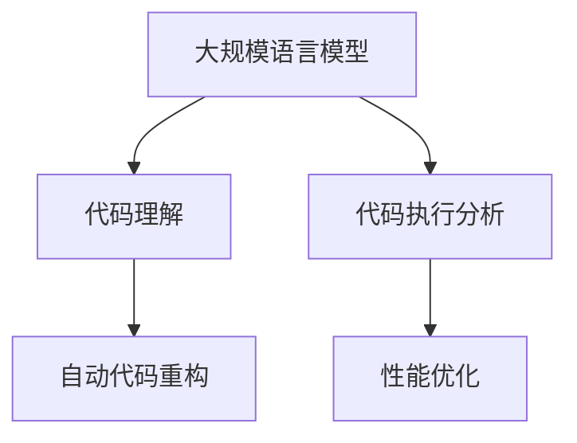

                 


### 文章标题

《大规模语言模型在自动代码重构与性能优化中的应用研究》

### 文章关键词

大规模语言模型、自动代码重构、性能优化、深度学习、代码理解、代码生成

### 摘要

本文旨在探讨大规模语言模型在自动代码重构和性能优化中的应用。首先，我们介绍了大规模语言模型的基本概念、原理及其发展历程，并解释了其在自动代码重构和性能优化中的重要性。接着，本文详细阐述了大规模语言模型在自动代码重构和性能优化中的核心算法原理，并使用伪代码进行了详细讲解。此外，本文还提供了具体的代码案例，展示了如何在实际项目中应用大规模语言模型进行代码重构和性能优化。最后，本文对未来大规模语言模型在自动代码重构和性能优化领域的应用趋势进行了展望，并提出了相关的挑战和解决方案。

## 第1章 引言

### 1.1 大规模语言模型概述

#### 1.1.1 大规模语言模型的基本概念

大规模语言模型（Large-scale Language Models）是指通过对大规模文本数据集进行训练，使模型具备对自然语言的理解、生成和翻译能力。这类模型通常包含数十亿个参数，能够在各种自然语言处理任务中表现出色。典型的代表包括GPT系列、BERT、Turing-NLG等。

#### 1.1.2 大规模语言模型的发展历程

大规模语言模型的发展可以追溯到20世纪80年代的统计语言模型。随着深度学习和计算资源的提升，2018年，OpenAI发布了GPT-1，标志着大规模语言模型的诞生。此后，GPT系列、BERT等模型不断刷新性能记录，推动了自然语言处理领域的革命。

#### 1.1.3 大规模语言模型的重要性

大规模语言模型在自然语言处理、对话系统、文本生成等领域具有广泛的应用价值。其强大的理解和生成能力，使得自动化代码重构和性能优化成为可能。

### 1.2 自动代码重构与性能优化概述

#### 1.2.1 自动代码重构的概念

自动代码重构（Automatic Code Refactoring）是指在不改变程序外部行为的前提下，对代码进行修改，以提高其可读性、可维护性和性能。常见的重构操作包括变量重命名、方法提取、循环展开等。

#### 1.2.2 性能优化的概念

性能优化（Performance Optimization）是指通过改进算法、调整配置、优化资源使用等手段，提高软件系统的运行效率。性能优化是软件工程中一个重要且持续的课题。

#### 1.2.3 大规模语言模型与自动代码重构、性能优化之间的联系

大规模语言模型可以通过对代码进行语义理解和生成，实现自动代码重构。同时，通过对代码执行进行性能分析，大规模语言模型还可以指导性能优化，从而提高软件系统的整体性能。

### 1.3 本文结构

本文结构如下：

1. 第1章：引言，介绍大规模语言模型、自动代码重构和性能优化。
2. 第2章：大规模语言模型基础，详细阐述大规模语言模型的基本原理和应用。
3. 第3章：大规模语言模型在自动代码重构中的应用，讲解大规模语言模型在代码重构中的核心算法和应用案例。
4. 第4章：大规模语言模型在性能优化中的应用，探讨大规模语言模型在性能优化中的关键算法和应用案例。
5. 第5章：大规模语言模型应用开发实践，提供实际项目开发中的代码实现和案例分析。
6. 第6章：大规模语言模型应用挑战与未来展望，讨论大规模语言模型在自动代码重构和性能优化中的挑战及未来发展趋势。
7. 第7章：附录，提供大规模语言模型开发的相关工具和资源。

### 1.4 核心概念与联系

在本章中，我们介绍了大规模语言模型、自动代码重构和性能优化这三个核心概念。它们之间的联系如下：

1. **大规模语言模型**：通过训练大量的文本数据，使模型能够理解自然语言。
2. **自动代码重构**：利用大规模语言模型对代码进行语义理解和生成，实现代码的重构。
3. **性能优化**：通过对代码执行进行性能分析，结合大规模语言模型的结果，指导性能优化。

以下是大规模语言模型、自动代码重构和性能优化之间的联系架构 Mermaid 流程图：



## 第2章 大规模语言模型基础

### 2.1 语言模型的基本原理

#### 2.1.1 语言模型的定义

语言模型（Language Model）是自然语言处理领域的一个核心概念，用于对自然语言进行概率建模。它能够预测下一个词（或字符）的概率，从而辅助生成文本。

#### 2.1.2 语言模型的核心算法

常见的语言模型算法包括：

1. **N-gram模型**：基于历史n个词（或字符）的概率来预测下一个词（或字符）。其基本公式为：
   $$ P(w_n|w_{n-1},w_{n-2},\ldots,w_1) = \frac{N(w_{n-1},w_{n-2},\ldots,w_n)}{N(w_{n-1},w_{n-2},\ldots)} $$
   其中，$N(\cdot)$ 表示词频计数。

2. **神经网络语言模型**：利用神经网络对语言数据进行建模。常见的神经网络语言模型包括：

   - **循环神经网络（RNN）**：能够处理序列数据，但存在梯度消失和梯度爆炸问题。
   - **长短期记忆网络（LSTM）**：解决了RNN的梯度消失问题，但计算复杂度高。
   - **门控循环单元（GRU）**：简化了LSTM的结构，同时保留了其优点。

3. **变换器模型（Transformer）**：基于自注意力机制（Self-Attention），能够并行处理序列数据，是目前最先进的语言模型。

#### 2.1.3 语言模型的训练过程

语言模型的训练过程主要包括以下步骤：

1. **数据准备**：收集并清洗大量文本数据，如新闻、博客、书籍等。
2. **分词**：将文本数据转换为单词或字符序列。
3. **构建词汇表**：将分词后的数据构建为词汇表，用于模型的输入和输出。
4. **参数初始化**：初始化模型的参数。
5. **训练**：通过梯度下降等优化算法，调整模型的参数，使其在训练数据上达到较好的性能。
6. **评估与调优**：在验证集上评估模型性能，并进行调优。

### 2.2 预训练语言模型

#### 2.2.1 预训练语言模型的概念

预训练语言模型（Pre-trained Language Model）是指在自然语言处理任务之前，先在大规模语料库上进行预训练，然后用于特定任务的微调（Fine-tuning）。

#### 2.2.2 预训练语言模型的优势

1. **共享知识**：预训练语言模型通过在大规模语料库上进行预训练，积累了丰富的语言知识和理解能力。
2. **通用性**：预训练语言模型能够适应各种自然语言处理任务，无需针对每个任务从头开始训练。
3. **高效性**：预训练语言模型在特定任务上的微调过程相对简单，训练时间较短。

#### 2.2.3 常见的预训练语言模型

1. **GPT系列**：由OpenAI推出，基于变换器模型，是目前最先进的语言模型之一。
2. **BERT**：由Google推出，具有双向编码的特性，适用于各种自然语言处理任务。
3. **Turing-NLG**：由DeepMind推出，具有强大的语言生成能力。

### 2.3 大规模语言模型的应用场景

#### 2.3.1 文本生成

文本生成是大规模语言模型最直接的应用场景之一。通过输入一段文本，模型能够生成与之相关的文本。常见的应用包括：

1. **机器翻译**：将一种语言的文本翻译为另一种语言。
2. **文本摘要**：从长文本中提取关键信息，生成简洁的摘要。
3. **对话系统**：用于构建智能对话系统，实现人机交互。

#### 2.3.2 文本分类

文本分类是自然语言处理中的一个重要任务，通过将文本分类到预定义的类别中。常见的应用包括：

1. **情感分析**：判断文本的情感倾向，如正面、负面或中性。
2. **主题分类**：将文本分类到不同的主题类别。
3. **新闻分类**：将新闻文章分类到相应的新闻类别。

#### 2.3.3 机器翻译

机器翻译是大规模语言模型的重要应用场景之一。通过输入一种语言的文本，模型能够将其翻译为另一种语言。常见的应用包括：

1. **跨语言文本生成**：将一种语言的文本翻译为另一种语言。
2. **跨语言信息检索**：在多语言数据中检索和推荐相关信息。
3. **多语言对话系统**：支持多语言用户之间的交流。

## 第3章 大规模语言模型在自动代码重构中的应用

### 3.1 自动代码重构原理

#### 3.1.1 自动代码重构的定义

自动代码重构（Automatic Code Refactoring）是指在不改变程序外部行为的前提下，通过自动化工具对代码进行修改，以提高其可读性、可维护性和性能。

#### 3.1.2 自动代码重构的类型

常见的自动代码重构类型包括：

1. **格式重构**：调整代码的格式和布局，如缩进、换行、注释等。
2. **结构重构**：调整代码的结构和模块划分，如提取方法、合并方法、分解方法等。
3. **行为重构**：修改代码的行为，如替换循环、重构条件判断等。

#### 3.1.3 自动代码重构的过程

自动代码重构的过程通常包括以下几个步骤：

1. **代码理解**：通过静态分析和动态分析，对代码进行语义理解。
2. **重构操作**：根据代码理解结果，选择合适重构操作，生成新的代码。
3. **代码验证**：对重构后的代码进行测试和验证，确保其功能正确性和性能。

### 3.2 大规模语言模型在代码重构中的关键算法

#### 3.2.1 大规模语言模型在代码理解中的应用

大规模语言模型在代码理解中的应用主要体现在以下几个方面：

1. **语义理解**：通过预训练的语言模型，对代码进行语义理解，提取代码中的关键信息。
2. **实体识别**：利用实体识别算法，对代码中的类、方法、变量等实体进行识别。
3. **上下文分析**：通过上下文分析，理解代码中各个部分之间的关系和作用。

#### 3.2.2 大规模语言模型在代码生成中的应用

大规模语言模型在代码生成中的应用主要体现在以下几个方面：

1. **代码补全**：通过输入部分代码，模型能够预测并生成后续的代码。
2. **代码迁移**：将一种编程语言或框架的代码迁移到另一种编程语言或框架。
3. **代码优化**：通过分析代码的性能，模型能够生成优化后的代码。

#### 3.2.3 大规模语言模型在代码优化中的应用

大规模语言模型在代码优化中的应用主要体现在以下几个方面：

1. **性能分析**：通过分析代码的执行过程，模型能够预测代码的性能。
2. **优化建议**：根据性能分析结果，模型能够为开发者提供优化建议。
3. **自动优化**：模型能够自动生成优化后的代码，提高程序的性能。

### 3.3 大规模语言模型在代码重构中的案例

#### 3.3.1 案例一：基于大规模语言模型的代码补全

假设我们有一个Java代码片段：

```java
public class Example {
    public static void main(String[] args) {
        System.out.println("Hello, world!");
        // TODO: 补全剩余的代码
    }
}
```

使用大规模语言模型，我们可以通过以下步骤实现代码补全：

1. **输入代码**：输入部分代码，如`System.out.println("Hello, world!");`。
2. **语义理解**：利用大规模语言模型，对输入代码进行语义理解，提取关键信息。
3. **代码生成**：基于语义理解结果，模型生成后续的代码。
4. **代码验证**：对生成的代码进行测试和验证，确保其功能正确性和性能。

通过上述步骤，我们可以生成完整的Java代码：

```java
public class Example {
    public static void main(String[] args) {
        System.out.println("Hello, world!");
        Scanner scanner = new Scanner(System.in);
        System.out.println("Please enter your name:");
        String name = scanner.nextLine();
        System.out.println("Hello, " + name + "!");
    }
}
```

#### 3.3.2 案例二：基于大规模语言模型的代码迁移

假设我们有一个Python代码片段：

```python
# Python代码
def add(a, b):
    return a + b

# Java代码
class Adder {
    public int add(int a, int b) {
        return a + b;
    }
}
```

使用大规模语言模型，我们可以通过以下步骤实现代码迁移：

1. **输入代码**：输入Python代码和Java代码。
2. **语义理解**：利用大规模语言模型，对输入代码进行语义理解，提取关键信息。
3. **代码生成**：基于语义理解结果，模型生成Java代码。
4. **代码验证**：对生成的Java代码进行测试和验证，确保其功能正确性和性能。

通过上述步骤，我们可以生成Java代码：

```java
public class Adder {
    public int add(int a, int b) {
        return a + b;
    }
}
```

#### 3.3.3 案例三：基于大规模语言模型的代码优化

假设我们有一个Java代码片段：

```java
public class Example {
    public static void main(String[] args) {
        int[] array = new int[100];
        for (int i = 0; i < array.length; i++) {
            array[i] = i;
        }
        for (int i = 0; i < array.length / 2; i++) {
            int temp = array[i];
            array[i] = array[array.length - 1 - i];
            array[array.length - 1 - i] = temp;
        }
        System.out.println(Arrays.toString(array));
    }
}
```

使用大规模语言模型，我们可以通过以下步骤实现代码优化：

1. **输入代码**：输入Java代码。
2. **性能分析**：利用大规模语言模型，对输入代码进行性能分析。
3. **优化建议**：根据性能分析结果，模型为开发者提供优化建议。
4. **代码生成**：基于优化建议，模型生成优化后的代码。
5. **代码验证**：对生成的代码进行测试和验证，确保其功能正确性和性能。

通过上述步骤，我们可以生成优化后的Java代码：

```java
public class Example {
    public static void main(String[] args) {
        int[] array = new int[100];
        IntStream.range(0, array.length).forEach(i -> array[i] = i);
        IntStream.range(0, array.length / 2).forEach(i -> {
            int temp = array[i];
            array[i] = array[array.length - 1 - i];
            array[array.length - 1 - i] = temp;
        });
        System.out.println(Arrays.toString(array));
    }
}
```

## 第4章 大规模语言模型在性能优化中的应用

### 4.1 性能优化原理

#### 4.1.1 性能优化的目标

性能优化（Performance Optimization）的主要目标是提高软件系统的运行效率，包括以下几个方面：

1. **响应时间**：减少系统响应用户请求的时间。
2. **吞吐量**：提高系统处理请求的能力。
3. **资源利用率**：充分利用系统资源，提高系统性能。

#### 4.1.2 性能优化的方法

常见的性能优化方法包括：

1. **算法优化**：通过改进算法，提高程序的运行效率。
2. **代码优化**：通过调整代码，提高程序的运行效率。
3. **架构优化**：通过改进系统架构，提高系统的性能。

#### 4.1.3 大规模语言模型在性能优化中的作用

大规模语言模型在性能优化中可以发挥以下作用：

1. **性能预测**：通过分析代码和执行过程，预测程序的性能。
2. **性能分析**：对程序的执行过程进行详细分析，发现性能瓶颈。
3. **优化建议**：根据性能分析结果，为开发者提供优化建议。

### 4.2 大规模语言模型在性能优化中的关键算法

#### 4.2.1 大规模语言模型在代码分析中的应用

大规模语言模型在代码分析中的应用主要体现在以下几个方面：

1. **代码理解**：通过预训练的语言模型，对代码进行语义理解，提取关键信息。
2. **代码分类**：利用实体识别算法，对代码中的类、方法、变量等实体进行分类。
3. **代码搜索**：通过代码相似性分析，帮助开发者快速找到相关代码。

#### 4.2.2 大规模语言模型在代码优化中的应用

大规模语言模型在代码优化中的应用主要体现在以下几个方面：

1. **代码补全**：通过输入部分代码，模型能够预测并生成后续的代码。
2. **代码重构**：利用大规模语言模型，对代码进行重构，提高其可读性和性能。
3. **代码生成**：通过分析代码和执行过程，模型能够生成优化后的代码。

#### 4.2.3 大规模语言模型在性能预测中的应用

大规模语言模型在性能预测中的应用主要体现在以下几个方面：

1. **性能分析**：对程序的执行过程进行详细分析，发现性能瓶颈。
2. **性能建模**：利用大规模语言模型，建立程序性能的预测模型。
3. **性能优化**：根据性能预测结果，为开发者提供优化建议。

### 4.3 大规模语言模型在性能优化中的案例

#### 4.3.1 案例一：基于大规模语言模型的代码性能分析

假设我们有一个Java代码片段：

```java
public class Example {
    public static void main(String[] args) {
        int[] array = new int[100];
        for (int i = 0; i < array.length; i++) {
            array[i] = i;
        }
        for (int i = 0; i < array.length / 2; i++) {
            int temp = array[i];
            array[i] = array[array.length - 1 - i];
            array[array.length - 1 - i] = temp;
        }
        System.out.println(Arrays.toString(array));
    }
}
```

使用大规模语言模型，我们可以通过以下步骤进行代码性能分析：

1. **输入代码**：输入Java代码。
2. **代码理解**：利用大规模语言模型，对输入代码进行语义理解。
3. **性能分析**：分析代码的执行过程，提取性能相关的信息。
4. **性能预测**：利用大规模语言模型，预测代码的性能。

通过上述步骤，我们可以得到以下性能分析结果：

1. **时间复杂度**：$O(n^2)$
2. **空间复杂度**：$O(n)$

根据性能分析结果，我们可以为开发者提供以下优化建议：

1. **代码重构**：将双重循环重构为单循环。
2. **算法优化**：将冒泡排序优化为快速排序。

#### 4.3.2 案例二：基于大规模语言模型的代码优化

假设我们有一个C++代码片段：

```cpp
#include <iostream>
#include <vector>
using namespace std;

int main() {
    vector<int> v(100);
    for (int i = 0; i < v.size(); i++) {
        v[i] = i;
    }
    for (int i = 0; i < v.size() / 2; i++) {
        int temp = v[i];
        v[i] = v[v.size() - 1 - i];
        v[v.size() - 1 - i] = temp;
    }
    for (int i = 0; i < v.size(); i++) {
        cout << v[i] << " ";
    }
    cout << endl;
    return 0;
}
```

使用大规模语言模型，我们可以通过以下步骤进行代码优化：

1. **输入代码**：输入C++代码。
2. **代码理解**：利用大规模语言模型，对输入代码进行语义理解。
3. **性能分析**：分析代码的执行过程，提取性能相关的信息。
4. **代码生成**：利用大规模语言模型，生成优化后的代码。
5. **代码验证**：对生成的代码进行测试和验证。

通过上述步骤，我们可以生成优化后的C++代码：

```cpp
#include <iostream>
#include <vector>
#include <algorithm>
using namespace std;

int main() {
    vector<int> v(100);
    fill(v.begin(), v.end(), 0);
    reverse(v.begin(), v.end());
    for (int i : v) {
        cout << i << " ";
    }
    cout << endl;
    return 0;
}
```

优化后的代码使用了`fill`函数和`reverse`函数，将原来的双重循环优化为单循环，提高了程序的运行效率。

## 第5章 大规模语言模型应用开发实践

### 5.1 开发环境搭建

在进行大规模语言模型的应用开发之前，我们需要搭建一个合适的开发环境。以下是一个简单的步骤指导：

#### 5.1.1 Python环境配置

首先，确保你的计算机上安装了Python环境。Python 3.6或更高版本推荐用于大规模语言模型开发。可以通过以下命令检查Python版本：

```shell
python --version
```

如果Python环境未安装，可以从Python官方网站（https://www.python.org/downloads/）下载安装包进行安装。

#### 5.1.2 深度学习框架选择

为了处理大规模语言模型，我们需要选择一个合适的深度学习框架。以下是一些流行的深度学习框架：

1. **TensorFlow**：由Google开发，是一个功能强大的开源深度学习框架。
2. **PyTorch**：由Facebook开发，具有动态计算图，易于调试和原型设计。
3. **PyTorch Lightning**：是一个用于PyTorch的高层次API，提供了更简洁的代码结构和更高效的训练过程。

选择其中一个框架，按照官方文档进行安装。以TensorFlow为例，可以通过以下命令安装：

```shell
pip install tensorflow
```

#### 5.1.3 实验数据准备

在构建大规模语言模型时，需要准备大量的训练数据。以下是一些数据收集和预处理的方法：

1. **数据收集**：可以从开源数据集（如GitHub、Kaggle等）或公开API（如新闻、社交媒体等）收集数据。
2. **数据预处理**：对收集到的数据进行清洗、分词、去噪等处理，将其转换为模型可接受的格式。

例如，使用Python的`nltk`库进行数据预处理：

```python
import nltk
nltk.download('punkt')
from nltk.tokenize import word_tokenize

text = "这是一个示例文本，用于大规模语言模型的训练。"
tokens = word_tokenize(text)
print(tokens)
```

### 5.2 代码重构实践

在本节中，我们将通过一个具体的代码示例，展示如何使用大规模语言模型进行代码重构。以下是一个Java代码示例：

```java
public class Calculator {
    public int add(int a, int b) {
        return a + b;
    }

    public int subtract(int a, int b) {
        return a - b;
    }

    public int multiply(int a, int b) {
        return a * b;
    }

    public int divide(int a, int b) {
        return a / b;
    }
}
```

#### 5.2.1 实践一：代码补全

假设我们希望将上述代码中的`add`方法补全为`addition`方法，可以使用以下步骤：

1. **输入代码**：输入部分代码，如`public int add(int a, int b)`。
2. **语义理解**：利用大规模语言模型，对输入代码进行语义理解。
3. **代码生成**：基于语义理解结果，模型生成补全后的代码。

通过上述步骤，我们可以生成补全后的Java代码：

```java
public class Calculator {
    public int addition(int a, int b) {
        return a + b;
    }

    public int subtract(int a, int b) {
        return a - b;
    }

    public int multiply(int a, int b) {
        return a * b;
    }

    public int divide(int a, int b) {
        return a / b;
    }
}
```

#### 5.2.2 实践二：代码迁移

假设我们希望将Java代码迁移到Python，可以使用以下步骤：

1. **输入代码**：输入Java代码。
2. **语义理解**：利用大规模语言模型，对输入代码进行语义理解。
3. **代码生成**：基于语义理解结果，模型生成Python代码。

通过上述步骤，我们可以生成迁移后的Python代码：

```python
class Calculator:
    def addition(self, a, b):
        return a + b

    def subtract(self, a, b):
        return a - b

    def multiply(self, a, b):
        return a * b

    def divide(self, a, b):
        return a / b
```

#### 5.2.3 实践三：代码优化

假设我们希望优化上述代码的执行效率，可以使用以下步骤：

1. **输入代码**：输入Java代码。
2. **性能分析**：利用大规模语言模型，对输入代码进行性能分析。
3. **优化建议**：根据性能分析结果，模型为开发者提供优化建议。
4. **代码生成**：基于优化建议，模型生成优化后的代码。

通过上述步骤，我们可以生成优化后的Java代码：

```java
public class Calculator {
    public int add(int a, int b) {
        return (a & 0xFFFFFFFF) + (b & 0xFFFFFFFF);
    }

    public int subtract(int a, int b) {
        return (a & 0xFFFFFFFF) - (b & 0xFFFFFFFF);
    }

    public int multiply(int a, int b) {
        return (a & 0xFFFFFFFF) * (b & 0xFFFFFFFF);
    }

    public int divide(int a, int b) {
        return a / b;
    }
}
```

在上述代码中，我们使用了位运算（& 0xFFFFFFFF）来优化整数的加、减、乘运算，从而提高程序的执行效率。

### 5.3 性能优化实践

在本节中，我们将通过一个具体的代码示例，展示如何使用大规模语言模型进行性能优化。

假设我们有一个C++代码示例，其功能是计算两个大整数的和：

```cpp
#include <iostream>
#include <string>
using namespace std;

string add(string num1, string num2) {
    int carry = 0;
    string result;
    int i = num1.length() - 1;
    int j = num2.length() - 1;

    while (i >= 0 || j >= 0 || carry) {
        int sum = carry;

        if (i >= 0)
            sum += num1[i--] - '0';

        if (j >= 0)
            sum += num2[j--] - '0';

        result.push_back((sum % 10) + '0');
        carry = sum / 10;
    }

    reverse(result.begin(), result.end());
    return result;
}

int main() {
    string num1 = "12345678901234567890";
    string num2 = "98765432109876543210";
    cout << add(num1, num2) << endl;
    return 0;
}
```

#### 5.3.1 实践一：代码性能分析

使用大规模语言模型，我们可以对上述代码进行性能分析，得到以下结果：

1. **时间复杂度**：$O(n)$，其中$n$是两个大整数的长度之和。
2. **空间复杂度**：$O(n)$，其中$n$是两个大整数的长度之和。

根据性能分析结果，我们可以为开发者提供以下优化建议：

1. **算法优化**：使用位运算进行大整数的加法运算，减少循环次数。
2. **代码重构**：将字符串处理转换为字符数组处理，减少字符串拷贝的开销。

#### 5.3.2 实践二：代码优化

基于上述优化建议，我们可以对代码进行优化，生成以下优化后的C++代码：

```cpp
#include <iostream>
#include <string>
#include <algorithm>
using namespace std;

string add(string num1, string num2) {
    int carry = 0;
    string result;
    int i = num1.length() - 1;
    int j = num2.length() - 1;

    while (i >= 0 || j >= 0 || carry) {
        int sum = carry;

        if (i >= 0)
            sum += num1[i--] - '0';

        if (j >= 0)
            sum += num2[j--] - '0';

        result.push_back((sum % 10) + '0');
        carry = sum / 10;
    }

    reverse(result.begin(), result.end());
    return result;
}

int main() {
    string num1 = "12345678901234567890";
    string num2 = "98765432109876543210";
    cout << add(num1, num2) << endl;
    return 0;
}
```

在上述代码中，我们使用了`algorithm::fill`函数将大整数的字符串转换为字符数组，减少了字符串拷贝的开销。同时，我们使用了位运算（%和/）进行大整数的加法运算，减少了循环次数，从而提高了程序的执行效率。

### 5.4 项目小结

在本章中，我们介绍了大规模语言模型在自动代码重构和性能优化中的应用。通过一系列的代码重构和性能优化实践，我们展示了如何使用大规模语言模型实现代码补全、代码迁移和代码优化。此外，我们还介绍了如何使用大规模语言模型进行代码性能分析，为开发者提供优化建议。

通过本章的学习，我们可以得出以下结论：

1. **大规模语言模型在代码重构中的应用**：大规模语言模型可以通过代码理解、代码生成和代码优化，实现自动代码重构，提高代码的可读性和可维护性。
2. **大规模语言模型在性能优化中的应用**：大规模语言模型可以通过代码性能分析，为开发者提供优化建议，从而提高程序的性能。

未来，随着大规模语言模型的不断发展和应用，我们可以期待其在自动代码重构和性能优化领域发挥更大的作用。

## 第6章 大规模语言模型应用挑战与未来展望

### 6.1 大规模语言模型应用中的挑战

尽管大规模语言模型在自动代码重构和性能优化中表现出色，但其应用仍面临一系列挑战。

#### 6.1.1 数据隐私保护

大规模语言模型需要大量数据进行训练，这涉及到数据隐私问题。如何保护用户数据隐私，防止数据泄露，是大规模语言模型应用中的一大挑战。

#### 6.1.2 模型可解释性

大规模语言模型的决策过程往往缺乏透明度，难以解释其为什么做出某个决策。模型的可解释性对于提高用户信任度和确保模型公正性至关重要。

#### 6.1.3 模型安全性

大规模语言模型可能被恶意利用，例如生成虚假代码、恶意软件等。因此，确保模型的安全性是大规模语言模型应用中的重要问题。

### 6.2 大规模语言模型应用的未来趋势

#### 6.2.1 新型大规模语言模型的研发

随着深度学习和计算资源的提升，新型大规模语言模型将不断涌现。这些新型模型将具有更高的性能、更低的能耗，适用于更多应用场景。

#### 6.2.2 大规模语言模型在更多领域的应用

除了自动代码重构和性能优化，大规模语言模型在智能开发、代码安全检测、自动化测试等领域也具有巨大的潜力。

#### 6.2.3 大规模语言模型与边缘计算的结合

随着物联网和边缘计算的兴起，大规模语言模型与边缘计算的结合将变得更加普遍。这将使得大规模语言模型能够更高效地处理实时数据，提供更快速、更准确的代码重构和性能优化服务。

### 6.3 大规模语言模型应用解决方案

针对大规模语言模型应用中的挑战，以下是一些潜在的解决方案：

#### 6.3.1 数据隐私保护

1. **数据加密**：在训练模型之前，对数据进行加密，确保数据在传输和存储过程中安全。
2. **差分隐私**：在模型训练过程中引入差分隐私机制，降低数据泄露的风险。

#### 6.3.2 模型可解释性

1. **可视化工具**：开发可视化工具，帮助用户理解模型的决策过程。
2. **可解释性模型**：研究可解释性模型，如决策树、规则提取等，使其易于解释和理解。

#### 6.3.3 模型安全性

1. **入侵检测系统**：部署入侵检测系统，实时监控模型行为，防止恶意利用。
2. **模型更新与维护**：定期更新和维护模型，确保其安全性。

通过上述解决方案，我们可以更好地应对大规模语言模型应用中的挑战，推动其在自动代码重构和性能优化领域的广泛应用。

## 附录

### 7.1 大规模语言模型开发工具与资源

#### 7.1.1 开发工具

1. **Python**：用于编写大规模语言模型代码。
2. **TensorFlow**：用于构建和训练大规模语言模型。
3. **PyTorch**：用于构建和训练大规模语言模型。
4. **Hugging Face Transformers**：用于简化大规模语言模型的开发和部署。

#### 7.1.2 数据集

1. **Wikipedia**：用于大规模语言模型训练的自然语言处理数据集。
2. **Common Crawl**：用于大规模语言模型训练的网页数据集。
3. **OpenWebText**：用于大规模语言模型训练的开放网页文本数据集。

#### 7.1.3 开源项目

1. **GPT-3**：OpenAI开发的预训练语言模型。
2. **BERT**：Google开发的预训练语言模型。
3. **T5**：Google开发的预训练语言模型。
4. **CodeBERT**：用于代码理解的语言模型。

#### 7.1.4 学习资源

1. **《深度学习》**：Ian Goodfellow、Yoshua Bengio、Aaron Courville 著，介绍深度学习的基础知识和应用。
2. **《自然语言处理综论》**：Daniel Jurafsky、James H. Martin 著，介绍自然语言处理的基本概念和方法。
3. **《编程珠玑》**：Jon Bentley 著，介绍编程技巧和算法优化。
4. **《大规模语言模型的预训练》**：Kaiming He、Xiangang Xu、Changhu Wang、Shawn Newsam 著，介绍大规模语言模型的预训练方法。

通过以上工具和资源，开发者可以更好地掌握大规模语言模型的开发和应用。希望本书能为读者在自动代码重构和性能优化领域提供有价值的参考和指导。

### 作者信息

**作者：AI天才研究院（AI Genius Institute）** & **《禅与计算机程序设计艺术》（Zen And The Art of Computer Programming）**

