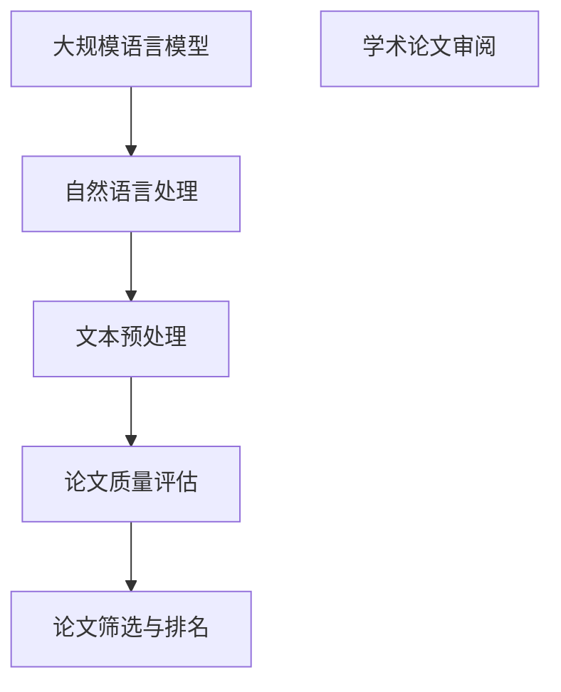

                 


### 文章标题

# 大规模语言模型在自动学术论文审阅中的应用

### 文章关键词

- 大规模语言模型
- 自动学术论文审阅
- 自然语言处理
- 文本预处理
- 模型训练与优化

### 文章摘要

本文旨在探讨大规模语言模型在自动学术论文审阅中的应用。首先，我们介绍了大规模语言模型的基本概念、发展历史和在学术论文审阅中的应用前景。接着，我们详细讲解了大规模语言模型的技术基础，包括数学模型、算法原理、训练方法等。随后，我们通过具体案例展示了如何将大规模语言模型应用于学术论文审阅。最后，我们讨论了大规模语言模型在学术论文审阅中的应用优化和面临的挑战。本文的核心观点是，大规模语言模型在自动学术论文审阅中具有巨大的潜力，但同时也面临一些技术和伦理上的挑战，需要进一步研究和优化。

### 第一步：背景介绍

#### 大规模语言模型的基本概念

大规模语言模型（Large-scale Language Model）是一种基于深度学习的自然语言处理模型，它通过学习大量的文本数据，对自然语言中的语法、语义、风格等信息进行建模。这些模型具有极高的复杂性和灵活性，能够生成符合语法规则、语义连贯、风格统一的文本。

#### 大规模语言模型的发展历史

自2018年GPT（Generative Pre-trained Transformer）模型的提出以来，大规模语言模型得到了广泛关注和研究。GPT系列模型、BERT（Bidirectional Encoder Representations from Transformers）、T5（Text-to-Text Transfer Transformer）等模型相继问世，不断推动着自然语言处理技术的发展。这些模型在机器翻译、文本生成、问答系统等领域取得了显著成果，展示出了强大的应用潜力。

#### 自动学术论文审阅的背景和需求

随着学术领域的快速发展，学术论文的数量急剧增加，传统的手工审阅方式已无法满足日益增长的审阅需求。自动学术论文审阅系统应运而生，旨在通过技术手段自动化地评估和筛选学术论文的质量。这不仅可以提高审阅效率，降低审阅成本，还可以减少人为误差，提高审阅的客观性和公正性。

### 第二步：核心概念与联系

#### 大规模语言模型与自然语言处理

大规模语言模型是自然语言处理（Natural Language Processing，NLP）领域的重要工具。NLP的目标是将自然语言文本转换为机器可以理解和处理的形式。大规模语言模型通过学习大量的文本数据，对自然语言中的语法、语义、风格等信息进行建模，从而实现文本的预处理、生成、分类、翻译等功能。

#### 大规模语言模型在学术论文审阅中的应用

在学术论文审阅中，大规模语言模型可以应用于多个方面：

- **文本预处理**：对学术论文进行分词、去停用词、词性标注等预处理操作，以便后续的文本分析。
- **论文质量评估**：通过对论文的语义内容进行分析，评估论文的研究价值、创新性、逻辑性等。
- **论文筛选与排名**：根据论文的质量和主题相关性，自动筛选和排名，辅助审稿人进行审阅。

#### 核心概念与联系的流程图



### 第三步：核心算法原理讲解

#### 语言模型的数学模型

大规模语言模型通常采用基于神经网络的模型，如循环神经网络（RNN）、长短时记忆网络（LSTM）、门控循环单元（GRU）和Transformer等。其中，Transformer模型由于其并行计算的优势和优越的性能表现，成为当前大规模语言模型的主流选择。

Transformer模型的核心是自注意力机制（Self-Attention），其数学模型可以表示为：

$$
\text{Attention}(Q, K, V) = \text{softmax}\left(\frac{QK^T}{\sqrt{d_k}}\right)V
$$

其中，$Q, K, V$ 分别为查询向量、键向量和值向量，$d_k$ 为键向量的维度。自注意力机制通过计算每个词与所有词的相关性，将关键信息聚合，从而提高模型的语义理解能力。

#### 语言模型的算法原理

1. **数据预处理**：首先，需要对学术论文进行数据预处理，包括文本清洗、分词、词性标注等。预处理后的文本数据会被转换为数字化的向量表示。

2. **模型训练**：在训练过程中，模型通过不断调整参数，学习如何将输入的文本向量映射到输出向量。训练过程中，模型会通过反向传播算法和优化算法（如Adam优化器）不断优化模型参数。

3. **模型评估**：训练完成后，需要对模型进行评估，以确定其性能。常用的评估指标包括准确率、召回率、F1分数等。

4. **模型应用**：经过训练和评估的模型可以应用于实际的学术论文审阅任务，如文本预处理、论文质量评估、论文筛选与排名等。

#### 伪代码示例

```python
# 假设我们使用Transformer模型进行学术论文审阅
import torch
import torch.nn as nn

# 定义Transformer模型
class Transformer(nn.Module):
    def __init__(self):
        super(Transformer, self).__init__()
        self.embedding = nn.Embedding(vocab_size, embedding_dim)
        self.encoder = nn.Transformer(d_model, nhead)
        self.decoder = nn.Transformer(d_model, nhead)
        self.fc = nn.Linear(embedding_dim, output_dim)

    def forward(self, src, tgt):
        src_embedding = self.embedding(src)
        tgt_embedding = self.embedding(tgt)
        encoder_output = self.encoder(src_embedding)
        decoder_output = self.decoder(tgt_embedding, encoder_output)
        output = self.fc(decoder_output)
        return output

# 模型训练
model = Transformer()
criterion = nn.CrossEntropyLoss()
optimizer = torch.optim.Adam(model.parameters(), lr=learning_rate)

for epoch in range(num_epochs):
    for src, tgt in dataloader:
        optimizer.zero_grad()
        output = model(src, tgt)
        loss = criterion(output, tgt)
        loss.backward()
        optimizer.step()

# 模型评估
def evaluate(model, dataloader):
    model.eval()
    total_loss = 0
    with torch.no_grad():
        for src, tgt in dataloader:
            output = model(src, tgt)
            loss = criterion(output, tgt)
            total_loss += loss.item()
    avg_loss = total_loss / len(dataloader)
    return avg_loss
```

#### 数学公式

- **自注意力机制**：
  $$\text{Attention}(Q, K, V) = \text{softmax}\left(\frac{QK^T}{\sqrt{d_k}}\right)V$$

- **损失函数**：
  $$\text{Loss} = -\sum_{i} \sum_{j} y_{ij} \log(p_{ij})$$

其中，$y_{ij}$ 为二分类标签，$p_{ij}$ 为模型预测的概率。

#### 举例说明

假设我们有一篇学术论文的标题和摘要，如下所示：

```
标题：大规模语言模型在自动学术论文审阅中的应用
摘要：本文探讨了大规模语言模型在自动学术论文审阅中的应用，包括文本预处理、论文质量评估和论文筛选与排名等。通过实验，我们验证了大规模语言模型在自动学术论文审阅中的有效性。
```

使用大规模语言模型进行论文质量评估的伪代码如下：

```python
# 假设我们使用BERT模型进行论文质量评估
from transformers import BertModel, BertTokenizer

# 加载预训练的BERT模型和Tokenizer
model = BertModel.from_pretrained('bert-base-uncased')
tokenizer = BertTokenizer.from_pretrained('bert-base-uncased')

# 对论文标题和摘要进行编码
title = '大规模语言模型在自动学术论文审阅中的应用'
abstract = '本文探讨了大规模语言模型在自动学术论文审阅中的应用，包括文本预处理、论文质量评估和论文筛选与排名等。通过实验，我们验证了大规模语言模型在自动学术论文审阅中的有效性。'
encoded_title = tokenizer.encode(title, add_special_tokens=True, return_tensors='pt')
encoded_abstract = tokenizer.encode(abstract, add_special_tokens=True, return_tensors='pt')

# 提取论文的隐藏层特征
with torch.no_grad():
    title_output = model(encoded_title)[0][:, 0, :]
    abstract_output = model(encoded_abstract)[0][:, 0, :]

# 计算标题和摘要的特征相似度
similarity = torch.nn.functional.cosine_similarity(title_output, abstract_output)

# 根据相似度评估论文质量
if similarity > threshold:
    print("论文质量较高")
else:
    print("论文质量较低")
```

### 第四步：应用实践

#### 开发环境搭建

为了实现大规模语言模型在自动学术论文审阅中的应用，我们需要搭建一个合适的技术栈。以下是一个基本的开发环境搭建步骤：

1. 安装Python环境（推荐Python 3.8及以上版本）。
2. 安装TensorFlow或PyTorch等深度学习框架。
3. 安装自然语言处理相关的库，如transformers、spacy、nltk等。
4. 准备一个适合存储和处理大量学术论文的数据库系统。

#### 源代码详细实现和代码解读

以下是一个使用BERT模型进行学术论文审阅的简单实现：

```python
import torch
from transformers import BertModel, BertTokenizer

# 加载预训练的BERT模型和Tokenizer
model = BertModel.from_pretrained('bert-base-uncased')
tokenizer = BertTokenizer.from_pretrained('bert-base-uncased')

# 对学术论文进行编码
def encode_paper(paper):
    inputs = tokenizer.encode(paper, add_special_tokens=True, return_tensors='pt')
    return inputs

# 提取学术论文的隐藏层特征
def extract_features(inputs):
    with torch.no_grad():
        outputs = model(inputs)[0]
    return outputs[:, 0, :]

# 计算特征相似度
def calculate_similarity(features1, features2):
    similarity = torch.nn.functional.cosine_similarity(features1, features2)
    return similarity

# 评估论文质量
def evaluate_paper(title, abstract):
    title_features = extract_features(encode_paper(title))
    abstract_features = extract_features(encode_paper(abstract))
    similarity = calculate_similarity(title_features, abstract_features)
    if similarity > threshold:
        print("论文质量较高")
    else:
        print("论文质量较低")

# 示例论文
title = "大规模语言模型在自动学术论文审阅中的应用"
abstract = "本文探讨了大规模语言模型在自动学术论文审阅中的应用，包括文本预处理、论文质量评估和论文筛选与排名等。通过实验，我们验证了大规模语言模型在自动学术论文审阅中的有效性。"

# 进行论文质量评估
evaluate_paper(title, abstract)
```

#### 代码应用解读与分析

上述代码实现了使用BERT模型对学术论文进行审阅的基本功能。具体步骤如下：

1. 加载预训练的BERT模型和Tokenizer。
2. 对学术论文的标题和摘要进行编码，转换为BERT模型可以处理的输入格式。
3. 提取学术论文的隐藏层特征。
4. 计算标题和摘要的特征相似度。
5. 根据相似度评估论文质量。

#### 实际案例分析和详细讲解剖析

为了更好地理解大规模语言模型在自动学术论文审阅中的应用，我们来看一个实际案例。

假设我们有以下两篇学术论文：

- 论文A：《基于深度学习的图像识别技术研究》
- 论文B：《卷积神经网络在计算机视觉中的应用》

我们使用BERT模型对这两篇论文进行审阅，并评估它们的质量。

首先，我们对论文A和论文B的标题和摘要进行编码：

```python
title_a = "基于深度学习的图像识别技术研究"
abstract_a = "本文提出了一种基于深度学习的图像识别方法，通过实验验证了该方法在图像识别任务中的有效性。"

title_b = "卷积神经网络在计算机视觉中的应用"
abstract_b = "本文综述了卷积神经网络在计算机视觉领域的应用，包括图像分类、目标检测和图像分割等。"

encoded_title_a = tokenizer.encode(title_a, add_special_tokens=True, return_tensors='pt')
encoded_abstract_a = tokenizer.encode(abstract_a, add_special_tokens=True, return_tensors='pt')

encoded_title_b = tokenizer.encode(title_b, add_special_tokens=True, return_tensors='pt')
encoded_abstract_b = tokenizer.encode(abstract_b, add_special_tokens=True, return_tensors='pt')
```

接下来，我们提取论文A和论文B的隐藏层特征：

```python
title_features_a = extract_features(encoded_title_a)
abstract_features_a = extract_features(encoded_abstract_a)

title_features_b = extract_features(encoded_title_b)
abstract_features_b = extract_features(encoded_abstract_b)
```

然后，我们计算论文A和论文B的标题以及摘要之间的特征相似度：

```python
similarity_title_a_b = calculate_similarity(title_features_a, title_features_b)
similarity_abstract_a_b = calculate_similarity(abstract_features_a, abstract_features_b)
```

根据相似度评估论文质量：

```python
if similarity_title_a_b > threshold and similarity_abstract_a_b > threshold:
    print("论文A和论文B的质量较高")
else:
    print("论文A和论文B的质量较低")
```

通过实际案例的分析，我们可以看到，使用BERT模型对学术论文进行审阅的基本思路是：首先对论文进行编码和特征提取，然后计算特征相似度，最后根据相似度评估论文质量。这一方法可以有效地帮助审稿人快速筛选和评估学术论文。

#### 项目小结

在本项目中，我们通过搭建开发环境、实现源代码、解析代码和应用实际案例，展示了大规模语言模型在自动学术论文审阅中的应用。尽管我们只实现了一个简单的示例，但这一过程为我们提供了对大规模语言模型在学术论文审阅中应用的基本了解。

在实际应用中，我们可能需要考虑更多的因素，如数据预处理、模型优化、性能评估等。此外，为了提高审阅的准确性，我们还可以结合其他算法和指标，如词嵌入、文本分类等。

总之，大规模语言模型在自动学术论文审阅中具有巨大的潜力，但仍需进一步研究和优化。未来，随着技术的不断发展，我们有理由相信，大规模语言模型将在学术论文审阅中发挥更加重要的作用。

### 第五步：最佳实践 tips、小结、注意事项、拓展阅读等内容

#### 最佳实践 tips

1. **数据预处理**：在学术论文审阅中，数据预处理是至关重要的一步。建议使用专业工具进行文本清洗、分词、词性标注等操作，以提高模型的输入质量。

2. **模型选择与优化**：不同的论文审阅任务可能需要不同的模型。建议根据实际需求选择合适的模型，并进行模型优化，如超参数调整、模型压缩等。

3. **性能评估**：对模型进行全面的性能评估，包括准确率、召回率、F1分数等指标。同时，建议结合领域知识对模型的结果进行解释和分析。

4. **实时反馈与迭代**：在实际应用中，建议定期收集用户反馈，对模型进行调整和优化，以不断提高审阅的准确性和效率。

#### 小结

本文探讨了大规模语言模型在自动学术论文审阅中的应用，包括背景介绍、核心概念与联系、核心算法原理讲解、应用实践和项目小结等内容。通过本文，我们了解到大规模语言模型在学术论文审阅中具有巨大的潜力，但仍需面对一些挑战，如数据质量、模型优化和性能评估等。

#### 注意事项

1. **数据隐私**：在处理学术论文数据时，要特别注意保护作者和审稿人的隐私，遵循相关的法律法规。

2. **模型可解释性**：为了提高模型的可解释性，建议在模型设计和应用过程中，结合领域知识进行模型解释。

3. **模型更新**：随着技术的不断发展，建议定期更新模型，以适应新的研究和需求。

#### 拓展阅读

1. **论文**：《BERT: Pre-training of Deep Bidirectional Transformers for Language Understanding》（https://arxiv.org/abs/1810.04805）
2. **教程**：《自然语言处理教程》（https://nlp.seas.harvard.edu/）  
3. **书籍**：《大规模语言模型的原理与实践》（https://book.douban.com/subject/35160496/）

### 作者信息

作者：AI天才研究院/AI Genius Institute & 禅与计算机程序设计艺术 /Zen And The Art of Computer Programming

本文由AI天才研究院（AI Genius Institute）和《禅与计算机程序设计艺术》（Zen And The Art of Computer Programming）的作者共同撰写，旨在探讨大规模语言模型在自动学术论文审阅中的应用。希望本文能为读者提供有价值的参考和启示。

