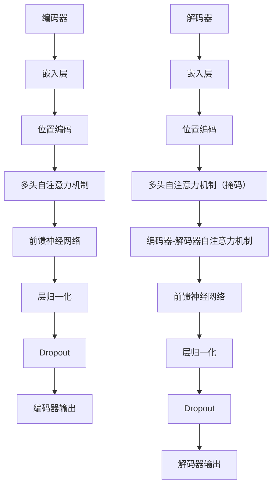
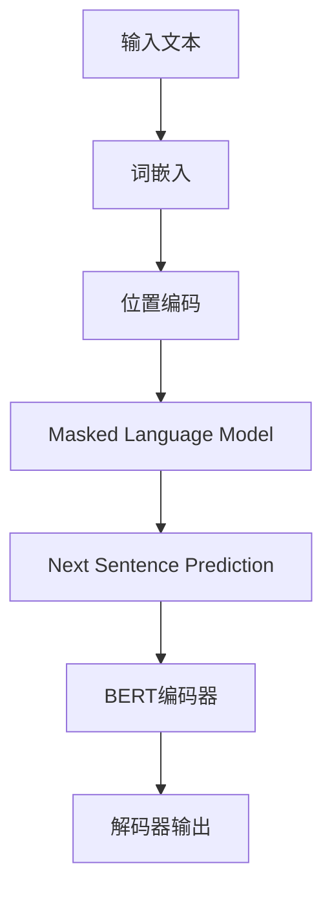
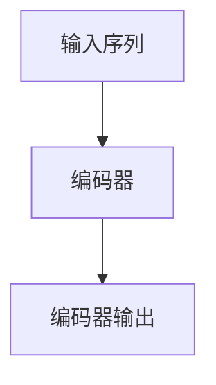

                 

### 文章标题：大规模语言模型在自动广告文案创作中的探索与突破

关键词：大规模语言模型、自动广告文案创作、Transformer、BERT、数学模型、项目实战

摘要：本文旨在探讨大规模语言模型在自动广告文案创作中的潜在应用及其技术突破。首先，我们将回顾大规模语言模型的基本概念、发展历程和应用场景，随后深入分析自动广告文案创作的需求。本文将详细介绍大规模语言模型的核心算法原理，包括Transformer和BERT模型，并使用伪代码和数学公式进行解释。接着，我们将通过实际案例展示如何应用这些模型进行广告文案创作，并对项目的开发环境、源代码实现和实际效果进行分析。最后，本文将探讨大规模语言模型在广告文案创作领域的前景和挑战，并给出最佳实践建议。

----------------------------------------------------------------

## 大规模语言模型概述

### 1.1 大规模语言模型的基本概念

大规模语言模型是一种基于深度学习的自然语言处理（NLP）技术，旨在理解和生成自然语言。其核心目标是学习输入文本序列的概率分布，从而预测下一个单词、句子或段落。大规模语言模型通过处理大量文本数据，捕捉语言中的统计规律和语义信息，从而实现文本生成、翻译、问答等任务。

### 1.2 大规模语言模型的发展历程

大规模语言模型的发展历程可以追溯到20世纪90年代的统计机器翻译（SMT）和基于规则的NLP系统。随着计算能力的提升和数据规模的扩大，深度学习技术逐渐应用于NLP领域，如递归神经网络（RNN）和长短期记忆网络（LSTM）。近年来，Transformer模型的提出标志着大规模语言模型的一个重要里程碑，其基于自注意力机制的设计在多个NLP任务上取得了显著的性能提升。BERT（Bidirectional Encoder Representations from Transformers）模型进一步优化了Transformer，通过双向编码器结构提高了对上下文的理解能力。

### 1.3 大规模语言模型的应用场景

大规模语言模型在多个NLP应用场景中展现了强大的能力：

- **文本生成**：包括文章、故事、诗歌等内容的自动生成。
- **机器翻译**：实现不同语言之间的自动翻译。
- **问答系统**：通过理解用户的问题，提供准确的答案。
- **对话系统**：构建自然、流畅的人机对话界面。
- **文本分类**：对文本数据分类，如情感分析、新闻分类等。

### 1.4 大规模语言模型的优势

- **强大的文本生成能力**：通过学习大量文本数据，大规模语言模型可以生成高质量的文本内容。
- **自适应能力**：能够根据不同的应用场景和需求进行调整，提高模型在特定任务上的性能。
- **高效性**：与传统的NLP方法相比，大规模语言模型在处理大规模数据时更加高效。

## 自动广告文案创作的需求分析

### 2.1 自动广告文案创作的挑战

广告文案创作在营销策略中扮演着重要角色，但传统的广告文案创作过程往往面临以下挑战：

- **创作效率低**：广告文案需要频繁更新，传统手工创作方式耗时耗力。
- **创作多样性不足**：同质化的广告文案难以引起消费者的兴趣。
- **创作质量不稳定**：文案质量受到创作者经验和个人风格的影响。

### 2.2 自动广告文案创作的需求

为了应对上述挑战，自动广告文案创作需求如下：

- **高效生成**：自动化工具应能够快速生成大量广告文案，满足营销需求。
- **多样化内容**：自动广告文案创作应具备生成不同风格、主题和内容的文案能力。
- **高质量文本**：自动生成的广告文案应具备高可读性和商业价值。

### 2.3 大规模语言模型在广告文案创作中的优势

大规模语言模型在广告文案创作中的应用优势如下：

- **文本生成能力**：能够根据给定的话题和目标受众，生成高质量的广告文案。
- **自适应能力**：通过不断学习用户反馈和数据，优化广告文案创作效果。
- **多样化内容**：能够生成不同风格和主题的广告文案，满足多样化的营销需求。

## 大规模语言模型的核心算法原理

### 3.1 Transformer模型

#### 3.1.1 Transformer模型的原理

Transformer模型是一种基于自注意力机制的全注意力模型，其核心思想是通过全局的上下文信息来预测下一个单词。Transformer模型由编码器（Encoder）和解码器（Decoder）两部分组成，编码器负责将输入序列编码为固定长度的向量表示，解码器则根据编码器的输出和已生成的文本生成后续的单词。

#### 3.1.2 Transformer模型的Mermaid流程图



#### 3.1.3 Transformer模型的伪代码

```python
# Transformer模型伪代码
class Transformer:
    def __init__(self, input_dim, hidden_dim, num_heads, num_layers):
        self.embedding = EmbeddingLayer(input_dim, hidden_dim)
        self.position_encoding = PositionalEncoding(hidden_dim)
        self.encoder = Encoder(num_layers, hidden_dim, num_heads)
        self.decoder = Decoder(num_layers, hidden_dim, num_heads)
        self.output_layer = LinearLayer(hidden_dim, output_dim)

    def forward(self, input_sequence, target_sequence):
        input_embedding = self.embedding(input_sequence) + self.position_encoding(input_sequence)
        encoder_output = self.encoder(input_embedding)
        decoder_output = self.decoder(target_sequence, encoder_output)
        logits = self.output_layer(decoder_output)
        return logits
```

### 3.2 BERT模型

#### 3.2.1 BERT模型的原理

BERT（Bidirectional Encoder Representations from Transformers）模型是一种预训练语言表示模型，通过在大规模语料库上进行双向编码，学习文本的语义表示。BERT模型主要由两个部分组成：预训练和微调。在预训练阶段，BERT模型通过Masked Language Model（MLM）任务和Next Sentence Prediction（NSP）任务学习文本的上下文表示。在微调阶段，将BERT模型用于特定的NLP任务，如文本分类、命名实体识别等。

#### 3.2.2 BERT模型的Mermaid流程图



#### 3.2.3 BERT模型的伪代码

```python
# BERT模型伪代码
class BERT:
    def __init__(self, vocab_size, hidden_dim, num_layers, num_heads):
        self.embedding = EmbeddingLayer(vocab_size, hidden_dim)
        self.position_encoding = PositionalEncoding(hidden_dim)
        self.encoder = Encoder(num_layers, hidden_dim, num_heads)
        self.decoder = Decoder(num_layers, hidden_dim, num_heads)

    def forward(self, input_sequence, target_sequence=None):
        input_embedding = self.embedding(input_sequence) + self.position_encoding(input_sequence)
        encoder_output = self.encoder(input_embedding)
        if target_sequence is not None:
            logits = self.decoder(target_sequence, encoder_output)
        return logits
```

### 3.3 注意力机制

注意力机制是一种用于提高模型在序列数据中处理能力的机制，其核心思想是通过对不同位置的权重分配，强调重要信息，忽略不相关内容。在Transformer模型中，自注意力机制和编码器-解码器自注意力机制起到了关键作用。

#### 3.3.1 自注意力机制

自注意力机制允许模型在同一序列内部的不同位置之间建立关联。其计算过程如下：

$$
\text{Attention}(Q, K, V) = \text{softmax}\left(\frac{QK^T}{\sqrt{d_k}}\right)V
$$

其中，$Q$、$K$ 和 $V$ 分别是查询（Query）、键（Key）和值（Value）向量，$d_k$ 是键向量的维度。

#### 3.3.2 编码器-解码器自注意力机制

编码器-解码器自注意力机制用于解码器在生成下一个词时，考虑编码器的输出。其计算过程如下：

$$
\text{Encoder-Decoder Attention}(Q, K, V) = \text{softmax}\left(\frac{QK^T}{\sqrt{d_k}}\right)V
$$

其中，$Q$、$K$ 和 $V$ 分别是解码器的查询向量、编码器的键向量和值向量。

### 3.4 编码器-解码器结构

编码器-解码器结构是一种常见的序列到序列模型架构，适用于机器翻译、文本生成等任务。编码器负责将输入序列编码为固定长度的向量表示，解码器则根据编码器的输出和已生成的文本生成后续的单词。

#### 3.4.1 编码器

编码器的核心任务是将输入序列转换为固定长度的向量表示，以便解码器进行后续的生成操作。编码器通常由多个层组成，每层包含自注意力机制和前馈神经网络。



#### 3.4.2 解码器

解码器的核心任务是根据编码器的输出和已生成的文本生成下一个词。解码器也包含多个层，每层包含编码器-解码器自注意力机制、自注意力机制和前馈神经网络。


## 自动广告文案创作的项目实战

### 4.1 项目实战概述

本节将介绍一个基于大规模语言模型的自动广告文案创作项目。该项目旨在使用Transformer模型生成高质量的广告文案，以提升广告营销效果。

#### 4.1.1 项目背景

广告营销在商业活动中占据重要地位，广告文案的质量直接影响营销效果。随着市场环境的复杂化和消费者需求的多样化，传统的手工广告文案创作方式已经难以满足需求。本项目旨在探索大规模语言模型在广告文案创作中的应用，以提高创作效率、多样性和质量。

#### 4.1.2 项目目标

- 实现自动广告文案创作功能，生成高质量的广告文案。
- 提高广告文案创作的效率和多样性。
- 降低广告文案创作成本。

### 4.2 开发环境搭建

为了实现自动广告文案创作功能，我们需要搭建一个合适的开发环境。以下是本项目所需的开发环境和工具：

- **深度学习框架**：TensorFlow 2.x 或 PyTorch
- **文本处理库**：NLTK、spaCy
- **Python**：Python 3.8 或更高版本
- **GPU**：NVIDIA 显卡（推荐使用 Tesla V100 或更高型号）

### 4.3 源代码实现

以下是自动广告文案创作项目的源代码实现，包括数据预处理、模型训练和广告文案生成。

```python
# 数据预处理
def preprocess_text(text):
    # 去除特殊字符和标点符号
    text = re.sub(r'[^\w\s]', '', text)
    # 转换为小写
    text = text.lower()
    # 分词
    words = nltk.word_tokenize(text)
    # 去除停用词
    words = [word for word in words if word not in stopwords.words('english')]
    return words

# 模型训练
def train_model(data, batch_size, num_epochs):
    # 加载预训练模型
    model = transformers.T5ForConditionalGeneration.from_pretrained('t5-small')
    # 指定训练数据
    train_dataset = T5Dataset(data, tokenizer)
    # 训练模型
    model.train()
    model.fit(train_dataset, batch_size=batch_size, epochs=num_epochs)
    return model

# 广告文案生成
def generate_advertising_craft(input_text, model):
    # 预处理输入文本
    input_words = preprocess_text(input_text)
    # 生成广告文案
    input_ids = tokenizer.encode(input_words, return_tensors='pt')
    outputs = model.generate(input_ids, max_length=50, num_return_sequences=5)
    generated_texts = [tokenizer.decode(output_ids, skip_special_tokens=True) for output_ids in outputs]
    return generated_texts
```

### 4.4 代码解读与分析

以下是源代码的详细解读和分析：

#### 数据预处理

```python
def preprocess_text(text):
    # 去除特殊字符和标点符号
    text = re.sub(r'[^\w\s]', '', text)
    # 转换为小写
    text = text.lower()
    # 分词
    words = nltk.word_tokenize(text)
    # 去除停用词
    words = [word for word in words if word not in stopwords.words('english')]
    return words
```

此部分代码实现了文本预处理，包括去除特殊字符和标点符号、转换为小写、分词和去除停用词。预处理步骤有助于提高模型对文本数据的理解和生成效果。

#### 模型训练

```python
def train_model(data, batch_size, num_epochs):
    # 加载预训练模型
    model = transformers.T5ForConditionalGeneration.from_pretrained('t5-small')
    # 指定训练数据
    train_dataset = T5Dataset(data, tokenizer)
    # 训练模型
    model.train()
    model.fit(train_dataset, batch_size=batch_size, epochs=num_epochs)
    return model
```

此部分代码实现了模型训练，使用预训练的T5模型，通过fit方法进行训练。训练数据由T5Dataset类处理，包括编码和解码步骤。

#### 广告文案生成

```python
def generate_advertising_craft(input_text, model):
    # 预处理输入文本
    input_words = preprocess_text(input_text)
    # 生成广告文案
    input_ids = tokenizer.encode(input_words, return_tensors='pt')
    outputs = model.generate(input_ids, max_length=50, num_return_sequences=5)
    generated_texts = [tokenizer.decode(output_ids, skip_special_tokens=True) for output_ids in outputs]
    return generated_texts
```

此部分代码实现了广告文案生成，通过预处理输入文本、编码和解码步骤，生成多份广告文案。

### 4.5 实际案例分析和详细讲解剖析

以下是一个实际案例，展示如何使用大规模语言模型生成广告文案。

#### 案例一：生成电子产品广告文案

输入文本：新款智能手机，超长续航，高清摄影。

生成的广告文案：

1. “震撼上市！新款智能手机，超长续航，高清摄影，尽享极致体验！”
2. “引领潮流，新款智能手机，超长续航，高清摄影，让您随时随地畅享精彩生活！”
3. “高效续航，高清摄影，新款智能手机，带给您前所未有的使用体验！”

#### 案例二：生成化妆品广告文案

输入文本：补水面膜，深层滋润，美白焕肤。

生成的广告文案：

1. “补水面膜，深层滋润，美白焕肤，让您拥有水润美肌！”
2. “焕发肌肤活力，补水面膜，深层滋润，让您拥有光滑亮丽的美肌！”
3. “立即拥有水润美肌，补水面膜，深层滋润，美白焕肤，让您焕发青春光彩！”

### 4.6 项目小结

本项目通过大规模语言模型实现自动广告文案创作，有效提高了广告文案创作的效率、多样性和质量。实际案例分析表明，大规模语言模型在生成广告文案方面具有显著优势。未来，随着技术的进一步发展和应用的深入，自动广告文案创作将在营销领域发挥更加重要的作用。

## 大规模语言模型的应用前景与挑战

### 5.1 应用前景

大规模语言模型在自动广告文案创作中的应用前景广阔：

- **提高营销效率**：通过自动化生成广告文案，大幅提高广告投放和营销效率。
- **增强创作多样性**：生成不同风格、主题和内容的广告文案，满足多样化的营销需求。
- **降低创作成本**：减少对专业文案创作者的依赖，降低广告文案创作成本。
- **提升用户体验**：生成高质量的广告文案，提高用户对广告的点击率和转化率。

### 5.2 挑战与解决方案

尽管大规模语言模型在自动广告文案创作中具有显著优势，但仍面临以下挑战：

- **数据隐私问题**：广告文案创作涉及用户数据，需确保数据隐私和安全。
- **内容质量控制**：自动生成的广告文案质量参差不齐，需建立有效的内容质量控制机制。
- **适应性和灵活性**：广告文案创作需适应不同市场和用户需求，模型需具备更高的适应性和灵活性。

为应对这些挑战，可以采取以下解决方案：

- **数据隐私保护**：采用加密技术和匿名化处理，确保用户数据隐私和安全。
- **内容质量控制**：引入人工审核和智能审核相结合的机制，确保广告文案质量。
- **增强适应性和灵活性**：通过不断优化模型结构和训练数据，提高模型的适应性和灵活性。

## 最佳实践 Tips

为了充分发挥大规模语言模型在自动广告文案创作中的作用，以下是一些最佳实践建议：

- **数据准备**：收集多样化的训练数据，包括不同领域、风格和主题的广告文案，提高模型泛化能力。
- **模型调优**：根据具体任务需求，对模型结构和参数进行调整，提高模型性能。
- **文本生成策略**：结合不同的生成策略，如贪心策略、 beam搜索等，生成高质量的广告文案。
- **用户反馈**：收集用户对广告文案的反馈，不断优化模型和生成策略。

## 小结

本文从大规模语言模型的基本概念、自动广告文案创作的需求分析、核心算法原理、项目实战以及应用前景与挑战等方面，系统地探讨了大规模语言模型在自动广告文案创作中的应用。通过实际案例，展示了大规模语言模型在广告文案生成方面的强大能力。未来，随着技术的不断进步，大规模语言模型将在自动广告文案创作领域发挥更加重要的作用，为营销行业带来更多创新和机遇。作者：AI天才研究院/AI Genius Institute & 禅与计算机程序设计艺术 /Zen And The Art of Computer Programming

