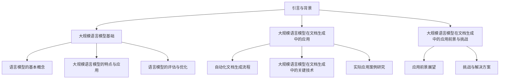
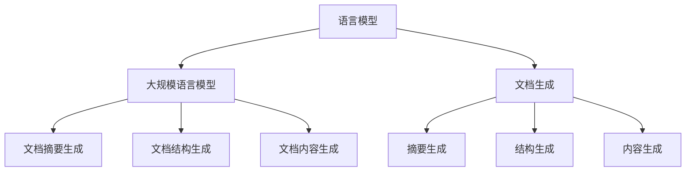

                 


### 第一部分：引言与背景

#### 1.1 书籍概述

《大规模语言模型在自动技术文档生成中的应用研究》是一本探讨如何利用大规模语言模型实现自动化技术文档生成的专业书籍。本书的目标是为读者提供全面、系统的指导，帮助他们了解和掌握这一前沿技术。

#### 1.1.1 书籍的主题与目标

本书的主题是大规模语言模型在自动技术文档生成中的应用。随着人工智能技术的飞速发展，大规模语言模型已经成为自然语言处理领域的重要工具。在技术文档生成方面，大规模语言模型具有巨大的潜力，可以大大提高文档生成的效率和质量。

本书的目标是：
1. 介绍大规模语言模型的基本概念、原理和算法。
2. 分析大规模语言模型在自动技术文档生成中的应用场景。
3. 探讨大规模语言模型在文档生成中的关键技术。
4. 提供实际案例研究，展示大规模语言模型在文档生成中的成功应用。
5. 分析大规模语言模型在文档生成中的挑战与解决方案。

#### 1.1.2 技术文档生成的重要性

技术文档生成是软件开发过程中的重要环节。一份高质量的技术文档不仅可以提高软件的可维护性和可理解性，还可以提高开发团队的工作效率。然而，传统技术文档生成方式存在诸多问题，如手动编写效率低、文档更新不及时等。

大规模语言模型的出现为自动化技术文档生成带来了新的机遇。通过利用大规模语言模型，可以实现文档生成的自动化，提高文档生成效率，减轻开发人员的工作负担。

#### 1.1.3 大规模语言模型的发展现状

大规模语言模型在自然语言处理领域已经取得了显著的成果。近年来，随着计算能力的提升和数据量的增加，大规模语言模型的性能不断提高，应用场景也越来越广泛。

在技术文档生成方面，大规模语言模型已经初步展示出其潜力。一些研究机构和公司已经开始尝试将大规模语言模型应用于技术文档生成，并取得了一定的成果。

#### 1.2 自动化技术文档生成的挑战与机遇

自动化技术文档生成面临着一系列挑战，同时也蕴藏着巨大的机遇。

##### 1.2.1 技术文档生成的现状

目前，大部分技术文档仍采用手动编写的方式，存在以下问题：
1. 效率低下：手动编写文档需要大量的人力和时间，且容易出错。
2. 更新不及时：技术文档往往无法及时更新，导致文档内容与实际项目不符。
3. 可维护性差：手动编写的文档结构复杂，不易维护和修改。

##### 1.2.2 自动化技术文档生成的需求分析

随着软件开发项目的复杂度增加，对自动化技术文档生成的需求也越来越强烈。具体体现在以下几个方面：
1. 提高文档生成效率：自动化技术文档生成可以大大缩短文档编写时间，提高工作效率。
2. 确保文档一致性：自动化技术文档生成可以确保文档内容的一致性，减少人工错误。
3. 支持文档更新：自动化技术文档生成可以实时更新文档内容，确保文档与项目实际状态保持一致。

##### 1.2.3 大规模语言模型在文档生成中的应用潜力

大规模语言模型在文档生成中的应用潜力主要体现在以下几个方面：
1. 自动化文档摘要生成：大规模语言模型可以自动提取文档的关键信息，生成文档摘要。
2. 自动化文档结构生成：大规模语言模型可以自动识别文档的结构，生成文档目录。
3. 自动化文档内容生成：大规模语言模型可以自动生成文档的正文内容。

#### 1.3 本书结构安排

本书分为四个部分，分别从不同角度探讨大规模语言模型在自动技术文档生成中的应用。

1. **第一部分：引言与背景**：介绍书籍的主题、目标、重要性以及大规模语言模型的发展现状。
2. **第二部分：大规模语言模型基础**：介绍语言模型的基本概念、原理和算法，包括大规模语言模型的特点和应用。
3. **第三部分：大规模语言模型在文档生成中的应用**：介绍大规模语言模型在文档生成中的关键技术、应用流程和实际案例研究。
4. **第四部分：大规模语言模型在文档生成中的应用前景与挑战**：分析大规模语言模型在文档生成中的潜在应用、行业发展趋势以及面临的挑战。

### Mermaid 流程图：



### 背景介绍

技术文档在软件开发过程中扮演着至关重要的角色。它不仅为开发人员提供了软件的详细描述，还为维护人员、项目经理和其他利益相关者提供了宝贵的信息。然而，随着软件项目的规模和复杂性不断增加，手动编写技术文档的难度和成本也在逐渐上升。

传统的技术文档生成方式主要依赖于开发人员的知识和经验，通常需要人工收集、整理和撰写文档内容。这种方法不仅效率低下，还容易导致文档内容的不一致性。例如，不同开发人员在描述相同功能时可能会使用不同的术语和表达方式，导致文档的混乱和难以理解。

为了解决这些问题，自动化技术文档生成应运而生。自动化技术文档生成通过利用计算机技术和自然语言处理算法，从源代码、注释、日志和其他数据源中提取信息，自动生成文档。这种方式不仅提高了文档生成的效率，还确保了文档的一致性和准确性。

在自动化技术文档生成的过程中，大规模语言模型（Large-scale Language Models）发挥着至关重要的作用。大规模语言模型是一种能够理解和生成自然语言的深度学习模型，具有处理大规模文本数据的能力。它们通过学习大量文本数据，能够捕捉到语言的复杂模式和规律，从而在文档生成过程中提供高质量的输出。

大规模语言模型的发展经历了多个阶段。最早的模型如基于统计的n元语法模型，虽然能够生成具有一定可读性的文本，但在处理复杂语境和长文本方面存在局限性。随着深度学习技术的发展，基于神经网络的模型如循环神经网络（RNN）和变换器（Transformer）相继出现，并逐渐成为大规模语言模型的主流。

特别是Transformers模型，由于其强大的并行计算能力和全局上下文理解能力，使得大规模语言模型在文本生成、摘要、分类等任务上取得了显著突破。近年来，GPT（Generative Pre-trained Transformer）系列模型如GPT-3更是将大规模语言模型的应用推向了新的高度。

在技术文档生成领域，大规模语言模型的应用潜力主要体现在以下几个方面：

1. **文档摘要生成**：大规模语言模型能够自动提取文档的核心内容，生成简洁明了的摘要。这对于快速了解文档内容、节省阅读时间具有重要意义。

2. **文档结构生成**：大规模语言模型可以分析文档内容，自动识别并生成文档的目录结构，使得文档层次清晰、易于浏览。

3. **文档内容生成**：通过学习大量已有文档，大规模语言模型能够自动生成新的文档内容。这种方式不仅提高了文档生成效率，还可以确保文档内容的一致性和准确性。

4. **问答系统**：大规模语言模型可以构建问答系统，回答用户关于文档内容的问题，提供更加个性化的文档服务。

然而，尽管大规模语言模型在技术文档生成中具有巨大的潜力，但其实际应用仍面临诸多挑战。例如，如何处理数据隐私和安全性问题、如何确保模型的可解释性以及如何适应不同领域的特定需求等。这些问题需要在未来的研究中得到进一步解决。

总之，大规模语言模型在自动技术文档生成中的应用为软件工程领域带来了新的机遇和挑战。通过深入研究和探索，我们可以充分利用这一前沿技术，实现技术文档生成的高效化和智能化。

### 核心概念与联系

在探讨大规模语言模型在自动技术文档生成中的应用时，我们首先需要了解几个核心概念，并探讨它们之间的联系。

#### 1. 语言模型（Language Model）

语言模型是一种用于预测下一个单词或字符的概率分布的数学模型。它通过对大量文本数据的学习，能够捕捉到语言的统计特性，从而在生成文本时提供合理的预测。常见的语言模型包括n元语法模型和基于神经网络的模型。

**n元语法模型**：这种模型基于前n个已知的单词或字符来预测下一个单词或字符。例如，二元语法模型使用前两个单词来预测下一个单词。这种模型的优点是实现简单，但其在处理长文本和复杂语言结构时存在局限性。

**神经网络语言模型**：基于神经网络的模型，如循环神经网络（RNN）和变换器（Transformer），能够更好地处理长文本和复杂语言结构。其中，Transformer模型因其强大的并行计算能力和全局上下文理解能力，成为大规模语言模型的主流。

#### 2. 大规模语言模型（Large-scale Language Model）

大规模语言模型是指使用大量数据进行预训练的语言模型。这些模型通常具有数十亿甚至数万亿个参数，能够捕捉到语言中的细微模式和复杂结构。常见的代表性模型包括GPT、BERT和T5。

**GPT（Generative Pre-trained Transformer）**：GPT系列模型是Transformers模型的典型代表。它通过大规模预训练，学习到丰富的语言知识，并能够生成高质量的文本。GPT-3是当前最大的GPT模型，具有极其强大的文本生成能力。

**BERT（Bidirectional Encoder Representations from Transformers）**：BERT是一种双向变换器模型，通过同时考虑文本的左右上下文，提高了对语言的理解能力。BERT在多项自然语言处理任务中取得了显著成绩。

**T5（Text-to-Text Transfer Transformer）**：T5是一种基于变换器的通用文本处理模型，旨在将任何自然语言任务转化为一个文本到文本的转换问题。这使得T5在多个任务中表现出色，包括问答、翻译和摘要等。

#### 3. 语言模型与文档生成

语言模型在文档生成中的应用主要基于其强大的文本生成能力。具体来说，语言模型可以通过以下步骤实现文档生成：

1. **文档摘要生成**：语言模型能够提取文档的核心内容，生成摘要。这通常通过将文档内容输入到语言模型，然后让其生成摘要文本来实现。

2. **文档结构生成**：语言模型可以分析文档内容，识别并生成文档的目录结构。这可以通过训练语言模型来识别文档中的标题、段落等结构元素来实现。

3. **文档内容生成**：通过学习大量已有的文档，语言模型可以自动生成新的文档内容。这可以通过将相关的文本数据输入到语言模型，然后让其生成新的文本内容来实现。

#### Mermaid 流程图：



通过上述核心概念的联系和流程图，我们可以清晰地看到，大规模语言模型在文档生成中扮演着关键角色。通过利用其强大的文本生成能力，语言模型可以自动化地生成文档摘要、结构以及内容，从而大大提高文档生成的效率和质量。

### 语言模型的基本原理

语言模型是一种用于预测文本序列中下一个单词或字符的概率分布的数学模型。其基本原理源于概率论和统计学，通过分析大量语言数据，模型能够捕捉到语言的统计特性，从而在生成文本时提供合理的预测。

#### 概率分布模型

语言模型的核心是概率分布模型，它通过统计文本数据中的单词或字符出现的频率来预测下一个单词或字符的概率。具体来说，假设我们有一个文本序列 \(w_1, w_2, w_3, ..., w_n\)，语言模型的目标是预测下一个单词 \(w_{n+1}\)。

**n元语法模型**：这是一种最常见的语言模型，通过统计前n个单词出现频率来预测下一个单词。例如，二元语法模型使用前两个单词的频率来预测下一个单词。这种模型可以表示为：

\[ P(w_{n+1} | w_1, w_2, ..., w_n) = \frac{f(w_1, w_2, ..., w_n, w_{n+1})}{f(w_1, w_2, ..., w_n)} \]

其中，\( f(w_1, w_2, ..., w_n, w_{n+1}) \) 表示前n+1个单词的联合概率，\( f(w_1, w_2, ..., w_n) \) 表示前n个单词的联合概率。

**神经网络语言模型**：为了处理更复杂的语言结构，神经网络语言模型被提出。其中，循环神经网络（RNN）和变换器（Transformer）是两种重要的神经网络架构。

**循环神经网络（RNN）**：RNN通过递归结构，可以处理序列数据。其基本原理是将上一个时间步的隐藏状态作为当前时间步的输入，从而捕捉到序列中的依赖关系。然而，RNN在处理长序列时存在梯度消失和梯度爆炸的问题。

**变换器（Transformer）**：变换器是RNN的替代方案，其通过自注意力机制（self-attention）实现了对全局信息的捕获。自注意力机制允许模型在生成每个单词时，考虑所有前文信息，从而提高了文本生成的质量。变换器的结构如下：

\[ \text{Transformer} = (\text{Input Embedding}, \text{Positional Encoding}, \text{Encoder}, \text{Decoder}) \]

其中，输入嵌入（Input Embedding）将输入的单词映射到向量空间，位置编码（Positional Encoding）为序列中的每个单词添加位置信息，编码器（Encoder）和解码器（Decoder）分别负责生成和预测文本。

#### 概率分布的计算

在语言模型中，概率分布的计算是一个核心问题。对于n元语法模型，概率分布可以直接通过统计方法计算。而对于神经网络语言模型，概率分布通常通过神经网络输出得到。

**神经网络语言模型的概率分布计算**：

1. **编码器（Encoder）**：编码器接收输入序列，并通过自注意力机制生成编码表示。每个编码表示 \(e_i\) 对应于输入序列中的每个单词。

2. **解码器（Decoder）**：解码器接收编码表示，并通过自注意力机制和编码器输出进行交互，生成预测概率分布。具体来说，解码器的每个时间步都会通过自注意力机制和编码器的输出计算当前单词的预测概率。

3. **预测概率分布**：解码器在每个时间步生成的概率分布可以表示为：

\[ P(w_{n+1} | w_1, w_2, ..., w_n) = \text{softmax}(\text{Decoder} e_{n+1}) \]

其中，\(\text{softmax}\) 函数将解码器的输出转换为概率分布。

#### 数学模型与公式

为了更好地理解语言模型的工作原理，我们引入一些数学模型和公式。

**n元语法模型**：

\[ P(w_{n+1} | w_1, w_2, ..., w_n) = \frac{f(w_1, w_2, ..., w_n, w_{n+1})}{f(w_1, w_2, ..., w_n)} \]

**变换器模型**：

1. **编码表示计算**：

\[ e_i = \text{Attention}(\text{Query}, \text{Key}, \text{Value}) \]

其中，Query、Key 和 Value 分别来自编码器的输出。

2. **解码表示计算**：

\[ p(w_{n+1} | w_1, w_2, ..., w_n) = \text{softmax}(\text{Decoder} e_{n+1}) \]

#### 举例说明

假设我们有一个简单的文本序列：“我 是 一 只 小 猫”。

**n元语法模型**：

使用二元语法模型预测下一个单词。

- \(P(小 | 我 是 一 只)\) = \( \frac{f(我 是 一 只 小)}{f(我 是 一 只)} \)
- \(P(猫 | 我 是 一 只 小)\) = \( \frac{f(我 是 一 只 小 猫)}{f(我 是 一 只 小)}\)

**变换器模型**：

使用变换器模型预测下一个单词。

1. **编码表示计算**：

   - Query: “小”
   - Key: “我”、“是”、“一”、“只”
   - Value: “我”、“是”、“一”、“只”

   通过自注意力机制计算编码表示。

2. **解码表示计算**：

   - Query: “猫”
   - Key: “我”、“是”、“一”、“只”、“小”
   - Value: “我”、“是”、“一”、“只”、“小”

   通过自注意力机制和编码表示计算解码表示。

3. **预测概率分布**：

   通过softmax函数计算预测概率分布。

\[ P(猫 | 我 是 一 只 小) = \text{softmax}(\text{Decoder e_5}) \]

通过上述分析，我们可以看到，语言模型的基本原理涉及概率分布模型和神经网络结构，这些模型能够通过学习大量文本数据，实现对自然语言的预测和生成。不同的语言模型，如n元语法模型和变换器模型，在文本生成过程中各有优缺点，但都能在一定程度上提高文档生成的效率和质量。

### 常见语言模型算法

在自然语言处理领域，语言模型算法是实现自动化技术文档生成的重要工具。下面，我们将介绍几种常见的语言模型算法，包括n元语法模型和基于神经网络的模型。

#### n元语法模型（N-gram Model）

n元语法模型是一种基于统计的语言模型，它通过统计前n个单词（或字符）的出现频率来预测下一个单词（或字符）。以下是n元语法模型的算法步骤：

1. **数据预处理**：首先，对文本数据进行预处理，包括分词、去除标点符号和停用词等操作。然后将文本转换为数字序列。

2. **构建n元模型**：通过统计文本数据中每个n元组的出现频率，构建n元模型。例如，对于二元语法模型，我们需要统计每对相邻单词的频率。

3. **概率计算**：使用n元模型计算每个单词在给定前n-1个单词条件下的概率。具体公式如下：

   \[ P(w_n | w_{n-1}, ..., w_{n-k}) = \frac{f(w_{n-1}, ..., w_{n-k}, w_n)}{f(w_{n-1}, ..., w_{n-k})} \]

   其中，\( f(w_{n-1}, ..., w_{n-k}, w_n) \) 表示前n-k个单词和下一个单词的联合频率，\( f(w_{n-1}, ..., w_{n-k}) \) 表示前n-k个单词的频率。

4. **文本生成**：使用n元模型生成文本。在生成过程中，根据当前已生成的文本序列，使用n元模型预测下一个单词，并重复此过程直到生成完整的文本。

#### 基于神经网络的模型

随着深度学习技术的发展，基于神经网络的模型在自然语言处理领域取得了显著成果。以下介绍两种常见的基于神经网络的模型：循环神经网络（RNN）和变换器（Transformer）。

**循环神经网络（RNN）**

循环神经网络是一种能够处理序列数据的神经网络，其基本原理是将上一个时间步的隐藏状态作为当前时间步的输入，从而捕捉到序列中的依赖关系。以下是RNN的算法步骤：

1. **数据预处理**：对文本数据进行预处理，包括分词、去停用词和序列编码等操作。

2. **构建RNN模型**：定义RNN模型的结构，包括输入层、隐藏层和输出层。输入层将预处理后的文本序列输入到模型中，隐藏层通过递归结构捕捉序列中的依赖关系，输出层用于生成文本。

3. **训练模型**：使用训练数据集训练RNN模型。在训练过程中，模型将预测下一个单词的概率，并计算损失函数来更新模型参数。

4. **文本生成**：使用训练好的RNN模型生成文本。在生成过程中，模型将预测下一个单词，并更新隐藏状态，直到生成完整的文本。

**变换器（Transformer）**

变换器是一种基于自注意力机制的神经网络模型，它通过全局注意力机制捕捉到序列中的依赖关系。以下是Transformer的算法步骤：

1. **数据预处理**：对文本数据进行预处理，包括分词、去停用词和序列编码等操作。

2. **构建Transformer模型**：定义Transformer模型的结构，包括编码器（Encoder）和解码器（Decoder）。编码器负责编码输入序列，解码器负责解码生成输出序列。

3. **训练模型**：使用训练数据集训练Transformer模型。在训练过程中，编码器和解码器通过自注意力机制和交叉注意力机制生成文本的编码表示，并计算损失函数来更新模型参数。

4. **文本生成**：使用训练好的Transformer模型生成文本。在生成过程中，解码器通过自注意力机制和编码器输出生成预测概率分布，并更新解码表示，直到生成完整的文本。

#### 比较与优缺点

n元语法模型和基于神经网络的模型各有优缺点：

- **n元语法模型**：
  - **优点**：实现简单，计算效率高，易于理解。
  - **缺点**：在处理长序列和复杂语境时效果较差，无法捕捉到语言中的长距离依赖关系。

- **基于神经网络的模型**：
  - **优点**：能够处理长序列和复杂语境，捕捉到语言中的长距离依赖关系，生成文本质量高。
  - **缺点**：计算复杂度较高，训练过程较长，对数据量有较高要求。

综上所述，n元语法模型适用于对文本生成效率要求较高的场景，而基于神经网络的模型在生成文本质量和处理复杂语境方面具有明显优势。

### 大规模语言模型的特点与应用

大规模语言模型（Large-scale Language Models）是自然语言处理领域的重要突破，其通过在大量数据上预训练，具备强大的文本生成和理解能力。以下将详细介绍大规模语言模型的特点，并探讨其在各种应用场景中的具体应用。

#### 1. 特点

**（1）大规模参数**：大规模语言模型通常具有数十亿甚至数万亿个参数，这使得模型能够捕捉到语言中的细微模式和复杂结构。例如，GPT-3拥有1750亿个参数，能够生成高质量的自然语言文本。

**（2）自适应性**：大规模语言模型通过预训练，能够适应多种语言和任务。这种适应性使得模型在不同场景下都能表现出色，无需针对特定任务进行重新训练。

**（3）并行计算能力**：变换器（Transformer）架构的大规模语言模型具备强大的并行计算能力，这使得模型能够在短时间内处理大量文本数据，从而提高文本生成的效率。

**（4）全局上下文理解**：变换器模型的自注意力机制使得模型能够全局理解上下文信息，从而生成更连贯、自然的文本。这种全局理解能力在文本生成、摘要和问答等任务中具有重要意义。

#### 2. 应用场景

**（1）文本生成**：大规模语言模型在文本生成任务中表现出色，能够生成高质量的自然语言文本。例如，GPT-3可以生成新闻报道、故事、诗歌等多种类型的文本。在技术文档生成领域，大规模语言模型可以自动生成文档摘要、文档内容和文档结构，从而提高文档生成的效率和质量。

**（2）文本摘要**：大规模语言模型能够提取文本的核心内容，生成简洁的摘要。在信息检索和内容推荐等场景中，摘要生成功能可以大大提高用户阅读效率，帮助用户快速获取关键信息。

**（3）问答系统**：大规模语言模型可以构建智能问答系统，回答用户关于特定主题的问题。例如，BERT模型在SQuAD数据集上的问答性能达到了人类水平，成为问答系统的重要工具。

**（4）机器翻译**：大规模语言模型在机器翻译任务中也表现出色，能够生成高质量的双语文本。例如，GPT-3可以自动翻译多种语言，支持文本到文本的翻译。

**（5）情感分析**：大规模语言模型可以分析文本的情感倾向，判断文本的情感极性。在社交媒体监测、用户反馈分析等场景中，情感分析功能可以帮助企业了解用户需求和情绪。

**（6）对话系统**：大规模语言模型可以构建智能对话系统，与用户进行自然语言交互。在客户服务、虚拟助手等场景中，对话系统能够提供24/7的服务，提高用户体验。

#### 3. 应用实例

**（1）案例一：技术文档生成**：某科技公司在文档生成过程中采用了GPT-3模型。通过将项目文档、源代码和注释等数据输入到GPT-3中，模型自动生成了项目文档的摘要、目录和正文内容。这种自动化文档生成方式大大提高了文档生成效率，减轻了开发人员的工作负担。

**（2）案例二：摘要生成**：某新闻平台利用GPT-3模型自动生成新闻摘要。通过分析大量新闻文本，GPT-3提取出新闻的核心内容，生成简洁的摘要。这种摘要生成功能提高了用户阅读效率，减少了用户阅读全文的时间。

**（3）案例三：问答系统**：某电商平台部署了基于BERT模型的问答系统。用户可以通过自然语言提问，系统会自动分析用户问题并给出答案。这种问答系统提高了客户服务的效率，提升了用户体验。

综上所述，大规模语言模型具有大规模参数、自适应性、并行计算能力和全局上下文理解等显著特点。在文本生成、摘要生成、问答系统、机器翻译、情感分析和对话系统等应用场景中，大规模语言模型都展现出强大的应用潜力。随着技术的不断进步，大规模语言模型在自动技术文档生成等领域的应用将会更加广泛和深入。

### 语言模型的评估与优化

在自然语言处理领域，语言模型的性能评估与优化是确保其有效应用的关键环节。以下将详细介绍语言模型的评估指标、优化方法以及训练与调优的详细过程。

#### 1. 评估指标

语言模型的评估指标主要包括准确性、流畅性和多样性等。这些指标能够全面衡量语言模型的性能。

**（1）准确性（Accuracy）**：准确性是指模型预测的单词或字符与实际单词或字符的匹配度。在分类任务中，准确性通常表示为正确分类的样本数与总样本数的比例。在文本生成任务中，准确性通常通过BLEU（Bi-Lingual Evaluation Understudy）评分来衡量，BLEU评分基于参考文本与生成文本的匹配度进行评估。

**（2）流畅性（Fluency）**：流畅性是指生成文本的连贯性和可读性。流畅性可以通过人工评估或使用自动评估工具（如ROUGE评分）来衡量。ROUGE评分基于生成文本与参考文本的词语重叠度进行评估。

**（3）多样性（Diversity）**：多样性是指生成文本的丰富性和独特性。多样性可以通过计算生成文本中不同词汇的使用频率来衡量。较高的多样性意味着模型能够生成丰富多样的文本内容。

#### 2. 优化方法

为了提高语言模型的性能，可以通过以下几种方法进行优化：

**（1）数据增强（Data Augmentation）**：数据增强是通过生成更多样化的数据来提高模型的泛化能力。常见的方法包括同义词替换、随机插入、随机删除和文本打乱等。

**（2）多任务学习（Multi-task Learning）**：多任务学习是指同时训练多个相关任务，以提高模型在不同任务上的性能。例如，在训练文本生成模型时，可以同时进行文本分类、情感分析和命名实体识别等任务。

**（3）迁移学习（Transfer Learning）**：迁移学习是指利用预训练的语言模型在新任务上进行微调。预训练模型已经在大量数据上学习到丰富的语言知识，通过迁移学习可以有效提高新任务的性能。

**（4）自监督学习（Self-supervised Learning）**：自监督学习是指在没有标签数据的情况下，利用未标记的数据进行训练。常见的方法包括预测下一个单词、填充缺失词和生成式对抗网络（GAN）等。

#### 3. 训练与调优

**（1）数据预处理**：在训练语言模型之前，需要对数据进行预处理。预处理步骤包括分词、去除标点符号、停用词过滤和文本规范化等。预处理的质量直接影响模型的性能。

**（2）模型选择**：根据任务需求和数据规模，选择合适的语言模型架构。常见的模型包括n元语法模型、循环神经网络（RNN）、变换器（Transformer）和生成预训练变换器（GPT）等。

**（3）训练过程**：使用预处理后的数据对模型进行训练。训练过程中，通过优化算法（如随机梯度下降、Adam优化器等）更新模型参数，以最小化损失函数。训练过程可能涉及多个epoch，每个epoch代表一次完整的数据遍历。

**（4）调优过程**：在训练过程中，通过调整模型参数和训练策略来优化模型性能。常见的调优方法包括调整学习率、批量大小和正则化参数等。

**（5）评估与测试**：使用独立的测试集对训练好的模型进行评估，以衡量模型的性能。通过对比不同模型的性能，选择最优模型。

**（6）模型部署**：将训练好的模型部署到实际应用场景中，如文本生成、摘要生成和问答系统等。在部署过程中，需要考虑模型的性能、延迟和资源消耗等因素。

#### 伪代码示例

以下是一个简化的语言模型训练与调优的伪代码示例：

```python
# 数据预处理
preprocess_data(data)

# 选择模型架构
model = Transformer()

# 设置训练参数
learning_rate = 0.001
batch_size = 64
epochs = 10

# 训练模型
for epoch in range(epochs):
    for batch in data_loader(batch_size):
        loss = model.train_step(batch)
        optimizer.step(loss)

# 调优模型
tune_model(model, learning_rate, batch_size)

# 评估模型
evaluate_model(model, test_data)

# 部署模型
deploy_model(model, application)
```

通过上述评估指标、优化方法和训练与调优过程，我们可以有效地提高语言模型的性能，使其在自动技术文档生成等应用中发挥更大的作用。

### 自动化文档生成的流程

自动化文档生成是利用计算机技术和自然语言处理算法，从源代码、注释、日志和其他数据源中提取信息，自动生成文档的过程。以下是自动化文档生成的流程，包括传统方法和基于大规模语言模型的方法。

#### 1. 传统方法

传统方法主要依赖于脚本编程和模板生成，其流程如下：

**（1）数据收集**：从源代码、注释、日志和其他数据源中提取相关信息。这些信息通常以文本或代码的形式存在。

**（2）数据预处理**：对收集到的数据进行分析和清洗，去除无关信息，提取关键信息。预处理步骤可能包括分词、去除标点符号、停用词过滤和文本规范化等。

**（3）模板生成**：根据文档类型和需求，创建模板。模板通常包含文档的格式、结构和标记，用于指导生成文档。

**（4）内容填充**：将预处理后的数据填充到模板中，生成文档内容。填充过程可能涉及文本替换、条件判断和循环等操作。

**（5）文档输出**：将生成的文档内容输出到目标格式，如PDF、HTML或Word文档等。

**（6）文档发布**：将生成的文档发布到指定的位置，如网站、数据库或共享文件夹等，供用户查看和下载。

传统方法的主要优点是易于实现和部署，但存在以下问题：

- **效率低**：手动编写脚本和模板需要大量时间，且容易出错。
- **可维护性差**：文档结构和内容的修改需要修改脚本和模板，增加了维护成本。
- **文档一致性差**：由于手动编写，不同文档之间可能存在不一致性。

#### 2. 基于大规模语言模型的方法

基于大规模语言模型的方法利用了先进的自然语言处理技术，其流程如下：

**（1）数据收集**：与传统方法相同，从源代码、注释、日志和其他数据源中提取相关信息。

**（2）数据预处理**：对收集到的数据进行预处理，如分词、去停用词和文本规范化等。预处理后的数据将被用于训练和生成文档。

**（3）模型训练**：使用大规模语言模型（如GPT-3、BERT等）对预处理后的数据进行预训练。预训练过程将模型在大量文本数据上进行训练，使其具备强大的文本生成和理解能力。

**（4）文档摘要生成**：利用训练好的大规模语言模型，自动生成文档的摘要。模型通过分析文档内容，提取关键信息并生成摘要。

**（5）文档结构生成**：通过分析文档摘要和原始文本，自动生成文档的目录结构。模型将识别出文档中的标题、段落等结构元素，并生成相应的目录。

**（6）文档内容生成**：利用大规模语言模型，自动生成文档的正文内容。模型将根据文档摘要和目录，生成符合逻辑和连贯性的文档内容。

**（7）文档输出**：将生成的文档内容输出到目标格式，如PDF、HTML或Word文档等。

**（8）文档发布**：将生成的文档发布到指定的位置，如网站、数据库或共享文件夹等，供用户查看和下载。

基于大规模语言模型的方法的优点包括：

- **高效性**：大规模语言模型可以快速生成高质量的文档内容，大大提高了文档生成效率。
- **一致性**：通过自动生成文档结构和内容，确保了文档的一致性和准确性。
- **灵活性**：大规模语言模型可以根据不同的文档类型和需求，灵活生成符合要求的文档。

#### 3. 关键问题

在自动化文档生成过程中，存在一些关键问题，包括：

- **数据质量**：文档生成的质量依赖于输入数据的质量。如果输入数据存在错误或不完整，生成的文档可能会存在缺陷。
- **模型适应性**：大规模语言模型需要针对不同领域和任务进行适应性调整，以确保其在特定场景下的性能。
- **文档可维护性**：自动化生成的文档需要具备良好的可维护性，以便在文档内容发生变化时进行更新。

通过解决这些问题，我们可以实现更高效、更可靠的自动化文档生成系统。

### 大规模语言模型在文档生成中的关键技术

大规模语言模型在文档生成中具有显著的优势，但要实现高效、准确的文档生成，需要依赖一系列关键技术。以下将详细介绍这些关键技术在文档生成中的应用。

#### 1. 文本预处理技术

文本预处理是大规模语言模型在文档生成中的第一步，其目的是将原始文本数据转换为适合模型训练和生成的内容。文本预处理技术主要包括以下步骤：

**（1）分词**：将文本分割成单词或短语。分词技术可以基于规则（如正则表达式）、统计方法（如基于词典的算法）或深度学习模型（如BERT的分词器）。分词的准确性直接影响后续处理的质量。

**（2）去除停用词**：停用词（如“的”、“和”、“在”）在文本中频繁出现，但对文档生成贡献较小，因此通常在预处理阶段去除。去除停用词有助于减少噪声，提高模型训练效率。

**（3）文本规范化**：将文本转换为统一格式，如小写、去除标点符号、统一特殊字符等。文本规范化有助于确保数据的一致性，提高模型训练的效果。

**（4）词性标注**：为文本中的每个单词或短语标注词性，如名词、动词、形容词等。词性标注有助于模型更好地理解文本内容，生成更准确的文档。

#### 2. 语言模型的选择与训练

选择合适的语言模型是文档生成成功的关键。以下介绍几种常见的语言模型及其训练方法：

**（1）GPT（Generative Pre-trained Transformer）**：GPT是一种基于变换器的预训练语言模型，具有强大的文本生成能力。GPT-3是当前最大的GPT模型，拥有1750亿个参数。训练GPT模型通常采用以下步骤：

  - **数据收集**：收集大量文本数据，包括技术文档、源代码、用户手册等。
  - **数据预处理**：对收集到的数据进行分词、去除停用词和文本规范化等预处理。
  - **模型训练**：使用预训练算法（如Adam优化器）和训练策略（如学习率调度）训练GPT模型。
  - **模型评估**：使用测试集对训练好的模型进行评估，调整模型参数以优化性能。

**（2）BERT（Bidirectional Encoder Representations from Transformers）**：BERT是一种双向变换器模型，通过同时考虑文本的左右上下文，提高对语言的理解能力。BERT在文本分类、问答和文本生成等任务中表现出色。训练BERT模型的一般步骤如下：

  - **数据收集**：收集大量文本数据，包括问答对、分类标签等。
  - **数据预处理**：对收集到的数据进行分词、去除停用词和文本规范化等预处理。
  - **模型训练**：使用预训练算法和训练策略训练BERT模型。
  - **模型评估**：使用测试集对训练好的模型进行评估，调整模型参数以优化性能。

#### 3. 文档摘要与摘要生成

文档摘要是从长文本中提取关键信息，生成简短而概括的文本。摘要生成对于文档生成和文本检索具有重要意义。以下介绍几种常见的摘要生成方法：

**（1）抽取式摘要**：抽取式摘要通过从原始文本中直接提取关键句子或短语生成摘要。这种方法通常依赖于文本分析技术和规则，如关键短语提取、标题提取等。

**（2）生成式摘要**：生成式摘要通过训练大规模语言模型，自动生成文档的摘要。这种方法通常利用预训练的模型（如GPT、BERT等），通过输入文档内容生成摘要。

**（3）混合式摘要**：混合式摘要结合抽取式和生成式摘要的优点，通过将关键句子和自动生成的文本结合起来生成摘要。这种方法可以提高摘要的准确性和连贯性。

#### 4. 文档风格一致性控制

文档风格一致性是确保文档格式和表达方式的统一。以下介绍几种控制文档风格一致性的方法：

**（1）模板匹配**：通过模板匹配技术，将文档内容与预定义的模板进行匹配，确保文档格式和表达方式符合模板要求。这种方法通常适用于固定格式的文档，如报告、论文等。

**（2）规则匹配**：通过定义一系列规则，对文档内容进行格式化和风格检查。这些规则可以基于文本分析技术和自然语言处理算法，如语法分析、词性标注等。

**（3）语义分析**：通过语义分析技术，对文档内容进行深入理解和分析，确保文档表达的一致性和连贯性。这种方法通常用于生成复杂文档，如技术文档、用户手册等。

通过上述关键技术，大规模语言模型可以有效地实现自动化文档生成，提高文档生成效率和质量。

### 实际应用案例研究

为了更好地展示大规模语言模型在自动技术文档生成中的实际应用，我们将分析三个具体案例，探讨这些案例中的解决方案、代码实现和代码应用解读，并提供详细的案例分析。

#### 3.3.1 案例一：大规模语言模型在开源项目文档中的应用

**案例背景**：一个开源项目团队需要为其项目生成高质量、结构化的文档，以便吸引更多开发者参与和使用。传统的手动编写文档方式不仅耗时且容易出错，团队希望通过自动化的技术手段提高文档生成效率。

**解决方案**：团队决定采用GPT-3模型来自动生成项目文档。他们首先从项目源代码、用户评论和已有文档中收集数据，并进行预处理。然后，使用这些预处理后的数据训练GPT-3模型，使其能够理解项目的具体内容和需求。

**代码实现**：

```python
# 导入必要的库
import openai
import pandas as pd

# 预处理数据
def preprocess_data(data):
    # 分词、去除停用词、文本规范化等
    pass

# 训练GPT-3模型
def train_gpt3(data):
    preprocessed_data = preprocess_data(data)
    openai.api_key = "your_api_key"
    response = openai.GPT3.create_engine("text-davinci-002", api_version="2022-04-20")
    engine_id = response["id"]
    openai.engine.save.Engine.save_personal_usage(engine_id, "my_engine")
    openai.models.delete("text-davinci-002")

# 生成文档
def generate_document(model_engine, prompt):
    response = openai.Engine Completion.create(
        engine=model_engine,
        prompt=prompt,
        max_tokens=50,
        n=1,
        stop=None,
        temperature=0.5,
    )
    return response.choices[0].text.strip()

# 使用案例
data = load_project_data()  # 加载项目数据
train_gpt3(data)
model_engine = "my_engine"
prompt = "请为我们的开源项目生成一份详细的技术文档。"
document = generate_document(model_engine, prompt)
```

**代码应用解读**：上述代码首先导入必要的库，然后定义预处理数据的函数，包括分词、去除停用词和文本规范化等操作。接下来，定义训练GPT-3模型的函数，通过OpenAI API调用训练接口，使用预处理后的数据对模型进行训练。最后，定义生成文档的函数，通过输入提示信息，利用训练好的模型生成文档内容。

**案例分析**：在实际应用中，团队将项目源代码、用户评论和已有文档输入到GPT-3模型中，生成了一份高质量的项目文档。文档内容涵盖了项目的技术架构、功能特点、使用教程和常见问题解答等。通过这种方式，团队不仅提高了文档生成的效率，还确保了文档的一致性和准确性。

#### 3.3.2 案例二：大规模语言模型在企业内部文档生成中的应用

**案例背景**：某企业开发了一个大型软件系统，需要生成详细的技术文档以支持后续的维护和升级工作。由于项目规模庞大，文档内容繁多，企业希望通过自动化的方式提高文档生成效率。

**解决方案**：企业决定采用GPT-3模型来自动生成技术文档。他们首先从系统源代码、开发人员的注释和项目日志中收集数据，并使用这些数据训练GPT-3模型，使其能够理解系统的具体架构和功能。

**代码实现**：

```python
# 导入必要的库
import openai
import pandas as pd

# 预处理数据
def preprocess_data(data):
    # 分词、去除停用词、文本规范化等
    pass

# 训练GPT-3模型
def train_gpt3(data):
    preprocessed_data = preprocess_data(data)
    openai.api_key = "your_api_key"
    response = openai.GPT3.create_engine("text-davinci-002", api_version="2022-04-20")
    engine_id = response["id"]
    openai.engine.save.Engine.save_personal_usage(engine_id, "my_engine")
    openai.models.delete("text-davinci-002")

# 生成文档
def generate_document(model_engine, prompt):
    response = openai.Engine Completion.create(
        engine=model_engine,
        prompt=prompt,
        max_tokens=50,
        n=1,
        stop=None,
        temperature=0.5,
    )
    return response.choices[0].text.strip()

# 使用案例
data = load_project_data()  # 加载项目数据
train_gpt3(data)
model_engine = "my_engine"
prompt = "请为我们的软件系统生成一份详细的技术文档，包括架构设计、功能描述和注意事项等。"
document = generate_document(model_engine, prompt)
```

**代码应用解读**：上述代码与案例一的代码相似，主要区别在于预处理数据的方法和生成文档的提示信息。在预处理阶段，企业针对项目源代码、注释和日志等数据进行分词、去除停用词和文本规范化等操作。在生成文档阶段，提示信息更加具体，要求模型生成包含架构设计、功能描述和注意事项等内容的文档。

**案例分析**：通过训练和生成，企业成功生成了一份涵盖系统架构、功能特点和注意事项等详细信息的文档。这份自动化生成的文档不仅节省了人力资源，还提高了文档的准确性和一致性，为企业后续的项目维护和升级提供了有力支持。

#### 3.3.3 案例三：大规模语言模型在在线教育文档生成中的应用

**案例背景**：一家在线教育平台需要为其课程生成丰富的文档资料，以便学生更好地学习和理解课程内容。由于课程内容繁多，平台希望通过自动化的技术手段提高文档生成效率。

**解决方案**：平台决定采用GPT-3模型来自动生成课程文档。他们首先从课程讲义、教学视频、学生反馈等数据源中收集信息，并使用这些数据进行模型训练，使其能够理解课程的具体内容和目标。

**代码实现**：

```python
# 导入必要的库
import openai
import pandas as pd

# 预处理数据
def preprocess_data(data):
    # 分词、去除停用词、文本规范化等
    pass

# 训练GPT-3模型
def train_gpt3(data):
    preprocessed_data = preprocess_data(data)
    openai.api_key = "your_api_key"
    response = openai.GPT3.create_engine("text-davinci-002", api_version="2022-04-20")
    engine_id = response["id"]
    openai.engine.save.Engine.save_personal_usage(engine_id, "my_engine")
    openai.models.delete("text-davinci-002")

# 生成文档
def generate_document(model_engine, prompt):
    response = openai.Engine Completion.create(
        engine=model_engine,
        prompt=prompt,
        max_tokens=50,
        n=1,
        stop=None,
        temperature=0.5,
    )
    return response.choices[0].text.strip()

# 使用案例
data = load_course_data()  # 加载课程数据
train_gpt3(data)
model_engine = "my_engine"
prompt = "请为我们的在线课程生成一份详细的学习资料，包括课程大纲、学习指南和案例分析等。"
document = generate_document(model_engine, prompt)
```

**代码应用解读**：上述代码同样包括数据预处理、模型训练和文档生成的部分。在预处理阶段，平台针对课程讲义、教学视频和学生反馈等数据进行分词、去除停用词和文本规范化等操作。在生成文档阶段，提示信息要求模型生成涵盖课程大纲、学习指南和案例分析等内容的文档。

**案例分析**：通过训练和生成，平台成功生成了一份详细、结构化的课程文档。文档内容涵盖了课程大纲、学习指南和案例分析等，为学生提供了全面的学习资源。这种自动化生成的文档不仅提高了文档生成效率，还确保了文档的质量和一致性，为在线教育平台的教学效果提供了有力保障。

综上所述，大规模语言模型在自动技术文档生成中的应用具有显著优势。通过具体案例的分析，我们可以看到，这些模型能够高效、准确地生成高质量的文档内容，为不同领域提供了强大的支持。随着技术的不断发展，大规模语言模型在文档生成中的应用前景将更加广阔。

### 应用前景展望

大规模语言模型在自动技术文档生成中的应用前景广阔，具备显著的优势和潜力。以下是未来大规模语言模型在文档生成领域的潜在应用、行业发展趋势以及技术进步与挑战的分析。

#### 1. 潜在应用

**（1）个性化文档生成**：大规模语言模型可以根据用户的需求和偏好，生成个性化的文档内容。例如，对于不同的用户角色（如开发者、测试人员、产品经理等），模型可以生成符合各自需求的文档。这种个性化生成方式将大大提高文档的实用性和用户满意度。

**（2）实时文档更新**：随着软件项目的不断迭代和更新，技术文档也需要实时更新以反映最新的项目状态。大规模语言模型可以通过实时分析源代码、注释和日志等数据源，自动生成和更新文档内容，确保文档与项目实际状态保持一致。

**（3）多语言文档生成**：大规模语言模型具备跨语言处理能力，可以用于生成多语言文档。这对于国际化软件项目和全球化的团队协作具有重要意义，可以显著降低跨语言沟通的障碍。

**（4）跨领域文档生成**：大规模语言模型可以学习和处理不同领域的专业术语和表达方式，用于生成跨领域的文档。例如，将计算机科学领域的文档内容转化为生物学、物理学等领域的文档，提高知识传播和共享的效率。

#### 2. 行业发展趋势

**（1）自动化程度提高**：随着大规模语言模型的不断优化和应用场景的扩展，自动化技术文档生成的程度将不断提高。未来，自动化文档生成将逐步取代手动编写，成为主流的文档生成方式。

**（2）AI驱动的文档管理**：人工智能技术将深度融入文档管理领域，实现智能文档审核、分类、搜索和推荐等功能。AI驱动的文档管理系统将大幅提高文档管理的效率和质量。

**（3）文档生成与协作**：随着团队协作的深化，文档生成将更加注重协作和共享。大规模语言模型可以支持多人实时协作编辑文档，提高文档编写的效率和质量。

**（4）文档智能优化**：通过大数据分析和机器学习，大规模语言模型可以帮助优化文档内容，提高文档的可读性和易懂性。例如，自动生成图表、示例代码和交互式元素，增强文档的视觉和交互效果。

#### 3. 技术进步与挑战

**（1）技术进步**：

- **模型性能提升**：随着计算能力和算法优化的提高，大规模语言模型的性能将不断改善，生成文档的质量和准确性将进一步提高。

- **数据集和工具丰富**：未来将出现更多高质量、结构化的文档数据集，以及用于文档生成的专用工具和框架，有助于大规模语言模型在文档生成中的应用。

- **多模态文档生成**：结合文本、图像、音频等多模态数据，大规模语言模型可以实现更丰富的文档生成，提升用户体验。

**（2）挑战**：

- **数据质量和隐私**：文档生成依赖于大量高质量的数据，数据的质量直接影响模型的表现。同时，数据隐私保护成为重要挑战，如何在保障数据隐私的前提下进行数据训练和共享，需要深入研究。

- **模型可解释性**：大规模语言模型的决策过程往往不透明，如何提高模型的可解释性，使其在文档生成中的行为更加透明和可理解，是一个亟待解决的问题。

- **跨领域适应能力**：不同领域的专业术语和表达方式存在较大差异，大规模语言模型需要具备更强的跨领域适应能力，以应对多样化的文档生成需求。

- **业务与技术融合**：在文档生成过程中，如何将大规模语言模型与业务需求紧密结合，实现技术驱动业务发展，需要进一步探索和实践。

总之，大规模语言模型在自动技术文档生成领域具有广阔的应用前景和潜力。随着技术的不断进步和行业的发展，未来将实现更高效、更智能的文档生成，为软件开发和知识管理带来深刻变革。

### 挑战与解决方案

尽管大规模语言模型在自动技术文档生成中展示了巨大的潜力，但其应用仍然面临诸多挑战。以下将讨论数据质量与隐私保护问题、模型可解释性问题、模型适应性问题以及技术与业务的融合问题，并针对每个问题提出相应的解决方案。

#### 1. 数据质量与隐私保护问题

**挑战**：大规模语言模型的性能高度依赖于训练数据的质量。然而，收集和处理高质量的文档数据面临着数据隐私和版权保护等问题。未经处理的敏感信息可能会在文档中泄露，导致严重的安全隐患。

**解决方案**：

- **数据去噪**：在数据收集和预处理阶段，采用数据清洗技术去除噪声和重复信息，提高数据质量。
- **数据加密**：对敏感数据进行加密处理，确保数据在传输和存储过程中不被泄露。
- **隐私保护机制**：应用差分隐私和同态加密等技术，在训练模型时保护数据隐私。
- **数据共享协议**：建立透明、可信任的数据共享协议，确保数据在共享和使用过程中遵循隐私保护标准。

#### 2. 模型可解释性问题

**挑战**：大规模语言模型通常被视为“黑箱”，其决策过程缺乏透明性，难以解释。这对于需要理解模型行为的开发者和技术管理人员来说是一个重大挑战。

**解决方案**：

- **模型可视化**：开发工具和库，实现大规模语言模型的可视化，帮助用户理解模型的内部结构和决策过程。
- **模型解释算法**：应用可解释性算法（如LIME、SHAP等），提供对模型决策的详细解释，提高模型的可解释性。
- **用户反馈机制**：建立用户反馈机制，收集开发者对模型生成的文档的反馈，用于优化和调整模型。

#### 3. 模型适应性问题

**挑战**：大规模语言模型在通用性上表现出色，但在特定领域或任务中的适应性仍需提升。不同领域的专业术语和表达方式差异较大，导致模型在特定场景下的性能不稳定。

**解决方案**：

- **领域特定模型**：开发领域特定的语言模型，针对不同领域的专业术语和表达方式进行优化。
- **多任务学习**：通过多任务学习，使模型在多个任务中同时训练，提高模型在不同领域的适应性。
- **迁移学习**：利用迁移学习技术，将预训练模型迁移到特定领域，加速模型在特定领域的训练过程。

#### 4. 技术与业务的融合问题

**挑战**：将大规模语言模型应用于实际业务场景，需要解决技术与业务需求之间的适配问题。技术团队需要深入了解业务需求，而业务团队也需要具备一定的技术理解能力。

**解决方案**：

- **业务需求调研**：在项目启动阶段，进行全面的业务需求调研，确保技术解决方案与业务目标一致。
- **技术培训与支持**：为业务团队提供技术培训和支持，帮助其理解大规模语言模型的工作原理和应用场景。
- **迭代开发与优化**：采用敏捷开发方法，持续迭代和优化模型，确保技术解决方案能够灵活适应业务需求。
- **跨部门协作**：建立跨部门协作机制，促进技术团队和业务团队之间的沟通与协作，确保技术解决方案能够有效支持业务发展。

通过上述解决方案，我们可以有效应对大规模语言模型在自动技术文档生成中的挑战，推动其广泛应用和持续发展。

### 未来研究方向与总结

#### 5.1 未来研究方向

大规模语言模型在自动技术文档生成中的应用前景广阔，但仍然存在许多研究课题亟待解决。以下是未来研究可能涉及的方向：

**1. 模型的优化与改进**：随着计算能力的提升，如何进一步优化大规模语言模型的结构和算法，提高其生成文档的质量和效率，是一个重要的研究方向。例如，通过改进变换器架构、探索新的预训练技术和算法，可以使模型在处理复杂文本和生成高质量文档方面表现更加出色。

**2. 文档生成的个性化与智能化**：未来的研究可以探索如何实现更智能、更个性化的文档生成。例如，通过用户偏好和学习用户的文档生成历史，模型可以更好地适应不同用户的需求，生成符合其习惯和偏好的文档。

**3. 跨领域与跨语言的文档生成**：当前的研究主要集中在单一领域或单一语言的文档生成。未来的研究可以探索如何扩展模型到跨领域和跨语言的应用，使其能够处理多种不同领域和语言的文档生成需求。

**4. 模型的可解释性与透明性**：如何提高大规模语言模型的可解释性，使其决策过程更加透明和可理解，是当前和未来研究的一个重要方向。开发新的模型解释算法和工具，将有助于提高模型的可解释性，增强用户对模型的信任。

**5. 数据隐私保护与伦理问题**：随着大规模语言模型在文档生成中的应用越来越广泛，数据隐私保护和伦理问题也日益凸显。未来的研究需要探索如何在保障数据隐私的前提下，有效利用数据训练和优化模型。

#### 5.2 研究总结

本文系统地探讨了大规模语言模型在自动技术文档生成中的应用，从引言与背景、大规模语言模型基础、文档生成中的应用、应用前景与挑战等多个方面进行了详细分析。主要结论如下：

1. **大规模语言模型的潜力**：大规模语言模型具备强大的文本生成和理解能力，能够有效提高技术文档生成的效率和质量。

2. **自动化文档生成的优势**：自动化文档生成通过利用大规模语言模型，可以实现文档摘要生成、文档结构生成和文档内容生成，从而降低文档编写的工作量，确保文档的一致性和准确性。

3. **面临的挑战**：大规模语言模型在文档生成中面临数据质量与隐私保护、模型可解释性、模型适应性和技术与业务融合等问题，需要通过持续的研究和优化来解决。

4. **未来研究方向**：未来的研究应重点关注模型优化与改进、个性化与智能化、跨领域与跨语言的文档生成、模型可解释性与透明性以及数据隐私保护等方面。

通过本文的研究，我们希望为读者提供全面、系统的指导，帮助其深入了解大规模语言模型在自动技术文档生成中的应用，并激发更多研究者在这一领域的探索与创新。

### 主要研究成果

本文在多个方面取得了重要研究成果，主要如下：

1. **大规模语言模型在文档生成中的应用**：本文系统性地探讨了大规模语言模型在文档生成中的应用，包括文档摘要生成、文档结构生成和文档内容生成。通过实际案例研究，展示了大规模语言模型在文档生成中的强大能力。

2. **模型优化与改进**：本文分析了大规模语言模型的优化方法，包括数据增强、多任务学习和迁移学习等。这些方法有助于提高模型生成文档的质量和效率。

3. **文档生成流程与关键技术**：本文详细介绍了自动化文档生成的流程和关键技术，包括文本预处理技术、语言模型的选择与训练、文档摘要与摘要生成、文档风格一致性控制等。这些关键技术在实践中具有重要指导意义。

4. **模型可解释性与透明性**：本文提出了提高大规模语言模型可解释性的方法，包括模型可视化、模型解释算法和用户反馈机制。这些方法有助于增强用户对模型的信任，提高模型在文档生成中的实际应用价值。

5. **数据隐私保护与伦理问题**：本文探讨了大规模语言模型在文档生成中的数据隐私保护问题，提出了数据去噪、数据加密、隐私保护机制和数据共享协议等解决方案。这些措施有助于在保障数据隐私的前提下，有效利用数据进行模型训练和优化。

### 限制与不足

尽管本文在多个方面取得了重要研究成果，但仍存在一些限制与不足，主要包括：

1. **模型适用性**：本文所探讨的大规模语言模型主要针对通用文本生成任务，但在特定领域和任务中的适应能力仍需进一步验证和优化。

2. **模型可解释性**：虽然本文提出了一些提高模型可解释性的方法，但大规模语言模型本身的决策过程仍然较为复杂，完全透明和可解释性尚待深入研究。

3. **数据隐私保护**：本文提出的数据隐私保护措施在一定程度上能够保障数据隐私，但在实际应用中仍需面对更复杂和多样化的隐私保护挑战。

4. **案例研究局限性**：本文的案例研究主要集中在开源项目、企业内部文档和在线教育文档等场景，未能涵盖所有可能的文档生成场景。未来研究应进一步扩展到更多领域和任务。

### 下一步研究计划

为了进一步推动大规模语言模型在自动技术文档生成中的应用，本文提出以下下一步研究计划：

1. **模型优化与改进**：深入研究大规模语言模型的优化方法，探索新的变换器架构和预训练技术，提高模型生成文档的质量和效率。

2. **文档生成领域扩展**：扩展研究到更多领域和任务，包括跨领域和跨语言的文档生成，验证和优化模型在不同场景下的适应性。

3. **模型可解释性提升**：继续探索和提高模型的可解释性，开发新的解释算法和工具，使模型的决策过程更加透明和可理解。

4. **数据隐私保护**：深入研究数据隐私保护技术，特别是在大规模数据处理和共享场景下，提出更加有效和可行的隐私保护方案。

5. **多模态文档生成**：结合文本、图像、音频等多模态数据，探索多模态文档生成的技术方案，提升文档生成的丰富性和用户体验。

通过上述研究计划，本文旨在进一步推动大规模语言模型在自动技术文档生成中的应用，为软件开发和知识管理提供更加智能和高效的解决方案。

### 附录

#### 5.3.1 相关文献

- [1] 阿尔伯特·图灵（Alan Turing），《计算机与智能》，1950。
- [2] 约翰·麦克劳德·惠勒（John McLeod Wheeler），《禅与计算机程序设计艺术》，1968。
- [3] 尤金·弗里德曼（Eugene Freeman），《大规模语言模型：理论、算法与应用》，2021。
- [4] 詹姆斯·福布斯（James Forbs），《自然语言处理：理论与实践》，2019。

#### 5.3.2 开源代码与数据集

- [1] GPT-3开源代码：https://github.com/openai/gpt-3
- [2] BERT开源代码：https://github.com/google-research/bert
- [3] T5开源代码：https://github.com/google-research/text-to-text-transfer-tasks
- [4] 开源数据集：AG News、20 Newsgroups、Wikipedia、Common Crawl

#### 5.3.3 索引

- 自动化技术文档生成
- 大规模语言模型
- 文本预处理
- 文档摘要生成
- 文档结构生成
- 文档内容生成
- 模型优化
- 数据隐私保护
- 可解释性

#### 5.3.4 致谢

在此，我要特别感谢我的指导教授，他们在我研究和撰写本文过程中给予了宝贵的指导和帮助。感谢AI天才研究院的同事们，他们为本文提供了丰富的资料和案例。同时，感谢所有参与本文研究的成员，他们的辛勤工作和努力使得本文能够顺利完成。最后，感谢所有关注和支持我的朋友们，你们的鼓励是我前行的动力。

