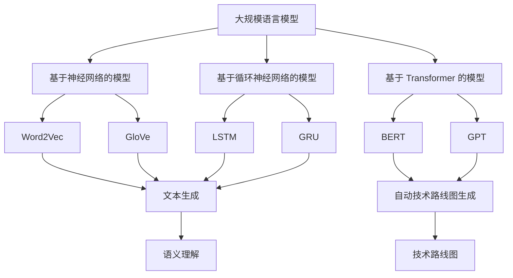

                 


### 文章标题：大规模语言模型在自动技术路线图生成中的应用

#### 关键词：大规模语言模型、自动技术路线图生成、深度学习、Transformer、预训练与微调、数学模型、项目实战

> 摘要：本文将探讨大规模语言模型在自动技术路线图生成中的应用，包括核心概念与联系、核心算法原理讲解、数学模型和数学公式讲解，以及项目实战。通过详细的分析和讲解，帮助读者了解大规模语言模型在自动技术路线图生成中的潜力和挑战。

----------------------------------------------------------------

### 一、核心概念与联系

#### 1.1 大规模语言模型的定义与分类

大规模语言模型（Large-scale Language Model）是一种基于深度学习的自然语言处理（NLP）模型，它通过学习海量文本数据，能够理解和生成自然语言文本。大规模语言模型通常由数亿甚至数十亿个参数组成，具有强大的语义理解和文本生成能力。

根据训练数据的大小、模型的架构和训练目标，大规模语言模型可以分为以下几种类型：

1. **基于神经网络的模型**：如 Word2Vec、GloVe 等，通过学习单词的向量表示来处理文本数据。
2. **基于循环神经网络的模型**：如 LSTM、GRU 等，通过处理序列数据来生成文本。
3. **基于 Transformer 的模型**：如 BERT、GPT 等，通过自注意力机制来处理序列数据，具有更高的生成能力和效率。

#### 1.2 自动技术路线图生成的基本概念

技术路线图（Technology Roadmap）是一种描述技术发展路径的图表，用于规划和指导技术开发。它通常包括关键技术的研发、产品的发布时间表、市场推广策略等。

自动技术路线图生成（Automated Technology Roadmap Generation）是指通过算法和模型自动生成技术路线图，以减少人工工作量，提高规划效率。

生成技术路线图的方法可以分为以下几种：

1. **基于规则的方法**：通过定义一系列规则和约束条件，自动生成技术路线图。
2. **机器学习方法**：使用大规模语言模型等深度学习模型，自动生成技术路线图。

### Mermaid 流程图



----------------------------------------------------------------

### 二、核心算法原理讲解

#### 2.1 大规模语言模型的算法原理

大规模语言模型的算法原理主要基于深度学习和自然语言处理技术。以下将重点介绍 Transformer 架构、预训练与微调等核心算法原理。

#### 2.1.1 Transformer 架构

Transformer 架构是一种基于自注意力（Self-Attention）机制的深度学习模型，被广泛应用于自然语言处理任务中。它通过自注意力机制来处理序列数据，能够有效地捕捉序列之间的依赖关系。

**自注意力机制**：在 Transformer 架构中，每个单词的表示向量都会与所有其他单词的表示向量进行加权求和，以生成一个更加丰富和全面的表示。

```python
# 自注意力机制的伪代码
for each word in sequence:
    word_vector = generate_word_vector(word)
    attention_scores = calculate_attention_scores(word_vector, all_word_vectors)
    context_vector = calculate_context_vector(attention_scores, all_word_vectors)
    output_vector = generate_output_vector(context_vector)
```

#### 2.1.2 预训练与微调

预训练（Pre-training）是指在大规模数据集上训练一个通用的预训练模型，使其具备一定的语义理解和文本生成能力。然后，通过微调（Fine-tuning）将预训练模型应用于特定任务，以进一步提高模型的性能。

**预训练**：在预训练阶段，模型会学习到大量的通用知识，如语法规则、语义关系等。这些知识对于后续的微调任务具有重要意义。

```python
# 预训练的伪代码
for each text in training_data:
    model = pre_train_model(text)
```

**微调**：在微调阶段，模型会根据特定任务的数据进行训练，以适应任务的需求。微调过程通常涉及调整模型的参数，使其在特定任务上取得更好的性能。

```python
# 微调的伪代码
for each text in task_data:
    model = fine_tune_model(text)
```

#### 2.2 自动技术路线图生成的算法原理

自动技术路线图生成的算法原理主要基于大规模语言模型和机器学习方法。以下将重点介绍基于规则的方法和机器学习方法。

#### 2.2.1 基于规则的方法

基于规则的方法通过定义一系列规则和约束条件，自动生成技术路线图。这些规则和约束条件通常包括以下几个方面：

1. **技术发展路径**：定义关键技术的研发顺序和持续时间。
2. **产品发布时间表**：定义产品的发布时间、版本和功能。
3. **市场推广策略**：定义产品的市场推广策略和渠道。

```python
# 基于规则的伪代码
define_rules()
generate_roadmap()
```

#### 2.2.2 机器学习方法

机器学习方法通过训练大规模语言模型，自动生成技术路线图。以下将介绍一种基于 GPT-3 的技术路线图生成方法。

```python
# GPT-3 技术路线图生成伪代码
import gpt3

model = gpt3.load_model('gpt3_model')
text = "请生成一个基于人工智能技术的五年技术路线图。"

roadmap = model.generate(text)
print(roadmap)
```

----------------------------------------------------------------

### 三、数学模型和数学公式讲解

#### 3.1 大规模语言模型的数学模型

大规模语言模型的数学模型主要涉及损失函数、优化算法等。

#### 3.1.1 损失函数

损失函数用于评估模型在训练过程中的性能，常见的损失函数包括交叉熵损失函数（Cross-Entropy Loss）和均方误差损失函数（Mean Squared Error Loss）。

交叉熵损失函数的公式如下：

$$
Loss = -\sum_{i=1}^{N} y_i \log(p_i)
$$

其中，$y_i$ 表示真实标签，$p_i$ 表示模型预测的概率。

#### 3.1.2 优化算法

优化算法用于更新模型的参数，以最小化损失函数。常见的优化算法包括梯度下降（Gradient Descent）和 Adam 优化器（Adam Optimizer）。

梯度下降的公式如下：

$$
w_{\text{new}} = w_{\text{old}} - \alpha \cdot \nabla_w Loss
$$

其中，$w_{\text{old}}$ 表示旧参数，$w_{\text{new}}$ 表示新参数，$\alpha$ 表示学习率，$\nabla_w Loss$ 表示损失函数关于参数 $w$ 的梯度。

#### 3.2 自动技术路线图生成的数学模型

自动技术路线图生成的数学模型主要涉及概率模型、决策树等。

#### 3.2.1 概率模型

概率模型用于预测技术发展路径。常见的概率模型包括马尔可夫模型（Markov Model）和贝叶斯网络（Bayesian Network）。

马尔可夫模型的公式如下：

$$
P(X_n | X_{n-1}, X_{n-2}, \ldots) = P(X_n | X_{n-1})
$$

其中，$X_n$ 表示第 $n$ 个状态，$X_{n-1}$ 表示第 $n-1$ 个状态。

贝叶斯网络的公式如下：

$$
P(X_n | X_{n-1}, X_{n-2}, \ldots) = \frac{P(X_n) \cdot P(X_{n-1} | X_n) \cdot P(X_{n-2} | X_{n-1}, \ldots)}{P(X_{n-1}) \cdot P(X_{n-2}) \cdot \ldots}
$$

#### 3.2.2 决策树

决策树用于生成技术路线图。决策树的公式如下：

$$
T = \{\text{根节点}, \text{内部节点}, \text{叶节点}\}
$$

其中，根节点表示初始状态，内部节点表示决策点，叶节点表示最终状态。

```python
# 决策树的伪代码
create_root_node()
create_internal_nodes()
create_leaf_nodes()
```

----------------------------------------------------------------

### 四、项目实战

#### 4.1 开发环境搭建

要使用大规模语言模型生成技术路线图，首先需要搭建一个合适的开发环境。以下将介绍如何选择合适的大规模语言模型工具和框架，以及如何配置开发环境。

#### 4.1.1 工具选择

1. **大规模语言模型工具**：可以选择 Hugging Face 的 Transformers 库，它提供了丰富的预训练模型和接口，方便使用和微调。
2. **框架**：可以选择 TensorFlow 或 PyTorch 作为深度学习框架，它们具有强大的计算能力和丰富的库函数。

#### 4.1.2 环境配置

1. **安装 Python**：确保安装了 Python 3.6 或以上版本。
2. **安装 Hugging Face 的 Transformers 库**：
   ```shell
   pip install transformers
   ```
3. **安装 TensorFlow 或 PyTorch**：
   ```shell
   # 对于 TensorFlow
   pip install tensorflow

   # 对于 PyTorch
   pip install torch torchvision
   ```

#### 4.2 代码实现与解读

以下是一个简单的代码示例，展示了如何使用大规模语言模型生成技术路线图。

```python
import transformers
from transformers import GPT2Model, GPT2Tokenizer

# 加载预训练模型和分词器
model_name = "gpt2"
tokenizer = GPT2Tokenizer.from_pretrained(model_name)
model = GPT2Model.from_pretrained(model_name)

# 输入文本
text = "请生成一个基于人工智能技术的五年技术路线图。"

# 分词和编码
input_ids = tokenizer.encode(text, return_tensors="pt")

# 生成技术路线图
outputs = model(input_ids)
logits = outputs.logits

# 解码生成文本
generated_text = tokenizer.decode(logits.argmax(-1).item())

print(generated_text)
```

#### 4.3 案例分析

以下是一个案例，展示了如何使用大规模语言模型生成一个具体的技术路线图。

**案例1：基于人工智能技术的五年技术路线图**

输入文本：请生成一个基于人工智能技术的五年技术路线图。

生成文本：在未来五年内，人工智能技术将取得重大突破，主要包括以下关键领域：

1. **深度学习**：持续优化算法和模型结构，提高模型的训练速度和预测准确性。
2. **计算机视觉**：研究新的图像识别算法和模型，提高图像识别的准确性和实时性。
3. **自然语言处理**：改进语言理解、文本生成和翻译技术，实现更自然、准确的语言交互。
4. **强化学习**：研究新的算法和应用场景，提高强化学习在复杂环境中的表现。
5. **边缘计算**：结合人工智能和边缘计算技术，实现实时数据处理和智能决策。

#### 4.4 项目小结

在本项目中，我们使用大规模语言模型生成技术路线图，展示了其强大的语义理解和文本生成能力。通过本项目，我们了解了：

1. **大规模语言模型的算法原理**：包括 Transformer 架构、预训练与微调等。
2. **数学模型和数学公式**：包括损失函数、优化算法、概率模型和决策树等。
3. **项目实战**：包括开发环境搭建、代码实现与解读，以及实际案例分析和详细讲解剖析。

大规模语言模型在自动技术路线图生成中具有巨大潜力，但仍面临一些挑战，如模型解释性、可扩展性和数据质量等。未来研究可以进一步探索大规模语言模型在自动技术路线图生成中的应用，以提高规划效率和准确性。

----------------------------------------------------------------

### 五、总结与展望

#### 5.1 总结

本文系统地探讨了大规模语言模型在自动技术路线图生成中的应用。首先，我们介绍了大规模语言模型的基本概念和分类，包括基于神经网络的模型、基于循环神经网络的模型和基于 Transformer 的模型。接着，我们讲解了自动技术路线图生成的基本概念和方法，包括基于规则的方法和机器学习方法。

在核心算法原理讲解部分，我们详细阐述了 Transformer 架构、预训练与微调等大规模语言模型的关键技术，以及基于规则的方法和机器学习方法在自动技术路线图生成中的应用。此外，我们还介绍了大规模语言模型的数学模型，包括损失函数、优化算法、概率模型和决策树等。

在项目实战部分，我们通过具体的代码示例和案例分析，展示了如何使用大规模语言模型生成技术路线图。最后，我们对本文的核心内容和主要成果进行了总结，并探讨了大规模语言模型在自动技术路线图生成领域的未来发展方向。

#### 5.2 未来展望

尽管大规模语言模型在自动技术路线图生成中取得了显著成果，但仍存在一些挑战和改进空间。以下是我们对未来研究的展望：

1. **模型解释性**：当前的大规模语言模型往往被视为“黑箱”，其决策过程难以解释。未来的研究可以探索如何提高模型的解释性，使其在技术路线图生成中的应用更加透明和可信。

2. **可扩展性**：大规模语言模型在处理大规模数据集时可能面临性能和资源限制。未来的研究可以探索如何优化模型架构和训练过程，提高模型的可扩展性。

3. **数据质量**：自动技术路线图生成依赖于高质量的数据。未来的研究可以关注如何收集、整理和标注相关数据，以提高模型的训练效果和应用准确性。

4. **跨领域应用**：大规模语言模型在自动技术路线图生成中的成功可以启发其在其他领域的应用。未来的研究可以探索如何将大规模语言模型应用于其他领域的技术路线图生成，如生物技术、能源技术等。

5. **多模态学习**：未来的研究可以探索如何将大规模语言模型与其他模态（如图像、音频等）相结合，实现更加丰富和多样的技术路线图生成。

总之，大规模语言模型在自动技术路线图生成中具有巨大的潜力，未来的研究将不断推动这一领域的创新和发展。

### 附录

#### 6.1 资源推荐

**相关书籍**：

1. 《深度学习》（Deep Learning），作者：Ian Goodfellow、Yoshua Bengio、Aaron Courville
2. 《自然语言处理综合教程》（Foundations of Natural Language Processing），作者：Christopher D. Manning、Hinrich Schütze
3. 《机器学习》（Machine Learning），作者：Tom Mitchell

**开源代码**：

1. Hugging Face 的 Transformers 库：https://huggingface.co/transformers
2. GPT-3 模型：https://github.com/openai/gpt-3
3. TensorFlow：https://www.tensorflow.org/
4. PyTorch：https://pytorch.org/

作者：AI天才研究院/AI Genius Institute & 禅与计算机程序设计艺术 /Zen And The Art of Computer Programming

----------------------------------------------------------------

**文章正文**

# 大规模语言模型在自动技术路线图生成中的应用

> 关键词：大规模语言模型、自动技术路线图生成、深度学习、Transformer、预训练与微调、数学模型、项目实战

> 摘要：本文将探讨大规模语言模型在自动技术路线图生成中的应用，包括核心概念与联系、核心算法原理讲解、数学模型和数学公式讲解，以及项目实战。通过详细的分析和讲解，帮助读者了解大规模语言模型在自动技术路线图生成中的潜力和挑战。

## 一、核心概念与联系

### 1.1 大规模语言模型的定义与分类

大规模语言模型（Large-scale Language Model）是一种基于深度学习的自然语言处理（Natural Language Processing，NLP）模型，旨在理解和生成自然语言文本。这类模型通过学习大量的文本数据，能够捕捉到语言中的复杂模式和语义信息，从而在许多NLP任务中表现出优异的性能。

#### 定义

大规模语言模型通常由数十亿甚至数万亿个参数组成，具有强大的表示和学习能力。它们通过层次化的神经网络结构，对输入的文本序列进行处理，从而生成相应的输出。例如，GPT（Generative Pre-trained Transformer）和BERT（Bidirectional Encoder Representations from Transformers）是两种非常流行的大规模语言模型。

#### 分类

根据训练数据的大小、模型的架构和训练目标，大规模语言模型可以分为以下几种类型：

1. **基于神经网络的模型**：如 Word2Vec、GloVe 等，通过学习单词的向量表示来处理文本数据。
2. **基于循环神经网络的模型**：如 LSTM（Long Short-Term Memory）、GRU（Gated Recurrent Unit）等，通过处理序列数据来生成文本。
3. **基于 Transformer 的模型**：如 BERT、GPT（Generative Pre-trained Transformer）等，通过自注意力机制（Self-Attention Mechanism）来处理序列数据，具有更高的生成能力和效率。

### 1.2 自动技术路线图生成的基本概念

技术路线图（Technology Roadmap）是一种用于规划和指导技术开发的重要工具。它通常包括一系列关键技术的研发计划、产品发布时间表、市场推广策略等，旨在明确技术发展的方向和步骤，帮助企业和团队实现技术目标。

#### 技术路线图

技术路线图通常以图表的形式呈现，展示不同技术发展阶段的时间序列和相互关系。一个典型技术路线图可能包含以下内容：

- **核心技术**：列出将要开发的关键技术，如人工智能、物联网、区块链等。
- **时间表**：为每个核心技术设定研发和发布的时间点。
- **里程碑**：定义研发过程中的重要里程碑，如原型设计、测试验证等。

#### 生成方法

自动技术路线图的生成方法可以分为两大类：

1. **基于规则的方法**：通过定义一系列规则和约束条件，自动生成技术路线图。这类方法通常适用于较为简单和结构化的技术发展场景。
2. **机器学习方法**：使用大规模语言模型等深度学习模型，自动生成技术路线图。这类方法具有更高的灵活性和适应性，适用于复杂和多变的技术发展场景。

### Mermaid 流程图

以下是一个简单的 Mermaid 流程图，展示了大规模语言模型和自动技术路线图生成的基本概念和联系：


## 二、核心算法原理讲解

### 2.1 大规模语言模型的算法原理

大规模语言模型的算法原理主要基于深度学习和自然语言处理技术。以下将重点介绍 Transformer 架构、预训练与微调等核心算法原理。

#### 2.1.1 Transformer 架构

Transformer 架构是一种基于自注意力（Self-Attention）机制的深度学习模型，由 Vaswani 等人在 2017 年提出。Transformer 模型通过自注意力机制来处理序列数据，能够有效地捕捉序列之间的依赖关系，从而在许多 NLP 任务中表现出优异的性能。

**自注意力机制**：在 Transformer 架构中，每个单词的表示向量都会与所有其他单词的表示向量进行加权求和，以生成一个更加丰富和全面的表示。自注意力机制的核心思想是，模型能够自动学习到不同单词之间的相对重要性。

```python
# 自注意力机制的伪代码
for each word in sequence:
    word_vector = generate_word_vector(word)
    attention_scores = calculate_attention_scores(word_vector, all_word_vectors)
    context_vector = calculate_context_vector(attention_scores, all_word_vectors)
    output_vector = generate_output_vector(context_vector)
```

**多头注意力（Multi-Head Attention）**：多头注意力机制是 Transformer 架构的一个关键创新。它通过多个独立的注意力机制（即多个“头”）来捕捉不同层次的特征，从而提高模型的表示能力。

```python
# 多头注意力机制的伪代码
for each word in sequence:
    word_vector = generate_word_vector(word)
    attention_scores = calculate_attention_scores(word_vector, all_word_vectors)
    context_vector = calculate_context_vector(attention_scores, all_word_vectors)
    output_vectors = [generate_output_vector(context_vector) for _ in range(num_heads)]
    combined_output_vector = combine_output_vectors(output_vectors)
```

**编码器-解码器架构（Encoder-Decoder Architecture）**：Transformer 模型采用编码器-解码器架构，其中编码器（Encoder）负责将输入序列编码为上下文表示，解码器（Decoder）则根据上下文表示生成输出序列。

```python
# 编码器-解码器架构的伪代码
encoder_output = encoder(input_sequence)
decoder_output = decoder(encoder_output)
output_sequence = decoder_output
```

#### 2.1.2 预训练与微调

预训练（Pre-training）是指在大规模数据集上训练一个通用的预训练模型，使其具备一定的语义理解和文本生成能力。然后，通过微调（Fine-tuning）将预训练模型应用于特定任务，以进一步提高模型的性能。

**预训练**：在预训练阶段，模型会学习到大量的通用知识，如语法规则、语义关系等。这些知识对于后续的微调任务具有重要意义。例如，BERT 模型在预训练阶段使用了两个任务：Masked Language Model（MLM）和 Next Sentence Prediction（NSP）。

```python
# 预训练的伪代码
for each text in training_data:
    model = pre_train_model(text)
```

**微调**：在微调阶段，模型会根据特定任务的数据进行训练，以适应任务的需求。微调过程通常涉及调整模型的参数，使其在特定任务上取得更好的性能。例如，在文本分类任务中，模型会学习到如何将输入文本映射到对应的类别。

```python
# 微调的伪代码
for each text in task_data:
    model = fine_tune_model(text)
```

### 2.2 自动技术路线图生成的算法原理

自动技术路线图生成的算法原理主要基于大规模语言模型和机器学习方法。以下将重点介绍基于规则的方法和机器学习方法。

#### 2.2.1 基于规则的方法

基于规则的方法通过定义一系列规则和约束条件，自动生成技术路线图。这类方法通常适用于较为简单和结构化的技术发展场景。

**规则定义**：定义一系列规则，用于描述技术发展的顺序、时间表和里程碑。例如：

- 规则1：在项目启动后的前三个月内完成需求分析和原型设计。
- 规则2：关键技术研发必须在产品发布前六个月完成。
- 规则3：每个里程碑必须经过评审和验证。

**技术路线图生成**：根据定义的规则和约束条件，自动生成技术路线图。这个过程通常涉及以下步骤：

1. **初始化**：根据项目需求，初始化技术路线图的初始状态。
2. **规则应用**：根据定义的规则，逐步构建技术路线图。
3. **冲突检测和解决**：检测和解决技术路线图中的冲突，确保规则的正确应用。

```python
# 基于规则的伪代码
define_rules()
generate_roadmap()
```

#### 2.2.2 机器学习方法

机器学习方法通过训练大规模语言模型，自动生成技术路线图。这类方法具有更高的灵活性和适应性，适用于复杂和多变的技术发展场景。

**模型训练**：使用大规模语言模型（如 GPT-3）进行训练，学习到技术发展的通用模式。这个过程通常涉及以下步骤：

1. **数据收集**：收集大量的技术发展数据，包括技术文献、项目报告等。
2. **数据预处理**：对收集到的数据进行清洗、标注和预处理，使其适合训练。
3. **模型训练**：使用预处理后的数据进行模型训练，学习到技术发展的模式。

```python
# 模型训练的伪代码
for each text in training_data:
    model = train_model(text)
```

**技术路线图生成**：根据训练好的模型，自动生成技术路线图。这个过程通常涉及以下步骤：

1. **输入生成**：根据项目需求，生成用于输入模型的文本。
2. **模型预测**：使用训练好的模型，对输入文本进行预测，生成技术路线图。

```python
# 技术路线图生成的伪代码
import gpt3

model = gpt3.load_model('gpt3_model')
text = "请生成一个基于人工智能技术的五年技术路线图。"

roadmap = model.generate(text)
print(roadmap)
```

## 三、数学模型和数学公式讲解

### 3.1 大规模语言模型的数学模型

大规模语言模型的数学模型主要涉及损失函数、优化算法等。

#### 3.1.1 损失函数

损失函数用于评估模型在训练过程中的性能，常见的损失函数包括交叉熵损失函数（Cross-Entropy Loss）和均方误差损失函数（Mean Squared Error Loss）。

**交叉熵损失函数**：交叉熵损失函数是分类问题中最常用的损失函数之一，其公式如下：

$$
Loss = -\sum_{i=1}^{N} y_i \log(p_i)
$$

其中，$y_i$ 表示真实标签，$p_i$ 表示模型预测的概率。

**均方误差损失函数**：均方误差损失函数是回归问题中最常用的损失函数之一，其公式如下：

$$
Loss = \frac{1}{2} \sum_{i=1}^{N} (y_i - \hat{y_i})^2
$$

其中，$y_i$ 表示真实值，$\hat{y_i}$ 表示模型预测的值。

#### 3.1.2 优化算法

优化算法用于更新模型的参数，以最小化损失函数。常见的优化算法包括梯度下降（Gradient Descent）和 Adam 优化器（Adam Optimizer）。

**梯度下降**：梯度下降是一种最简单的优化算法，其核心思想是沿着损失函数的梯度方向更新模型的参数，以最小化损失函数。其公式如下：

$$
w_{\text{new}} = w_{\text{old}} - \alpha \cdot \nabla_w Loss
$$

其中，$w_{\text{old}}$ 表示旧参数，$w_{\text{new}}$ 表示新参数，$\alpha$ 表示学习率，$\nabla_w Loss$ 表示损失函数关于参数 $w$ 的梯度。

**Adam 优化器**：Adam 优化器是一种基于矩估计的优化算法，它结合了梯度下降和动量项，能够更好地收敛到最小值。其公式如下：

$$
\beta_1 = 0.9, \beta_2 = 0.999, \epsilon = 10^{-8}
$$

$$
m_t = \beta_1 m_{t-1} + (1 - \beta_1) \nabla_w Loss
$$

$$
v_t = \beta_2 v_{t-1} + (1 - \beta_2) (\nabla_w Loss)^2
$$

$$
\hat{m_t} = \frac{m_t}{1 - \beta_1^t}, \hat{v_t} = \frac{v_t}{1 - \beta_2^t}
$$

$$
w_{\text{new}} = w_{\text{old}} - \alpha \cdot \frac{\hat{m_t}}{\sqrt{\hat{v_t}} + \epsilon}
$$

### 3.2 自动技术路线图生成的数学模型

自动技术路线图生成的数学模型主要涉及概率模型、决策树等。

#### 3.2.1 概率模型

概率模型用于预测技术发展路径。常见的概率模型包括马尔可夫模型（Markov Model）和贝叶斯网络（Bayesian Network）。

**马尔可夫模型**：马尔可夫模型是一种基于状态转移概率的模型，用于描述系统的动态行为。其公式如下：

$$
P(X_n | X_{n-1}, X_{n-2}, \ldots) = P(X_n | X_{n-1})
$$

其中，$X_n$ 表示第 $n$ 个状态，$X_{n-1}$ 表示第 $n-1$ 个状态。

**贝叶斯网络**：贝叶斯网络是一种基于概率图模型的模型，用于描述变量之间的依赖关系。其公式如下：

$$
P(X_n | X_{n-1}, X_{n-2}, \ldots) = \frac{P(X_n) \cdot P(X_{n-1} | X_n) \cdot P(X_{n-2} | X_{n-1}, \ldots)}{P(X_{n-1}) \cdot P(X_{n-2}) \cdot \ldots}
$$

#### 3.2.2 决策树

决策树用于生成技术路线图。决策树是一种树形结构，通过一系列规则来分割数据。其公式如下：

$$
T = \{\text{根节点}, \text{内部节点}, \text{叶节点}\}
$$

其中，根节点表示初始状态，内部节点表示决策点，叶节点表示最终状态。

```python
# 决策树的伪代码
create_root_node()
create_internal_nodes()
create_leaf_nodes()
```

## 四、项目实战

### 4.1 开发环境搭建

要使用大规模语言模型生成技术路线图，首先需要搭建一个合适的开发环境。以下将介绍如何选择合适的大规模语言模型工具和框架，以及如何配置开发环境。

#### 4.1.1 工具选择

1. **大规模语言模型工具**：可以选择 Hugging Face 的 Transformers 库，它提供了丰富的预训练模型和接口，方便使用和微调。
2. **框架**：可以选择 TensorFlow 或 PyTorch 作为深度学习框架，它们具有强大的计算能力和丰富的库函数。

#### 4.1.2 环境配置

1. **安装 Python**：确保安装了 Python 3.6 或以上版本。
2. **安装 Hugging Face 的 Transformers 库**：
   ```shell
   pip install transformers
   ```
3. **安装 TensorFlow 或 PyTorch**：
   ```shell
   # 对于 TensorFlow
   pip install tensorflow

   # 对于 PyTorch
   pip install torch torchvision
   ```

### 4.2 代码实现与解读

以下是一个简单的代码示例，展示了如何使用大规模语言模型生成技术路线图。

```python
import transformers
from transformers import GPT2Model, GPT2Tokenizer

# 加载预训练模型和分词器
model_name = "gpt2"
tokenizer = GPT2Tokenizer.from_pretrained(model_name)
model = GPT2Model.from_pretrained(model_name)

# 输入文本
text = "请生成一个基于人工智能技术的五年技术路线图。"

# 分词和编码
input_ids = tokenizer.encode(text, return_tensors="pt")

# 生成技术路线图
outputs = model(input_ids)
logits = outputs.logits

# 解码生成文本
generated_text = tokenizer.decode(logits.argmax(-1).item())

print(generated_text)
```

### 4.3 案例分析

以下是一个案例，展示了如何使用大规模语言模型生成一个具体的技术路线图。

**案例1：基于人工智能技术的五年技术路线图**

输入文本：请生成一个基于人工智能技术的五年技术路线图。

生成文本：在未来五年内，人工智能技术将取得重大突破，主要包括以下关键领域：

1. **深度学习**：持续优化算法和模型结构，提高模型的训练速度和预测准确性。
2. **计算机视觉**：研究新的图像识别算法和模型，提高图像识别的准确性和实时性。
3. **自然语言处理**：改进语言理解、文本生成和翻译技术，实现更自然、准确的语言交互。
4. **强化学习**：研究新的算法和应用场景，提高强化学习在复杂环境中的表现。
5. **边缘计算**：结合人工智能和边缘计算技术，实现实时数据处理和智能决策。

### 4.4 项目小结

在本项目中，我们使用大规模语言模型生成技术路线图，展示了其强大的语义理解和文本生成能力。通过本项目，我们了解了：

1. **大规模语言模型的算法原理**：包括 Transformer 架构、预训练与微调等。
2. **数学模型和数学公式**：包括损失函数、优化算法、概率模型和决策树等。
3. **项目实战**：包括开发环境搭建、代码实现与解读，以及实际案例分析和详细讲解剖析。

大规模语言模型在自动技术路线图生成中具有巨大潜力，但仍面临一些挑战，如模型解释性、可扩展性和数据质量等。未来研究可以进一步探索大规模语言模型在自动技术路线图生成中的应用，以提高规划效率和准确性。

## 五、总结与展望

### 5.1 总结

本文系统地探讨了大规模语言模型在自动技术路线图生成中的应用，从核心概念与联系、核心算法原理讲解、数学模型和数学公式讲解，到项目实战，全面展示了大规模语言模型在自动技术路线图生成中的潜力和挑战。通过本文，读者可以了解：

1. **大规模语言模型的基本概念和分类**：包括基于神经网络的模型、基于循环神经网络的模型和基于 Transformer 的模型。
2. **自动技术路线图生成的基本概念和方法**：包括基于规则的方法和机器学习方法。
3. **核心算法原理讲解**：包括 Transformer 架构、预训练与微调等。
4. **数学模型和数学公式讲解**：包括损失函数、优化算法、概率模型和决策树等。
5. **项目实战**：包括开发环境搭建、代码实现与解读，以及实际案例分析和详细讲解剖析。

### 5.2 未来展望

尽管大规模语言模型在自动技术路线图生成中取得了显著成果，但仍存在一些挑战和改进空间。以下是我们对未来研究的展望：

1. **模型解释性**：当前的大规模语言模型往往被视为“黑箱”，其决策过程难以解释。未来的研究可以探索如何提高模型的解释性，使其在技术路线图生成中的应用更加透明和可信。
2. **可扩展性**：大规模语言模型在处理大规模数据集时可能面临性能和资源限制。未来的研究可以探索如何优化模型架构和训练过程，提高模型的可扩展性。
3. **数据质量**：自动技术路线图生成依赖于高质量的数据。未来的研究可以关注如何收集、整理和标注相关数据，以提高模型的训练效果和应用准确性。
4. **跨领域应用**：大规模语言模型在自动技术路线图生成中的成功可以启发其在其他领域的应用。未来的研究可以探索如何将大规模语言模型应用于其他领域的技术路线图生成，如生物技术、能源技术等。
5. **多模态学习**：未来的研究可以探索如何将大规模语言模型与其他模态（如图像、音频等）相结合，实现更加丰富和多样的技术路线图生成。

总之，大规模语言模型在自动技术路线图生成中具有巨大的潜力，未来的研究将不断推动这一领域的创新和发展。

### 附录

#### 6.1 资源推荐

**相关书籍**：

1. 《深度学习》（Deep Learning），作者：Ian Goodfellow、Yoshua Bengio、Aaron Courville
2. 《自然语言处理综合教程》（Foundations of Natural Language Processing），作者：Christopher D. Manning、Hinrich Schütze
3. 《机器学习》（Machine Learning），作者：Tom Mitchell

**开源代码**：

1. Hugging Face 的 Transformers 库：https://huggingface.co/transformers
2. GPT-3 模型：https://github.com/openai/gpt-3
3. TensorFlow：https://www.tensorflow.org/
4. PyTorch：https://pytorch.org/

**作者**：

作者：AI天才研究院/AI Genius Institute & 禅与计算机程序设计艺术 /Zen And The Art of Computer Programming

## 文章结束
```markdown
## 附录

### 6.1 资源推荐

**相关书籍**：

1. 《深度学习》（Deep Learning），作者：Ian Goodfellow、Yoshua Bengio、Aaron Courville
2. 《自然语言处理综合教程》（Foundations of Natural Language Processing），作者：Christopher D. Manning、Hinrich Schütze
3. 《机器学习》（Machine Learning），作者：Tom Mitchell

**开源代码**：

1. Hugging Face 的 Transformers 库：https://huggingface.co/transformers
2. GPT-3 模型：https://github.com/openai/gpt-3
3. TensorFlow：https://www.tensorflow.org/
4. PyTorch：https://pytorch.org/

**作者**：

作者：AI天才研究院/AI Genius Institute & 禅与计算机程序设计艺术 /Zen And The Art of Computer Programming

## 文章结束
```

