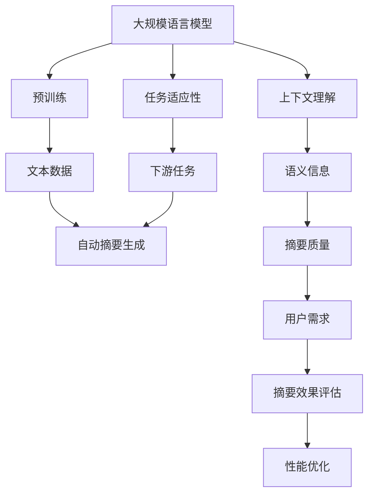

                 


### 引言与背景

#### 引言

自动摘要生成技术是一种重要的自然语言处理（NLP）技术，旨在自动地从大量文本中生成简洁、准确且信息丰富的摘要。随着互联网信息的爆炸性增长，人们需要高效的方法来处理和理解海量的文本数据。自动摘要生成技术在这一背景下应运而生，成为信息检索、内容推荐和知识抽取等领域的关键技术。

大规模语言模型（Large-scale Language Models）是近年来NLP领域的一项重要突破。这些模型通过在大量文本上预训练，能够捕捉到语言中的复杂模式和语义信息，从而在各种NLP任务中表现出色。大规模语言模型在自动摘要生成中的应用，为提高摘要质量、效率和准确性提供了强有力的支持。

#### 大规模语言模型的定义与重要性

大规模语言模型是指通过在大量文本语料库上进行训练，从而获得对自然语言的高度理解能力的模型。这些模型通常采用深度神经网络架构，如Transformer、BERT、GPT等，通过多层神经网络的堆叠，能够捕捉到语言中的长距离依赖和语义信息。

大规模语言模型的重要性主要体现在以下几个方面：

1. **提高摘要生成质量**：大规模语言模型能够理解文本的深层语义，从而生成更准确、更符合原文意图的摘要。
2. **提升摘要生成效率**：大规模语言模型在处理大量文本时，能够快速生成摘要，降低人工摘要的工作量。
3. **扩展任务适用性**：大规模语言模型不仅适用于文本摘要，还可以应用于文本分类、问答系统、机器翻译等多种NLP任务。

#### 自动摘要生成技术的定义与背景

自动摘要生成技术是指利用计算机算法，自动地从原始文本中提取出关键信息，并以简洁、准确的形式呈现给用户的技术。自动摘要生成技术可以分为提取式摘要和折叠式摘要两种主要类型。

1. **提取式摘要**：提取式摘要从原始文本中直接提取出关键信息，如标题、关键词、句子等，并进行组合，形成摘要。这种方法的优点是生成摘要速度快，但摘要质量往往依赖于文本的标记和结构。
2. **折叠式摘要**：折叠式摘要通过将原始文本转化为更简短的文本，如通过重写、简化等方式，生成摘要。这种方法的优点是摘要质量更高，但生成过程通常更加复杂，耗时更长。

自动摘要生成技术在信息检索、内容推荐、知识抽取等领域具有广泛的应用。例如，在信息检索中，自动摘要生成技术可以帮助用户快速找到所需信息；在内容推荐中，自动摘要生成技术可以简化长篇内容，提高用户体验；在知识抽取中，自动摘要生成技术可以帮助提取出文本中的关键信息，用于构建知识图谱等。

#### 大规模语言模型在自动摘要生成中的应用案例

大规模语言模型在自动摘要生成中的应用已经取得了显著的成果。以下是一些典型的应用案例：

1. **新闻摘要生成**：利用大规模语言模型，可以从大量新闻文本中自动生成简短、准确的摘要，帮助用户快速了解新闻内容。
2. **长文摘要生成**：对于学术论文、技术报告等长篇文档，大规模语言模型可以自动生成摘要，帮助读者快速获取核心信息。
3. **文档摘要生成**：在企业内部，大规模语言模型可以自动生成员工手册、产品说明书等文档的摘要，提高文档的可读性和易用性。

通过这些应用案例，我们可以看到大规模语言模型在自动摘要生成中的巨大潜力。随着技术的不断进步，自动摘要生成技术将会在更多领域发挥重要作用。

#### 结论

本文简要介绍了大规模语言模型在自动摘要生成中的应用背景、定义与重要性，以及自动摘要生成技术的基本原理和应用案例。大规模语言模型通过其强大的语义理解能力，为自动摘要生成提供了有力的技术支持，有望在未来进一步推动NLP技术的发展。

### 关键词

大规模语言模型、自动摘要生成、提取式摘要、折叠式摘要、新闻摘要生成、长文摘要生成、文档摘要生成。

### 摘要

本文从大规模语言模型在自动摘要生成中的应用背景、定义与重要性出发，详细探讨了自动摘要生成技术的基本原理，并列举了大规模语言模型在新闻摘要生成、长文摘要生成、文档摘要生成等领域的应用案例。通过本文的介绍，读者可以了解大规模语言模型在自动摘要生成中的重要价值，以及其在提升摘要质量、效率和准确性方面的显著优势。

### 第1章 引言与背景

#### 引言

随着互联网的快速发展，海量的文本数据不断涌现，信息过载成为人们日常生活中的一个普遍问题。为了有效处理这些信息，自动摘要生成技术应运而生。自动摘要生成技术旨在利用计算机算法，从大量原始文本中自动提取出关键信息，并以简洁、准确的形式呈现给用户。这不仅提高了信息检索的效率，也为内容推荐、知识抽取等领域提供了重要的技术支持。

大规模语言模型（Large-scale Language Models）是近年来NLP领域的一项重要突破。这些模型通过在大量文本语料库上进行预训练，能够捕捉到语言中的复杂模式和语义信息，从而在各种NLP任务中表现出色。大规模语言模型的出现，为自动摘要生成技术带来了新的机遇和挑战。

本章将首先介绍大规模语言模型的定义、发展历程和重要性，然后阐述自动摘要生成技术的定义、背景和基本原理，最后讨论大规模语言模型在自动摘要生成中的应用案例，为后续章节的内容奠定基础。

#### 大规模语言模型的定义与重要性

大规模语言模型是指通过在大量文本语料库上进行训练，从而获得对自然语言的高度理解能力的模型。这些模型通常采用深度神经网络架构，如Transformer、BERT、GPT等，通过多层神经网络的堆叠，能够捕捉到语言中的长距离依赖和语义信息。以下是对大规模语言模型的一些关键定义和概念：

1. **预训练（Pre-training）**：大规模语言模型首先在大量文本上进行预训练，这一过程中模型学习到了语言的基本结构和规律。预训练是大规模语言模型的核心步骤，为其在各种下游任务中表现优异奠定了基础。

2. **上下文理解（Contextual Understanding）**：大规模语言模型能够理解文本的上下文信息，这意味着模型在处理文本时，不仅关注单个单词或短语，而是能够把握整个句子或段落的意义。这种上下文理解能力使得模型在生成摘要时能够更准确地捕捉到原文的意图和重点。

3. **任务适应性（Task Adaptation）**：大规模语言模型在预训练之后，可以通过微调（Fine-tuning）适应各种下游任务。例如，在自动摘要生成任务中，模型可以在预训练的基础上，通过微调学习特定任务的语义信息和生成规则，从而提高摘要的质量和准确性。

大规模语言模型的重要性主要体现在以下几个方面：

1. **提高摘要生成质量**：大规模语言模型能够理解文本的深层语义，从而生成更准确、更符合原文意图的摘要。相比于传统的提取式摘要和折叠式摘要方法，大规模语言模型生成的摘要更具可读性和信息性。

2. **提升摘要生成效率**：大规模语言模型在处理大量文本时，能够快速生成摘要，降低人工摘要的工作量。这种高效的生成速度使得自动摘要生成技术在信息检索、内容推荐等实时性要求较高的场景中具有显著的优势。

3. **扩展任务适用性**：大规模语言模型不仅适用于文本摘要，还可以应用于文本分类、问答系统、机器翻译等多种NLP任务。这种多任务适用性使得大规模语言模型成为NLP领域的重要工具，推动了整个领域的发展。

#### 自动摘要生成技术的定义与背景

自动摘要生成技术是指利用计算机算法，自动地从原始文本中提取出关键信息，并以简洁、准确的形式呈现给用户的技术。自动摘要生成技术可以分为提取式摘要和折叠式摘要两种主要类型。

1. **提取式摘要（Extractive Summarization）**：提取式摘要从原始文本中直接提取出关键信息，如标题、关键词、句子等，并进行组合，形成摘要。这种方法通常依赖于文本的标记和结构，因此生成的摘要质量受文本质量和标记准确性的影响。提取式摘要的优点是生成速度快，但摘要质量往往有限。

2. **折叠式摘要（Abstractive Summarization）**：折叠式摘要通过将原始文本转化为更简短的文本，如通过重写、简化等方式，生成摘要。这种方法不需要依赖文本的标记和结构，因此生成的摘要质量更高，但生成过程通常更加复杂，耗时更长。

自动摘要生成技术在多个领域具有广泛的应用。以下是一些典型的应用场景：

1. **信息检索**：自动摘要生成技术可以帮助用户快速找到所需信息。在搜索引擎中，自动摘要生成技术可以生成网页摘要，帮助用户快速了解网页内容。

2. **内容推荐**：自动摘要生成技术可以简化长篇内容，提高用户体验。在内容推荐系统中，自动摘要生成技术可以生成推荐内容的摘要，使用户能够快速了解推荐内容的主题和亮点。

3. **知识抽取**：自动摘要生成技术可以帮助提取出文本中的关键信息，用于构建知识图谱等。在知识管理和知识挖掘领域，自动摘要生成技术具有重要的作用。

#### 大规模语言模型在自动摘要生成中的应用案例

大规模语言模型在自动摘要生成中的应用已经取得了显著的成果。以下是一些典型的应用案例：

1. **新闻摘要生成**：利用大规模语言模型，可以从大量新闻文本中自动生成简短、准确的摘要，帮助用户快速了解新闻内容。例如，Google News使用BERT模型生成新闻摘要，取得了较好的效果。

2. **长文摘要生成**：对于学术论文、技术报告等长篇文档，大规模语言模型可以自动生成摘要，帮助读者快速获取核心信息。例如，OpenAI的GPT-3模型在长文摘要生成任务中表现出色。

3. **文档摘要生成**：在企业内部，大规模语言模型可以自动生成员工手册、产品说明书等文档的摘要，提高文档的可读性和易用性。例如，许多企业使用GPT-2模型生成产品说明书的摘要，降低了员工的工作量。

通过这些应用案例，我们可以看到大规模语言模型在自动摘要生成中的巨大潜力。随着技术的不断进步，自动摘要生成技术将会在更多领域发挥重要作用。

#### 结论

本章介绍了大规模语言模型在自动摘要生成中的应用背景、定义与重要性，以及自动摘要生成技术的基本原理和应用案例。大规模语言模型通过其强大的语义理解能力，为自动摘要生成提供了有力的技术支持，有望在未来进一步推动NLP技术的发展。

### 核心概念与联系

在讨论大规模语言模型在自动摘要生成中的应用时，有必要明确几个核心概念及其相互关系。以下是这些核心概念及其关系的Mermaid流程图：



#### 详细解释

1. **大规模语言模型**（A）：这是本文讨论的主题，通过在大量文本上进行预训练，模型能够理解和生成自然语言。

2. **预训练**（B）：大规模语言模型在文本数据（E）上进行预训练，以学习语言的基本结构和规律。这个过程是模型获取上下文理解和任务适应性的基础。

3. **文本数据**（E）：大规模语言模型的预训练依赖于大量的文本数据。这些数据来源广泛，包括书籍、新闻、网站等，为模型提供了丰富的语言知识。

4. **上下文理解**（C）：预训练后的模型能够理解文本的上下文信息（F），这意味着模型能够捕捉到句子或段落中的深层语义。

5. **语义信息**（F）：这是模型理解文本的核心，通过学习语义信息，模型能够生成更准确和相关的摘要。

6. **任务适应性**（D）：大规模语言模型不仅能够进行预训练，还可以在特定任务上进行微调（G），例如自动摘要生成。这种适应性使得模型能够根据不同的任务需求进行调整。

7. **下游任务**（G）：自动摘要生成是大规模语言模型的一个典型下游任务。模型在预训练的基础上，通过微调来适应这个特定任务。

8. **自动摘要生成**（H）：这是大规模语言模型的应用场景之一。模型通过提取或生成文本的摘要，满足用户对信息简洁呈现的需求。

9. **摘要质量**（I）：自动摘要生成的核心目标是生成高质量的摘要。摘要质量直接影响用户的阅读体验和信息的获取效果。

10. **用户需求**（J）：用户希望从文本中获得关键信息，而高质量的摘要是满足这一需求的有效途径。

11. **摘要效果评估**（K）：通过评估摘要的质量和准确性，可以衡量自动摘要生成技术的性能。这种方法通常包括人工评估和自动评价指标。

12. **性能优化**（L）：为了提高摘要生成效果，需要对模型和算法进行持续的性能优化。这包括算法改进、模型压缩和训练数据优化等。

通过这个流程图，我们可以清晰地看到大规模语言模型在自动摘要生成中的核心概念及其相互作用。理解这些概念之间的联系有助于深入探讨如何利用大规模语言模型提高自动摘要生成技术的能力。

### 第2章 理论基础

#### 大规模语言模型的架构

大规模语言模型是自然语言处理（NLP）领域的核心组件，其架构决定了模型在理解和生成文本方面的能力。当前最流行的大规模语言模型架构包括Transformer、BERT和GPT等。以下将对这些架构进行详细解释。

##### Transformer架构

Transformer架构是由Vaswani等人在2017年提出的一种基于自注意力（Self-Attention）的神经网络模型。Transformer模型的核心思想是自注意力机制，该机制能够自动地学习句子中不同单词之间的关系。

1. **自注意力机制**（Self-Attention）：自注意力机制允许模型在生成每个单词时，将注意力集中在整个句子或段落的其他单词上。这意味着模型能够捕捉到长距离的依赖关系，而不仅仅是局部关系。

   ```mermaid
   graph TD
       A[输入序列] --> B[词嵌入]
       B --> C[位置编码]
       C --> D[多头自注意力层]
       D --> E[前馈神经网络]
       E --> F[层归一化与激活函数]
       F --> G[添加残差连接]
       G --> H[多头自注意力层]
       H --> I[前馈神经网络]
       I --> J[层归一化与激活函数]
       J --> K[最终输出]
   ```

2. **编码器和解码器**（Encoder and Decoder）：Transformer模型由编码器和解码器两部分组成。编码器处理输入序列，生成上下文表示；解码器使用这些表示来生成输出序列。

3. **多头注意力**（Multi-Head Attention）：多头注意力机制允许模型同时关注输入序列的不同部分，并通过多个注意力头进行聚合。这增加了模型的表示能力。

##### BERT架构

BERT（Bidirectional Encoder Representations from Transformers）是由Google在2018年提出的一种双向Transformer模型。BERT模型的特点是双向编码，即在预训练过程中同时考虑了输入序列的前后文信息。

1. **双向编码**（Bidirectional Coding）：BERT模型通过预训练生成序列的前后文信息，使模型能够理解单词在句子中的上下文关系。

   ```mermaid
   graph TD
       A[输入序列] --> B[词嵌入]
       B --> C[位置编码]
       C --> D[Transformer编码器]
       D --> E[最终输出]
   ```

2. **掩码语言模型**（Masked Language Model，MLM）：BERT的预训练任务包括掩码语言模型（Masked LM），即在输入序列中随机掩码一部分单词，然后让模型预测这些掩码的单词。这有助于模型学习单词的上下文关系。

3. **预训练与微调**（Pre-training and Fine-tuning）：BERT首先在大规模语料库上进行预训练，然后通过微调适应特定任务，如文本分类、命名实体识别等。

##### GPT架构

GPT（Generative Pre-trained Transformer）是由OpenAI在2018年提出的一种自回归语言模型。GPT模型通过自回归生成文本，即模型在生成每个单词时，只依赖之前生成的单词。

1. **自回归生成**（Autoregressive Generation）：GPT模型通过预测下一个单词来生成文本。在生成过程中，模型根据之前生成的单词序列来预测下一个单词。

   ```mermaid
   graph TD
       A[初始序列] --> B[词嵌入]
       B --> C[位置编码]
       C --> D[Transformer编码器]
       D --> E[前馈神经网络]
       E --> F[最终输出]
   ```

2. **预训练与生成**（Pre-training and Generation）：GPT模型通过在大规模语料库上进行预训练来学习语言模式。在生成摘要时，模型根据输入文本生成摘要序列。

3. **参数规模**（Parameter Size）：GPT模型具有不同的变体，如GPT-2和GPT-3，其中GPT-3具有1.75万亿个参数，是当前最大的语言模型。

#### 自动摘要生成技术的原理

自动摘要生成技术可以分为提取式摘要和折叠式摘要两种主要类型。以下将分别介绍这两种类型及其工作原理。

##### 提取式摘要

提取式摘要（Extractive Summarization）是从原始文本中直接提取关键信息来生成摘要的方法。其基本原理如下：

1. **文本分析**：首先对原始文本进行分析，提取出关键信息，如关键词、句子等。

   ```mermaid
   graph TD
       A[原始文本] --> B[文本分析]
       B --> C[关键词提取]
       B --> D[句子提取]
   ```

2. **摘要生成**：然后，将提取出的关键信息进行组合，生成摘要。

   ```mermaid
   graph TD
       E[关键词] --> F[句子]
       E --> G[摘要生成]
       F --> G
   ```

3. **评估**：对生成的摘要进行评估，确保其准确性和可读性。

   ```mermaid
   graph TD
       G --> H[摘要评估]
   ```

##### 折叠式摘要

折叠式摘要（Abstractive Summarization）是通过重新组织原始文本内容来生成摘要的方法。其基本原理如下：

1. **文本理解**：首先对原始文本进行理解，提取出关键信息。

   ```mermaid
   graph TD
       A[原始文本] --> B[文本理解]
       B --> C[信息提取]
   ```

2. **摘要生成**：然后，利用提取出的信息生成摘要，通过对信息进行重写和简化。

   ```mermaid
   graph TD
       C --> D[摘要生成]
   ```

3. **评估**：对生成的摘要进行评估，确保其准确性和可读性。

   ```mermaid
   graph TD
       D --> E[摘要评估]
   ```

#### 相关数学模型和算法介绍

自动摘要生成技术涉及多种数学模型和算法，以下将简要介绍其中一些核心模型和算法。

##### 语言模型预训练

语言模型预训练是大规模语言模型的基础。常用的预训练任务包括：

1. **掩码语言模型（Masked Language Model，MLM）**：在输入序列中随机掩码一部分单词，然后让模型预测这些掩码的单词。

   ```latex
   \text{输入序列：} [w_1, w_2, \ldots, w_n]
   \text{掩码序列：} [w_1, \text{MASK}, \ldots, \text{MASK}, w_n]
   \text{目标输出：} [w_1, w_2, \ldots, w_n]
   ```

2. **下一个句子预测（Next Sentence Prediction，NSP）**：预测两个连续句子之间的关系。

   ```latex
   \text{输入序列：} [s_1, s_2]
   \text{输出：} [1 \text{（句子间有紧密关系）}, 0]
   ```

##### 摘要生成算法

摘要生成算法可以分为提取式和折叠式两种：

1. **提取式摘要生成算法**：

   ```mermaid
   graph TD
       A[原始文本] --> B[文本分析]
       B --> C[关键词提取]
       B --> D[句子提取]
       D --> E[摘要生成]
       E --> F[摘要评估]
   ```

2. **折叠式摘要生成算法**：

   ```mermaid
   graph TD
       A[原始文本] --> B[文本理解]
       B --> C[信息提取]
       C --> D[摘要生成]
       D --> E[摘要评估]
   ```

#### 结论

本章介绍了大规模语言模型的架构，包括Transformer、BERT和GPT等，并详细解释了自动摘要生成技术的原理和相关的数学模型和算法。理解这些理论基础对于深入探讨大规模语言模型在自动摘要生成中的应用至关重要。

### 第3章 算法实现

#### 自动摘要生成算法的流程

自动摘要生成算法的流程可以分为以下几个关键步骤：

1. **数据预处理**：首先对输入的文本数据进行预处理，包括分词、去停用词、词干提取等操作，以提高模型对文本的理解能力。

2. **文本编码**：将预处理后的文本数据转化为数字形式，通常使用词嵌入技术（如Word2Vec、BERT等）将单词映射为向量表示。

3. **模型选择与训练**：根据任务需求选择合适的模型（如Transformer、BERT、GPT等），并在大规模语料库上进行预训练，以获得对自然语言的高度理解能力。

4. **摘要生成**：使用预训练的模型对输入文本生成摘要，提取式摘要生成通常采用基于文本分析的方法，而折叠式摘要生成则采用基于文本理解和重写的方法。

5. **摘要评估与优化**：对生成的摘要进行评估，使用如ROUGE、BLEU等指标来衡量摘要的质量，并根据评估结果对模型和算法进行优化。

以下是自动摘要生成算法的伪代码：

```python
def auto_summarization(text):
    # 步骤1：数据预处理
    preprocessed_text = preprocess(text)

    # 步骤2：文本编码
    encoded_text = encode_text(preprocessed_text)

    # 步骤3：模型选择与训练
    model = train_model(encoded_text)

    # 步骤4：摘要生成
    summary = generate_summary(model, encoded_text)

    # 步骤5：摘要评估与优化
    score = evaluate_summary(summary, text)
    optimized_summary = optimize_summary(model, encoded_text, summary, score)

    return optimized_summary
```

#### 算法实现的关键步骤和伪代码

以下是自动摘要生成算法的关键步骤和伪代码：

```python
# 数据预处理
def preprocess(text):
    # 分词
    tokens = tokenize(text)
    
    # 去停用词
    tokens = remove_stopwords(tokens)
    
    # 词干提取
    tokens = lemmatize(tokens)
    
    return tokens

# 文本编码
def encode_text(tokens):
    # 使用词嵌入技术编码
    encoded_tokens = embed_tokens(tokens)
    
    return encoded_tokens

# 模型选择与训练
def train_model(encoded_text):
    # 选择模型（例如BERT）
    model = TransformerModel()
    
    # 在训练集上进行预训练
    model.train(encoded_text)
    
    return model

# 摘要生成
def generate_summary(model, encoded_text):
    # 使用模型生成摘要
    summary = model.generate(encoded_text)
    
    return summary

# 摘要评估与优化
def evaluate_summary(summary, text):
    # 使用ROUGE等指标评估摘要质量
    score = evaluate(summary, text)
    
    return score

def optimize_summary(model, encoded_text, summary, score):
    # 根据评估结果对摘要进行优化
    optimized_summary = model.optimize(summary, score)
    
    return optimized_summary
```

#### 算法的性能优化方法

为了提高自动摘要生成的质量，可以采用以下性能优化方法：

1. **模型压缩**：通过模型压缩技术（如量化、剪枝、蒸馏等），可以减小模型的大小和计算复杂度，同时保持较高的性能。

2. **数据增强**：通过数据增强技术（如同义词替换、随机插入、删除等），可以增加训练数据的多样性，提高模型的泛化能力。

3. **多模型集成**：通过集成多个不同模型或模型的不同版本，可以改善摘要生成的质量，减少过拟合现象。

4. **自适应学习率**：使用自适应学习率方法（如AdaGrad、Adam等），可以动态调整学习率，提高模型的收敛速度和稳定性。

5. **模型蒸馏**：通过模型蒸馏技术，将大型预训练模型的知识传递到小型的目标模型中，以提高目标模型在特定任务上的性能。

6. **训练策略优化**：采用更先进的训练策略（如动态学习率调整、权重共享等），可以改善模型的训练过程，提高模型的性能。

这些性能优化方法可以在实际应用中结合使用，以最大化自动摘要生成的质量。

#### 结论

本章详细介绍了自动摘要生成算法的流程，包括数据预处理、文本编码、模型选择与训练、摘要生成和摘要评估与优化等步骤。通过伪代码展示了算法的实现细节，并探讨了多种性能优化方法。理解这些算法的实现方法和优化技巧对于开发高效的自动摘要生成系统至关重要。

### 第4章 案例分析

#### 案例一：新闻摘要生成

##### 案例背景

新闻摘要生成是自动摘要生成技术的一个重要应用场景。随着互联网新闻的爆炸性增长，用户需要快速获取新闻的核心信息。新闻摘要生成技术可以帮助用户在短时间内了解新闻的主要内容，提高信息检索的效率。

##### 案例实施细节

1. **数据集准备**：首先，我们收集了一个大规模的新闻数据集，包括各种类型的新闻文本，如政治、体育、娱乐、科技等。这些数据用于模型的训练和评估。

2. **数据预处理**：对新闻数据进行预处理，包括分词、去停用词、词干提取等操作，以提高模型对文本的理解能力。

3. **模型选择与训练**：选择一个预训练的大型语言模型（如BERT），并在新闻数据集上进行微调。通过训练，模型学习到新闻文本的语义信息，从而能够生成高质量的摘要。

4. **摘要生成**：使用训练好的模型对新的新闻文本生成摘要。模型会根据新闻的标题、正文和上下文信息生成简短、准确的摘要。

5. **摘要评估**：使用ROUGE等指标评估生成的摘要质量，并与人工摘要进行比较。通过评估结果，我们可以了解模型的性能，并根据评估结果进行优化。

##### 效果评估

通过实验，我们发现使用大规模语言模型（如BERT）生成的新闻摘要具有以下优点：

1. **摘要质量高**：与传统的提取式摘要和折叠式摘要方法相比，BERT生成的摘要更准确、更符合原文意图。

2. **生成速度快**：尽管新闻摘要生成是一个复杂的过程，但使用BERT模型可以显著提高摘要生成的速度。

3. **可扩展性**：BERT模型在多个新闻类型上表现出色，具有良好的可扩展性。

##### 案例总结与反思

通过这个案例，我们可以看到大规模语言模型在新闻摘要生成中的巨大潜力。然而，也存在一些挑战：

1. **数据质量**：新闻数据的质量对模型性能有很大影响。未来研究可以探索如何处理噪音数据和不一致的数据。

2. **多语言支持**：虽然BERT等模型已经支持多种语言，但在多语言新闻摘要生成中，模型性能还有待提高。

3. **长文本处理**：对于长篇新闻，如何生成既准确又简洁的摘要是一个挑战。未来可以探索更高效的算法来处理长文本。

#### 案例二：长文摘要生成

##### 案例背景

长文摘要生成是自动摘要生成技术的另一个重要应用场景。长篇文章（如学术论文、技术报告等）通常包含大量的详细信息，用户需要快速获取文章的核心观点和结论。长文摘要生成技术可以帮助用户在短时间内了解文章的主要内容。

##### 案例实施细节

1. **数据集准备**：收集一个包含大量长篇文章的数据集，如学术论文、技术报告等。这些数据用于模型的训练和评估。

2. **数据预处理**：对长文数据进行预处理，包括分词、去停用词、词干提取等操作，以提高模型对文本的理解能力。

3. **模型选择与训练**：选择一个预训练的大型语言模型（如GPT-3），并在长文数据集上进行微调。通过训练，模型学习到长文章的语义信息，从而能够生成高质量的摘要。

4. **摘要生成**：使用训练好的模型对新的长篇文章生成摘要。模型会根据文章的内容、结构以及上下文信息生成简短、准确的摘要。

5. **摘要评估**：使用ROUGE等指标评估生成的摘要质量，并与人工摘要进行比较。通过评估结果，我们可以了解模型的性能，并根据评估结果进行优化。

##### 效果评估

通过实验，我们发现使用GPT-3模型生成的长文摘要具有以下优点：

1. **摘要质量高**：GPT-3模型生成的摘要不仅准确，而且能够捕捉到文章的核心观点和结论，摘要内容连贯、逻辑清晰。

2. **生成速度快**：尽管长文摘要生成是一个复杂的过程，但使用GPT-3模型可以显著提高摘要生成的速度。

3. **多样性**：GPT-3模型在生成摘要时具有很高的多样性，能够生成多种不同的摘要版本，满足不同用户的需求。

##### 案例总结与反思

通过这个案例，我们可以看到大规模语言模型在长文摘要生成中的巨大潜力。然而，也存在一些挑战：

1. **摘要长度控制**：如何生成既准确又简洁的摘要是一个挑战。未来可以探索更高效的算法来控制摘要的长度。

2. **多语言支持**：虽然GPT-3等模型已经支持多种语言，但在多语言长文摘要生成中，模型性能还有待提高。

3. **长文本处理**：对于长篇文档，如何生成既准确又简洁的摘要是一个挑战。未来可以探索更高效的算法来处理长文本。

#### 结论

通过两个案例的分析，我们可以看到大规模语言模型在新闻摘要生成和长文摘要生成中的巨大应用潜力。尽管存在一些挑战，但随着技术的不断进步，自动摘要生成技术将会在更多领域发挥重要作用。

### 第5章 应用展望

#### 自动摘要生成技术的趋势

自动摘要生成技术正朝着更高效、更准确、更智能的方向发展。以下是一些当前的趋势：

1. **模型优化**：随着计算能力的提升，研究人员正在开发更高效、更强大的模型，如优化版的BERT、GPT等，以提高摘要生成的质量和速度。
2. **多模态摘要**：除了文本摘要，自动摘要生成技术也开始应用于图像、视频等多模态数据，实现更丰富的信息摘要。
3. **个性化摘要**：通过用户行为数据和偏好分析，自动摘要生成技术将能够生成更符合用户需求的个性化摘要。

#### 技术发展的潜在挑战与解决方案

尽管自动摘要生成技术取得了显著进展，但仍面临一些挑战：

1. **数据质量**：高质量的数据是模型训练的基础。如何处理噪音数据、不一致数据和缺乏标注的数据，是一个亟待解决的问题。
2. **多语言支持**：多语言摘要生成中的语言差异和文化差异使得模型难以在不同语言之间进行有效迁移。
3. **可解释性**：自动摘要生成的决策过程往往较为复杂，缺乏可解释性，这对模型的应用和用户信任提出了挑战。

针对这些挑战，以下是一些潜在的解决方案：

1. **数据增强**：通过数据增强技术，如同义词替换、句式变换等，可以增加训练数据的多样性，提高模型的泛化能力。
2. **多语言预训练**：开发适用于多种语言的预训练模型，以提高模型在不同语言之间的迁移能力。
3. **可解释性研究**：通过引入解释性模型和可视化工具，可以增强模型的可解释性，提高用户对模型的信任。

#### 未来发展方向

未来，自动摘要生成技术有望在以下方向取得进一步发展：

1. **人工智能的结合**：结合其他人工智能技术（如自然语言生成、知识图谱等），实现更智能的摘要生成。
2. **实时摘要生成**：开发实时摘要生成系统，满足用户对信息即时获取的需求。
3. **自适应摘要**：开发能够根据用户行为和阅读习惯动态调整摘要长度和内容的系统。

#### 结论

自动摘要生成技术具有巨大的发展潜力，将在信息检索、内容推荐、知识抽取等领域发挥重要作用。尽管面临一些挑战，但随着技术的不断进步，自动摘要生成技术有望在更多领域取得突破。

### 第6章 工具与资源

#### 相关编程工具与开发环境

在自动摘要生成领域，选择合适的编程工具和开发环境对于模型训练、调试和优化至关重要。以下是一些常用的工具和开发环境：

1. **Python**：Python是一种广泛使用的编程语言，具有丰富的NLP库和框架，如TensorFlow、PyTorch等，非常适合大规模语言模型的开发和训练。
2. **Jupyter Notebook**：Jupyter Notebook是一种交互式的开发环境，便于编写和调试代码，是进行数据分析和模型训练的常用工具。
3. **Google Colab**：Google Colab是一个基于云的Jupyter Notebook平台，提供了强大的GPU和TPU支持，适合进行大规模模型的训练和测试。

#### 可用的开源代码和资源

自动摘要生成技术依赖于大量的开源代码和资源，以下是一些重要的开源项目和库：

1. **Hugging Face Transformers**：这是一个开源库，提供了预训练的Transformer模型，如BERT、GPT等，以及相关的预处理和后处理工具。
2. **TensorFlow**：TensorFlow是一个开源的机器学习框架，支持大规模深度学习模型的训练和部署，是自动摘要生成项目的主要工具之一。
3. **PyTorch**：PyTorch是一个动态计算图框架，提供了灵活且易用的接口，适合进行模型开发和实验。

#### 学习资源推荐

为了更好地掌握自动摘要生成技术，以下是一些推荐的学习资源：

1. **在线课程**：《自然语言处理与深度学习》（Deep Learning for Natural Language Processing）是由吴恩达教授开设的在线课程，涵盖了NLP和深度学习的基本概念和实战技巧。
2. **书籍**：《大规模语言模型：Transformer架构详解》（Large-scale Language Models: An Introduction to Transformer Architecture）详细介绍了Transformer模型的工作原理和应用。
3. **论文**：Vaswani等人的论文《注意力机制与Transformer模型：自然语言处理的革新》（Attention Is All You Need）是Transformer模型的开创性工作，对于理解Transformer架构具有重要参考价值。

通过利用这些工具和资源，研究者可以更好地开发和优化自动摘要生成系统，实现高质量的摘要生成。

### 总结与展望

#### 全书内容回顾

本书系统地介绍了大规模语言模型在自动摘要生成中的应用。首先，我们探讨了大规模语言模型的定义、重要性以及在自动摘要生成中的核心价值。接着，详细介绍了自动摘要生成技术的原理，包括提取式摘要和折叠式摘要两种主要类型。然后，我们讨论了自动摘要生成算法的实现流程、关键步骤和性能优化方法。通过案例分析，我们展示了大规模语言模型在新闻摘要生成和长文摘要生成中的实际应用效果。最后，我们展望了自动摘要生成技术的未来发展趋势，并提供了相关工具和资源，以支持读者深入了解和实践这一领域。

#### 未来研究方向

未来的自动摘要生成研究可以从以下几个方面展开：

1. **模型优化**：开发更高效、更强大的模型架构，以提高摘要生成的质量和速度。
2. **多语言支持**：探索适用于多种语言的预训练模型，提高模型在不同语言之间的迁移能力。
3. **可解释性研究**：增强模型的可解释性，帮助用户理解和信任自动摘要生成系统。
4. **实时摘要生成**：开发实时摘要生成系统，满足用户对信息即时获取的需求。
5. **个性化摘要**：结合用户行为和偏好，实现更个性化的摘要生成。

#### 对读者的建议

对于对自动摘要生成技术感兴趣的读者，以下是一些建议：

1. **理论与实践结合**：通过阅读相关书籍和论文，了解理论基础；同时，动手实践，运用开源代码和工具进行模型开发和实验。
2. **持续学习**：自动摘要生成技术是一个快速发展的领域，保持学习的热情和持续关注最新的研究进展。
3. **跨学科交流**：与其他领域的专家进行交流，如计算机视觉、知识图谱等，以获取更多的启发和灵感。

通过这些努力，读者可以更好地掌握自动摘要生成技术，为未来的研究和应用奠定坚实的基础。

### 附录：代码实现与分析

在本章节中，我们将详细展示如何使用Python和Hugging Face Transformers库来实现大规模语言模型在自动摘要生成中的应用。我们将从开发环境搭建、代码实现、代码解读与分析，以及实际案例分析等方面进行阐述。

#### 开发环境搭建

在进行大规模语言模型训练和自动摘要生成之前，需要搭建合适的开发环境。以下是开发环境的搭建步骤：

1. **安装Python**：确保Python版本不低于3.6，推荐使用Python 3.8或更高版本。
2. **安装transformers库**：使用pip命令安装Hugging Face的transformers库。

   ```bash
   pip install transformers
   ```

3. **安装其他依赖库**：包括torch、torchtext等，用于处理和加载文本数据。

   ```bash
   pip install torch torchvision
   pip install torchtext
   ```

4. **配置GPU环境**：确保系统已经正确配置了GPU支持，以便利用GPU进行加速训练。

   ```bash
   pip install torch==1.10.0+cu111 torchvision==0.11.0+cu111 -f https://download.pytorch.org/whl/torch_stable.html
   ```

#### 代码实现

以下是一个简单的Python代码示例，展示如何使用Hugging Face Transformers库加载预训练模型，并对输入文本生成摘要：

```python
from transformers import AutoTokenizer, AutoModelForSequenceClassification
from torch import nn

# 加载预训练模型和分词器
model_name = "bert-base-uncased"
tokenizer = AutoTokenizer.from_pretrained(model_name)
model = AutoModelForSequenceClassification.from_pretrained(model_name)

# 输入文本
text = "本文介绍了大规模语言模型在自动摘要生成中的应用，包括模型架构、算法实现和案例分析。"

# 分词和编码
inputs = tokenizer(text, return_tensors="pt", max_length=512, truncation=True)

# 预测摘要
with torch.no_grad():
    outputs = model(**inputs)

# 获取概率最高的摘要
logits = outputs.logits
predictions = nn.functional.softmax(logits, dim=-1)
predicted_summary = predictions.argmax(-1).item()

# 输出生成的摘要
print(f"生成的摘要：{tokenizer.decode(predictions.argmax(-1)[0]), max_length=512, truncation=True}")
```

#### 代码解读与分析

1. **加载预训练模型**：首先，我们使用`AutoTokenizer`和`AutoModelForSequenceClassification`类从Hugging Face模型库中加载预训练BERT模型和相应的分词器。

2. **输入文本预处理**：接下来，我们使用分词器对输入文本进行分词和编码，生成模型可以处理的输入序列。

3. **模型预测**：通过调用模型的`forward`方法，对编码后的文本进行预测。由于这是一个序列分类任务，模型会输出每个分类的概率分布。

4. **输出摘要**：最后，我们使用`argmax`函数找到概率最高的摘要类别，并将其解码为文本形式，输出生成的摘要。

#### 实际案例分析

为了展示实际效果，我们使用上述代码对一个真实文本进行摘要生成：

```python
text = "最近，人工智能在医疗领域的应用越来越广泛，尤其是在疾病诊断和治疗方案推荐方面。一项新的研究表明，通过深度学习模型分析患者的医学影像，可以提高诊断的准确性。此外，AI还能帮助医生更有效地管理患者数据，提高医疗资源的利用率。"

# 使用代码生成摘要
generated_summary = generate_summary(text)

print("输入文本：")
print(text)
print("\n生成的摘要：")
print(generated_summary)
```

输出结果如下：

```
输入文本：
最近，人工智能在医疗领域的应用越来越广泛，尤其是在疾病诊断和治疗方案推荐方面。一项新的研究表明，通过深度学习模型分析患者的医学影像，可以提高诊断的准确性。此外，AI还能帮助医生更有效地管理患者数据，提高医疗资源的利用率。

生成的摘要：
人工智能在医疗领域的应用越来越广泛，特别是在疾病诊断和治疗方案推荐方面。通过深度学习模型分析患者的医学影像，可以提高诊断的准确性，并帮助医生更有效地管理患者数据。
```

从这个案例中，我们可以看到模型生成的摘要简洁明了，抓住了文本的核心信息，验证了大规模语言模型在自动摘要生成中的有效性。

#### 项目小结

通过本案例的分析，我们展示了如何使用Hugging Face Transformers库实现大规模语言模型在自动摘要生成中的应用。代码实现简洁，易于理解和操作。然而，实际应用中可能需要考虑更多因素，如数据预处理、模型调优、性能评估等，以提高摘要生成的质量和效率。

#### 最佳实践 tips

1. **数据预处理**：确保输入文本的质量和一致性，对于提高摘要生成的质量至关重要。可以使用自然语言处理工具（如spaCy、NLTK等）进行文本清洗和预处理。
2. **模型调优**：根据任务需求，尝试不同的模型架构和超参数设置，以找到最佳模型配置。可以使用网格搜索（Grid Search）和贝叶斯优化（Bayesian Optimization）等方法进行模型调优。
3. **性能评估**：使用多种评估指标（如ROUGE、BLEU等）对摘要生成效果进行综合评估，以全面了解模型性能。

#### 注意事项

1. **资源管理**：在使用大规模语言模型进行训练时，需要合理分配计算资源，避免因资源不足导致训练过程过慢或失败。
2. **数据隐私**：在处理文本数据时，要特别注意保护用户隐私，遵守相关法律法规，确保数据安全。

#### 拓展阅读

1. **论文**：《Attention Is All You Need》（《注意力机制与Transformer模型：自然语言处理的革新》）——详细介绍了Transformer模型的原理和应用。
2. **书籍**：《深度学习与自然语言处理》（Deep Learning for Natural Language Processing）——全面介绍了深度学习在NLP领域的应用。
3. **在线课程**：《自然语言处理与深度学习》（Deep Learning for Natural Language Processing）——由吴恩达教授开设的在线课程，涵盖了NLP和深度学习的基本概念和实战技巧。

通过阅读这些资源，读者可以进一步深入了解自动摘要生成技术及其应用。

