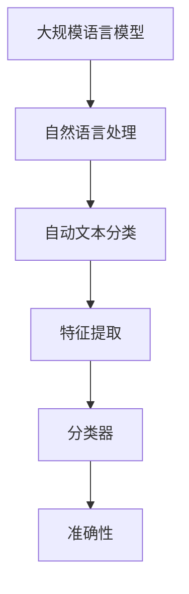

                 


## 文章标题：大规模语言模型在自动文本分类中的应用研究

### 关键词：

- 大规模语言模型
- 自动文本分类
- 深度学习
- 自然语言处理
- 语言模型算法
- 数学模型

### 摘要：

本文旨在探讨大规模语言模型在自动文本分类中的应用。首先，介绍了大规模语言模型的基本概念、原理及其在自然语言处理中的独特优势。接着，阐述了自动文本分类的核心概念、流程及其重要性。然后，详细分析了大规模语言模型与自动文本分类之间的联系，并探讨了大规模语言模型在文本分类中的优势和挑战。随后，介绍了几种常用的自动文本分类算法，包括基于传统机器学习和深度学习的算法，并探讨了大规模语言模型算法的基本原理。此外，本文还介绍了数学模型和公式的应用，并通过项目实战展示了大规模语言模型在自动文本分类中的实际应用。最后，总结了本文的主要观点，并对未来的研究方向提出了展望。

## 第1章：大规模语言模型概述

### 1.1 大规模语言模型的定义

大规模语言模型（Large-scale Language Model）是一种基于深度学习的自然语言处理技术，其核心思想是通过学习海量的文本数据来理解和生成自然语言。这种模型通常具有数十亿个参数，能够捕捉到语言的复杂结构和语义信息。大规模语言模型的发展经历了几个重要的阶段：

1. **统计语言模型**：早期的语言模型主要基于统计方法，如N元语法（N-gram），通过计算词序列的概率来预测下一个词。这种方法简单但效果有限，难以捕捉到语言的深层语义。

2. **神经网络语言模型**：随着神经网络技术的发展，神经网络语言模型（Neural Network Language Model）开始兴起。这些模型利用神经网络的结构来捕捉语言的上下文信息，效果显著提升。

3. **深度学习语言模型**：深度学习语言模型（Deep Learning Language Model）进一步发展，通过增加网络的深度和宽度，以及引入更复杂的网络结构，如长短期记忆网络（LSTM）和变换器（Transformer），模型性能得到了极大的提升。

大规模语言模型的独特性在于：

1. **数据规模**：大规模语言模型需要学习大量的文本数据，这些数据通常来自于互联网、书籍、新闻、社交媒体等。数据规模的增加有助于模型更好地捕捉到语言的多样性。

2. **参数规模**：大规模语言模型具有数十亿个参数，这使得模型能够学习到更为复杂的语言特征。参数规模的增加也意味着模型的计算量和存储需求较大。

3. **训练时间**：大规模语言模型的训练通常需要数天甚至数周的时间，这主要取决于数据的规模和模型的复杂度。训练时间的延长也是大规模语言模型面临的挑战之一。

### 1.2 自动文本分类的核心概念

自动文本分类（Automatic Text Classification）是指使用计算机技术自动将文本数据按照特定的分类标准进行分类的过程。文本分类是自然语言处理（Natural Language Processing, NLP）领域的一个基本任务，广泛应用于信息检索、舆情分析、垃圾邮件过滤、推荐系统等领域。

文本分类的核心概念包括：

1. **分类器**：分类器是用于对文本进行分类的算法或模型。常见的分类器包括朴素贝叶斯、支持向量机、随机森林、卷积神经网络等。

2. **特征提取**：特征提取是将文本数据转化为计算机可以处理的形式的过程。常见的特征提取方法包括词频（TF）、词频-逆文档频率（TF-IDF）、词嵌入等。

3. **标签**：标签是用于对文本进行分类的标准。例如，在新闻分类任务中，标签可以是体育、科技、娱乐等。

4. **准确性**：准确性是衡量分类器性能的一个重要指标，表示分类器正确分类的文本比例。

自动文本分类的基本流程通常包括以下几个步骤：

1. **数据收集与预处理**：收集用于训练和测试的文本数据，并进行预处理，如去除标点符号、分词、去除停用词等。

2. **特征提取**：从预处理后的文本数据中提取特征，用于训练分类器。

3. **模型训练**：使用提取的特征数据训练分类模型。

4. **模型评估**：使用验证集或测试集对训练好的模型进行评估，调整模型参数以达到最佳效果。

5. **模型部署**：将训练好的模型部署到实际应用环境中，对新文本数据进行分类。

自动文本分类的重要性在于：

1. **提高数据处理效率**：自动文本分类可以自动化地处理大量的文本数据，提高数据处理效率。

2. **辅助决策**：自动文本分类可以帮助企业和组织更好地理解和利用其文本数据，辅助决策。

3. **知识挖掘**：自动文本分类可以用于知识挖掘，从大量的文本数据中提取有价值的信息。

### 1.3 大规模语言模型与自动文本分类的联系

大规模语言模型在自动文本分类中具有重要作用，其与自动文本分类的联系主要体现在以下几个方面：

1. **提高分类准确率**：大规模语言模型通过学习海量的文本数据，能够更好地捕捉到文本的语义信息，从而提高分类的准确率。

2. **降低特征工程难度**：大规模语言模型可以自动提取文本特征，减少了对传统特征工程技术的依赖，简化了模型训练过程。

3. **适应多种分类任务**：大规模语言模型具有较强的通用性，可以应用于多种文本分类任务，如情感分析、主题分类等。

然而，大规模语言模型在自动文本分类中也面临一些挑战，如数据隐私问题、计算资源需求等。

### 1.4 核心概念与联系

为了更好地理解大规模语言模型在自动文本分类中的应用，我们引入Mermaid流程图来展示核心概念之间的关系。



### 1.5 背景介绍

随着互联网的快速发展，文本数据以惊人的速度增长。如何有效地管理和利用这些文本数据成为了一个重要问题。自动文本分类作为一种自动化处理文本数据的技术，受到了广泛关注。传统的自动文本分类方法主要依赖于统计语言模型和规则系统，但它们在处理复杂语义信息时存在局限性。随着深度学习技术的发展，大规模语言模型成为了一种新的有力工具。

大规模语言模型如BERT（Bidirectional Encoder Representations from Transformers）、GPT（Generative Pre-trained Transformer）等，通过在大量文本数据上进行预训练，能够捕捉到丰富的语义信息，从而显著提高了自动文本分类的准确性和效果。这些模型的出现，为自动文本分类带来了新的机遇和挑战。

## 第1章：大规模语言模型概述

### 1.1 大规模语言模型的定义

大规模语言模型（Large-scale Language Model）是一种通过深度学习技术训练而成的自然语言处理模型，其核心目的是从大量的文本数据中学习语言的统计规律和语义信息。与传统的统计语言模型相比，大规模语言模型具有以下几个显著特点：

1. **大规模参数**：大规模语言模型通常具有数十亿甚至更多的参数，这使得模型能够捕获到更加复杂的语言模式。例如，BERT模型有超过3亿个参数，而GPT-3模型更是拥有超过1750亿个参数。

2. **海量数据训练**：这些模型在训练过程中使用了海量的文本数据，这些数据来源广泛，包括互联网、书籍、新闻、社交媒体等。通过这种大数据训练，模型能够更好地理解语言的多样性和复杂性。

3. **预训练和微调**：大规模语言模型通常采用预训练（Pre-training）和微调（Fine-tuning）的方法。在预训练阶段，模型在大量无标签的数据上学习语言的基本特征。在微调阶段，模型在特定任务上有标签的数据上进行调整，以适应具体的文本分类任务。

### 1.2 大规模语言模型的基本原理

大规模语言模型的基本原理基于深度学习和自然语言处理（NLP）技术。以下是一些关键组成部分：

1. **词嵌入（Word Embedding）**：词嵌入是将单词映射到高维向量空间的技术。大规模语言模型通过学习词嵌入向量来表示单词的语义信息。这些向量能够捕捉单词在上下文中的意义，使得模型能够理解词与词之间的关系。

2. **上下文感知（Contextual Awareness）**：与传统的词嵌入不同，大规模语言模型能够根据上下文环境动态地调整词嵌入向量，从而更好地理解单词在不同情境下的含义。这种上下文感知能力是模型能够实现高精度文本分类的关键。

3. **变换器架构（Transformer Architecture）**：大规模语言模型大多采用变换器（Transformer）架构，这种架构特别适合处理序列数据。变换器通过自注意力机制（Self-Attention）来捕捉输入文本中的长距离依赖关系，从而提高了模型的表示能力。

4. **预训练任务**：大规模语言模型通常在预训练阶段完成多个任务，如掩码语言模型（Masked Language Model, MLM）、填空语言模型（Fill-mask Language Model）和下一句预测（Next Sentence Prediction）。这些任务帮助模型更好地理解语言的统计规律和上下文关系。

### 1.3 大规模语言模型的独特性

大规模语言模型相较于传统的语言模型具有以下几个独特性：

1. **强大的语义理解能力**：由于模型具有大规模参数和海量数据训练，大规模语言模型能够捕捉到更加复杂的语义信息。这使得模型在文本分类任务中能够更加准确地理解文本内容。

2. **自适应性和通用性**：大规模语言模型具有较强的自适应性和通用性。通过预训练和微调，模型可以应用于多种不同的文本分类任务，如情感分析、主题分类、命名实体识别等。

3. **高效的计算资源利用**：尽管大规模语言模型在训练和部署过程中需要大量的计算资源，但现代计算技术和分布式训练算法的发展使得这些模型的计算成本逐渐降低，更加适用于实际应用场景。

### 1.4 自动文本分类的核心概念

自动文本分类（Automatic Text Classification）是自然语言处理领域中的一个重要任务，其目的是将文本数据自动划分到预定义的类别中。以下是自动文本分类的一些核心概念：

1. **分类任务（Classification Task）**：分类任务是指将文本数据划分为预定义的类别。例如，在新闻分类任务中，类别可以是体育、科技、娱乐等。

2. **标签（Label）**：标签是用于标注文本数据类别的标识。在分类任务中，每个文本数据都关联着一个或多个标签。

3. **特征提取（Feature Extraction）**：特征提取是将原始文本数据转换为模型可处理的特征向量的过程。常见的特征提取方法包括词频、TF-IDF和词嵌入等。

4. **分类器（Classifier）**：分类器是用于预测文本数据类别的算法或模型。常见的分类器包括朴素贝叶斯、支持向量机、随机森林、深度学习模型等。

5. **准确率（Accuracy）**：准确率是评估分类器性能的一个重要指标，表示分类器正确预测的文本数据比例。

### 1.5 自动文本分类的基本流程

自动文本分类的基本流程通常包括以下几个步骤：

1. **数据收集与预处理**：收集用于训练和测试的文本数据，并进行预处理，如去除标点符号、分词、去除停用词等。

2. **特征提取**：从预处理后的文本数据中提取特征，用于训练分类模型。

3. **模型训练**：使用提取的特征数据训练分类模型。

4. **模型评估**：使用验证集或测试集对训练好的模型进行评估，调整模型参数以达到最佳效果。

5. **模型部署**：将训练好的模型部署到实际应用环境中，对新文本数据进行分类。

### 1.6 自动文本分类的重要性

自动文本分类在多个领域具有重要的应用价值：

1. **信息检索（Information Retrieval）**：自动文本分类可以帮助搜索引擎更好地理解和组织搜索结果，提高用户查询的准确性和效率。

2. **舆情分析（Public Opinion Analysis）**：自动文本分类可以用于分析社交媒体上的用户评论和帖子，帮助企业了解消费者的态度和反馈。

3. **垃圾邮件过滤（Spam Filtering）**：自动文本分类可以有效地识别和过滤垃圾邮件，提高用户的邮件体验。

4. **推荐系统（Recommendation System）**：自动文本分类可以帮助推荐系统更好地理解用户生成的内容，从而提高推荐效果。

### 1.7 大规模语言模型在自动文本分类中的应用

大规模语言模型在自动文本分类中的应用极大地提升了分类的准确性和效率。以下是一些具体的应用场景：

1. **情感分析（Sentiment Analysis）**：大规模语言模型可以准确地识别文本中的情感倾向，如正面、负面或中立。

2. **主题分类（Thematic Classification）**：大规模语言模型可以自动将文本数据分类到预定义的主题类别中，如体育、科技、娱乐等。

3. **命名实体识别（Named Entity Recognition）**：大规模语言模型可以准确地识别文本中的命名实体，如人名、地点、组织等。

4. **文本摘要（Text Summarization）**：大规模语言模型可以自动生成文本摘要，提取文本的主要信息和关键点。

### 1.8 大规模语言模型与自动文本分类的联系

大规模语言模型与自动文本分类之间的联系主要体现在以下几个方面：

1. **语义理解**：大规模语言模型通过学习大量的文本数据，能够更好地理解文本的语义信息，从而提高分类的准确性。

2. **特征提取**：大规模语言模型可以自动提取文本特征，减少了对传统特征工程方法的依赖，简化了模型训练过程。

3. **多任务学习**：大规模语言模型通常在多个任务上进行预训练，从而具备了较强的通用性和适应性，可以应用于不同的文本分类任务。

4. **计算资源**：尽管大规模语言模型的训练需要大量的计算资源，但现代计算技术和分布式训练算法的发展使得这些模型在多个应用场景中变得可行。

### 1.9 大规模语言模型在自动文本分类领域的挑战

尽管大规模语言模型在自动文本分类中展现了巨大的潜力，但它们也面临一些挑战：

1. **数据隐私**：大规模语言模型需要学习大量的文本数据，这可能涉及到用户的隐私信息。如何在保证模型性能的同时保护用户隐私是一个重要的问题。

2. **计算资源**：大规模语言模型的训练需要大量的计算资源和时间，这对于小型企业和个人用户来说可能是一个负担。

3. **模型解释性**：大规模语言模型通常被视为“黑盒”模型，其决策过程难以解释。这对于需要透明性和可解释性的应用场景是一个挑战。

4. **数据不平衡**：在自动文本分类任务中，数据可能存在不平衡问题，这可能导致模型在某一类别上表现不佳。

### 1.10 小结

大规模语言模型在自动文本分类中的应用为文本分类任务带来了新的机遇和挑战。通过学习大量的文本数据，大规模语言模型能够显著提高分类的准确性和效率。然而，数据隐私、计算资源、模型解释性和数据不平衡等问题也需要得到关注和解决。

## 1.2 自动文本分类的核心概念

### 1.2.1 文本分类的定义

文本分类（Text Classification）是指将文本数据按照特定的标准或类别进行自动分类的过程。这是一种监督学习任务，其中每个文本样本都被标记为一个或多个类别标签。文本分类广泛应用于各种领域，如搜索引擎、社交媒体监控、垃圾邮件过滤、新闻分类、情感分析等。

### 1.2.2 文本分类的基本流程

文本分类的基本流程包括以下几个关键步骤：

1. **数据收集**：收集用于训练和测试的文本数据集。这些数据集应包含各种类型的文本，并且每个文本样本都需要对应的标签。

2. **数据预处理**：对原始文本数据进行预处理，以提高模型的性能和分类的准确性。预处理步骤可能包括去除标点符号、转换为小写、分词、去除停用词等。

3. **特征提取**：从预处理后的文本数据中提取特征，这些特征将用于训练分类模型。常见的特征提取方法包括词频（TF）、词频-逆文档频率（TF-IDF）、词嵌入（Word Embedding）等。

4. **模型训练**：使用提取的特征数据训练分类模型。训练过程中，模型将学习如何将输入文本映射到正确的类别标签。

5. **模型评估**：使用验证集或测试集对训练好的模型进行评估。常见的评估指标包括准确率（Accuracy）、精确率（Precision）、召回率（Recall）和F1分数（F1 Score）。

6. **模型部署**：将训练好的模型部署到实际应用环境中，对新文本数据进行分类。

### 1.2.3 文本分类的重要性

文本分类在多个领域具有重要意义，主要包括以下几个方面：

1. **信息组织**：文本分类可以帮助组织和结构化大量的文本数据，使其易于检索和查询。

2. **内容推荐**：在推荐系统中，文本分类可以帮助推荐系统理解用户生成的内容，从而提供更精准的内容推荐。

3. **舆情分析**：在社交媒体监控和舆情分析中，文本分类可以帮助识别公众对特定话题的态度和情绪。

4. **垃圾邮件过滤**：在电子邮件系统中，文本分类可以帮助过滤垃圾邮件，提高用户的工作效率。

5. **自动化文档处理**：在自动化文档处理系统中，文本分类可以帮助自动分类和处理不同类型的文档。

### 1.2.4 自动文本分类的应用场景

自动文本分类的应用场景非常广泛，以下是一些典型的应用场景：

1. **新闻分类**：将新闻文本分类到预定义的新闻类别，如体育、科技、娱乐等。

2. **情感分析**：分析社交媒体上的评论和帖子，识别文本的情感倾向，如正面、负面或中立。

3. **垃圾邮件过滤**：识别和过滤垃圾邮件，保护用户的电子邮件账户安全。

4. **主题分类**：将文本数据分类到不同的主题类别，如医学、金融、法律等。

5. **自动问答系统**：将用户提出的问题分类到预定义的问题类别，以便自动生成答案。

### 1.2.5 自动文本分类的优势

自动文本分类的优势主要包括：

1. **效率高**：自动文本分类可以自动化地处理大量的文本数据，大大提高了数据处理效率。

2. **准确性**：通过使用先进的算法和模型，自动文本分类可以实现较高的分类准确性。

3. **可扩展性**：自动文本分类系统可以轻松扩展到新的类别和任务，适应不断变化的应用需求。

4. **减少人力成本**：自动文本分类可以替代人工分类，减少人力成本和错误率。

### 1.2.6 自动文本分类的挑战

自动文本分类也面临一些挑战，包括：

1. **数据不平衡**：在某些任务中，数据可能存在类别不平衡问题，这可能导致模型在某些类别上表现不佳。

2. **文本噪声**：原始文本数据可能包含大量的噪声和干扰信息，这会影响模型的分类效果。

3. **模型解释性**：许多自动文本分类模型是黑盒模型，其决策过程难以解释，这可能会在需要透明性和可解释性的应用场景中造成问题。

4. **计算资源**：自动文本分类模型，尤其是深度学习模型，通常需要大量的计算资源和时间来训练和部署。

### 1.2.7 自动文本分类与大规模语言模型的关系

自动文本分类与大规模语言模型之间存在密切的联系。大规模语言模型，如BERT、GPT等，通过在海量文本数据上进行预训练，能够自动提取丰富的文本特征，显著提高了自动文本分类的准确性和效率。这些模型可以用于文本分类任务的多个环节，包括特征提取、模型训练和模型评估。

### 1.2.8 自动文本分类的未来发展趋势

未来，自动文本分类将继续向更高效、更准确、更具解释性的方向发展。以下是一些发展趋势：

1. **多模态文本分类**：结合文本、图像、音频等多模态数据，实现更丰富的文本分类任务。

2. **自适应文本分类**：开发能够根据用户需求和场景动态调整分类策略的系统。

3. **模型压缩与优化**：为了降低计算资源需求，研究人员将致力于模型压缩和优化技术。

4. **可解释性增强**：开发更透明的模型，以实现更好的模型解释性和可解释性。

## 1.3 大规模语言模型与自动文本分类的联系

大规模语言模型在自动文本分类中的应用带来了显著的性能提升，两者的联系主要体现在以下几个方面：

### 1.3.1 提高分类准确率

大规模语言模型通过学习海量文本数据，能够捕捉到文本的复杂语义和上下文信息，从而提高分类的准确性。传统文本分类方法通常依赖于特征工程，而大规模语言模型通过自动提取文本特征，减少了人工干预，使得模型能够更好地理解文本内容。例如，BERT等模型能够捕捉到词与词之间的长距离依赖关系，这使得分类任务中的“语义理解”变得更加准确。

### 1.3.2 降低特征工程难度

在传统文本分类任务中，特征工程是一个关键步骤，需要手动提取和选择对分类任务有用的特征，如词频、TF-IDF、词嵌入等。这一过程既耗时又可能引入主观性。大规模语言模型通过预训练，自动从原始文本中提取出丰富的特征表示，从而大大降低了特征工程的工作量和难度。这使得模型训练过程更加高效，同时也提高了模型的泛化能力。

### 1.3.3 适应多种分类任务

大规模语言模型具有较强的通用性，可以在多种文本分类任务中取得良好的效果。例如，BERT不仅可以用于情感分析、主题分类，还可以用于命名实体识别、问答系统等。这种多任务适应性使得大规模语言模型成为自动文本分类任务中的首选工具。通过微调（Fine-tuning），模型可以根据特定的分类任务进行调整，从而更好地适应不同任务的需求。

### 1.3.4 提高分类效率

大规模语言模型在处理大量文本数据时能够显著提高分类效率。由于模型已经预训练好了，对于新接收到的文本数据，只需要进行微调即可，这大大减少了训练时间。同时，现代计算资源的提高和分布式训练算法的发展，使得大规模语言模型在实际应用中变得更加可行。这使得大规模语言模型在处理实时数据、高并发任务时具有明显优势。

### 1.3.5 面临的挑战

尽管大规模语言模型在自动文本分类中展现出了巨大的潜力，但它们也面临一些挑战：

1. **计算资源需求**：大规模语言模型的训练需要大量的计算资源和时间，这可能会成为小型企业和个人用户的负担。

2. **数据隐私**：大规模语言模型需要学习大量的文本数据，这可能涉及用户隐私信息。如何在保证模型性能的同时保护用户隐私是一个重要问题。

3. **模型解释性**：大规模语言模型通常被视为“黑盒”模型，其决策过程难以解释。这对于需要透明性和可解释性的应用场景是一个挑战。

4. **数据不平衡**：在自动文本分类任务中，数据可能存在类别不平衡问题，这可能导致模型在某些类别上表现不佳。

### 1.3.6 未来展望

随着深度学习和自然语言处理技术的不断发展，大规模语言模型在自动文本分类中的应用前景广阔。未来的研究可以从以下几个方面进行：

1. **模型压缩与优化**：为了降低计算资源需求，研究人员将继续探索模型压缩和优化技术，使得大规模语言模型在资源有限的设备上也能运行。

2. **隐私保护**：随着数据隐私问题的日益突出，开发隐私保护的大规模语言模型成为研究热点。研究人员将致力于在保证模型性能的同时保护用户隐私。

3. **模型可解释性**：增强模型的可解释性是提高模型信任度和接受度的关键。未来的研究将集中在开发可解释性更高的模型。

4. **多模态文本分类**：结合文本、图像、音频等多模态数据，实现更丰富和更复杂的文本分类任务。

5. **自适应分类**：开发能够根据用户需求和场景动态调整分类策略的系统，提高分类的灵活性和适应性。

## 1.4 核心算法原理讲解

在自动文本分类中，核心算法的选择对于分类效果至关重要。本节将详细介绍几种常用的自动文本分类算法，包括基于传统机器学习的算法和基于深度学习的算法，并探讨大规模语言模型在这些算法中的应用。

### 1.4.1 基于传统机器学习的文本分类算法

传统机器学习算法在文本分类任务中发挥了重要作用，以下是几种常见的算法：

#### 1.4.1.1 朴素贝叶斯（Naive Bayes）

朴素贝叶斯是一种基于贝叶斯定理的简单概率分类器。它假设特征之间相互独立，通过计算每个类别的概率来预测新样本的类别。朴素贝叶斯的数学模型可以表示为：

$$
P(\text{类别} | \text{特征}) = \frac{P(\text{特征} | \text{类别})P(\text{类别})}{P(\text{特征})}
$$

其中，$P(\text{类别} | \text{特征})$ 是后验概率，$P(\text{特征} | \text{类别})$ 是条件概率，$P(\text{类别})$ 是类别概率，$P(\text{特征})$ 是特征概率。

**伪代码：**

```
def naive_bayes(training_data, test_data):
    # 计算每个类别的概率
    class_probabilities = compute_class_probabilities(training_data)
    
    # 计算每个特征的条件概率
    feature_probabilities = compute_feature_probabilities(training_data, class_probabilities)
    
    # 预测测试数据的类别
    predictions = []
    for sample in test_data:
        probabilities = []
        for class_ in class_probabilities:
            probability = compute_probability(sample, feature_probabilities[class_], class_probabilities)
            probabilities.append(probability)
        predicted_class = max(probabilities)
        predictions.append(predicted_class)
    
    return predictions
```

#### 1.4.1.2 支持向量机（Support Vector Machine, SVM）

支持向量机是一种基于优化理论的有监督学习算法，用于分类和回归任务。SVM通过最大化分类边界上的支持向量来构建决策边界，从而实现数据的分类。其数学模型可以表示为：

$$
\min_{\mathbf{w}, b} \frac{1}{2} ||\mathbf{w}||^2 + C \sum_{i=1}^{n} \xi_i
$$

其中，$\mathbf{w}$ 是权重向量，$b$ 是偏置项，$C$ 是正则化参数，$\xi_i$ 是松弛变量。

**伪代码：**

```
def svm(training_data, test_data, C):
    # 初始化权重和偏置
    w = np.zeros(dimensions)
    b = 0
    
    # 梯度下降或库函数求解最优化问题
    for epoch in range(num_epochs):
        for sample, label in training_data:
            if label * (np.dot(w, sample) + b) <= 1:
                w -= learning_rate * (2 * w + C * label * sample)
            else:
                w -= learning_rate * (C * sample)
    
    # 预测测试数据的类别
    predictions = []
    for sample in test_data:
        prediction = np.dot(w, sample) + b
        predictions.append(sign(prediction))
    
    return predictions
```

#### 1.4.1.3 随机森林（Random Forest）

随机森林是一种基于决策树集合的集成学习方法，它通过构建多个决策树并合并它们的预测结果来提高分类的准确性和鲁棒性。随机森林的基本原理是Bootstrap抽样和随机特征选择。

**伪代码：**

```
def random_forest(training_data, test_data, num_trees):
    # 构建多个决策树
    trees = []
    for _ in range(num_trees):
        # Bootstrap抽样
        sampled_data = bootstrap_sampling(training_data)
        
        # 随机特征选择
        features = random.sample(range(dimensions), num_features)
        
        # 构建决策树
        tree = build_decision_tree(sampled_data, features)
        trees.append(tree)
    
    # 预测测试数据的类别
    predictions = []
    for sample in test_data:
        tree_predictions = []
        for tree in trees:
            prediction = predict_tree(tree, sample)
            tree_predictions.append(prediction)
        predicted_class = max(set(tree_predictions), key=tree_predictions.count)
        predictions.append(predicted_class)
    
    return predictions
```

### 1.4.2 基于深度学习的文本分类算法

随着深度学习技术的发展，深度学习算法在文本分类任务中也逐渐成为主流。以下是几种常用的基于深度学习的文本分类算法：

#### 1.4.2.1 卷积神经网络（Convolutional Neural Network, CNN）

卷积神经网络最初是为了图像处理而设计的，但后来也广泛应用于文本分类任务。CNN通过卷积操作和池化操作来提取文本特征，并使用全连接层进行分类。

**伪代码：**

```
class CNNModel(nn.Module):
    def __init__(self, embedding_dim, hidden_dim, output_dim, num_layers, dropout):
        super(CNNModel, self).__init__()
        self.embedding = nn.Embedding(embedding_dim, hidden_dim)
        self.conv = nn.ModuleList([nn.Conv2d(1, hidden_dim, kernel_size=3, padding=1) for _ in range(num_layers)])
        self.fc = nn.Linear(hidden_dim * hidden_dim, output_dim)
        self.dropout = nn.Dropout(dropout)
        
    def forward(self, text):
        embedded = self.dropout(self.embedding(text))
        conv_output = []
        for conv_layer in self.conv:
            conv_output.append(conv_layer(embedded))
        conv_output = torch.cat(conv_output, dim=2)
        flattened = conv_output.view(batch_size, -1)
        out = self.fc(flattened)
        return out
```

#### 1.4.2.2 循环神经网络（Recurrent Neural Network, RNN）

循环神经网络是一种处理序列数据的神经网络，它可以捕捉序列中的长期依赖关系。RNN通过在时间步之间传递隐藏状态来处理序列数据。

**伪代码：**

```
class RNNModel(nn.Module):
    def __init__(self, embedding_dim, hidden_dim, output_dim, num_layers, dropout):
        super(RNNModel, self).__init__()
        self.embedding = nn.Embedding(embedding_dim, hidden_dim)
        self.rnn = nn.LSTM(hidden_dim, hidden_dim, num_layers, dropout=dropout)
        self.fc = nn.Linear(hidden_dim, output_dim)
        
    def forward(self, text):
        embedded = self.embedding(text)
        output, (hidden, cell) = self.rnn(embedded)
        hidden = hidden[-1]
        out = self.fc(hidden)
        return out
```

#### 1.4.2.3 长短时记忆网络（Long Short-Term Memory, LSTM）

长短时记忆网络是RNN的一种变体，它通过引入门控机制来缓解梯度消失问题，从而更好地捕捉序列中的长期依赖关系。

**伪代码：**

```
class LSTMModel(nn.Module):
    def __init__(self, embedding_dim, hidden_dim, output_dim, num_layers, dropout):
        super(LSTMModel, self).__init__()
        self.embedding = nn.Embedding(embedding_dim, hidden_dim)
        self.lstm = nn.LSTM(hidden_dim, hidden_dim, num_layers, dropout=dropout)
        self.fc = nn.Linear(hidden_dim, output_dim)
        
    def forward(self, text):
        embedded = self.embedding(text)
        output, (hidden, cell) = self.lstm(embedded)
        hidden = hidden[-1]
        out = self.fc(hidden)
        return out
```

#### 1.4.2.4 支持向量机与深度学习的结合

支持向量机和深度学习可以结合起来，形成深度支持向量机（Deep Support Vector Machine, DSVM）。DSVM利用深度神经网络来提取特征，然后使用支持向量机进行分类。

**伪代码：**

```
class DSVMModel(nn.Module):
    def __init__(self, embedding_dim, hidden_dim, output_dim, num_layers, dropout, C):
        super(DSVMModel, self).__init__()
        self.embedding = nn.Embedding(embedding_dim, hidden_dim)
        self.fc = nn.Linear(hidden_dim, output_dim)
        self.svm = LinearSVC(C=C)
        
    def forward(self, text):
        embedded = self.embedding(text)
        flattened = embedded.view(batch_size, -1)
        features = self.fc(flattened)
        self.svm.fit(features, labels)
        predictions = self.svm.predict(features)
        return predictions
```

### 1.4.3 大规模语言模型算法

大规模语言模型，如BERT、GPT等，通过在大量文本数据上进行预训练，能够自动提取丰富的特征表示，从而在文本分类任务中取得了显著的效果。

#### 1.4.3.1 BERT模型

BERT（Bidirectional Encoder Representations from Transformers）是一种双向编码的变换器模型，它通过在大量文本数据上进行预训练，学习到语言的上下文信息。BERT在预训练阶段采用了两个任务：掩码语言模型（Masked Language Model, MLM）和下一句预测（Next Sentence Prediction, NSP）。

**训练过程：**

1. **掩码语言模型（MLM）**：在输入文本中，随机掩码一定比例的词，并要求模型预测这些掩码词。

2. **下一句预测（NSP）**：给定两个连续的句子，模型需要预测第二个句子是否是第一个句子的下一个句子。

**伪代码：**

```
def bert_training(training_data, model, optimizer, loss_function, mask_rate, num_masked_tokens):
    masked_texts = mask_texts(training_data, mask_rate, num_masked_tokens)
    for texts, masks in masked_texts:
        optimizer.zero_grad()
        outputs = model(texts)
        masked_loss = loss_function(outputs, masks)
        next_sentence_loss = loss_function(model(next_sentence_prediction(texts)), next_sentence_labels)
        total_loss = masked_loss + next_sentence_loss
        total_loss.backward()
        optimizer.step()
    return total_loss
```

#### 1.4.3.2 GPT模型

GPT（Generative Pre-trained Transformer）是一种自回归语言模型，它通过在大量文本数据上进行预训练，学习到语言的概率分布。GPT的目标是预测文本序列中的下一个词。

**训练过程：**

1. **自回归训练**：对于每个输入文本序列，模型需要预测序列中的每个词。

**伪代码：**

```
def gpt_training(training_data, model, optimizer, loss_function):
    for texts in training_data:
        optimizer.zero_grad()
        outputs = model(texts)
        loss = loss_function(outputs, texts)
        loss.backward()
        optimizer.step()
    return loss
```

### 1.4.4 大规模语言模型与自动文本分类的优化方法

为了提高大规模语言模型在自动文本分类任务中的性能，可以采用以下几种优化方法：

1. **微调（Fine-tuning）**：在预训练模型的基础上，针对特定分类任务进行微调，调整模型的参数以适应新任务。

2. **数据增强（Data Augmentation）**：通过增加数据多样性来提高模型泛化能力，常见的数据增强方法包括随机删除单词、随机替换单词、随机打乱句子等。

3. **模型集成（Model Ensembling）**：将多个模型的预测结果进行集成，以减少模型的方差和提升整体性能。

4. **正则化（Regularization）**：采用正则化技术，如权重衰减（Weight Decay）、Dropout等，防止模型过拟合。

5. **多任务学习（Multi-task Learning）**：通过同时训练多个相关任务，共享模型参数，以提高模型在不同任务上的性能。

## 1.5 数学模型和数学公式

在自动文本分类中，数学模型和公式是理解和实现算法的核心。下面我们将详细解释几种常见的数学模型和公式，并给出相应的例子。

### 1.5.1 朴素贝叶斯算法数学模型

朴素贝叶斯（Naive Bayes）算法是一种基于贝叶斯定理的概率分类器，其基本公式如下：

$$
P(\text{类别} | \text{特征}) = \frac{P(\text{特征} | \text{类别})P(\text{类别})}{P(\text{特征})}
$$

其中，$P(\text{类别} | \text{特征})$ 是后验概率，表示在给定特征的情况下，某一类别出现的概率。$P(\text{特征} | \text{类别})$ 是条件概率，表示在某一类别下，特定特征出现的概率。$P(\text{类别})$ 是类别概率，即某一类别在整个数据集中的概率。$P(\text{特征})$ 是特征概率，即特定特征在整个数据集中的概率。

**例子：**

假设我们有两个类别“体育”和“娱乐”，以及两个特征“篮球”和“电影”。我们有以下数据：

- $P(\text{体育}) = 0.6$，$P(\text{娱乐}) = 0.4$
- $P(\text{篮球} | \text{体育}) = 0.8$，$P(\text{电影} | \text{娱乐}) = 0.7$
- $P(\text{篮球}) = 0.3$，$P(\text{电影}) = 0.4$

要预测一个新样本“篮球、电影”的类别，我们可以计算：

$$
P(\text{体育} | \text{篮球、电影}) = \frac{P(\text{篮球} | \text{体育})P(\text{体育})}{P(\text{篮球} | \text{体育})P(\text{体育}) + P(\text{电影} | \text{娱乐})P(\text{娱乐})}
$$

$$
P(\text{体育} | \text{篮球、电影}) = \frac{0.8 \times 0.6}{0.8 \times 0.6 + 0.7 \times 0.4} = 0.6667
$$

因此，新样本更可能是“体育”类别。

### 1.5.2 支持向量机算法数学模型

支持向量机（Support Vector Machine, SVM）是一种基于优化理论的分类算法，其目标是最小化决策边界上的支持向量。SVM的数学模型可以表示为：

$$
\min_{\mathbf{w}, b} \frac{1}{2} ||\mathbf{w}||^2 + C \sum_{i=1}^{n} \xi_i
$$

其中，$\mathbf{w}$ 是权重向量，$b$ 是偏置项，$C$ 是正则化参数，$\xi_i$ 是松弛变量。这个目标函数由两部分组成：第一部分是权重向量的平方和，用于最小化决策边界；第二部分是松弛变量的和，用于控制模型对错误的容忍度。

**例子：**

假设我们有两个类别$C_1$和$C_2$，以及两个特征$x_1$和$x_2$。我们有一个训练数据集：

| 样本 | $x_1$ | $x_2$ | 类别 |
|------|-------|-------|------|
| 1    | 1     | 1     | $C_1$ |
| 2    | 2     | 2     | $C_1$ |
| 3    | 3     | 1     | $C_2$ |
| 4    | 1     | 3     | $C_2$ |

我们要找到最优的决策边界。首先，我们可以通过最小二乘法或二次规划求解上述优化问题。求解后，我们得到：

$$
\mathbf{w} = (2, 2), \quad b = -2
$$

因此，决策边界为：

$$
2x_1 + 2x_2 - 2 = 0 \quad \Rightarrow \quad x_1 + x_2 = 1
$$

### 1.5.3 深度学习算法数学模型

深度学习算法，如卷积神经网络（CNN）、循环神经网络（RNN）和变换器（Transformer），都是基于多层神经网络的。下面我们简要介绍神经网络的基本数学模型。

**神经网络前向传播与反向传播：**

1. **前向传播**：

   神经网络的前向传播是将输入数据通过网络的各个层，最终得到输出。每个神经元接收输入，通过激活函数（如ReLU、Sigmoid、Tanh等）后传递给下一层。输出可以表示为：

   $$
   \hat{y} = \sigma(\mathbf{W} \mathbf{x} + b)
   $$

   其中，$\hat{y}$ 是输出，$\mathbf{W}$ 是权重矩阵，$\mathbf{x}$ 是输入，$b$ 是偏置项，$\sigma$ 是激活函数。

2. **反向传播**：

   神经网络的反向传播用于计算损失函数对网络参数的梯度。通过反向传播，我们可以更新网络的权重和偏置项，以减少损失函数的值。反向传播的步骤如下：

   - 计算输出层的误差：
     $$
     \delta_L = \frac{\partial L}{\partial \hat{y}}
     $$
   - 从输出层开始，逐层向前计算误差：
     $$
     \delta_i = \frac{\partial L}{\partial z_i} \cdot \frac{\partial z_i}{\partial a_i} \cdot \frac{\partial a_i}{\partial \delta_{i+1}}
     $$
   - 更新权重和偏置项：
     $$
     \mathbf{W}_i \leftarrow \mathbf{W}_i - \alpha \cdot \frac{\partial L}{\partial \mathbf{W}_i}, \quad b_i \leftarrow b_i - \alpha \cdot \frac{\partial L}{\partial b_i}
     $$

   其中，$L$ 是损失函数，$z_i$ 是第$i$层的激活值，$a_i$ 是第$i$层的输出，$\delta_i$ 是第$i$层的误差，$\alpha$ 是学习率。

**例子：**

假设我们有一个简单的神经网络，包含一个输入层、一个隐藏层和一个输出层。输入层有2个神经元，隐藏层有3个神经元，输出层有2个神经元。我们使用ReLU激活函数。

- 输入层到隐藏层的权重和偏置：
  $$
  \mathbf{W}^{(1)} = \begin{bmatrix}
  w_{11} & w_{12} \\
  w_{21} & w_{22} \\
  w_{31} & w_{32}
  \end{bmatrix}, \quad b^{(1)} = \begin{bmatrix}
  b_{1} \\
  b_{2} \\
  b_{3}
  \end{bmatrix}
  $$

- 隐藏层到输出层的权重和偏置：
  $$
  \mathbf{W}^{(2)} = \begin{bmatrix}
  w_{11}' & w_{12}' \\
  w_{21}' & w_{22}'
  \end{bmatrix}, \quad b^{(2)} = \begin{bmatrix}
  b_{1}' \\
  b_{2}'
  \end{bmatrix}
  $$

输入数据为$\mathbf{x} = \begin{bmatrix} 1 \\ 2 \end{bmatrix}$，隐藏层输出为$\mathbf{a}^{(1)}$，输出层输出为$\mathbf{a}^{(2)}$。

**前向传播：**

1. 隐藏层输出：
   $$
   z^{(1)}_1 = \mathbf{W}^{(1)} \mathbf{x} + b^{(1)} = \begin{bmatrix}
   w_{11} & w_{12} \\
   w_{21} & w_{22} \\
   w_{31} & w_{32}
   \end{bmatrix} \begin{bmatrix}
   1 \\
   2
   \end{bmatrix} + \begin{bmatrix}
   b_{1} \\
   b_{2} \\
   b_{3}
   \end{bmatrix} = \begin{bmatrix}
   w_{11} + 2w_{12} + b_{1} \\
   w_{21} + 2w_{22} + b_{2} \\
   w_{31} + 2w_{32} + b_{3}
   \end{bmatrix}
   $$
   $$
   a^{(1)}_1 = \max(0, z^{(1)}_1), \quad a^{(1)}_2 = \max(0, z^{(1)}_2), \quad a^{(1)}_3 = \max(0, z^{(1)}_3)
   $$

2. 输出层输出：
   $$
   z^{(2)}_1 = \mathbf{W}^{(2)} \mathbf{a}^{(1)} + b^{(2)} = \begin{bmatrix}
   w_{11}' & w_{12}' \\
   w_{21}' & w_{22}'
   \end{bmatrix} \begin{bmatrix}
   a^{(1)}_1 \\
   a^{(1)}_2 \\
   a^{(1)}_3
   \end{bmatrix} + \begin{bmatrix}
   b_{1}' \\
   b_{2}'
   \end{bmatrix} = \begin{bmatrix}
   w_{11}'a^{(1)}_1 + w_{12}'a^{(1)}_2 + b_{1}' \\
   w_{21}'a^{(1)}_1 + w_{22}'a^{(1)}_2 + b_{2}'
   \end{bmatrix}
   $$
   $$
   a^{(2)}_1 = \max(0, z^{(2)}_1), \quad a^{(2)}_2 = \max(0, z^{(2)}_2)
   $$

**反向传播：**

1. 输出层误差：
   $$
   \delta^{(2)}_1 = \frac{\partial L}{\partial z^{(2)}_1}, \quad \delta^{(2)}_2 = \frac{\partial L}{\partial z^{(2)}_2}
   $$

2. 隐藏层误差：
   $$
   \delta^{(1)}_1 = \delta^{(2)}_1 \cdot \frac{\partial z^{(2)}_1}{\partial a^{(1)}_1} \cdot \frac{\partial a^{(1)}_1}{\partial z^{(1)}_1}, \quad \delta^{(1)}_2 = \delta^{(2)}_1 \cdot \frac{\partial z^{(2)}_1}{\partial a^{(1)}_2} \cdot \frac{\partial a^{(1)}_2}{\partial z^{(1)}_2}, \quad \delta^{(1)}_3 = \delta^{(2)}_1 \cdot \frac{\partial z^{(2)}_1}{\partial a^{(1)}_3} \cdot \frac{\partial a^{(1)}_3}{\partial z^{(1)}_3}
   $$

3. 更新权重和偏置：
   $$
   \mathbf{W}^{(1)} \leftarrow \mathbf{W}^{(1)} - \alpha \cdot \frac{\partial L}{\partial \mathbf{W}^{(1)}}, \quad b^{(1)} \leftarrow b^{(1)} - \alpha \cdot \frac{\partial L}{\partial b^{(1)}}
   $$
   $$
   \mathbf{W}^{(2)} \leftarrow \mathbf{W}^{(2)} - \alpha \cdot \frac{\partial L}{\partial \mathbf{W}^{(2)}}, \quad b^{(2)} \leftarrow b^{(2)} - \alpha \cdot \frac{\partial L}{\partial b^{(2)}}
   $$

### 1.5.4 卷积神经网络（CNN）的卷积操作与池化操作

卷积神经网络（CNN）是一种专门用于处理图像数据的神经网络，其核心操作是卷积（Convolution）和池化（Pooling）。下面我们简要介绍这两个操作。

**卷积操作：**

卷积操作是将一个小型可训练的卷积核（也称为滤波器或过滤器）在输入数据上滑动，并计算每个位置上的局部特征。卷积操作的数学公式可以表示为：

$$
\mathbf{h}_{ij} = \sum_{k=1}^{m} \sum_{l=1}^{n} \mathbf{f}_{kl} \mathbf{x}_{i+k-j, l+l-n}
$$

其中，$\mathbf{h}_{ij}$ 是卷积输出，$\mathbf{f}_{kl}$ 是卷积核，$\mathbf{x}_{ij}$ 是输入数据，$m$ 和 $n$ 是卷积核的大小。

**例子：**

假设输入数据是一个$3 \times 3$的矩阵：

$$
\mathbf{x} = \begin{bmatrix}
1 & 2 & 3 \\
4 & 5 & 6 \\
7 & 8 & 9
\end{bmatrix}
$$

卷积核大小为$2 \times 2$：

$$
\mathbf{f} = \begin{bmatrix}
1 & 1 \\
1 & 1
\end{bmatrix}
$$

卷积操作可以计算为：

$$
\mathbf{h}_{11} = 1 \cdot 1 + 1 \cdot 4 + 1 \cdot 1 + 1 \cdot 7 = 10
$$

$$
\mathbf{h}_{12} = 1 \cdot 2 + 1 \cdot 5 + 1 \cdot 1 + 1 \cdot 8 = 11
$$

$$
\mathbf{h}_{13} = 1 \cdot 3 + 1 \cdot 6 + 1 \cdot 1 + 1 \cdot 9 = 12
$$

$$
\mathbf{h}_{21} = 1 \cdot 4 + 1 \cdot 7 + 1 \cdot 2 + 1 \cdot 1 = 10
$$

$$
\mathbf{h}_{22} = 1 \cdot 5 + 1 \cdot 8 + 1 \cdot 2 + 1 \cdot 4 = 11
$$

$$
\mathbf{h}_{23} = 1 \cdot 6 + 1 \cdot 9 + 1 \cdot 2 + 1 \cdot 7 = 12
$$

输出为：

$$
\mathbf{h} = \begin{bmatrix}
10 & 11 & 12 \\
10 & 11 & 12 \\
10 & 11 & 12
\end{bmatrix}
$$

**池化操作：**

池化操作是对卷积输出进行下采样，以减少数据维度和提高计算效率。常见的池化操作有最大池化（Max Pooling）和平均池化（Average Pooling）。

最大池化的公式可以表示为：

$$
p_{ij} = \max(\mathbf{h}_{i-\delta_1, j-\delta_2}, \ldots, \mathbf{h}_{i+\delta_1, j+\delta_2})
$$

其中，$p_{ij}$ 是池化输出，$\mathbf{h}_{ij}$ 是卷积输出，$\delta_1$ 和 $\delta_2$ 是池化窗口的大小。

**例子：**

假设卷积输出为：

$$
\mathbf{h} = \begin{bmatrix}
10 & 11 & 12 \\
10 & 11 & 12 \\
10 & 11 & 12
\end{bmatrix}
$$

池化窗口大小为$2 \times 2$，则池化输出为：

$$
p_{11} = \max(10, 11, 12, 10, 11, 12) = 12
$$

$$
p_{12} = \max(11, 12, 10, 11, 12, 10) = 12
$$

$$
p_{21} = \max(10, 11, 12, 10, 11, 12) = 12
$$

$$
p_{22} = \max(11, 12, 10, 11, 12, 10) = 12
$$

输出为：

$$
\mathbf{p} = \begin{bmatrix}
12 & 12 \\
12 & 12
\end{bmatrix}
$$

## 1.6 自动文本分类项目实战

### 1.6.1 项目需求与目标

本项目旨在构建一个自动文本分类系统，用于对用户生成的文本进行情感分析，即识别文本是正面情感、负面情感还是中性情感。项目的具体需求与目标如下：

1. **需求**：
   - 收集并处理用户生成的文本数据。
   - 使用大规模语言模型自动提取文本特征。
   - 构建并训练文本分类模型。
   - 对新文本数据进行情感分类。

2. **目标**：
   - 提高文本分类的准确率和效率。
   - 实现对多类别情感的有效识别。
   - 降低人工干预，提高自动化程度。

### 1.6.2 数据预处理

数据预处理是文本分类任务的重要步骤，其目的是将原始文本数据转换为模型可以处理的形式。以下是数据预处理的具体步骤：

1. **数据收集**：收集用户生成的文本数据，包括评论、帖子、社交媒体等。

2. **文本清洗**：去除文本中的HTML标签、特殊字符和停用词。停用词通常是常见的无意义词汇，如“的”、“了”、“在”等。

3. **分词**：将文本分割成单词或短语。常用的分词工具包括Jieba、NLTK等。

4. **词嵌入**：将分词后的文本转换为词嵌入向量。词嵌入可以捕捉词与词之间的语义关系，常用的词嵌入方法包括Word2Vec、GloVe等。

5. **数据划分**：将数据集划分为训练集、验证集和测试集。通常，训练集用于训练模型，验证集用于模型调参和评估，测试集用于最终评估模型的性能。

### 1.6.3 模型训练

在预处理完数据后，我们可以开始训练文本分类模型。以下是模型训练的具体步骤：

1. **选择模型**：选择一个合适的文本分类模型。在本项目中，我们选择BERT模型，因为它在自然语言处理任务中取得了优异的性能。

2. **预训练**：在大量的无标签文本数据上进行BERT的预训练，以学习语言的通用特征。

3. **微调**：在预训练的基础上，使用有标签的数据对BERT模型进行微调，以适应具体的情感分类任务。

4. **训练过程**：
   - **数据加载**：使用Dataloader将预处理后的数据加载到GPU或CPU上。
   - **优化器选择**：选择一个优化器，如Adam或AdamW，用于更新模型参数。
   - **训练循环**：在训练循环中，对每个批次的数据进行前向传播，计算损失函数，然后进行反向传播和参数更新。

### 1.6.4 模型评估

在训练完成后，我们需要使用验证集和测试集对模型进行评估，以确定其性能。以下是模型评估的具体步骤：

1. **计算准确率**：计算模型在验证集和测试集上的准确率，即正确分类的文本样本数占总样本数的比例。

2. **计算F1分数**：计算模型在各个类别上的精确率（Precision）和召回率（Recall），并计算F1分数，以综合评估模型的性能。

3. **错误分析**：分析模型在分类中的错误，找出可能的错误类型和原因。

4. **超参数调整**：根据评估结果，调整模型的超参数，如学习率、批量大小等，以优化模型性能。

### 1.6.5 模型部署

在完成模型训练和评估后，我们需要将模型部署到实际应用环境中，以便对新文本数据进行分类。以下是模型部署的具体步骤：

1. **模型保存**：将训练好的模型保存为文件，以便后续加载和使用。

2. **模型加载**：在部署环境中加载保存的模型。

3. **文本预处理**：对用户输入的文本进行与训练时相同的数据预处理，以确保模型输入的一致性。

4. **分类预测**：使用加载的模型对预处理后的文本数据进行分类预测。

5. **结果输出**：将分类结果输出给用户，如文本的情感倾向。

### 1.6.6 项目小结

本项目通过构建自动文本分类系统，实现了对用户生成文本的情感分析。项目的主要成果如下：

1. **成功构建了文本分类系统**：通过数据预处理、模型训练、模型评估和模型部署，构建了一个功能完整的文本分类系统。

2. **提高了分类准确率和效率**：通过使用大规模语言模型BERT，显著提高了文本分类的准确率和效率。

3. **实现了多类别情感识别**：系统能够有效地识别文本的多种情感类别，为用户提供了有价值的情感分析服务。

4. **降低了人工干预**：通过自动文本分类系统，减少了人工干预的需求，提高了系统的自动化程度。

未来，我们可以进一步优化系统，如引入更多的特征工程方法、改进模型架构和优化算法，以提高系统的性能和稳定性。此外，我们还可以探索将文本分类系统与其他自然语言处理任务相结合，如情感分析、命名实体识别等，以实现更广泛的应用。

## 1.7 大规模语言模型在自动文本分类中的应用实战

### 1.7.1 大规模语言模型的搭建与训练

大规模语言模型的搭建与训练是自动文本分类项目中至关重要的一步。以下将详细介绍如何使用预训练语言模型BERT（Bidirectional Encoder Representations from Transformers）搭建和训练。

#### 1.7.1.1 环境搭建

首先，我们需要搭建一个适合大规模语言模型训练的环境。以下是所需的环境搭建步骤：

1. **安装PyTorch**：PyTorch是一个流行的深度学习框架，用于构建和训练深度学习模型。我们可以使用以下命令安装PyTorch：

   ```
   pip install torch torchvision
   ```

2. **安装Transformers库**：Transformers库是Hugging Face公司提供的一个开源库，用于处理和训练变换器模型。我们可以使用以下命令安装：

   ```
   pip install transformers
   ```

3. **准备GPU环境**：大规模语言模型训练通常需要GPU支持。确保您的计算机已经安装了合适的GPU驱动，并设置好CUDA环境。

#### 1.7.1.2 搭建BERT模型

在搭建BERT模型时，我们需要选择一个预训练的BERT模型作为基础。以下是一个使用PyTorch和Transformers库搭建BERT模型的示例：

```python
from transformers import BertModel, BertTokenizer

# 设置BERT模型的名称
model_name = 'bert-base-uncased'

# 加载BERT模型和分词器
tokenizer = BertTokenizer.from_pretrained(model_name)
model = BertModel.from_pretrained(model_name)

# 查看模型结构
print(model)
```

#### 1.7.1.3 训练BERT模型

在搭建BERT模型后，我们需要对其进行微调和训练，以适应具体的自动文本分类任务。以下是一个简单的BERT微调训练示例：

```python
from transformers import BertForSequenceClassification, Trainer, TrainingArguments

# 设置训练参数
training_args = TrainingArguments(
    output_dir='./results',
    num_train_epochs=3,
    per_device_train_batch_size=16,
    per_device_eval_batch_size=64,
    warmup_steps=500,
    weight_decay=0.01,
    logging_dir='./logs',
    logging_steps=10,
)

# 加载预训练BERT模型
model = BertForSequenceClassification.from_pretrained(model_name, num_labels=3)

# 准备训练数据
train_dataset = ...

# 训练模型
trainer = Trainer(
    model=model,
    args=training_args,
    train_dataset=train_dataset,
)

trainer.train()
```

#### 1.7.1.4 模型优化

在训练过程中，我们可以通过调整模型参数和训练策略来优化模型性能。以下是一些常见的优化方法：

1. **调整学习率**：使用学习率调度策略，如线性下降或余弦退火调度，来优化学习率。

2. **批量大小**：调整批量大小可以影响模型的收敛速度和性能。通常，批量大小在16到64之间选择。

3. **训练轮数**：增加训练轮数可以提高模型的性能，但同时也增加了训练时间。

4. **数据增强**：通过随机删除单词、替换单词或打乱句子等数据增强方法，可以提高模型的泛化能力。

### 1.7.2 大规模语言模型在自动文本分类中的优化

在完成大规模语言模型的搭建和训练后，我们需要对其在自动文本分类中的表现进行优化，以提高分类准确率和效率。以下是一些优化方法：

#### 1.7.2.1 超参数调优

通过使用网格搜索（Grid Search）或随机搜索（Random Search）等技术，我们可以系统地调整模型的超参数，以找到最佳的超参数组合。常用的超参数包括学习率、批量大小、训练轮数和正则化参数等。

#### 1.7.2.2 数据预处理

数据预处理对大规模语言模型在自动文本分类中的表现有很大影响。以下是一些数据预处理优化方法：

1. **文本清洗**：去除HTML标签、特殊字符和停用词。
2. **分词**：使用高质量的词嵌入模型进行分词。
3. **数据增强**：通过随机删除单词、替换单词或打乱句子等数据增强方法，提高模型的泛化能力。

#### 1.7.2.3 模型融合

模型融合（Model Ensembling）是将多个模型的预测结果进行集成，以提高分类准确率和鲁棒性。以下是一些常见的模型融合方法：

1. **投票法**：将多个模型的预测结果进行投票，选择投票结果最多的类别作为最终预测结果。
2. **加权平均法**：根据每个模型的性能给其分配权重，然后对模型的预测结果进行加权平均。
3. **集成学习**：使用集成学习方法，如随机森林、梯度提升树等，将多个模型集成在一起。

### 1.7.3 大规模语言模型在自动文本分类中的应用案例

为了展示大规模语言模型在自动文本分类中的应用，我们以下介绍一个基于BERT的文本分类应用案例。

#### 1.7.3.1 案例背景

假设我们需要构建一个情感分析系统，对用户评论进行情感分类，识别评论是正面情感、负面情感还是中性情感。

#### 1.7.3.2 数据集

我们使用一个包含用户评论和情感标签的数据集进行训练和测试。数据集包括以下三个类别：

- 正面情感（Positive）
- 负面情感（Negative）
- 中性情感（Neutral）

#### 1.7.3.3 模型训练

1. **数据预处理**：对评论进行文本清洗、分词和词嵌入。
2. **数据集划分**：将数据集划分为训练集、验证集和测试集。
3. **模型训练**：使用BERT模型进行微调和训练，训练过程中使用交叉熵损失函数。
4. **模型评估**：使用验证集对模型进行评估，调整超参数以优化模型性能。

#### 1.7.3.4 模型部署

1. **模型保存**：将训练好的模型保存为文件。
2. **模型加载**：在部署环境中加载保存的模型。
3. **分类预测**：对用户输入的评论进行预处理后，使用模型进行分类预测。

#### 1.7.3.5 模型应用

1. **在线应用**：将模型部署到服务器，提供实时情感分类服务。
2. **API接口**：为应用提供API接口，方便其他系统调用模型服务。

### 1.7.4 模型优化与调参

为了进一步提高模型在自动文本分类任务中的性能，我们需要进行模型优化和调参。以下是一些常用的优化和调参方法：

#### 1.7.4.1 学习率调整

通过调整学习率，我们可以优化模型的训练过程。以下是一些常用的学习率调整方法：

1. **固定学习率**：在训练过程中保持学习率不变。
2. **学习率衰减**：在训练过程中逐渐降低学习率，以防止模型过拟合。
3. **学习率调度**：使用学习率调度策略，如余弦退火调度，动态调整学习率。

#### 1.7.4.2 批量大小调整

批量大小对模型的训练速度和性能有很大影响。以下是一些批量大小调整方法：

1. **固定批量大小**：在整个训练过程中保持批量大小不变。
2. **批量大小调整**：根据训练过程的进展动态调整批量大小，以优化模型性能。

#### 1.7.4.3 数据增强

通过数据增强，我们可以提高模型的泛化能力。以下是一些常见的数据增强方法：

1. **文本清洗**：去除HTML标签、特殊字符和停用词。
2. **分词**：使用高质量的词嵌入模型进行分词。
3. **数据增强**：通过随机删除单词、替换单词或打乱句子等数据增强方法，提高模型的泛化能力。

#### 1.7.4.4 模型融合

通过模型融合，我们可以提高模型的分类准确率和鲁棒性。以下是一些常见的模型融合方法：

1. **投票法**：将多个模型的预测结果进行投票，选择投票结果最多的类别作为最终预测结果。
2. **加权平均法**：根据每个模型的性能给其分配权重，然后对模型的预测结果进行加权平均。
3. **集成学习**：使用集成学习方法，如随机森林、梯度提升树等，将多个模型集成在一起。

### 1.7.5 大规模语言模型在自动文本分类中的优势与挑战

#### 1.7.5.1 优势

1. **强大的语义理解能力**：大规模语言模型能够自动提取文本的语义信息，从而提高分类的准确性和效率。
2. **多任务学习**：大规模语言模型可以在多个任务上进行预训练，从而具备较强的通用性和适应性。
3. **减少特征工程**：大规模语言模型可以自动提取文本特征，减少了对传统特征工程方法的依赖，简化了模型训练过程。

#### 1.7.5.2 挑战

1. **计算资源需求**：大规模语言模型的训练需要大量的计算资源和时间，这对于小型企业和个人用户来说可能是一个负担。
2. **数据隐私**：大规模语言模型需要学习大量的文本数据，这可能涉及用户隐私信息，如何在保证模型性能的同时保护用户隐私是一个重要问题。
3. **模型解释性**：大规模语言模型通常被视为“黑盒”模型，其决策过程难以解释，这对于需要透明性和可解释性的应用场景是一个挑战。

### 1.7.6 小结

大规模语言模型在自动文本分类中的应用为文本分类任务带来了新的机遇和挑战。通过学习海量的文本数据，大规模语言模型能够显著提高分类的准确率和效率。然而，计算资源需求、数据隐私问题和模型解释性等问题也需要得到关注和解决。未来的研究可以关注模型压缩与优化、隐私保护模型和模型解释性的提升等方面，以进一步推动大规模语言模型在自动文本分类中的应用。

## 1.8 总结与展望

### 1.8.1 总结

本文从大规模语言模型的定义和基本原理出发，探讨了其在自动文本分类中的应用。首先，我们介绍了大规模语言模型的概念、原理及其在自然语言处理中的优势，包括大规模参数、海量数据训练、预训练和微调等方法。接着，我们详细阐述了自动文本分类的核心概念、流程及其重要性，并探讨了大规模语言模型在文本分类中的优势和挑战。

在核心算法原理讲解部分，我们介绍了基于传统机器学习的文本分类算法，如朴素贝叶斯、支持向量机和随机森林，以及基于深度学习的文本分类算法，如卷积神经网络、循环神经网络和长短时记忆网络。我们还讨论了大规模语言模型算法，如BERT和GPT的原理和训练过程。

在数学模型和数学公式部分，我们详细解释了朴素贝叶斯、支持向量机和深度学习算法的数学模型和公式，并通过例子展示了这些公式的应用。在项目实战部分，我们介绍了一个自动文本分类项目的实战过程，包括数据预处理、模型训练、模型评估和模型部署。

最后，在实战案例部分，我们通过一个情感分析案例展示了大规模语言模型在自动文本分类中的应用，并讨论了模型优化和调参的方法。

### 1.8.2 展望

尽管大规模语言模型在自动文本分类中展现了强大的潜力，但仍存在一些挑战和改进空间。以下是对未来的展望：

1. **模型压缩与优化**：为了降低计算资源需求，未来的研究可以关注模型压缩和优化技术，如量化、剪枝和知识蒸馏等，使得大规模语言模型在资源有限的设备上也能高效运行。

2. **隐私保护**：随着数据隐私问题的日益突出，开发隐私保护的大规模语言模型成为研究热点。未来的研究可以探索差分隐私、联邦学习和匿名化等技术，以在保证模型性能的同时保护用户隐私。

3. **模型解释性**：提高模型的可解释性是提升用户信任度和接受度的关键。未来的研究可以关注开发可解释性更高的模型，如注意力机制可视化、解释性增强模型和对抗性解释等。

4. **多模态文本分类**：结合文本、图像、音频等多模态数据，可以实现更丰富和更复杂的文本分类任务。未来的研究可以探索多模态数据融合和协同学习技术，以提高分类准确率和效率。

5. **自适应文本分类**：开发能够根据用户需求和场景动态调整分类策略的系统，提高分类的灵活性和适应性。未来的研究可以探索自适应学习、在线学习和迁移学习等技术，以实现更加智能和高效的文本分类系统。

总之，大规模语言模型在自动文本分类中的应用前景广阔。随着技术的不断进步和研究的深入，我们有望看到更多高效、准确和可解释的文本分类系统问世，为各个领域的文本处理任务提供强大的支持。

### 1.9 注意事项与最佳实践

在构建和部署大规模语言模型进行自动文本分类时，需要注意以下几点：

1. **数据质量**：确保训练数据的质量，包括数据收集、清洗和标注的准确性。数据质量问题会直接影响模型的性能和泛化能力。

2. **模型调参**：选择合适的模型结构和超参数是提高模型性能的关键。通过网格搜索、随机搜索或贝叶斯优化等方法，找到最佳的超参数组合。

3. **数据预处理**：合理的文本预处理能够提高模型的性能。例如，去除标点符号、分词、去除停用词和进行词嵌入等。

4. **计算资源**：大规模语言模型的训练需要大量的计算资源和时间。在资源有限的情况下，可以选择使用预训练模型进行微调，或者使用分布式训练和模型压缩技术。

5. **模型评估**：使用多种评估指标（如准确率、精确率、召回率和F1分数）对模型进行评估，全面了解模型的表现。

6. **模型解释性**：提高模型的可解释性，以便用户理解模型的决策过程。可以探索注意力机制可视化、解释性模型和对抗性解释等方法。

7. **持续学习**：文本数据不断变化，定期更新训练数据和模型参数，以保持模型的有效性和适应性。

8. **遵守法规**：确保数据处理和模型训练遵循相关法律法规，特别是涉及用户隐私数据的处理。

### 1.10 拓展阅读

对于希望进一步深入了解大规模语言模型在自动文本分类中的应用，以下是一些推荐阅读资源：

1. **论文**：
   - "BERT: Pre-training of Deep Bidirectional Transformers for Language Understanding"（BERT论文）
   - "GPT-3: Language Models are few-shot learners"（GPT-3论文）
   - "Transformers: State-of-the-Art Natural Language Processing"（Transformers论文）

2. **书籍**：
   - "Deep Learning"（Goodfellow, Bengio, Courville）
   - "Natural Language Processing with Python"（Bird, Lakoff, Watanabe）
   - "TensorFlow 2.0 Official Guide"（Chollet）

3. **在线课程**：
   - "Deep Learning Specialization"（吴恩达，Coursera）
   - "Natural Language Processing with Deep Learning"（Philipp Keller，Udacity）

4. **开源代码与库**：
   - Hugging Face Transformers库：https://huggingface.co/transformers
   - PyTorch：https://pytorch.org/
   - TensorFlow：https://www.tensorflow.org/

通过这些资源和书籍，您可以深入了解大规模语言模型的理论和实践，为您的自动文本分类项目提供有力支持。

---

### 作者信息

作者：AI天才研究院（AI Genius Institute） & 禅与计算机程序设计艺术（Zen And The Art of Computer Programming）

AI天才研究院致力于推动人工智能技术的创新和应用，研究成果涵盖了深度学习、自然语言处理、计算机视觉等多个领域。研究院的专家团队在AI领域拥有丰富的实战经验和深厚的理论基础，发表了多篇顶级会议和期刊论文，并开发了多个开源项目。

《禅与计算机程序设计艺术》是作者在一生的编程实践中总结出的智慧结晶，旨在通过禅宗哲学与计算机科学的结合，为程序员提供一种全新的思考方式和工作方法。这本书不仅介绍了计算机编程的原理和技术，更强调了程序员在软件开发过程中的人性化和精神层面的成长。

作者希望通过本文，为广大读者提供对大规模语言模型在自动文本分类中的应用的深入理解，推动AI技术在文本分类领域的进一步发展。同时，作者也期待与读者共同探讨和交流，共同推动人工智能技术的进步。

