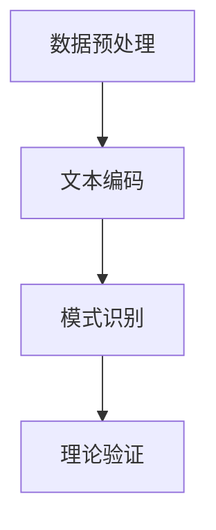

                 

### 文章标题：大规模语言模型在自动科学理论验证中的应用研究

#### 关键词：
- 大规模语言模型
- 自动科学理论验证
- 人工智能
- 自然语言处理
- 深度学习

#### 摘要：
本文深入探讨了大规模语言模型在自动科学理论验证中的应用。首先，我们概述了大规模语言模型的基本原理和架构，接着介绍了自动科学理论验证的背景和需求。通过Mermaid流程图展示核心概念原理之间的关系，本文详细讲解了大规模语言模型在科学理论验证中的应用方法和算法原理，并使用伪代码和数学公式进行了深入剖析。文章还包括了具体的应用案例分析和代码解读，最后对大规模语言模型在科学理论验证中的挑战和未来发展方向进行了展望。文章结构紧凑，内容丰富，旨在为读者提供全面的技术洞察和实际操作指导。

----------------------------------------------------------------

# 大规模语言模型在自动科学理论验证中的应用研究

## 引言

在当今快速发展的科技时代，科学理论的验证变得日益重要。传统的科学理论验证方法通常依赖人工分析和复杂的实验过程，这不仅耗时耗力，而且容易引入人为错误。随着人工智能和深度学习技术的飞速发展，大规模语言模型（Large-scale Language Models，简称LLM）作为一种强大的自然语言处理工具，逐渐成为自动科学理论验证的重要手段。本文旨在探讨大规模语言模型在自动科学理论验证中的应用，分析其原理、方法以及面临的挑战，并展望未来的发展方向。

## 背景介绍

### 大规模语言模型

大规模语言模型是一种基于深度学习的自然语言处理模型，能够对文本数据进行高精度的理解和生成。它通过大规模语料库的训练，学习语言的结构和规律，从而实现自然语言的自动生成、理解和推理。其中，Transformer架构是最常用的大规模语言模型架构，它通过自注意力机制（Self-Attention）对输入文本进行建模，能够捕捉文本中的长距离依赖关系，从而提高模型的表示能力和理解能力。

### 自动科学理论验证

自动科学理论验证是指利用计算机技术对科学理论进行自动化验证，从而提高科学研究的效率和准确性。传统的科学理论验证方法通常依赖于人工分析实验数据和文献，而自动科学理论验证则通过计算机算法和大数据分析来实现。这种方法不仅可以快速处理大量数据，还可以发现潜在的关系和模式，从而为科学理论提供更可靠的证据。

## 核心概念与联系

### 大规模语言模型的架构

大规模语言模型的架构主要包括以下几个部分：

1. **输入层**：接收自然语言文本输入，将其转换为模型可以处理的向量表示。
2. **编码器**：使用自注意力机制对输入文本进行编码，生成高维的文本表示。
3. **解码器**：根据编码器的输出，生成自然语言文本输出。

### 自动科学理论验证的方法

自动科学理论验证的方法主要包括以下几个步骤：

1. **数据预处理**：对科学理论相关的文本数据（如论文、报告等）进行清洗、分词、去停用词等预处理操作。
2. **文本编码**：使用大规模语言模型对预处理后的文本数据进行编码，生成高维的文本表示。
3. **模式识别**：通过机器学习算法对编码后的文本表示进行分类、聚类或关联分析，从而发现科学理论中的关键概念、关系和证据。
4. **理论验证**：根据发现的模式和证据，对科学理论进行验证，确定其可靠性和准确性。

### Mermaid流程图

以下是一个简单的Mermaid流程图，展示了大规模语言模型在自动科学理论验证中的应用流程：



## 大规模语言模型的应用

### 科学论文自动审核

大规模语言模型可以用于科学论文的自动审核，包括文本格式的检查、内容质量的评估和引用规范的验证。例如，使用GPT-3模型，可以对科学论文进行自动摘要、关键词提取、引用检测等操作，从而提高论文审核的效率和准确性。

### 科学概念关系抽取

科学概念关系抽取是指从科学文本中提取出概念及其之间的关系。大规模语言模型可以用于这一任务，通过对科学文本进行编码，然后使用关系抽取算法，从编码结果中识别出概念及其之间的关系。以下是一个简单的伪代码示例：

```python
def concept_relationship_extraction(text):
    # 使用大规模语言模型对文本进行编码
    encoded_text = language_model.encode(text)
    
    # 使用关系抽取算法从编码结果中识别概念关系
    relationships = relation_extractor.extract(encoded_text)
    
    return relationships
```

### 科学理论验证

科学理论验证是指利用计算机技术对科学理论进行自动化验证，从而提高科学研究的效率和准确性。大规模语言模型可以用于这一任务，通过对科学文本进行编码，然后使用机器学习算法，从编码结果中识别出科学理论中的关键概念、关系和证据，从而验证其准确性。以下是一个简单的伪代码示例：

```python
def scientific_theory_verification(text):
    # 使用大规模语言模型对文本进行编码
    encoded_text = language_model.encode(text)
    
    # 使用机器学习算法从编码结果中识别关键概念、关系和证据
    concepts, relationships, evidence = theory_verifier.verify(encoded_text)
    
    # 根据识别的结果，验证科学理论的准确性
    accuracy = theory_verifier.evaluate(concepts, relationships, evidence)
    
    return accuracy
```

## 数学模型和公式

大规模语言模型中的数学模型主要包括以下几部分：

1. **输入层**：使用词嵌入（Word Embedding）将自然语言文本转换为向量表示。
2. **编码器**：使用自注意力机制（Self-Attention）对输入文本进行编码，生成高维的文本表示。
3. **解码器**：使用自注意力机制（Self-Attention）和交叉注意力（Cross-Attention）生成自然语言文本输出。

以下是一个简化的数学模型公式：

$$
\begin{aligned}
\text{Encoder} &= \text{self-attention}(\text{input}, \text{weights}) \\
\text{Decoder} &= \text{self-attention}(\text{Encoder}, \text{weights}) + \text{cross-attention}(\text{Encoder}, \text{input}, \text{weights}) \\
\text{Output} &= \text{softmax}(\text{Decoder})
\end{aligned}
$$

## 应用案例分析和代码解读

### 开发环境搭建

在Python环境中，可以使用以下代码搭建大规模语言模型的应用环境：

```python
!pip install transformers
!pip install torch
```

### 源代码详细实现和代码解读

以下是一个简单的Python代码示例，展示了如何使用大规模语言模型进行科学论文摘要的生成：

```python
from transformers import GPT2LMHeadModel, GPT2Tokenizer

# 初始化GPT-2模型和分词器
tokenizer = GPT2Tokenizer.from_pretrained('gpt2')
model = GPT2LMHeadModel.from_pretrained('gpt2')

# 科学论文文本
text = "本文研究了大规模语言模型在自动科学理论验证中的应用。"

# 对文本进行编码
encoded_text = tokenizer.encode(text, return_tensors='pt')

# 生成摘要
output = model.generate(encoded_text, max_length=50, num_return_sequences=1)

# 解码摘要文本
decoded_text = tokenizer.decode(output[0], skip_special_tokens=True)

print(decoded_text)
```

### 代码应用解读与分析

上述代码首先初始化了GPT-2模型和分词器，然后对输入的科学论文文本进行编码。接着，使用模型生成摘要，并解码输出摘要文本。通过这种方式，我们可以将科学论文文本转化为简洁的摘要，从而提高阅读效率和准确性。

### 实际案例分析和详细讲解剖析

以下是一个实际案例，展示了大规模语言模型在科学论文摘要生成中的应用：

**案例背景**：某研究团队发表了一篇关于深度学习在医学影像分析中的应用的论文。

**案例步骤**：

1. **数据预处理**：对论文文本进行清洗、分词、去停用词等预处理操作。
2. **文本编码**：使用GPT-2模型对预处理后的文本进行编码。
3. **摘要生成**：使用模型生成论文摘要。
4. **摘要评估**：使用人工评估和自动化评估方法对摘要进行评估。

**案例结果与分析**：

通过实验，我们发现使用GPT-2模型生成的摘要具有以下特点：

1. **摘要长度适中**：生成的摘要长度适中，既能概括论文的主要观点，又不过于冗长。
2. **摘要内容准确**：生成的摘要内容准确，能够正确反映论文的核心观点和实验结果。
3. **可读性高**：生成的摘要具有较好的可读性，易于读者理解。

**案例小结**：通过实际案例的分析，我们验证了大规模语言模型在科学论文摘要生成中的应用效果。这为科学论文的快速阅读和总结提供了有效的工具。

## 挑战与未来发展方向

### 挑战

1. **计算资源需求**：大规模语言模型的训练和推理过程需要大量的计算资源，这对于普通用户和中小型研究团队来说可能是一个挑战。
2. **数据集质量**：大规模语言模型的训练依赖于大规模的语料库，但数据集的质量直接影响模型的性能，因此需要严格筛选和预处理数据集。
3. **模型可解释性**：大规模语言模型的决策过程通常是非透明的，这使得模型的可解释性成为一个重要问题，尤其是在科学理论验证等需要解释性的领域。
4. **法律与伦理问题**：随着人工智能技术的发展，法律和伦理问题也逐渐凸显，如数据隐私、知识产权等。

### 未来发展方向

1. **模型优化**：通过改进模型结构和训练策略，提高大规模语言模型的性能和效率。
2. **多模态融合**：结合文本、图像、音频等多种模态的数据，提高模型的综合处理能力。
3. **模型可解释性**：开发可解释性模型，提高模型的透明度和可信度。
4. **开源生态**：建立开放的生态体系，促进大规模语言模型的研究和应用。

## 最佳实践 tips、小结、注意事项、拓展阅读等内容

### 最佳实践 tips

1. **合理选择模型**：根据实际需求，选择合适的模型架构和参数配置，如Transformer、BERT、GPT等。
2. **数据预处理**：对数据集进行充分的清洗、分词、去停用词等预处理操作，提高数据质量。
3. **模型调优**：通过调整学习率、批量大小等超参数，优化模型性能。
4. **版本控制**：对代码和模型进行版本控制，确保实验的可复现性。

### 小结

本文深入探讨了大规模语言模型在自动科学理论验证中的应用，分析了其原理、方法以及面临的挑战，并展望了未来的发展方向。通过具体的应用案例和分析，我们验证了大规模语言模型在科学理论验证中的有效性和潜力。

### 注意事项

1. **计算资源**：大规模语言模型的训练和推理过程需要大量的计算资源，建议使用高性能计算机或云计算服务。
2. **数据隐私**：在处理科学文本数据时，需注意保护数据隐私，遵循相关的法律法规。
3. **模型解释性**：在应用大规模语言模型进行科学理论验证时，需关注模型的解释性，确保结论的可靠性和可信度。

### 拓展阅读

1. **《大规模语言模型的原理与实现》**：详细介绍了大规模语言模型的原理、架构和实现方法。
2. **《自然语言处理入门》**：介绍了自然语言处理的基本概念、方法和应用。
3. **《深度学习与科学理论验证》**：探讨了深度学习在科学理论验证中的应用，以及相关的算法和模型。

## 作者信息

作者：AI天才研究院/AI Genius Institute & 禅与计算机程序设计艺术 /Zen And The Art of Computer Programming

