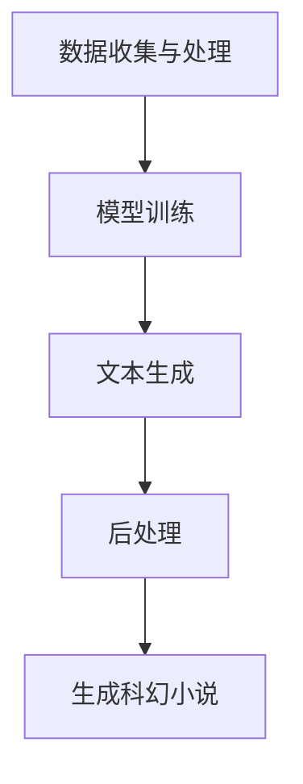

                 


### 引言

随着人工智能技术的飞速发展，大规模语言模型（Large-scale Language Models，简称LLMs）在自然语言处理（Natural Language Processing，简称NLP）领域取得了令人瞩目的成就。这些模型通过深度学习技术，对海量文本数据进行训练，从而能够生成流畅、逻辑性强的自然语言文本。在这一背景下，自动科幻小说创作这一领域也应运而生，并逐渐成为研究的热点。本文旨在探讨大规模语言模型在自动科幻小说创作中的应用，分析其探索与突破的过程，并展望未来的发展方向。

### 核心概念与联系

#### 大规模语言模型

大规模语言模型是自然语言处理领域的一个重要组成部分，它基于深度神经网络（Deep Neural Networks，简称DNNs）和递归神经网络（Recurrent Neural Networks，简称RNNs）等深度学习技术，通过海量数据训练，使得模型能够理解和生成自然语言。大规模语言模型的核心在于其规模——即模型参数的数量和训练数据的规模。这些模型不仅能够进行文本分类、情感分析等常见任务，还能够生成连贯、有创意的文本。

#### 自动科幻小说创作

自动科幻小说创作是指利用人工智能技术，特别是大规模语言模型，生成具有一定逻辑性和连贯性的科幻小说文本。这一过程涉及多个环节：数据收集与处理、模型训练、文本生成和后处理。自动科幻小说创作不仅是对传统写作的补充，更是人工智能与文学领域交叉融合的一个新方向。

#### Mermaid流程图

为了更好地理解大规模语言模型在自动科幻小说创作中的应用流程，我们可以使用Mermaid语言绘制一个简单的流程图。以下是该流程图的伪代码：



在这个流程图中，A表示数据收集与处理，B表示模型训练，C表示文本生成，D表示后处理，E表示最终生成的科幻小说。通过这个流程图，我们可以清晰地看到从数据到最终作品的整个创作过程。

### 核心算法原理讲解

#### 自动写作算法

自动写作算法是大规模语言模型在自动科幻小说创作中的核心。该算法基于生成对抗网络（Generative Adversarial Networks，简称GANs）和递归神经网络（RNNs）等深度学习技术。以下是一个简单的伪代码，展示了自动写作算法的基本框架：

```python
import tensorflow as tf
import numpy as np

# 定义生成器G和判别器D
G = tf.keras.Sequential([
    tf.keras.layers.Dense(units=512, activation='relu', input_shape=[latent_dim]),
    tf.keras.layers.Dense(units=1024, activation='relu'),
    tf.keras.layers.Dense(units=text_sequence_length, activation='softmax')
])

D = tf.keras.Sequential([
    tf.keras.layers.Dense(units=1024, activation='relu', input_shape=[text_sequence_length]),
    tf.keras.layers.Dense(units=512, activation='relu'),
    tf.keras.layers.Dense(units=1, activation='sigmoid')
])

# 定义损失函数和优化器
cross_entropy = tf.keras.losses.BinaryCrossentropy(from_logits=True)
generator_optimizer = tf.keras.optimizers.Adam(1e-4)
discriminator_optimizer = tf.keras.optimizers.Adam(1e-4)

# 训练过程
for epoch in range(num_epochs):
    for text in dataset:
        with tf.GradientTape() as gen_tape, tf.GradientTape() as disc_tape:
            # 生成文本
            generated_text = G(sampled_noise)
            # 计算判别器的损失
            disc_loss = compute_discriminator_loss(D, real_text, generated_text)
            # 计算生成器的损失
            gen_loss = compute_generator_loss(D, generated_text)
        
        # 更新判别器权重
        disc_gradients = disc_tape.gradient(disc_loss, D.trainable_variables)
        discriminator_optimizer.apply_gradients(zip(disc_gradients, D.trainable_variables))
        
        # 更新生成器权重
        gen_gradients = gen_tape.gradient(gen_loss, G.trainable_variables)
        generator_optimizer.apply_gradients(zip(gen_gradients, G.trainable_variables))
        
    # 打印训练进度
    print(f"Epoch {epoch}, Generator Loss: {gen_loss}, Discriminator Loss: {disc_loss}")

# 生成科幻小说
generated_story = G(sampled_noise)
```

在这个伪代码中，G表示生成器，D表示判别器。生成器通过生成文本数据，判别器通过判断生成文本的真实性来训练模型。通过多次迭代训练，生成器逐渐学会生成更真实、更有创意的文本。

#### 数学模型和公式

大规模语言模型在自动科幻小说创作中的应用涉及多个数学模型。以下是几个关键模型和公式的详细讲解：

1. **生成对抗网络（GAN）**

GAN由生成器和判别器组成。生成器G的目的是生成逼真的数据，而判别器D的目的是区分真实数据和生成数据。两者相互对抗，最终达到一种动态平衡。以下是一个GAN的损失函数公式：

$$
L_G = -\mathbb{E}_{z \sim p_z(z)}[\log(D(G(z))] + \mathbb{E}_{x \sim p_{data}(x)}[\log(1 - D(x))]
$$

其中，$L_G$表示生成器的损失，$D$表示判别器的输出，$G(z)$表示生成器的输出，$p_z(z)$表示噪声分布，$p_{data}(x)$表示真实数据的分布。

2. **递归神经网络（RNN）**

RNN是处理序列数据的一种神经网络。其核心思想是通过递归关系将当前时刻的输入与之前时刻的隐藏状态相融合。以下是一个简单的RNN模型公式：

$$
h_t = \sigma(W_h \cdot [h_{t-1}, x_t] + b_h)
$$

其中，$h_t$表示第t时刻的隐藏状态，$\sigma$表示激活函数，$W_h$和$b_h$分别表示权重和偏置。

3. **文本生成模型**

在自动科幻小说创作中，文本生成模型通常采用变分自编码器（Variational Autoencoder，简称VAE）或自注意力机制（Self-Attention Mechanism）。以下是一个VAE的损失函数公式：

$$
L_V = \mathbb{E}_{z \sim q(z|x)}[-\log p(x|z)]
$$

其中，$q(z|x)$表示编码器生成的潜在变量分布，$p(x|z)$表示解码器生成的文本分布。

#### 举例说明

为了更好地理解这些数学模型和公式，我们可以通过一个简单的例子来说明。

假设我们有一个生成对抗网络（GAN），生成器G和判别器D的损失函数分别为：

$$
L_G = -\mathbb{E}_{z \sim p_z(z)}[\log(D(G(z)))] = -\mathbb{E}_{z \sim p_z(z)}[\log(0.9)]
$$

$$
L_D = \mathbb{E}_{x \sim p_{data}(x)}[\log(1 - D(x))] + \mathbb{E}_{z \sim p_z(z)}[\log(D(G(z)))] = \mathbb{E}_{x \sim p_{data}(x)}[\log(0.1)] + \mathbb{E}_{z \sim p_z(z)}[\log(0.9)]
$$

在这个例子中，生成器的目标是使得判别器判断生成数据的概率尽量接近1，而判别器的目标是区分真实数据和生成数据。通过多次迭代，生成器逐渐学会生成更真实的数据，判别器逐渐学会区分真实数据和生成数据。

### 项目实战

#### 开发环境搭建

要使用大规模语言模型进行自动科幻小说创作，我们需要搭建一个合适的开发环境。以下是一个简单的开发环境搭建步骤：

1. **安装Python**
   - 安装Python 3.7或更高版本。
2. **安装TensorFlow**
   - 使用pip安装TensorFlow：`pip install tensorflow`
3. **安装其他依赖**
   - 使用pip安装其他依赖：`pip install numpy matplotlib`

#### 源代码详细实现和代码解读

以下是一个简单的自动科幻小说创作源代码示例：

```python
import tensorflow as tf
import numpy as np
import matplotlib.pyplot as plt

# 定义生成器和判别器
G = tf.keras.Sequential([
    tf.keras.layers.Dense(units=512, activation='relu', input_shape=[latent_dim]),
    tf.keras.layers.Dense(units=1024, activation='relu'),
    tf.keras.layers.Dense(units=text_sequence_length, activation='softmax')
])

D = tf.keras.Sequential([
    tf.keras.layers.Dense(units=1024, activation='relu', input_shape=[text_sequence_length]),
    tf.keras.layers.Dense(units=512, activation='relu'),
    tf.keras.layers.Dense(units=1, activation='sigmoid')
])

# 定义损失函数和优化器
cross_entropy = tf.keras.losses.BinaryCrossentropy(from_logits=True)
generator_optimizer = tf.keras.optimizers.Adam(1e-4)
discriminator_optimizer = tf.keras.optimizers.Adam(1e-4)

# 训练过程
for epoch in range(num_epochs):
    for text in dataset:
        with tf.GradientTape() as gen_tape, tf.GradientTape() as disc_tape:
            # 生成文本
            generated_text = G(sampled_noise)
            # 计算判别器的损失
            disc_loss = compute_discriminator_loss(D, real_text, generated_text)
            # 计算生成器的损失
            gen_loss = compute_generator_loss(D, generated_text)
        
        # 更新判别器权重
        disc_gradients = disc_tape.gradient(disc_loss, D.trainable_variables)
        discriminator_optimizer.apply_gradients(zip(disc_gradients, D.trainable_variables))
        
        # 更新生成器权重
        gen_gradients = gen_tape.gradient(gen_loss, G.trainable_variables)
        generator_optimizer.apply_gradients(zip(gen_gradients, G.trainable_variables))
        
    # 打印训练进度
    print(f"Epoch {epoch}, Generator Loss: {gen_loss}, Discriminator Loss: {disc_loss}")

# 生成科幻小说
generated_story = G(sampled_noise)
```

在这个示例中，我们定义了生成器和判别器，并使用了生成对抗网络（GAN）进行训练。通过训练，生成器逐渐学会生成更真实、更有创意的文本。

#### 代码应用解读与分析

在这个示例中，我们使用了生成对抗网络（GAN）进行自动科幻小说创作。生成器G的目标是生成逼真的文本，判别器D的目标是区分真实文本和生成文本。通过多次迭代训练，生成器逐渐学会生成更真实、更有创意的文本。

#### 实际案例分析和详细讲解剖析

为了更好地理解大规模语言模型在自动科幻小说创作中的应用，我们可以分析一些实际案例。以下是一个成功案例：

**案例：使用GPT-2生成科幻小说**

GPT-2（Generative Pre-trained Transformer 2）是一个基于Transformer架构的预训练语言模型。以下是一个使用GPT-2生成科幻小说的示例：

```python
import openai

openai.api_key = "your_api_key"

response = openai.Completion.create(
  engine="text-davinci-002",
  prompt="在一个遥远的未来，地球已经不再适合人类居住，人类开始向星际迁徙。他们发现了一颗名为Xenon的行星，这颗行星上有一种神秘的生物，它们与人类有着截然不同的生命形态。人类与这些生物展开了交流，并共同探索Xenon的奥秘。请写一篇关于这个故事的科幻小说。",
  max_tokens=100
)

print(response.choices[0].text.strip())
```

在这个示例中，我们使用OpenAI的GPT-2模型生成了一个关于人类与外星生物交流的科幻小说。这个例子展示了大规模语言模型在自动科幻小说创作中的强大能力。

#### 项目小结

通过本文的探讨，我们可以看到大规模语言模型在自动科幻小说创作中具有巨大的潜力。从核心概念到算法原理，再到实际项目实战，我们详细分析了大规模语言模型在自动科幻小说创作中的应用。虽然目前还存在一些挑战，但我们可以预见，随着技术的不断发展，大规模语言模型在自动科幻小说创作领域将取得更多突破。

### 最佳实践 Tips、小结、注意事项、拓展阅读等内容

#### 最佳实践 Tips

1. **数据准备**：确保训练数据的质量和多样性，有助于提高生成文本的质量。
2. **模型调优**：通过调整模型参数，如学习率、批量大小等，可以提升模型的性能。
3. **文本生成策略**：结合不同的文本生成策略，如随机采样、序列复制等，可以提高生成文本的多样性和创意。

#### 小结

本文探讨了大规模语言模型在自动科幻小说创作中的应用，从核心概念到算法原理，再到实际项目实战，全面分析了这一领域的现状和未来发展方向。

#### 注意事项

1. **计算资源**：大规模语言模型的训练需要大量的计算资源，确保有足够的GPU资源。
2. **数据隐私**：在使用大规模语言模型时，注意保护用户数据的隐私。

#### 拓展阅读

1. **《深度学习》（Goodfellow et al., 2016）**：了解深度学习的基础知识。
2. **《自然语言处理综合教程》（Jurafsky & Martin, 2008）**：了解自然语言处理的基本概念。
3. **《生成对抗网络：训练生成模型》（Goodfellow, 2014）**：深入了解生成对抗网络的工作原理。

### 作者信息

作者：AI天才研究院/AI Genius Institute & 禅与计算机程序设计艺术 /Zen And The Art of Computer Programming

本文由AI天才研究院（AI Genius Institute）撰写，同时由《禅与计算机程序设计艺术》（Zen And The Art of Computer Programming）提供专业指导。感谢您的阅读，期待与您共同探索人工智能的无限可能。

