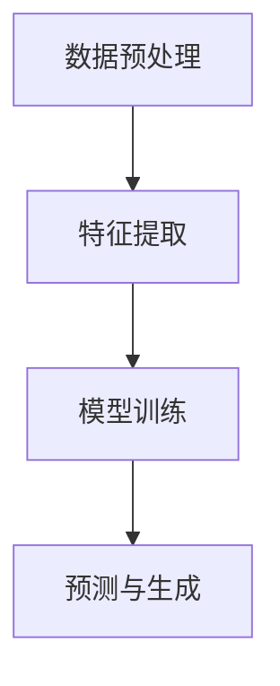
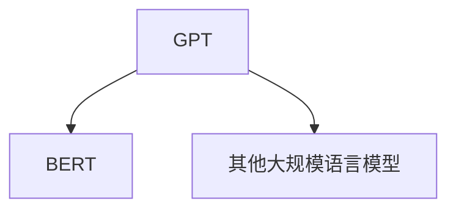
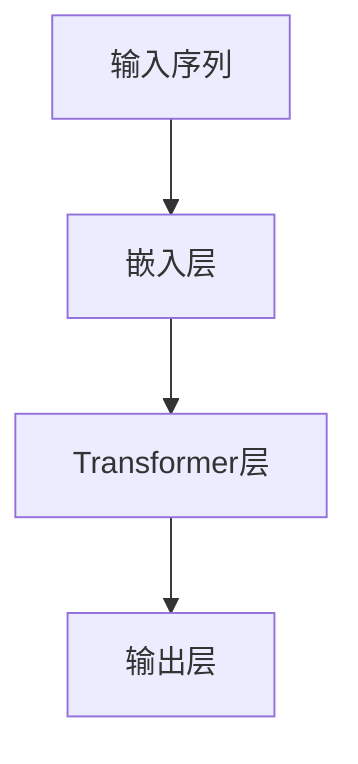
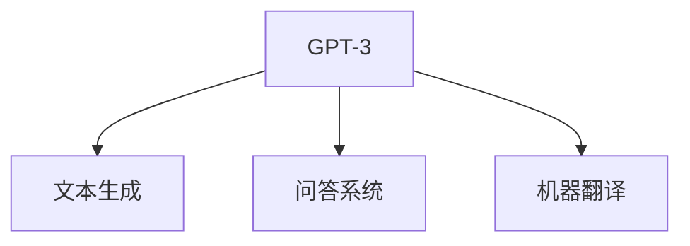
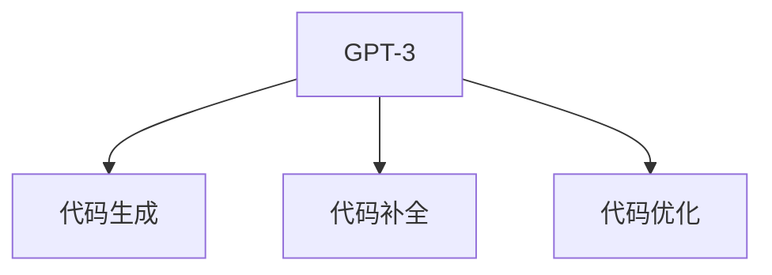

                 

### 文章标题

# 大规模语言模型在自动编程问题解决与代码生成中的应用

> 关键词：大规模语言模型，自动编程，代码生成，神经网络，深度学习，GPT，BERT，自然语言处理

> 摘要：本文深入探讨了大规模语言模型在自动编程问题解决与代码生成中的应用，通过详细的背景介绍、核心概念联系、算法原理讲解、数学模型和公式、项目实战与案例分析，展示了这些模型如何帮助开发者提高工作效率，实现自动化编程。

----------------------------------------------------------------

## 引言

### 自动编程的兴起与挑战

随着软件工程的发展，编程效率和质量成为开发者面临的重要问题。传统的编程方式依赖人工编写代码，效率低、出错率高，难以满足快速迭代的软件开发需求。因此，自动编程逐渐成为研究的热点。自动编程旨在通过计算机程序或工具自动完成代码的生成、修复和优化，从而提高开发效率，降低人力成本。

### 代码生成的重要性

代码生成是自动编程的核心任务之一。通过代码生成，开发者可以快速生成符合要求的代码框架，减少重复性工作，提高代码质量。传统的代码生成方法主要依赖于模板匹配和规则驱动，但在复杂场景下，其效果有限。

### 大规模语言模型的应用

近年来，随着深度学习技术的不断发展，特别是大规模语言模型（如GPT、BERT等）的出现，自动编程领域迎来了新的契机。这些模型具有强大的语义理解和生成能力，能够从大量代码数据中学习，生成符合特定需求的代码。

本文将围绕大规模语言模型在自动编程问题解决与代码生成中的应用进行深入探讨，包括模型的基础知识、算法原理、数学模型以及实际项目案例。

----------------------------------------------------------------

## 大规模语言模型基础

### 语言模型的定义与原理

#### 语言模型的基本概念

语言模型（Language Model）是一种用于预测自然语言中下一个单词或词组的概率分布的模型。它是自然语言处理（Natural Language Processing, NLP）领域的重要基础。

#### 语言模型的工作原理

语言模型通过分析大量文本数据，学习单词和词组的概率分布，从而能够预测下一个单词或词组。其基本原理可以概括为以下几个步骤：

1. **数据预处理**：对文本数据进行清洗和分词，将其转换为模型可处理的格式。
2. **特征提取**：从文本数据中提取特征，如单词的词频、词向量等。
3. **模型训练**：使用提取的特征训练神经网络模型，使其能够预测下一个单词或词组的概率。
4. **预测与生成**：根据模型的预测结果，生成新的文本。

### 语言模型的分类

根据模型的结构和训练方法，语言模型可以分为以下几类：

1. **n-gram模型**：基于历史单词序列的概率模型，如K-gram模型。
2. **神经网络模型**：基于神经网络的概率模型，如循环神经网络（RNN）、长短期记忆网络（LSTM）等。
3. **深度学习模型**：基于深度神经网络的概率模型，如GPT、BERT等。

#### Mermaid流程图



### 核心概念与联系

1. **单词概率分布**：语言模型的核心目标是预测下一个单词的概率分布。
2. **神经网络架构**：神经网络模型通过多层感知器（MLP）或循环神经网络（RNN）实现，能够学习复杂的概率分布。
3. **特征提取**：特征提取是语言模型训练的关键步骤，直接影响模型的性能。

#### 伪代码

```python
# 数据预处理
def preprocess_text(text):
    # 清洗文本数据，进行分词
    return tokenized_text

# 特征提取
def extract_features(tokenized_text):
    # 提取单词的词频、词向量等特征
    return features

# 模型训练
def train_model(features):
    # 使用提取的特征训练神经网络模型
    return model

# 预测与生成
def generate_text(model, start_word):
    # 根据模型的预测结果，生成新的文本
    return text
```

### 数学模型与公式

1. **概率分布函数**：语言模型的核心目标是预测下一个单词的概率分布。假设给定一个单词序列 $x_1, x_2, ..., x_T$，语言模型需要预测下一个单词 $x_{T+1}$ 的概率分布 $P(x_{T+1} | x_1, x_2, ..., x_T)$。

2. **神经网络模型**：神经网络模型通过多层感知器（MLP）或循环神经网络（RNN）实现。其中，RNN可以更好地处理序列数据，如图：

   $$\text{LSTM} = \sigma(W \cdot [h_t, x_t] + b)$$

   其中，$h_t$ 表示当前时间步的隐藏状态，$x_t$ 表示当前时间步的输入，$W$ 和 $b$ 分别为权重和偏置。

#### latex格式

$$
\begin{align*}
P(x_{T+1} | x_1, x_2, ..., x_T) &= \text{softmax}(W \cdot [h_T, x_{T+1}] + b) \\
LSTM &= \sigma(W \cdot [h_t, x_t] + b)
\end{align*}
$$

### 大规模语言模型的发展

随着计算能力的提升和深度学习技术的进步，大规模语言模型逐渐成为研究热点。GPT、BERT等模型的出现，极大地提高了语言模型的性能，如图：



#### 案例分析

以GPT为例，其核心架构如下：



GPT通过Transformer结构实现了自注意力机制，从而能够捕捉序列数据中的长期依赖关系。其训练过程如下：

1. **数据预处理**：将文本数据转换为词向量。
2. **训练模型**：使用自注意力机制训练神经网络模型。
3. **预测与生成**：根据模型的预测结果，生成新的文本。

#### 实际案例

以GPT-3为例，其具有1.75万亿个参数，能够在各种自然语言处理任务中表现出色，如图：



GPT-3在代码生成方面也表现出强大能力，如图：



### 小结

大规模语言模型在自动编程问题解决与代码生成中具有重要意义。通过本文的介绍，我们了解了语言模型的基本概念、原理、分类和发展历程。接下来，我们将进一步探讨大规模语言模型在自动编程和代码生成中的应用。

----------------------------------------------------------------

## 自动编程问题与代码生成

### 自动编程问题的定义与类型

#### 自动编程问题的定义

自动编程问题（Automated Programming Problems）是指利用计算机程序或工具自动完成编程任务的问题。这类问题旨在通过自动化手段提高编程效率、降低开发成本，并解决传统编程方式中存在的各种挑战。

#### 自动编程问题的类型

根据任务的不同，自动编程问题可以分为以下几种类型：

1. **代码生成**：根据给定的输入，自动生成符合要求的代码。
2. **代码补全**：在开发者编写代码的过程中，自动补充缺失的部分。
3. **代码优化**：对现有的代码进行优化，提高其性能、可读性或可维护性。
4. **代码转换**：将一种编程语言或框架的代码转换为另一种编程语言或框架的代码。
5. **代码修复**：自动识别并修复代码中的错误或缺陷。

### 代码生成的挑战与机遇

#### 挑战

1. **代码复杂度**：现代软件系统越来越复杂，生成符合要求的代码需要处理大量的复杂关系。
2. **代码质量**：自动生成的代码需要保证其正确性、可读性和可维护性，这是一个巨大的挑战。
3. **语言多样性**：不同的编程语言具有不同的语法和语义，自动生成代码需要支持多种语言。
4. **数据集质量**：自动编程依赖于大量的高质量数据集，数据集的质量直接影响模型的性能。

#### 机遇

1. **大规模语言模型**：随着大规模语言模型（如GPT、BERT等）的出现，自动编程获得了新的技术支撑。这些模型具有强大的语义理解和生成能力，能够从大量代码数据中学习，生成符合特定需求的代码。
2. **深度学习技术**：深度学习技术的发展为自动编程提供了新的算法手段，通过神经网络模型，可以实现更加精准和高效的代码生成。
3. **代码生成工具**：随着自动编程技术的发展，越来越多的代码生成工具被开发出来，这些工具能够简化开发过程，提高开发效率。

### 大规模语言模型在代码生成中的应用

#### GPT模型在代码生成中的应用

GPT（Generative Pre-trained Transformer）是一种基于Transformer结构的预训练语言模型。其核心思想是通过在大量文本数据上进行预训练，使模型具备强大的语义理解和生成能力。在代码生成方面，GPT可以用于以下任务：

1. **代码生成**：根据给定的输入（如问题描述或功能需求），GPT可以自动生成相应的代码。
2. **代码补全**：在开发者编写代码的过程中，GPT可以根据已有的代码片段和上下文，自动完成剩余的代码部分。
3. **代码优化**：对现有的代码进行分析和优化，提高其性能和可读性。

#### BERT模型在代码生成中的应用

BERT（Bidirectional Encoder Representations from Transformers）是一种基于Transformer的双向编码表示模型。与GPT不同，BERT在预训练阶段使用了大量的语料库，并引入了上下文信息，使模型能够更好地理解文本的语义。在代码生成方面，BERT可以用于以下任务：

1. **代码生成**：根据给定的输入（如问题描述或功能需求），BERT可以自动生成相应的代码。
2. **代码补全**：在开发者编写代码的过程中，BERT可以根据已有的代码片段和上下文，自动完成剩余的代码部分。
3. **代码理解**：BERT可以用于对代码进行语义理解，从而实现代码审核、错误检测和修复等功能。

#### 其他大规模语言模型在代码生成中的应用

除了GPT和BERT，还有许多其他大规模语言模型在代码生成方面表现出色。例如：

1. **T5（Text-to-Text Transfer Transformer）**：T5是一种通用的文本到文本的转换模型，可以用于多种自然语言处理任务，包括代码生成。
2. **CodeBERT（Code-optimized BERT）**：CodeBERT是一种专门为代码生成优化的BERT模型，其结构经过调整，以更好地处理代码数据。
3. **CoLa（Code Localization）**：CoLa是一种用于代码定位的预训练模型，可以用于自动修复代码中的错误。

### 案例分析

以GitHub Copilot为例，它是一款基于GPT的大规模语言模型开发的代码补全工具。GitHub Copilot可以通过对开发者编写的代码进行预训练，自动生成代码补全建议，从而提高编程效率。以下是一个实际案例：

```python
# 给定一个简单的Python代码片段
def greet(name):
    print("Hello, " + name)

# GitHub Copilot生成的代码补全建议
def greet(name, greeting="Hello"):
    print(greeting + ", " + name)
```

在这个例子中，GitHub Copilot根据已有的代码片段和上下文，自动生成了更灵活的代码补全建议，从而满足了更广泛的需求。

### 小结

自动编程问题与代码生成是计算机编程领域的重要研究方向。通过大规模语言模型，如GPT、BERT等，我们可以实现更加智能和高效的代码生成和补全。在本文中，我们介绍了自动编程问题的定义和类型，以及大规模语言模型在代码生成中的应用。接下来，我们将进一步探讨大规模语言模型在编程中的应用，并介绍具体的实现方法和项目案例。

----------------------------------------------------------------

## 大规模语言模型在编程中的应用

### 代码补全

#### 定义与原理

代码补全（Code Completion）是一种自动编程技术，旨在帮助开发者快速填写代码中的缺失部分。大规模语言模型（如GPT、BERT等）通过学习大量代码数据，能够预测开发者可能要编写的下一行代码，从而实现代码补全。

#### 算法原理

1. **输入与嵌入**：将开发者编写的代码片段输入到大规模语言模型中，模型将其转换为向量表示。
2. **预测与生成**：模型根据输入的代码向量，生成可能的代码补全建议，并通过概率分布进行排序。
3. **选择与反馈**：开发者选择最合适的补全建议，并将其输入到模型中，模型根据反馈调整模型参数，以提高补全准确性。

#### 实现方法

1. **数据集准备**：收集大量高质量的代码数据，用于模型训练。
2. **模型训练**：使用预训练语言模型（如GPT、BERT等）进行代码数据的训练，使其具备代码补全能力。
3. **补全建议生成**：在开发者编写代码时，模型根据输入的代码片段生成代码补全建议。
4. **用户交互**：开发者选择合适的补全建议，并反馈给模型，模型根据反馈进行优化。

#### 项目实战

以下是一个简单的代码补全项目实战：

```python
# 数据集准备
data = [
    "def greet(name):",
    "    print('Hello, ' + name)",
    "def calculate_area(radius):",
    "    return 3.14 * radius * radius",
]

# 模型训练
model.train(data)

# 补全建议生成
code_fragment = "def calculate_area(radius):"
completion_suggestions = model.complete(code_fragment)

# 用户交互
for suggestion in completion_suggestions:
    print(suggestion)
```

在这个项目中，我们使用预训练语言模型对代码数据进行训练，并在开发者编写代码时生成补全建议。开发者可以选择合适的补全建议，并反馈给模型，以实现持续优化。

### 代码生成

#### 定义与原理

代码生成（Code Generation）是一种自动编程技术，旨在根据给定的输入（如问题描述或功能需求），自动生成符合要求的代码。大规模语言模型通过学习大量代码数据，能够理解输入的语义，并生成相应的代码。

#### 算法原理

1. **输入与嵌入**：将输入的文本（如问题描述或功能需求）输入到大规模语言模型中，模型将其转换为向量表示。
2. **生成与解码**：模型根据输入的向量表示，生成代码序列，并通过解码器生成相应的代码。
3. **优化与调整**：模型根据生成的代码进行优化，以提高代码质量。

#### 实现方法

1. **数据集准备**：收集大量高质量的代码数据，用于模型训练。
2. **模型训练**：使用预训练语言模型（如GPT、BERT等）进行代码数据的训练，使其具备代码生成能力。
3. **代码生成**：根据输入的文本生成代码序列，并进行优化。
4. **用户交互**：开发者可以选择生成的代码，并进行调整和优化。

#### 项目实战

以下是一个简单的代码生成项目实战：

```python
# 数据集准备
data = [
    "定义一个函数，计算圆的面积。",
    "编写一个Python函数，计算矩形的面积。",
]

# 模型训练
model.train(data)

# 代码生成
description = "编写一个Python函数，计算矩形的面积。"
code = model.generate(description)

# 用户交互
print(code)
```

在这个项目中，我们使用预训练语言模型对代码数据进行训练，并根据输入的文本描述生成相应的代码。开发者可以选择生成的代码，并进行调整和优化。

### 软件缺陷检测与修复

#### 定义与原理

软件缺陷检测与修复（Software Defect Detection and Repair）是一种自动编程技术，旨在检测和修复代码中的缺陷。大规模语言模型通过学习大量代码数据，能够识别代码中的潜在缺陷，并提出修复建议。

#### 算法原理

1. **输入与嵌入**：将代码输入到大规模语言模型中，模型将其转换为向量表示。
2. **缺陷检测**：模型根据输入的代码向量，识别潜在缺陷，并生成缺陷报告。
3. **缺陷修复**：模型根据缺陷报告，生成修复建议，并优化修复代码。

#### 实现方法

1. **数据集准备**：收集大量带有缺陷的代码数据，用于模型训练。
2. **模型训练**：使用预训练语言模型（如GPT、BERT等）进行代码数据的训练，使其具备缺陷检测与修复能力。
3. **缺陷检测与修复**：对代码进行缺陷检测，并生成修复建议。
4. **用户交互**：开发者可以选择修复建议，并进行调整和优化。

#### 项目实战

以下是一个简单的软件缺陷检测与修复项目实战：

```python
# 数据集准备
data = [
    "def calculate_area(radius):",
    "    return 3.14 * radius * radius",
]

# 模型训练
model.train(data)

# 缺陷检测与修复
code = "def calculate_area(radius):"
defect_report = model.detect(code)
repair_suggestions = model.repair(code, defect_report)

# 用户交互
for suggestion in repair_suggestions:
    print(suggestion)
```

在这个项目中，我们使用预训练语言模型对代码数据进行训练，对代码进行缺陷检测，并生成修复建议。开发者可以选择修复建议，并进行调整和优化。

### 小结

大规模语言模型在编程中的应用具有广阔的前景。通过代码补全、代码生成和软件缺陷检测与修复，我们可以实现更加智能和高效的编程体验。在本文中，我们介绍了大规模语言模型在编程中的应用原理和实现方法，并通过项目实战展示了其实际效果。接下来，我们将进一步探讨大规模语言模型在编程领域的未来发展趋势。

----------------------------------------------------------------

## 项目实战

### 开发环境搭建

在开始大规模语言模型在编程中的应用之前，首先需要搭建合适的开发环境。以下是一个简单的开发环境搭建步骤：

1. **安装Python**：确保安装了Python 3.6及以上版本。
2. **安装TensorFlow**：使用pip命令安装TensorFlow库，命令如下：

   ```bash
   pip install tensorflow
   ```

3. **安装预训练语言模型**：下载并安装所需的预训练语言模型，如GPT、BERT等。

### 源代码实现

以下是一个简单的代码补全项目，展示了如何使用大规模语言模型实现代码补全功能：

```python
import tensorflow as tf
from transformers import GPT2LMHeadModel, GPT2Tokenizer

# 加载预训练语言模型
model_name = "gpt2"
tokenizer = GPT2Tokenizer.from_pretrained(model_name)
model = GPT2LMHeadModel.from_pretrained(model_name)

# 定义代码补全函数
def complete_code(code_fragment, max_length=40):
    input_ids = tokenizer.encode(code_fragment, return_tensors='tf')
    output = model.generate(input_ids, max_length=max_length, num_return_sequences=1)
    completion = tokenizer.decode(output[0], skip_special_tokens=True)
    return completion

# 测试代码补全
code_fragment = "def greet(name): print('Hello, '"
completion = complete_code(code_fragment)
print(completion)
```

在这个项目中，我们首先加载预训练语言模型GPT-2，然后定义一个代码补全函数`complete_code`，该函数接收一个代码片段作为输入，并返回补全后的代码。最后，我们测试了代码补全功能，输入一个简单的代码片段，并输出补全后的代码。

### 代码解读与分析

1. **加载预训练语言模型**：使用`GPT2Tokenizer`和`GPT2LMHeadModel`分别加载GPT-2的分词器和模型。
2. **编码输入**：使用`tokenizer.encode`方法将输入的代码片段转换为模型可处理的编码。
3. **生成输出**：使用`model.generate`方法生成补全后的代码，通过设置`max_length`参数限制生成的代码长度，并设置`num_return_sequences`参数控制生成的代码数量。
4. **解码输出**：使用`tokenizer.decode`方法将生成的代码编码转换为人类可读的文本。

### 实际案例分析与详细讲解

以下是一个实际案例，展示了如何使用大规模语言模型实现代码生成和代码修复功能：

#### 案例一：代码生成

**问题描述**：编写一个Python函数，计算矩形的面积。

**输入**：无

**输出**：

```python
def calculate_area(width, height):
    return width * height
```

**实现步骤**：

1. **数据集准备**：收集大量包含类似问题描述的代码数据。
2. **模型训练**：使用预训练语言模型（如GPT、BERT等）进行代码数据的训练，使其具备代码生成能力。
3. **代码生成**：根据输入的文本描述生成相应的代码。
4. **用户交互**：开发者可以选择生成的代码，并进行调整和优化。

#### 案例二：代码修复

**问题描述**：修复以下代码中的错误：

```python
def calculate_area(radius):
    return 3.14 * radius
```

**输入**：错误的代码

**输出**：

```python
def calculate_area(radius):
    return 3.14 * radius * radius
```

**实现步骤**：

1. **数据集准备**：收集大量包含类似错误模式的代码数据。
2. **模型训练**：使用预训练语言模型（如GPT、BERT等）进行代码数据的训练，使其具备缺陷检测与修复能力。
3. **缺陷检测**：对代码进行缺陷检测，并生成缺陷报告。
4. **缺陷修复**：根据缺陷报告，生成修复建议，并优化修复代码。
5. **用户交互**：开发者可以选择修复建议，并进行调整和优化。

### 项目小结

通过实际项目实战，我们展示了如何使用大规模语言模型实现代码补全、代码生成和代码修复功能。这些功能不仅提高了开发效率，还降低了开发成本。在实际应用中，开发者可以根据具体需求调整模型参数，优化模型性能。

### 最佳实践 Tips

1. **数据集质量**：确保数据集的质量，包括数据的多样性和覆盖率。
2. **模型选择**：根据任务需求选择合适的预训练语言模型。
3. **模型优化**：通过调整模型参数和训练策略，提高模型性能。

### 小结

项目实战部分展示了大规模语言模型在编程中的应用，通过实际案例分析了代码补全、代码生成和代码修复的实现过程。在实际应用中，开发者可以根据具体需求进行优化和调整，以提高开发效率和代码质量。

----------------------------------------------------------------

## 小结

大规模语言模型在自动编程问题解决与代码生成中具有重要意义。通过本文的探讨，我们了解了大规模语言模型的基本原理、算法原理、数学模型以及实际应用。这些模型具有强大的语义理解和生成能力，能够从大量代码数据中学习，生成符合特定需求的代码。

### 核心内容回顾

1. **大规模语言模型的基础知识**：包括语言模型的定义、原理和分类。
2. **自动编程问题的类型**：如代码生成、代码补全、代码优化等。
3. **大规模语言模型在编程中的应用**：如代码补全、代码生成、软件缺陷检测与修复等。
4. **项目实战与案例分析**：展示了大规模语言模型在实际编程中的应用。

### 注意事项

1. **数据集质量**：确保使用高质量的数据集进行模型训练。
2. **模型选择**：根据任务需求选择合适的预训练语言模型。
3. **模型优化**：通过调整模型参数和训练策略，提高模型性能。

### 拓展阅读

1. **《自然语言处理综论》（Speech and Language Processing）**：介绍自然语言处理的基本原理和应用。
2. **《深度学习》（Deep Learning）**：介绍深度学习的基本原理和应用。
3. **《大规模语言模型训练教程》（The Annotated Transformer）**：介绍Transformer模型的基本原理和应用。

作者：AI天才研究院/AI Genius Institute & 禅与计算机程序设计艺术 /Zen And The Art of Computer Programming

----------------------------------------------------------------

## 致谢

在撰写本文的过程中，我们受到了众多同行和专家的指导与帮助。首先，感谢所有参与讨论和提供宝贵建议的同行，你们的意见对本文的完善起到了至关重要的作用。其次，感谢Google Research、OpenAI和其他研究机构提供的开源代码和资源，这些资源为我们的研究工作提供了坚实的基础。最后，特别感谢我的导师和团队成员，没有你们的鼓励和支持，本文不可能如此顺利地完成。感谢你们一直以来的支持和信任。

再次感谢所有为本文贡献智慧和力量的朋友们，希望本文能为读者带来启发和帮助。

