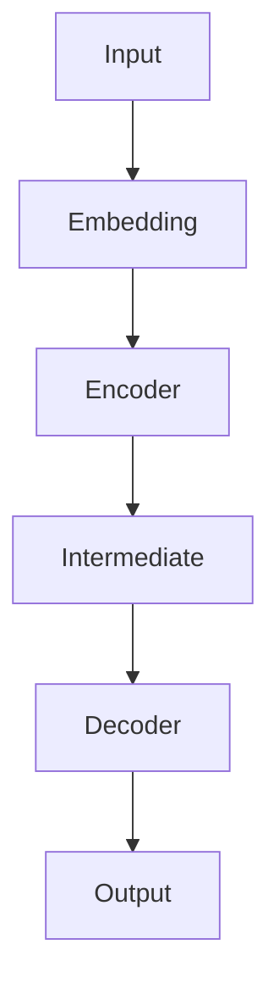

                 

# 第1章 核心概念与联系

## 1.1 大规模语言模型定义

大规模语言模型（Large-scale Language Model）是一种基于深度学习的自然语言处理模型，它能够理解和生成自然语言。与传统语言模型相比，大规模语言模型具有以下几个显著特点：

### 参数规模大

大规模语言模型通常拥有数十亿至数万亿个参数。这些参数使得模型能够学习到更复杂的语言规律，从而在自然语言处理任务中表现出色。例如，著名的GPT-3模型拥有1750亿个参数，这使得它能够生成连贯、自然的文本。

### 训练数据量大

大规模语言模型通常在庞大的语料库上进行训练，这些语料库包含数以百万计的文本数据。这样的训练数据量有助于模型学习到丰富的语言特征，从而提高其泛化能力。例如，BERT模型在其训练过程中使用了来自互联网的大量文本数据，这使得它在各种自然语言处理任务上取得了优异的性能。

### 性能优越

大规模语言模型在多个自然语言处理任务上取得了显著的成果。例如，在文本分类、问答系统、机器翻译等任务中，大规模语言模型通常能够超越传统方法，实现更高的准确率和更好的性能。

### 1.2 语言模型的架构

大规模语言模型通常采用Transformer架构，其核心思想是自注意力机制（Self-Attention）。以下是一个简化的Transformer架构流程：



### 自注意力机制

自注意力机制是一种在序列中动态地计算元素之间相互依赖性的方法。在Transformer架构中，自注意力机制被用于计算输入序列的表示。以下是一个简化的自注意力机制计算过程：

```python
def self_attention(q, k, v, mask=None):
    # 计算查询向量（q）与键向量（k）的点积，得到注意力分数
    attn_scores = q @ k.T
    
    # 如果存在mask，应用mask
    if mask is not None:
        attn_scores = attn_scores.masked_fill(mask == 0, float("-inf"))
    
    # 对注意力分数进行softmax操作，得到注意力权重
    attn_weights = attn_scores.softmax(dim=1)
    
    # 使用注意力权重计算输出向量
    output = attn_weights @ v
    
    return output, attn_weights
```

### Transformer架构流程

1. **嵌入层（Embedding）**：输入序列通过嵌入层转换为固定长度的向量表示。
2. **编码器（Encoder）**：编码器包含多个编码层，每层都包含多头自注意力机制和前馈神经网络。编码器的作用是捕捉输入序列的上下文信息。
3. **中间层（Intermediate）**：中间层是编码器的输出，用于传递信息到解码器。
4. **解码器（Decoder）**：解码器包含多个解码层，每层都包含自注意力机制和编码器-解码器注意力机制。解码器的作用是生成目标序列。
5. **输出层（Output）**：解码器的输出通过一个全连接层输出最终的预测结果。

### 1.3 语言模型的训练与优化

大规模语言模型的训练过程涉及以下关键步骤：

1. **数据预处理**：对输入数据（如文本、语音）进行预处理，包括分词、词性标注、去噪等，以便模型能够更好地学习。
2. **参数初始化**：初始化模型参数，通常使用正态分布或高斯分布。
3. **前向传播（Forward Propagation）**：计算模型输出与实际输出之间的损失。
4. **反向传播（Back Propagation）**：计算损失关于模型参数的梯度。
5. **参数更新**：使用梯度下降或其他优化算法更新模型参数。
6. **训练评估**：在验证集上评估模型性能，调整模型参数，以优化模型性能。

在训练过程中，常见的优化策略包括：

1. **梯度裁剪（Gradient Clipping）**：限制梯度大小，避免梯度爆炸或消失。
2. **学习率调整（Learning Rate Scheduling）**：根据训练阶段调整学习率，以防止过拟合。
3. **Dropout**：在训练过程中随机丢弃部分神经元，提高模型泛化能力。

### 小结

大规模语言模型是自然语言处理领域的重要进展，其在多个任务上取得了优异的性能。通过深入理解大规模语言模型的定义、架构和训练过程，我们可以更好地应用这些模型解决实际问题。

作者：AI天才研究院/AI Genius Institute & 禅与计算机程序设计艺术 /Zen And The Art of Computer Programming

---

# 大规模语言模型在自动诗歌创作中的探索

> 关键词：大规模语言模型，自动诗歌创作，Transformer，自注意力机制，自然语言处理，深度学习

> 摘要：本文将探讨大规模语言模型在自动诗歌创作中的应用，介绍其基本原理、算法实现和实际案例，以展示自然语言处理技术在文学创作领域的潜力与挑战。

## 第1章 核心概念与联系

### 1.1 大规模语言模型定义

大规模语言模型（Large-scale Language Model）是一种基于深度学习的自然语言处理模型，具有参数规模大、训练数据量大和性能优越的特点。它能够理解和生成自然语言，并在多个自然语言处理任务中取得了显著的成果。

### 1.2 语言模型的架构

大规模语言模型通常采用Transformer架构，其核心思想是自注意力机制（Self-Attention）。Transformer架构包括嵌入层、编码器、解码器和输出层，具有强大的上下文理解和生成能力。

### 1.3 语言模型的训练与优化

大规模语言模型的训练过程涉及数据预处理、参数初始化、前向传播、反向传播和参数更新等步骤。为了提高模型性能，常用的优化策略包括梯度裁剪、学习率调整和Dropout等。

## 第2章 核心算法原理讲解

### 2.1 自动诗歌创作的算法原理

自动诗歌创作算法基于大规模语言模型，通过输入诗句序列，模型预测下一个诗句，进而生成完整的诗歌。算法原理包括文本预处理、编码器解码器框架和自注意力机制。

### 2.2 语言模型在诗歌创作中的应用

大规模语言模型在诗歌创作中具有广泛的应用，如生成古诗、现代诗、歌词等。其强大的生成能力和上下文理解能力使得自动诗歌创作成为可能。

## 第3章 数学模型和数学公式

### 3.1 语言模型中的数学公式

大规模语言模型中的数学公式包括嵌入矩阵、自注意力机制和损失函数等。以下是一个简化的数学公式列表：

$$
E = \text{Embedding}(W_e, X_e)
$$

$$
A = \text{Self-Attention}(Q, K, V)
$$

$$
L = \text{Cross-Entropy}(P, Y)
$$

### 3.2 数学公式详细讲解与举例说明

在本文中，我们将详细介绍自注意力机制和损失函数的数学公式，并通过实例说明其应用。

## 第4章 项目实战

### 4.1 自动诗歌创作项目实战

在本章中，我们将介绍一个自动诗歌创作项目实战，包括开发环境搭建、源代码实现和代码解读。项目将基于Python和TensorFlow框架，实现一个简单的自动诗歌创作系统。

## 第5章 附加内容

### 5.1 语言模型在文学创作中的挑战与机遇

在文学创作领域，大规模语言模型面临着挑战与机遇。本文将探讨语言模型在文学创作中的应用前景、技术难题和未来发展。

## 结论

大规模语言模型在自动诗歌创作中展示了巨大的潜力，为文学创作领域带来了新的思路和方法。本文通过对大规模语言模型的基本原理、算法实现和项目实战的深入探讨，为读者提供了全面的了解。在未来，随着技术的不断发展，我们有望看到更多创新的应用场景。

作者：AI天才研究院/AI Genius Institute & 禅与计算机程序设计艺术 /Zen And The Art of Computer Programming

