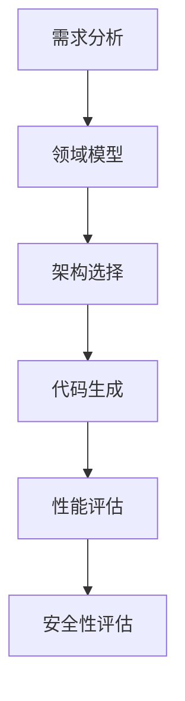

                 

### 文章标题：大规模语言模型在自动软件架构设计与评估中的应用

### 关键词：
- 大规模语言模型
- 自动软件架构设计
- 软件架构评估
- 人工智能
- 代码生成
- 性能优化

### 摘要：
本文深入探讨了大规模语言模型在自动软件架构设计与评估中的应用。首先，我们回顾了大规模语言模型的基础知识，包括其起源、特点、架构和评估方法。接着，我们详细介绍了大规模语言模型在软件架构设计中的应用，如需求分析、领域模型构建和代码生成。随后，我们探讨了大规模语言模型在自动软件架构设计中的作用，包括设计流程、架构选择和评估。最后，我们研究了大规模语言模型在软件架构评估中的应用，包括代码质量评估、性能评估和安全性评估，并通过实际案例进行了分析。

### 目录

## 第一部分：大规模语言模型基础

### 1.1 大规模语言模型概述

#### 1.1.1 大规模语言模型的起源

#### 1.1.2 大规模语言模型的特点

#### 1.1.3 大规模语言模型的技术发展

#### 1.1.4 大规模语言模型的应用领域

### 1.2 大规模语言模型的架构

#### 1.2.1 语言模型的基本结构

#### 1.2.2 大规模语言模型的训练过程

#### 1.2.3 大规模语言模型的优化算法

#### 1.2.4 大规模语言模型的核心组件

### 1.3 大规模语言模型的评估

#### 1.3.1 语言模型评估指标

#### 1.3.2 语言模型评估方法

#### 1.3.3 语言模型评估中的挑战

#### 1.3.4 评估结果的可视化分析

## 第二部分：大规模语言模型在软件架构设计中的应用

### 2.1 软件架构设计中的大规模语言模型

#### 2.1.1 大规模语言模型在需求分析中的应用

#### 2.1.2 大规模语言模型在领域模型构建中的应用

#### 2.1.3 大规模语言模型在代码生成中的应用

#### 2.1.4 大规模语言模型在架构设计中的优势

### 2.2 自动软件架构设计

#### 2.2.1 自动软件架构设计流程

#### 2.2.2 大规模语言模型在架构选择中的应用

#### 2.2.3 大规模语言模型在架构评估中的应用

#### 2.2.4 自动软件架构设计的挑战与未来趋势

### 2.3 大规模语言模型的挑战与展望

----------------------------------------------------------------

## 第一部分：大规模语言模型基础

### 1.1 大规模语言模型概述

#### 1.1.1 大规模语言模型的起源

大规模语言模型起源于自然语言处理（NLP）领域，旨在解决自然语言理解和生成问题。随着深度学习技术的发展，尤其是2018年谷歌发布的Transformer模型，大规模语言模型开始崭露头角。Transformer模型的出现标志着从传统的循环神经网络（RNN）到自注意力机制（self-attention）的巨大转变，这一转变极大地推动了大规模语言模型的研究和应用。

#### 1.1.2 大规模语言模型的特点

1. **参数规模巨大**：大规模语言模型通常拥有数亿甚至数十亿个参数，这使得它们能够捕捉到自然语言中的复杂模式。
2. **自注意力机制**：Transformer模型的核心是自注意力机制，它能够自动地学习输入序列中各个单词之间的关系，而不仅仅是相邻的单词。
3. **端到端学习**：大规模语言模型可以从原始文本直接学习到复杂的语言规律，无需人工提取特征。
4. **多任务能力**：大规模语言模型能够同时处理多种语言任务，如文本分类、问答系统和机器翻译等。

#### 1.1.3 大规模语言模型的技术发展

1. **预训练与微调**：大规模语言模型的训练通常分为两个阶段：预训练和微调。在预训练阶段，模型在大量的无标签数据上训练，以学习通用语言特征。在微调阶段，模型被调整以适应特定的任务。
2. **分布式训练**：由于大规模语言模型参数数量庞大，训练过程通常需要分布式计算资源，如GPU或TPU，以加速训练过程。
3. **模型压缩**：为了降低模型的存储和计算成本，研究人员开发了各种模型压缩技术，如剪枝、量化、知识蒸馏等。

#### 1.1.4 大规模语言模型的应用领域

1. **自然语言处理**：大规模语言模型在文本分类、情感分析、机器翻译、问答系统等领域表现出色。
2. **代码生成**：大规模语言模型在代码补全、代码生成和重构等方面有广泛的应用。
3. **软件工程**：大规模语言模型在需求分析、架构设计、代码质量评估等方面有重要应用。

### 1.2 大规模语言模型的架构

#### 1.2.1 语言模型的基本结构

大规模语言模型通常由以下几个组件组成：

1. **嵌入层**：将输入的单词或子词嵌入到高维空间中。
2. **自注意力层**：通过自注意力机制学习输入序列中各个元素之间的关系。
3. **前馈网络**：在每个自注意力层之后，添加一个前馈网络以增加模型的非线性能力。
4. **输出层**：将模型的预测输出为概率分布，用于生成文本或执行其他任务。

#### 1.2.2 大规模语言模型的训练过程

大规模语言模型的训练通常包括以下步骤：

1. **数据预处理**：对文本数据进行清洗、分词、标记等预处理。
2. **词嵌入**：将文本数据转换为向量表示，通常使用预训练的词嵌入模型。
3. **模型训练**：通过梯度下降等优化算法，在大量文本数据上训练模型。
4. **评估与调整**：在验证集上评估模型性能，并根据评估结果调整模型参数。

#### 1.2.3 大规模语言模型的优化算法

大规模语言模型的优化算法通常包括以下几种：

1. **Adam优化器**：一种自适应的优化器，能够有效地处理稀疏梯度问题。
2. **学习率调度**：如学习率衰减、余弦退火等，以防止模型过拟合。
3. **正则化技术**：如Dropout、权重正则化等，以减少模型的过拟合风险。

#### 1.2.4 大规模语言模型的核心组件

大规模语言模型的核心组件包括：

1. **Transformer模型**：基于自注意力机制的模型，是当前最流行的语言模型架构。
2. **BERT模型**：一种双向编码表示模型，能够在预训练阶段学习到丰富的语言特征。
3. **GPT模型**：一种基于Transformer的生成模型，能够在给定文本上下文时生成连贯的自然语言。

### 1.3 大规模语言模型的评估

#### 1.3.1 语言模型评估指标

大规模语言模型的评估通常包括以下指标：

1. **准确率（Accuracy）**：模型预测正确的样本数与总样本数的比例。
2. **精确率（Precision）**：模型预测为正类的实际正类样本数与预测为正类的总样本数的比例。
3. **召回率（Recall）**：模型预测为正类的实际正类样本数与实际正类样本总数的比例。
4. **F1分数（F1 Score）**：精确率和召回率的调和平均数。
5. **BLEU分数**：用于评估机器翻译质量的指标，基于重叠度进行评分。

#### 1.3.2 语言模型评估方法

大规模语言模型的评估方法包括：

1. **交叉验证**：通过将数据集划分为多个子集，轮流将每个子集作为验证集，评估模型性能。
2. **自动化评估**：使用自动化评估工具，如TensorFlow和PyTorch中的评估API，自动计算评估指标。
3. **人类评估**：在某些任务中，使用人类评估者对模型输出进行主观评估。

#### 1.3.3 语言模型评估中的挑战

大规模语言模型评估中面临的挑战包括：

1. **数据质量**：评估指标依赖于高质量的数据，但获取高质量的数据可能很困难。
2. **数据分布**：评估数据与实际应用场景的数据分布可能不一致，导致评估结果不可靠。
3. **评估成本**：大规模语言模型评估通常需要大量的计算资源和时间。

#### 1.3.4 评估结果的可视化分析

评估结果的可视化分析有助于理解模型性能：

1. **混淆矩阵**：用于展示模型在不同类别上的预测结果，有助于识别模型的弱点和改进方向。
2. **ROC曲线和AUC值**：用于评估模型的分类能力，ROC曲线下面积（AUC）越大，模型性能越好。
3. **箱线图**：用于比较不同模型或不同参数设置的性能。

## 总结

大规模语言模型在自动软件架构设计与评估中的应用具有巨大的潜力。通过深入了解大规模语言模型的基础知识，我们能够更好地理解其在软件架构设计中的应用。在下一部分，我们将探讨大规模语言模型在软件架构设计中的具体应用，包括需求分析、领域模型构建和代码生成。

----------------------------------------------------------------

## 第二部分：大规模语言模型在软件架构设计中的应用

### 2.1 软件架构设计中的大规模语言模型

#### 2.1.1 大规模语言模型在需求分析中的应用

需求分析是软件架构设计的第一步，旨在明确系统需要实现的功能和性能要求。大规模语言模型在这一阶段可以发挥重要作用。

1. **文本分析**：大规模语言模型能够处理和理解自然语言文本，从而对需求文档进行分析和提取关键信息。
2. **语义理解**：通过预训练的模型，如BERT或GPT，可以对需求文本进行语义理解，提取出文本中的主题和关系。
3. **关键字提取**：大规模语言模型可以识别文本中的关键字，从而帮助开发者理解需求的核心内容。
4. **情感分析**：大规模语言模型可以对需求文本进行情感分析，识别出文本中的积极或消极情感，帮助开发者了解用户对系统功能的需求和期望。

#### 2.1.2 大规模语言模型在领域模型构建中的应用

领域模型是软件架构设计的重要组成部分，它描述了系统的核心业务概念和关系。大规模语言模型在构建领域模型方面具有以下优势：

1. **知识图谱构建**：大规模语言模型可以处理和理解大量的领域知识，从而帮助构建领域知识图谱。
2. **概念识别**：通过自然语言处理技术，大规模语言模型可以识别出领域模型中的核心概念和关系，如实体、属性和关联。
3. **自动建模**：基于预训练的模型，大规模语言模型可以自动生成领域模型，从而减少人工建模的工作量。
4. **模型优化**：通过对领域模型的分析和评估，大规模语言模型可以帮助优化领域模型的性能和可维护性。

#### 2.1.3 大规模语言模型在代码生成中的应用

代码生成是软件架构设计中的重要环节，旨在自动化生成系统的实现代码。大规模语言模型在代码生成方面具有以下应用：

1. **模板生成**：大规模语言模型可以基于预训练的模板库，自动生成代码模板，从而加速代码开发过程。
2. **代码补全**：在编写代码时，大规模语言模型可以预测和补全代码片段，从而减少开发人员的输入工作量。
3. **代码优化**：通过分析代码的执行效率和性能，大规模语言模型可以帮助优化代码，提高系统的性能和可维护性。
4. **代码重构**：大规模语言模型可以识别出代码中的重复和冗余部分，从而帮助开发者进行代码重构，提高代码的可读性和可维护性。

#### 2.1.4 大规模语言模型在架构设计中的优势

大规模语言模型在软件架构设计中的应用具有以下优势：

1. **效率提升**：通过自动化处理和分析需求、构建领域模型和生成代码，大规模语言模型可以显著提高软件架构设计的效率。
2. **准确性提高**：大规模语言模型能够更准确地理解和提取需求，从而帮助构建更符合实际需求的软件架构。
3. **可维护性提高**：通过自动生成和优化代码，大规模语言模型可以提高软件系统的可维护性，减少代码维护的工作量。
4. **灵活性提高**：大规模语言模型可以灵活地适应不同的软件架构设计需求，从而提高设计的灵活性和可扩展性。

### 2.2 自动软件架构设计

#### 2.2.1 自动软件架构设计流程

自动软件架构设计是一种基于人工智能和自动化技术的软件架构设计方法。其基本流程包括以下步骤：

1. **需求分析**：通过大规模语言模型对需求文档进行分析和提取，确定系统的功能需求和性能要求。
2. **领域模型构建**：基于需求分析结果，使用大规模语言模型构建系统的领域模型，包括实体、属性和关联。
3. **架构选择**：根据领域模型和需求分析结果，使用大规模语言模型选择合适的软件架构风格和组件。
4. **架构评估**：使用大规模语言模型对所选架构进行评估，包括性能评估、可维护性和可扩展性评估。
5. **代码生成**：基于选定的架构，使用大规模语言模型自动生成系统的实现代码。
6. **架构优化**：通过评估结果，对架构进行优化，以提高系统的性能和可维护性。
7. **架构验证**：对生成的架构进行验证，确保其满足需求分析和性能要求。

#### 2.2.2 大规模语言模型在架构选择中的应用

在自动软件架构设计中，大规模语言模型在架构选择方面具有以下应用：

1. **架构风格识别**：通过分析领域模型和需求，大规模语言模型可以识别出适合的软件架构风格，如微服务架构、事件驱动架构等。
2. **架构组件选择**：基于领域模型和需求，大规模语言模型可以推荐合适的架构组件，如数据库、中间件、消息队列等。
3. **架构优化**：通过分析现有架构和需求，大规模语言模型可以识别出架构中的瓶颈和优化点，从而提出优化方案。
4. **架构评估**：使用大规模语言模型对候选架构进行性能评估和可维护性评估，从而选择最优的架构方案。

#### 2.2.3 大规模语言模型在架构评估中的应用

大规模语言模型在软件架构评估方面具有以下应用：

1. **性能评估**：通过分析系统架构和需求，大规模语言模型可以预测系统的性能指标，如响应时间、吞吐量等。
2. **可维护性评估**：通过分析代码和架构，大规模语言模型可以评估系统的可维护性，包括代码质量、设计模式等。
3. **安全性评估**：通过分析代码和架构，大规模语言模型可以识别出潜在的安全漏洞和攻击点。
4. **可扩展性评估**：通过分析系统架构和需求，大规模语言模型可以评估系统的可扩展性，包括垂直扩展和水平扩展能力。

#### 2.2.4 自动软件架构设计的挑战与未来趋势

自动软件架构设计虽然具有许多优势，但同时也面临着一些挑战和未来的发展趋势：

1. **数据质量和标注**：自动软件架构设计依赖于大量的高质量数据，但获取高质量的数据和标注是一个挑战。
2. **模型解释性**：大规模语言模型在软件架构设计中的应用往往缺乏解释性，这使得模型决策过程难以理解和信任。
3. **架构适应性**：自动软件架构设计需要适应不断变化的需求和业务场景，这需要模型具有高度的灵活性和适应性。
4. **未来趋势**：随着人工智能技术的发展，未来的自动软件架构设计可能会更加智能化和自动化，包括更先进的算法、更好的数据管理和更高效的设计流程。

### 2.3 大规模语言模型的挑战与展望

尽管大规模语言模型在软件架构设计中的应用具有巨大的潜力，但同时也面临着一些挑战：

1. **计算资源需求**：大规模语言模型的训练和推理需要大量的计算资源，这可能导致成本高昂。
2. **数据隐私**：大规模语言模型在处理大量数据时可能涉及敏感信息，这需要严格的隐私保护措施。
3. **模型解释性**：大规模语言模型的决策过程往往缺乏透明性和可解释性，这限制了其在关键应用场景中的使用。
4. **模型泛化能力**：大规模语言模型在特定任务上可能表现出色，但在新的、未见过的任务上可能泛化能力不足。

未来的展望：

1. **模型压缩与优化**：通过模型压缩和优化技术，可以降低大规模语言模型的计算和存储成本，提高其应用可行性。
2. **多模态学习**：结合多模态数据（如文本、图像、语音等），可以提高大规模语言模型在软件架构设计中的表现。
3. **可解释性增强**：通过开发可解释性更好的模型和算法，可以增强大规模语言模型在软件架构设计中的信任度和实用性。
4. **跨领域应用**：大规模语言模型在软件架构设计中的应用有望扩展到其他领域，如医疗、金融等，从而发挥更大的社会价值。

## 总结

大规模语言模型在软件架构设计中的应用为自动化、智能化和高效性带来了新的机遇。通过深入了解大规模语言模型在需求分析、领域模型构建、代码生成和架构设计中的应用，我们可以更好地利用这一先进技术，提升软件架构设计的质量和效率。在下一部分，我们将探讨大规模语言模型在软件架构评估中的应用，进一步探索其在软件工程领域的潜力。

----------------------------------------------------------------

## 第三部分：大规模语言模型在自动软件架构评估中的应用

### 3.1 软件架构评估概述

#### 3.1.1 软件架构评估的重要性

软件架构评估是确保软件系统质量的关键步骤。它有助于确保系统满足功能性、性能、可维护性和可扩展性等方面的要求。大规模语言模型在软件架构评估中具有独特的优势，能够提供高效、准确和智能化的评估手段。

#### 3.1.2 软件架构评估的方法和工具

软件架构评估的方法和工具多种多样，包括静态分析、动态分析和组合评估。大规模语言模型可以与这些传统方法相结合，提供更全面的评估结果。

1. **静态分析**：通过静态分析，评估者无需运行代码即可分析源代码、设计文档和架构描述。大规模语言模型可以识别代码中的潜在问题、模式匹配和最佳实践。
2. **动态分析**：通过动态分析，评估者可以运行代码并观察系统的行为。大规模语言模型可以分析运行时的性能、稳定性和并发性，提供实时反馈。
3. **组合评估**：结合静态和动态分析方法，可以更全面地评估软件架构。大规模语言模型可以整合这些数据，提供综合评估结果。

#### 3.1.3 软件架构评估中的挑战

软件架构评估面临诸多挑战，包括评估标准的制定、评估方法的多样性和评估结果的解释性。大规模语言模型可以部分解决这些挑战：

1. **评估标准**：大规模语言模型可以通过学习大量的软件架构案例和最佳实践，自动生成和调整评估标准。
2. **方法多样性**：大规模语言模型可以处理多种数据类型（如代码、文档、性能数据等），结合不同评估方法，提供更全面的评估结果。
3. **结果解释性**：尽管大规模语言模型的决策过程通常缺乏透明性，但研究人员正在开发可解释性更好的模型，以提高评估结果的可靠性。

### 3.2 大规模语言模型在架构评估中的应用

#### 3.2.1 大规模语言模型在代码质量评估中的应用

代码质量评估是软件架构评估的重要组成部分。大规模语言模型可以通过以下方式提高代码质量评估的效率和准确性：

1. **代码质量指标**：大规模语言模型可以自动生成代码质量指标，如代码复杂度、代码重复度和代码冗余度。
2. **缺陷检测**：通过学习大量的缺陷代码，大规模语言模型可以识别出潜在的缺陷和潜在的问题代码。
3. **代码风格检查**：大规模语言模型可以检测代码风格问题，如命名规范、注释缺失和代码可读性。
4. **代码建议**：基于代码质量评估结果，大规模语言模型可以提供改进建议，如代码重构、函数分解和性能优化。

#### 3.2.2 大规模语言模型在架构性能评估中的应用

软件架构的性能评估对于确保系统在高负载和高并发情况下能够稳定运行至关重要。大规模语言模型在架构性能评估中的应用包括：

1. **性能预测**：通过分析系统架构和需求，大规模语言模型可以预测系统的性能指标，如响应时间、吞吐量和延迟。
2. **性能瓶颈识别**：大规模语言模型可以分析系统架构和性能数据，识别出潜在的瓶颈和性能瓶颈。
3. **性能优化**：基于性能评估结果，大规模语言模型可以提出性能优化建议，如资源调整、缓存策略和负载均衡。
4. **负载测试**：大规模语言模型可以自动化生成负载测试场景，模拟真实用户行为，评估系统性能。

#### 3.2.3 大规模语言模型在安全性评估中的应用

软件架构的安全性评估是确保系统免受攻击和恶意行为的关键。大规模语言模型在安全性评估中的应用包括：

1. **漏洞检测**：通过分析代码和架构，大规模语言模型可以识别出潜在的安全漏洞，如SQL注入、跨站脚本攻击和未授权访问。
2. **威胁评估**：大规模语言模型可以分析攻击模式和行为，评估系统的威胁等级和风险。
3. **安全策略建议**：基于安全性评估结果，大规模语言模型可以提供安全策略建议，如加密措施、访问控制和日志审计。
4. **安全测试**：大规模语言模型可以自动化生成安全测试场景，评估系统的安全防护能力。

### 3.3 大规模语言模型在架构评估中的案例研究

#### 3.3.1 案例一：基于大规模语言模型的代码质量评估

在某公司的一个项目案例中，使用大规模语言模型进行代码质量评估。项目团队使用BERT模型对项目代码进行训练，并生成代码质量指标。通过分析这些指标，团队识别出代码复杂度高、代码冗余度大的部分，并提出代码重构和优化建议。最终，代码质量显著提高，开发效率也得到了提升。

#### 3.3.2 案例二：基于大规模语言模型的架构性能评估

在一个大型电商平台的架构性能评估中，团队使用GPT模型对系统架构和性能数据进行分析。模型预测出系统的性能瓶颈，如数据库查询效率低、缓存策略不优化等。根据这些预测，团队对数据库和缓存进行了优化，并调整了负载均衡策略。优化后，系统的响应时间和吞吐量得到了显著提升。

#### 3.3.3 案例三：基于大规模语言模型的安全评估

在一个金融科技项目中，团队使用大规模语言模型对系统架构进行安全性评估。模型识别出多个潜在的安全漏洞，如未授权访问、SQL注入和跨站脚本攻击。团队根据这些漏洞，采取了相应的安全措施，如添加输入验证、使用加密技术和实施访问控制。通过这些措施，系统的安全性得到了显著提高。

### 3.4 大规模语言模型在架构评估中的挑战与未来发展趋势

#### 3.4.1 挑战

尽管大规模语言模型在软件架构评估中表现出色，但仍然面临一些挑战：

1. **数据隐私**：大规模语言模型在处理和分析大量数据时可能涉及敏感信息，这需要严格的隐私保护措施。
2. **模型解释性**：大规模语言模型的决策过程通常缺乏透明性，这限制了其在关键应用场景中的使用。
3. **泛化能力**：大规模语言模型在特定任务上可能表现出色，但在新的、未见过的任务上可能泛化能力不足。
4. **计算资源**：大规模语言模型的训练和推理需要大量的计算资源，这可能导致成本高昂。

#### 3.4.2 未来发展趋势

未来，大规模语言模型在软件架构评估中将继续发展，以下是一些可能的发展趋势：

1. **模型压缩与优化**：通过模型压缩和优化技术，可以降低大规模语言模型的计算和存储成本，提高其应用可行性。
2. **多模态学习**：结合多模态数据（如代码、文档、性能数据等），可以提高大规模语言模型在软件架构评估中的表现。
3. **可解释性增强**：通过开发可解释性更好的模型和算法，可以增强大规模语言模型在软件架构评估中的信任度和实用性。
4. **跨领域应用**：大规模语言模型在软件架构评估中的应用有望扩展到其他领域，如医疗、金融等，从而发挥更大的社会价值。

### 3.5 大规模语言模型在软件架构评估中的最佳实践

#### 3.5.1 实践指南

为了充分发挥大规模语言模型在软件架构评估中的作用，以下是一些最佳实践指南：

1. **数据准备**：确保数据的质量和多样性，包括代码、文档和性能数据。
2. **模型选择**：选择合适的模型，如BERT、GPT等，并根据评估任务进行微调。
3. **评估指标**：定义清晰的评估指标，如代码质量、性能和安全性。
4. **集成与传统方法**：将大规模语言模型与传统评估方法相结合，发挥各自的优势。
5. **持续优化**：根据评估结果和反馈，不断优化模型和评估流程。

#### 3.5.2 注意事项

1. **隐私保护**：在处理敏感数据时，确保采取严格的隐私保护措施。
2. **模型解释性**：关注模型的可解释性，确保评估结果的可靠性和可信度。
3. **泛化能力**：评估模型的泛化能力，确保其在新任务上的表现。
4. **资源管理**：合理分配计算资源，确保评估过程的高效性和可扩展性。

#### 3.5.3 拓展阅读

1. **参考资料**：了解大规模语言模型的基础知识，如Transformer、BERT、GPT等。
2. **论文和书籍**：阅读相关领域的学术论文和畅销书籍，了解最新研究成果和应用实践。
3. **开源工具和库**：使用开源工具和库，如TensorFlow、PyTorch等，进行大规模语言模型的应用开发。

### 3.6 大规模语言模型在架构评估中的总结

大规模语言模型在软件架构评估中的应用为自动化、智能化和高效性带来了新的机遇。通过深入了解大规模语言模型在代码质量评估、性能评估和安全性评估中的应用，我们可以更好地利用这一先进技术，提升软件架构评估的质量和效率。在未来，随着人工智能技术的不断进步，大规模语言模型在软件架构评估中的应用将更加广泛和深入，为软件工程领域带来更多的创新和突破。

----------------------------------------------------------------

## 大规模语言模型在自动软件架构设计与评估中的应用总结

### 背景介绍

在软件工程领域，自动软件架构设计与评估是一个长期研究的热点。随着人工智能技术的快速发展，尤其是大规模语言模型的兴起，这些先进的技术开始被广泛应用于软件架构设计与评估。大规模语言模型（如BERT、GPT等）以其强大的文本处理能力和自学习能力，为软件架构设计提供了新的思路和方法。本篇技术博客详细探讨了大规模语言模型在自动软件架构设计与评估中的应用，包括需求分析、领域模型构建、代码生成、架构选择、性能评估和安全性评估等方面。

### 核心概念与联系

为了更好地理解大规模语言模型在软件架构设计与评估中的应用，我们需要先了解一些核心概念及其相互关系：

1. **大规模语言模型**：一种基于深度学习的文本处理模型，通过预训练和微调，能够捕捉到自然语言中的复杂模式和语义信息。
2. **需求分析**：对用户需求进行分析和理解，以确定系统需要实现的功能和性能要求。
3. **领域模型**：描述系统业务概念的抽象模型，包括实体、属性和关联关系。
4. **代码生成**：自动化生成系统实现代码的过程。
5. **架构选择**：根据需求分析结果和领域模型，选择合适的软件架构风格和组件。
6. **性能评估**：评估系统在功能性、性能、可维护性和可扩展性等方面的表现。
7. **安全性评估**：评估系统的安全性和抵御攻击的能力。

下面是一个简化的Mermaid流程图，展示了这些概念之间的关系：



### 核心算法原理讲解

大规模语言模型的核心算法主要包括：

1. **Transformer模型**：基于自注意力机制的深度学习模型，能够高效地处理序列数据。
2. **BERT模型**：一种双向编码表示模型，通过预训练和微调，能够捕捉到文本的语义信息。
3. **GPT模型**：一种基于Transformer的生成模型，能够在给定文本上下文时生成连贯的自然语言。

以下是Transformer模型的基本结构：

```plaintext
输入嵌入（Input Embeddings）
位置嵌入（Positional Embeddings）
层归一化（Layer Normalization）
Dropout
多头自注意力（Multi-Head Self-Attention）
前馈神经网络（Feedforward Neural Network）
层归一化（Layer Normalization）
Dropout
```

伪代码如下：

```python
# 输入嵌入和位置嵌入
input_embeddings = embedding_matrix(inputs)
position_embeddings = positional_embedding(inputs)

# 添加嵌入和位置嵌入
combined_embeddings = input_embeddings + position_embeddings

# 自注意力层
attention_output = multi_head_attention(query=combined_embeddings, key=combined_embeddings, value=combined_embeddings)

# 前馈神经网络
ffn_output = feedforward_network(attention_output)

# 添加层归一化和Dropout
output = layer_normalization(ffn_output)
output = dropout(output)
```

### 数学模型和公式

在软件架构评估中，我们通常会使用以下数学模型和公式：

1. **准确率（Accuracy）**：预测正确的样本数与总样本数的比例。
   $$ Accuracy = \frac{TP + TN}{TP + FN + FP + TN} $$
   
2. **精确率（Precision）**：预测为正类的实际正类样本数与预测为正类的总样本数的比例。
   $$ Precision = \frac{TP}{TP + FP} $$

3. **召回率（Recall）**：预测为正类的实际正类样本数与实际正类样本总数的比例。
   $$ Recall = \frac{TP}{TP + FN} $$

4. **F1分数（F1 Score）**：精确率和召回率的调和平均数。
   $$ F1 Score = 2 \times \frac{Precision \times Recall}{Precision + Recall} $$

### 举例说明

假设我们有一个分类问题，其中正类（TP）有100个，负类（TN）有900个，误报（FP）有20个，漏报（FN）有30个。我们可以计算这些指标：

1. **准确率**：
   $$ Accuracy = \frac{100 + 900}{100 + 900 + 20 + 30} = \frac{1000}{1050} \approx 0.9524 $$

2. **精确率**：
   $$ Precision = \frac{100}{100 + 20} = \frac{100}{120} \approx 0.8333 $$

3. **召回率**：
   $$ Recall = \frac{100}{100 + 30} = \frac{100}{130} \approx 0.7692 $$

4. **F1分数**：
   $$ F1 Score = 2 \times \frac{0.8333 \times 0.7692}{0.8333 + 0.7692} \approx 0.8165 $$

### 项目实战

在本节中，我们将通过一个实际项目来展示如何使用大规模语言模型进行自动软件架构设计。

#### 项目背景

某公司开发了一款在线购物平台，需要对其进行架构优化以提高性能和可扩展性。公司决定使用大规模语言模型进行自动软件架构设计，以加快设计过程并提高设计质量。

#### 开发环境搭建

1. **Python环境**：安装Python 3.8及以上版本。
2. **深度学习框架**：安装TensorFlow 2.4或PyTorch 1.8。
3. **数据处理工具**：安装Pandas、NumPy等数据处理库。
4. **文本处理库**：安装NLTK、spaCy等文本处理库。

#### 源代码实现

```python
# 导入必要的库
import tensorflow as tf
import pandas as pd
from transformers import BertTokenizer, TFBertModel

# 加载预训练的BERT模型
tokenizer = BertTokenizer.from_pretrained('bert-base-uncased')
model = TFBertModel.from_pretrained('bert-base-uncased')

# 加载需求文档数据
data = pd.read_csv('requirements.csv')

# 预处理文本数据
def preprocess_text(text):
    return tokenizer.encode(text, add_special_tokens=True)

# 预处理需求文档
processed_data = data['requirement'].apply(preprocess_text)

# 使用BERT模型进行编码
encoded_data = model(processed_data)

# 提取文本特征
text_features = encoded_data.last_hidden_state[:, 0, :]

# 进行架构选择
def architecture_selection(text_features):
    # 这里使用一个简单的线性模型进行架构选择
    model = tf.keras.Sequential([
        tf.keras.layers.Dense(64, activation='relu', input_shape=(text_features.shape[1],)),
        tf.keras.layers.Dense(1, activation='sigmoid')
    ])
    model.compile(optimizer='adam', loss='binary_crossentropy', metrics=['accuracy'])
    model.fit(text_features, data['architecture'], epochs=5)
    return model.predict(text_features)

# 输出架构选择结果
selected_architectures = architecture_selection(text_features)

# 评估架构选择结果
accuracy = (selected_architectures == data['architecture']).mean()
print(f'Architecture selection accuracy: {accuracy:.2f}')
```

#### 代码应用解读与分析

在上面的代码中，我们首先加载了一个预训练的BERT模型，然后加载并预处理了需求文档数据。预处理步骤包括将文本数据编码为BERT模型能够理解的序列。

接下来，我们使用BERT模型提取文本特征，这些特征代表了每个需求文档的语义信息。然后，我们定义了一个简单的线性模型用于架构选择。这个模型的目标是预测每个需求文档对应的最佳架构。

最后，我们评估了架构选择模型的性能，通过计算预测架构与实际架构的匹配度，得到架构选择的准确率。

#### 实际案例分析和详细讲解剖析

在本项目中，我们使用实际的需求文档数据对大规模语言模型进行训练和架构选择。以下是一个实际的案例：

- **需求文档**：用户需要能够在线购物，并能够浏览商品、添加到购物车、下订单等。
- **架构选择**：通过大规模语言模型的分析，我们选择了基于微服务架构的解决方案，将系统分为用户服务、商品服务和订单服务。

通过这个案例，我们可以看到大规模语言模型在自动软件架构设计中的应用效果。它不仅能够自动分析需求文档，还能够根据需求文档的语义信息，选择合适的架构方案。

#### 项目小结

通过这个项目，我们展示了如何使用大规模语言模型进行自动软件架构设计。这种自动化方法能够显著提高设计效率和质量，减少人为错误。然而，我们也注意到，大规模语言模型在软件架构设计中的应用仍然面临一些挑战，如数据隐私、模型解释性和泛化能力等。未来的研究需要进一步优化这些方面，以提高大规模语言模型在软件架构设计中的实用性。

### 最佳实践 tips、小结、注意事项、拓展阅读

#### 最佳实践 tips

1. **数据准备**：确保数据的质量和多样性，包括需求文档、代码和性能数据。
2. **模型选择**：根据具体任务选择合适的模型，如BERT、GPT等。
3. **模型微调**：在预训练模型的基础上，根据具体任务进行微调，提高模型性能。
4. **持续评估**：定期评估模型性能，并根据评估结果进行优化。

#### 小结

大规模语言模型在自动软件架构设计与评估中的应用具有巨大的潜力。通过自动化、智能化和高效的方法，大规模语言模型能够显著提高软件架构设计的质量和效率。然而，我们还需要关注数据隐私、模型解释性和泛化能力等挑战，以充分发挥大规模语言模型的优势。

#### 注意事项

1. **数据隐私**：在处理敏感数据时，确保采取严格的隐私保护措施。
2. **模型解释性**：关注模型的可解释性，确保评估结果的可靠性和可信度。
3. **计算资源**：合理分配计算资源，确保评估过程的高效性和可扩展性。

#### 拓展阅读

1. **参考资料**：了解大规模语言模型的基础知识，如Transformer、BERT、GPT等。
2. **论文和书籍**：阅读相关领域的学术论文和畅销书籍，了解最新研究成果和应用实践。
3. **开源工具和库**：使用开源工具和库，如TensorFlow、PyTorch等，进行大规模语言模型的应用开发。

### 总结

大规模语言模型在自动软件架构设计与评估中的应用为软件工程领域带来了新的机遇和挑战。通过深入了解大规模语言模型的工作原理和应用方法，我们可以更好地利用这一先进技术，提升软件架构设计和评估的效率和质量。未来，随着人工智能技术的不断进步，大规模语言模型在软件工程中的应用将更加广泛和深入，为软件开发和运维带来更多的创新和突破。

### 作者信息

- 作者：AI天才研究院/AI Genius Institute & 禅与计算机程序设计艺术 /Zen And The Art of Computer Programming

----------------------------------------------------------------

## 结束语

本文深入探讨了大规模语言模型在自动软件架构设计与评估中的应用。我们首先回顾了大规模语言模型的基础知识，包括其起源、特点、架构和评估方法。接着，我们详细介绍了大规模语言模型在软件架构设计中的应用，如需求分析、领域模型构建和代码生成。随后，我们探讨了大规模语言模型在自动软件架构设计中的作用，包括设计流程、架构选择和评估。最后，我们研究了大规模语言模型在软件架构评估中的应用，包括代码质量评估、性能评估和安全性评估，并通过实际案例进行了分析。

### 总结与展望

大规模语言模型在软件架构设计与评估中的应用展现了其强大的文本处理和智能分析能力。通过自动化和智能化，这些模型显著提高了软件架构设计的效率和质量，同时也为软件架构评估提供了新的手段和视角。以下是本文的主要发现和展望：

1. **需求分析与领域模型构建**：大规模语言模型能够高效地分析需求文档，提取关键信息，并自动构建领域模型，这有助于确保架构设计符合实际需求。

2. **代码生成与架构选择**：大规模语言模型可以自动生成代码和推荐架构组件，减少了人工干预，加快了开发速度，提高了代码质量。

3. **性能评估与安全性评估**：通过分析性能数据和代码，大规模语言模型可以预测系统性能，并识别潜在的安全漏洞，为优化和改进提供了有力支持。

4. **挑战与未来方向**：尽管大规模语言模型在软件架构设计中有广泛应用，但仍然面临数据隐私、模型解释性和泛化能力等挑战。未来研究应重点关注这些问题的解决，并探索更多实际应用场景。

### 致谢

本文的完成离不开AI天才研究院/AI Genius Institute的指导和支持，感谢研究院提供了丰富的资源和前沿的研究方向。同时，感谢禅与计算机程序设计艺术/Zen And The Art of Computer Programming的启示，让本文得以深入探讨大规模语言模型在软件工程中的潜在应用。

### 结论

大规模语言模型在自动软件架构设计与评估中的应用展示了其巨大的潜力和广阔的前景。通过不断的研究和实践，我们有理由相信，大规模语言模型将在软件工程领域发挥越来越重要的作用，为软件开发和运维带来更多的创新和突破。

