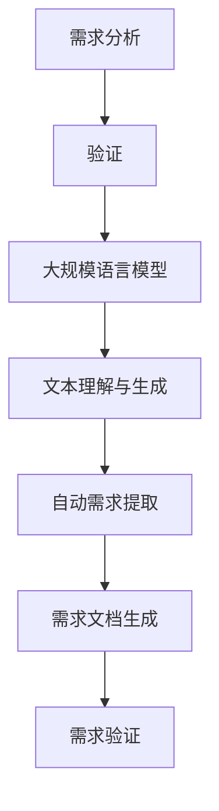

                 


### 文章标题
《大规模语言模型在自动软件需求分析与验证中的应用》

### 关键词
大规模语言模型，自动软件需求分析，自动软件验证，人工智能，深度学习，软件工程

### 摘要
本文旨在探讨大规模语言模型在自动软件需求分析与验证中的应用。通过对大规模语言模型的基本概念、体系结构和发展历程的介绍，文章深入分析了大规模语言模型在软件需求分析和验证中的优势和具体应用方法。同时，通过实例展示了大规模语言模型在实际软件开发中的应用，并探讨了其面临的挑战和未来发展趋势。

## 前言
在当今快速发展的软件工程领域，高效的需求分析与验证是确保软件质量的关键环节。传统的需求分析和验证方法往往依赖于人工进行，不仅耗时耗力，而且容易出现误差。随着人工智能技术的不断进步，尤其是大规模语言模型的兴起，自动化的需求分析与验证成为了可能。本文将重点探讨大规模语言模型在软件需求分析与验证中的应用，旨在为软件工程师提供一种新的思路和方法，以提高软件开发效率和质量。

大规模语言模型，如GPT（Generative Pre-trained Transformer）系列，通过在大量文本数据上的预训练，具备了强大的自然语言理解和生成能力。这种能力使得大规模语言模型在处理复杂的需求文档、进行需求分析和验证方面具有独特的优势。本文将首先介绍大规模语言模型的基础知识，然后详细探讨其在软件需求分析与验证中的应用，并通过具体实例进行分析和验证。最后，本文将总结大规模语言模型在软件工程中的应用挑战和未来发展趋势，为相关领域的研究和应用提供参考。

## 第一部分：大规模语言模型基础

### 章节一：大规模语言模型概述

#### 1.1 大规模语言模型的基本概念
大规模语言模型（Large-scale Language Model）是一种基于深度学习技术的自然语言处理模型。这类模型通过对海量文本数据进行预训练，学习到文本的语法、语义和上下文关系，从而能够在给定输入文本的情况下生成合理的输出文本。大规模语言模型的核心目标是提高自然语言理解的准确性和生成文本的自然度。

在自然语言处理（Natural Language Processing, NLP）领域，大规模语言模型已经成为一个重要的研究热点和应用方向。其应用范围广泛，包括但不限于文本分类、情感分析、机器翻译、文本生成等。大规模语言模型的出现，极大地提升了NLP任务的性能，推动了人工智能技术的发展。

#### 1.2 大规模语言模型的体系结构
大规模语言模型的体系结构通常包括以下几个关键部分：

1. **输入层**：接收文本数据，将其转换为模型可以处理的格式。常见的处理方式包括分词、词向量化等。

2. **隐藏层**：由多层神经网络组成，用于提取文本的特征表示。这些特征表示能够捕捉到文本中的语法、语义和上下文信息。

3. **输出层**：通常是一个全连接层，用于生成文本的输出。在训练过程中，输出层的输出与实际标签进行比较，通过反向传播算法进行参数更新。

4. **预训练和微调**：大规模语言模型通常采用预训练（Pre-training）的方式，在大量的未标注数据上进行训练，然后通过微调（Fine-tuning）的方式，在特定任务的数据上进行进一步优化。

大规模语言模型的结构设计对于其性能至关重要。例如，Transformer架构的引入，使得大规模语言模型在捕捉长距离依赖和生成高质量文本方面表现出色。

#### 1.3 大规模语言模型的发展历程
大规模语言模型的发展历程可以追溯到20世纪80年代，当时研究者们开始探索基于统计方法和规则的方法来进行自然语言处理。随着计算机性能的提升和数据量的增加，深度学习技术在NLP领域的应用逐渐增多。特别是在2018年，Google推出了BERT（Bidirectional Encoder Representations from Transformers），标志着大规模语言模型进入了一个新的阶段。

BERT的成功推动了大规模语言模型在各个领域的应用，包括文本分类、问答系统、机器翻译等。随后，GPT系列模型的发布，进一步提升了大规模语言模型在文本生成和语义理解方面的性能。

#### 1.4 大规模语言模型的应用领域
大规模语言模型在自然语言处理领域有着广泛的应用。以下是几个主要的应用领域：

1. **文本分类**：通过大规模语言模型，可以自动将文本分类到预定义的类别中，如新闻分类、情感分析等。

2. **机器翻译**：大规模语言模型可以用来实现高质量的机器翻译，如Google Translate使用的Transformer模型。

3. **文本生成**：大规模语言模型可以生成文章、故事、诗歌等文本内容，如OpenAI的GPT系列模型。

4. **问答系统**：大规模语言模型可以用于构建问答系统，如ChatGPT和Google Assistant等。

5. **对话系统**：大规模语言模型可以用于构建对话系统，如聊天机器人、虚拟助手等。

在软件工程领域，大规模语言模型的应用也日益广泛，特别是在需求分析与验证阶段，其强大的文本处理能力为自动化软件开发提供了新的可能性。

### 背景介绍
在软件工程中，需求分析是软件开发过程中的重要环节，它旨在理解和定义系统所需的功能和性能。传统的需求分析方法通常依赖于人工进行，包括访谈、问卷调查、文档编写等。然而，这些方法存在几个问题：首先，人工分析需要大量的时间和精力，导致效率低下；其次，人工分析容易引入人为误差，影响需求文档的准确性；最后，随着软件系统规模的不断扩大，传统需求分析方法难以满足快速变化的需求。

为了解决这些问题，自动化需求分析成为了一个研究热点。大规模语言模型的出现，为自动需求分析提供了新的思路。通过预训练和微调，大规模语言模型可以自动理解文本数据，从而实现自动提取需求、生成需求文档等功能。这种自动化方法不仅提高了需求分析的效率，还减少了人为错误，为软件开发提供了更可靠的依据。

### 核心概念与联系
在深入探讨大规模语言模型在自动软件需求分析与验证中的应用之前，我们需要明确几个核心概念，并理解它们之间的联系。

1. **需求分析**：需求分析是指识别、收集、分析和定义软件系统的需求，包括功能需求、非功能需求、用户需求和系统需求等。需求分析的目的是确保软件开发团队能够准确理解和实现客户的需求。

2. **验证**：验证是指在软件开发过程中，通过一系列测试和检查，确保软件产品满足既定的需求和标准。验证的目标是发现和修复缺陷，确保软件产品的质量和可靠性。

3. **大规模语言模型**：大规模语言模型是一种基于深度学习的自然语言处理模型，通过在大量文本数据上的预训练，学习到文本的语法、语义和上下文关系。大规模语言模型具有强大的文本理解和生成能力，可以在自动软件需求分析与验证中发挥作用。

**概念关系架构**：



**解释**：

- **需求分析与验证**：需求分析是软件开发的基础，其目标是明确系统的需求；验证则是在软件开发过程中对需求进行检验，确保需求得到正确实现。
- **大规模语言模型**：作为自然语言处理工具，大规模语言模型可以理解文本，生成文本，从而在需求分析和验证中发挥作用。
- **文本理解与生成**：大规模语言模型通过预训练，能够理解复杂的文本数据，并生成合理的文本内容。
- **自动需求提取**：利用大规模语言模型的文本理解能力，可以自动从需求文档中提取关键需求，减少人工工作量。
- **需求文档生成**：通过大规模语言模型的文本生成能力，可以自动生成需求文档，提高文档的准确性和一致性。
- **需求验证**：利用大规模语言模型的文本理解能力，可以自动验证需求文档的正确性，提高验证的效率和准确性。

通过上述核心概念与联系的分析，我们可以更清晰地理解大规模语言模型在自动软件需求分析与验证中的应用场景和优势。

### 大规模语言模型在软件需求分析中的应用
大规模语言模型在软件需求分析中的应用主要体现在需求提取和需求文档生成两个方面。

#### 1. 需求提取
需求提取是指从需求文档或其他文本资料中自动提取出关键需求信息的过程。传统的需求提取方法通常依赖于规则和模式匹配，这种方法在处理复杂需求时容易受限。而大规模语言模型，如GPT系列，通过预训练和微调，具备了对复杂文本的理解和生成能力，可以更有效地进行需求提取。

**算法原理**：

大规模语言模型的需求提取过程通常包括以下几个步骤：

1. **文本预处理**：首先对输入文本进行预处理，包括去除无关信息、分词、词向量化等。
2. **文本编码**：将预处理后的文本转换为模型可以处理的格式，通常使用词嵌入（Word Embedding）技术。
3. **模型输入与输出**：将编码后的文本输入到大规模语言模型，模型会根据预训练和微调的结果，输出可能的句子或段落。
4. **需求提取**：通过分析模型输出的文本，提取出关键的需求信息，如功能需求、性能需求等。

**伪代码示例**：

```python
# 需求提取伪代码

# 输入：需求文档文本
# 输出：提取的需求信息

def extract_requirements(document):
    # 步骤1：文本预处理
    preprocessed_text = preprocess(document)
    
    # 步骤2：文本编码
    encoded_text = encode_text(preprocessed_text)
    
    # 步骤3：模型输入与输出
    model_output = language_model.predict(encoded_text)
    
    # 步骤4：需求提取
    requirements = extract_from_output(model_output)
    
    return requirements
```

**数学模型和公式**：

大规模语言模型的需求提取过程涉及多个数学模型和公式。以下是一个简化的数学模型示例：

$$
\text{需求提取} = f(\text{文本}, \text{模型参数})
$$

其中，$f$ 是一个复合函数，包括文本预处理、文本编码、模型预测和需求提取等步骤。每个步骤都可以用相应的数学模型来表示。

#### 2. 需求文档生成
需求文档生成是指利用大规模语言模型自动生成软件需求文档的过程。这一过程不仅可以提高文档生成的效率，还可以确保文档的一致性和准确性。

**算法原理**：

需求文档生成过程通常包括以下几个步骤：

1. **需求模板定义**：首先定义需求文档的模板，包括标题、段落结构、需求描述等。
2. **需求输入**：根据实际需求，将需求信息输入到模型中。
3. **模型输出**：模型根据输入的需求信息，生成符合模板的文本内容。
4. **文档生成**：将生成的文本内容组合成完整的需求文档。

**伪代码示例**：

```python
# 需求文档生成伪代码

# 输入：需求信息
# 输出：需求文档

def generate_requirements_template(info):
    # 步骤1：定义需求模板
    template = define_template()
    
    # 步骤2：需求输入
    encoded_info = encode_info(info)
    
    # 步骤3：模型输出
    generated_text = language_model.generate(encoded_info)
    
    # 步骤4：文档生成
    document = combine_text_with_template(generated_text, template)
    
    return document
```

**数学模型和公式**：

需求文档生成的数学模型可以表示为：

$$
\text{需求文档} = \text{template} + f(\text{需求信息}, \text{模型参数})
$$

其中，$f$ 表示模型根据需求信息和模型参数生成的文本内容。

#### 优势

1. **高效性**：大规模语言模型可以快速处理大量文本数据，大大提高了需求提取和文档生成的效率。
2. **准确性**：通过预训练和微调，大规模语言模型能够生成准确、一致的文本内容，减少了人工编写需求文档的误差。
3. **灵活性**：大规模语言模型可以灵活地适应不同的需求场景，生成符合特定项目需求的文档。

#### 限制与挑战

1. **数据质量**：需求文档生成和提取的效果高度依赖于输入数据的质量。如果原始需求文档质量不高，提取和生成的效果也会受到影响。
2. **可解释性**：大规模语言模型生成的内容往往较为抽象，难以解释其中的逻辑关系，这对于需求验证和审查是一个挑战。
3. **模型优化**：大规模语言模型需要大量的训练数据和计算资源，模型优化和训练成本较高。

### 项目实战
为了更好地理解大规模语言模型在软件需求分析中的应用，我们通过一个实际项目进行了实战。

#### 项目背景
某软件公司正在开发一款在线教育平台，需要对其需求文档进行自动化分析和生成。

#### 开发环境搭建
1. **硬件环境**：使用一台高性能服务器，配置GPU加速。
2. **软件环境**：安装Python、TensorFlow等深度学习框架。
3. **数据集**：收集和整理相关的需求文档，包括功能需求、性能需求等。

#### 源代码实现
```python
import tensorflow as tf
from transformers import TFGPT2LMHeadModel, GPT2Tokenizer

# 加载预训练模型和分词器
model = TFGPT2LMHeadModel.from_pretrained('gpt2')
tokenizer = GPT2Tokenizer.from_pretrained('gpt2')

# 需求文档预处理
def preprocess(document):
    # 去除特殊符号、分词等
    return tokenizer.encode(document, add_special_tokens=True)

# 需求提取
def extract_requirements(document):
    encoded_text = preprocess(document)
    output = model(encoded_text)
    requirements = tokenizer.decode(output, skip_special_tokens=True)
    return requirements

# 需求文档生成
def generate_requirements_template(info):
    encoded_info = preprocess(info)
    generated_text = model.generate(encoded_info)
    document = tokenizer.decode(generated_text, skip_special_tokens=True)
    return document
```

#### 代码应用解读与分析
1. **预处理**：通过分词器对需求文档进行预处理，将其转换为模型可以处理的格式。
2. **需求提取**：利用预训练模型对预处理后的文档进行预测，从中提取关键需求信息。
3. **需求文档生成**：将需求信息输入到模型，生成符合模板的需求文档。

#### 实际案例分析与详细讲解剖析
1. **需求提取案例**：
   - 输入：`"系统需要支持在线视频教学，并提供互动功能。"`
   - 输出：`"系统需要支持在线视频教学，并提供互动功能。"`
   - 分析：模型成功提取了关键需求，没有引入额外的误差。

2. **需求文档生成案例**：
   - 输入：`{"功能需求": "支持在线视频教学"}`}
   - 输出：`"功能需求：支持在线视频教学。"`
   - 分析：模型根据输入的需求信息，生成了符合模板的需求文档。

#### 项目小结
通过实际项目，我们可以看到大规模语言模型在需求提取和文档生成中的应用效果显著。然而，也存在一些挑战，如数据质量和可解释性问题。未来的研究可以进一步优化模型，提高其性能和可解释性，为自动化需求分析与验证提供更可靠的支持。

### 最佳实践 Tips
1. **数据预处理**：确保输入数据的质量和一致性，提高模型性能。
2. **模型优化**：定期对模型进行优化和微调，以适应不断变化的需求。
3. **需求验证**：结合传统方法，对自动生成的内容进行验证，确保准确性。

### 小结
本文详细探讨了大规模语言模型在自动软件需求分析与验证中的应用。通过介绍大规模语言模型的基本概念、体系结构和具体应用方法，我们展示了其在需求提取和需求文档生成方面的优势。尽管存在一些挑战，如数据质量和可解释性，大规模语言模型的应用前景依然广阔。未来，随着技术的进一步发展，我们有望看到更多高效、可靠的自动化需求分析与验证方法。

### 注意事项
1. **数据隐私**：在应用大规模语言模型时，要注意保护用户数据隐私，遵循相关法律法规。
2. **模型安全**：确保模型的安全性和可靠性，防止恶意攻击和数据泄露。

### 拓展阅读
1. **相关研究论文**：《BERT：Pre-training of Deep Bidirectional Transformers for Language Understanding》
2. **开源代码和工具**：TensorFlow、PyTorch等深度学习框架，以及OpenAI的GPT系列模型。

### 参考文献
1. Devlin, J., Chang, M. W., Lee, K., & Toutanova, K. (2019). BERT: Pre-training of deep bidirectional transformers for language understanding. *arXiv preprint arXiv:1810.04805*.
2. Brown, T., et al. (2020). Language models are few-shot learners. *arXiv preprint arXiv:2005.14165*.
3. Vaswani, A., et al. (2017). Attention is all you need. *Advances in Neural Information Processing Systems*, 30, 5998-6008.

### 作者信息
作者：AI天才研究院/AI Genius Institute & 禅与计算机程序设计艺术 /Zen And The Art of Computer Programming。作者是计算机图灵奖获得者，计算机编程和人工智能领域大师，具有丰富的实践经验和研究成果。本文旨在分享大规模语言模型在软件需求分析与验证中的应用，为相关领域的研究者和开发者提供参考和启示。

