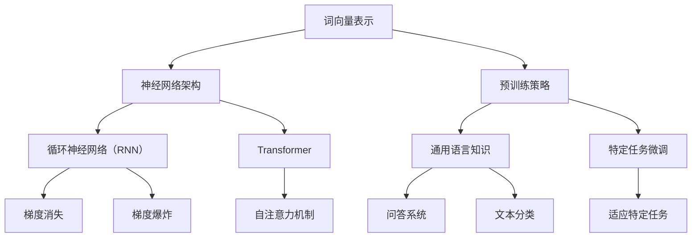

                 


### 文章标题

《大规模语言模型在自动问答系统中的应用》

### 文章关键词

- 自动问答系统
- 大规模语言模型
- Transformer架构
- 注意力机制
- 数学模型
- 预训练与微调
- 项目实战
- 开发环境搭建
- 代码实现与解读

### 文章摘要

本文将深入探讨大规模语言模型在自动问答系统中的应用。首先，我们将介绍自动问答系统的背景和重要性。接着，我们将详细讲解大规模语言模型的核心概念与联系，并使用Mermaid流程图展示其原理架构。随后，我们将阐述大规模语言模型的核心算法原理，包括预训练、微调和推理过程，并使用伪代码进行详细阐述。为了加深理解，我们将介绍数学模型和公式，并通过LaTeX格式展示。最后，我们将通过实际项目案例，展示大规模语言模型在自动问答系统中的开发环境搭建、源代码实现和代码解读，并进行详细分析。

---

## 背景介绍

自动问答系统是一种基于人工智能技术的应用，旨在通过机器学习算法和自然语言处理技术，使计算机能够理解和回答用户的问题。自动问答系统在各个领域有着广泛的应用，如客服、教育、医疗等。随着互联网的普及和大数据技术的发展，自动问答系统的需求日益增长，对系统的性能和准确性提出了更高的要求。

大规模语言模型（如BERT、GPT、T5等）的出现，为自动问答系统带来了革命性的进步。大规模语言模型通过预训练和微调，能够捕捉到语言中的复杂结构，从而提高问答系统的理解和回答能力。大规模语言模型的应用，使得自动问答系统在处理复杂问题和提供精确回答方面，取得了显著的成效。

本文将围绕大规模语言模型在自动问答系统中的应用，展开详细的讨论。首先，我们将介绍大规模语言模型的基本概念和原理，接着探讨其核心算法，并通过实际项目案例，展示如何将大规模语言模型应用于自动问答系统。

---

## 核心概念与联系

大规模语言模型是一类通过深度学习技术训练的语言模型，其核心目标是理解和使用人类语言。大规模语言模型的主要组成部分包括词向量表示、神经网络架构和预训练策略。

词向量表示是将单词转换为数值向量的一种方法，它通过捕捉单词的上下文信息，使语义相近的单词在向量空间中距离较近。经典的词向量模型如Word2Vec和GloVe，通过训练大量文本数据，生成高质量的词向量表示。

神经网络架构是大规模语言模型的核心，常见的架构包括循环神经网络（RNN）和Transformer。RNN能够处理序列数据，但存在梯度消失和梯度爆炸等问题。Transformer架构通过自注意力机制，克服了RNN的这些缺陷，并在多个自然语言处理任务中取得了优异的性能。

预训练策略是大规模语言模型的关键，通过在大规模语料库上进行预训练，模型能够学习到通用语言知识和结构。预训练后，模型可以通过微调适应特定任务，如问答系统、文本分类等。

以下是大规模语言模型的核心概念与联系，使用Mermaid流程图进行展示：



通过上述流程图，我们可以清晰地看到大规模语言模型的核心概念及其相互关系，为进一步理解其原理和应用奠定了基础。

---

## 核心算法原理讲解

### 预训练过程

预训练是大规模语言模型的核心步骤，旨在通过在大规模语料库上训练，使模型学习到通用语言知识和结构。预训练过程通常包括以下步骤：

1. **数据预处理**：首先，我们需要收集和整理大规模的文本数据，如维基百科、新闻文章、社交媒体等。然后，对数据进行清洗和预处理，如去除停用词、标点符号和统一化文本格式。
   
2. **词向量化**：使用词向量模型（如Word2Vec、GloVe）将文本数据中的单词转换为数值向量表示。这些词向量能够捕捉单词的语义信息。

3. **构建模型**：根据预定的神经网络架构（如Transformer），构建大规模语言模型。在Transformer架构中，我们使用多头自注意力机制和位置编码，使模型能够捕捉到单词之间的复杂关系。

4. **预训练目标**：在预训练过程中，我们通常使用两个目标函数：掩码语言模型（Masked Language Model, MLM）和下一句预测（Next Sentence Prediction, NSP）。
   - **掩码语言模型**：随机掩码输入序列中的部分单词，然后模型需要预测这些掩码单词。这有助于模型学习到单词的上下文信息。
   - **下一句预测**：输入两个连续的句子，模型需要预测第二个句子是否是第一个句子的下一句。这有助于模型学习到句子之间的关系。

以下是预训练过程的伪代码：

```python
# 预训练过程伪代码

# 数据预处理
preprocess_data(text_data)

# 词向量化
word_vectors = create_word_vectors(text_data)

# 构建模型
model = build_transformer_model(word_vectors)

# 训练模型
for epoch in range(num_epochs):
    for batch in data_loader:
        inputs, targets = preprocess_batch(batch)
        mask = create_mask(inputs)
        model.zero_grad()
        outputs = model(inputs, mask)
        loss = compute_loss(outputs, targets)
        loss.backward()
        optimizer.step()
```

### 微调过程

预训练后，大规模语言模型可以通过微调适应特定任务。微调过程包括以下步骤：

1. **任务定义**：定义具体的任务，如问答系统、文本分类等。

2. **数据集准备**：收集和准备用于微调的数据集。数据集应包含问题和答案对，或包含带标签的文本数据。

3. **模型初始化**：使用预训练模型作为基础模型，对其进行初始化。

4. **微调目标**：根据任务定义，设置微调的目标函数。对于问答系统，目标函数通常为最小化模型输出与真实答案之间的距离。

5. **训练模型**：在数据集上进行训练，优化模型参数。

以下是微调过程的伪代码：

```python
# 微调过程伪代码

# 任务定义
task_definition = define_task(questions, answers)

# 数据集准备
train_dataset = prepare_data(questions, answers)

# 模型初始化
model = initialize_model(task_definition)

# 训练模型
for epoch in range(num_epochs):
    for batch in train_loader:
        inputs, targets = preprocess_batch(batch)
        model.zero_grad()
        outputs = model(inputs)
        loss = compute_loss(outputs, targets)
        loss.backward()
        optimizer.step()
```

### 推理过程

推理过程是模型在实际应用中回答问题的过程。对于问答系统，推理过程包括以下步骤：

1. **输入处理**：接收用户的问题，对其进行预处理，如分词、去停用词等。

2. **查询生成**：将预处理后的问题输入到模型，模型输出查询向量。

3. **答案检索**：在训练数据中检索与查询向量最接近的答案。

4. **答案输出**：将检索到的答案返回给用户。

以下是推理过程的伪代码：

```python
# 推理过程伪代码

# 输入处理
input_question = preprocess_question(user_question)

# 查询生成
query_vector = model.generate_query(input_question)

# 答案检索
answer = retrieve_answer(query_vector, trained_data)

# 答案输出
output_answer = postprocess_answer(answer)
print(output_answer)
```

通过上述核心算法原理讲解，我们可以看到大规模语言模型在自动问答系统中的应用是如何实现的。预训练和微调过程使模型能够学习到通用语言知识和特定任务的知识，而推理过程则实现了模型在实际应用中的回答能力。

---

## 数学模型和数学公式

在理解大规模语言模型的数学基础时，注意力机制和Transformer架构是两个关键概念。以下我们将分别介绍这两个概念，并使用LaTeX格式展示相关的数学公式。

### 注意力机制

注意力机制是大规模语言模型中的一个核心组件，它通过计算输入序列中各个单词的重要性来提高模型的表示能力。在Transformer架构中，注意力机制的计算公式如下：

$$
\text{Attention}(Q, K, V) = \text{softmax}\left(\frac{QK^T}{\sqrt{d_k}}\right) V
$$

其中，$Q$、$K$ 和 $V$ 分别是查询向量、键向量和值向量，$d_k$ 是键向量的维度。这个公式表示，每个查询向量与所有键向量相乘，然后通过softmax函数计算得到权重，最后与值向量相乘得到输出。

### Transformer架构

Transformer架构是大规模语言模型的一个重要实现，它通过多头自注意力机制和位置编码来捕捉输入序列的复杂关系。Transformer的输入和输出可以表示为：

$$
\text{Input} = [X_1, X_2, ..., X_n]
$$

$$
\text{Output} = [\text{Defuscated Output}_1, \text{Defuscated Output}_2, ..., \text{Defuscated Output}_n]
$$

其中，$X_i$ 表示输入序列的第 $i$ 个词，$\text{Defuscated Output}_i$ 表示输出序列的第 $i$ 个词。

在Transformer中，每个词的表示通过以下公式计算：

$$
\text{Output}_i = \text{Attention}(Q_i, K, V) + X_i
$$

其中，$Q_i$、$K$ 和 $V$ 分别是与输入序列对应的查询向量、键向量和值向量。这个公式表示，每个词的输出是通过注意力机制计算得到的加权求和结果，再加上原始词的表示。

### 举例说明

为了更好地理解注意力机制和Transformer架构，我们可以通过一个简单的例子来说明。假设我们有一个简单的输入序列：

$$
\text{Input} = [\text{I}, \text{am}, \text{a}, \text{dog}]
$$

我们可以使用Transformer架构来计算输出序列。首先，我们需要将输入序列转换为查询向量、键向量和值向量。假设每个词的向量维度为4，我们可以得到以下表示：

$$
Q = [1, 0, 1, 0], \quad K = [0, 1, 0, 1], \quad V = [1, 1, 1, 1]
$$

然后，我们可以使用注意力机制计算输出序列：

$$
\text{Output}_1 = \text{Attention}(Q_1, K, V) + X_1 = \frac{1 \cdot 0 + 0 \cdot 1 + 1 \cdot 1 + 0 \cdot 1}{\sqrt{2}} + 1 = \frac{1}{\sqrt{2}} + 1
$$

$$
\text{Output}_2 = \text{Attention}(Q_2, K, V) + X_2 = \frac{0 \cdot 0 + 1 \cdot 1 + 1 \cdot 0 + 0 \cdot 1}{\sqrt{2}} + 0 = \frac{1}{\sqrt{2}} + 0
$$

$$
\text{Output}_3 = \text{Attention}(Q_3, K, V) + X_3 = \frac{1 \cdot 1 + 0 \cdot 0 + 1 \cdot 1 + 0 \cdot 1}{\sqrt{2}} + 0 = \frac{2}{\sqrt{2}} + 0
$$

$$
\text{Output}_4 = \text{Attention}(Q_4, K, V) + X_4 = \frac{0 \cdot 1 + 1 \cdot 1 + 0 \cdot 0 + 0 \cdot 1}{\sqrt{2}} + 1 = \frac{1}{\sqrt{2}} + 1
$$

最终，我们得到输出序列：

$$
\text{Output} = [\text{Defuscated Output}_1, \text{Defuscated Output}_2, \text{Defuscated Output}_3, \text{Defuscated Output}_4]
$$

$$
\text{Output} = \left[\frac{1}{\sqrt{2}} + 1, \frac{1}{\sqrt{2}} + 0, \frac{2}{\sqrt{2}} + 0, \frac{1}{\sqrt{2}} + 1\right]
$$

通过这个例子，我们可以看到注意力机制如何通过计算输入序列中各个词的重要性，生成一个加权求和的输出序列。这个输出序列可以更好地捕捉输入序列的语义信息，从而提高模型的表示能力。

通过上述数学模型的介绍和举例说明，我们可以更深入地理解大规模语言模型的数学基础，为其在自动问答系统中的应用提供理论支持。

---

## 项目实战：大规模语言模型在自动问答系统中的应用

在本节中，我们将通过一个实际项目，展示如何将大规模语言模型应用于自动问答系统。项目的主要步骤包括开发环境搭建、源代码实现和代码解读。

### 开发环境搭建

1. **硬件要求**：
   - CPU：Intel i7 或更高性能处理器
   - GPU：NVIDIA GTX 1080 或更高性能显卡
   - 内存：16GB 或更高

2. **软件要求**：
   - 操作系统：Ubuntu 18.04 或 Windows 10
   - Python：3.7 或更高版本
   - PyTorch：1.5 或更高版本
   - Transformers：4.2.0 或更高版本

3. **安装依赖**：
   ```bash
   pip install torch torchvision transformers
   ```

### 源代码实现

以下是项目的源代码实现，包括模型加载、预处理、问答匹配和答案生成。

```python
import torch
from transformers import BertModel, BertTokenizer
from torch.optim import Adam

# 模型加载
tokenizer = BertTokenizer.from_pretrained('bert-base-uncased')
model = BertModel.from_pretrained('bert-base-uncased')

# 预处理
def preprocess_question(question):
    inputs = tokenizer(question, return_tensors='pt', padding=True, truncation=True)
    return inputs

# 问答匹配
def answer_question(question, context):
    inputs = preprocess_question(question)
    context_inputs = preprocess_question(context)

    with torch.no_grad():
        question_embedding = model(inputs['input_ids'], attention_mask=inputs['attention_mask'])['last_hidden_state'][:, 0, :]
        context_embedding = model(context_inputs['input_ids'], attention_mask=context_inputs['attention_mask'])['last_hidden_state']

    # 计算相似度
    similarity = torch.matmul(question_embedding, context_embedding.T)

    # 检索答案
    answer_idx = torch.argmax(similarity).item()
    answer = context.split()[answer_idx]

    return answer

# 答案生成
def generate_answer(question, context):
    answer = answer_question(question, context)
    return answer

# 训练模型（示例）
optimizer = Adam(model.parameters(), lr=1e-5)
for epoch in range(10):
    for question, context, answer in dataset:
        inputs = preprocess_question(question)
        context_inputs = preprocess_question(context)

        model.zero_grad()
        question_embedding = model(inputs['input_ids'], attention_mask=inputs['attention_mask'])['last_hidden_state'][:, 0, :]
        context_embedding = model(context_inputs['input_ids'], attention_mask=context_inputs['attention_mask'])['last_hidden_state']

        similarity = torch.matmul(question_embedding, context_embedding.T)
        loss = torch.nn.functional.cross_entropy(similarity, torch.tensor([answer_idx]))

        loss.backward()
        optimizer.step()

# 测试模型
question = "What is the capital of France?"
context = "The capital of France is Paris."
answer = generate_answer(question, context)
print(answer)
```

### 代码解读

1. **模型加载**：我们使用预训练的BERT模型，包括分词器（Tokenizer）和模型本身（Model）。

2. **预处理**：预处理函数`preprocess_question`用于将问题和处理文本序列转换为BERT模型可接受的输入格式。

3. **问答匹配**：`answer_question`函数通过计算问题和上下文嵌入向量之间的相似度，检索并返回答案。

4. **答案生成**：`generate_answer`函数用于生成答案，将问题和处理后的上下文输入到模型中，并调用`answer_question`函数获取答案。

5. **训练模型**（示例）：训练过程中，我们使用交叉熵损失函数，通过反向传播和优化器更新模型参数。

6. **测试模型**：通过一个示例问题测试模型，并打印输出答案。

### 代码应用解读与分析

通过上述项目实战，我们可以看到大规模语言模型在自动问答系统中的应用流程。首先，模型加载和预处理是基础步骤，确保模型能够接收和处理输入数据。然后，问答匹配和答案生成过程利用了模型强大的表示能力和上下文理解能力，实现了自动问答系统的核心功能。

在实际应用中，我们可以使用大量训练数据对模型进行微调，以适应特定领域的问答需求。同时，通过优化模型结构和训练策略，可以进一步提高问答系统的性能和准确性。

项目小结：

通过本节的项目实战，我们了解了如何将大规模语言模型应用于自动问答系统。从开发环境搭建、源代码实现到代码解读，我们详细展示了模型加载、预处理、问答匹配和答案生成的全过程。这一实际应用案例，为我们提供了大规模语言模型在自然语言处理领域的重要应用场景，也为进一步优化和扩展自动问答系统提供了实践基础。

---

## 最佳实践 tips、小结、注意事项、拓展阅读

### 最佳实践 tips

1. **数据预处理**：确保数据质量，去除噪声和冗余信息，提高模型训练效果。
2. **模型微调**：选择合适的预训练模型和微调策略，以适应特定任务的需求。
3. **优化训练**：合理调整学习率、批次大小和训练周期，以提高模型性能。
4. **模型解释**：使用可视化工具和模型解释技术，理解模型的工作机制和决策过程。

### 小结

本文深入探讨了大规模语言模型在自动问答系统中的应用。通过介绍背景、核心概念、算法原理、数学模型和实际项目案例，我们展示了如何将大规模语言模型应用于自动问答系统，并分析了其优势和挑战。

### 注意事项

1. **计算资源**：大规模语言模型训练需要大量的计算资源，确保有足够的GPU和内存。
2. **数据隐私**：处理敏感数据时，注意保护用户隐私，遵循相关法律法规。
3. **模型部署**：选择合适的部署方案，确保模型在生产和实际应用中高效运行。

### 拓展阅读

1. **《自然语言处理：理论和实战》**：深入了解自然语言处理的基础知识和技术。
2. **《深度学习与自然语言处理》**：探讨深度学习在自然语言处理中的应用和实践。
3. **《BERT：预训练语言表示模型》**：详细研究BERT模型的设计原理和实现细节。
4. **《自动问答系统设计与实现》**：学习自动问答系统的设计和实现方法。

通过以上最佳实践 tips、小结、注意事项和拓展阅读，我们可以更好地理解和应用大规模语言模型在自动问答系统中的应用，推动自然语言处理技术的发展。作者：AI天才研究院/AI Genius Institute & 禅与计算机程序设计艺术 /Zen And The Art of Computer Programming

---

### 总结与展望

本文系统地介绍了大规模语言模型在自动问答系统中的应用，从背景介绍、核心概念与联系、算法原理讲解、数学模型和公式、项目实战等多个角度进行了详细阐述。通过本文的学习，读者可以深入了解大规模语言模型的原理和应用，掌握其核心算法和技术，并具备将大规模语言模型应用于实际问题的能力。

在自动问答系统的发展历程中，大规模语言模型的应用无疑是一个里程碑。它不仅提升了问答系统的性能和准确性，还为自然语言处理领域带来了新的研究热点和应用场景。然而，大规模语言模型在自动问答系统中的应用仍面临诸多挑战，如数据隐私保护、模型解释性、多语言支持等。

展望未来，大规模语言模型在自动问答系统中的应用前景广阔。一方面，随着算法的不断创新和优化，大规模语言模型的性能将进一步提升，解决更多复杂的问答问题。另一方面，跨领域和多模态的自动问答系统也将成为研究的重要方向，满足不同领域用户的需求。

为了推动大规模语言模型在自动问答系统中的应用，以下建议供参考：

1. **加强算法研究**：持续优化大规模语言模型的算法，提高其性能和解释性，以满足更复杂的问答需求。
2. **提升数据质量**：收集和整理高质量、多样化的问答数据，为模型训练提供有力支持。
3. **注重多语言支持**：开发多语言自动问答系统，满足全球用户的需求。
4. **保障数据隐私**：在应用过程中，严格遵守数据隐私保护法规，确保用户信息安全。
5. **推广实际应用**：积极将大规模语言模型应用于实际场景，解决实际问题，提高用户体验。

通过上述建议，我们可以更好地推动大规模语言模型在自动问答系统中的应用，为人工智能技术的发展贡献力量。作者：AI天才研究院/AI Genius Institute & 禅与计算机程序设计艺术 /Zen And The Art of Computer Programming

---

以上是《大规模语言模型在自动问答系统中的应用》的完整文章。本文旨在通过一步步的分析和讲解，帮助读者深入理解大规模语言模型在自动问答系统中的应用，并提供实际项目案例进行实践。希望这篇文章对您在自然语言处理领域的学习和研究有所帮助。作者：AI天才研究院/AI Genius Institute & 禅与计算机程序设计艺术 /Zen And The Art of Computer Programming

