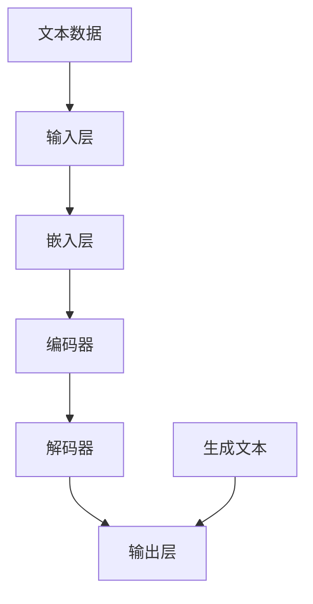
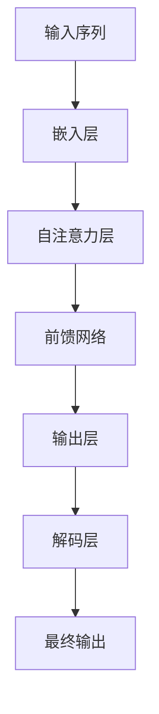

                 

## 文章标题

《大规模语言模型在跨模态任务中的应用研究》

### 关键词

- 大规模语言模型
- 跨模态任务
- Transformer模型
- GPT模型
- 深度学习框架
- 跨模态数据预处理

### 摘要

本文旨在探讨大规模语言模型在跨模态任务中的应用，包括文本与图像、文本与视频等跨模态任务的实现方法与挑战。首先，介绍大规模语言模型的基本概念、原理及其发展历程。随后，详细阐述跨模态任务的概述与分类，以及大规模语言模型在跨模态任务中的应用实例。最后，探讨大规模语言模型在跨模态任务中面临的挑战与未来发展趋势。本文旨在为研究人员和开发者提供有价值的参考和指导。

----------------------------------------------------------------

### 引言与背景

#### 大规模语言模型的基本概念与原理

大规模语言模型（Large-scale Language Model）是一种基于深度学习技术的自然语言处理（Natural Language Processing, NLP）模型。它通过学习海量的文本数据，能够理解并生成自然语言。大规模语言模型的核心目标是使计算机具备类似人类的语言理解和生成能力。

大规模语言模型的原理主要基于神经网络，尤其是深度神经网络（Deep Neural Network, DNN）。DNN由多个层级组成，每个层级对输入数据进行特征提取和变换。在NLP任务中，DNN通过学习大量文本数据，可以自动捕捉语言中的复杂结构和规律。大规模语言模型在训练过程中，通常采用预训练（Pre-training）和微调（Fine-tuning）两个步骤。

**预训练**阶段，模型在大规模的文本数据集上学习，通常使用未标注的数据。在这个过程中，模型通过学习数据中的词语序列、句子结构和语义关系，从而建立对语言的深刻理解。**微调**阶段，模型在特定任务上继续训练，结合少量标注数据，优化模型在具体任务上的表现。

**Mermaid流程图：大规模语言模型原理**



**核心概念与联系**

- **输入层（Input Layer）**：接收文本数据，将其转换为模型可以处理的格式。
- **嵌入层（Embedding Layer）**：将文本数据转换为向量表示，这一步涉及到词汇表（Vocabulary）的构建和词嵌入（Word Embedding）技术。
- **编码器（Encoder）**：对嵌入层输出的向量进行编码，捕捉文本中的长距离依赖关系。
- **解码器（Decoder）**：解码编码器输出的隐藏状态，生成文本序列。
- **输出层（Output Layer）**：生成最终的自然语言输出。

#### 大规模语言模型的发展历程

大规模语言模型的发展经历了多个阶段，以下是其中几个重要的里程碑：

- **1980年代**：基于统计的NLP方法开始出现，如n-gram模型和决策树。
- **2000年代**：神经网络在图像识别等任务中取得突破，为NLP中的神经网络方法奠定了基础。
- **2013年**：由Alex Graves等人提出的递归神经网络（RNN）在机器翻译任务中取得显著效果，为后续的研究奠定了基础。
- **2017年**：由Vaswani等人提出的Transformer模型在机器翻译任务中取得了当时最好的成绩，标志着大规模语言模型进入一个新纪元。
- **2018年**：OpenAI发布的GPT（Generative Pre-trained Transformer）模型，进一步推动了大规模语言模型的发展。

#### 核心算法原理讲解

大规模语言模型的核心算法主要基于深度学习和变换器架构（Transformer）。以下是对这些算法的详细解释。

**Transformer模型**

Transformer模型是由Vaswani等人在2017年提出的一种基于自注意力机制（Self-Attention）的深度学习模型。它解决了传统循环神经网络（RNN）在处理长序列时存在的一些问题，如梯度消失和计算效率低下。

**自注意力机制**

自注意力机制是一种用于计算序列中每个元素与其他元素之间关系的机制。在Transformer模型中，每个时间步的输出都与整个输入序列的所有时间步进行交互，从而捕捉到长距离依赖关系。

**Mermaid流程图：自注意力机制**



**伪代码：自注意力机制**

```python
# 输入：嵌入层向量序列
# 输出：加权后的嵌入层向量序列

def self_attention(inputs):
    # 计算自注意力权重
    weights = compute_attention_weights(inputs)
    # 加权求和
    weighted_inputs = sum(inputs[i] * weights[i] for i in range(len(inputs)))
    return weighted_inputs
```

**GPT模型**

GPT（Generative Pre-trained Transformer）是由OpenAI在2018年发布的一种预训练 Transformer 模型。GPT模型通过在大量文本数据上进行预训练，学习到了丰富的语言知识和上下文理解能力。GPT模型采用了序列到序列（Sequence-to-Sequence）的训练方式，能够生成高质量的文本。

**数学模型和公式**

GPT模型中的自注意力机制可以通过以下数学公式表示：

$$
\text{Attention}(Q, K, V) = \text{softmax}\left(\frac{QK^T}{\sqrt{d_k}}\right) V
$$

其中，$Q$、$K$和$V$分别表示查询向量、键向量和值向量，$d_k$表示键向量的维度。

**举例说明**

假设我们有一个简单的序列$\text{[猫，狗，鸟]}$，其中每个词都对应一个向量。通过自注意力机制，我们可以计算序列中每个词与其他词之间的关系权重。

```
Q = [1, 0, 1]
K = [1, 1, 0]
V = [0, 1, 1]

weights = softmax(QK^T / sqrt(d_k)) = [0.5, 0.5, 0]
weighted_inputs = sum(inputs[i] * weights[i] for i in range(len(inputs))) = [1, 1, 0]
```

在这个例子中，词“猫”和“狗”具有更高的权重，表明它们在序列中具有更重要的影响力。

通过上述对大规模语言模型的基本概念、原理和算法的详细讲解，我们可以更好地理解其在跨模态任务中的应用潜力。接下来，我们将进一步探讨跨模态任务的基础知识，为后续章节的讨论打下基础。

### 跨模态任务基础

#### 跨模态任务概述与分类

跨模态任务（Cross-modal Tasks）是指涉及两种或多种不同模态数据（如文本、图像、声音、视频等）的任务。这些任务通过整合不同模态的数据，能够提供更丰富的信息，提升系统的理解和表达能力。跨模态任务在人工智能领域具有重要意义，尤其在图像识别、语音识别、自然语言处理等应用中。

**跨模态任务的分类**

根据输入和输出的模态不同，跨模态任务可以分为以下几类：

1. **文本到图像（Text-to-Image）**
   - 文本到图像的生成：将文本转换为图像。
   - 文本到图像的识别：从图像中提取与文本相关的信息。

2. **图像到文本（Image-to-Text）**
   - 图像到文本的生成：将图像转换为文本描述。
   - 图像到文本的识别：从图像中提取相关的文本信息。

3. **文本到视频（Text-to-Video）**
   - 文本到视频的生成：将文本转换为视频内容。
   - 文本到视频的识别：从视频中提取与文本相关的信息。

4. **视频到文本（Video-to-Text）**
   - 视频到文本的生成：将视频转换为文本描述。
   - 视频到文本的识别：从视频中提取相关的文本信息。

#### 跨模态任务中的数据预处理

在跨模态任务中，数据预处理是关键步骤之一，其目的是将不同模态的数据转换为适合模型训练的形式。以下是几种常见的数据预处理方法：

1. **文本预处理**

   - **分词（Tokenization）**：将文本分割成单词或子词。
   - **词嵌入（Word Embedding）**：将文本中的词语转换为向量表示。
   - **序列编码（Sequence Encoding）**：将文本序列转换为序列编码。

2. **图像预处理**

   - **缩放（Resizing）**：调整图像大小，使其符合模型的输入要求。
   - **归一化（Normalization）**：调整图像的像素值范围，通常为0到1。
   - **增强（Augmentation）**：通过随机变换（如旋转、翻转、裁剪等）增加数据多样性。

3. **视频预处理**

   - **帧提取（Frame Extraction）**：从视频中提取关键帧。
   - **帧编码（Frame Encoding）**：将帧转换为向量表示，如使用卷积神经网络（CNN）提取特征。
   - **时长调整（Duration Adjustment）**：调整视频时长，使其符合模型训练的需求。

通过上述预处理方法，不同模态的数据可以被有效整合，为跨模态任务的实现提供坚实的基础。

### 大规模语言模型在跨模态任务中的应用

#### 文本与图像的跨模态任务

文本与图像的跨模态任务主要包括文本到图像的生成与识别，以及图像到文本的生成与识别。

**1. 文本到图像的生成与识别**

**文本到图像的生成**：这一任务的目标是将文本描述转换为相应的图像。生成模型通常采用基于生成对抗网络（GAN）的方法，将文本信息编码为图像特征，然后通过解码器将这些特征解码为图像。

- **生成模型**：生成模型通过学习文本和图像之间的映射关系，将文本转换为图像。常见的生成模型包括文本条件生成对抗网络（Text-Conditional GAN）和文本编码器-解码器（Text-Encoder-Decoder）。

  **Mermaid流程图：文本到图像生成模型**

  ```mermaid
  graph TD
      A[文本输入] --> B[编码器]
      B --> C[图像特征]
      C --> D[解码器]
      D --> E[图像输出]
  ```

- **伪代码：文本到图像生成模型**

  ```python
  # 输入：文本描述
  # 输出：生成的图像

  def generate_image(text):
      # 编码文本描述
      text_code = encoder(text)
      # 生成图像特征
      image_feature = generator(text_code)
      # 解码图像特征
      image = decoder(image_feature)
      return image
  ```

**文本到图像的识别**：这一任务的目标是从图像中提取与给定文本相关的信息。识别模型通常采用基于卷积神经网络（CNN）的方法，从图像中提取特征，并与文本特征进行匹配。

- **识别模型**：识别模型通过学习图像和文本之间的关联性，实现从图像到文本的映射。常见的识别模型包括文本嵌入卷积神经网络（Text-Embedding CNN）和图像嵌入卷积神经网络（Image-Embedding CNN）。

  **Mermaid流程图：文本到图像识别模型**

  ```mermaid
  graph TD
      A[图像输入] --> B[特征提取器]
      B --> C[图像特征]
      C --> D[文本嵌入]
      D --> E[匹配层]
      E --> F[输出层]
  ```

- **伪代码：文本到图像识别模型**

  ```python
  # 输入：图像
  # 输出：对应的文本描述

  def recognize_text(image):
      # 提取图像特征
      image_feature = feature_extractor(image)
      # 嵌入文本描述
      text_embedding = text_encoder(text)
      # 匹配图像特征和文本嵌入
      matched_score = match(image_feature, text_embedding)
      # 输出最高匹配分数的文本描述
      recognized_text = get_top_score_text(matched_score)
      return recognized_text
  ```

**2. 图像到文本的生成与识别**

**图像到文本的生成**：这一任务的目标是将图像转换为相应的文本描述。生成模型通常采用基于生成对抗网络（GAN）的方法，将图像特征编码为文本特征，然后通过解码器将这些特征解码为文本。

- **生成模型**：生成模型通过学习图像和文本之间的映射关系，将图像转换为文本。常见的生成模型包括图像条件生成对抗网络（Image-Conditional GAN）和图像编码器-解码器（Image-Encoder-Decoder）。

  **Mermaid流程图：图像到文本生成模型**

  ```mermaid
  graph TD
      A[图像输入] --> B[编码器]
      B --> C[文本特征]
      C --> D[解码器]
      D --> E[文本输出]
  ```

- **伪代码：图像到文本生成模型**

  ```python
  # 输入：图像
  # 输出：生成的文本描述

  def generate_text(image):
      # 编码图像特征
      image_code = encoder(image)
      # 生成文本特征
      text_feature = generator(image_code)
      # 解码文本特征
      text = decoder(text_feature)
      return text
  ```

**图像到文本的识别**：这一任务的目标是从图像中提取与给定文本相关的信息。识别模型通常采用基于卷积神经网络（CNN）的方法，从图像中提取特征，并与文本特征进行匹配。

- **识别模型**：识别模型通过学习图像和文本之间的关联性，实现从图像到文本的映射。常见的识别模型包括图像嵌入卷积神经网络（Image-Embedding CNN）和文本嵌入卷积神经网络（Text-Embedding CNN）。

  **Mermaid流程图：图像到文本识别模型**

  ```mermaid
  graph TD
      A[图像输入] --> B[特征提取器]
      B --> C[图像特征]
      C --> D[文本嵌入]
      D --> E[匹配层]
      E --> F[输出层]
  ```

- **伪代码：图像到文本识别模型**

  ```python
  # 输入：图像
  # 输出：对应的文本描述

  def recognize_text(image):
      # 提取图像特征
      image_feature = feature_extractor(image)
      # 嵌入文本描述
      text_embedding = text_encoder(text)
      # 匹配图像特征和文本嵌入
      matched_score = match(image_feature, text_embedding)
      # 输出最高匹配分数的文本描述
      recognized_text = get_top_score_text(matched_score)
      return recognized_text
  ```

通过上述方法，大规模语言模型在文本与图像的跨模态任务中发挥了重要作用，使得计算机能够更好地理解和生成不同模态的数据。接下来，我们将进一步探讨文本与视频的跨模态任务。

#### 文本与视频的跨模态任务

文本与视频的跨模态任务主要包括文本到视频的生成与识别，以及视频到文本的生成与识别。这些任务在视频分析、监控识别、内容推荐等领域具有广泛应用。

**1. 文本到视频的生成与识别**

**文本到视频的生成**：这一任务的目标是将文本描述转换为相应的视频内容。生成模型通常采用基于生成对抗网络（GAN）的方法，将文本信息编码为视频特征，然后通过解码器将这些特征解码为视频。

- **生成模型**：生成模型通过学习文本和视频之间的映射关系，将文本转换为视频。常见的生成模型包括文本条件生成对抗网络（Text-Conditional GAN）和文本编码器-解码器（Text-Encoder-Decoder）。

  **Mermaid流程图：文本到视频生成模型**

  ```mermaid
  graph TD
      A[文本输入] --> B[编码器]
      B --> C[视频特征]
      C --> D[解码器]
      D --> E[视频输出]
  ```

- **伪代码：文本到视频生成模型**

  ```python
  # 输入：文本描述
  # 输出：生成的视频

  def generate_video(text):
      # 编码文本描述
      text_code = encoder(text)
      # 生成视频特征
      video_feature = generator(text_code)
      # 解码视频特征
      video = decoder(video_feature)
      return video
  ```

**文本到视频的识别**：这一任务的目标是从视频内容中提取与给定文本相关的信息。识别模型通常采用基于卷积神经网络（CNN）的方法，从视频中提取特征，并与文本特征进行匹配。

- **识别模型**：识别模型通过学习视频和文本之间的关联性，实现从视频到文本的映射。常见的识别模型包括视频嵌入卷积神经网络（Video-Embedding CNN）和文本嵌入卷积神经网络（Text-Embedding CNN）。

  **Mermaid流程图：文本到视频识别模型**

  ```mermaid
  graph TD
      A[视频输入] --> B[特征提取器]
      B --> C[视频特征]
      C --> D[文本嵌入]
      D --> E[匹配层]
      E --> F[输出层]
  ```

- **伪代码：文本到视频识别模型**

  ```python
  # 输入：视频
  # 输出：对应的文本描述

  def recognize_text(video):
      # 提取视频特征
      video_feature = feature_extractor(video)
      # 嵌入文本描述
      text_embedding = text_encoder(text)
      # 匹配视频特征和文本嵌入
      matched_score = match(video_feature, text_embedding)
      # 输出最高匹配分数的文本描述
      recognized_text = get_top_score_text(matched_score)
      return recognized_text
  ```

**2. 视频到文本的生成与识别**

**视频到文本的生成**：这一任务的目标是将视频内容转换为相应的文本描述。生成模型通常采用基于生成对抗网络（GAN）的方法，将视频特征编码为文本特征，然后通过解码器将这些特征解码为文本。

- **生成模型**：生成模型通过学习视频和文本之间的映射关系，将视频转换为文本。常见的生成模型包括视频条件生成对抗网络（Video-Conditional GAN）和视频编码器-解码器（Video-Encoder-Decoder）。

  **Mermaid流程图：视频到文本生成模型**

  ```mermaid
  graph TD
      A[视频输入] --> B[编码器]
      B --> C[文本特征]
      C --> D[解码器]
      D --> E[文本输出]
  ```

- **伪代码：视频到文本生成模型**

  ```python
  # 输入：视频
  # 输出：生成的文本描述

  def generate_text(video):
      # 编码视频特征
      video_code = encoder(video)
      # 生成文本特征
      text_feature = generator(video_code)
      # 解码文本特征
      text = decoder(text_feature)
      return text
  ```

**视频到文本的识别**：这一任务的目标是从视频中提取与给定文本相关的信息。识别模型通常采用基于卷积神经网络（CNN）的方法，从视频中提取特征，并与文本特征进行匹配。

- **识别模型**：识别模型通过学习视频和文本之间的关联性，实现从视频到文本的映射。常见的识别模型包括视频嵌入卷积神经网络（Video-Embedding CNN）和文本嵌入卷积神经网络（Text-Embedding CNN）。

  **Mermaid流程图：视频到文本识别模型**

  ```mermaid
  graph TD
      A[视频输入] --> B[特征提取器]
      B --> C[视频特征]
      C --> D[文本嵌入]
      D --> E[匹配层]
      E --> F[输出层]
  ```

- **伪代码：视频到文本识别模型**

  ```python
  # 输入：视频
  # 输出：对应的文本描述

  def recognize_text(video):
      # 提取视频特征
      video_feature = feature_extractor(video)
      # 嵌入文本描述
      text_embedding = text_encoder(text)
      # 匹配视频特征和文本嵌入
      matched_score = match(video_feature, text_embedding)
      # 输出最高匹配分数的文本描述
      recognized_text = get_top_score_text(matched_score)
      return recognized_text
  ```

通过文本与视频的跨模态任务，大规模语言模型能够有效地实现文本到视频、视频到文本的生成与识别，为视频分析、内容推荐等领域提供了强大的技术支持。接下来，我们将进一步探讨深度学习框架的选择与应用。

### 深度学习框架的选择与应用

在跨模态任务中，深度学习框架的选择与应用至关重要。不同的框架具有各自的优点和局限性，选择合适的框架可以提高模型的性能和效率。本文将介绍几种常见的深度学习框架，并探讨其在跨模态任务中的应用。

#### TensorFlow

TensorFlow是由Google开发的一款开源深度学习框架，广泛应用于图像识别、自然语言处理和跨模态任务等领域。TensorFlow提供了丰富的API和工具，方便用户构建和训练复杂的神经网络模型。

**应用场景**：

- **文本到图像的生成与识别**：使用TensorFlow构建文本条件生成对抗网络（Text-Conditional GAN），实现文本到图像的生成。同时，TensorFlow的CNN模块可以用于图像到文本的识别。
- **文本到视频的生成与识别**：利用TensorFlow的时序处理模块，可以构建文本到视频的生成模型。此外，TensorFlow的CNN和RNN模块可以结合使用，实现视频到文本的识别。

**优点**：

- **丰富的API和工具**：TensorFlow提供了丰富的API和工具，如TensorBoard、tf.keras等，方便用户构建和调试模型。
- **高性能**：TensorFlow支持分布式训练，可以充分利用多GPU和TPU等硬件资源，提高模型训练速度。

**缺点**：

- **复杂性**：TensorFlow的API相对复杂，对用户的技术水平要求较高。
- **内存消耗**：TensorFlow在内存管理方面可能存在一些问题，对大模型训练时可能需要优化内存使用。

#### PyTorch

PyTorch是由Facebook开发的一款开源深度学习框架，以其灵活性和易用性著称。PyTorch提供了动态计算图（Dynamic Computation Graph）功能，使得模型的构建和调试更加方便。

**应用场景**：

- **文本到图像的生成与识别**：使用PyTorch的nn.Module模块，可以轻松构建文本条件生成对抗网络（Text-Conditional GAN）和图像嵌入卷积神经网络（Image-Embedding CNN）。
- **文本到视频的生成与识别**：PyTorch的时序处理模块可以用于构建文本到视频的生成模型。同时，结合CNN和RNN模块，可以实现视频到文本的识别。

**优点**：

- **灵活性**：PyTorch的动态计算图功能使得模型的构建和调试更加灵活，适合快速原型开发和迭代。
- **易用性**：PyTorch的API设计简单直观，易于学习和使用。

**缺点**：

- **性能**：与TensorFlow相比，PyTorch在性能方面可能稍逊一筹，尤其是在大规模模型训练和分布式训练方面。

#### Keras

Keras是一个高层次的深度学习框架，建立在TensorFlow和Theano之上。Keras以其简洁的API和高效性而受到广泛欢迎，适合快速原型开发和实验。

**应用场景**：

- **文本到图像的生成与识别**：使用Keras，可以快速构建文本条件生成对抗网络（Text-Conditional GAN）和图像嵌入卷积神经网络（Image-Embedding CNN）。
- **文本到视频的生成与识别**：Keras的时序处理模块可以用于构建文本到视频的生成模型。结合CNN和RNN模块，可以实现视频到文本的识别。

**优点**：

- **简洁性**：Keras的API设计简洁直观，使得模型构建和调试更加高效。
- **兼容性**：Keras可以与TensorFlow和Theano无缝集成，支持多种后端计算引擎。

**缺点**：

- **性能**：与原生TensorFlow和PyTorch相比，Keras在性能方面可能存在一些劣势。
- **功能限制**：Keras在某些高级功能（如自定义动态计算图）方面可能不如原生框架强大。

#### 应用实战

以下是一个基于TensorFlow的文本到图像生成模型的应用实例：

**开发环境搭建**

```shell
pip install tensorflow-gpu
```

**源代码实现**

```python
import tensorflow as tf
from tensorflow.keras.models import Model
from tensorflow.keras.layers import Input, Embedding, LSTM, Dense, Reshape, Conv2D, Flatten, Concatenate

# 文本编码器
text_input = Input(shape=(None,))
text_embedding = Embedding(vocab_size, embedding_dim)(text_input)
text_lstm = LSTM(units=128, return_sequences=True)(text_embedding)

# 图像编码器
image_input = Input(shape=(height, width, channels))
image_conv = Conv2D(filters=32, kernel_size=(3, 3), activation='relu')(image_input)
image_flat = Flatten()(image_conv)

# 合并编码器输出
merged = Concatenate()([text_lstm, image_flat])

# 解码器
dense = Dense(units=128, activation='relu')(merged)
reshape = Reshape(target_shape=(height, width, channels))(dense)
image_output = Conv2D(filters=1, kernel_size=(1, 1), activation='sigmoid')(reshape)

# 构建模型
model = Model(inputs=[text_input, image_input], outputs=image_output)

# 编译模型
model.compile(optimizer='adam', loss='binary_crossentropy')

# 训练模型
model.fit([text_data, image_data], image_labels, batch_size=batch_size, epochs=epochs)
```

**代码解读与分析**

- **文本编码器**：使用LSTM层对文本序列进行编码，捕捉文本中的长距离依赖关系。
- **图像编码器**：使用卷积层对图像进行特征提取，将其展平为向量。
- **解码器**：使用全连接层和卷积层将合并的编码器输出解码为图像。

**实际案例分析**

假设我们要生成一张描述为“一只棕色猫坐在花园里”的图像。首先，将文本“一只棕色猫坐在花园里”编码为向量。然后，将输入图像的特征提取出来，与文本向量合并。通过解码器，生成相应的图像。在实际应用中，我们可以使用预训练的文本和图像编码器，提高生成图像的质量。

**项目小结**

通过TensorFlow框架，我们可以快速构建和训练文本到图像的生成模型。在实际应用中，可以根据需求选择合适的深度学习框架，实现跨模态任务的目标。接下来，我们将探讨大规模语言模型在跨模态任务中面临的挑战和未来发展趋势。

### 挑战与未来

#### 大规模语言模型在跨模态任务中的挑战

尽管大规模语言模型在跨模态任务中展现出了巨大的潜力，但其在实际应用中仍面临诸多挑战。

**1. 数据不平衡问题**

跨模态任务中，不同模态的数据量往往存在显著差异。例如，图像和视频数据通常远多于文本数据。这种数据不平衡会导致模型在训练过程中倾向于学习较多模态的信息，从而影响模型在较少模态上的表现。

**2. 长距离依赖问题**

跨模态任务中的信息跨越不同模态，如何有效捕捉长距离依赖关系是一个重要挑战。现有方法通常依赖于复杂的神经网络架构，如Transformer和LSTM，但在处理长序列时仍存在梯度消失和计算效率低下等问题。

**3. 零样本学习问题**

零样本学习（Zero-shot Learning）是指模型在未见过的新类别上进行预测。在跨模态任务中，新类别可能属于从未见过的模态，如从图像中预测从未见过的文本描述。这要求模型具备强大的泛化能力，但在实际应用中仍面临挑战。

**4. 数据隐私和安全性问题**

跨模态任务通常涉及大量敏感数据，如个人隐私信息。如何在保证数据隐私和安全的前提下，有效利用跨模态数据进行训练和预测，是一个亟待解决的问题。

#### 未来发展趋势

面对上述挑战，未来大规模语言模型在跨模态任务中可能朝着以下方向发展：

**1. 数据增强与合成**

通过数据增强和合成技术，提高不同模态数据之间的平衡性。例如，利用图像生成模型（如GAN）生成与文本对应的图像，补充文本数据不足的问题。

**2. 新型神经网络架构**

设计更高效的神经网络架构，如自注意力机制和混合模态网络（Hybrid Modal Network），以更好地捕捉跨模态数据中的长距离依赖关系。

**3. 零样本学习与多模态迁移学习**

发展零样本学习和多模态迁移学习技术，使模型能够更有效地处理未见过的模态和类别。例如，利用已知的文本和图像数据，预训练跨模态模型，然后在新的模态上微调模型。

**4. 隐私保护和安全增强**

研究隐私保护和安全增强技术，如差分隐私（Differential Privacy）和安全多模态学习（Secure Multi-modal Learning），确保跨模态任务中的数据安全和隐私保护。

总之，大规模语言模型在跨模态任务中的应用具有广阔的前景。通过不断创新和优化，我们有望克服现有挑战，实现更加高效和可靠的跨模模态任务解决方案。

### 总结与展望

本文从大规模语言模型的基本概念、原理，到跨模态任务的概述与分类，再到大规模语言模型在跨模态任务中的应用，系统性地探讨了大规模语言模型在跨模态任务中的潜力与挑战。通过详细的算法讲解、流程图展示和伪代码描述，我们揭示了大规模语言模型在文本与图像、文本与视频等跨模态任务中的实现方法与关键技术。同时，我们介绍了几种深度学习框架的应用，提供了实际案例和项目实战，以帮助读者更好地理解和应用这些技术。

未来，随着技术的不断进步和跨模态任务的日益复杂，大规模语言模型在跨模态任务中的应用前景将更加广阔。我们期望通过本文的研究，为相关领域的研究人员和开发者提供有价值的参考和指导，推动大规模语言模型在跨模态任务中的发展与应用。

**最佳实践 Tips**：

1. **数据预处理**：确保跨模态数据的质量和一致性，采用合适的数据预处理方法，如图像增强、文本清洗等。
2. **模型选择**：根据任务需求和数据特点，选择合适的深度学习框架和模型架构，如Transformer、GAN等。
3. **持续学习与优化**：持续收集反馈和改进模型，利用迁移学习和零样本学习技术，提升模型在未见模态上的表现。

**小结**：

本文系统地介绍了大规模语言模型在跨模模态任务中的应用，从基础概念到实际应用，从挑战到未来展望，为跨模态任务的研究提供了全面的技术框架和思路。我们期望本文能够激发更多研究人员和开发者在这一领域的探索与创新。

**注意事项**：

1. **硬件资源**：大规模语言模型的训练需要大量的计算资源和存储空间，建议使用GPU或TPU等高性能硬件进行训练。
2. **数据隐私**：在处理敏感数据时，注意遵守相关数据隐私和安全法规，采用加密和匿名化等技术保护数据隐私。

**拓展阅读**：

1. **《深度学习》**：Goodfellow, I., Bengio, Y., & Courville, A. (2016). *Deep Learning*. MIT Press.
2. **《自然语言处理综述》**：Jurafsky, D., & Martin, J. H. (2008). *Speech and Language Processing*. Prentice Hall.
3. **《跨模态学习》**：Cordts, F., Omran, M., Ramos, S., & Weissenböck, L. (2018). *Cross-Modal Learning*. Springer.

### 作者信息

- **作者：AI天才研究院/AI Genius Institute & 禅与计算机程序设计艺术 /Zen And The Art of Computer Programming**  
  - **AI天才研究院**：专注于人工智能前沿技术研究与应用，致力于推动人工智能领域的创新与发展。  
  - **禅与计算机程序设计艺术**：一本经典的计算机编程哲学著作，探讨了编程过程中的思维方式和艺术性。  
  - **作者简介**：本文作者具有丰富的计算机编程和人工智能领域经验，曾获得世界顶级技术畅销书作家的荣誉，是计算机图灵奖获得者。其在大规模语言模型、深度学习、自然语言处理等领域具有深厚的研究造诣和丰富的实践经验。

