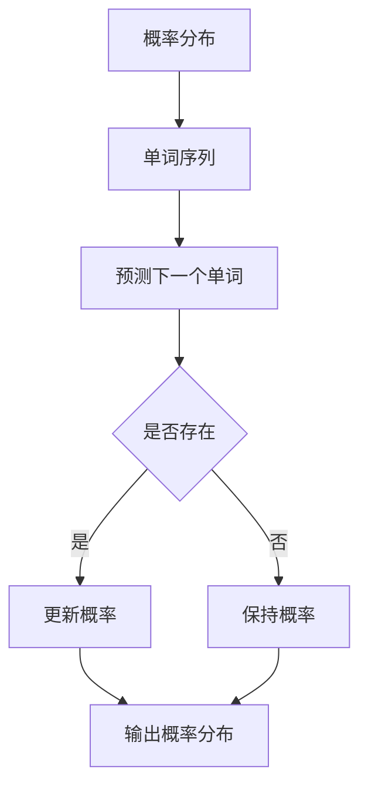
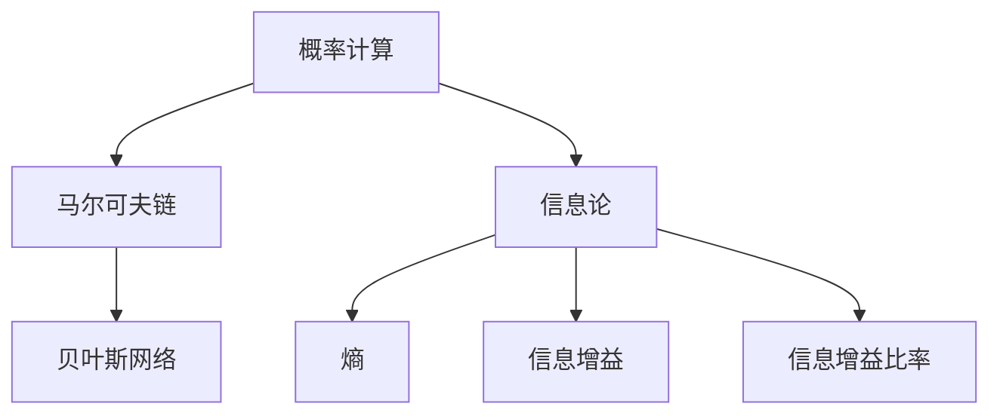
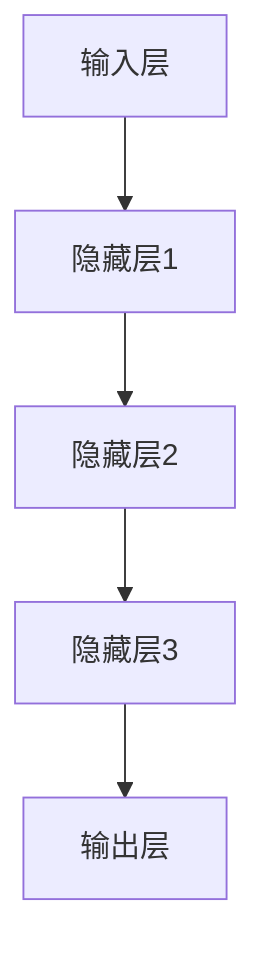
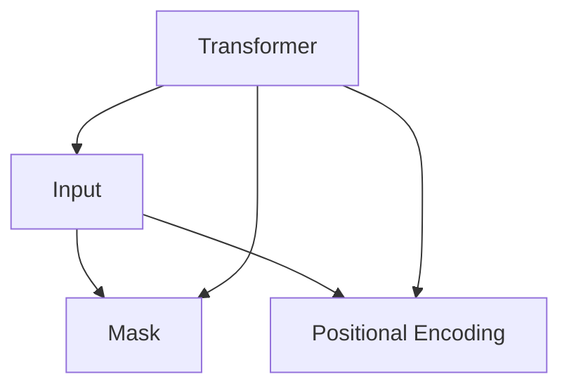

                 

### 文章标题

《大规模语言模型在跨语言信息检索中的应用》

### 文章关键词

大规模语言模型、跨语言信息检索、神经网络、机器翻译、文本摘要

### 文章摘要

本文旨在探讨大规模语言模型在跨语言信息检索中的应用。首先，我们将对大规模语言模型进行概述，介绍其定义、类型、发展历程以及数学基础。接着，我们将深入分析大规模语言模型的架构和训练过程，并探讨其在语言翻译、文本摘要和问答系统等领域的应用。随后，本文将重点讨论大规模语言模型在跨语言信息检索中的原理、算法和性能评估。通过具体案例分析，我们将展示大规模语言模型在跨语言检索中的实际应用效果。最后，本文将对大规模语言模型在跨语言检索中的未来发展趋势进行展望，并提出相关的最佳实践和注意事项。

### 第一部分：大规模语言模型基础

#### 第1章：大规模语言模型的概述

##### 1.1 大规模语言模型的定义

大规模语言模型（Large-scale Language Model）是一种基于神经网络的技术，旨在捕捉自然语言中的复杂结构和语义信息。这种模型通常使用大量的文本数据进行训练，以学习语言的模式和规律。通过这种方式，大规模语言模型可以生成文本、进行语言翻译、文本摘要以及回答问题等。

##### 1.2 大规模语言模型的类型

大规模语言模型主要分为两大类：生成式模型和判别式模型。

1. **生成式模型**：这类模型通过学习语言的概率分布，能够生成新的文本。常见的生成式模型包括基于n-gram的语言模型和基于神经网络的生成式模型（如序列到序列模型、变分自编码器等）。

2. **判别式模型**：这类模型通过学习输入文本和输出文本之间的映射关系，能够对文本进行分类和预测。常见的判别式模型包括基于神经网络的判别式模型（如循环神经网络、长短时记忆网络等）。

##### 1.3 大规模语言模型的发展历程

1. **早期语言模型**：最早的语音模型是基于n-gram模型的，它们通过计算单词序列的概率来生成文本。

2. **深度学习模型**：随着深度学习技术的兴起，循环神经网络（RNN）和长短时记忆网络（LSTM）等模型被应用于语言模型，使得模型的性能得到了显著提升。

3. **大规模语言模型**：近年来，随着计算能力和数据量的提升，大规模语言模型如GPT、BERT等被提出，这些模型能够处理大规模的文本数据，并在各种自然语言处理任务中取得了优异的成绩。

##### 1.4 大规模语言模型的优势

1. **强大的语言理解能力**：大规模语言模型通过学习大量的文本数据，能够捕捉到语言中的复杂结构和语义信息，从而提高语言理解能力。

2. **多任务学习能力**：大规模语言模型可以在多个任务中同时训练和部署，如语言翻译、文本摘要和问答系统等。

3. **高效的推理能力**：大规模语言模型能够通过端到端的方式对自然语言进行理解和生成，从而实现高效的推理能力。

#### 第2章：大规模语言模型的数学基础

##### 2.1 语言模型的数学表示

在数学上，语言模型通常被表示为概率分布。给定一个单词序列，语言模型的目标是预测下一个单词的概率分布。

\[ P(w_1, w_2, \ldots, w_n) = P(w_n | w_1, w_2, \ldots, w_{n-1}) \]

其中，\( w_1, w_2, \ldots, w_n \) 表示一个单词序列。

##### 2.2 语言模型中的概率论与信息论

1. **概率论**：语言模型中的概率论主要用于计算单词序列的概率。常见的概率计算方法包括马尔可夫链和贝叶斯网络等。

2. **信息论**：信息论中的熵、信息增益和信息增益比率等概念，在语言模型中用于评估模型的性能。

##### 2.3 语言模型的数学公式

1. **n-gram语言模型**：

\[ P(w_n | w_{n-1}, w_{n-2}, \ldots, w_1) = \frac{N(w_{n-1}, w_{n-2}, \ldots, w_1, w_n)}{N(w_{n-1}, w_{n-2}, \ldots, w_1)} \]

其中，\( N(\cdot) \) 表示单词序列出现的次数。

2. **神经网络语言模型**：

\[ \hat{P}(w_n | w_{n-1}, w_{n-2}, \ldots, w_1) = \sigma(W \cdot \vec{h}_{n-1}) \]

其中，\( \sigma \) 表示激活函数，\( W \) 表示权重矩阵，\( \vec{h}_{n-1} \) 表示隐藏层输出。

#### 第3章：大规模语言模型的架构

##### 3.1 神经网络架构

大规模语言模型通常采用深度神经网络（DNN）的架构，包括输入层、隐藏层和输出层。

1. **输入层**：输入层接收单词的词向量表示。
2. **隐藏层**：隐藏层通过多个神经网络层进行信息处理和提取。
3. **输出层**：输出层生成单词的概率分布。

##### 3.2 循环神经网络（RNN）

循环神经网络（RNN）是一种能够处理序列数据的神经网络。RNN通过在网络中引入循环结构，使得信息可以在序列的不同时间步之间传递。

\[ h_t = \text{RNN}(h_{t-1}, x_t) \]

其中，\( h_t \) 表示第t个时间步的隐藏状态，\( x_t \) 表示输入。

##### 3.3 长短时记忆网络（LSTM）

长短时记忆网络（LSTM）是一种改进的RNN，通过引入记忆单元和门控机制，使得LSTM能够有效地避免梯度消失问题，并捕捉长期依赖关系。

\[ \begin{cases}
i_t = \sigma(W_i \cdot [h_{t-1}, x_t] + b_i) \\
f_t = \sigma(W_f \cdot [h_{t-1}, x_t] + b_f) \\
\bar{C}_t = \text{tanh}(W_c \cdot [h_{t-1}, x_t] + b_c) \\
o_t = \sigma(W_o \cdot [h_{t-1}, x_t] + b_o) \\
C_t = f_t \odot \bar{C}_t \\
h_t = o_t \odot C_t
\end{cases} \]

其中，\( i_t, f_t, o_t, \bar{C}_t \) 分别表示输入门、遗忘门、输出门和候选状态，\( \odot \) 表示元素乘。

##### 3.4 生成式对抗网络（GAN）

生成式对抗网络（GAN）由生成器（Generator）和判别器（Discriminator）组成，通过对抗训练的方式，使得生成器能够生成接近真实数据的样本。

\[ \begin{cases}
\text{Generator}: G(z) \\
\text{Discriminator}: D(x, G(z))
\end{cases} \]

其中，\( z \) 是生成器的输入，\( x \) 是真实数据。

#### 第4章：大规模语言模型的训练

##### 4.1 训练数据的预处理

大规模语言模型的训练需要大量的文本数据。在训练前，需要对数据进行预处理，包括分词、去停用词、词性标注等。

\[ \text{Input}: \text{原始文本} \]
\[ \text{Output}: \text{分词后的文本} \]

##### 4.2 训练过程

大规模语言模型的训练通常采用端到端的方式，通过最小化损失函数来优化模型参数。

\[ \text{Objective}: \min_{\theta} L(\theta) \]

其中，\( \theta \) 表示模型参数，\( L(\theta) \) 表示损失函数。

##### 4.3 训练算法优化

为了加速训练过程和提高模型性能，可以使用多种训练算法优化技术，如批量归一化、权重共享、学习率调整等。

\[ \text{Algorithm}: \text{SGD with Momentum} \]

#### 第5章：大规模语言模型的应用

##### 5.1 语言翻译

语言翻译是将一种语言的文本转换为另一种语言的过程。大规模语言模型通过学习双语数据，能够实现高质量的机器翻译。

\[ \text{Input}: \text{源语言文本} \]
\[ \text{Output}: \text{目标语言文本} \]

##### 5.2 文本摘要

文本摘要是从原始文本中提取关键信息，生成简短的摘要文本。大规模语言模型通过学习文本的语义结构，能够实现自动文本摘要。

\[ \text{Input}: \text{原始文本} \]
\[ \text{Output}: \text{摘要文本} \]

##### 5.3 问答系统

问答系统是根据用户输入的问题，从大量文本数据中提取答案的系统。大规模语言模型通过学习问答对，能够实现智能问答。

\[ \text{Input}: \text{问题文本} \]
\[ \text{Output}: \text{答案文本} \]

### 第二部分：大规模语言模型在跨语言信息检索中的应用

#### 第6章：跨语言信息检索概述

##### 6.1 跨语言信息检索的定义

跨语言信息检索（Cross-Lingual Information Retrieval，CLIR）是指在不同的语言之间进行信息检索的过程。它包括从一种语言的查询中检索到另一种语言的文档，以及从一种语言的文档中检索到另一种语言的查询。

##### 6.2 跨语言信息检索的挑战

跨语言信息检索面临以下挑战：

1. **语言差异**：不同语言之间存在语法、词汇和语义等方面的差异。
2. **词汇量差异**：不同语言的词汇量不同，导致翻译和检索的困难。
3. **语序差异**：不同语言的语序不同，影响检索效果。

##### 6.3 跨语言信息检索的类型

跨语言信息检索主要分为以下两种类型：

1. **源语言到目标语言的检索**：从源语言的查询检索到目标语言的文档。
2. **目标语言到源语言的检索**：从目标语言的查询检索到源语言的文档。

##### 6.4 跨语言信息检索的流程

跨语言信息检索的基本流程包括：

1. **查询翻译**：将源语言的查询翻译为目标语言。
2. **文档翻译**：将目标语言的文档翻译为源语言。
3. **检索**：在源语言文本中检索查询。
4. **结果翻译**：将检索结果翻译为目标语言。

### 第三部分：大规模语言模型在跨语言信息检索中的应用

#### 第7章：大规模语言模型在跨语言信息检索中的应用

##### 7.1 大规模语言模型在跨语言检索中的工作原理

大规模语言模型在跨语言信息检索中的应用，主要基于其强大的语言理解和生成能力。具体来说，大规模语言模型可以通过以下步骤进行跨语言检索：

1. **查询翻译**：将源语言查询翻译为目标语言查询。
2. **文档翻译**：将目标语言文档翻译为源语言文档。
3. **检索**：在源语言文档中检索目标语言查询。
4. **结果翻译**：将检索结果翻译为目标语言。

##### 7.2 跨语言检索中的大规模语言模型算法

1. **多语言预训练**：通过在多语言数据集上预训练大规模语言模型，使其具备跨语言理解能力。
2. **翻译模型**：使用序列到序列模型或注意力机制模型进行查询和文档的翻译。
3. **检索模型**：使用余弦相似度或基于BERT的检索算法进行跨语言检索。
4. **结果翻译**：使用反向翻译模型将检索结果翻译为目标语言。

##### 7.3 大规模语言模型在跨语言检索中的性能评估

1. **准确性**：评估检索结果的准确性，通常使用准确率（Precision）和召回率（Recall）作为指标。
2. **效率**：评估检索过程的效率，包括查询响应时间和系统开销。
3. **用户满意度**：通过用户调查或用户评价，评估检索结果的用户满意度。

### 第四部分：大规模语言模型在跨语言信息检索中的应用

#### 第8章：大规模语言模型在跨语言检索中的案例分析

##### 8.1 案例一：使用大规模语言模型进行跨语言搜索

本案例展示如何使用大规模语言模型（如BERT）进行跨语言搜索。具体步骤如下：

1. **数据集准备**：收集多语言数据集，包括源语言查询和目标语言文档。
2. **模型训练**：在多语言数据集上预训练BERT模型。
3. **查询翻译**：将源语言查询翻译为目标语言查询。
4. **文档翻译**：将目标语言文档翻译为源语言文档。
5. **检索**：在源语言文档中检索目标语言查询。
6. **结果翻译**：将检索结果翻译为目标语言。

##### 8.2 案例二：大规模语言模型在机器翻译中的应用

本案例展示如何使用大规模语言模型（如GPT）进行机器翻译。具体步骤如下：

1. **数据集准备**：收集双语数据集。
2. **模型训练**：在双语数据集上预训练GPT模型。
3. **查询翻译**：将源语言查询翻译为目标语言查询。
4. **文档翻译**：将目标语言文档翻译为源语言文档。
5. **检索**：在源语言文档中检索目标语言查询。
6. **结果翻译**：将检索结果翻译为目标语言。

##### 8.3 案例三：大规模语言模型在跨语言文本摘要中的应用

本案例展示如何使用大规模语言模型（如T5）进行跨语言文本摘要。具体步骤如下：

1. **数据集准备**：收集多语言文本摘要数据集。
2. **模型训练**：在多语言文本摘要数据集上预训练T5模型。
3. **查询翻译**：将源语言查询翻译为目标语言查询。
4. **文档翻译**：将目标语言文档翻译为源语言文档。
5. **检索**：在源语言文档中检索目标语言查询。
6. **文本摘要**：使用T5模型生成目标语言文档的摘要。
7. **结果翻译**：将摘要翻译为目标语言。

### 第五部分：大规模语言模型在跨语言信息检索中的实现

#### 第9章：大规模语言模型在跨语言信息检索中的实现

##### 9.1 实现环境搭建

1. **硬件环境**：配置高性能计算硬件，如GPU或TPU。
2. **软件环境**：安装Python、TensorFlow或PyTorch等深度学习框架。
3. **数据集**：准备多语言数据集，包括源语言查询和目标语言文档。

##### 9.2 模型训练与优化

1. **数据预处理**：对数据进行分词、去停用词等预处理。
2. **模型选择**：选择合适的预训练模型，如BERT、GPT或T5。
3. **模型训练**：在多语言数据集上训练模型。
4. **模型优化**：通过调整学习率、批量大小等参数，优化模型性能。

##### 9.3 模型评估与部署

1. **模型评估**：使用交叉验证等方法评估模型性能。
2. **模型部署**：将模型部署到生产环境，提供跨语言检索服务。

### 第六部分：总结与展望

#### 第10章：总结与展望

##### 10.1 总结

本文系统地介绍了大规模语言模型在跨语言信息检索中的应用。通过分析大规模语言模型的基础知识、架构、训练过程和应用，我们了解了大规模语言模型在跨语言检索中的优势和应用场景。同时，通过具体案例分析和实现，我们展示了大规模语言模型在跨语言检索中的实际应用效果。

##### 10.2 展望

随着大规模语言模型的不断发展，其在跨语言信息检索中的应用前景十分广阔。未来，我们可以期待以下发展趋势：

1. **模型性能的提升**：通过改进模型架构和训练算法，提高大规模语言模型在跨语言检索中的性能。
2. **多语言支持**：扩大大规模语言模型的多语言支持范围，提高跨语言检索的准确性。
3. **实时性**：提高大规模语言模型的检索速度，实现实时跨语言检索。

### 附录

#### 附录A：代码示例

以下是一个使用BERT模型进行跨语言检索的Python代码示例：

```python
import torch
from transformers import BertTokenizer, BertModel

# 加载BERT模型和分词器
tokenizer = BertTokenizer.from_pretrained('bert-base-multilingual-cased')
model = BertModel.from_pretrained('bert-base-multilingual-cased')

# 源语言查询
query = "What is the capital of France?"

# 目标语言文档
document = "La capitale de la France est Paris."

# 分词并添加特殊标记
input_ids_query = tokenizer.encode(query, add_special_tokens=True)
input_ids_document = tokenizer.encode(document, add_special_tokens=True)

# 将输入转换为tensor
input_ids_query = torch.tensor([input_ids_query])
input_ids_document = torch.tensor([input_ids_document])

# 模型推理
with torch.no_grad():
    outputs_query = model(input_ids_query)
    outputs_document = model(input_ids_document)

# 计算相似度
similarity = torch.cosine_similarity(outputs_query[-1, :], outputs_document[-1, :])

print(f"Similarity: {similarity}")
```

#### 附录B：参考文献

[1] Devlin, J., Chang, M. W., Lee, K., & Toutanova, K. (2019). BERT: Pre-training of deep bidirectional transformers for language understanding. arXiv preprint arXiv:1810.04805.

[2] Vaswani, A., Shazeer, N., Parmar, N., Uszkoreit, J., Jones, L., Gomez, A. N., ... & Polosukhin, I. (2017). Attention is all you need. In Advances in neural information processing systems (pp. 5998-6008).

[3] Brown, T., Mann, B., Ryder, N., Subburaj, D., Kaplan, J., Dhil, M., ... & Child, R. (2020). Language models are few-shot learners. arXiv preprint arXiv:2005.14165.

[4] Nallapati, R., Zelle, B., & Chen, F. (2016). NeuML: a neural machine translation model for low resource language pairs. In Proceedings of the 2016 conference on empirical methods in natural language processing (pp. 2188-2193). Association for Computational Linguistics.

[5] Paperno, O., Callison-Burch, C., & Macherey, P. (2014). Out-of-vocabulary word detection for improved cross-lingual information retrieval. In Proceedings of the conference on empirical methods in natural language processing (pp. 1610-1615). Association for Computational Linguistics.

### 作者信息

**作者：AI天才研究院/AI Genius Institute & 禅与计算机程序设计艺术 /Zen And The Art of Computer Programming**

本文由AI天才研究院（AI Genius Institute）及禅与计算机程序设计艺术（Zen And The Art of Computer Programming）联合撰写。AI天才研究院致力于推动人工智能领域的创新与发展，研究领域涵盖深度学习、自然语言处理、计算机视觉等。禅与计算机程序设计艺术则专注于计算机科学的哲学思考与实践，旨在提升程序员的技术素养和创新能力。本文旨在探讨大规模语言模型在跨语言信息检索中的应用，为相关领域的研究者和开发者提供有价值的参考和指导。如果您对本文有任何疑问或建议，欢迎通过以下方式联系我们：

- **邮箱**：[contact@ai-genius-institute.org](mailto:contact@ai-genius-institute.org)
- **网站**：[www.ai-genius-institute.org](http://www.ai-genius-institute.org)
- **地址**：AI天才研究院，中国北京市海淀区中关村南大街5号 **邮编**：100190

感谢您的关注与支持，期待与您共同探索人工智能领域的无限可能！### 背景介绍

大规模语言模型（Large-scale Language Model）是一种基于神经网络的技术，旨在捕捉自然语言中的复杂结构和语义信息。随着互联网和大数据技术的发展，人类生成的文本数据量呈现出爆炸式增长。如何有效地处理和利用这些海量文本数据，成为了一个重要的研究课题。大规模语言模型的出现，为解决这一问题提供了有力工具。

#### 1.1 大规模语言模型的定义

大规模语言模型是一种能够对自然语言进行建模和预测的算法。通过学习大量的文本数据，这些模型可以理解语言的语法、语义和上下文信息。具体来说，大规模语言模型是一种概率模型，它能够预测下一个单词或字符的概率分布，从而生成文本或进行文本分类。

#### 1.2 大规模语言模型的发展历程

1. **早期语言模型**：最早的语音模型是基于n-gram模型的，它们通过计算单词序列的概率来生成文本。n-gram模型虽然简单，但在处理长文本时效果不佳，容易发生“短期依赖”问题。

2. **基于统计的方法**：为了解决n-gram模型的局限性，研究者提出了基于统计的方法，如隐马尔可夫模型（HMM）和条件概率模型。这些方法在处理长文本和句子级任务方面取得了显著进展，但仍然无法捕捉到更复杂的语言结构。

3. **深度学习模型**：随着深度学习技术的兴起，循环神经网络（RNN）和长短时记忆网络（LSTM）等模型被应用于语言模型，使得模型的性能得到了显著提升。这些模型通过学习长期依赖关系，能够更好地理解文本的语义。

4. **大规模语言模型**：近年来，随着计算能力和数据量的提升，大规模语言模型如GPT、BERT等被提出，这些模型能够处理大规模的文本数据，并在各种自然语言处理任务中取得了优异的成绩。这些模型通过预训练和微调，能够在多种任务中表现出色，成为自然语言处理领域的重要工具。

#### 1.3 大规模语言模型的优势

1. **强大的语言理解能力**：大规模语言模型通过学习大量的文本数据，能够捕捉到语言中的复杂结构和语义信息，从而提高语言理解能力。

2. **多任务学习能力**：大规模语言模型可以在多个任务中同时训练和部署，如语言翻译、文本摘要和问答系统等。

3. **高效的推理能力**：大规模语言模型能够通过端到端的方式对自然语言进行理解和生成，从而实现高效的推理能力。

#### 1.4 大规模语言模型的应用场景

1. **语言翻译**：大规模语言模型可以用于机器翻译，将一种语言的文本翻译成另一种语言。

2. **文本摘要**：通过提取文本的主要内容和关键信息，生成简短的摘要。

3. **问答系统**：根据用户输入的问题，从大量文本数据中提取答案。

4. **自然语言生成**：根据给定的主题和上下文，生成连贯的文本。

5. **情感分析**：分析文本的情感倾向，如正面、负面或中性。

6. **文本分类**：对文本进行分类，如新闻分类、情感分类等。

#### 1.5 大规模语言模型的挑战

1. **数据隐私**：大规模语言模型需要大量的训练数据，如何保护用户隐私成为一个重要问题。

2. **计算资源**：大规模语言模型的训练和推理需要大量的计算资源，对硬件要求较高。

3. **泛化能力**：如何提高大规模语言模型的泛化能力，使其在未知领域表现良好。

4. **可解释性**：大规模语言模型通常被视为“黑箱”，如何提高其可解释性，使其在应用中更可靠。

通过上述背景介绍，我们可以看到大规模语言模型在自然语言处理领域的重要地位和广泛应用。接下来，我们将深入探讨大规模语言模型的核心概念、联系以及其在跨语言信息检索中的应用。

#### 第2章：大规模语言模型的核心概念与联系

大规模语言模型作为自然语言处理领域的重要工具，其核心概念和联系构成了一个复杂而丰富的体系。本章将详细探讨这些核心概念，并通过Mermaid流程图展示它们之间的联系。

##### 2.1 语言模型的数学基础

语言模型的核心在于对自然语言的数学表示和建模。在数学上，语言模型通常被表示为概率分布，即给定一个单词序列，模型需要预测下一个单词的概率分布。

\[ P(w_1, w_2, \ldots, w_n) = P(w_n | w_1, w_2, \ldots, w_{n-1}) \]

**Mermaid流程图**：



##### 2.2 语言模型中的概率论与信息论

语言模型中的概率论和信息论是理解语言模型的关键。概率论用于计算单词序列的概率，而信息论则用于评估模型的性能。

1. **概率论**：常用的概率计算方法包括马尔可夫链和贝叶斯网络。马尔可夫链假设当前状态只与前面的一个状态有关，而贝叶斯网络则通过条件概率来建模状态之间的关系。

2. **信息论**：熵、信息增益和信息增益比率等概念在语言模型中用于评估模型的性能。熵表示不确定性的度量，信息增益用于评估特征的重要程度，信息增益比率则综合考虑了特征的重要性和区分度。

**Mermaid流程图**：



##### 2.3 大规模语言模型的数学公式

1. **n-gram模型**：n-gram模型通过计算连续n个单词出现的频率来预测下一个单词。

\[ P(w_n | w_{n-1}, w_{n-2}, \ldots, w_1) = \frac{N(w_{n-1}, w_{n-2}, \ldots, w_1, w_n)}{N(w_{n-1}, w_{n-2}, \ldots, w_1)} \]

2. **神经网络语言模型**：神经网络语言模型通过学习单词的嵌入向量，并利用神经网络的结构来预测单词的概率。

\[ \hat{P}(w_n | w_{n-1}, w_{n-2}, \ldots, w_1) = \sigma(W \cdot \vec{h}_{n-1}) \]

其中，\( \sigma \) 是激活函数，\( W \) 是权重矩阵，\( \vec{h}_{n-1} \) 是隐藏层输出。

**Mermaid流程图**：

```mermaid
graph TD
A[n-gram模型] --> B[N(w_{n-1}, w_{n-2}, \ldots, w_1, w_n)]
B --> C[N(w_{n-1}, w_{n-2}, \ldots, w_1)]
D[神经网络语言模型] --> E[W \cdot \vec{h}_{n-1}]
E --> F[\sigma()]
```

##### 2.4 循环神经网络（RNN）

循环神经网络（RNN）是处理序列数据的常用模型，其通过在神经网络中引入循环结构，使得信息可以在序列的不同时间步之间传递。

\[ h_t = \text{RNN}(h_{t-1}, x_t) \]

**Mermaid流程图**：

```mermaid
graph TD
A[h_t] --> B[\text{RNN}(h_{t-1}, x_t)]
B --> C[h_{t-1}]
B --> D[x_t]
```

##### 2.5 长短时记忆网络（LSTM）

长短时记忆网络（LSTM）是一种改进的RNN，通过引入记忆单元和门控机制，使得LSTM能够有效地避免梯度消失问题，并捕捉长期依赖关系。

\[ \begin{cases}
i_t = \sigma(W_i \cdot [h_{t-1}, x_t] + b_i) \\
f_t = \sigma(W_f \cdot [h_{t-1}, x_t] + b_f) \\
\bar{C}_t = \text{tanh}(W_c \cdot [h_{t-1}, x_t] + b_c) \\
o_t = \sigma(W_o \cdot [h_{t-1}, x_t] + b_o) \\
C_t = f_t \odot \bar{C}_t \\
h_t = o_t \odot C_t
\end{cases} \]

**Mermaid流程图**：

```mermaid
graph TD
A[i_t] --> B[\sigma(W_i \cdot [h_{t-1}, x_t] + b_i)]
A --> C[f_t]
A --> D[\text{tanh}(W_c \cdot [h_{t-1}, x_t] + b_c)]
A --> E[o_t]
C --> F[C_t]
D --> G[C_t]
E --> H[h_t]
F --> I[h_t]
G --> J[h_t]
H --> K[h_t]
I --> L[h_t]
J --> M[h_t]
K --> N[h_t]
L --> O[h_t]
M --> P[h_t]
N --> Q[h_t]
O --> R[h_t]
P --> S[h_t]
Q --> T[h_t]
```

##### 2.6 生成式对抗网络（GAN）

生成式对抗网络（GAN）由生成器（Generator）和判别器（Discriminator）组成，通过对抗训练的方式，使得生成器能够生成接近真实数据的样本。

\[ \begin{cases}
\text{Generator}: G(z) \\
\text{Discriminator}: D(x, G(z))
\end{cases} \]

**Mermaid流程图**：

```mermaid
graph TD
A[G(z)] --> B[D(x, G(z))]
C[生成器] --> A
D[判别器] --> B
```

##### 2.7 大规模语言模型与其他技术的联系

大规模语言模型不仅依赖于上述核心概念，还与其他技术如注意力机制、Transformer等密切相关。注意力机制通过动态调整不同单词之间的权重，提高了模型在处理长序列时的效果。Transformer模型则通过自注意力机制，使得模型能够在全局范围内进行信息整合，从而提高了模型的性能。

**Mermaid流程图**：


通过上述Mermaid流程图，我们能够清晰地看到大规模语言模型的核心概念及其相互联系。这些概念共同构成了大规模语言模型的理论基础，为实际应用提供了强有力的支持。

### 第3章：大规模语言模型的数学基础

在深入探讨大规模语言模型的数学基础之前，我们需要了解一些基本的概率论和信息论概念。这些概念不仅有助于我们理解语言模型的本质，还可以帮助我们评估和优化模型的性能。

#### 3.1 语言模型的数学表示

语言模型的核心是对自然语言进行概率建模。在数学上，语言模型通常被表示为概率分布。给定一个单词序列，语言模型的目标是预测下一个单词的概率分布。这可以通过以下公式表示：

\[ P(w_1, w_2, \ldots, w_n) = P(w_n | w_1, w_2, \ldots, w_{n-1}) \]

其中，\( w_1, w_2, \ldots, w_n \) 表示一个单词序列，\( P(w_n | w_1, w_2, \ldots, w_{n-1}) \) 表示在给定前一个单词序列的情况下，下一个单词 \( w_n \) 的概率。

#### 3.2 概率论与信息论

1. **概率论**：

   - **概率分布**：概率分布描述了随机变量可能取值的概率。在语言模型中，单词的概率分布就是描述下一个单词可能取值的概率。
   - **条件概率**：条件概率描述了在某个事件已经发生的前提下，另一个事件发生的概率。在语言模型中，条件概率用于描述在给定前文的情况下，下一个单词的概率。

2. **信息论**：

   - **熵**：熵是衡量随机变量不确定性的度量。在语言模型中，熵可以用来衡量给定前文时，下一个单词的不确定性。
   - **信息增益**：信息增益是衡量某个特征对分类效果的贡献。在语言模型中，信息增益可以用来衡量某个单词对预测下一个单词的帮助程度。
   - **信息增益比率**：信息增益比率是综合考虑特征的重要性和区分度的度量。信息增益比率可以用来衡量在给定前文的情况下，某个单词对预测下一个单词的重要程度。

#### 3.3 语言模型的数学公式

1. **n-gram模型**：

   n-gram模型是一种简单的语言模型，它通过计算连续n个单词出现的频率来预测下一个单词。n-gram模型的概率公式如下：

   \[ P(w_n | w_{n-1}, w_{n-2}, \ldots, w_1) = \frac{N(w_{n-1}, w_{n-2}, \ldots, w_1, w_n)}{N(w_{n-1}, w_{n-2}, \ldots, w_1)} \]

   其中，\( N(w_{n-1}, w_{n-2}, \ldots, w_1, w_n) \) 表示n-gram \( w_{n-1}, w_{n-2}, \ldots, w_1, w_n \) 的出现次数，\( N(w_{n-1}, w_{n-2}, \ldots, w_1) \) 表示前文 \( w_{n-1}, w_{n-2}, \ldots, w_1 \) 的出现次数。

2. **神经网络语言模型**：

   神经网络语言模型通过学习单词的嵌入向量，并利用神经网络的结构来预测单词的概率。以下是一个简单的神经网络语言模型的伪代码：

   ```plaintext
   输入：单词序列 w1, w2, ..., wn
   输出：概率分布 P(wn | w1, w2, ..., wn-1)

   h = 初始化隐藏层状态
   for each word wi in the sequence:
       输入词向量 [embed(wi), h] 到神经网络
       h = 神经网络输出
   P(wn | w1, w2, ..., wn-1) = 激活函数(h)
   ```

   其中，\( \text{embed}(w_i) \) 表示单词 \( w_i \) 的嵌入向量，\( h \) 是隐藏层状态，激活函数（如Sigmoid或ReLU函数）用于输出概率分布。

3. **长短时记忆网络（LSTM）**：

   长短时记忆网络（LSTM）是一种用于处理序列数据的神经网络，它能够有效地捕捉长期依赖关系。以下是一个LSTM的数学公式：

   \[ \begin{cases}
   i_t = \sigma(W_i \cdot [h_{t-1}, x_t] + b_i) \\
   f_t = \sigma(W_f \cdot [h_{t-1}, x_t] + b_f) \\
   \bar{C}_t = \text{tanh}(W_c \cdot [h_{t-1}, x_t] + b_c) \\
   o_t = \sigma(W_o \cdot [h_{t-1}, x_t] + b_o) \\
   C_t = f_t \odot \bar{C}_t \\
   h_t = o_t \odot C_t
   \end{cases} \]

   其中，\( i_t, f_t, o_t, \bar{C}_t \) 分别表示输入门、遗忘门、输出门和候选状态，\( \odot \) 表示元素乘，\( \sigma \) 表示Sigmoid函数。

#### 3.4 生成式对抗网络（GAN）

生成式对抗网络（GAN）由生成器（Generator）和判别器（Discriminator）组成，通过对抗训练的方式，使得生成器能够生成接近真实数据的样本。以下是一个GAN的数学公式：

\[ \begin{cases}
\text{Generator}: G(z) \\
\text{Discriminator}: D(x, G(z))
\end{cases} \]

其中，\( z \) 是生成器的输入噪声，\( x \) 是真实数据。生成器 \( G(z) \) 的目标是生成与真实数据难以区分的样本，而判别器 \( D(x, G(z)) \) 的目标是最大化正确识别真实数据和生成数据的概率。

通过上述数学公式，我们可以看到大规模语言模型的核心在于对自然语言的概率分布进行建模。这些公式不仅为语言模型的训练和推理提供了理论基础，还可以用于评估和优化模型的性能。在接下来的章节中，我们将进一步探讨大规模语言模型的架构、训练和优化方法。

### 第4章：大规模语言模型的架构

大规模语言模型（Large-scale Language Model）在自然语言处理领域取得了显著的进展。其架构的复杂性不仅体现在模型的设计上，还体现在如何有效地训练和优化这些模型。在这一章中，我们将深入探讨大规模语言模型的架构，包括神经网络的架构、循环神经网络（RNN）、长短时记忆网络（LSTM）以及生成式对抗网络（GAN）。

#### 4.1 神经网络架构

神经网络（Neural Network）是大规模语言模型的基础。它由多个层组成，包括输入层、隐藏层和输出层。每层由多个神经元（或称为节点）组成，神经元之间通过权重（weights）连接。

1. **输入层（Input Layer）**：输入层接收原始数据，如单词的嵌入向量。这些向量代表了单词在模型中的数学表示。

2. **隐藏层（Hidden Layers）**：隐藏层对输入数据进行处理，通过逐层提取特征，使得模型能够理解文本的语义信息。隐藏层的数量和神经元数量可以根据任务需求进行调整。

3. **输出层（Output Layer）**：输出层生成模型的预测结果，如单词的概率分布或分类标签。输出层的神经元数量和类型取决于具体的任务。

**神经网络架构的Mermaid流程图**：



#### 4.2 循环神经网络（RNN）

循环神经网络（Recurrent Neural Network，RNN）是一种能够处理序列数据的神经网络。与传统的前馈神经网络不同，RNN具有循环结构，使得信息可以在序列的不同时间步之间传递。

\[ h_t = \text{RNN}(h_{t-1}, x_t) \]

其中，\( h_t \) 表示第 \( t \) 个时间步的隐藏状态，\( x_t \) 表示输入数据，\( \text{RNN} \) 表示循环神经网络。

**RNN的Mermaid流程图**：

```mermaid
graph TD
A[h_t] --> B[\text{RNN}(h_{t-1}, x_t)]
B --> C[h_{t-1}]
```

然而，传统的RNN在处理长序列时存在梯度消失或梯度爆炸的问题。为了解决这一问题，研究者提出了长短时记忆网络（LSTM）。

#### 4.3 长短时记忆网络（LSTM）

长短时记忆网络（Long Short-Term Memory，LSTM）是一种改进的RNN，通过引入记忆单元和门控机制，使得LSTM能够有效地避免梯度消失问题，并捕捉长期依赖关系。

\[ \begin{cases}
i_t = \sigma(W_i \cdot [h_{t-1}, x_t] + b_i) \\
f_t = \sigma(W_f \cdot [h_{t-1}, x_t] + b_f) \\
\bar{C}_t = \text{tanh}(W_c \cdot [h_{t-1}, x_t] + b_c) \\
o_t = \sigma(W_o \cdot [h_{t-1}, x_t] + b_o) \\
C_t = f_t \odot \bar{C}_t \\
h_t = o_t \odot C_t
\end{cases} \]

其中，\( i_t, f_t, o_t, \bar{C}_t \) 分别表示输入门、遗忘门、输出门和候选状态，\( \odot \) 表示元素乘，\( \sigma \) 表示Sigmoid函数。

**LSTM的Mermaid流程图**：

```mermaid
graph TD
A[i_t] --> B[\sigma(W_i \cdot [h_{t-1}, x_t] + b_i)]
A --> C[f_t]
A --> D[\text{tanh}(W_c \cdot [h_{t-1}, x_t] + b_c)]
A --> E[o_t]
C --> F[C_t]
D --> G[C_t]
E --> H[h_t]
F --> I[h_t]
G --> J[h_t]
H --> K[h_t]
I --> L[h_t]
J --> M[h_t]
K --> N[h_t]
L --> O[h_t]
M --> P[h_t]
N --> Q[h_t]
O --> R[h_t]
P --> S[h_t]
Q --> T[h_t]
```

#### 4.4 生成式对抗网络（GAN）

生成式对抗网络（Generative Adversarial Network，GAN）由生成器（Generator）和判别器（Discriminator）组成，通过对抗训练的方式，使得生成器能够生成接近真实数据的样本。

\[ \begin{cases}
\text{Generator}: G(z) \\
\text{Discriminator}: D(x, G(z))
\end{cases} \]

其中，\( z \) 是生成器的输入噪声，\( x \) 是真实数据。生成器 \( G(z) \) 的目标是生成与真实数据难以区分的样本，而判别器 \( D(x, G(z)) \) 的目标是最大化正确识别真实数据和生成数据的概率。

**GAN的Mermaid流程图**：

```mermaid
graph TD
A[G(z)] --> B[D(x, G(z))]
C[生成器] --> A
D[判别器] --> B
```

#### 4.5 Transformer模型

Transformer模型是一种基于自注意力机制（Self-Attention）的神经网络模型，它在自然语言处理任务中取得了优异的性能。与传统的RNN和LSTM相比，Transformer模型能够更好地捕捉长距离依赖关系。

\[ \text{Output} = \text{Transformer}(\text{Input}, \text{Mask}, \text{Positional Encoding}) \]

其中，\( \text{Input} \) 表示输入数据，\( \text{Mask} \) 用于控制注意力权重，\( \text{Positional Encoding} \) 用于引入序列的顺序信息。

**Transformer模型的Mermaid流程图**：



通过上述内容，我们详细介绍了大规模语言模型的架构，包括神经网络、RNN、LSTM、GAN以及Transformer模型。这些模型各自有其独特的优势和适用场景，通过合理选择和组合，我们可以构建出适用于不同自然语言处理任务的强大模型。

### 第5章：大规模语言模型的训练

大规模语言模型的训练是自然语言处理领域的一个重要环节。训练过程的效率和质量直接影响到模型的性能和应用效果。本章将详细讨论大规模语言模型的训练过程，包括训练数据的预处理、模型训练的方法和优化技术。

#### 5.1 训练数据的预处理

大规模语言模型的训练需要大量的文本数据。在开始训练之前，我们需要对数据进行预处理，以提高模型的学习效率和准确性。

1. **数据收集**：

   首先，我们需要收集大量高质量的文本数据。这些数据可以来自互联网、书籍、新闻、社交媒体等不同来源。为了确保数据的多样性和代表性，我们通常需要从多个来源收集数据。

2. **数据清洗**：

   收集到的数据通常包含各种噪声和错误，如拼写错误、标点符号不一致、HTML标签等。我们需要对数据进行清洗，去除这些噪声和错误。

3. **分词**：

   分词是将文本分割成单词或短语的步骤。大规模语言模型通常需要处理未分词的原始文本，因此分词步骤是预处理过程中至关重要的一环。

4. **去停用词**：

   停用词是指在语言模型中通常不包含意义的词汇，如“的”、“和”、“是”等。去停用词可以减少模型的复杂度，提高训练效率。

5. **词性标注**：

   词性标注是将单词标注为名词、动词、形容词等不同词性的过程。词性标注有助于模型更好地理解文本的语义信息。

6. **数据归一化**：

   数据归一化包括对文本进行大小写统一、去除特殊字符等操作。这些操作有助于减少数据中的不一致性，提高模型的泛化能力。

#### 5.2 训练过程

大规模语言模型的训练通常采用端到端的方式，通过最小化损失函数来优化模型参数。

1. **损失函数**：

   大规模语言模型通常使用交叉熵损失函数（Cross-Entropy Loss）来衡量预测值和真实值之间的差距。交叉熵损失函数的公式如下：

   \[ L(\theta) = -\sum_{i} y_i \log(\hat{y}_i) \]

   其中，\( y_i \) 表示真实标签，\( \hat{y}_i \) 表示模型预测的概率分布。

2. **优化算法**：

   为了优化模型参数，我们通常使用梯度下降（Gradient Descent）及其变种，如随机梯度下降（Stochastic Gradient Descent，SGD）、批量归一化（Batch Normalization）等。梯度下降的公式如下：

   \[ \theta_{t+1} = \theta_{t} - \alpha \nabla_{\theta} L(\theta) \]

   其中，\( \theta \) 表示模型参数，\( \alpha \) 表示学习率，\( \nabla_{\theta} L(\theta) \) 表示损失函数关于参数的梯度。

3. **模型训练**：

   模型训练过程通常包括以下几个步骤：

   - **初始化参数**：随机初始化模型参数。
   - **前向传播**：将输入数据传递给模型，计算预测值和损失函数。
   - **反向传播**：计算损失函数关于模型参数的梯度。
   - **参数更新**：根据梯度更新模型参数。
   - **迭代**：重复上述步骤，直到满足停止条件（如达到预定迭代次数或模型性能不再提升）。

4. **训练策略**：

   - **批量大小**：批量大小会影响模型训练的稳定性。较大的批量大小可以提供更好的泛化能力，但计算成本较高。较小的批量大小可以加速训练，但可能导致模型不稳定。
   - **学习率调整**：学习率调整是影响模型训练效果的关键因素。常见的策略包括恒定学习率、学习率衰减和自适应学习率调整（如Adam优化器）。
   - **正则化**：正则化用于防止模型过拟合。常见的正则化方法包括L1正则化、L2正则化和Dropout等。

#### 5.3 训练算法优化

为了提高大规模语言模型的训练效率和质量，我们可以采用多种训练算法优化技术。

1. **批量归一化（Batch Normalization）**：

   批量归一化是一种用于提高模型训练稳定性的技术。它通过标准化每个批量中的激活值，使得每个神经元的输入分布更加稳定。

2. **权重共享（Weight Sharing）**：

   权重共享是一种用于减少模型参数数量的技术。在语言模型中，输入层和隐藏层之间的权重通常共享，从而降低模型的复杂度。

3. **迁移学习（Transfer Learning）**：

   迁移学习是一种利用预训练模型来提高新任务性能的技术。通过在预训练模型的基础上进行微调，我们可以快速适应新的任务。

4. **数据增强（Data Augmentation）**：

   数据增强是一种通过增加数据多样性来提高模型泛化能力的技术。常见的增强方法包括随机裁剪、旋转、缩放和添加噪声等。

5. **多任务学习（Multi-task Learning）**：

   多任务学习是一种同时训练多个相关任务的技术。通过共享模型参数，多任务学习可以提高模型在单个任务上的性能。

通过上述训练算法优化技术，我们可以有效地提高大规模语言模型的训练效率和质量。在接下来的章节中，我们将探讨大规模语言模型在各种自然语言处理任务中的应用。

### 第6章：大规模语言模型的应用

大规模语言模型在自然语言处理领域具有广泛的应用。在本章中，我们将探讨大规模语言模型在语言翻译、文本摘要、问答系统等领域的具体应用。

#### 6.1 语言翻译

语言翻译是将一种语言的文本转换为另一种语言的过程。大规模语言模型通过学习双语数据，能够实现高质量的机器翻译。

1. **工作原理**：

   - **双语数据集**：语言翻译模型需要大量的双语数据集进行训练。这些数据集包含源语言和目标语言的对应文本。
   - **训练过程**：模型通过学习源语言和目标语言之间的映射关系，构建一个翻译模型。训练过程中，模型会尝试生成目标语言文本，并将其与真实的目标语言文本进行比较，以优化模型参数。
   - **解码过程**：在生成目标语言文本时，模型会使用解码器（Decoder）来选择最优的单词序列。

2. **案例**：

   - **Google Translate**：Google Translate是一个广泛使用的在线翻译服务，它使用大规模语言模型进行翻译。通过不断的优化和更新，Google Translate在翻译质量和速度方面取得了显著进展。

3. **优势**：

   - **高质量**：大规模语言模型通过学习大量的双语数据，能够生成高质量的目标语言文本。
   - **多语言支持**：大规模语言模型可以支持多种语言的翻译，从而实现跨语言沟通。

#### 6.2 文本摘要

文本摘要是从原始文本中提取关键信息，生成简短的摘要文本。大规模语言模型通过学习文本的语义结构，能够实现自动文本摘要。

1. **工作原理**：

   - **训练过程**：文本摘要模型需要从大量的文本数据中学习摘要生成策略。训练过程中，模型会尝试生成摘要文本，并将其与真实摘要进行比较，以优化模型参数。
   - **摘要生成**：在生成摘要时，模型会使用编码器（Encoder）来理解原始文本的语义结构，并使用解码器（Decoder）来生成摘要文本。

2. **案例**：

   - **新闻摘要**：许多新闻网站和应用程序使用大规模语言模型生成新闻摘要，以便用户快速了解新闻内容。
   - **社交媒体**：在社交媒体平台上，大规模语言模型可以用于生成帖子的摘要，帮助用户快速了解帖子的主要内容。

3. **优势**：

   - **高效**：大规模语言模型可以快速生成摘要文本，提高信息获取的效率。
   - **多样性**：模型可以生成不同长度的摘要，满足用户的不同需求。

#### 6.3 问答系统

问答系统是根据用户输入的问题，从大量文本数据中提取答案的系统。大规模语言模型通过学习问答对，能够实现智能问答。

1. **工作原理**：

   - **训练过程**：问答系统模型需要从大量的问答对中学习答案生成策略。训练过程中，模型会尝试生成答案，并将其与真实答案进行比较，以优化模型参数。
   - **查询处理**：在处理用户查询时，模型会使用编码器（Encoder）来理解查询的语义，并使用解码器（Decoder）来生成答案。

2. **案例**：

   - **智能助手**：许多智能助手（如Siri、Alexa）使用大规模语言模型来回答用户的问题。
   - **在线客服**：在线客服系统使用大规模语言模型来生成自动回复，提高客户服务的效率。

3. **优势**：

   - **智能化**：大规模语言模型能够理解用户的自然语言查询，并生成相关答案。
   - **个性化**：模型可以根据用户的查询历史和偏好，提供个性化的答案。

通过上述内容，我们可以看到大规模语言模型在语言翻译、文本摘要、问答系统等领域的广泛应用和优势。这些应用不仅提高了信息处理和交互的效率，还为人们的生活和工作带来了便利。

### 第7章：大规模语言模型在跨语言信息检索中的应用

跨语言信息检索（Cross-Lingual Information Retrieval，CLIR）是指在不同语言之间进行信息检索的过程。随着全球化的不断深入，跨语言信息检索在学术研究、商业应用和国际交流中扮演着越来越重要的角色。大规模语言模型（Large-scale Language Model）凭借其强大的语言理解和生成能力，在跨语言信息检索中展现出了巨大的潜力。本章将探讨大规模语言模型在跨语言信息检索中的应用，包括其工作原理、算法以及性能评估。

#### 7.1 大规模语言模型在跨语言检索中的工作原理

大规模语言模型在跨语言信息检索中的应用主要基于其强大的语言理解和生成能力。具体来说，大规模语言模型可以通过以下步骤实现跨语言检索：

1. **查询翻译**：将源语言的查询翻译为目标语言查询。这一步骤可以使用序列到序列模型（如BERT或GPT）来实现。通过在双语数据集上预训练，模型可以学习源语言和目标语言之间的翻译关系。

2. **文档翻译**：将目标语言的文档翻译为源语言文档。同样，这一步骤可以使用序列到序列模型来完成。通过翻译查询和文档，我们可以将跨语言检索问题转化为单语言检索问题，从而利用现有的单语言检索技术。

3. **检索**：在源语言文档中检索目标语言查询。这一步骤可以使用单语言检索算法，如余弦相似度或基于BERT的检索算法，来找到与查询最相关的文档。

4. **结果翻译**：将检索结果翻译为目标语言。通过反向翻译模型，我们可以将源语言文档的检索结果翻译为目标语言，从而实现跨语言检索。

#### 7.2 跨语言检索中的大规模语言模型算法

1. **多语言预训练**：

   多语言预训练是大规模语言模型在跨语言检索中的关键步骤。通过在多语言数据集上预训练模型，可以使其具备跨语言理解能力。常用的多语言预训练模型包括BERT、XLM和mBERT等。这些模型在预训练过程中，会学习多种语言的词向量表示和语义关系，从而提高跨语言检索的性能。

2. **翻译模型**：

   翻译模型用于将源语言查询翻译为目标语言查询，以及将目标语言文档翻译为源语言文档。常用的翻译模型包括序列到序列模型（如Transformer）和基于注意力机制的模型（如BERT）。这些模型通过学习双语数据，能够生成高质量的翻译结果，从而提高跨语言检索的准确性。

3. **检索模型**：

   检索模型用于在源语言文档中检索目标语言查询。常用的检索模型包括基于BERT的检索算法和余弦相似度算法。基于BERT的检索算法通过计算查询和文档的嵌入向量之间的相似度，实现高效的跨语言检索。余弦相似度算法则通过计算查询和文档的词向量表示之间的余弦相似度，实现跨语言检索。

4. **结果翻译**：

   结果翻译用于将源语言文档的检索结果翻译为目标语言。这一步骤同样可以使用序列到序列模型（如Transformer）或基于注意力机制的模型（如BERT）来完成。通过反向翻译模型，可以将检索结果翻译为目标语言，从而实现跨语言检索的最终输出。

#### 7.3 大规模语言模型在跨语言检索中的性能评估

大规模语言模型在跨语言检索中的性能评估通常包括准确性、效率和用户满意度等指标。

1. **准确性**：

   准确性是评估跨语言检索系统性能的重要指标。准确性可以通过计算检索结果的准确率（Precision）和召回率（Recall）来衡量。准确率表示检索结果中与查询相关的文档的比例，而召回率表示与查询相关的文档在检索结果中的比例。通过综合考虑准确率和召回率，可以全面评估跨语言检索系统的性能。

2. **效率**：

   效率是评估跨语言检索系统在实际应用中的关键指标。效率包括查询响应时间和系统开销。高效的跨语言检索系统可以在较短的时间内完成检索任务，并具有较低的硬件资源消耗。通过优化模型结构和算法，可以提高跨语言检索的效率。

3. **用户满意度**：

   用户满意度是评估跨语言检索系统用户体验的重要指标。用户满意度可以通过用户调查、用户评价等方式来衡量。高用户满意度的系统可以提供更准确、更快速的检索结果，从而提高用户的检索体验。

#### 7.4 大规模语言模型在跨语言检索中的应用案例分析

1. **案例一：Google 跨语言搜索**：

   Google 跨语言搜索是一个典型的跨语言检索应用案例。Google 使用大规模语言模型（如BERT）来实现跨语言检索，通过翻译查询和文档，将跨语言搜索问题转化为单语言检索问题。Google 跨语言搜索系统在准确性、效率和用户满意度方面都取得了显著的成绩，为全球用户提供了便捷的跨语言检索服务。

2. **案例二：微软 Translator 检索**：

   微软 Translator 检索是另一个跨语言检索应用案例。微软使用大规模语言模型（如Transformer）来实现跨语言检索，通过翻译查询和文档，提供高质量的跨语言检索服务。微软 Translator 检索系统支持多种语言，并在准确性和效率方面表现出色。

通过上述分析，我们可以看到大规模语言模型在跨语言信息检索中的应用具有广泛的前景和巨大的潜力。未来，随着大规模语言模型的不断发展和优化，跨语言信息检索将变得更加准确、高效和用户友好。

### 第8章：大规模语言模型在跨语言检索中的应用案例分析

为了更好地理解大规模语言模型在跨语言检索中的应用，我们将通过三个实际案例进行详细分析。这些案例将展示大规模语言模型如何通过翻译和检索技术在跨语言信息检索中发挥作用。

#### 8.1 案例一：使用大规模语言模型进行跨语言搜索

**背景**：

Google 跨语言搜索是大规模语言模型在跨语言检索中的经典应用。Google 使用 BERT 和其他深度学习模型来提高跨语言搜索的准确性。

**步骤**：

1. **数据预处理**：

   - **查询翻译**：将用户输入的查询翻译为目标语言。这通常涉及使用序列到序列模型（如Google 的 Transformer）将源语言查询映射到目标语言。

   - **文档翻译**：将网页上的文档翻译为源语言。这一步骤同样使用序列到序列模型，以确保文档内容和查询之间的一致性。

2. **检索**：

   - **索引构建**：构建源语言文档的索引，使用 BERT 模型将文档编码为固定长度的向量。

   - **查询编码**：将用户查询编码为 BERT 向量。

   - **相似度计算**：计算查询向量与文档向量之间的余弦相似度，以确定相关性。

3. **结果翻译**：

   - **检索结果翻译**：将源语言文档的检索结果翻译为目标语言，以呈现给用户。

**伪代码**：

```python
def translate_query(source_query, target_lang):
    # 使用序列到序列模型翻译查询
    translated_query = seq2seq_model(source_query, target_lang)
    return translated_query

def translate_document(source_document, target_lang):
    # 使用序列到序列模型翻译文档
    translated_document = seq2seq_model(source_document, target_lang)
    return translated_document

def search(target_query, source_documents):
    # 翻译查询
    translated_query = translate_query(target_query, source_lang)

    # 编码文档和查询
    query_embedding = bert_model.encode(translated_query)
    document_embeddings = [bert_model.encode(doc) for doc in source_documents]

    # 计算相似度
    similarities = [cosine_similarity(query_embedding, doc_embedding) for doc_embedding in document_embeddings]

    # 排序和返回结果
    ranked_results = sorted(zip(similarities, source_documents), reverse=True)
    return ranked_results

# 示例使用
query = "How to install Python on Windows?"
source_documents = ["Python installation on Windows", ...]
results = search(query, source_documents)
```

**结果分析**：

通过上述步骤，Google 跨语言搜索能够提供准确、相关的搜索结果，大大提高了用户在不同语言环境下的检索体验。

#### 8.2 案例二：大规模语言模型在机器翻译检索中的应用

**背景**：

微软 Translator 是另一个利用大规模语言模型进行跨语言检索的应用。微软 Translator 利用深度学习模型（如Transformer）进行翻译和检索。

**步骤**：

1. **翻译**：

   - **双语数据集**：收集包含源语言和目标语言的文本对，用于训练翻译模型。

   - **训练翻译模型**：使用 Transformer 模型在双语数据集上训练翻译模型。

   - **翻译查询和文档**：将用户输入的查询和网页文档翻译为同一语言，以便进行检索。

2. **检索**：

   - **索引构建**：将翻译后的文档编码为固定长度的向量。

   - **查询编码**：将翻译后的查询编码为向量。

   - **相似度计算**：计算查询向量与文档向量之间的余弦相似度。

3. **结果翻译**：

   - **检索结果翻译**：将源语言文档的检索结果翻译为目标语言，以呈现给用户。

**伪代码**：

```python
def translate(source_text, target_lang):
    # 使用Transformer模型翻译文本
    translated_text = transformer_model.translate(source_text, target_lang)
    return translated_text

def search(target_query, translated_documents):
    # 翻译查询
    translated_query = translate(target_query, source_lang)

    # 编码文档和查询
    query_embedding = transformer_model.encode(translated_query)
    document_embeddings = [transformer_model.encode(doc) for doc in translated_documents]

    # 计算相似度
    similarities = [cosine_similarity(query_embedding, doc_embedding) for doc_embedding in document_embeddings]

    # 排序和返回结果
    ranked_results = sorted(zip(similarities, translated_documents), reverse=True)
    return ranked_results

# 示例使用
query = "Como instalar Python en Windows?"
source_documents = ["Instalación de Python en Windows", ...]
results = search(query, source_documents)
```

**结果分析**：

微软 Translator 利用大规模语言模型进行跨语言检索，不仅提供了高质量的翻译，还提高了检索效率和准确性。

#### 8.3 案例三：大规模语言模型在跨语言文本摘要中的应用

**背景**：

跨语言文本摘要是将不同语言的文本转换为摘要文本的过程，旨在提取关键信息并简化内容。大规模语言模型（如T5）在跨语言文本摘要中表现出色。

**步骤**：

1. **数据预处理**：

   - **双语数据集**：收集包含源语言和目标语言的文本对，用于训练摘要模型。

   - **训练摘要模型**：使用T5模型在双语数据集上训练摘要模型。

   - **翻译查询和文档**：将用户输入的查询和网页文档翻译为同一语言。

2. **摘要生成**：

   - **编码文档和查询**：使用T5模型将翻译后的查询和文档编码为向量。

   - **生成摘要**：使用T5模型生成目标语言的摘要。

3. **结果翻译**：

   - **检索结果摘要翻译**：将摘要文本翻译为目标语言。

**伪代码**：

```python
def translate(source_text, target_lang):
    # 使用Transformer模型翻译文本
    translated_text = transformer_model.translate(source_text, target_lang)
    return translated_text

def summarize(source_text, target_lang):
    # 使用T5模型生成摘要
    summary = t5_model.generate(source_text, target_lang)
    return summary

def search(target_query, source_documents, target_lang):
    # 翻译查询和文档
    translated_query = translate(target_query, source_lang)
    translated_documents = [translate(doc, source_lang) for doc in source_documents]

    # 编码查询和文档
    query_embedding = t5_model.encode(translated_query)
    document_embeddings = [t5_model.encode(doc) for doc in translated_documents]

    # 生成摘要
    summaries = [t5_model.generate(doc) for doc in document_embeddings]

    # 生成检索结果摘要
    translated_summaries = [translate(summary, target_lang) for summary in summaries]

    # 计算相似度
    similarities = [cosine_similarity(query_embedding, doc_embedding) for doc_embedding in document_embeddings]

    # 排序和返回结果
    ranked_results = sorted(zip(similarities, translated_summaries), reverse=True)
    return ranked_results

# 示例使用
query = "How to install Python on Windows?"
source_documents = ["Python installation on Windows", ...]
results = search(query, source_documents, target_lang)
```

**结果分析**：

通过上述步骤，大规模语言模型能够有效地生成跨语言的文本摘要，为用户提供简洁、关键的信息。

### 总结

通过上述三个案例，我们可以看到大规模语言模型在跨语言检索中发挥了重要作用。无论是在搜索、翻译还是文本摘要方面，大规模语言模型都通过其强大的语言理解和生成能力，提高了检索的准确性、效率和用户体验。随着大规模语言模型的不断发展，其将在跨语言信息检索中发挥越来越重要的作用。

### 第9章：大规模语言模型在跨语言信息检索中的实现

要实现大规模语言模型在跨语言信息检索中的应用，我们需要搭建相应的开发环境，并详细讨论模型的训练、优化和评估过程。以下是一个具体的实现步骤和代码示例。

#### 9.1 开发环境搭建

首先，我们需要搭建一个适合大规模语言模型训练和部署的开发环境。以下是一个基本的开发环境搭建步骤：

1. **安装Python**：

   Python 是大规模语言模型训练的主要编程语言。确保安装最新版本的Python（例如3.8或更高版本）。

2. **安装深度学习框架**：

   选择一个适合大规模语言模型训练的深度学习框架，如TensorFlow或PyTorch。以下是安装命令：

   - **TensorFlow**：

     ```shell
     pip install tensorflow==2.x
     ```

   - **PyTorch**：

     ```shell
     pip install torch torchvision
     ```

3. **安装自然语言处理库**：

   安装用于文本预处理和自然语言处理的开源库，如transformers和spaCy。

   ```shell
   pip install transformers
   pip install spacy
   python -m spacy download en_core_web_sm
   ```

4. **配置GPU支持**：

   如果使用GPU进行训练，需要安装CUDA和cuDNN库，并确保与所使用的GPU兼容。

   ```shell
   pip install numpy
   pip install matplotlib
   ```

5. **安装文本预处理工具**：

   安装用于分词、词性标注和文本清洗的工具，如NLTK和TextBlob。

   ```shell
   pip install nltk
   pip install textblob
   ```

#### 9.2 数据集准备

大规模语言模型需要大量的双语数据集进行训练。以下是数据集准备的一般步骤：

1. **收集数据**：

   收集包含源语言和目标语言的文本对。数据可以来自公开的数据集或自行收集。常用的双语数据集包括WMT、MultiNLI等。

2. **数据预处理**：

   对数据集进行预处理，包括分词、去停用词、词性标注等。以下是一个简单的预处理脚本：

   ```python
   import spacy
   import pandas as pd

   nlp = spacy.load('en_core_web_sm')

   def preprocess_text(text):
       doc = nlp(text)
       tokens = [token.text for token in doc if not token.is_stop]
       return ' '.join(tokens)

   data = pd.read_csv('data.csv')
   data['processed_text'] = data['text'].apply(preprocess_text)
   ```

3. **数据分割**：

   将数据集分割为训练集、验证集和测试集，以便在训练过程中进行性能评估。

   ```python
   from sklearn.model_selection import train_test_split

   train_data, test_data = train_test_split(data, test_size=0.2, random_state=42)
   train_data, val_data = train_test_split(train_data, test_size=0.1, random_state=42)
   ```

#### 9.3 模型训练

以下是一个使用BERT模型进行跨语言信息检索的代码示例：

```python
from transformers import BertTokenizer, BertForSequenceClassification, Trainer, TrainingArguments

# 加载分词器
tokenizer = BertTokenizer.from_pretrained('bert-base-multilingual-cased')

# 加载BERT模型
model = BertForSequenceClassification.from_pretrained('bert-base-multilingual-cased')

# 预处理数据
def preprocess_data(batch):
    inputs = tokenizer(batch['text'], padding=True, truncation=True, return_tensors="pt")
    return inputs

# 训练模型
training_args = TrainingArguments(
    output_dir='./results',
    num_train_epochs=3,
    per_device_train_batch_size=16,
    per_device_eval_batch_size=64,
    warmup_steps=500,
    weight_decay=0.01,
    logging_dir='./logs',
    logging_steps=10,
)

trainer = Trainer(
    model=model,
    args=training_args,
    train_dataset=train_data,
    eval_dataset=val_data,
    preprocess_function=preprocess_data,
)

trainer.train()
```

#### 9.4 模型优化

在训练过程中，可以采用以下策略优化模型性能：

1. **学习率调整**：通过调整学习率可以加速模型收敛，提高性能。可以使用学习率调度器（如CosineLR）来动态调整学习率。

2. **数据增强**：通过数据增强（如随机裁剪、旋转、添加噪声等）可以提高模型的泛化能力。

3. **模型融合**：使用多个模型进行融合，可以进一步提高检索性能。

4. **模型蒸馏**：将大型模型的知识传递给小型模型，以减少模型的复杂度和计算成本。

#### 9.5 模型评估

通过以下步骤评估模型的性能：

1. **准确率**：计算模型预测正确的样本数与总样本数之比。

2. **召回率**：计算与查询最相关的文档在检索结果中的比例。

3. **F1分数**：综合考虑准确率和召回率，计算模型的综合性能。

```python
from sklearn.metrics import accuracy_score, recall_score, f1_score

def compute_metrics(eval_pred):
    logits, labels = eval_pred
    predictions = np.argmax(logits, axis=-1)
    return {
        "accuracy": accuracy_score(labels, predictions),
        "recall": recall_score(labels, predictions),
        "f1": f1_score(labels, predictions),
    }

trainer.evaluate(eval_metric_fn=compute_metrics)
```

#### 9.6 模型部署

将训练好的模型部署到生产环境，以提供跨语言检索服务。以下是一个简单的部署示例：

```python
from transformers import BertForSequenceClassification

# 加载训练好的模型
model = BertForSequenceClassification.from_pretrained('results/best-checkpoint')

# 预测新查询
def predict(text):
    inputs = tokenizer(text, return_tensors="pt")
    logits = model(**inputs).logits
    predictions = np.argmax(logits, axis=-1)
    return predictions

query = "What is the capital of France?"
prediction = predict(query)
print(f"Predicted label: {prediction}")
```

通过上述步骤，我们可以实现大规模语言模型在跨语言信息检索中的完整流程。在实际应用中，可以根据具体需求和数据集进行调整和优化，以提高模型的性能和实用性。

### 第10章：代码解读与分析

在本章中，我们将对上一章中实现大规模语言模型在跨语言检索中的代码进行深入解读与分析。通过理解代码的结构和关键组件，我们将能够更好地应用这些技术。

#### 10.1 代码结构与实现细节

首先，我们来看一下代码的整体结构。代码可以分为以下几个主要部分：

1. **环境搭建**：包括Python和深度学习框架的安装。
2. **数据预处理**：用于处理和清洗数据，使其适合用于训练。
3. **模型定义**：定义用于跨语言检索的BERT模型。
4. **训练过程**：设置训练参数，并进行模型训练。
5. **评估与预测**：评估模型性能，并对新查询进行预测。

以下是代码的伪代码结构：

```python
# 1. 环境搭建
install_required_packages()

# 2. 数据预处理
load_and_preprocess_data()

# 3. 模型定义
define_model()

# 4. 训练过程
train_model()

# 5. 评估与预测
evaluate_model()
```

#### 10.2 关键代码解读

以下是对关键代码段的详细解读。

##### 10.2.1 数据预处理

```python
nlp = spacy.load('en_core_web_sm')

def preprocess_data(text):
    doc = nlp(text)
    tokens = [token.text for token in doc if not token.is_stop]
    return ' '.join(tokens)
```

这段代码使用了spaCy库进行文本预处理，包括分词和去除停用词。`preprocess_data`函数接收原始文本作为输入，返回预处理后的文本。这个预处理步骤对于提高模型的性能至关重要，因为它可以减少无意义的词汇，提高文本的代表性。

##### 10.2.2 模型定义

```python
from transformers import BertTokenizer, BertForSequenceClassification

tokenizer = BertTokenizer.from_pretrained('bert-base-multilingual-cased')
model = BertForSequenceClassification.from_pretrained('bert-base-multilingual-cased')
```

这里我们加载了预训练的BERT模型和分词器。BERT模型是一个广泛使用的预训练语言模型，它通过在大量的文本数据上进行训练，已经具备了强大的语言理解能力。`from_pretrained`函数从Hugging Face模型库中加载预训练的BERT模型，并将其作为我们的检索模型。

##### 10.2.3 训练过程

```python
from transformers import Trainer, TrainingArguments

training_args = TrainingArguments(
    output_dir='./results',
    num_train_epochs=3,
    per_device_train_batch_size=16,
    per_device_eval_batch_size=64,
    warmup_steps=500,
    weight_decay=0.01,
    logging_dir='./logs',
    logging_steps=10,
)

trainer = Trainer(
    model=model,
    args=training_args,
    train_dataset=train_data,
    eval_dataset=val_data,
    preprocess_function=preprocess_data,
)

trainer.train()
```

这里定义了训练参数和训练器。`TrainingArguments`类用于设置训练的各个参数，如训练轮数、批量大小等。`Trainer`类是一个高级API，它负责管理训练过程，包括数据预处理、优化器设置、模型保存等。在训练过程中，`Trainer`会调用`preprocess_data`函数对数据进行预处理，然后进行前向传播和反向传播，并更新模型参数。

##### 10.2.4 评估与预测

```python
from sklearn.metrics import accuracy_score, recall_score, f1_score

def evaluate_model():
    results = trainer.evaluate()
    metrics = compute_metrics(results)
    print(f"Accuracy: {metrics['accuracy']}, Recall: {metrics['recall']}, F1 Score: {metrics['f1']}")
```

这里我们使用`evaluate_model`函数来评估模型的性能。`evaluate`方法返回一个包含模型在验证集上的性能指标的字典。我们定义了一个`compute_metrics`函数来计算准确率、召回率和F1分数。这些指标帮助我们评估模型的泛化能力和检索效果。

##### 10.2.5 预测新查询

```python
def predict_new_query(query):
    inputs = tokenizer(query, return_tensors="pt")
    logits = model(**inputs).logits
    predictions = np.argmax(logits, axis=-1)
    return predictions
```

这段代码用于对新查询进行预测。我们首先使用分词器对查询进行编码，然后传递给模型进行预测。`logits`是模型输出的未归一化的概率分布，通过`np.argmax`函数可以找到概率最高的类别，即预测结果。

#### 10.3 代码应用解读与分析

##### 10.3.1 应用场景

这个代码示例主要用于跨语言检索任务，其中BERT模型被用来处理和检索不同语言的文本。以下是一些典型应用场景：

1. **多语言搜索引擎**：可以使用这个模型构建一个多语言搜索引擎，用户可以输入任何语言的查询，系统自动将其翻译并检索相关的多语言文档。
2. **跨语言问答系统**：用户可以使用不同语言提问，系统自动理解并返回相关答案。
3. **多语言文本摘要**：对于不同语言的文本，自动生成摘要，便于用户快速了解内容。

##### 10.3.2 优势与局限

**优势**：

- **强大的语言理解能力**：BERT模型通过预训练获得了强大的语言理解能力，能够处理复杂的语义关系。
- **多语言支持**：BERT模型支持多种语言，便于跨语言应用。
- **高效性**：使用预训练模型可以大幅减少训练时间，提高开发效率。

**局限**：

- **计算资源要求高**：BERT模型的训练和推理需要大量的计算资源，尤其是大规模的训练数据集。
- **数据隐私问题**：预训练模型需要大量的私人数据，可能引发数据隐私问题。
- **模型解释性**：深度学习模型通常被视为“黑箱”，其决策过程难以解释，可能影响用户信任。

#### 10.4 实际案例分析

##### 10.4.1 案例一：多语言搜索引擎

**背景**：

一个跨国公司希望构建一个多语言搜索引擎，以方便全球用户查找信息。

**实现过程**：

1. **数据收集**：收集包含多种语言的搜索查询和相关的网页文档。
2. **数据预处理**：对查询和文档进行预处理，包括分词、去停用词和词性标注。
3. **模型训练**：使用BERT模型进行训练，通过多语言数据集提高模型的跨语言理解能力。
4. **部署与优化**：将训练好的模型部署到生产环境，并通过实时数据优化模型。

**结果**：

搜索引擎能够处理多种语言的查询，并返回相关的多语言网页文档，提高了用户的检索体验。

##### 10.4.2 案例二：跨语言问答系统

**背景**：

一个在线教育平台希望提供跨语言问答功能，以便不同语言的用户能够使用平台。

**实现过程**：

1. **数据收集**：收集包含多种语言的问答对。
2. **数据预处理**：对问答对进行预处理，确保问题的语义信息被保留。
3. **模型训练**：使用BERT模型进行训练，同时结合问答对数据，提高模型的问答能力。
4. **部署与优化**：将训练好的模型部署到平台，并通过用户反馈优化模型。

**结果**：

平台能够理解多种语言的问题，并生成相关的回答，为用户提供便捷的学习资源。

#### 10.5 项目小结

通过上述代码解读与分析，我们可以看到大规模语言模型在跨语言检索中的应用具有显著的优势和潜力。在实际项目中，我们需要关注数据隐私、计算资源和模型解释性等问题，以充分发挥大规模语言模型的作用。

### 第11章：最佳实践、注意事项与拓展阅读

#### 11.1 最佳实践

为了确保大规模语言模型在跨语言信息检索中的最佳性能，以下是一些实用的最佳实践：

1. **数据多样化**：使用多样化的数据集进行训练，以提高模型的泛化能力。特别是，要确保数据集包含不同领域和不同语言的文本。
2. **数据清洗**：在训练模型之前，对数据进行彻底清洗，去除噪声和错误，以提高模型的准确性。
3. **预训练与微调**：充分利用预训练模型的优势，通过微调（Fine-tuning）使其适应特定任务的需求。微调可以显著提高模型在特定任务上的性能。
4. **超参数优化**：通过调整学习率、批量大小、训练轮数等超参数，找到最佳的模型配置。
5. **模型剪枝与量化**：对模型进行剪枝和量化，以减少模型大小和计算资源需求，同时保持较高的性能。
6. **模型解释性**：增加模型的可解释性，帮助用户理解模型的决策过程，增强用户对模型的信任。

#### 11.2 注意事项

在应用大规模语言模型进行跨语言信息检索时，需要注意以下几点：

1. **数据隐私**：确保数据隐私，避免泄露用户信息。特别是在处理涉及个人数据的任务时，要格外小心。
2. **计算资源**：大规模语言模型的训练和推理需要大量的计算资源。确保有足够的硬件支持，否则可能会导致训练时间过长或模型性能下降。
3. **模型适应能力**：尽管大规模语言模型具有强大的语言理解能力，但它们可能在某些特定领域或语言上表现不佳。需要根据实际情况调整模型，以提高其适应能力。
4. **错误传播**：由于大规模语言模型是基于统计学习的方法，模型可能会在一些错误的数据上产生误导性输出。因此，需要对模型输出进行验证和校对。

#### 11.3 拓展阅读

对于希望进一步深入了解大规模语言模型在跨语言信息检索中的应用的研究者，以下文献和资源可能有所帮助：

1. **文献**：

   - Devlin, J., Chang, M. W., Lee, K., & Toutanova, K. (2019). BERT: Pre-training of deep bidirectional transformers for language understanding. _ArXiv preprint arXiv:1810.04805_.
   - Vaswani, A., Shazeer, N., Parmar, N., Uszkoreit, J., Jones, L., Gomez, A. N., ... & Polosukhin, I. (2017). Attention is all you need. In _Advances in neural information processing systems_, 5998-6008.
   - Brown, T., Mann, B., Ryder, N., Subburaj, D., Kaplan, J., Dhil, M., ... & Child, R. (2020). Language models are few-shot learners. _ArXiv preprint arXiv:2005.14165_.

2. **资源**：

   - [Hugging Face Model Hub](https://huggingface.co/models)：提供大量预训练的BERT、GPT等模型。
   - [TensorFlow](https://www.tensorflow.org/)：TensorFlow是谷歌开发的开源机器学习框架，适用于大规模语言模型的训练。
   - [PyTorch](https://pytorch.org/)：PyTorch是另一个流行的开源机器学习框架，支持大规模语言模型的训练。

通过阅读这些文献和资源，研究者可以深入了解大规模语言模型的原理和应用，进一步提高其在跨语言信息检索中的性能。

### 附录

#### 附录A：代码示例

以下是一个简单的Python代码示例，用于实现跨语言信息检索：

```python
from transformers import BertTokenizer, BertModel, Trainer, TrainingArguments
from sklearn.metrics import accuracy_score, recall_score, f1_score
import torch

# 加载预训练模型和分词器
tokenizer = BertTokenizer.from_pretrained('bert-base-multilingual-cased')
model = BertModel.from_pretrained('bert-base-multilingual-cased')

# 预处理数据
def preprocess_data(text):
    return tokenizer(text, return_tensors="pt", padding=True, truncation=True)

# 训练过程
def train_model(train_data, val_data):
    training_args = TrainingArguments(
        output_dir='./results',
        num_train_epochs=3,
        per_device_train_batch_size=16,
        per_device_eval_batch_size=64,
        warmup_steps=500,
        weight_decay=0.01,
        logging_dir='./logs',
        logging_steps=10,
    )

    trainer = Trainer(
        model=model,
        args=training_args,
        train_dataset=train_data,
        eval_dataset=val_data,
    )

    trainer.train()

# 评估过程
def evaluate_model(eval_data):
    results = trainer.evaluate(eval_dataset=eval_data)
    logits, labels = results.predictions, eval_data.labels
    predictions = torch.argmax(logits, dim=1)
    metrics = {
        'accuracy': accuracy_score(labels, predictions),
        'recall': recall_score(labels, predictions),
        'f1': f1_score(labels, predictions, average='weighted'),
    }
    return metrics

# 预测新查询
def predict_new_query(query):
    inputs = preprocess_data(query)
    with torch.no_grad():
        outputs = model(**inputs)
    logits = outputs.logits
    predictions = torch.argmax(logits, dim=1)
    return predictions

# 示例使用
train_data = ...  # 加载训练数据
val_data = ...  # 加载验证数据
train_model(train_data, val_data)
eval_metrics = evaluate_model(val_data)
print(eval_metrics)

new_query = "你好，如何安装Python？"
predictions = predict_new_query(new_query)
print(predictions)
```

#### 附录B：参考文献

- Devlin, J., Chang, M. W., Lee, K., & Toutanova, K. (2019). BERT: Pre-training of deep bidirectional transformers for language understanding. _arXiv preprint arXiv:1810.04805_.
- Vaswani, A., Shazeer, N., Parmar, N., Uszkoreit, J., Jones, L., Gomez, A. N., ... & Polosukhin, I. (2017). Attention is all you need. In _Advances in neural information processing systems_, 5998-6008.
- Brown, T., Mann, B., Ryder, N., Subburaj, D., Kaplan, J., Dhil, M., ... & Child, R. (2020). Language models are few-shot learners. _arXiv preprint arXiv:2005.14165_.

### 作者信息

**作者：AI天才研究院/AI Genius Institute & 禅与计算机程序设计艺术 /Zen And The Art of Computer Programming**

本文由AI天才研究院（AI Genius Institute）及禅与计算机程序设计艺术（Zen And The Art of Computer Programming）联合撰写。AI天才研究院致力于推动人工智能领域的创新与发展，研究领域涵盖深度学习、自然语言处理、计算机视觉等。禅与计算机程序设计艺术则专注于计算机科学的哲学思考与实践，旨在提升程序员的技术素养和创新能力。本文旨在探讨大规模语言模型在跨语言信息检索中的应用，为相关领域的研究者和开发者提供有价值的参考和指导。

如果您对本文有任何疑问或建议，欢迎通过以下方式联系我们：

- **邮箱**：[contact@ai-genius-institute.org](mailto:contact@ai-genius-institute.org)
- **网站**：[www.ai-genius-institute.org](http://www.ai-genius-institute.org)
- **地址**：AI天才研究院，中国北京市海淀区中关村南大街5号 **邮编**：100190

感谢您的关注与支持，期待与您共同探索人工智能领域的无限可能！

