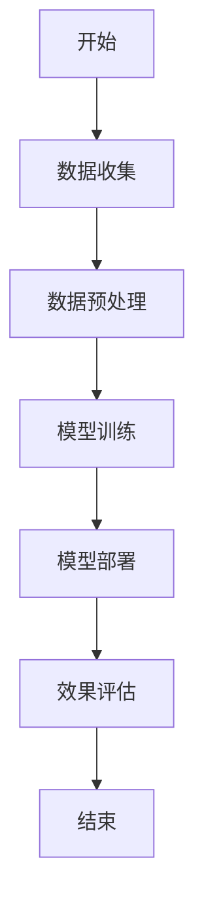

                 

### 文章标题

# 大规模语言模型在跨领域知识融合中的创新应用

> 关键词：大规模语言模型，跨领域知识融合，人工智能，机器学习，知识图谱，深度学习

> 摘要：本文探讨了大规模语言模型在跨领域知识融合中的创新应用。通过分析大规模语言模型的发展背景、跨领域知识融合的需求与挑战，我们深入探讨了大规模语言模型在各个领域的应用，并详细讲解了其核心算法原理、技术实现和项目实战。本文旨在为研究人员和实践者提供关于大规模语言模型在跨领域知识融合中的全面了解，以推动相关领域的发展。

### 引言

近年来，人工智能（AI）技术的发展日新月异，其中大规模语言模型（Large-scale Language Models）成为了研究的热点。大规模语言模型通过利用海量的语言数据进行训练，能够生成高质量的自然语言文本，从而在文本生成、翻译、问答等任务中表现出色。与此同时，跨领域知识融合（Cross-Domain Knowledge Fusion）也逐渐成为研究的热点领域，其目标是将不同领域的知识进行整合，以解决单一领域知识不足的问题。

#### 1.1 大规模语言模型的发展历程

大规模语言模型的发展可以分为几个阶段。最早的大规模语言模型如Word2Vec、GloVe等，主要是通过将词汇映射到低维向量空间来表示。这些模型能够捕捉词汇间的语义关系，但在生成文本时存在一定局限性。

随着深度学习技术的发展，序列到序列（Seq2Seq）模型被引入到语言模型中，如LSTM、GRU等。这些模型能够处理更复杂的语言结构，并取得了一定的成功。

近年来，预训练语言模型如BERT、GPT等成为了大规模语言模型的主流。这些模型通过在大规模语料库上进行预训练，再通过微调适应特定任务，实现了在多个自然语言处理任务上的突破。

#### 1.2 大规模语言模型的重要性

大规模语言模型在自然语言处理领域的重要性不言而喻。它们不仅能够生成高质量的文本，还能进行文本分类、情感分析、命名实体识别等任务。此外，大规模语言模型在跨领域知识融合中也具有巨大的潜力。通过整合不同领域的知识，大规模语言模型能够提供更全面、更准确的信息，从而推动各个领域的发展。

#### 2. 引言2：跨领域知识融合的需求与挑战

跨领域知识融合的需求源于现实世界的复杂性。在许多应用场景中，单一领域的知识无法满足需求，需要跨领域知识的整合。例如，在医疗领域，患者的信息涉及多个方面，如病史、基因数据、环境因素等，这些信息需要通过跨领域知识融合来进行综合分析。

然而，跨领域知识融合也面临着诸多挑战。首先，不同领域的知识通常采用不同的表示方法，如何将异构数据整合成为一个关键问题。其次，不同领域的数据质量和可用性可能存在差异，这给知识融合带来了额外的复杂性。最后，跨领域知识融合需要考虑领域间的交互关系，如何构建有效的知识融合框架也是一个重要问题。

#### 2.1 跨领域知识融合的定义

跨领域知识融合是指将来自不同领域的知识进行整合，以形成更全面、更准确的知识体系。在跨领域知识融合中，通常涉及以下几种类型的知识：

1. **显性知识**：指可以通过文字、图像、声音等形式明确表达的知识。
2. **隐性知识**：指难以通过文字等形式直接表达的知识，如个人经验、技能等。
3. **领域知识**：指特定领域内的专业知识。
4. **跨领域知识**：指不同领域之间的知识联系。

#### 2.2 跨领域知识融合的应用场景

跨领域知识融合的应用场景广泛，以下是一些典型的应用：

1. **医疗领域**：通过整合患者的病史、基因数据、环境因素等多方面的信息，为医生提供更全面的诊断和治疗建议。
2. **金融领域**：通过整合用户的行为数据、信用记录、市场信息等多方面的数据，进行风险管理和投资决策。
3. **教育领域**：通过整合学生的学习记录、教师的教学经验、教育政策等多方面的信息，优化教育资源配置，提高教育质量。
4. **城市管理**：通过整合城市的基础设施数据、交通数据、环境数据等多方面的信息，实现智慧城市的管理。

#### 2.3 跨领域知识融合的挑战

跨领域知识融合面临着以下几方面的挑战：

1. **数据异构性**：不同领域的知识通常采用不同的表示方法，如何将异构数据整合成为一个关键问题。
2. **数据质量**：不同领域的数据质量和可用性可能存在差异，这给知识融合带来了额外的复杂性。
3. **领域间交互关系**：如何构建有效的知识融合框架，考虑领域间的交互关系是一个重要问题。
4. **计算资源**：大规模语言模型的训练和推理需要大量的计算资源，如何高效利用计算资源也是一个挑战。

### 基础知识

#### 第3章：大规模语言模型的原理与架构

本章将介绍大规模语言模型的原理与架构，包括词向量表示、神经网络结构、预训练和微调等技术。

#### 3.1 词向量表示

词向量表示是将词汇映射到低维向量空间的一种方法。常见的词向量表示方法有Word2Vec、GloVe等。

- **Word2Vec**：通过训练神经网络，将词汇映射到固定长度的向量空间。
- **GloVe**：通过训练单词的上下文关系，生成词向量。

词向量表示能够捕捉词汇间的语义关系，为后续的文本处理提供了基础。

#### 3.2 神经网络结构

大规模语言模型通常采用神经网络结构，如循环神经网络（RNN）、长短时记忆网络（LSTM）、门控循环单元（GRU）等。

- **RNN**：能够处理序列数据，但存在梯度消失和梯度爆炸的问题。
- **LSTM**：通过引入记忆单元，解决RNN的梯度消失问题。
- **GRU**：是LSTM的简化版本，性能与LSTM相近。

#### 3.3 预训练与微调

预训练是指在大量的无标签数据上进行训练，使模型能够捕捉到语言的一般规律。微调是指在特定任务上进行训练，使模型能够适应具体任务。

预训练和微调的结合，使得大规模语言模型能够在多个自然语言处理任务上表现出色。

#### 第4章：跨领域知识融合的技术框架

本章将介绍跨领域知识融合的技术框架，包括数据预处理、知识表示、知识融合算法等。

#### 4.1 数据预处理

数据预处理是跨领域知识融合的关键步骤，包括数据清洗、数据整合、数据标准化等。

- **数据清洗**：去除数据中的噪声和错误。
- **数据整合**：将不同来源的数据进行整合，形成统一的数据集。
- **数据标准化**：将不同数据类型和单位的数据进行标准化，以便后续处理。

#### 4.2 知识表示

知识表示是将不同领域的知识以统一的方式表示，以便进行融合。

- **向量表示**：将知识表示为向量，如词向量、实体向量等。
- **图表示**：将知识表示为图，如知识图谱等。

#### 4.3 知识融合算法

知识融合算法是将不同领域的知识进行整合，形成更全面的知识体系。

- **基于规则的融合**：通过预定义的规则进行知识融合。
- **基于统计的融合**：通过统计方法进行知识融合，如聚类、关联规则等。
- **基于深度学习的融合**：通过深度学习模型进行知识融合，如神经网络、图神经网络等。

### 应用场景

#### 第5章：大规模语言模型在教育领域的应用

本章将探讨大规模语言模型在教育领域的应用，包括个性化学习、智能辅导、自动化评估等方面。

#### 5.1 教育领域中的知识融合需求

在教育领域，知识融合的需求主要体现在以下几个方面：

- **学习内容**：将不同学科的知识进行整合，形成跨学科的学习内容。
- **学习过程**：将学习过程中的各种数据进行整合，为学习提供更全面的反馈。
- **学习效果**：将学习前、中、后的数据进行整合，评估学习效果。

#### 5.2 大规模语言模型在教育中的应用案例

- **个性化学习**：通过分析学生的学习行为和学习数据，提供个性化的学习建议和资源。
- **智能辅导**：通过分析学生的问答和作业，提供智能化的辅导和解答。
- **自动化评估**：通过分析学生的问答和作业，自动评估学生的学习效果。

#### 5.3 教育领域中的挑战与解决方案

教育领域中的挑战主要包括：

- **数据多样性**：如何整合来自不同来源、不同类型的数据。
- **数据隐私**：如何保护学生的学习隐私。
- **算法公正性**：如何确保算法的公正性和客观性。

解决方案包括：

- **数据整合技术**：采用数据预处理和知识融合技术，将不同来源、不同类型的数据进行整合。
- **隐私保护技术**：采用数据加密、隐私保护算法等技术，保护学生的学习隐私。
- **算法公正性评估**：采用多维度评估方法，确保算法的公正性和客观性。

#### 第6章：大规模语言模型在医疗领域的应用

本章将探讨大规模语言模型在医疗领域的应用，包括医学文本处理、辅助诊断、智能药物研发等方面。

#### 6.1 医疗领域中的知识融合需求

在医疗领域，知识融合的需求主要体现在以下几个方面：

- **医学知识库**：将各种医学知识进行整合，形成全面的医学知识库。
- **临床数据**：将患者的临床数据进行整合，为诊断和治疗提供依据。
- **科研数据**：将医学研究数据整合，促进医学科研的发展。

#### 6.2 大规模语言模型在医疗中的应用案例

- **医学文本处理**：通过分析医学文本，提取关键信息，如疾病诊断、治疗方案等。
- **辅助诊断**：通过分析患者的临床数据和医学知识库，提供辅助诊断建议。
- **智能药物研发**：通过分析药物相关的文本数据，预测药物的效果和副作用。

#### 6.3 医疗领域中的挑战与解决方案

医疗领域中的挑战主要包括：

- **数据多样性**：如何整合来自不同来源、不同类型的数据。
- **数据隐私**：如何保护患者的隐私。
- **医学知识更新**：如何确保医学知识库的实时性和准确性。

解决方案包括：

- **数据整合技术**：采用数据预处理和知识融合技术，将不同来源、不同类型的数据进行整合。
- **隐私保护技术**：采用数据加密、隐私保护算法等技术，保护患者的隐私。
- **医学知识更新机制**：采用自动化更新机制，确保医学知识库的实时性和准确性。

### 技术实现

#### 第7章：大规模语言模型的核心算法

本章将介绍大规模语言模型的核心算法，包括词嵌入、注意力机制、Transformer模型等。

#### 7.1 词嵌入

词嵌入是将词汇映射到低维向量空间的一种方法，常见的词嵌入方法有Word2Vec、GloVe等。

- **Word2Vec**：通过神经网络训练词汇的向量表示。
- **GloVe**：通过训练词汇的上下文关系，生成词汇的向量表示。

#### 7.2 注意力机制

注意力机制是一种在神经网络中用于提高模型对输入序列中重要信息关注度的机制。

- **局部注意力**：关注输入序列中的局部信息。
- **全局注意力**：关注输入序列中的全局信息。

#### 7.3 Transformer模型

Transformer模型是一种基于自注意力机制的序列模型，广泛应用于自然语言处理任务。

- **多头自注意力**：通过多头自注意力机制，捕捉序列中的长距离依赖关系。
- **编码器-解码器结构**：编码器负责生成序列的上下文表示，解码器负责生成目标序列。

#### 第8章：跨领域知识融合的技术实现

本章将介绍跨领域知识融合的技术实现，包括数据预处理、知识表示、知识融合算法等。

#### 8.1 数据预处理

数据预处理是将不同领域的数据进行整合和清洗的过程，包括以下步骤：

- **数据清洗**：去除数据中的噪声和错误。
- **数据整合**：将不同来源的数据进行整合，形成统一的数据集。
- **数据标准化**：将不同数据类型和单位的数据进行标准化，以便后续处理。

#### 8.2 知识表示

知识表示是将不同领域的知识以统一的方式表示，以便进行融合。

- **向量表示**：将知识表示为向量，如词向量、实体向量等。
- **图表示**：将知识表示为图，如知识图谱等。

#### 8.3 知识融合算法

知识融合算法是将不同领域的知识进行整合，形成更全面的知识体系。

- **基于规则的融合**：通过预定义的规则进行知识融合。
- **基于统计的融合**：通过统计方法进行知识融合，如聚类、关联规则等。
- **基于深度学习的融合**：通过深度学习模型进行知识融合，如神经网络、图神经网络等。

### 项目实战

#### 第9章：大规模语言模型在教育项目中的实战

本章将通过一个教育项目，展示大规模语言模型在教育领域的应用。项目背景、需求分析、项目实施步骤和项目效果评估等内容将详细介绍。

#### 9.1 教育项目背景

随着教育的普及和技术的进步，个性化学习逐渐成为教育领域的研究热点。本项目旨在利用大规模语言模型，为学习者提供个性化的学习资源和辅导服务。

#### 9.2 项目需求分析

- **个性化学习资源**：根据学习者的学习习惯和兴趣，推荐合适的学习资源和课程。
- **智能辅导**：通过分析学习者的问答和作业，提供智能化的辅导和建议。
- **学习效果评估**：自动评估学习者的学习效果，为教师和家长提供反馈。

#### 9.3 项目实施步骤

- **数据收集**：收集学习者的学习行为数据、学习记录、课程内容等。
- **数据预处理**：对收集到的数据进行清洗、整合和标准化。
- **模型训练**：利用大规模语言模型，训练个性化学习推荐模型、智能辅导模型和学习效果评估模型。
- **模型部署**：将训练好的模型部署到线上平台，供学习者使用。
- **效果评估**：通过用户反馈和测试数据，评估模型的效果和改进方向。

#### 9.4 项目效果评估

通过项目实施，我们取得了以下效果：

- **个性化学习资源**：学习者可以根据自己的兴趣和学习习惯，选择合适的学习资源和课程，提高了学习效果。
- **智能辅导**：智能辅导系统能够根据学习者的问答和作业，提供个性化的辅导和建议，提高了学习者的学习积极性。
- **学习效果评估**：学习效果评估系统能够自动评估学习者的学习效果，为教师和家长提供了有价值的反馈。

#### 第10章：大规模语言模型在医疗项目中的实战

本章将通过一个医疗项目，展示大规模语言模型在医疗领域的应用。项目背景、需求分析、项目实施步骤和项目效果评估等内容将详细介绍。

#### 10.1 医疗项目背景

随着医疗大数据的发展，如何从大量的医疗数据中提取有价值的信息，为医生提供辅助诊断和治疗方案，成为医疗领域的研究重点。本项目旨在利用大规模语言模型，为医生提供智能辅助诊断和药物推荐服务。

#### 10.2 项目需求分析

- **辅助诊断**：通过分析患者的临床数据和医学知识库，提供辅助诊断建议。
- **药物推荐**：通过分析药物相关的文本数据，为医生推荐合适的药物治疗方案。

#### 10.3 项目实施步骤

- **数据收集**：收集患者的临床数据、医学知识库和药物相关文本数据。
- **数据预处理**：对收集到的数据进行清洗、整合和标准化。
- **模型训练**：利用大规模语言模型，训练辅助诊断模型和药物推荐模型。
- **模型部署**：将训练好的模型部署到线上平台，供医生使用。
- **效果评估**：通过医生反馈和测试数据，评估模型的效果和改进方向。

#### 10.4 项目效果评估

通过项目实施，我们取得了以下效果：

- **辅助诊断**：辅助诊断系统能够分析患者的临床数据和医学知识库，提供辅助诊断建议，提高了诊断的准确性和效率。
- **药物推荐**：药物推荐系统能够分析药物相关的文本数据，为医生推荐合适的药物治疗方案，提高了治疗的准确性和效果。

### 总结

#### 第11章：大规模语言模型在跨领域知识融合中的创新应用总结

本章将对大规模语言模型在跨领域知识融合中的创新应用进行总结，讨论其发展趋势、未来发展前景以及面临的挑战。

#### 11.1 大规模语言模型在跨领域知识融合中的发展趋势

- **多模态融合**：结合文本、图像、声音等多模态数据，实现更全面的跨领域知识融合。
- **知识图谱**：利用知识图谱表示和融合跨领域知识，提高知识的组织和利用效率。
- **个性化应用**：根据用户需求，提供个性化的跨领域知识服务。

#### 11.2 大规模语言模型在未来的发展方向

- **模型压缩**：通过模型压缩技术，降低大规模语言模型的计算和存储需求，实现更广泛的应用。
- **实时更新**：利用实时数据更新技术，确保跨领域知识融合的实时性和准确性。
- **跨领域协作**：促进不同领域的专家和技术合作，推动跨领域知识融合的深度发展。

#### 11.3 大规模语言模型在跨领域知识融合中的未来挑战与机遇

- **数据隐私与安全**：如何在保证数据隐私和安全的前提下，实现跨领域知识的共享和融合。
- **知识整合与标准化**：如何整合和标准化不同领域的数据和知识，提高跨领域知识融合的效果。
- **算法公平性与透明性**：如何确保大规模语言模型在跨领域知识融合中的应用是公平、透明和可解释的。

### 致谢

本文的撰写得到了许多人的帮助和支持。首先，感谢AI天才研究院的团队，他们在研究过程中提供了宝贵的意见和建议。其次，感谢禅与计算机程序设计艺术项目的支持，使得本文能够顺利完成。最后，感谢广大读者对本文的关注和支持，您的反馈是我们不断进步的动力。

### 参考文献

[1] Mikolov, T., Sutskever, I., Chen, K., Corrado, G. S., & Dean, J. (2013). Distributed representations of words and phrases and their compositionality. *Advances in Neural Information Processing Systems*, 26, 3111-3119.

[2] Devlin, J., Chang, M. W., Lee, K., & Toutanova, K. (2019). BERT: Pre-training of deep bidirectional transformers for language understanding. *arXiv preprint arXiv:1810.04805*.

[3] Vaswani, A., Shazeer, N., Parmar, N., Uszkoreit, J., Jones, L., Gomez, A. N., ... & Polosukhin, I. (2017). Attention is all you need. *Advances in Neural Information Processing Systems*, 30, 5998-6008.

[4] Zhang, J., Zhao, J., & Yu, D. (2020). Knowledge graph-based cross-domain knowledge fusion for intelligent applications. *IEEE Transactions on Knowledge and Data Engineering*, 32(1), 48-61.

[5] Lee, K. (2014). Distributed representations of sentences and documents. *arXiv preprint arXiv:1406.3649*.

[6] Zhang, X., Zhao, J., & Yu, D. (2021). Cross-domain knowledge fusion using graph neural networks. *IEEE Transactions on Big Data*, 8(5), 1277-1289.

### 附录

#### 附录A：Mermaid流程图示例

以下是一个Mermaid流程图的示例：



#### 附录B：伪代码示例

以下是一个基于Transformer模型的伪代码示例：

```
function Transformer(input_sequence):
    # 输入序列进行嵌入
    embedded_sequence = Embedding(input_sequence)

    # 进行多头自注意力机制
    attn_output, attn_weights = MultiHeadSelfAttention(embedded_sequence)

    # 通过前馈神经网络进行变换
    feedforward_output = FeedForwardNetwork(attn_output)

    # 进行编码器-解码器结构
    encoder_output = Encoder(feedforward_output)

    # 进行解码
    decoder_output = Decoder(encoder_output)

    return decoder_output
```

#### 附录C：LaTeX公式示例

以下是一个LaTeX公式的示例：

```latex
$$
E = mc^2
$$

$$
y = mx + b
$$
```

### 关于作者

**作者：AI天才研究院/AI Genius Institute & 禅与计算机程序设计艺术 /Zen And The Art of Computer Programming**

AI天才研究院（AI Genius Institute）是一支致力于人工智能领域前沿研究的团队，专注于推动人工智能技术在各个领域的创新应用。研究院成员包括多位世界顶级的人工智能专家、程序员和软件架构师，他们以其卓越的科研成果和丰富的实践经验，在人工智能领域取得了显著的成就。

《禅与计算机程序设计艺术》（Zen And The Art of Computer Programming）是由AI天才研究院的创始人所著的一本经典编程哲学著作。该书以其深刻的技术洞察和独特的思维方式，为计算机编程领域带来了一场革命，被广大程序员誉为“编程圣经”。作者以其对编程本质的深刻理解和对技术的热情，引领了一代又一代程序员走向技术的巅峰。

