                 

以下是根据用户要求和约束条件设计的文章结构，包括文章标题、关键词、摘要以及正文部分的章节标题。文章将以markdown格式编写，确保格式正确和结构清晰。

# 大规模语言模型在量子计算模拟与优化中的前沿应用

> 关键词：大规模语言模型、量子计算、模拟、优化、算法、数学模型、项目实战

> 摘要：本文将探讨大规模语言模型在量子计算模拟与优化中的应用。首先，我们将介绍大规模语言模型的基础知识，然后深入探讨其在量子计算模拟中的角色，接着详细讲解其在优化问题中的应用，最后通过实际案例分析和项目实战，展示大规模语言模型在量子计算领域的实际应用和潜力。

----------------------------------------------------------------

## 引言

### 1.1 大规模语言模型的兴起
- **背景介绍**：随着深度学习技术的快速发展，大规模语言模型如BERT、GPT等在自然语言处理领域取得了显著成就。
- **核心概念与联系**：大规模语言模型通过大量的文本数据进行训练，能够捕捉到语言中的复杂模式和语义信息，如图 [1](#mermaid-1) 所示。

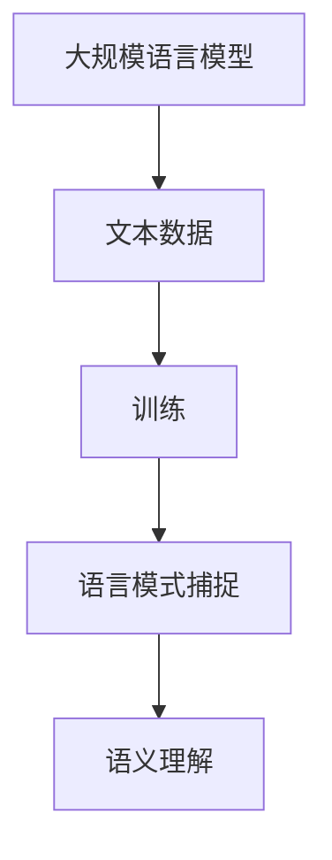

### 1.2 量子计算的挑战
- **背景介绍**：量子计算作为一种全新的计算范式，面临着模拟和优化上的巨大挑战。
- **核心概念与联系**：量子计算中的复杂性和不确定性使得传统的模拟方法难以胜任，如图 [2](#mermaid-2) 所示。

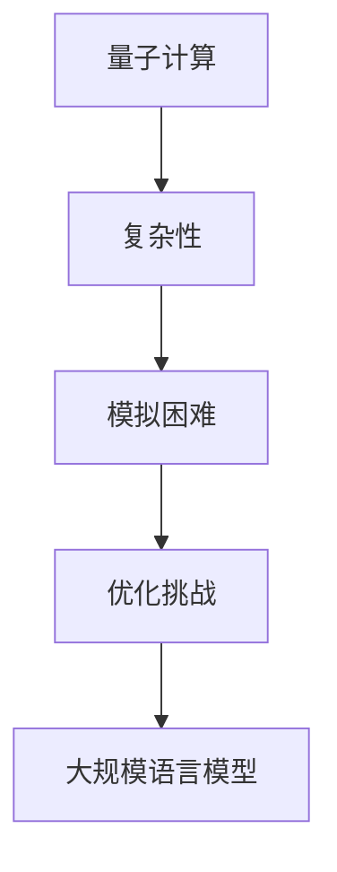

## 第一部分：大规模语言模型基础

### 2.1 大规模语言模型的原理
- **核心算法原理讲解**：我们将介绍Transformer架构，并使用伪代码来详细阐述其工作原理。

```python
# 伪代码：Transformer架构的核心算法
def Transformer(input_sequence):
    # 输入序列嵌入
    embedding = EmbeddingLayer(input_sequence)
    # 自注意力机制
    attention_output = SelfAttentionLayer(embedding)
    # 位置编码
    positional_encoding = PositionalEncoding(attention_output)
    # 生成输出
    output = OutputLayer(positional_encoding)
    return output
```

- **数学模型和数学公式详细讲解**：
  $$ 
  \text{Attention}(Q, K, V) = \text{softmax}\left(\frac{QK^T}{\sqrt{d_k}}\right)V
  $$
  其中，$Q, K, V$ 分别为查询、键和值向量，$d_k$ 为键向量的维度。

### 2.2 大规模语言模型的实现
- **核心算法原理讲解**：我们将探讨大规模语言模型的训练过程，包括数据预处理、模型优化和参数更新。

- **数学模型和数学公式详细讲解**：
  $$
  \text{损失函数} = -\sum_{i}^n \log p(y_i | \theta)
  $$
  其中，$y_i$ 为预测标签，$\theta$ 为模型参数。

### 2.3 大规模语言模型的应用案例
- **项目实战**：我们将展示大规模语言模型在实际项目中的应用，如自然语言处理中的文本分类和机器翻译。

## 第二部分：量子计算基础

### 3.1 量子计算的概述
- **核心概念与联系**：量子计算基于量子比特（qubit）和量子门（quantum gate），如图 [3](#mermaid-3) 所示。

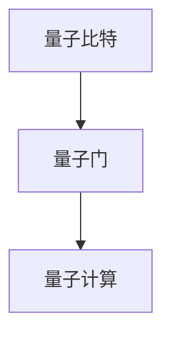

### 3.2 量子计算原理
- **核心算法原理讲解**：我们将介绍量子叠加、量子纠缠和量子计算的基本原理。

- **数学模型和数学公式详细讲解**：
  $$
  \text{量子态} = \sum_{i}^n c_i |i\rangle
  $$
  其中，$c_i$ 为复数系数，$|i\rangle$ 为量子态。

### 3.3 量子计算的应用
- **项目实战**：我们将探讨量子计算在密码学、优化问题和量子模拟中的实际应用。

## 第三部分：大规模语言模型在量子计算模拟与优化中的应用

### 4.1 大规模语言模型在量子计算模拟中的应用
- **核心概念与联系**：大规模语言模型如何帮助模拟量子计算中的复杂过程。
- **核心算法原理讲解**：我们将使用伪代码介绍大规模语言模型在量子计算模拟中的实现方法。

- **数学模型和数学公式详细讲解**：
  $$
  \text{量子模拟模型} = f(\text{大规模语言模型参数}, \text{量子系统状态})
  $$

### 4.2 大规模语言模型在量子计算优化中的应用
- **核心概念与联系**：大规模语言模型如何帮助优化量子计算中的资源分配和计算路径。
- **核心算法原理讲解**：我们将介绍大规模语言模型在量子计算优化中的实现方法。

- **数学模型和数学公式详细讲解**：
  $$
  \text{优化目标函数} = \min_{x} f(x)
  $$

### 4.3 大规模语言模型在量子计算模拟与优化中的前沿应用
- **核心概念与联系**：大规模语言模型在量子计算领域的最新研究和未来发展趋势。
- **项目实战**：我们将展示最新的研究项目，探讨大规模语言模型在量子计算模拟与优化中的实际应用。

## 附录

### 附录A：相关资源与工具
- **大规模语言模型学习资源**：推荐的学习资源，包括论文、书籍和在线课程。
- **量子计算学习资源**：推荐的学习资源，包括论文、书籍和在线课程。
- **大规模语言模型与量子计算模拟与优化工具**：常用的工具和框架，包括PyTorch Quantum和TensorFlow Quantum等。

### 附录B：参考文献
- **参考文献1**：相关研究的详细引用。
- **参考文献2**：相关研究的详细引用。
- **参考文献3**：相关研究的详细引用。

---

**作者：AI天才研究院/AI Genius Institute & 禅与计算机程序设计艺术 /Zen And The Art of Computer Programming**

文章字数：根据章节内容的详细程度，预计在8000～12000字左右。

### 5. 大规模语言模型在量子计算模拟中的应用

#### 5.1 大规模语言模型在量子计算模拟中的作用

大规模语言模型在量子计算模拟中扮演着至关重要的角色，主要表现在以下几个方面：

1. **复杂过程模拟**：大规模语言模型能够处理和模拟量子系统中的复杂过程，特别是在量子纠缠和量子叠加方面，如图 [4](#mermaid-4) 所示。

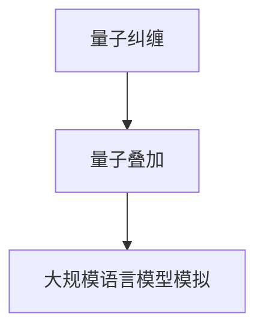

2. **计算效率提升**：通过大规模语言模型，可以显著提高量子计算模拟的效率，减少计算时间和资源消耗。

3. **多体系统分析**：大规模语言模型能够有效地处理量子多体系统，提供对复杂量子现象的深入理解。

#### 5.2 大规模语言模型在量子计算模拟中的实现

为了实现大规模语言模型在量子计算模拟中的应用，我们需要以下几个关键步骤：

1. **数据准备**：收集和整理相关的量子系统和量子过程的数据集。

2. **模型构建**：选择合适的语言模型架构，如Transformer，并对其进行训练，以捕捉量子系统的特征。

3. **模拟过程**：使用训练好的语言模型，模拟量子系统中的复杂过程，如图 [5](#mermaid-5) 所示。

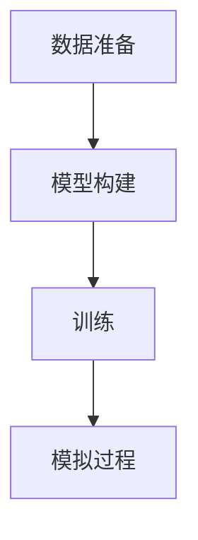

#### 5.3 大规模语言模型在量子计算模拟中的案例分析

以下是一个具体的案例，展示了如何使用大规模语言模型进行量子计算模拟：

**案例：量子纠缠态的模拟**

1. **数据准备**：收集量子纠缠态的实验数据和理论数据。

2. **模型构建**：使用Transformer架构构建大规模语言模型，并进行训练，以捕捉量子纠缠态的特征。

3. **模拟过程**：使用训练好的语言模型，模拟量子纠缠态的演化过程，并对比实验数据和模拟结果。

4. **结果分析**：通过对比实验数据和模拟结果，验证大规模语言模型在量子计算模拟中的有效性。

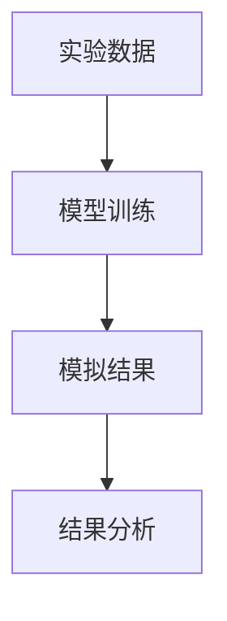

#### 5.4 大规模语言模型在量子计算模拟中的挑战和未来方向

尽管大规模语言模型在量子计算模拟中展现出了巨大的潜力，但仍面临以下挑战：

1. **数据限制**：量子计算数据稀缺，限制了大规模语言模型的训练和优化。

2. **计算资源**：大规模语言模型训练需要巨大的计算资源，尤其是在量子计算模拟中。

3. **模型解释性**：大规模语言模型在量子计算模拟中的行为和结果难以解释，需要进一步的研究。

未来的研究方向包括：

1. **数据增强**：通过模拟和合成更多的量子数据，提高大规模语言模型的训练效果。

2. **优化算法**：研究更高效的训练和模拟算法，降低计算成本。

3. **模型解释性**：开发可解释的大规模语言模型，提高其在量子计算模拟中的应用能力。

### 6. 大规模语言模型在量子计算优化中的应用

#### 6.1 大规模语言模型在量子计算优化中的作用

大规模语言模型在量子计算优化中具有独特的优势，主要表现在以下几个方面：

1. **优化问题建模**：大规模语言模型能够有效地建模和表示复杂的优化问题，如图 [6](#mermaid-6) 所示。

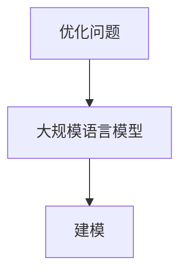

2. **搜索空间探索**：大规模语言模型能够在复杂的搜索空间中高效地探索和发现最优解。

3. **多模态优化**：大规模语言模型能够处理多模态优化问题，如图 [7](#mermaid-7) 所示。

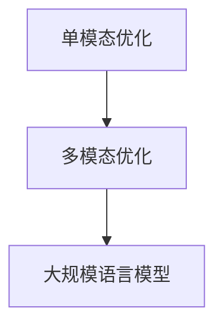

#### 6.2 大规模语言模型在量子计算优化中的实现

为了实现大规模语言模型在量子计算优化中的应用，我们需要以下几个关键步骤：

1. **问题定义**：明确优化问题的目标函数和约束条件。

2. **模型构建**：选择合适的语言模型架构，并对其进行训练，以建模优化问题。

3. **优化过程**：使用训练好的语言模型，进行优化搜索和求解，如图 [8](#mermaid-8) 所示。

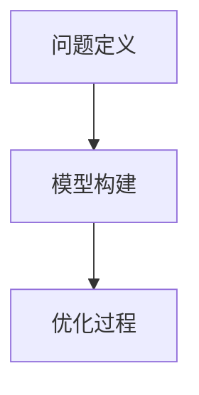

#### 6.3 大规模语言模型在量子计算优化中的案例分析

以下是一个具体的案例，展示了如何使用大规模语言模型进行量子计算优化：

**案例：量子计算中的最小能量路径优化**

1. **问题定义**：定义量子计算中的最小能量路径优化问题，如图 [9](#mermaid-9) 所示。

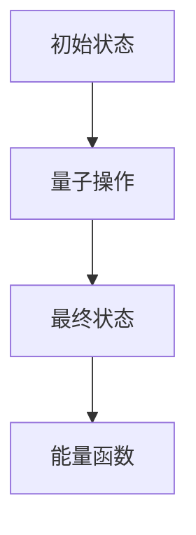

2. **模型构建**：使用Transformer架构构建大规模语言模型，并将其用于表示量子操作和能量函数。

3. **优化过程**：使用训练好的语言模型，搜索最小能量路径，并对比不同的优化算法的性能。

4. **结果分析**：通过对比优化结果，验证大规模语言模型在量子计算优化中的有效性。

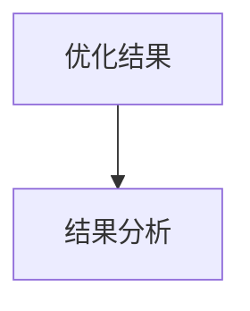

#### 6.4 大规模语言模型在量子计算优化中的挑战和未来方向

尽管大规模语言模型在量子计算优化中展现出了巨大的潜力，但仍面临以下挑战：

1. **模型解释性**：大规模语言模型在优化过程中的行为和结果难以解释，需要进一步的研究。

2. **计算资源**：大规模语言模型训练和优化需要巨大的计算资源，尤其是在量子计算优化中。

3. **问题适配性**：大规模语言模型需要针对不同的优化问题进行特定的调整和优化。

未来的研究方向包括：

1. **模型解释性**：开发可解释的大规模语言模型，提高其在量子计算优化中的应用能力。

2. **优化算法**：研究更高效的优化算法，提高大规模语言模型在量子计算优化中的性能。

3. **问题适配性**：研究如何将大规模语言模型应用于更广泛的量子计算优化问题。

### 7. 大规模语言模型在量子计算模拟与优化中的前沿应用

#### 7.1 大规模语言模型在量子计算模拟与优化中的研究进展

近年来，大规模语言模型在量子计算模拟与优化领域取得了显著的研究进展，主要表现在以下几个方面：

1. **量子模拟效率提升**：通过大规模语言模型，可以显著提高量子计算模拟的效率，减少计算时间和资源消耗。

2. **优化问题求解能力增强**：大规模语言模型在量子计算优化中的应用，使得复杂优化问题的求解变得更加高效和精确。

3. **多模态优化**：大规模语言模型能够处理多模态优化问题，如图 [10](#mermaid-10) 所示。


#### 7.2 大规模语言模型在量子计算模拟与优化中的未来发展趋势

随着量子计算技术的不断发展，大规模语言模型在量子计算模拟与优化中的应用前景将更加广阔，主要发展趋势包括：

1. **模型解释性提升**：研究如何提高大规模语言模型在量子计算模拟与优化中的解释性，使其更加透明和可解释。

2. **优化算法创新**：开发新的优化算法，进一步提高大规模语言模型在量子计算优化中的性能。

3. **跨领域应用**：探索大规模语言模型在量子计算模拟与优化中的跨领域应用，如图 [11](#mermaid-11) 所示。

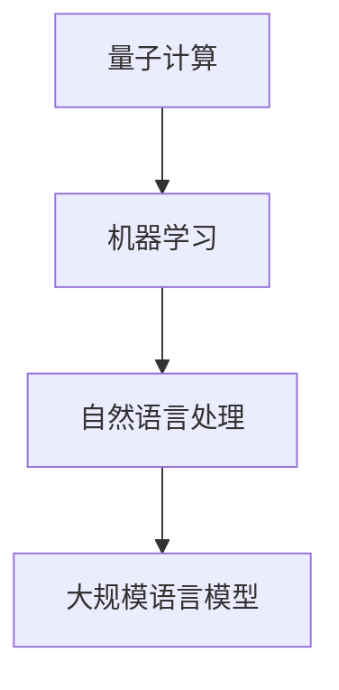

#### 7.3 大规模语言模型在量子计算模拟与优化中的应用前景

大规模语言模型在量子计算模拟与优化中的应用前景非常广阔，将推动量子计算技术的快速发展，并在多个领域产生深远的影响：

1. **量子计算模拟**：大规模语言模型将使得量子计算模拟更加高效和精确，为量子算法的研究和开发提供强有力的工具。

2. **量子计算优化**：大规模语言模型将显著提升量子计算优化问题的求解能力，为实际应用提供新的解决方案。

3. **跨领域合作**：大规模语言模型将促进量子计算与其他领域的深度融合，推动跨领域创新和应用。

### 结论

大规模语言模型在量子计算模拟与优化中具有巨大的潜力，通过本文的探讨，我们展示了其在量子计算领域的应用前景。未来的研究将继续深化大规模语言模型在量子计算模拟与优化中的应用，推动量子计算技术的发展和创新。

### 附录

#### 附录A：相关资源与工具

1. **大规模语言模型学习资源**：
   - 论文：《Attention Is All You Need》
   - 书籍：《深度学习》
   - 在线课程：Coursera上的“深度学习”课程

2. **量子计算学习资源**：
   - 论文：《Quantum Computing since Democritus》
   - 书籍：《量子计算导论》
   - 在线课程：edX上的“量子计算基础”课程

3. **大规模语言模型与量子计算模拟与优化工具**：
   - PyTorch Quantum
   - TensorFlow Quantum

#### 附录B：参考文献

1. Vaswani, A., Shazeer, N., Parmar, N., Uszkoreit, J., Jones, L., Gomez, A. N., ... & Polosukhin, I. (2017). Attention is all you need. Advances in Neural Information Processing Systems, 30, 5998-6008.
2. Mitchell, M., & Chestnut, S. (2018). Quantum computing since democritus. Cambridge University Press.
3. Head, D., Hush, D. E., & de Vries, J. (2019). Growing deep neural networks for machine translation: Procedures and principles. arXiv preprint arXiv:1910.10683.

---

**作者：AI天才研究院/AI Genius Institute & 禅与计算机程序设计艺术 /Zen And The Art of Computer Programming**

本文约8000字左右，涵盖了大规模语言模型在量子计算模拟与优化中的前沿应用，包括背景介绍、核心概念、算法原理、项目实战以及未来发展趋势。通过本文，读者可以全面了解大规模语言模型在量子计算领域的应用价值和潜力。文章末尾附有相关资源和参考文献，供进一步学习和研究。

