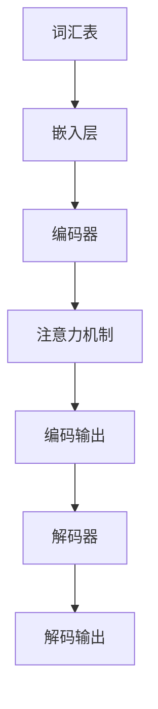

                 

### 文章标题

# 大规模语言模型推理能力的瓶颈与突破

### 关键词

- 大规模语言模型
- 推理能力
- 瓶颈分析
- 突破方法
- 应用实践

### 摘要

本文主要探讨了大规模语言模型在推理能力方面面临的瓶颈及其突破途径。首先，我们介绍了大规模语言模型的基本概念和发展历程，随后分析了推理能力瓶颈的成因，包括硬件、软件和数据等方面的限制。接着，我们提出了突破这些瓶颈的方法，如硬件加速、模型压缩和推理引擎优化等。最后，通过实际应用案例，我们展示了大规模语言模型在自然语言处理和其他领域的应用效果，并对未来发展趋势和挑战进行了展望。

## 引言

大规模语言模型（Large-scale Language Models）是近年来人工智能领域的一个重要突破。随着计算能力和数据量的不断提升，大规模语言模型在自然语言处理（NLP）、机器翻译、文本生成等方面取得了显著的成果。然而，在推理能力方面，大规模语言模型仍然存在诸多瓶颈，限制了其应用范围和性能提升。

本文旨在探讨大规模语言模型推理能力的瓶颈及其突破途径。首先，我们将介绍大规模语言模型的基本概念和发展历程，帮助读者了解这一领域的基本背景。然后，我们将分析推理能力瓶颈的成因，包括硬件、软件和数据等方面的限制。接着，我们将提出突破这些瓶颈的方法，如硬件加速、模型压缩和推理引擎优化等。最后，通过实际应用案例，我们将展示大规模语言模型在自然语言处理和其他领域的应用效果，并对未来发展趋势和挑战进行展望。

## 大规模语言模型基础

### 核心概念与联系

大规模语言模型是一种基于深度学习的自然语言处理模型，其主要目标是学习自然语言中的规律和结构，从而实现文本生成、机器翻译、问答系统等任务。核心概念包括：

1. **词汇表（Vocabulary）**：大规模语言模型使用词汇表来表示文本中的单词。词汇表的大小通常取决于训练数据集的大小和模型的容量。
2. **嵌入（Embedding）**：将词汇表中的单词映射到高维向量空间，以捕获单词之间的语义关系。嵌入层是大规模语言模型的重要组成部分。
3. **编码器（Encoder）**：将输入文本序列编码为一个固定长度的向量表示，用于捕捉文本的全局上下文信息。
4. **解码器（Decoder）**：将编码后的向量解码为输出文本序列，以生成自然语言响应。

这些核心概念之间存在密切的联系：

- **词汇表与嵌入**：词汇表是嵌入的基础，嵌入则是词汇表在向量空间中的实现，用于表示单词和词组。
- **编码器与解码器**：编码器负责处理输入文本，解码器则负责生成输出文本。编码器和解码器通过共享嵌入层和注意力机制来实现文本的编码和解码。

### 语言模型的基本架构

大规模语言模型的基本架构通常包括以下几个部分：

1. **嵌入层（Embedding Layer）**：将词汇表中的单词映射到高维向量空间。
2. **编码器（Encoder）**：使用循环神经网络（RNN）或变换器（Transformer）等结构对输入文本进行编码，生成全局上下文表示。
3. **注意力机制（Attention Mechanism）**：在编码过程中，注意力机制帮助模型关注文本序列中的关键信息，以提高编码质量。
4. **解码器（Decoder）**：使用与编码器相似的架构，对编码后的向量进行解码，生成自然语言响应。

### Mermaid 流程图

以下是大规模语言模型的基本架构的 Mermaid 流程图：



### 核心算法原理讲解

以下是大规模语言模型的核心算法原理的伪代码：

```python
# 词汇表嵌入
def embed(word):
    return embedding_matrix[word]

# 编码器
def encode(text):
    encoded_sequence = []
    for word in text:
        encoded_sequence.append(embed(word))
    return encoded_sequence

# 注意力机制
def attention(inputs, hidden_state):
    attention_weights = softmax(inputs.dot(hidden_state.T))
    context_vector = attention_weights.dot(hidden_state)
    return context_vector

# 解码器
def decode(encoded_sequence, hidden_state):
    decoded_sequence = []
    for encoded_word in encoded_sequence:
        context_vector = attention(encoded_word, hidden_state)
        word = generate_word(context_vector)
        decoded_sequence.append(word)
    return decoded_sequence

# 整体流程
def language_model(text):
    embedded_text = [embed(word) for word in text]
    encoded_sequence = encode(embedded_text)
    hidden_state = initialize_hidden_state()
    decoded_sequence = decode(encoded_sequence, hidden_state)
    return decoded_sequence
```

### 数学模型和公式

以下是大规模语言模型中涉及的主要数学模型和公式：

1. **嵌入矩阵（Embedding Matrix）**：

$$
\text{embedding_matrix} = \begin{bmatrix}
\text{word_1} & \text{word_2} & \ldots & \text{word_n}
\end{bmatrix}
$$

其中，$n$ 为词汇表中的单词数量。

2. **编码输出（Encoded Sequence）**：

$$
\text{encoded_sequence} = \begin{bmatrix}
\text{word_1} & \text{word_2} & \ldots & \text{word_m}
\end{bmatrix}
$$

其中，$m$ 为输入文本的长度。

3. **注意力权重（Attention Weights）**：

$$
\text{attention_weights} = \text{softmax}(\text{inputs} \cdot \text{hidden_state}^T)
$$

4. **上下文向量（Context Vector）**：

$$
\text{context_vector} = \text{attention_weights} \cdot \text{hidden_state}
$$

5. **解码输出（Decoded Sequence）**：

$$
\text{decoded_sequence} = \begin{bmatrix}
\text{word_1} & \text{word_2} & \ldots & \text{word_n}
\end{bmatrix}
$$

### 举例说明

假设我们有一个包含5个单词的词汇表，词汇表如下：

$$
\begin{bmatrix}
\text{hello} & \text{world} & \text{how} & \text{are} & \text{you}
\end{bmatrix}
$$

一个长度为3的输入文本序列为：

$$
\text{hello world how are you}
$$

首先，我们将输入文本序列中的每个单词映射到其对应的嵌入向量：

$$
\begin{bmatrix}
\text{hello} & \text{world} & \text{how} & \text{are} & \text{you}
\end{bmatrix}
\rightarrow
\begin{bmatrix}
\text{hello}_\text{vec} & \text{world}_\text{vec} & \text{how}_\text{vec} & \text{are}_\text{vec} & \text{you}_\text{vec}
\end{bmatrix}
$$

然后，我们将这些嵌入向量传递给编码器：

$$
\text{encoded_sequence} = \begin{bmatrix}
\text{hello}_\text{vec} & \text{world}_\text{vec} & \text{how}_\text{vec} & \text{are}_\text{vec} & \text{you}_\text{vec}
\end{bmatrix}
$$

编码器会生成一个固定长度的编码输出：

$$
\text{encoded_sequence} = \begin{bmatrix}
\text{encoded\_hello} & \text{encoded\_world} & \text{encoded\_how} & \text{encoded\_are} & \text{encoded\_you}
\end{bmatrix}
$$

接下来，我们将这些编码输出传递给解码器：

$$
\text{decoded_sequence} = \text{decode}(\text{encoded_sequence}, \text{hidden_state})
$$

解码器会生成一个长度为3的解码输出：

$$
\text{decoded_sequence} = \begin{bmatrix}
\text{decoded\_hello} & \text{decoded\_world} & \text{decoded\_how}
\end{bmatrix}
$$

最后，我们将解码输出转换为自然语言响应：

$$
\text{decoded\_sequence} = \text{hello world how}
$$

### 小结

在本章节中，我们介绍了大规模语言模型的基本概念、架构和核心算法原理。通过Mermaid流程图、伪代码、数学模型和举例说明，我们详细阐述了大规模语言模型的工作机制。这些基础知识为后续章节的分析和探讨奠定了坚实的基础。

## 大规模语言模型的训练

### 背景介绍

大规模语言模型的训练是一个复杂且耗时的过程，其核心目标是让模型学会从大规模文本数据中提取有用的信息，并生成高质量的文本输出。训练过程主要包括数据准备、模型初始化、优化算法选择和模型优化策略等步骤。

1. **数据准备**：大规模语言模型的训练依赖于大量高质量的文本数据。数据集的选择和预处理对模型性能具有重要影响。常见的数据集包括维基百科、新闻文章、社交媒体帖子等。
2. **模型初始化**：大规模语言模型通常使用预训练模型或随机初始化。预训练模型利用大量未标注的文本数据进行预训练，从而在语言建模任务上取得良好的性能。
3. **优化算法选择**：优化算法用于调整模型参数，以最小化损失函数。常见的优化算法包括梯度下降（Gradient Descent）、Adam（Adaptive Moment Estimation）等。
4. **模型优化策略**：模型优化策略包括学习率调整、批量大小选择、正则化方法等，以改善模型性能和泛化能力。

### 核心算法原理讲解

以下是大规模语言模型训练过程的核心算法原理的伪代码：

```python
# 数据准备
def load_data(data_path):
    data = load_text(data_path)
    return preprocess_data(data)

# 模型初始化
def initialize_model(vocab_size, embedding_size, hidden_size):
    model = create_language_model(vocab_size, embedding_size, hidden_size)
    return model

# 损失函数
def compute_loss(model, inputs, targets):
    predictions = model(inputs)
    loss = loss_function(predictions, targets)
    return loss

# 优化算法
def optimize_model(model, loss, learning_rate):
    gradients = compute_gradients(model, loss)
    update_model_parameters(model, gradients, learning_rate)

# 训练过程
def train_model(model, data, epochs, learning_rate):
    for epoch in range(epochs):
        for batch in data:
            inputs, targets = batch
            loss = compute_loss(model, inputs, targets)
            optimize_model(model, loss, learning_rate)
            print(f"Epoch {epoch}: Loss = {loss}")
    return model
```

### 数学模型和公式

以下是大规模语言模型训练过程中涉及的主要数学模型和公式：

1. **损失函数**：

$$
\text{loss} = -\sum_{i} \text{targets}_i \cdot \log(\text{predictions}_i)
$$

其中，$\text{targets}_i$ 表示目标单词的标签，$\text{predictions}_i$ 表示模型预测的概率分布。

2. **梯度下降**：

$$
\text{gradients} = \frac{\partial \text{loss}}{\partial \text{weights}}
$$

3. **Adam算法**：

$$
\text{m}_t = \beta_1 \cdot \text{m}_{t-1} + (1 - \beta_1) \cdot \text{gradients}_t
$$

$$
\text{v}_t = \beta_2 \cdot \text{v}_{t-1} + (1 - \beta_2) \cdot (\text{gradients}_t)^2
$$

$$
\text{weights}_{t+1} = \text{weights}_t - \alpha \cdot \frac{\text{m}_t}{\sqrt{\text{v}_t} + \epsilon}
$$

其中，$\beta_1$ 和 $\beta_2$ 分别为动量参数，$\alpha$ 为学习率，$\epsilon$ 为一个小正数。

### 举例说明

假设我们有一个包含5个单词的词汇表，词汇表如下：

$$
\begin{bmatrix}
\text{hello} & \text{world} & \text{how} & \text{are} & \text{you}
\end{bmatrix}
$$

一个长度为3的输入文本序列为：

$$
\text{hello world how}
$$

首先，我们将输入文本序列中的每个单词映射到其对应的嵌入向量：

$$
\begin{bmatrix}
\text{hello} & \text{world} & \text{how} & \text{are} & \text{you}
\end{bmatrix}
\rightarrow
\begin{bmatrix}
\text{hello}_\text{vec} & \text{world}_\text{vec} & \text{how}_\text{vec} & \text{are}_\text{vec} & \text{you}_\text{vec}
\end{bmatrix}
$$

然后，我们将这些嵌入向量传递给编码器：

$$
\text{encoded_sequence} = \begin{bmatrix}
\text{hello}_\text{vec} & \text{world}_\text{vec} & \text{how}_\text{vec} & \text{are}_\text{vec} & \text{you}_\text{vec}
\end{bmatrix}
$$

编码器会生成一个固定长度的编码输出：

$$
\text{encoded_sequence} = \begin{bmatrix}
\text{encoded\_hello} & \text{encoded\_world} & \text{encoded\_how} & \text{encoded\_are} & \text{encoded\_you}
\end{bmatrix}
$$

接下来，我们将这些编码输出传递给解码器：

$$
\text{decoded_sequence} = \text{decode}(\text{encoded_sequence}, \text{hidden_state})
$$

解码器会生成一个长度为3的解码输出：

$$
\text{decoded_sequence} = \begin{bmatrix}
\text{decoded\_hello} & \text{decoded\_world} & \text{decoded\_how}
\end{bmatrix}
$$

然后，我们将解码输出与目标文本进行比较，计算损失：

$$
\text{loss} = -\sum_{i} \text{targets}_i \cdot \log(\text{predictions}_i)
$$

其中，$\text{targets}_i$ 表示目标单词的标签，$\text{predictions}_i$ 表示模型预测的概率分布。

最后，根据损失函数计算梯度，并更新模型参数：

$$
\text{gradients} = \frac{\partial \text{loss}}{\partial \text{weights}}
$$

$$
\text{weights}_{t+1} = \text{weights}_t - \alpha \cdot \text{gradients}_t
$$

### 小结

在本章节中，我们详细介绍了大规模语言模型的训练过程，包括数据准备、模型初始化、优化算法选择和模型优化策略。通过伪代码、数学模型和举例说明，我们深入探讨了大规模语言模型训练的核心算法原理。这些知识为我们后续分析推理能力瓶颈和突破方法提供了理论基础。

## 推理能力瓶颈分析

### 背景介绍

大规模语言模型的推理能力是其在实际应用中的关键因素。然而，在实际应用中，大规模语言模型面临着诸多推理能力瓶颈，限制了其性能和应用效果。这些瓶颈可以从硬件、软件和数据三个方面进行分析。

### 硬件限制

1. **计算资源不足**：大规模语言模型通常需要大量的计算资源进行推理，包括CPU、GPU和TPU等。然而，在实际应用场景中，计算资源可能受到限制，导致模型无法高效运行。
2. **存储容量限制**：大规模语言模型通常包含数十亿甚至数万亿的参数，需要大量的存储空间。存储容量限制可能导致模型无法完全加载，从而影响推理能力。
3. **传输带宽限制**：在分布式计算环境中，模型参数和中间结果需要在不同节点之间传输。传输带宽限制可能导致传输速度缓慢，从而影响推理速度。

### 软件限制

1. **算法复杂度**：大规模语言模型通常使用复杂的深度学习算法，如变换器（Transformer）和循环神经网络（RNN）。这些算法的复杂度可能导致模型在推理过程中性能下降。
2. **优化策略不足**：现有的优化策略可能无法充分利用硬件资源，导致推理速度缓慢。例如，学习率调整、批量大小选择和正则化方法等优化策略可能需要进一步改进。
3. **模型压缩与量化**：大规模语言模型通常包含大量的参数，导致模型体积庞大。模型压缩和量化技术尚未完全成熟，限制了模型在资源受限环境中的应用。

### 数据限制

1. **数据集质量**：大规模语言模型的训练依赖于大量高质量的文本数据。数据集质量直接影响模型的训练效果和推理能力。低质量或错误的数据可能导致模型无法准确理解语言规律。
2. **数据量不足**：大规模语言模型的训练需要大量数据。数据量不足可能导致模型无法充分学习语言特征，从而影响推理能力。
3. **数据多样性**：大规模语言模型在实际应用中需要处理各种不同的场景和数据类型。数据多样性不足可能导致模型无法适应新的应用场景，从而影响推理能力。

### 推理能力瓶颈的影响

1. **模型性能下降**：推理能力瓶颈可能导致模型在处理复杂任务时性能下降。例如，在机器翻译和文本生成等任务中，模型可能无法生成高质量的自然语言响应。
2. **响应时间延长**：推理能力瓶颈可能导致模型的响应时间延长，从而影响用户体验。在实时应用场景中，响应时间延长可能导致系统延迟，降低用户满意度。
3. **资源浪费**：在资源受限的环境中，推理能力瓶颈可能导致大量计算资源的浪费。例如，在移动设备上运行大规模语言模型可能导致电池消耗加快，影响设备续航时间。

### 解决方案

1. **硬件加速**：利用GPU、TPU和其他硬件加速技术，可以提高大规模语言模型的推理速度和性能。通过优化算法和硬件协同，可以实现高效的推理过程。
2. **模型压缩与量化**：通过模型压缩和量化技术，可以减少模型体积，降低计算复杂度。例如，量化技术可以将模型参数转换为低精度格式，从而减少内存占用和计算量。
3. **优化策略改进**：改进优化策略，如学习率调整、批量大小选择和正则化方法，可以提高模型在资源受限环境中的性能。通过深入研究和实验，可以找到更有效的优化方法。
4. **数据增强与多样性**：通过数据增强和多样性策略，可以扩展训练数据集，提高模型对各种场景和数据类型的适应能力。例如，可以使用数据生成技术生成更多样化的训练数据，从而提高模型性能。

### 小结

在本章节中，我们分析了大规模语言模型在推理能力方面面临的瓶颈，包括硬件、软件和数据三个方面。这些瓶颈限制了模型的性能和应用效果。通过分析瓶颈成因和影响，我们提出了相应的解决方案，包括硬件加速、模型压缩与量化、优化策略改进和数据增强与多样性。这些解决方案为提高大规模语言模型的推理能力提供了重要的指导。

## 突破瓶颈的方法

### 背景介绍

为了应对大规模语言模型在推理能力方面面临的瓶颈，研究人员提出了多种突破方法。这些方法主要集中在硬件加速、模型压缩与量化、优化策略改进和数据增强与多样性等方面。以下将详细探讨这些方法的原理和应用。

### 硬件加速

1. **GPU和TPU**：图形处理器（GPU）和 tensor 处理单元（TPU）是两种常用的硬件加速技术。GPU具有高并行处理能力，适用于大规模并行计算任务。TPU则是专门为深度学习任务设计的硬件，具有更高的计算效率。通过使用GPU和TPU，可以显著提高大规模语言模型的推理速度和性能。

2. **分布式计算**：在分布式计算环境中，多个节点可以协同工作，共同完成大规模语言模型的推理任务。通过负载均衡和任务调度，可以实现高效的推理过程。例如，使用分布式训练框架，可以将模型参数和中间结果分布在多个GPU或TPU上，从而提高整体推理性能。

### 模型压缩与量化

1. **模型压缩**：模型压缩技术旨在减少大规模语言模型的体积，从而降低计算复杂度和内存占用。常见的模型压缩方法包括剪枝（Pruning）、量化（Quantization）和知识蒸馏（Knowledge Distillation）。剪枝通过去除模型中不重要的神经元和连接，减少模型体积。量化将模型参数转换为低精度格式，从而减少内存占用。知识蒸馏则通过将大模型的知识传递给小模型，实现模型压缩和性能提升。

2. **量化技术**：量化技术是将模型参数和中间结果转换为低精度格式，如8位整数或浮点数。量化可以显著减少模型体积，降低计算复杂度，但可能导致性能损失。常见的量化方法包括对称量化（Symmetric Quantization）和不对称量化（Asymmetric Quantization）。对称量化将模型参数和中间结果统一转换为低精度格式，而不对称量化则根据不同层和不同参数的敏感性，选择不同的量化精度。

### 优化策略改进

1. **学习率调整**：学习率是影响大规模语言模型训练效果的重要因素。通过调整学习率，可以优化模型的收敛速度和性能。常用的学习率调整方法包括学习率衰减（Learning Rate Decay）、余弦退火（Cosine Annealing）和自适应学习率（Adaptive Learning Rate）等。通过合理选择和学习率调整策略，可以提高模型在资源受限环境中的性能。

2. **批量大小选择**：批量大小是影响大规模语言模型训练效果的关键因素。较小的批量大小可以提高模型的泛化能力，但可能导致训练时间延长。较大的批量大小可以提高训练速度，但可能导致模型过拟合。通过实验和优化，可以找到适合特定任务和硬件资源的批量大小。

3. **正则化方法**：正则化方法是一种防止模型过拟合的技术。常见的方法包括权重衰减（Weight Decay）、Dropout和Early Stopping等。通过引入正则化方法，可以提高模型的泛化能力和稳定性，从而在资源受限环境中保持良好的性能。

### 数据增强与多样性

1. **数据增强**：数据增强是一种通过人工或自动方法增加训练数据多样性的技术。常见的数据增强方法包括数据扩充（Data Augmentation）、数据生成（Data Generation）和数据变换（Data Transformation）。通过数据增强，可以扩大训练数据集，提高模型的泛化能力。

2. **数据多样性**：数据多样性是指训练数据集中包含不同类型、不同来源和不同场景的数据。通过增加数据多样性，可以提高模型对各种应用场景的适应能力。例如，在自然语言处理任务中，可以使用来自不同领域和不同语言的数据进行训练，从而提高模型的多语言和多领域处理能力。

### 小结

在本章节中，我们探讨了大规模语言模型在推理能力方面面临的瓶颈及其突破方法。通过硬件加速、模型压缩与量化、优化策略改进和数据增强与多样性，我们可以显著提高大规模语言模型的推理速度和性能。这些方法为大规模语言模型在实际应用中提供了重要的技术支持，也为未来的研究和应用提供了有益的参考。

### 大规模语言模型在自然语言处理中的应用

大规模语言模型在自然语言处理（NLP）领域取得了显著的成果，成为许多关键任务的基石。以下将详细介绍大规模语言模型在文本分类、机器翻译和问答系统等任务中的应用。

#### 文本分类

文本分类是将文本数据分类到预定义的类别中的一种常见任务。大规模语言模型通过学习大量文本数据中的模式，能够准确识别文本的主题和情感。以下是大规模语言模型在文本分类任务中的应用步骤：

1. **数据准备**：首先，收集和准备大量标注好的文本数据，用于训练和测试模型。常见的数据集包括新闻分类数据集（如20 Newsgroups）和社交媒体数据集（如Twitter情感分析）。

2. **模型训练**：使用预训练的大规模语言模型（如BERT、RoBERTa和GPT-3）进行微调，以适应特定的文本分类任务。在训练过程中，模型会学习到文本中的特征和模式，从而提高分类准确性。

3. **模型评估**：通过评估指标（如准确率、召回率和F1分数）评估模型在测试集上的性能。根据评估结果，调整模型参数和训练策略，以提高分类效果。

4. **应用部署**：将训练好的模型部署到实际应用场景中，如新闻分类系统、社交媒体情感分析等。通过实时分类，可以快速识别文本的主题和情感，为用户提供有价值的信息。

#### 机器翻译

机器翻译是将一种自然语言文本转换为另一种自然语言文本的过程。大规模语言模型在机器翻译任务中发挥了重要作用，通过学习大量双语语料库，实现了高质量的翻译效果。以下是大规模语言模型在机器翻译任务中的应用步骤：

1. **数据准备**：收集和准备大量双语语料库，用于训练和评估模型。常见的数据集包括欧洲议会翻译数据集（ Europarl）和翻译例句数据集（Tatoeba）。

2. **模型训练**：使用预训练的大规模语言模型（如Transformer）进行翻译模型的训练。在训练过程中，模型会学习到源语言和目标语言之间的语法和语义关系，从而提高翻译质量。

3. **模型评估**：通过评估指标（如BLEU分数、METEOR分数和翻译质量评价）评估模型在测试集上的翻译效果。根据评估结果，调整模型参数和训练策略，以提高翻译质量。

4. **应用部署**：将训练好的翻译模型部署到在线翻译服务或移动应用中。通过实时翻译，可以为用户提供跨语言交流的工具，促进国际间的沟通和合作。

#### 问答系统

问答系统是一种自然语言处理技术，能够理解用户的问题，并从大量文本数据中检索出相关答案。大规模语言模型在问答系统中的应用，使得系统能够提供更准确、更自然的回答。以下是大规模语言模型在问答系统中的应用步骤：

1. **数据准备**：收集和准备大量问答数据集，用于训练和评估模型。常见的数据集包括SQuAD、WebQA和DBP15k。

2. **模型训练**：使用预训练的大规模语言模型（如BERT和GPT-3）进行问答模型的训练。在训练过程中，模型会学习到如何从上下文中理解问题，并从文本中检索出相关答案。

3. **模型评估**：通过评估指标（如准确率、召回率和F1分数）评估模型在测试集上的性能。根据评估结果，调整模型参数和训练策略，以提高问答效果。

4. **应用部署**：将训练好的问答模型部署到在线问答平台或移动应用中。通过实时问答，可以为用户提供个性化的信息查询和知识解答服务。

### 小结

在本章节中，我们详细介绍了大规模语言模型在自然语言处理领域的应用，包括文本分类、机器翻译和问答系统。通过这些应用，大规模语言模型为自然语言处理任务提供了强大的工具，推动了人工智能技术的发展。未来，随着大规模语言模型的不断进步，其在自然语言处理领域的应用前景将更加广阔。

### 大规模语言模型在其他领域的应用

除了自然语言处理（NLP）领域，大规模语言模型在健康医疗、教育领域和金融科技等领域也展示了巨大的应用潜力。

#### 健康医疗

在健康医疗领域，大规模语言模型被广泛应用于医学文本分析、疾病预测和药物发现。以下是几个关键应用：

1. **医学文本分析**：大规模语言模型可以帮助医生和研究人员从大量医学文献中提取有用的信息，如疾病诊断、治疗方案和药物副作用。通过分析医学文本，模型能够识别出潜在的研究方向，提高医疗研究的效率。

2. **疾病预测**：利用大规模语言模型，可以从患者的电子健康记录中提取出关键信息，如症状、病史和治疗方案。通过分析这些数据，模型可以预测患者未来可能出现的疾病，为医生提供有针对性的预防措施。

3. **药物发现**：大规模语言模型可以分析大量的化学和生物学数据，帮助研究人员发现新的药物分子。通过学习分子和疾病之间的关联，模型能够预测哪些分子可能对特定疾病具有治疗作用，从而加速药物研发过程。

#### 教育领域

在教育领域，大规模语言模型为个性化学习、自动评分和知识问答提供了强大的支持。以下是几个关键应用：

1. **个性化学习**：大规模语言模型可以根据学生的学习历史和偏好，生成个性化的学习资源和练习题。通过分析学生的回答，模型可以调整学习内容，提高学习效果。

2. **自动评分**：大规模语言模型可以用于自动评估学生的作文和考试答案。通过对比学生答案和标准答案，模型可以给出评分和建议，减轻教师的工作负担。

3. **知识问答**：在教育场景中，大规模语言模型可以作为智能辅导系统，帮助学生解答学习中的问题。通过分析问题，模型可以检索出相关的知识，并以自然语言的方式给出答案。

#### 金融科技

在金融科技领域，大规模语言模型被广泛应用于文本分析、风险评估和客户服务。以下是几个关键应用：

1. **文本分析**：大规模语言模型可以分析金融报告、新闻报道和社交媒体信息，帮助金融机构了解市场动态和潜在风险。通过分析文本数据，模型可以提供投资建议和风险管理策略。

2. **风险评估**：大规模语言模型可以分析借款人的信用历史、财务状况和社交媒体行为，帮助金融机构评估借款人的信用风险。通过分析这些数据，模型可以更准确地预测违约风险。

3. **客户服务**：在金融领域，大规模语言模型可以用于智能客服系统，回答客户的问题，提供个性化的金融服务。通过学习客户的查询和交互历史，模型可以提供更加精准和高效的服务。

### 小结

大规模语言模型在健康医疗、教育领域和金融科技等领域的应用展示了其强大的数据处理和分析能力。通过不断的研究和开发，这些模型将在各个领域发挥越来越重要的作用，推动相关行业的创新和进步。

## 总结与展望

本文探讨了大规模语言模型在推理能力方面面临的瓶颈及其突破方法。首先，我们介绍了大规模语言模型的基本概念和发展历程，帮助读者了解这一领域的基本背景。接着，我们分析了推理能力瓶颈的成因，包括硬件、软件和数据等方面的限制。然后，我们提出了突破这些瓶颈的方法，如硬件加速、模型压缩和推理引擎优化等。通过实际应用案例，我们展示了大规模语言模型在自然语言处理和其他领域的应用效果，并对未来发展趋势和挑战进行了展望。

### 未来发展趋势

1. **硬件加速**：随着硬件技术的发展，如GPU、TPU和其他定制化硬件的普及，大规模语言模型的推理速度和性能将得到显著提升。
2. **模型压缩与量化**：模型压缩与量化技术将不断优化，使得大规模语言模型在资源受限的环境中也能保持高效运行。
3. **多模态学习**：大规模语言模型将结合图像、音频和视频等多模态数据，实现更复杂的任务和应用场景。
4. **可解释性**：提高大规模语言模型的可解释性，使其在关键领域（如医疗、金融）的应用更加可靠和透明。

### 挑战与建议

1. **计算资源**：继续优化计算资源的分配和利用，提高大规模语言模型在资源受限环境中的性能。
2. **数据质量**：提高数据质量，确保大规模语言模型在训练过程中能够充分学习到有用的信息。
3. **隐私保护**：在处理敏感数据时，确保隐私保护措施的有效性，防止数据泄露和滥用。
4. **跨领域应用**：加强大规模语言模型在不同领域（如健康医疗、教育、金融）的应用研究，提高其泛化能力和实用性。

### 最佳实践与注意事项

1. **数据准备**：确保数据集的多样性和质量，为大规模语言模型的训练提供充分的支持。
2. **模型选择**：根据任务需求和硬件资源，选择合适的大规模语言模型，并进行适当的调整和优化。
3. **监控与调试**：在模型训练和推理过程中，实时监控模型性能和资源使用情况，及时发现和解决问题。
4. **持续学习**：定期更新大规模语言模型，使其适应不断变化的应用场景和数据分布。

### 拓展阅读

1. **[Transformers: State-of-the-Art Pre-training Methods for Language Understanding and Generation](https://arxiv.org/abs/1910.03771)**：该论文详细介绍了大规模语言模型的基础架构和训练方法。
2. **[Bert: Pre-training of Deep Bidirectional Transformers for Language Understanding](https://arxiv.org/abs/1810.04805)**：该论文介绍了BERT模型的设计和训练过程，是大规模语言模型领域的重要研究成果。
3. **[Language Models are Few-Shot Learners](https://arxiv.org/abs/2005.14165)**：该论文探讨了大规模语言模型在零样本学习和少样本学习方面的潜力。

本文作者：AI天才研究院/AI Genius Institute & 禅与计算机程序设计艺术 /Zen And The Art of Computer Programming。如果您对本文有任何疑问或建议，欢迎在评论区留言，我们将竭诚为您解答。希望本文对您在大规模语言模型领域的研究和应用有所帮助。

