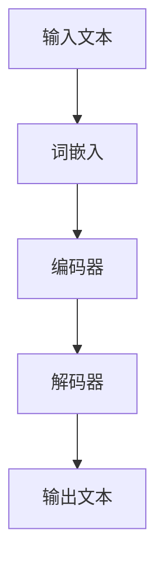

                 


### 《大规模语言模型的伦理推理与决策能力研究》

#### 关键词：大规模语言模型、伦理推理、决策能力、人工智能、伦理学

#### 摘要：
本文旨在探讨大规模语言模型的伦理推理与决策能力，分析其在人工智能领域的重要性和实际应用。通过对大规模语言模型的架构、伦理推理方法、决策算法以及案例分析的研究，本文揭示了大规模语言模型在伦理决策中的潜力和挑战。文章最终对未来发展趋势进行了展望，并提出了一些建议。

## 引言

### 1.1 大规模语言模型概述

大规模语言模型是近年来人工智能领域的重大突破。它们通过学习大量的文本数据，能够生成高质量的自然语言文本。这些模型在自然语言处理、机器翻译、问答系统等领域表现出色。随着技术的进步，大规模语言模型在处理复杂任务时展现出强大的能力，但同时也引发了一系列伦理问题。

### 1.2 伦理推理与决策能力的重要性

伦理推理与决策能力是人工智能系统在复杂环境下作出合理决策的关键。在人工智能系统中，如何确保其决策符合道德准则，避免造成负面影响，是一个亟待解决的问题。大规模语言模型作为人工智能的重要分支，其伦理推理与决策能力的研究具有重要意义。

### 1.3 研究目的与意义

本文旨在研究大规模语言模型的伦理推理与决策能力，探讨其在实际应用中的潜力和挑战。通过分析大规模语言模型的架构、伦理推理方法和决策算法，本文旨在提出一种有效的伦理决策框架，为人工智能系统的伦理设计提供参考。

## 理论基础

### 2.1 大规模语言模型的发展历程

大规模语言模型的发展经历了多个阶段。最早的语言模型是基于统计方法的N元语法模型。随着深度学习的兴起，基于神经网络的模型如循环神经网络（RNN）和长短期记忆网络（LSTM）逐渐成为主流。近年来，Transformer模型的引入推动了大规模语言模型的发展，使其在性能上取得了显著的提升。

### 2.2 伦理推理的理论基础

伦理推理是基于道德原则和价值观进行决策的过程。伦理学提供了核心概念和理论框架，如义务论、后果论和德性伦理学。在人工智能领域，伦理推理有助于确保系统的决策符合道德准则，避免对人类和社会造成负面影响。

### 2.3 决策能力的理论基础

决策能力是人工智能系统在不确定环境下作出合理决策的能力。决策理论提供了基本的框架和方法，如期望值理论、贝叶斯决策理论和多属性决策理论。在人工智能领域，决策能力的研究有助于提高系统的鲁棒性和可靠性。

## 模型架构

### 3.1 模型整体架构

大规模语言模型的整体架构通常包括词嵌入层、编码器和解码器。词嵌入层将文本转换为向量表示；编码器和解码器则负责学习输入和输出的上下文信息，生成高质量的文本。

### 3.2 主要组成部分详解

#### 3.2.1 词嵌入

词嵌入是将词汇映射到高维空间中的向量表示。词嵌入的关键技术包括词向量模型和上下文嵌入。

$$
\text{word\_vector} = \text{sigmoid}(\text{weights} \cdot \text{input})
$$

其中，$\text{sigmoid}$ 是一个非线性激活函数，$\text{weights}$ 是权重矩阵，$\text{input}$ 是输入向量。

#### 3.2.2 自注意力机制

自注意力机制是Transformer模型的核心组件。它通过计算输入序列中每个词与其他词之间的关系，生成权重向量，用于加权聚合信息。

$$
\text{attention\_weights} = \text{softmax}(\text{query} \cdot \text{keys}^T)
$$

其中，$\text{query}$、$\text{keys}$ 和 $\text{values}$ 分别是输入序列的查询、键和值，$\text{softmax}$ 是一个归一化函数。

#### 3.2.3 递归神经网络

递归神经网络（RNN）是一种处理序列数据的神经网络。通过循环结构，RNN能够捕捉序列中的时间依赖关系。然而，RNN存在梯度消失和梯度爆炸的问题。

$$
\text{output} = \text{sigmoid}(\text{weights} \cdot \text{input})
$$

其中，$\text{sigmoid}$ 是一个非线性激活函数，$\text{weights}$ 是权重矩阵，$\text{input}$ 是输入向量。

## 伦理推理能力

### 4.1 伦理推理方法

#### 4.1.1 基于规则的伦理推理

基于规则的伦理推理是通过定义一系列规则来指导决策。这些规则通常由伦理学家和社会科学家制定。

#### 4.1.2 基于案例的伦理推理

基于案例的伦理推理是通过分析历史案例来指导决策。这种方法依赖于大量的案例库和案例分析算法。

#### 4.1.3 基于神经网络的伦理推理

基于神经网络的伦理推理是通过训练神经网络来模拟人类的伦理推理过程。这种方法依赖于大规模的数据集和深度学习技术。

### 4.2 伦理推理原理讲解

#### 4.2.1 Mermaid流程图



### 4.3 伦理推理应用案例分析

#### 4.3.1 案例一：社交媒体内容审核

社交媒体平台使用大规模语言模型来审核用户生成的内容。模型需要识别并过滤掉不适当的言论和行为。

#### 4.3.2 案例二：自动驾驶车辆伦理决策

自动驾驶车辆在遇到道德困境时需要做出伦理决策。例如，当车辆无法避免撞向行人或障碍物时，如何选择最优策略。

## 决策能力

### 5.1 决策算法

#### 5.1.1 最大期望值算法

最大期望值算法是一种基于概率的决策算法。它通过计算不同决策策略的期望收益，选择期望收益最大的策略。

$$
\text{action} = \arg\max_{a} \sum_{s} p(s) \cdot \text{reward}(s, a)
$$

其中，$p(s)$ 是状态概率，$\text{reward}(s, a)$ 是状态和动作的奖励函数。

#### 5.1.2 贝叶斯决策理论

贝叶斯决策理论是一种基于概率和统计的决策理论。它通过计算不同决策策略的后验概率，选择后验概率最高的策略。

$$
\text{action} = \arg\max_{a} \sum_{s} p(s|a) \cdot p(a)
$$

其中，$p(s|a)$ 是给定动作的条件概率，$p(a)$ 是动作的概率。

#### 5.1.3 基于模型的决策算法

基于模型的决策算法是通过训练模型来预测未来的状态和收益，然后选择最优策略。

$$
\text{action} = \arg\max_{a} \sum_{s} \text{model}(s) \cdot p(s|a) \cdot p(a)
$$

其中，$\text{model}(s)$ 是模型对状态的概率分布预测。

### 5.2 决策原理讲解

#### 5.2.1 伪代码讲解

```python
def decision_algorithm(model, state):
    # 计算状态的概率分布
    probabilities = model.predict(state)
    
    # 计算不同动作的期望收益
    expected_rewards = [0] * num_actions
    for action in range(num_actions):
        for state in possible_states:
            expected_rewards[action] += probabilities[state] * reward(state, action)
    
    # 选择期望收益最大的动作
    return expected_rewards.index(max(expected_rewards))
```

### 5.3 决策能力应用案例分析

#### 5.3.1 案例一：金融风险评估

金融风险评估需要考虑多种因素，如市场波动、信用风险等。通过大规模语言模型，可以预测不同策略的潜在收益，并选择最优策略。

#### 5.3.2 案例二：智能医疗诊断

智能医疗诊断需要考虑患者的病史、症状等多种信息。通过大规模语言模型，可以分析这些信息，并提供诊断建议。

## 案例分析

### 6.1 案例一：大规模语言模型在社交媒体中的应用

#### 6.1.1 案例背景

社交媒体平台面临着大量不适当内容的审核挑战。为了解决这个问题，平台采用了大规模语言模型进行内容审核。

#### 6.1.2 伦理推理与决策能力应用

大规模语言模型通过分析用户生成的内容，识别潜在的违规行为，并作出相应的决策，如删除或标记为敏感内容。

### 6.2 案例二：大规模语言模型在金融领域的应用

#### 6.2.1 案例背景

金融领域面临着复杂的决策问题，如风险评估和投资策略选择。大规模语言模型在金融领域展现出强大的决策能力。

#### 6.2.2 伦理推理与决策能力应用

大规模语言模型通过分析市场数据和历史交易记录，预测未来的市场走势，并提供投资建议。

## 未来展望

### 7.1 大规模语言模型发展趋势

大规模语言模型将继续在人工智能领域发挥重要作用。随着数据量的增加和计算能力的提升，大规模语言模型将变得更加智能和高效。

### 7.2 伦理推理与决策能力的挑战与机遇

大规模语言模型的伦理推理与决策能力面临一系列挑战，如数据隐私、算法偏见和道德责任。同时，这些挑战也带来了新的机遇，如更加智能和可靠的决策系统。

### 7.3 研究展望与建议

未来研究应关注大规模语言模型的伦理推理与决策能力，并提出有效的解决方案。同时，应加强跨学科合作，促进伦理学和计算机科学的发展。

## 结论

### 8.1 主要观点回顾

本文探讨了大规模语言模型的伦理推理与决策能力，分析了其在实际应用中的潜力和挑战。通过理论分析、模型架构和案例分析，本文揭示了大规模语言模型在伦理决策中的重要性。

### 8.2 研究贡献

本文为人工智能系统的伦理设计提供了参考，并提出了一些有效的方法和框架。

### 8.3 下一步研究方向

未来研究应关注大规模语言模型的伦理推理与决策能力的优化，以及跨学科合作在人工智能伦理研究中的应用。

## 作者信息

作者：AI天才研究院/AI Genius Institute & 禅与计算机程序设计艺术 /Zen And The Art of Computer Programming

