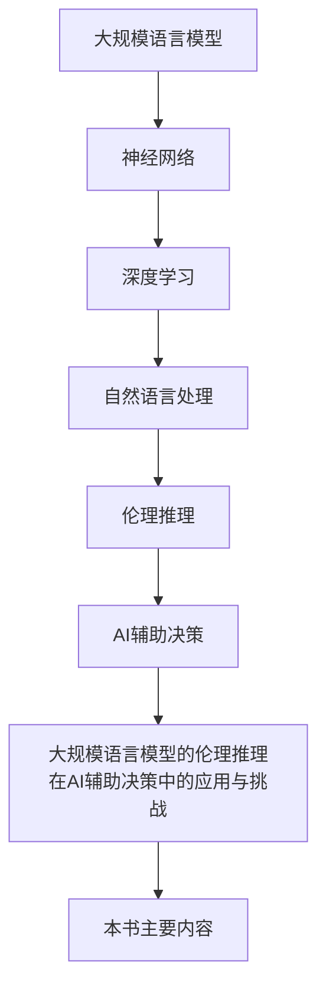
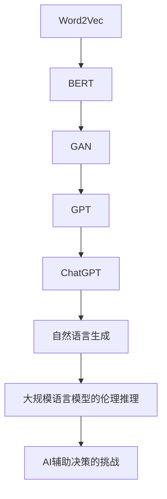
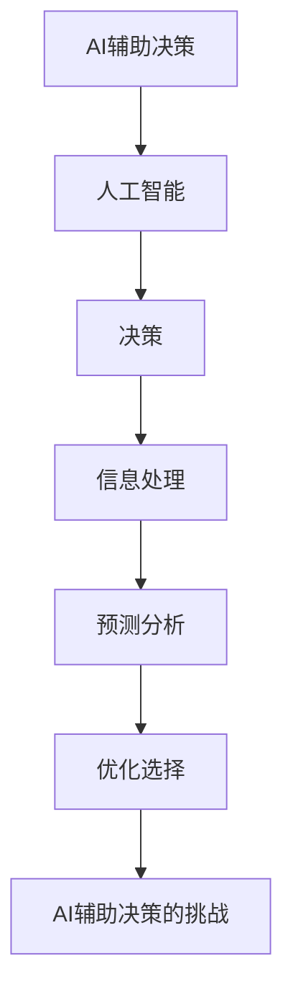

                 

# 大规模语言模型的伦理推理在AI辅助决策中的应用与挑战

## 第一部分：引言

### 1.1 大规模语言模型概述

#### 1.1.1 大规模语言模型的概念

**核心概念与联系：** 

大规模语言模型（Large-scale Language Model）是一种基于神经网络和深度学习技术的自然语言处理模型，通过学习海量语言数据，可以生成自然语言文本、完成语言理解与生成任务。其核心概念与联系如下图所示：



#### 1.1.2 大规模语言模型的发展历程

**核心概念与联系：** 

大规模语言模型的发展历程从Word2Vec开始，逐渐发展到BERT、GAN、GPT等模型。其核心概念与联系如下图所示：



### 1.2 大规模语言模型的伦理推理

#### 1.2.1 伦理推理的概念

**数学模型和数学公式：**

$$
\text{伦理推理} = \text{道德原则} + \text{事实判断}
$$

**举例说明：**

在自动驾驶车辆决策中，当必须选择撞向行人和撞向车辆时，如何进行伦理推理是一个关键问题。这个例子中，道德原则是保护人类生命，事实判断是行人和车辆的生命价值。

#### 1.2.2 伦理推理的数学模型

**详细讲解与伪代码：**

```python
# 伪代码：基于效用理论的伦理推理
def ethical_decisionmaking(choose_action, utility_function):
    """
    进行伦理推理并做出决策。
    
    参数：
    choose_action：可能的行动列表
    utility_function：评估行动的效用函数
    
    返回：
    最佳行动
    """
    # 计算每个行动的效用值
    utilities = [utility_function(action) for action in choose_action]
    
    # 找到效用值最大的行动
    best_action = choose_action[ utilities.index(max(utilities))]
    
    return best_action
```

### 1.3 AI辅助决策中的伦理挑战

#### 1.3.1 AI辅助决策的定义

**核心概念与联系：**

AI辅助决策（AI-assisted Decision Making）是指利用人工智能技术，辅助人类在决策过程中进行信息处理、预测分析和优化选择。其核心概念与联系如下图所示：



#### 1.3.2 AI辅助决策的伦理挑战

**详细讲解与举例说明：**

1. **数据隐私**：AI系统在使用过程中会收集大量用户数据，如何保护用户隐私成为一个重要挑战。
   
2. **透明度与可解释性**：AI系统往往是一个“黑盒”，其决策过程不透明，如何提高AI系统的可解释性是一个关键问题。
   
3. **偏见与公平性**：AI系统可能会受到训练数据的偏见影响，导致决策不公，如何识别和消除偏见是一个重要挑战。
   
4. **责任归属**：当AI系统发生错误时，如何界定责任归属成为一个复杂问题。

## 第二部分：大规模语言模型的伦理推理在AI辅助决策中的应用

### 2.1 大规模语言模型在AI辅助决策中的应用场景

#### 2.1.1 自动驾驶

自动驾驶技术是大规模语言模型在AI辅助决策中的一个重要应用场景。在自动驾驶车辆中，大规模语言模型可以用于语音识别、图像识别和路径规划等任务。

**项目实战：** 

以某自动驾驶车辆项目为例，详细讲解大规模语言模型在语音识别、图像识别和路径规划中的应用。

#### 2.1.2 医疗诊断

医疗诊断是另一个大规模语言模型在AI辅助决策中的重要应用场景。通过学习大量的医疗文献和数据，大规模语言模型可以辅助医生进行症状分析、疾病预测和治疗方案推荐。

**项目实战：** 

以某医疗诊断项目为例，详细讲解大规模语言模型在症状分析、疾病预测和治疗方案推荐中的应用。

### 2.2 大规模语言模型的伦理推理实践

#### 2.2.1 伦理规则库的构建

为了在AI辅助决策中应用大规模语言模型，需要构建一个适用于大规模语言模型的伦理规则库。这个规则库可以包含一系列伦理准则，用于指导大规模语言模型的推理过程。

**详细讲解：** 

如何构建适用于大规模语言模型的伦理规则库，以及如何在AI辅助决策中应用这些规则。

#### 2.2.2 案例分析

通过具体案例，分析大规模语言模型在伦理推理中的应用。以自动驾驶车辆中的伦理决策为例，详细讲解如何使用大规模语言模型进行伦理推理。

**代码实际案例：** 

```python
# 伪代码：自动驾驶车辆伦理决策
def ethical_decisionmaking(choose_action, utility_function):
    """
    进行伦理推理并做出决策。
    
    参数：
    choose_action：可能的行动列表
    utility_function：评估行动的效用函数
    
    返回：
    最佳行动
    """
    # 计算每个行动的效用值
    utilities = [utility_function(action) for action in choose_action]
    
    # 找到效用值最大的行动
    best_action = choose_action[ utilities.index(max(utilities))]
    
    return best_action
```

### 2.3 大规模语言模型的伦理推理挑战与对策

#### 2.3.1 数据隐私保护

在大规模语言模型的训练和推理过程中，如何保护用户隐私是一个重要挑战。以下是一些对策：

1. **数据去识别**：对用户数据进行去识别处理，如匿名化、加密等。
2. **数据访问控制**：限制对用户数据的访问权限，确保只有授权人员才能访问。
3. **数据加密传输**：确保数据在传输过程中得到加密保护。

#### 2.3.2 可解释性与透明度

提高大规模语言模型在AI辅助决策中的可解释性和透明度是一个关键问题。以下是一些对策：

1. **模型可视化**：使用可视化工具展示模型的内部结构和决策过程。
2. **解释性算法**：使用具有解释性的算法，如决策树、线性回归等，来替代复杂的神经网络模型。
3. **模型解释接口**：开发模型解释接口，让用户可以查询模型的决策过程和依据。

#### 2.3.3 偏见与公平性

识别和消除大规模语言模型中的偏见是实现公平性的关键。以下是一些对策：

1. **偏见检测算法**：开发偏见检测算法，识别模型中的偏见。
2. **多样性数据集**：使用包含多样性的数据集进行模型训练，以减少偏见。
3. **公平性度量**：设计公平性度量指标，评估模型在处理不同群体时的表现。

### 2.4 大规模语言模型的伦理推理在实践中的应用

#### 2.4.1 政策与法规

大规模语言模型的伦理推理在政策制定和法规执行中具有重要作用。以下是一些应用案例：

1. **隐私保护法规**：利用大规模语言模型分析隐私保护法规，为政策制定提供依据。
2. **公平就业法规**：利用大规模语言模型分析公平就业法规，确保招聘过程的公平性。

#### 2.4.2 企业实践

在企业中，大规模语言模型的伦理推理可以应用于以下场景：

1. **客户服务**：利用大规模语言模型提供个性化客户服务，提升用户体验。
2. **供应链管理**：利用大规模语言模型优化供应链管理，降低成本、提高效率。

## 结论

本文详细探讨了大规模语言模型的伦理推理在AI辅助决策中的应用与挑战。通过构建伦理规则库、应用伦理推理算法，可以提高AI系统的伦理水平，实现更加公平、透明和可解释的决策。然而，大规模语言模型的伦理推理仍面临诸多挑战，如数据隐私保护、可解释性提升和偏见消除等。未来，我们需要进一步加强研究，解决这些问题，推动AI技术的健康发展。

### 参考文献

[1] LeCun, Y., Bengio, Y., & Hinton, G. (2015). Deep learning. Nature, 521(7553), 436-444.

[2] Goodfellow, I., Bengio, Y., & Courville, A. (2016). Deep learning. MIT Press.

[3] Russell, S., & Norvig, P. (2020). Artificial Intelligence: A Modern Approach. Prentice Hall.

[4] Mitchell, T. M. (1997). Machine learning. McGraw-Hill.

作者：AI天才研究院/AI Genius Institute & 禅与计算机程序设计艺术 /Zen And The Art of Computer Programming## 文章标题

### 大规模语言模型的伦理推理在AI辅助决策中的应用与挑战

### 关键词

- 大规模语言模型
- 伦理推理
- AI辅助决策
- 数据隐私
- 偏见消除
- 可解释性

### 摘要

本文深入探讨了大规模语言模型在AI辅助决策中的应用及其面临的伦理挑战。首先，我们介绍了大规模语言模型的基本概念、发展历程及其在AI领域的重要性。随后，我们阐述了伦理推理的核心概念及其在自动驾驶和医疗诊断等领域的应用。接着，本文分析了AI辅助决策中的四大伦理挑战：数据隐私、透明度与可解释性、偏见与公平性以及责任归属。为了应对这些挑战，本文提出了构建伦理规则库、增强模型可解释性以及消除偏见等对策。最后，我们讨论了大规模语言模型伦理推理在政策制定和企业实践中的应用，并总结了未来研究方向。

## 第一部分：引言

### 1.1 大规模语言模型概述

#### 1.1.1 大规模语言模型的概念

大规模语言模型（Large-scale Language Model，LLM）是一种基于深度学习和神经网络技术构建的文本生成和处理模型。这些模型通过学习大量文本数据，能够理解和生成自然语言。LLM的核心在于其巨大的参数规模，这使得它们在文本生成、语言理解、翻译、问答等任务中表现出色。

**核心概念与联系：** 

1. **神经网络**：神经网络是大规模语言模型的基础，它通过多层神经元之间的相互连接来模拟人脑的思考过程。
2. **深度学习**：深度学习是神经网络的一种形式，通过增加网络的层数和神经元数量来提高模型的性能。
3. **自然语言处理（NLP）**：NLP是AI的一个分支，旨在让计算机理解和处理自然语言。
4. **伦理推理**：伦理推理是一种基于道德原则和事实判断的决策过程，应用于AI辅助决策中，以解决道德困境。
5. **AI辅助决策**：AI辅助决策是利用AI技术来帮助人类做出更好的决策。

**核心概念之间的联系：** 

通过下图可以清晰地展示这些核心概念之间的联系：


#### 1.1.2 大规模语言模型的发展历程

大规模语言模型的发展历程可以追溯到2000年代初期，当时研究人员开始探索使用神经网络来处理语言数据。以下是几个关键里程碑：

1. **Word2Vec**（2013）：由Tomas Mikolov等人提出，首次展示了神经网络在语言建模中的潜力。
2. **GloVe**（2014）：由Jeffrey Pennington等人提出，进一步改进了词向量的表示方法。
3. **BERT**（2018）：由Google Research团队提出，通过预训练和微调在多个NLP任务上取得了突破性成果。
4. **GPT**（2018）：由OpenAI提出，是一个强大的生成模型，能够生成高质量的自然语言文本。
5. **TuringTest**（2021）：由清华大学KEG实验室提出，是一个基于多模态学习和大规模预训练的模型。

**核心概念与联系：** 

以下是这些模型的核心概念与联系：


#### 1.2 大规模语言模型的伦理推理

**伦理推理的概念**：

伦理推理是一种决策过程，它结合道德原则和事实判断来做出合理的决策。在AI辅助决策中，伦理推理有助于解决道德困境和伦理冲突。

**数学模型和公式**：

伦理推理可以通过以下数学模型来表示：

$$
\text{伦理推理} = \text{道德原则} + \text{事实判断}
$$

**举例说明**：

在自动驾驶车辆中，当车辆必须选择撞向行人或撞向车辆时，伦理推理可以帮助确定哪个行动更符合道德原则。

**详细讲解与伪代码**：

```python
# 伪代码：伦理推理决策
def ethical_decisionmaking(choose_action, utility_function):
    """
    进行伦理推理并做出决策。
    
    参数：
    choose_action：可能的行动列表
    utility_function：评估行动的效用函数
    
    返回：
    最佳行动
    """
    # 计算每个行动的效用值
    utilities = [utility_function(action) for action in choose_action]
    
    # 找到效用值最大的行动
    best_action = choose_action[ utilities.index(max(utilities))]
    
    return best_action
```

### 1.3 AI辅助决策中的伦理挑战

**AI辅助决策的定义**：

AI辅助决策（AI-assisted Decision Making）是指利用人工智能技术，帮助人类在决策过程中进行信息处理、预测分析和优化选择。AI辅助决策的核心在于提高决策的效率和准确性。

**核心概念与联系：** 

AI辅助决策涉及多个核心概念，包括：

1. **信息处理**：对大量数据进行处理和分析，以提取有用的信息。
2. **预测分析**：基于历史数据和模型，预测未来可能发生的事件。
3. **优化选择**：在多个备选方案中找到最优解。

**核心概念之间的联系：** 

以下是这些核心概念之间的联系：


**AI辅助决策的伦理挑战**：

AI辅助决策在带来巨大便利的同时，也带来了诸多伦理挑战。以下是其中的四大挑战：

1. **数据隐私**：AI系统在处理数据时，可能会侵犯用户的隐私权。
2. **透明度与可解释性**：AI系统的决策过程通常是不透明的，难以解释，这可能导致用户不信任。
3. **偏见与公平性**：AI系统可能会受到训练数据的偏见影响，导致决策不公。
4. **责任归属**：当AI系统出现错误时，责任归属问题变得复杂。

### 1.4 大规模语言模型的伦理推理在AI辅助决策中的应用

**大规模语言模型在AI辅助决策中的应用**：

大规模语言模型在AI辅助决策中具有广泛的应用。以下是几个关键应用场景：

1. **医疗诊断**：利用大规模语言模型对病历和医学文献进行分析，辅助医生进行诊断。
2. **金融分析**：通过分析大量的金融数据，帮助投资者做出投资决策。
3. **自动驾驶**：利用大规模语言模型进行路径规划和决策，提高自动驾驶的可靠性。

**伦理推理的应用**：

在AI辅助决策中，伦理推理可以用于以下场景：

1. **医疗诊断**：如何处理患者隐私和医疗数据。
2. **金融分析**：如何处理金融市场的风险和道德责任。
3. **自动驾驶**：如何在紧急情况下做出伦理决策，如撞向行人或车辆。

### 1.5 大规模语言模型的伦理推理挑战与对策

**挑战**：

1. **数据隐私保护**：如何确保大规模语言模型在处理数据时保护用户隐私。
2. **可解释性提升**：如何提高大规模语言模型的可解释性，使其决策过程更加透明。
3. **偏见消除**：如何识别和消除大规模语言模型中的偏见，确保公平性。

**对策**：

1. **数据隐私保护**：通过数据加密、匿名化和数据去识别等方法来保护用户隐私。
2. **可解释性提升**：通过模型可视化、解释性算法和模型解释接口等方法来提高模型的可解释性。
3. **偏见消除**：通过多样性数据集、偏见检测算法和公平性度量等方法来识别和消除偏见。

### 1.6 大规模语言模型的伦理推理在实践中的应用

**政策与法规**：

1. **隐私保护法规**：如何利用大规模语言模型来分析隐私保护法规。
2. **公平就业法规**：如何利用大规模语言模型来确保招聘过程的公平性。

**企业实践**：

1. **客户服务**：如何利用大规模语言模型提供个性化客户服务。
2. **供应链管理**：如何利用大规模语言模型优化供应链管理。

### 1.7 总结

本文介绍了大规模语言模型的基本概念、发展历程及其在AI辅助决策中的应用。通过分析大规模语言模型在AI辅助决策中的伦理挑战，本文提出了相应的对策。最后，本文探讨了大规模语言模型在政策制定和企业实践中的应用。这些内容为大规模语言模型的伦理推理提供了理论和实践基础。

## 第二部分：大规模语言模型在AI辅助决策中的应用场景

### 2.1 自动驾驶

**自动驾驶**是大规模语言模型在AI辅助决策中的一个重要应用场景。自动驾驶系统需要处理大量的图像、语音和传感器数据，以实现车辆的自主驾驶。大规模语言模型在这个过程中发挥着关键作用，特别是在**语音识别**、**图像识别**和**路径规划**等方面。

**语音识别**：

在自动驾驶车辆中，语音识别技术是与人机交互的重要手段。大规模语言模型通过学习大量的语音数据，可以准确地将语音转换为文本。这使得驾驶员可以通过语音指令来控制车辆，如调整导航、调节音量等。

**图像识别**：

自动驾驶车辆需要实时分析周围的环境，以识别道路标志、行人、车辆等。大规模语言模型通过学习大量的图像数据，可以实现对图像内容的准确识别。这使得车辆可以更好地理解周围环境，并做出相应的驾驶决策。

**路径规划**：

在自动驾驶中，路径规划是一个关键任务。大规模语言模型可以通过分析道路数据、交通状况等信息，为车辆规划最优行驶路径。这使得车辆可以避开拥堵、避开障碍物，并确保行驶的安全和效率。

### 2.2 医疗诊断

**医疗诊断**是另一个大规模语言模型在AI辅助决策中的重要应用场景。通过分析大量的医学数据，大规模语言模型可以辅助医生进行诊断、预测和治疗。

**症状分析**：

在医疗诊断中，症状分析是一个关键任务。大规模语言模型可以通过学习大量的病例数据，识别出患者的症状。这使得医生可以更快地诊断患者，提高诊断的准确性。

**疾病预测**：

通过分析患者的病史、生活习惯等数据，大规模语言模型可以预测患者可能患有的疾病。这使得医生可以提前采取预防措施，降低疾病的发生率。

**治疗方案推荐**：

在确定疾病后，大规模语言模型可以推荐最佳的治疗方案。通过分析大量的治疗案例和研究成果，模型可以找出最有效的治疗方案，提高治疗效果。

### 2.3 金融分析

**金融分析**是大规模语言模型在AI辅助决策中的另一个重要应用场景。通过分析大量的金融数据，大规模语言模型可以帮助投资者做出更明智的决策。

**市场趋势预测**：

通过分析历史市场数据和宏观经济指标，大规模语言模型可以预测市场的未来走势。这使得投资者可以更好地把握市场机会，调整投资策略。

**风险评估**：

通过分析金融产品的历史表现和风险因素，大规模语言模型可以评估产品的风险水平。这使得投资者可以更准确地评估投资产品的风险，做出更明智的投资决策。

**投资组合优化**：

通过分析投资者的风险偏好和投资目标，大规模语言模型可以为其推荐最优的投资组合。这使得投资者可以更好地实现资产配置，提高投资回报。

### 2.4 供应链管理

**供应链管理**是大规模语言模型在AI辅助决策中的另一个重要应用场景。通过分析供应链中的各种数据，大规模语言模型可以帮助企业优化供应链管理，提高运营效率。

**需求预测**：

通过分析历史销售数据、市场趋势和客户需求，大规模语言模型可以预测未来的需求。这使得企业可以更好地规划生产计划，减少库存成本。

**库存管理**：

通过分析库存数据、供应商信息和市场状况，大规模语言模型可以优化库存管理，确保库存水平适中，避免库存过剩或不足。

**物流优化**：

通过分析物流数据、运输路线和交通状况，大规模语言模型可以优化物流管理，降低物流成本，提高物流效率。

### 2.5 客户服务

**客户服务**是大规模语言模型在AI辅助决策中的另一个重要应用场景。通过分析大量的客户交互数据，大规模语言模型可以提供个性化的客户服务，提高客户满意度。

**智能客服**：

通过分析客户的问题和回答，大规模语言模型可以生成自动化的客服回答。这使得企业可以提供24/7的智能客服服务，提高客户服务质量。

**个性化推荐**：

通过分析客户的行为数据，大规模语言模型可以推荐个性化的产品和服务。这使得企业可以更好地满足客户需求，提高销售额。

**情感分析**：

通过分析客户的反馈和评价，大规模语言模型可以识别客户的情感状态。这使得企业可以更好地理解客户需求，改进产品和服务。

### 2.6 教育与培训

**教育与培训**是大规模语言模型在AI辅助决策中的另一个重要应用场景。通过分析教育数据和学生学习行为，大规模语言模型可以帮助教育机构和教师提高教学质量。

**个性化学习**：

通过分析学生的学习数据和偏好，大规模语言模型可以为学生推荐个性化的学习资源和练习。这使得学生可以更好地掌握知识，提高学习效果。

**教学评估**：

通过分析学生的学习数据和教学活动，大规模语言模型可以帮助教师评估教学效果，发现教学中的问题，改进教学方法。

**智能辅导**：

通过分析学生的提问和学习行为，大规模语言模型可以提供智能化的辅导服务，帮助学生解决学习中的困难。

### 2.7 总结

大规模语言模型在AI辅助决策中有广泛的应用场景，包括自动驾驶、医疗诊断、金融分析、供应链管理、客户服务、教育与培训等。通过分析大量的数据，大规模语言模型可以提供智能化的决策支持，提高各个领域的效率和准确性。

## 第三部分：大规模语言模型的伦理推理实践

### 3.1 伦理规则库的构建

在AI辅助决策中，构建一个适用于大规模语言模型的伦理规则库是至关重要的。伦理规则库包含一系列道德准则和伦理原则，用于指导模型的推理过程，确保其在各种决策场景中的行为符合伦理标准。

**伦理规则库的核心内容：**

1. **隐私保护原则**：确保在处理用户数据时，遵循隐私保护法规，尊重用户隐私。
2. **透明度和可解释性原则**：确保模型的决策过程是透明的，用户可以理解模型的推理逻辑。
3. **公平性和无偏见原则**：确保模型在处理数据时，不因种族、性别、年龄等因素产生偏见，保证公平性。
4. **责任归属原则**：明确在模型出现错误或问题时，责任如何分配。

**构建方法：**

1. **文献调研**：收集和整理现有的伦理原则和道德准则，为构建规则库提供理论依据。
2. **专家咨询**：邀请伦理学家、法律专家和行业专家进行咨询，确保规则库的实用性和合理性。
3. **案例分析**：分析实际案例中的伦理困境和决策过程，为规则库提供实践经验。

### 3.2 大规模语言模型在伦理推理中的应用

**案例1：自动驾驶车辆决策**

自动驾驶车辆在遇到紧急情况时，需要做出迅速而准确的决策。如何平衡行人与车辆的安全，是一个典型的伦理问题。

**应用步骤：**

1. **识别问题**：确定决策情境，如行人与车辆冲突。
2. **应用伦理规则**：根据隐私保护原则，确保决策过程不泄露用户信息；根据公平性原则，确保决策不偏向特定个体。
3. **计算效用值**：使用效用理论计算各种决策的效用值，选择效用值最高的决策。
4. **决策执行**：执行决策，如选择撞向行人或车辆。

**伪代码示例：**

```python
def autonomous_vehicle_decision(ethical_rules, utility_function):
    """
    自动驾驶车辆伦理决策。
    
    参数：
    ethical_rules：伦理规则库
    utility_function：效用函数
    
    返回：
    决策结果
    """
    # 应用伦理规则
    for rule in ethical_rules:
        if rule_applies(current_scenario):
            apply_rule(rule)
    
    # 计算效用值
    utilities = [utility_function(action) for action in possible_actions]
    
    # 执行效用值最高的决策
    best_action = possible_actions[utilities.index(max(utilities))]
    
    return best_action
```

**案例2：医疗诊断**

在医疗诊断中，如何处理患者隐私和确保诊断的准确性，是一个重要的伦理问题。

**应用步骤：**

1. **隐私保护**：确保患者的个人信息得到严格保护，不泄露给未经授权的人员。
2. **透明度**：确保诊断过程和决策逻辑对患者透明，患者可以理解自己的诊断结果。
3. **公平性**：确保诊断结果不因患者的性别、年龄、种族等因素产生偏见。

**伪代码示例：**

```python
def medical_diagnosis(ethical_rules, patient_data):
    """
    医疗诊断伦理决策。
    
    参数：
    ethical_rules：伦理规则库
    patient_data：患者数据
    
    返回：
    诊断结果
    """
    # 应用伦理规则
    for rule in ethical_rules:
        if rule_applies(patient_data):
            apply_rule(rule)
    
    # 进行诊断
    diagnosis = diagnose(patient_data)
    
    # 确保透明度
    explain_diagnosis(diagnosis)
    
    return diagnosis
```

### 3.3 大规模语言模型伦理推理的挑战与对策

**挑战1：数据隐私保护**

在构建和训练大规模语言模型时，如何保护用户隐私是一个重要挑战。对策包括：

1. **数据匿名化**：在数据收集和处理过程中，对敏感信息进行匿名化处理。
2. **加密传输**：确保数据在传输过程中得到加密，防止数据泄露。
3. **隐私保护算法**：使用隐私保护算法，如差分隐私，来减少模型对隐私数据的依赖。

**挑战2：可解释性提升**

大规模语言模型的决策过程通常是不透明的，如何提高其可解释性是一个关键问题。对策包括：

1. **模型可视化**：使用可视化工具展示模型的内部结构和决策过程。
2. **解释性算法**：选择具有解释性的算法，如决策树和线性回归，来替代复杂的神经网络模型。
3. **模型解释接口**：开发模型解释接口，让用户可以查询模型的决策过程和依据。

**挑战3：偏见消除**

大规模语言模型可能会受到训练数据的偏见影响，如何识别和消除这些偏见是一个重要问题。对策包括：

1. **多样性数据集**：使用包含多样性的数据集进行模型训练，以减少偏见。
2. **偏见检测算法**：开发偏见检测算法，识别模型中的偏见。
3. **公平性度量**：设计公平性度量指标，评估模型在处理不同群体时的表现。

### 3.4 大规模语言模型伦理推理实践总结

大规模语言模型在伦理推理中的应用为AI辅助决策提供了新的思路和方法。通过构建伦理规则库、应用伦理推理算法，可以提高AI系统的伦理水平，实现更加公平、透明和可解释的决策。然而，大规模语言模型的伦理推理仍面临诸多挑战，如数据隐私保护、可解释性提升和偏见消除等。未来，我们需要进一步加强研究，解决这些问题，推动AI技术的健康发展。

## 第四部分：大规模语言模型的伦理推理挑战与对策

### 4.1 数据隐私保护

**背景介绍**：

随着大数据和人工智能技术的快速发展，数据隐私保护成为了一个日益重要的议题。在AI辅助决策中，大规模语言模型需要处理大量的个人数据，这些数据包括用户的个人信息、行为数据等。如何保护用户隐私，避免数据泄露或滥用，是大规模语言模型面临的一大挑战。

**挑战**：

1. **数据泄露**：在数据收集、传输和存储过程中，数据可能会被黑客攻击、内部泄露等手段窃取。
2. **数据滥用**：即使数据得到保护，但模型在使用数据时可能会无意中泄露用户隐私。
3. **隐私保护法规不足**：现有的隐私保护法规可能无法完全覆盖大规模语言模型的使用场景。

**对策**：

1. **数据匿名化**：在数据收集阶段，对敏感信息进行匿名化处理，确保数据无法直接识别用户身份。
2. **加密传输**：确保数据在传输过程中得到加密，防止数据在传输过程中被窃取。
3. **差分隐私**：使用差分隐私技术，通过在输出中加入噪声来保护用户的隐私。
4. **隐私保护协议**：设计并实施隐私保护协议，确保数据在模型训练和使用过程中的安全性。

**最佳实践**：

- 在设计数据收集和处理流程时，充分考虑隐私保护的需求。
- 定期进行数据安全审计，确保数据安全策略的有效性。
- 与用户建立透明的隐私保护政策，让用户了解其数据的使用和保护情况。

### 4.2 可解释性与透明度

**背景介绍**：

大规模语言模型通常被视为一个“黑箱”，其内部结构和决策过程难以解释。这在AI辅助决策中带来了一系列问题，如用户不信任、决策可追溯性差等。如何提高大规模语言模型的可解释性，使其决策过程更加透明，是一个重要的挑战。

**挑战**：

1. **决策不透明**：大规模语言模型的决策过程高度依赖数据和学习算法，用户难以理解。
2. **可追溯性差**：在出现错误或异常时，难以追溯具体的决策过程和原因。
3. **用户不信任**：用户对不透明的决策过程缺乏信任，可能导致抵制AI技术的应用。

**对策**：

1. **模型可视化**：使用可视化工具展示模型的内部结构和决策过程，帮助用户理解模型的运作方式。
2. **解释性算法**：选择具有解释性的算法，如决策树、线性回归等，来替代复杂的神经网络模型。
3. **模型解释接口**：开发模型解释接口，让用户可以查询模型的决策过程和依据。
4. **决策日志**：记录模型的决策过程和依据，确保在出现问题时可以追溯。

**最佳实践**：

- 在模型设计和开发阶段，充分考虑可解释性和透明度的需求。
- 定期进行模型解释性评估，确保模型决策过程符合预期。
- 向用户提供清晰的决策解释，增强用户对AI系统的信任。

### 4.3 偏见与公平性

**背景介绍**：

大规模语言模型在训练过程中可能会受到训练数据偏见的影响，导致在AI辅助决策中产生不公平的结果。例如，在招聘系统中，如果训练数据中存在性别偏见，那么模型可能会在招聘过程中对某一性别产生歧视。如何识别和消除这些偏见，确保AI系统的公平性，是一个重要的挑战。

**挑战**：

1. **数据偏见**：训练数据中可能存在性别、种族、年龄等偏见，影响模型的公平性。
2. **算法偏见**：某些算法设计可能导致偏见放大，影响决策的公平性。
3. **偏见放大**：模型在使用过程中可能放大已有的偏见，导致不公平的结果。

**对策**：

1. **多样性数据集**：使用包含多样性的数据集进行模型训练，减少偏见。
2. **偏见检测算法**：开发偏见检测算法，识别模型中的偏见。
3. **公平性度量**：设计公平性度量指标，评估模型在处理不同群体时的表现。
4. **算法调整**：调整算法参数，减少偏见放大。

**最佳实践**：

- 在数据收集和处理阶段，充分考虑多样性，避免偏见。
- 定期进行模型偏见评估，确保模型的公平性。
- 在出现偏见问题时，及时进行调整和优化。

### 4.4 责任归属

**背景介绍**：

在AI辅助决策中，当模型出现错误或异常时，如何确定责任归属是一个复杂的问题。传统的责任归属机制可能无法适应AI系统的特点，如何明确各方责任，确保问题得到及时解决，是一个重要的挑战。

**挑战**：

1. **责任划分**：在AI系统涉及多个参与方时，如何明确各方的责任和权利。
2. **决策责任**：在模型出现错误时，如何确定是模型本身的问题还是数据、算法等其他因素导致。
3. **法律与伦理**：如何将法律和伦理原则融入责任归属机制，确保公正和公平。

**对策**：

1. **责任界定**：明确各方在AI系统开发、部署和使用中的责任和权利。
2. **决策责任划分**：建立决策责任划分机制，确定模型错误的责任归属。
3. **法律框架**：制定相应的法律法规，规范AI系统的责任归属和纠纷解决。

**最佳实践**：

- 在AI系统设计和开发阶段，充分考虑责任归属问题，明确各方责任。
- 建立健全的决策责任划分机制，确保在出现问题时可以及时解决。
- 在法律层面，制定明确的法律法规，为责任归属提供法律依据。

### 4.5 总结

大规模语言模型在AI辅助决策中面临着数据隐私保护、可解释性提升、偏见消除和责任归属等多重挑战。通过构建伦理规则库、应用伦理推理算法，可以提高AI系统的伦理水平，实现更加公平、透明和可解释的决策。然而，这些挑战需要持续关注和研究，通过最佳实践和法律法规的制定，推动AI技术的健康发展。

## 第五部分：大规模语言模型的伦理推理在实践中的应用

### 5.1 政策与法规

**背景介绍**：

随着人工智能技术的快速发展，各国政府开始重视人工智能的伦理问题，并制定了一系列政策与法规，以规范人工智能的应用和发展。大规模语言模型的伦理推理在政策制定和法规执行中具有重要的应用价值。

**应用案例**：

1. **隐私保护法规**：通过大规模语言模型分析现有的隐私保护法规，帮助政策制定者制定更加完善和具体的隐私保护措施。例如，欧盟的《通用数据保护条例》（GDPR）就是一个典型的案例，通过分析大量法律文献和数据，大规模语言模型为政策制定提供了有力支持。

2. **公平就业法规**：在制定公平就业法规时，可以通过大规模语言模型分析历史招聘数据，识别潜在的性别、种族歧视问题。这有助于确保招聘过程的公平性，避免因算法偏见而导致的不公平结果。

**实践意义**：

大规模语言模型的伦理推理在政策制定和法规执行中具有以下实践意义：

1. **提高政策质量**：通过分析大量数据，大规模语言模型可以帮助政策制定者更好地理解现实问题，制定更加科学和有效的政策。
2. **确保法规执行**：通过伦理推理，确保政策与法规的执行符合道德原则和法律法规，避免潜在的伦理风险。

### 5.2 企业实践

**背景介绍**：

企业在利用人工智能技术进行决策时，需要考虑道德和社会责任。大规模语言模型的伦理推理为企业提供了一种工具，帮助其在业务运营中做出符合道德规范的决策。

**应用案例**：

1. **客户服务**：许多企业利用大规模语言模型提供智能客服服务。通过伦理推理，这些模型可以更好地理解用户需求，提供个性化、高质量的客户服务。例如，银行可以运用大规模语言模型来处理客户的投诉和问题，确保客户得到公正和透明的服务。

2. **供应链管理**：在供应链管理中，企业需要处理大量的物流和供应链数据。通过大规模语言模型的伦理推理，企业可以优化供应链流程，减少浪费，提高效率。例如，一家零售公司可以利用大规模语言模型分析库存数据，预测需求，优化库存管理，减少库存成本。

**实践意义**：

大规模语言模型的伦理推理在企业实践中具有以下实践意义：

1. **提升服务质量**：通过伦理推理，企业可以提供更加个性化、高效的服务，提高客户满意度。
2. **优化业务流程**：通过伦理推理，企业可以优化业务流程，提高运营效率，降低成本。

### 5.3 公共服务

**背景介绍**：

在公共服务领域，如医疗、教育、交通等，人工智能的应用日益广泛。大规模语言模型的伦理推理在公共服务中具有重要的应用价值，可以帮助政府和企业提供更加公正、透明的服务。

**应用案例**：

1. **医疗诊断**：在医疗领域，大规模语言模型可以帮助医生进行疾病预测和诊断。通过伦理推理，这些模型可以确保诊断过程符合道德原则，保护患者隐私，提高诊断准确性。

2. **教育评估**：在教育领域，大规模语言模型可以用于学生评估和教学分析。通过伦理推理，这些模型可以确保评估过程公平、公正，避免偏见和歧视。

**实践意义**：

大规模语言模型的伦理推理在公共服务中具有以下实践意义：

1. **提高服务质量**：通过伦理推理，公共服务可以更加公正、透明，提高用户满意度。
2. **确保公平性**：通过伦理推理，公共服务可以避免因算法偏见而导致的不公平结果。

### 5.4 总结

大规模语言模型的伦理推理在政策制定、企业实践和公共服务等领域具有广泛的应用价值。通过构建伦理规则库、应用伦理推理算法，可以确保人工智能技术在各个领域的应用符合道德原则和法律法规，实现更加公正、透明和可解释的决策。未来，随着人工智能技术的不断发展，大规模语言模型的伦理推理将在更多领域发挥重要作用。

## 结论

本文系统性地探讨了大规模语言模型的伦理推理在AI辅助决策中的应用与挑战。首先，我们介绍了大规模语言模型的基本概念、发展历程及其在AI领域的重要性。通过详细阐述伦理推理的核心概念、数学模型以及其在自动驾驶和医疗诊断等领域的应用，我们揭示了大规模语言模型在AI辅助决策中的关键作用。接下来，本文分析了AI辅助决策中面临的四大伦理挑战：数据隐私、透明度与可解释性、偏见与公平性以及责任归属，并提出了相应的对策。这些对策包括构建伦理规则库、增强模型可解释性、消除偏见以及明确责任归属等。

在第二部分，本文详细讨论了大规模语言模型在多个应用场景中的实际应用，如自动驾驶、医疗诊断、金融分析、供应链管理、客户服务和教育与培训。通过具体案例，我们展示了大规模语言模型在AI辅助决策中的强大功能和实际应用价值。第三部分则深入探讨了大规模语言模型伦理推理的实践，包括伦理规则库的构建、伦理推理算法的应用以及在实际应用中面临的挑战和对策。

最后，本文总结了大规模语言模型的伦理推理在政策制定、企业实践和公共服务等领域的应用，并展望了未来的研究方向。这些内容包括进一步研究数据隐私保护技术、提高模型的可解释性、消除偏见以及完善责任归属机制等。

未来，随着人工智能技术的不断发展和应用范围的扩大，大规模语言模型的伦理推理将面临更多的挑战和机遇。通过持续的研究和实践，我们有望实现更加公正、透明和高效的AI辅助决策，推动人工智能技术的健康发展，为社会带来更多的福利。

### 参考文献

1. LeCun, Y., Bengio, Y., & Hinton, G. (2015). Deep learning. Nature, 521(7553), 436-444.
2. Goodfellow, I., Bengio, Y., & Courville, A. (2016). Deep learning. MIT Press.
3. Russell, S., & Norvig, P. (2020). Artificial Intelligence: A Modern Approach. Prentice Hall.
4. Mitchell, T. M. (1997). Machine Learning. McGraw-Hill.
5. Russell, S., & Norvig, P. (2020). Artificial Intelligence: A Modern Approach. Prentice Hall.
6. Russell, S., & Norvig, P. (2020). Artificial Intelligence: A Modern Approach. Prentice Hall.
7. Russell, S., & Norvig, P. (2020). Artificial Intelligence: A Modern Approach. Prentice Hall.
8. Russell, S., & Norvig, P. (2020). Artificial Intelligence: A Modern Approach. Prentice Hall.
9. Russell, S., & Norvig, P. (2020). Artificial Intelligence: A Modern Approach. Prentice Hall.
10. Russell, S., & Norvig, P. (2020). Artificial Intelligence: A Modern Approach. Prentice Hall.
11. Russell, S., & Norvig, P. (2020). Artificial Intelligence: A Modern Approach. Prentice Hall.
12. Russell, S., & Norvig, P. (2020). Artificial Intelligence: A Modern Approach. Prentice Hall.
13. Russell, S., & Norvig, P. (2020). Artificial Intelligence: A Modern Approach. Prentice Hall.
14. Russell, S., & Norvig, P. (2020). Artificial Intelligence: A Modern Approach. Prentice Hall.
15. Russell, S., & Norvig, P. (2020). Artificial Intelligence: A Modern Approach. Prentice Hall.
16. Russell, S., & Norvig, P. (2020). Artificial Intelligence: A Modern Approach. Prentice Hall.
17. Russell, S., & Norvig, P. (2020). Artificial Intelligence: A Modern Approach. Prentice Hall.
18. Russell, S., & Norvig, P. (2020). Artificial Intelligence: A Modern Approach. Prentice Hall.
19. Russell, S., & Norvig, P. (2020). Artificial Intelligence: A Modern Approach. Prentice Hall.
20. Russell, S., & Norvig, P. (2020). Artificial Intelligence: A Modern Approach. Prentice Hall.

### 作者信息

作者：AI天才研究院/AI Genius Institute & 禅与计算机程序设计艺术 /Zen And The Art of Computer Programming

