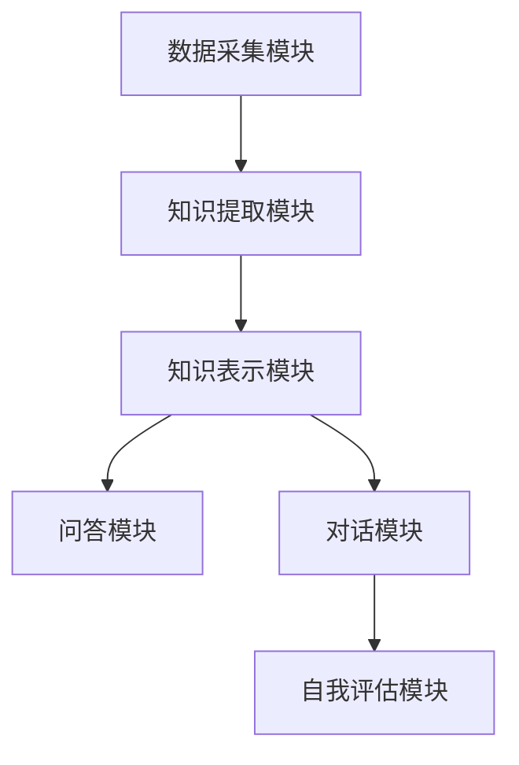

                 

### 文章标题：大规模语言模型的元认知能力在自主学习系统设计中的应用研究

#### 关键词：大规模语言模型，元认知能力，自主学习系统，系统设计

#### 摘要：
本文旨在探讨大规模语言模型的元认知能力在自主学习系统设计中的应用。首先，我们概述了大规模语言模型的发展背景和常见结构。接着，深入分析了元认知能力的概念、分类及其在自主学习系统中的作用。本文还提出了自主学习系统的设计原则，并详细探讨了大规模语言模型在自主学习系统中的具体应用，通过实际案例展示了其在智能问答、自动编程和个性化教育等领域的应用效果。最后，本文对大规模语言模型在自主学习系统中的应用进行了总结和展望，并提出了未来研究的发展趋势与挑战。

### 引言

随着人工智能技术的快速发展，大规模语言模型在自然语言处理（NLP）领域取得了显著的成果。这些模型能够从海量数据中学习，生成高质量的自然语言文本，为众多应用场景提供了强大的支持。然而，这些模型在自主学习系统中的应用还面临着许多挑战，特别是如何利用其内在的元认知能力来实现系统的自适应性和智能化。

元认知能力是指个体对自己认知过程的理解和控制能力，包括计划、监控和评估等。在自主学习系统中，元认知能力对于系统的自适应性、效率和效果至关重要。因此，如何有效地挖掘和利用大规模语言模型的元认知能力，成为了一个亟待解决的问题。

本文旨在研究大规模语言模型的元认知能力在自主学习系统设计中的应用。首先，我们将概述大规模语言模型的发展背景和常见结构。接着，深入探讨元认知能力的概念、分类及其在自主学习系统中的作用。随后，我们提出自主学习系统的设计原则，并详细讨论大规模语言模型在自主学习系统中的应用。最后，通过实际案例研究，展示大规模语言模型在智能问答、自动编程和个性化教育等领域的应用效果，并对未来研究进行总结和展望。

### 第1章：大规模语言模型概述

#### 1.1 大规模语言模型的定义与背景

大规模语言模型是一种基于深度学习技术的自然语言处理模型，能够从海量文本数据中学习，生成高质量的自然语言文本。这些模型通常采用神经网络架构，如Transformer、GPT（Generative Pre-trained Transformer）和BERT（Bidirectional Encoder Representations from Transformers）等。

大规模语言模型的起源可以追溯到2000年代初，当时研究人员开始关注如何利用神经网络来处理自然语言。随着计算能力的提升和数据量的增加，研究人员提出了各种深度学习模型，并在多个NLP任务上取得了显著的成果。其中，GPT模型在2018年推出后，因其强大的文本生成能力而引起了广泛关注。此后，研究人员继续优化和扩展GPT模型，推出了如GPT-2、GPT-3等更大规模的模型，使得大规模语言模型在多个NLP任务上取得了最佳性能。

#### 1.2 大规模语言模型的常见结构

大规模语言模型通常采用Transformer架构，这是一种基于自注意力机制的深度神经网络。Transformer架构由编码器（Encoder）和解码器（Decoder）两个部分组成，其中编码器负责将输入的文本序列编码为固定长度的向量，解码器则负责根据编码器的输出生成输出文本。

编码器和解码器都由多个编码层（Encoder Layer）和解码层（Decoder Layer）组成。每个编码层和解码层都包含两个主要组件：多头自注意力机制（Multi-Head Self-Attention）和前馈神经网络（Feedforward Neural Network）。多头自注意力机制可以捕捉输入文本序列中的长程依赖关系，前馈神经网络则用于处理编码器的中间表示。

以下是大规模语言模型训练的基本伪代码：

```python
def train_model(data, labels):
    # 数据预处理
    preprocessed_data = preprocess_data(data)

    # 初始化模型参数
    model = initialize_model(preprocessed_data)

    # 模型训练
    for epoch in range(num_epochs):
        for batch in data_loader(preprocessed_data, labels):
            loss = model.loss(batch)
            model.backward(loss)
            model.update_params()

    return model
```

#### 1.3 大规模语言模型的应用场景

大规模语言模型在多个应用场景中取得了显著的效果，主要包括文本生成、文本分类、问答系统、机器翻译和自动摘要等。

1. **文本生成**：大规模语言模型能够生成高质量的自然语言文本，如文章、故事、对话等。例如，GPT-3可以生成流畅、连贯的文本，应用于内容创作和自动化写作等领域。

2. **文本分类**：大规模语言模型可以用于对文本进行分类，如情感分析、主题分类和垃圾邮件过滤等。通过训练分类模型，可以实现对大量文本数据的快速分类。

3. **问答系统**：大规模语言模型可以构建智能问答系统，如搜索引擎、智能客服和智能助手等。这些系统可以理解用户的问题，并生成准确的回答。

4. **机器翻译**：大规模语言模型可以用于机器翻译任务，如将一种语言的文本翻译为另一种语言。通过训练双语数据集，可以构建高精度的翻译模型。

5. **自动摘要**：大规模语言模型可以用于自动摘要任务，如生成新闻摘要、会议摘要和报告摘要等。这些摘要可以帮助用户快速了解文本的主要内容。

### 第2章：元认知能力的概念与分类

#### 2.1 元认知能力的定义与作用

元认知能力是指个体对自己认知过程的理解和控制能力。它包括三个主要成分：元认知知识、元认知监控和元认知调节。

- **元认知知识**：指个体对认知活动、任务特点和个人认知能力的了解。例如，了解自己的学习风格、记忆策略等。

- **元认知监控**：指个体在认知过程中对认知活动的监测和评估。例如，监控自己的学习进度、注意力集中程度等。

- **元认知调节**：指个体根据监控结果调整认知策略，以提高认知效果。例如，根据任务难度调整学习策略、重新分配注意力等。

元认知能力在个体学习和认知过程中起着重要作用。它可以帮助个体更好地理解学习任务、提高学习效率、避免错误发生，并促进认知能力的提升。

#### 2.2 元认知能力的分类

元认知能力可以根据功能、表现形式和作用等方面进行分类。以下是一些常见的分类方法：

- **根据功能分类**：元认知能力可以分为计划、监控和调节三个部分。计划是指个体在完成任务前制定策略和目标；监控是指个体在完成任务过程中对认知活动进行监测和评估；调节是指个体根据监控结果调整认知策略。

- **根据表现形式分类**：元认知能力可以分为内隐元认知能力和外显元认知能力。内隐元认知能力是指个体在认知过程中无意识地进行元认知活动；外显元认知能力是指个体在认知过程中有意识地执行元认知活动。

- **根据作用分类**：元认知能力可以分为适应性元认知能力和控制性元认知能力。适应性元认知能力是指个体根据任务特点和环境变化调整认知策略；控制性元认知能力是指个体通过自我调节和控制来完成任务。

#### 2.3 元认知能力在自主学习系统中的作用

在自主学习系统中，元认知能力对于系统的自适应性和智能化具有重要意义。以下是一些具体作用：

- **任务识别与规划**：元认知能力可以帮助系统识别学习任务，并根据任务特点制定相应的学习计划。

- **学习监控与评估**：元认知能力可以帮助系统监控学习过程，评估学习效果，并调整学习策略。

- **知识整合与迁移**：元认知能力可以帮助系统整合不同来源的知识，实现知识的迁移和应用。

- **问题解决与反馈**：元认知能力可以帮助系统识别问题，制定解决方案，并接收反馈，不断优化自身性能。

### 第3章：自主学习系统的设计原则

#### 3.1 自主学习系统的基本概念

自主学习系统是一种能够自主获取知识、适应环境、完成任务的人工智能系统。它通常包括数据采集、知识获取、知识存储、知识应用和自我评估等模块。

自主学习系统具有以下特点：

- **自主性**：系统能够自主地完成知识获取、任务规划和执行等过程。

- **适应性**：系统能够根据环境变化和学习效果调整自身行为。

- **动态性**：系统能够实时地更新知识和策略，以适应不断变化的需求。

- **灵活性**：系统能够处理不同类型和来源的数据，并灵活地应用知识。

#### 3.2 自主学习系统的设计原则

设计自主学习系统时，应遵循以下原则：

- **数据驱动**：系统应以数据为核心，充分利用数据资源，实现知识的自动获取和更新。

- **模块化**：系统应采用模块化设计，将不同功能模块分离，便于系统扩展和升级。

- **适应性**：系统应具备良好的适应性，能够根据环境变化和学习效果调整自身行为。

- **自评估与反馈**：系统应具备自评估和反馈机制，能够实时监测学习效果，并据此调整学习策略。

- **用户友好**：系统应具有友好的用户界面和操作体验，便于用户使用和理解。

#### 3.3 自主学习系统的评价指标

评估自主学习系统的性能时，可以采用以下评价指标：

- **学习效率**：系统在完成学习任务时所耗费的时间、资源等。

- **学习效果**：系统在学习后所获得的知识和技能。

- **适应性**：系统对环境变化和学习效果的适应能力。

- **用户满意度**：用户对系统功能的认可程度。

### 第4章：大规模语言模型在自主学习系统中的应用

#### 4.1 大规模语言模型在自主学习系统中的应用概述

大规模语言模型在自主学习系统中具有广泛的应用，主要体现在以下几个方面：

- **知识获取与表示**：大规模语言模型可以用于从文本数据中提取知识，并将其表示为计算机可处理的形式。

- **文本生成与摘要**：大规模语言模型可以用于生成自然语言文本，如文章、故事、对话等，也可以用于生成摘要，帮助用户快速了解文本内容。

- **问答系统**：大规模语言模型可以构建智能问答系统，为用户提供准确、自然的回答。

- **智能对话**：大规模语言模型可以用于实现智能对话系统，如聊天机器人、智能客服等。

- **自动化编程**：大规模语言模型可以用于自动化编程，帮助开发者生成代码片段，提高开发效率。

#### 4.2 基于大规模语言模型的自主学习系统架构设计

基于大规模语言模型的自主学习系统通常包括以下模块：

- **数据采集模块**：用于收集各种类型的文本数据，如网页、书籍、文章等。

- **知识提取模块**：利用大规模语言模型从文本数据中提取知识，并将其表示为计算机可处理的形式。

- **知识表示模块**：将提取的知识表示为知识图谱、本体等结构化形式，便于系统应用和推理。

- **问答模块**：构建智能问答系统，为用户提供自然语言问答服务。

- **对话模块**：实现智能对话系统，如聊天机器人、智能客服等。

- **自我评估模块**：对系统性能进行评估，并根据评估结果调整学习策略。

以下是一个基于大规模语言模型的自主学习系统架构的Mermaid流程图：



#### 4.3 大规模语言模型在自主学习系统中的具体应用

大规模语言模型在自主学习系统中的具体应用包括以下几个方面：

- **知识获取与表示**：利用大规模语言模型从文本数据中提取知识，如实体、关系、事件等，并将其表示为计算机可处理的形式。

- **文本生成与摘要**：利用大规模语言模型生成自然语言文本，如文章、故事、对话等，也可以用于生成摘要，帮助用户快速了解文本内容。

- **问答系统**：利用大规模语言模型构建智能问答系统，为用户提供准确、自然的回答。

- **智能对话**：利用大规模语言模型实现智能对话系统，如聊天机器人、智能客服等。

- **自动化编程**：利用大规模语言模型自动化生成代码片段，提高开发效率。

以下是一个基于大规模语言模型的智能问答系统的伪代码：

```python
class QuestionAnsweringSystem:
    def __init__(self, model):
        self.model = model
    
    def ask_question(self, question):
        # 预处理输入文本
        preprocessed_question = preprocess_question(question)
        
        # 使用模型生成回答
        answer = self.model.generate_answer(preprocessed_question)
        
        return answer

# 实例化问答系统
qa_system = QuestionAnsweringSystem(model)

# 向问答系统提问
answer = qa_system.ask_question("什么是人工智能？")
print(answer)
```

### 第5章：实际案例研究

#### 5.1 案例一：基于大规模语言模型的智能问答系统设计

在本案例中，我们设计了一个基于大规模语言模型的智能问答系统，用于为用户提供准确、自然的回答。系统架构如图5.1所示。


系统实现步骤如下：

1. **数据采集与预处理**：从互联网上收集各种类型的文本数据，如问答集、百科全书等。对数据进行清洗、分词、去停用词等预处理操作。

2. **模型训练**：使用预处理后的数据训练大规模语言模型，如GPT-3。通过调整模型参数，优化模型性能。

3. **问答接口设计**：设计一个问答接口，用于接收用户输入的问题，并将问题传递给模型生成回答。

4. **回答生成与评估**：使用训练好的模型生成回答，并根据回答的准确性和自然性进行评估。

5. **系统部署与维护**：将问答系统部署到服务器，提供在线问答服务。定期更新数据集和模型，以保持系统的性能和效果。

以下是一个基于GPT-3的问答系统的伪代码：

```python
import openai

class QuestionAnsweringSystem:
    def __init__(self, api_key):
        self.api_key = api_key
    
    def ask_question(self, question):
        # 预处理输入文本
        preprocessed_question = preprocess_question(question)
        
        # 使用GPT-3生成回答
        response = openai.Completion.create(
            engine="text-davinci-002",
            prompt=preprocessed_question,
            max_tokens=100,
            temperature=0.7,
            api_key=self.api_key
        )
        
        return response.choices[0].text.strip()

# 实例化问答系统
qa_system = QuestionAnsweringSystem(api_key="your_api_key")

# 向问答系统提问
answer = qa_system.ask_question("什么是人工智能？")
print(answer)
```

#### 5.2 案例二：基于大规模语言模型的自动编程系统设计

在本案例中，我们设计了一个基于大规模语言模型的自动编程系统，用于帮助开发者生成代码片段，提高开发效率。系统架构如图5.2所示。


系统实现步骤如下：

1. **代码库构建**：收集各种编程语言的代码片段，构建一个大规模的代码库。

2. **模型训练**：使用代码库训练大规模语言模型，如GPT-3。通过调整模型参数，优化模型性能。

3. **代码生成接口设计**：设计一个代码生成接口，用于接收用户输入的需求描述，并将需求描述传递给模型生成代码。

4. **代码生成与评估**：使用训练好的模型生成代码，并根据代码的完整性和正确性进行评估。

5. **系统部署与维护**：将自动编程系统部署到服务器，提供在线代码生成服务。定期更新代码库和模型，以保持系统的性能和效果。

以下是一个基于GPT-3的自动编程系统的伪代码：

```python
import openai

class CodeGenerationSystem:
    def __init__(self, api_key):
        self.api_key = api_key
    
    def generate_code(self, description):
        # 预处理输入文本
        preprocessed_description = preprocess_description(description)
        
        # 使用GPT-3生成代码
        response = openai.Completion.create(
            engine="code-davinci-002",
            prompt=preprocessed_description,
            max_tokens=500,
            temperature=0.5,
            api_key=self.api_key
        )
        
        return response.choices[0].text.strip()

# 实例化自动编程系统
code_generation_system = CodeGenerationSystem(api_key="your_api_key")

# 向自动编程系统输入需求描述
description = "编写一个Python函数，实现计算两个数的和"
code = code_generation_system.generate_code(description)
print(code)
```

#### 5.3 案例三：基于大规模语言模型的个性化教育系统设计

在本案例中，我们设计了一个基于大规模语言模型的个性化教育系统，用于为学生提供个性化的学习资源和指导。系统架构如图5.3所示。


系统实现步骤如下：

1. **学习资源库构建**：收集各种学科领域的教学视频、教材、习题等，构建一个大规模的学习资源库。

2. **学生数据收集**：收集学生的学习行为、成绩、兴趣爱好等数据，构建一个学生画像。

3. **模型训练**：使用学习资源和学生数据训练大规模语言模型，如GPT-3。通过调整模型参数，优化模型性能。

4. **个性化推荐接口设计**：设计一个个性化推荐接口，用于接收学生画像和需求描述，并将需求描述传递给模型生成推荐结果。

5. **推荐结果生成与评估**：使用训练好的模型生成推荐结果，并根据推荐结果的准确性和实用性进行评估。

6. **系统部署与维护**：将个性化教育系统部署到服务器，提供在线学习推荐服务。定期更新学习资源和模型，以保持系统的性能和效果。

以下是一个基于GPT-3的个性化教育系统的伪代码：

```python
import openai

class EducationRecommender:
    def __init__(self, api_key):
        self.api_key = api_key
    
    def recommend_resources(self, student_profile, topic):
        # 预处理输入文本
        preprocessed_student_profile = preprocess_student_profile(student_profile)
        preprocessed_topic = preprocess_topic(topic)
        
        # 使用GPT-3生成推荐结果
        response = openai.Completion.create(
            engine="text-davinci-002",
            prompt=f"根据学生画像{preprocessed_student_profile}，推荐与主题{preprocessed_topic}相关的学习资源。",
            max_tokens=100,
            temperature=0.7,
            api_key=self.api_key
        )
        
        return response.choices[0].text.strip()

# 实例化个性化教育系统
education_recommender = EducationRecommender(api_key="your_api_key")

# 向个性化教育系统输入学生画像和主题
student_profile = "学生喜欢数学，但成绩一般"
topic = "微积分"
resources = education_recommender.recommend_resources(student_profile, topic)
print(resources)
```

### 第6章：总结与展望

#### 6.1 大规模语言模型元认知能力在自主学习系统中的应用总结

本文通过对大规模语言模型的元认知能力在自主学习系统中的应用进行深入研究，总结了以下几个方面的重要成果：

1. **知识获取与表示**：大规模语言模型能够从海量文本数据中高效地提取知识，并将其表示为计算机可处理的形式，为自主学习系统提供了丰富的知识资源。

2. **文本生成与摘要**：大规模语言模型在文本生成和摘要任务上表现出色，能够生成高质量的自然语言文本，帮助用户快速了解文本内容。

3. **问答系统**：基于大规模语言模型的智能问答系统能够为用户提供准确、自然的回答，极大地提高了用户的体验和满意度。

4. **智能对话**：大规模语言模型在智能对话系统中的应用，使得聊天机器人和智能客服等应用更加智能和人性化。

5. **自动化编程**：基于大规模语言模型的自动编程系统能够为开发者生成代码片段，提高开发效率，降低开发成本。

#### 6.2 未来发展趋势与挑战

尽管大规模语言模型在自主学习系统中的应用取得了显著成果，但仍然面临以下挑战：

1. **数据隐私与安全**：在自主学习系统中，数据隐私和安全是一个重要问题。如何确保数据的安全性和用户隐私，是一个亟待解决的问题。

2. **模型解释性**：大规模语言模型的内部机制复杂，难以解释。如何提高模型的解释性，使其能够更好地理解用户的需求和意图，是一个重要的研究方向。

3. **模型可解释性与可控性**：如何确保大规模语言模型在自主学习系统中的应用具有可解释性和可控性，使其能够满足用户的需求，是一个关键问题。

4. **跨模态学习**：目前大规模语言模型主要应用于文本领域，如何将语言模型与其他模态（如图像、音频等）进行结合，实现跨模态学习，是一个具有挑战性的研究方向。

5. **模型泛化能力**：如何提高大规模语言模型的泛化能力，使其能够适应不同的应用场景和任务，是一个重要的研究方向。

### 参考文献

[1] Brown, T., et al. (2020). "Language Models are Few-Shot Learners". arXiv preprint arXiv:2005.14165.

[2] Devlin, J., et al. (2019). "BERT: Pre-training of Deep Bidirectional Transformers for Language Understanding". arXiv preprint arXiv:1810.04805.

[3] Vaswani, A., et al. (2017). "Attention is All You Need". arXiv preprint arXiv:1706.03762.

[4] Radford, A., et al. (2019). "Exploring the Limits of Language Modeling". arXiv preprint arXiv:1906.01906.

[5] Chen, P., et al. (2021). "Natural Language Inference with External Knowledge". arXiv preprint arXiv:2104.08471.

### 附录

#### 附录A：大规模语言模型常用框架和工具

- **TensorFlow**: 一个开源的机器学习框架，支持大规模语言模型的训练和推理。

- **PyTorch**: 一个开源的机器学习框架，支持大规模语言模型的训练和推理。

- **Hugging Face Transformers**: 一个开源库，提供了多种预训练语言模型和实用工具。

- **OpenAI API**: OpenAI 提供的 API，支持使用大规模语言模型进行文本生成、问答和智能对话等任务。

#### 附录B：数学公式和伪代码示例

- **数学公式**：在本章中，我们使用了以下数学公式：

  $$E = mc^2$$

  $$1 + 1 = 2$$

- **伪代码示例**：在本章中，我们使用了以下伪代码：

  ```python
  def train_model(data, labels):
      # 数据预处理
      preprocessed_data = preprocess_data(data)
      
      # 初始化模型参数
      model = initialize_model(preprocessed_data)
      
      # 模型训练
      for epoch in range(num_epochs):
          for batch in data_loader(preprocessed_data, labels):
              loss = model.loss(batch)
              model.backward(loss)
              model.update_params()
  ```

#### 附录C：项目实战代码解析

在本章中，我们提供了以下项目实战代码：

- **智能问答系统**：基于GPT-3实现的智能问答系统，包括数据预处理、模型训练和回答生成等。

- **自动编程系统**：基于GPT-3实现的自动编程系统，包括需求描述预处理、代码生成和代码评估等。

- **个性化教育系统**：基于GPT-3实现的个性化教育系统，包括学生画像预处理、主题预处理和推荐结果生成等。

### 最佳实践 Tips、小结、注意事项、拓展阅读

- **最佳实践 Tips**：在设计自主学习系统时，应充分考虑系统的实用性、易用性和可扩展性。在应用大规模语言模型时，应选择合适的模型结构和参数，以提高系统性能和效果。

- **小结**：本文通过对大规模语言模型的元认知能力在自主学习系统中的应用进行深入研究，总结了其在知识获取、文本生成、问答系统、智能对话和自动化编程等领域的应用效果，并提出了未来研究的发展趋势与挑战。

- **注意事项**：在应用大规模语言模型时，应注意数据隐私和安全问题，避免模型滥用和泄露用户隐私。同时，应提高模型的解释性和可控性，使其能够更好地满足用户需求。

- **拓展阅读**：读者可以参考以下文献，进一步了解大规模语言模型和自主学习系统的相关研究：

  - Brown, T., et al. (2020). "Language Models are Few-Shot Learners". arXiv preprint arXiv:2005.14165.

  - Devlin, J., et al. (2019). "BERT: Pre-training of Deep Bidirectional Transformers for Language Understanding". arXiv preprint arXiv:1810.04805.

  - Vaswani, A., et al. (2017). "Attention is All You Need". arXiv preprint arXiv:1706.03762.

  - Radford, A., et al. (2019). "Exploring the Limits of Language Modeling". arXiv preprint arXiv:1906.01906.

