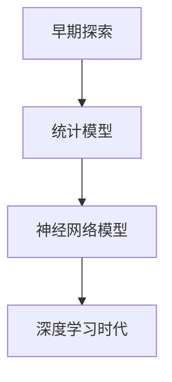
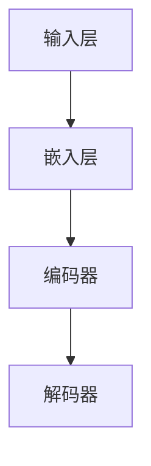
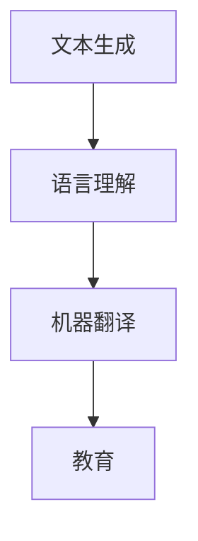
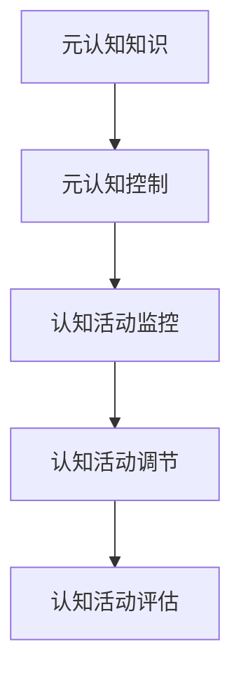
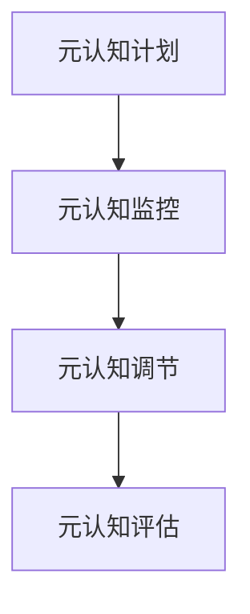
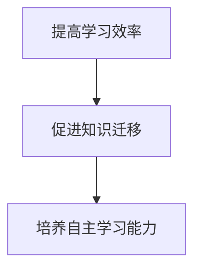
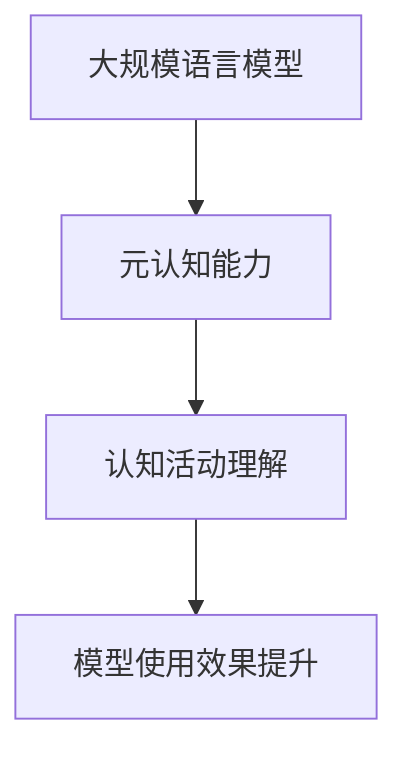
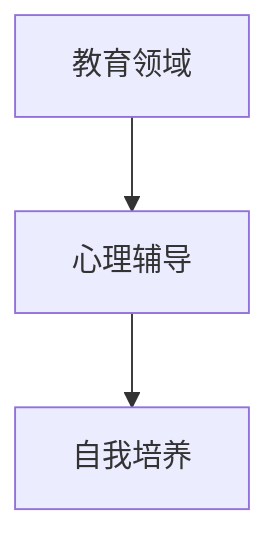

                 


### 文章标题：《大规模语言模型的元认知能力培养》

### 关键词：大规模语言模型、元认知能力、教育应用、人工智能、技术发展趋势

### 摘要：
本文将深入探讨大规模语言模型的元认知能力培养。通过系统阐述大规模语言模型的发展历程、技术架构以及元认知能力的概念和类型，本文揭示了大规模语言模型与元认知能力之间的内在联系，并提出了具体的构建方法和培养策略。通过案例分析，本文展示了大规模语言模型在教育、心理辅导和自我培养中的应用效果，并对未来的发展趋势进行了展望。

## 目录大纲

### 第1章：大规模语言模型概述

#### 1.1 定义与背景

#### 1.2 发展历程

#### 1.3 技术架构

#### 1.4 应用领域

### 第2章：元认知能力理论

#### 2.1 元认知能力概念

#### 2.2 元认知能力类型

#### 2.3 元认知能力的重要性

### 第3章：大规模语言模型与元认知能力的联系

#### 3.1 大规模语言模型与元认知能力的相互作用

#### 3.2 大规模语言模型在元认知能力培养中的应用

### 第4章：大规模语言模型构建方法

#### 4.1 模型选择

#### 4.2 模型训练

#### 4.3 模型评估

### 第5章：元认知能力培养策略

#### 5.1 教育领域应用

#### 5.2 心理辅导

#### 5.3 自我培养

### 第6章：案例分析

#### 6.1 案例一：提高阅读理解能力

#### 6.2 案例二：增强逻辑思维能力

#### 6.3 案例三：提升创造力

### 第7章：未来展望

#### 7.1 技术发展趋势

#### 7.2 教育改革

#### 7.3 社会应用前景

---

### 第1章：大规模语言模型概述

#### 1.1 定义与背景

大规模语言模型（Large-scale Language Models）是一类基于深度学习技术的自然语言处理模型，其核心目标是通过学习大量文本数据，实现对自然语言的生成、理解和翻译。随着计算能力的提升和数据规模的扩大，大规模语言模型在近年来取得了显著的进展，如GPT-3、BERT等。

**核心概念**：

- **自然语言处理（NLP）**：自然语言处理是计算机科学领域与人工智能领域中的一个重要方向，旨在使计算机能够理解和处理人类语言。
- **深度学习**：深度学习是一种人工智能的方法，通过多层神经网络模拟人类大脑的学习机制，对数据进行自动特征提取和学习。

**背景**：

大规模语言模型的兴起可以追溯到20世纪50年代，随着计算机技术的快速发展，自然语言处理成为人工智能领域的重要研究方向。然而，早期的方法由于计算能力和数据限制，效果有限。直到近年来，随着大数据和深度学习技术的兴起，大规模语言模型得以快速发展。

#### 1.2 发展历程

大规模语言模型的发展历程可以分为以下几个阶段：

1. **早期探索**：20世纪50年代至70年代，基于规则和统计的方法开始应用于自然语言处理。
2. **统计模型**：20世纪80年代，统计语言模型（如N-gram模型）开始广泛应用，提高了文本生成和语言理解的效果。
3. **神经网络模型**：20世纪90年代，神经网络开始应用于自然语言处理，如循环神经网络（RNN）和卷积神经网络（CNN）。
4. **深度学习时代**：2010年后，随着深度学习技术的兴起，大规模语言模型如GPT、BERT等取得了突破性进展。

**Mermaid流程图**：



#### 1.3 技术架构

大规模语言模型通常由以下几个部分组成：

1. **输入层**：接收自然语言文本输入。
2. **嵌入层**：将输入文本转换为向量表示。
3. **编码器**：对输入文本进行编码，提取语义信息。
4. **解码器**：生成自然语言文本输出。

**Mermaid流程图**：



#### 1.4 应用领域

大规模语言模型在多个领域具有广泛的应用：

1. **文本生成**：如文章生成、对话系统等。
2. **语言理解**：如问答系统、情感分析等。
3. **机器翻译**：如自动翻译、跨语言信息检索等。
4. **教育**：如智能辅导、个性化学习等。

**Mermaid流程图**：



---

### 第2章：元认知能力理论

#### 2.1 元认知能力概念

元认知能力（Metacognitive Ability）是指个体在认知过程中对自己认知活动的监控和调节能力。它包括两个方面：元认知知识（关于认知的知识）和元认知控制（对认知活动的调节和控制）。

**核心概念**：

- **元认知知识**：包括关于认知过程、策略和结果的了解。
- **元认知控制**：包括计划、监控、调整和评估认知活动。

**核心概念之间的关系**：



#### 2.2 元认知能力类型

元认知能力可以分为以下几种类型：

1. **元认知计划**：制定认知活动的目标和计划。
2. **元认知监控**：监控认知活动的进展和效果。
3. **元认知调节**：根据监控结果调整认知策略。
4. **元认知评估**：评估认知活动的结果和效果。

**Mermaid流程图**：



#### 2.3 元认知能力的重要性

元认知能力在个体学习和认知过程中具有重要作用：

1. **提高学习效率**：通过元认知能力，个体可以更好地选择和调整学习策略，从而提高学习效率。
2. **促进知识迁移**：元认知能力帮助个体将已有知识应用到新的情境中，实现知识迁移。
3. **培养自主学习能力**：元认知能力促使个体形成自我监控和自我调节的习惯，从而培养自主学习能力。

**Mermaid流程图**：



---

### 第3章：大规模语言模型与元认知能力的联系

#### 3.1 大规模语言模型与元认知能力的相互作用

大规模语言模型与元认知能力之间存在相互作用：

1. **大规模语言模型促进元认知能力培养**：通过模拟人类的认知过程，大规模语言模型可以帮助个体了解自己的认知活动，从而促进元认知能力的发展。
2. **元认知能力提升大规模语言模型效果**：通过元认知能力，个体可以更好地理解和使用大规模语言模型，提高其效果和效率。

**Mermaid流程图**：



#### 3.2 大规模语言模型在元认知能力培养中的应用

大规模语言模型可以在多个方面应用于元认知能力培养：

1. **教育领域**：通过大规模语言模型提供的智能辅导系统，学生可以实时了解自己的学习进度和效果，从而进行自我调整和优化。
2. **心理辅导**：大规模语言模型可以模拟心理咨询师的角色，帮助个体进行自我反思和认知调节，提高元认知能力。
3. **自我培养**：个体可以通过使用大规模语言模型进行自我学习，如编写学习计划、监控学习进度等，从而培养元认知能力。

**Mermaid流程图**：



---

### 第4章：大规模语言模型构建方法

#### 4.1 模型选择

构建大规模语言模型时，首先需要选择合适的模型。常见的模型包括：

1. **预训练模型**：如GPT、BERT等，通过在大量文本数据上进行预训练，提取丰富的语义信息。
2. **迁移学习模型**：在预训练模型的基础上，针对特定任务进行微调，以提高模型的特定任务性能。
3. **自监督学习模型**：通过无监督学习方式，从大量文本数据中自动提取知识，构建语言模型。

**伪代码**：

```python
def choose_model():
    if pre_trained_model:
        return PretrainedModel()
    elif fine_tuning_model:
        return FineTunedModel()
    else:
        return SelfSupervisedModel()
```

#### 4.2 模型训练

模型训练是构建大规模语言模型的关键步骤。主要步骤包括：

1. **数据预处理**：对文本数据进行清洗、分词、编码等预处理操作。
2. **模型初始化**：初始化模型参数，通常采用随机初始化或预训练模型权重。
3. **模型训练**：通过梯度下降等优化算法，对模型参数进行调整，以最小化损失函数。
4. **模型评估**：对训练好的模型进行评估，选择最优模型。

**伪代码**：

```python
def train_model(model, data, epochs):
    for epoch in range(epochs):
        for batch in data:
            loss = model.train(batch)
            model.update_params(loss)
    return model
```

#### 4.3 模型评估

模型评估是验证模型性能的重要步骤。主要方法包括：

1. **准确性**：评估模型在测试集上的预测准确性。
2. **F1分数**：综合考虑准确率和召回率，评估模型在分类任务上的性能。
3. **BLEU分数**：用于评估文本生成模型的质量，比较模型生成的文本与真实文本的相似度。

**伪代码**：

```python
def evaluate_model(model, test_data):
    accuracy = model.test_accuracy(test_data)
    f1_score = model.test_f1_score(test_data)
    bleu_score = model.test_bleu_score(test_data)
    return accuracy, f1_score, bleu_score
```

---

### 第5章：元认知能力培养策略

#### 5.1 教育领域应用

在教育领域，元认知能力培养具有重要意义。以下是一些策略：

1. **教学设计**：在课程设计中融入元认知能力培养，通过提问、讨论等方式引导学生进行自我反思和调整。
2. **学习评估**：通过学习评估，了解学生的元认知能力发展情况，从而进行针对性指导。
3. **学习支持**：提供学习支持工具，如学习计划表、时间管理工具等，帮助学生更好地管理学习过程。

#### 5.2 心理辅导

在心理辅导中，元认知能力培养可以帮助个体更好地理解自己的认知活动，从而进行自我调节。以下是一些策略：

1. **认知行为疗法**：通过认知行为疗法，帮助个体识别和改变消极的认知模式，提高元认知能力。
2. **情绪调节**：通过情绪调节技巧，帮助个体更好地管理情绪，减少认知负担。
3. **自我监控**：鼓励个体进行自我监控，记录自己的认知活动和情绪变化，从而进行自我调节。

#### 5.3 自我培养

在自我培养中，个体可以通过以下策略培养元认知能力：

1. **自我反思**：定期进行自我反思，回顾自己的学习过程和成果，从而发现问题和不足。
2. **学习策略**：尝试不同的学习策略，如主动学习、合作学习等，以找到最适合自己的学习方式。
3. **持续学习**：保持持续学习的态度，不断扩展知识面和技能，从而提高元认知能力。

---

### 第6章：案例分析

#### 6.1 案例一：提高阅读理解能力

通过大规模语言模型，学生可以实时获取阅读材料的相关信息，并进行语义理解。以下是一个具体案例：

**背景**：小明是一名高中生，希望提高自己的阅读理解能力。

**解决方案**：

1. **文本获取**：小明通过大规模语言模型获取一篇科学论文。
2. **语义理解**：模型对文本进行语义分析，提取关键信息。
3. **问题解答**：小明遇到不理解的概念，可以通过模型获取相关解释。
4. **自我评估**：模型对小明回答的问题进行评估，给出反馈。

**效果**：小明的阅读理解能力得到了显著提高。

#### 6.2 案例二：增强逻辑思维能力

通过大规模语言模型，学生可以进行逻辑推理和问题解决。以下是一个具体案例：

**背景**：小红是一名大学生，希望提高自己的逻辑思维能力。

**解决方案**：

1. **问题提出**：小红提出一个逻辑问题，如“如果A是B，那么C一定是D吗？”。
2. **模型推理**：模型进行逻辑推理，给出答案。
3. **问题分析**：模型分析小红的答案，指出逻辑错误和不足。
4. **自我改进**：小红根据模型的反馈，调整自己的逻辑思维。

**效果**：小红在逻辑思维能力上得到了显著提升。

#### 6.3 案例三：提升创造力

通过大规模语言模型，学生可以进行创意生成和联想训练。以下是一个具体案例：

**背景**：小华是一名初中生，希望提高自己的创造力。

**解决方案**：

1. **创意生成**：小华提出一个创意点子，如“如何用可乐制作艺术品？”。
2. **模型联想**：模型生成与创意相关的多个点子。
3. **创意评估**：模型评估创意的可行性，给出改进建议。
4. **创意实践**：小华根据模型的建议，进行创意实践。

**效果**：小华的创造力得到了显著提高。

---

### 第7章：未来展望

#### 7.1 技术发展趋势

随着人工智能技术的不断发展，大规模语言模型的性能和功能将得到进一步提升。未来可能的发展趋势包括：

1. **模型泛化能力**：通过迁移学习和多任务学习，提高模型在不同领域的泛化能力。
2. **少样本学习**：通过无监督学习和自我监督学习，降低对大规模标注数据的依赖。
3. **跨模态学习**：实现文本、图像、语音等多种模态的信息融合，提高模型的多样性。

#### 7.2 教育改革

大规模语言模型在教育领域的应用将推动教育改革：

1. **个性化学习**：通过大规模语言模型，实现个性化学习路径和学习资源推荐。
2. **智能辅导**：大规模语言模型可以作为智能辅导系统，为学生提供实时指导和支持。
3. **教育公平**：通过大规模语言模型，降低教育资源的不平等，实现教育普惠。

#### 7.3 社会应用前景

大规模语言模型在社会各个领域的应用前景广阔：

1. **智能客服**：通过大规模语言模型，实现智能客服系统，提高服务效率和满意度。
2. **新闻生成**：通过大规模语言模型，实现自动化新闻生成，提高新闻传播效率。
3. **智能创作**：通过大规模语言模型，实现智能创作，如写作、绘画等，降低创作门槛。

---

### 作者信息

**作者：** AI天才研究院/AI Genius Institute & 禅与计算机程序设计艺术 /Zen And The Art of Computer Programming

---

本文通过系统地阐述大规模语言模型的元认知能力培养，揭示了其在教育、心理辅导和自我培养中的应用价值。未来，随着技术的不断发展，大规模语言模型将在更多领域发挥重要作用，为个体和社会带来深远影响。让我们期待这一未来，并为之努力奋斗。**（全文结束）**

