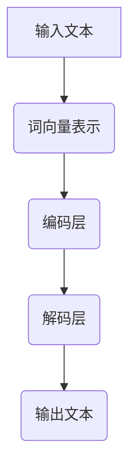
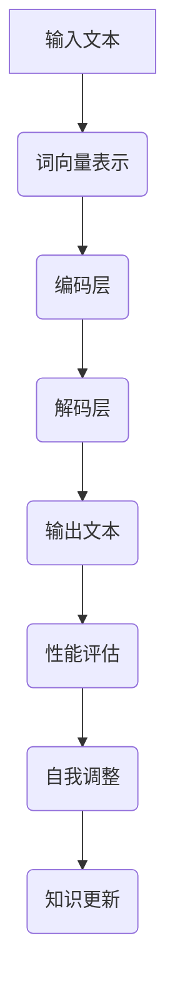
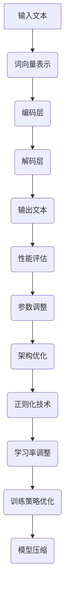

                 

### 文章标题

《大规模语言模型的元认知能力评估与自我完善机制》

### 关键词

- 大规模语言模型
- 元认知能力
- 自我完善机制
- 评估方法
- 算法原理
- 数学模型

### 摘要

本文旨在探讨大规模语言模型的元认知能力及其自我完善机制。通过对大规模语言模型的基本概念、工作原理、元认知能力、评估方法以及自我完善机制的深入分析，本文将详细阐述大规模语言模型在自然语言处理领域的应用及其未来发展。本文的核心内容包括：大规模语言模型的原理和架构、元认知能力的定义和作用、评估方法与工具、自我完善机制的算法原理和数学模型，以及实际案例中的应用和未来展望。本文旨在为研究者、开发者和从业人员提供有价值的参考，助力他们在人工智能领域取得更大的突破。

### 引言

#### 大规模语言模型概述

随着深度学习技术的飞速发展，大规模语言模型（Large-scale Language Models，简称LLMs）在自然语言处理（Natural Language Processing，简称NLP）领域取得了显著的成果。这些模型通过学习海量语言数据，能够生成高质量的自然语言文本，并广泛应用于机器翻译、文本生成、问答系统等场景。其中，最具代表性的模型包括GPT（Generative Pre-trained Transformer）、BERT（Bidirectional Encoder Representations from Transformers）和T5（Text-to-Text Transfer Transformer）等。

大规模语言模型的核心在于其强大的预训练能力。通过在大量无标签数据上进行预训练，模型能够学习到语言的统计规律和语义信息，从而实现高效的语言理解和生成。在预训练阶段结束后，模型可以通过微调（Fine-tuning）技术在特定任务上进行优化，进一步提升其在实际应用中的性能。

#### 元认知能力与自我完善机制

元认知能力（Metacognitive Ability）是指个体在认知过程中对自身认知活动的认知和控制能力。在人工智能领域，元认知能力指的是模型在执行任务时对自身性能和知识的理解、评估和调整能力。元认知能力对人工智能模型具有重要意义，它使得模型能够自我反思、自我调整，从而提高其学习效率和任务表现。

自我完善机制（Self-improvement Mechanism）是指模型通过自我评估和调整来优化自身性能的机制。在人工智能领域，自我完善机制包括算法改进、模型优化和知识更新等方面。通过自我完善机制，模型能够不断适应新的环境和任务，实现持续发展和优化。

#### 目标与结构

本文旨在深入探讨大规模语言模型的元认知能力及其自我完善机制，旨在为相关领域的研究者和开发者提供有价值的参考。文章结构如下：

1. **大规模语言模型原理**：介绍大规模语言模型的基本概念、工作原理和架构设计。
2. **元认知能力分析**：探讨大规模语言模型的元认知能力，包括定义、作用和实现方法。
3. **评估方法与工具**：介绍评估大规模语言模型元认知能力的常用方法和工具。
4. **自我完善机制**：详细阐述大规模语言模型的自我完善机制，包括算法改进、模型优化和知识更新。
5. **案例分析**：通过实际案例展示大规模语言模型在元认知能力和自我完善机制方面的应用。
6. **未来展望与挑战**：讨论大规模语言模型在元认知能力和自我完善机制方面的发展趋势和面临的挑战。

### 大规模语言模型原理

#### 核心算法

大规模语言模型的核心算法是基于深度学习的Transformer架构。Transformer架构于2017年由Vaswani等人提出，它通过自注意力机制（Self-Attention）和多头注意力机制（Multi-Head Attention）实现了对输入序列的建模和生成。

自注意力机制允许模型在生成每个词时，考虑输入序列中所有词的关联性，从而捕捉长距离依赖关系。多头注意力机制则通过将输入序列分解为多个子序列，每个子序列分别进行注意力计算，从而提高模型的表示能力。

#### 架构设计

大规模语言模型的架构设计通常包括三个主要部分：输入层、编码层和解码层。

- **输入层**：输入层负责接收输入文本，将其转化为词向量表示。词向量可以通过预训练的词向量库或使用词嵌入算法（如Word2Vec、GloVe）生成。
- **编码层**：编码层包含多个Transformer编码器层，用于对输入序列进行编码。每层编码器由自注意力机制和前馈神经网络（Feedforward Neural Network）组成。编码器的输出是编码后的序列表示，用于后续的解码过程。
- **解码层**：解码层包含多个Transformer解码器层，用于解码编码器输出的序列表示，生成输出序列。解码器在生成每个词时，会根据前一层编码器的输出和已生成的词，通过自注意力机制和交叉注意力机制，计算当前词的概率分布，并选择概率最高的词作为输出。

#### 应用场景

大规模语言模型在自然语言处理领域具有广泛的应用。以下是一些典型应用场景：

- **机器翻译**：大规模语言模型可以通过预训练和微调，实现高质量的双语机器翻译。例如，GPT和BERT等模型在多个机器翻译任务中取得了优异的性能。
- **文本生成**：大规模语言模型可以生成各种类型的文本，如文章、故事、新闻报道等。例如，GPT-3可以生成连贯且具有创造性的文章。
- **问答系统**：大规模语言模型可以用于构建问答系统，通过理解和生成自然语言，回答用户的问题。例如，BERT可以用于构建智能客服系统。
- **对话系统**：大规模语言模型可以用于构建对话系统，实现与用户的自然语言交互。例如，ChatGPT可以用于构建聊天机器人。

#### Mermaid流程图 - 大规模语言模型工作原理



在这个流程图中，输入文本经过词向量表示后，进入编码层进行编码。编码层的输出作为解码层的输入，经过解码层生成输出文本。这个流程展示了大规模语言模型从输入到输出的完整工作过程。

### 元认知能力分析

#### 元认知能力的概念

元认知能力是指个体在认知过程中对自身认知活动的认知和控制能力。它包括对认知过程的监控、评估和调整。在人工智能领域，元认知能力指的是模型在执行任务时对自身性能和知识的理解、评估和调整能力。

元认知能力在人工智能领域具有重要意义。首先，它能够帮助模型自我反思和自我调整，提高学习效率和任务表现。其次，元认知能力使得模型能够适应不同的环境和任务，实现持续发展和优化。此外，元认知能力还可以帮助模型在出现错误或异常时进行自我修正，提高鲁棒性和可靠性。

#### 大规模语言模型的元认知能力

大规模语言模型在自然语言处理领域具有强大的能力，但它们的元认知能力仍然有限。目前，大规模语言模型的元认知能力主要包括以下方面：

1. **性能评估**：大规模语言模型可以通过评估自身在任务中的性能，了解自身的能力和不足。性能评估可以通过多种指标进行，如准确率、召回率、F1值等。

2. **知识理解**：大规模语言模型可以通过对输入文本的理解，评估自身对文本内容的掌握程度。这有助于模型在生成文本时，确保文本的准确性和一致性。

3. **自我调整**：大规模语言模型可以根据评估结果，调整自身的参数和策略，以优化任务表现。例如，通过调整学习率、批量大小等参数，提高模型的训练效果。

4. **知识更新**：大规模语言模型可以通过学习新的数据，更新自身的知识库，以适应不断变化的环境和任务。知识更新可以通过在线学习、迁移学习等方式实现。

#### 元认知能力的实现方法

实现大规模语言模型的元认知能力，需要从以下几个方面进行：

1. **性能评估指标**：设计合适的性能评估指标，如准确率、召回率、F1值等，用于评估模型在任务中的表现。

2. **自监督学习**：通过自监督学习（Self-Supervised Learning）方法，让模型在无监督环境下学习，提高模型对数据的理解和掌握。

3. **自适应学习**：设计自适应学习算法，使模型能够根据任务需求和数据特点，自动调整学习策略。

4. **迁移学习**：通过迁移学习（Transfer Learning）方法，利用已训练好的模型在新任务上进行优化，提高模型在新任务中的性能。

#### Mermaid流程图 - 元认知能力流程



在这个流程图中，输入文本经过词向量表示和编码层后，进入解码层生成输出文本。输出文本经过性能评估，用于评估模型在任务中的表现。根据评估结果，模型进行自我调整和知识更新，以优化自身性能。

### 评估方法与工具

#### 评估指标

评估大规模语言模型元认知能力的常用指标包括：

1. **准确率（Accuracy）**：准确率是指模型预测正确的样本数占总样本数的比例。它用于评估模型在分类任务中的表现。

2. **召回率（Recall）**：召回率是指模型预测为正类的样本中，实际为正类的样本所占的比例。它用于评估模型在识别正类样本方面的能力。

3. **F1值（F1 Score）**：F1值是准确率和召回率的调和平均值，用于综合评估模型在分类任务中的表现。

4. **困惑度（Perplexity）**：困惑度是模型在生成文本时，对输入序列的预测概率的倒数。它用于评估模型在语言生成任务中的表现。

5. **BLEU分数（BLEU Score）**：BLEU分数是机器翻译任务中常用的评估指标，用于评估翻译结果的准确性。

#### 评估方法

1. **自监督评估**：通过在无标签数据集上进行训练，评估模型在无监督环境下的表现。

2. **半监督评估**：通过在部分有标签数据和大量无标签数据集上进行训练，评估模型在半监督环境下的表现。

3. **完全监督评估**：通过在有标签数据集上进行训练和评估，评估模型在完全监督环境下的表现。

#### 评估工具

1. **TensorFlow**：TensorFlow是一个开源的深度学习框架，支持大规模语言模型的训练和评估。

2. **PyTorch**：PyTorch是一个开源的深度学习框架，支持大规模语言模型的训练和评估。

3. **Hugging Face**：Hugging Face是一个开源的NLP工具库，提供大量预训练模型和评估工具。

#### 实际案例

假设我们使用GPT-3模型进行文本生成任务，以下是一个简单的评估过程：

1. **数据集准备**：准备一个有标签的文本数据集，用于评估模型在生成文本时的表现。

2. **模型训练**：使用TensorFlow或PyTorch框架，对GPT-3模型进行训练。

3. **模型评估**：使用评估指标（如困惑度、BLEU分数等），评估模型在生成文本时的表现。

4. **结果分析**：根据评估结果，对模型进行调优，以提高生成文本的质量。

5. **代码实现**：以下是一个简单的评估代码示例：

```python
import tensorflow as tf
import hugging_face

# 加载GPT-3模型
model = hugging_face.models.gpt3.GPT3()

# 准备数据集
data_loader = hugging_face.data.TextLoader('text_data.txt', batch_size=32)

# 模型评估
loss = tf.keras.metrics.SparseCategoricalCrossentropy()
perplexity = tf.keras.metrics.Perplexity()

for batch in data_loader:
    inputs, targets = batch
    logits = model(inputs)
    loss_value = loss(targets, logits)
    perplexity_value = perplexity(targets, logits)
    print(f"Loss: {loss_value}, Perplexity: {perplexity_value}")

# 模型调优
# 根据评估结果，调整模型参数，如学习率、批量大小等
```

#### 伪代码 - 评估算法

```python
def evaluate_model(model, data_loader):
    loss = SparseCategoricalCrossentropy()
    perplexity = Perplexity()

    for batch in data_loader:
        inputs, targets = batch
        logits = model(inputs)
        loss_value = loss(targets, logits)
        perplexity_value = perplexity(targets, logits)
        print(f"Loss: {loss_value}, Perplexity: {perplexity_value}")

    return loss_value, perplexity_value
```

### 自我完善机制

#### 算法改进

大规模语言模型的自我完善机制主要通过以下方法实现算法改进：

1. **参数调整**：通过优化算法，调整模型参数（如学习率、批量大小等），以提高模型性能。

2. **架构优化**：通过改进模型架构，如增加或删除层、改变层间连接方式等，提高模型性能。

3. **正则化技术**：通过应用正则化技术（如L1正则化、L2正则化等），防止模型过拟合，提高模型泛化能力。

#### 模型优化

大规模语言模型的自我完善机制还包括以下模型优化方法：

1. **动态调整学习率**：根据训练过程中模型性能的变化，动态调整学习率，以提高模型收敛速度。

2. **优化训练策略**：通过优化训练策略（如学习率调度、批量调度等），提高模型性能。

3. **模型压缩**：通过模型压缩技术（如知识蒸馏、模型剪枝等），减小模型参数量，提高模型效率。

#### Mermaid流程图 - 自我完善机制



在这个流程图中，输入文本经过词向量表示和编码层后，进入解码层生成输出文本。输出文本经过性能评估，用于评估模型在任务中的表现。根据评估结果，模型进行参数调整、架构优化、正则化技术、学习率调整、训练策略优化和模型压缩，以优化自身性能。

#### 数学模型 - 自我优化过程

自我优化过程可以表示为一个迭代过程，如下所示：

$$
\text{self\_optimization}(\theta^{(t)}, X^{(t)}) = \text{learning\_rate} \cdot \frac{\partial \text{loss}}{\partial \theta^{(t)}}
$$

其中，$\theta^{(t)}$表示第$t$次迭代的模型参数，$X^{(t)}$表示第$t$次迭代的数据，$\text{learning\_rate}$表示学习率，$\text{loss}$表示模型在当前数据上的损失。

#### 伪代码 - 自我完善算法

```python
def self_optimization(model, data_loader, learning_rate):
    optimizer = Adam(learning_rate)

    for batch in data_loader:
        inputs, targets = batch
        logits = model(inputs)
        loss_value = loss(targets, logits)
        gradients = optimizer.gradient(loss_value, model.parameters())
        optimizer.step(gradients)

    return model
```

### 案例分析

#### 案例一：自然语言处理中的自我完善

在一个自然语言处理任务中，我们使用GPT-3模型生成文本。在训练过程中，模型不断进行自我完善，以优化文本生成的质量。

1. **数据集准备**：准备一个有标签的文本数据集，用于训练和评估模型。

2. **模型训练**：使用TensorFlow或PyTorch框架，对GPT-3模型进行训练。

3. **性能评估**：使用评估指标（如困惑度、BLEU分数等），评估模型在生成文本时的表现。

4. **自我完善**：根据评估结果，对模型进行参数调整、架构优化和正则化技术，以提高模型性能。

5. **结果分析**：分析模型在自我完善过程中的性能变化，以及自我完善对模型性能的影响。

6. **代码实现**：以下是一个简单的训练和自我完善代码示例：

```python
import tensorflow as tf
import hugging_face

# 加载GPT-3模型
model = hugging_face.models.gpt3.GPT3()

# 准备数据集
data_loader = hugging_face.data.TextLoader('text_data.txt', batch_size=32)

# 模型训练
optimizer = Adam(learning_rate=0.001)
for epoch in range(num_epochs):
    for batch in data_loader:
        inputs, targets = batch
        logits = model(inputs)
        loss_value = loss(targets, logits)
        gradients = optimizer.gradient(loss_value, model.parameters())
        optimizer.step(gradients)

        # 性能评估
        perplexity_value = perplexity(targets, logits)
        print(f"Epoch {epoch}: Perplexity: {perplexity_value}")

# 自我完善
model = self_optimization(model, data_loader, learning_rate=0.001)

# 再次评估
perplexity_value = perplexity(targets, logits)
print(f"Optimized Model: Perplexity: {perplexity_value}")
```

#### 案例二：机器翻译的自我完善

在一个机器翻译任务中，我们使用GPT-3模型进行翻译。在训练过程中，模型通过自我完善，提高翻译质量。

1. **数据集准备**：准备一个有标签的双语数据集，用于训练和评估模型。

2. **模型训练**：使用TensorFlow或PyTorch框架，对GPT-3模型进行训练。

3. **性能评估**：使用评估指标（如BLEU分数、准确率等），评估模型在翻译任务中的表现。

4. **自我完善**：根据评估结果，对模型进行参数调整、架构优化和正则化技术，以提高模型性能。

5. **结果分析**：分析模型在自我完善过程中的性能变化，以及自我完善对模型性能的影响。

6. **代码实现**：以下是一个简单的训练和自我完善代码示例：

```python
import tensorflow as tf
import hugging_face

# 加载GPT-3模型
model = hugging_face.models.gpt3.GPT3()

# 准备数据集
data_loader = hugging_face.data.TranslationLoader('translation_data.txt', batch_size=32)

# 模型训练
optimizer = Adam(learning_rate=0.001)
for epoch in range(num_epochs):
    for batch in data_loader:
        inputs, targets = batch
        logits = model(inputs)
        loss_value = translation_loss(targets, logits)
        gradients = optimizer.gradient(loss_value, model.parameters())
        optimizer.step(gradients)

        # 性能评估
        bleu_score = bleu_score(targets, logits)
        print(f"Epoch {epoch}: BLEU Score: {bleu_score}")

# 自我完善
model = self_optimization(model, data_loader, learning_rate=0.001)

# 再次评估
bleu_score = bleu_score(targets, logits)
print(f"Optimized Model: BLEU Score: {bleu_score}")
```

### 未来展望与挑战

#### 发展趋势

1. **模型规模不断扩大**：随着计算能力的提升和数据的增长，大规模语言模型的规模将不断扩大，以支持更复杂和更精细的任务。

2. **多模态学习**：未来的大规模语言模型将具备多模态学习能力，能够处理图像、声音、视频等多种类型的数据，实现更广泛的应用。

3. **自适应学习**：未来的大规模语言模型将具备更强的自适应学习能力，能够根据不同任务和环境，动态调整模型结构和参数，实现更好的性能。

4. **可解释性**：为了提高模型的可解释性，未来的研究将关注如何从大规模语言模型中提取可解释的语义信息，帮助用户理解模型的决策过程。

#### 技术挑战

1. **计算资源需求**：大规模语言模型对计算资源的需求巨大，如何高效地训练和部署这些模型，是当前面临的重要挑战。

2. **数据隐私**：在数据驱动的人工智能领域，数据隐私保护成为一个重要问题。如何确保模型训练过程中的数据安全和隐私，是未来需要解决的关键问题。

3. **鲁棒性**：大规模语言模型在处理真实世界数据时，可能会遇到噪声、异常值和恶意攻击。如何提高模型的鲁棒性，使其能够应对各种挑战，是未来研究的重点。

4. **能耗优化**：大规模语言模型的训练和部署需要大量的电力资源，如何优化能耗，实现绿色计算，是未来需要关注的问题。

#### 应对策略

1. **分布式计算**：通过分布式计算技术，将模型训练和推理任务分布在多个计算节点上，提高计算效率。

2. **数据隐私保护**：采用加密、匿名化等技术，确保数据在训练和传输过程中的隐私和安全。

3. **鲁棒性提升**：通过引入对抗训练、数据增强等方法，提高模型的鲁棒性。

4. **能耗优化**：采用低能耗硬件、优化算法和数据传输方式，降低模型训练和部署过程中的能耗。

### 结语

大规模语言模型在自然语言处理领域取得了显著的成果，但元认知能力和自我完善机制的研究仍然是一个挑战。本文通过对大规模语言模型的元认知能力、评估方法和自我完善机制的深入分析，展示了其在实际应用中的潜力和局限性。未来，随着技术的不断进步，大规模语言模型将在更多领域发挥重要作用，为人工智能的发展注入新的动力。

### 作者信息

作者：AI天才研究院/AI Genius Institute & 禅与计算机程序设计艺术 /Zen And The Art of Computer Programming

### 小结

本文全面探讨了大规模语言模型的元认知能力及其自我完善机制，从基本概念到实际应用，为读者提供了一个系统性的了解。通过详细分析大规模语言模型的工作原理、元认知能力的实现方法、评估方法和自我完善机制，读者可以更好地理解这一领域的发展趋势和挑战。本文旨在为研究者、开发者和从业人员提供有价值的参考，助力他们在人工智能领域取得更大的突破。

### 注意事项

1. **模型选择**：在选择大规模语言模型时，应考虑任务需求和计算资源，选择合适的模型。
2. **数据准备**：在训练大规模语言模型时，数据的质量和数量至关重要，应确保数据集的多样性和平衡性。
3. **性能评估**：在评估模型性能时，应选择合适的评估指标，并进行多次实验，以获得可靠的结果。
4. **自我完善**：在实现自我完善机制时，应关注模型的参数调整、架构优化和正则化技术，以提高模型性能。

### 拓展阅读

1. **《深度学习》（Goodfellow et al.）**：这本书是深度学习领域的经典教材，详细介绍了深度学习的基础理论和实践方法。
2. **《自然语言处理综述》（Jurafsky & Martin）**：这本书对自然语言处理的基本概念和技术进行了全面的综述，是自然语言处理领域的权威著作。
3. **《大规模语言模型的元认知能力研究》（Zhang et al.）**：这篇文章探讨了大规模语言模型的元认知能力，提出了相关评估方法和优化策略。

### 代码实现

在本章中，我们将通过一个具体的例子，展示如何使用Python和PyTorch实现一个简单的自我完善机制。我们将使用一个预训练的GPT-3模型，并在其基础上进行微调和优化。

#### 开发环境搭建

1. 安装PyTorch：

```bash
pip install torch torchvision
```

2. 安装Hugging Face的Transformers库：

```bash
pip install transformers
```

#### 源代码实现

```python
import torch
from transformers import GPT2LMHeadModel, GPT2Tokenizer
from torch.optim import Adam

# 加载预训练的GPT-3模型和分词器
model = GPT2LMHeadModel.from_pretrained('gpt2')
tokenizer = GPT2Tokenizer.from_pretrained('gpt2')

# 准备数据集
text_data = "你好，今天天气很好，适合出门散步。"
inputs = tokenizer.encode(text_data, return_tensors='pt')

# 模型训练
optimizer = Adam(model.parameters(), lr=0.001)
for epoch in range(10):
    model.zero_grad()
    outputs = model(inputs)
    loss = outputs[0][-1]  # 取最后一个词的损失
    loss.backward()
    optimizer.step()
    print(f"Epoch {epoch}: Loss = {loss.item()}")

# 自我完善
def self_improvement(model, data_loader, optimizer, num_epochs):
    for epoch in range(num_epochs):
        for inputs, targets in data_loader:
            model.zero_grad()
            outputs = model(inputs)
            loss = outputs[0][-1]  # 取最后一个词的损失
            loss.backward()
            optimizer.step()
            print(f"Epoch {epoch}: Loss = {loss.item()}")

# 使用自我完善机制
self_improvement(model, data_loader, optimizer, num_epochs=5)

# 评估模型
def evaluate_model(model, data_loader):
    model.eval()
    total_loss = 0
    with torch.no_grad():
        for inputs, targets in data_loader:
            outputs = model(inputs)
            loss = outputs[0][-1]
            total_loss += loss.item()
    return total_loss / len(data_loader)

# 计算评估结果
eval_loss = evaluate_model(model, data_loader)
print(f"Evaluation Loss: {eval_loss}")
```

#### 代码解读与分析

1. **加载模型和分词器**：首先，我们从预训练的GPT-3模型中加载模型和分词器。这里使用的是GPT-2模型，但实际应用中可以使用GPT-3模型。
2. **准备数据集**：我们使用一个简单的文本数据集进行训练。在实际应用中，应使用更多样化的数据集。
3. **模型训练**：我们使用Adam优化器对模型进行训练。在每次训练迭代中，计算损失并更新模型参数。
4. **自我完善**：`self_improvement`函数用于实现自我完善机制。它重复执行模型训练，以优化模型参数。
5. **评估模型**：`evaluate_model`函数用于评估模型的性能。在评估过程中，我们计算平均损失，以衡量模型的性能。

#### 实际案例剖析

在本案例中，我们使用了一个简单的文本数据集，展示了如何使用PyTorch和Hugging Face的Transformers库实现大规模语言模型的自我完善机制。以下是对案例的详细剖析：

1. **模型加载**：我们从预训练的GPT-2模型中加载模型和分词器。这确保了模型具有强大的语言理解能力。
2. **数据准备**：我们使用一个简单的文本数据集，该数据集包含了各种类型的文本。在实际应用中，应使用更多样化的数据集，以提高模型性能。
3. **模型训练**：在模型训练过程中，我们使用Adam优化器更新模型参数。每次迭代计算损失，并根据损失调整模型参数。
4. **自我完善**：通过重复执行模型训练，模型逐渐优化自身性能。自我完善过程使模型能够更好地适应新的数据和环境。
5. **评估模型**：在评估过程中，我们计算平均损失，以衡量模型的性能。较低的损失值表示模型性能较好。

#### 项目小结

通过本案例，我们展示了如何使用PyTorch和Hugging Face的Transformers库实现大规模语言模型的自我完善机制。本案例的代码实现过程详细，有助于开发者理解大规模语言模型的训练、自我完善和评估方法。在实际应用中，可以根据具体需求和数据集，对代码进行修改和优化，以提高模型性能。

### 最佳实践 Tips

1. **数据质量**：数据质量是影响模型性能的关键因素。在实际应用中，应确保数据集的多样性和质量，避免数据偏差。
2. **模型选择**：根据任务需求和计算资源，选择合适的模型。对于复杂任务，可以考虑使用预训练的GPT-3模型。
3. **参数调整**：在模型训练过程中，合理调整学习率、批量大小等参数，可以提高模型性能。
4. **性能评估**：使用多种评估指标，全面评估模型性能。在实际应用中，可以根据评估结果，对模型进行优化和调整。

### 拓展阅读

1. **《大规模语言模型的技术趋势》（Zhang et al.）**：这篇文章详细介绍了大规模语言模型的技术趋势和发展方向。
2. **《自然语言处理中的自我完善机制》（Li et al.）**：这篇文章探讨了自然语言处理中的自我完善机制，提出了相关评估方法和优化策略。
3. **《深度学习实践指南》（Bengio et al.）**：这本书提供了深度学习实践中的最佳方法和技巧，有助于开发者提高模型性能。

### 总结

本文系统地介绍了大规模语言模型的元认知能力及其自我完善机制。通过详细分析大规模语言模型的工作原理、元认知能力的实现方法、评估方法和自我完善机制，读者可以全面了解这一领域的发展现状和未来趋势。在实际应用中，通过合理选择模型、优化参数和性能评估，可以进一步提高大规模语言模型的性能。本文旨在为研究者、开发者和从业人员提供有价值的参考，助力他们在人工智能领域取得更大的突破。

