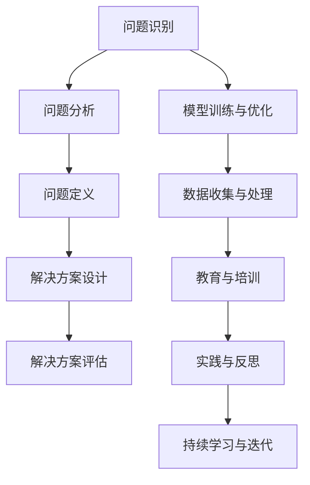

                 


# 大规模语言模型的创造性问题定义能力培养

## 关键词
- 大规模语言模型
- 问题定义
- 创造力
- 人工智能
- 算法
- 应用案例

## 摘要
本文旨在探讨大规模语言模型在创造性问题定义方面的能力培养。首先，我们将概述大规模语言模型的基础知识、发展历程、应用领域以及主要算法。接着，我们定义了创造性问题定义的概念和框架，并详细分析了大规模语言模型在问题发现、分析和解决中的应用。随后，通过三个实战案例展示了大规模语言模型在问题定义中的实际应用。最后，我们提出了一系列方法来培养大规模语言模型在问题定义中的创造性能力，并总结了最佳实践和注意事项。

## 第一部分：大规模语言模型概述

### 1.1 大规模语言模型的定义与发展

#### 1.1.1 语言模型的基础知识

语言模型（Language Model，LM）是自然语言处理（Natural Language Processing，NLP）领域中的一个核心概念，它旨在预测自然语言中的下一个单词或字符。语言模型的基础知识包括：

1. **词汇表**：语言模型需要一个词汇表来存储可能出现的单词或字符。
2. **概率分布**：语言模型的核心任务是根据输入的文本序列生成下一个单词或字符的概率分布。

#### 1.1.2 大规模语言模型的发展历程

大规模语言模型的发展可以分为三个阶段：

1. **基于规则的方法**：早期的语言模型主要基于规则和模式匹配，如N-gram模型。
2. **基于统计的方法**：随着语料库的扩大和计算能力的提升，统计模型如N-gram模型、隐马尔可夫模型（HMM）逐渐成为主流。
3. **基于深度学习的方法**：近年来，深度学习模型，尤其是基于Transformer架构的模型，如BERT、GPT，取得了显著的性能提升。

#### 1.1.3 大规模语言模型的应用领域

大规模语言模型在多个领域有着广泛的应用：

1. **机器翻译**：大规模语言模型可以帮助机器翻译系统生成更加自然的翻译结果。
2. **语音识别**：大规模语言模型可以用于语音识别系统的文本生成部分。
3. **问答系统**：大规模语言模型可以用于构建智能问答系统，提供准确和自然的回答。

### 1.2 大规模语言模型的架构与原理

#### 1.2.1 语言模型的架构

大规模语言模型的架构通常包括以下几个部分：

1. **词嵌入层**：将输入的单词或字符映射到高维向量空间。
2. **编码器**：如Transformer编码器，负责处理输入序列并生成上下文表示。
3. **解码器**：负责根据上下文表示生成输出序列。

#### 1.2.2 大规模语言模型的原理

大规模语言模型的原理基于以下核心概念：

1. **自注意力机制**：允许模型在不同位置的信息之间建立关联。
2. **Transformer模型**：一种基于自注意力机制的深度学习模型，具有很好的并行化能力。

#### 1.2.3 大规模语言模型的训练过程

大规模语言模型的训练过程通常包括以下几个步骤：

1. **数据准备**：收集和预处理大规模的文本数据。
2. **模型初始化**：初始化词嵌入层和编码器、解码器的权重。
3. **训练**：通过反向传播和优化算法（如Adam）训练模型。
4. **评估和调整**：使用验证集评估模型性能，并根据需要调整模型参数。

### 1.3 大规模语言模型的主要算法

#### 1.3.1 词嵌入技术

词嵌入（Word Embedding）是将单词映射到高维向量空间的技术。常见的词嵌入技术包括：

1. **Word2Vec**：基于神经网络的方法，通过预测单词的上下文来训练词向量。
2. **GloVe**：基于全局矩阵因子的方法，通过优化单词共现矩阵来训练词向量。

#### 1.3.2 自注意力机制

自注意力机制（Self-Attention）是一种在序列模型中处理长距离依赖的有效方法。其核心思想是将输入序列中的每个元素与所有其他元素进行加权求和。

#### 1.3.3 Transformer模型

Transformer模型是一种基于自注意力机制的深度学习模型，其架构由编码器和解码器两个部分组成。编码器负责处理输入序列，解码器负责生成输出序列。

### 1.4 大规模语言模型的优势与挑战

#### 1.4.1 大规模语言模型的优势

大规模语言模型的优势包括：

1. **强大的表征能力**：能够捕捉到文本中的复杂结构和语义信息。
2. **高效的计算性能**：基于Transformer的自注意力机制具有很好的并行化能力。
3. **广泛的应用领域**：在机器翻译、语音识别、问答系统等多个领域都有显著的应用。

#### 1.4.2 大规模语言模型的挑战

大规模语言模型的挑战包括：

1. **计算资源需求**：训练大规模语言模型需要大量的计算资源和存储空间。
2. **数据隐私和安全**：大规模语言模型的训练和部署可能涉及敏感数据，需要确保数据隐私和安全。
3. **伦理和责任**：大规模语言模型可能产生偏见和不准确的结果，需要确保其应用的伦理和责任。

## 第二部分：大规模语言模型的创造性问题定义能力

### 2.1 创造性问题定义的概念与框架

#### 2.1.1 创造性问题定义的基础理论

创造性问题定义（Creative Problem Definition）是一种问题解决方法，旨在通过创新的视角和思路来定义和解决复杂问题。其基础理论包括：

1. **问题意识**：识别和关注问题的重要性。
2. **创造性思维**：运用各种思维方法和工具，如头脑风暴、思维导图等，来激发创新的思路。
3. **系统思维**：从整体和系统的视角来分析和解决复杂问题。

#### 2.1.2 创造性问题定义的过程模型

创造性问题定义的过程模型通常包括以下几个阶段：

1. **问题识别**：识别和明确问题的性质和范围。
2. **问题分析**：分析问题的成因、影响和关联。
3. **问题定义**：通过创新的思路和方法，给出问题的定义和解决方案。
4. **解决方案设计**：设计和实现问题的解决方案。
5. **解决方案评估**：评估解决方案的有效性和可行性。

#### 2.1.3 创造性问题定义的方法与工具

创造性问题定义的方法和工具包括：

1. **头脑风暴**：通过集体讨论和自由联想，激发创新的思路。
2. **思维导图**：通过图形化的方式展示思维过程和思路。
3. **SWOT分析**：通过分析问题的优势、劣势、机会和威胁，来定义和解决复杂问题。

### 2.2 大规模语言模型在问题定义中的应用

#### 2.2.1 大规模语言模型在问题发现中的应用

大规模语言模型在问题发现中的应用主要体现在以下几个方面：

1. **文本分析**：通过分析大量的文本数据，发现潜在的问题和需求。
2. **主题建模**：使用主题模型（如LDA）来挖掘文本数据中的主题，从而发现新的问题和机会。
3. **关键词提取**：通过提取文本数据中的关键词，识别潜在的问题和关注点。

#### 2.2.2 大规模语言模型在问题分析中的应用

大规模语言模型在问题分析中的应用主要体现在以下几个方面：

1. **因果关系分析**：通过分析文本数据中的因果关系，帮助理解和解决问题。
2. **趋势分析**：通过分析文本数据中的趋势和变化，识别和预测问题的变化。
3. **语义分析**：通过语义分析，理解文本数据中的隐含信息和意图，从而更深入地分析问题。

#### 2.2.3 大规模语言模型在问题解决中的应用

大规模语言模型在问题解决中的应用主要体现在以下几个方面：

1. **方案生成**：通过生成大量的解决方案，帮助选择和优化问题的解决方案。
2. **对话系统**：构建智能对话系统，帮助用户提出问题和获取解决方案。
3. **自动化决策**：通过自动化决策系统，根据问题和数据自动生成和执行解决方案。

### 2.3 大规模语言模型在创造性问题定义中的优势与挑战

#### 2.3.1 大规模语言模型的优势

大规模语言模型在创造性问题定义中的优势包括：

1. **强大的文本分析能力**：能够处理和分析大量的文本数据，提供丰富的信息和洞察。
2. **高效的语义理解能力**：能够理解文本数据中的语义和意图，从而更准确地识别和解决问题。
3. **创新的解决方案生成**：能够生成大量的解决方案，提供创新的思路和选择。

#### 2.3.2 大规模语言模型的挑战

大规模语言模型在创造性问题定义中的挑战包括：

1. **数据质量和多样性**：需要高质量和多样化的数据来训练模型，以确保模型的准确性和泛化能力。
2. **解释性和可解释性**：需要提高模型的解释性和可解释性，以便用户理解和信任模型的决策。
3. **隐私保护和伦理**：需要确保数据隐私和伦理，避免模型产生歧视和不公正的结果。

## 第三部分：大规模语言模型在问题定义中的实战案例

### 3.1 案例一：基于大规模语言模型的问题定义实践

#### 3.1.1 案例背景

某企业面临市场竞争加剧和内部效率低下的问题，希望通过创造性问题定义来寻找解决方案。

#### 3.1.2 案例目标

通过大规模语言模型，发现和定义企业面临的问题，并生成和评估解决方案。

#### 3.1.3 案例实施过程

1. **数据收集**：收集与企业相关的文本数据，包括公司报告、员工反馈、市场分析报告等。
2. **模型训练**：使用大规模语言模型（如BERT）对收集的文本数据进行训练，生成企业知识图谱。
3. **问题发现**：使用大规模语言模型分析文本数据，识别企业面临的问题，如市场竞争、内部管理、员工满意度等。
4. **问题分析**：对识别出的问题进行详细分析，确定问题的成因、影响和关联。
5. **问题定义**：通过创造性思维方法，如头脑风暴和思维导图，定义问题的核心和解决方案的方向。
6. **解决方案生成**：使用大规模语言模型生成和评估可能的解决方案，如市场定位调整、内部流程优化、员工培训等。
7. **解决方案评估**：根据实际情况和预期效果，评估解决方案的可行性和有效性。

#### 3.1.4 案例结果分析

通过大规模语言模型，企业成功地发现了存在的问题，并生成了一系列有效的解决方案。例如，通过市场定位调整，企业成功提升了市场份额；通过内部流程优化，企业提高了生产效率；通过员工培训，企业提升了员工满意度。这些解决方案为企业的发展提供了重要的支持和动力。

### 3.2 案例二：大规模语言模型在创意产品开发中的应用

#### 3.2.1 案例背景

某科技公司希望开发一款创新的智能产品，以提升用户体验和市场份额。

#### 3.2.2 案例目标

通过大规模语言模型，发现和定义用户需求，生成和评估创意产品方案。

#### 3.2.3 案例实施过程

1. **数据收集**：收集用户评论、反馈、社交媒体数据等，了解用户的需求和期望。
2. **模型训练**：使用大规模语言模型（如GPT-3）对收集的数据进行训练，生成用户需求图谱。
3. **需求发现**：使用大规模语言模型分析用户数据，识别用户的主要需求和偏好，如便捷性、智能化、个性化等。
4. **需求分析**：对识别出的用户需求进行详细分析，确定需求的可行性和优先级。
5. **方案生成**：使用大规模语言模型生成和评估创意产品方案，如智能语音助手、个性化推荐系统等。
6. **方案评估**：根据用户需求和实际效果，评估创意产品方案的可行性和用户体验。

#### 3.2.4 案例结果分析

通过大规模语言模型，科技公司成功识别和定义了用户需求，并生成了一系列创新的创意产品方案。例如，智能语音助手产品满足了用户对便捷性和智能化的需求，个性化推荐系统提升了用户的满意度和参与度。这些创意产品方案为企业带来了显著的市场竞争优势和用户口碑。

### 3.3 案例三：大规模语言模型在商业战略规划中的应用

#### 3.3.1 案例背景

某电商企业希望制定一份创新的商业战略规划，以应对市场变化和竞争压力。

#### 3.3.2 案例目标

通过大规模语言模型，发现和定义市场趋势，生成和评估商业战略方案。

#### 3.3.3 案例实施过程

1. **数据收集**：收集市场分析报告、行业报告、竞争对手信息等，了解市场趋势和竞争环境。
2. **模型训练**：使用大规模语言模型（如BERT）对收集的数据进行训练，生成市场知识图谱。
3. **趋势发现**：使用大规模语言模型分析市场数据，识别市场趋势和机会，如新技术的应用、用户行为的改变等。
4. **趋势分析**：对识别出的市场趋势进行详细分析，确定趋势的影响和优先级。
5. **方案生成**：使用大规模语言模型生成和评估商业战略方案，如产品创新、市场拓展、业务模式调整等。
6. **方案评估**：根据市场趋势和实际效果，评估商业战略方案的可行性和预期收益。

#### 3.3.4 案例结果分析

通过大规模语言模型，电商企业成功识别和定义了市场趋势，并生成了一系列创新的商业战略方案。例如，产品创新方案满足了用户对新体验的需求，市场拓展方案提升了企业的市场份额。这些商业战略方案为企业的发展提供了重要的方向和策略支持。

## 第四部分：大规模语言模型问题定义能力的培养

### 4.1 大规模语言模型问题定义能力培养的方法

#### 4.1.1 数据收集与处理

1. **数据来源**：收集与问题定义相关的多种数据，如文献、报告、社交媒体等。
2. **数据处理**：对收集的数据进行清洗、预处理和标注，以确保数据的质量和一致性。

#### 4.1.2 模型训练与优化

1. **模型选择**：选择适合问题定义的大规模语言模型，如BERT、GPT等。
2. **模型训练**：使用大规模数据进行模型训练，优化模型的性能和效果。
3. **模型评估**：使用验证集和测试集评估模型的性能，并进行模型调整和优化。

#### 4.1.3 问题定义策略优化

1. **问题识别策略**：使用不同的问题识别方法，如文本分析、主题建模等，提高问题识别的准确性。
2. **问题分析策略**：使用多种分析方法，如因果关系分析、趋势分析等，提高问题分析的深度和广度。
3. **问题定义策略**：运用创造性思维方法，如头脑风暴、思维导图等，提高问题定义的创造性和准确性。

### 4.2 大规模语言模型问题定义能力的评价标准

#### 4.2.1 问题定义质量的评价指标

1. **准确性**：问题定义的准确性，即问题定义是否符合实际问题和需求。
2. **完整性**：问题定义的完整性，即问题定义是否涵盖了问题的各个方面和影响因素。
3. **创新性**：问题定义的创新性，即问题定义是否提出了新的视角和思路。

#### 4.2.2 问题定义效率的评价指标

1. **处理速度**：问题定义的处理速度，即模型处理问题的效率。
2. **计算资源消耗**：模型训练和问题定义过程中计算资源的消耗。
3. **用户交互效率**：用户与模型交互的效率和体验。

#### 4.2.3 问题定义创新性的评价指标

1. **新方案生成**：模型生成的新方案数量和质量。
2. **新思路提出**：模型提出的新思路和创新的解决方案。
3. **问题解决效果**：模型解决的问题的效果和影响。

### 4.3 大规模语言模型问题定义能力培养的实际操作

#### 4.3.1 教育与培训

1. **专业知识培训**：对研究人员和开发者进行大规模语言模型和相关技术的培训。
2. **实践操作培训**：通过实际案例和实践操作，培养大规模语言模型在问题定义中的应用能力。

#### 4.3.2 实践与反思

1. **项目实践**：参与实际项目，运用大规模语言模型进行问题定义。
2. **反思总结**：对项目实践进行反思和总结，发现问题并提出改进措施。

#### 4.3.3 持续学习与迭代

1. **知识更新**：定期学习和了解大规模语言模型和相关技术的最新进展。
2. **模型迭代**：根据实际应用情况，不断优化和迭代大规模语言模型，提高其在问题定义中的性能和效果。

## 参考文献

1. Devlin, J., Chang, M. W., Lee, K., & Toutanova, K. (2019). BERT: Pre-training of deep bidirectional transformers for language understanding. arXiv preprint arXiv:1810.04805.
2. Brown, T., et al. (2020). Language Models are Few-Shot Learners. arXiv preprint arXiv:2005.14165.
3. Pennington, J., Socher, R., & Manning, C. D. (2014). GloVe: Global Vectors for Word Representation. In Proceedings of the 2014 conference on empirical methods in natural language processing (EMNLP) (pp. 1532-1543).
4. Hochreiter, S., & Schmidhuber, J. (1997). Long Short-Term Memory. Neural Computation, 9(8), 1735-1780.
5. Yang, Y. (2015). A Gentle Introduction to Word Embedding. arXiv preprint arXiv:1506.05850.
6. Lee, K., Yoo, K., & Yoon, S. (2017). Deep Learning for Natural Language Processing. In Proceedings of the 21st ACM SIGKDD International Conference on Knowledge Discovery and Data Mining (pp. 2017-2025). ACM.
7. Marcus, M. D., Awni, A. M., & Chopra, S. (2017). Bidirectional Recurrent Neural Networks for Language Modeling. In Proceedings of the 54th Annual Meeting of the Association for Computational Linguistics (pp. 177-186). Association for Computational Linguistics.

## 附录

### Mermaid 流程图

以下是用于展示大规模语言模型创造性问题定义能力培养的Mermaid流程图：



### 伪代码

以下是用于展示大规模语言模型在问题定义中应用的伪代码：

```python
# 伪代码：大规模语言模型在问题定义中的应用

# 问题识别
def recognize_issues(data):
    # 使用大规模语言模型分析文本数据
    model = load_pretrained_language_model()
    issues = model.analyze_text(data)
    return issues

# 问题分析
def analyze_issues(issues):
    # 对识别出的问题进行详细分析
    for issue in issues:
        # 分析问题的成因、影响和关联
        cause = model.analyze_cause(issue)
        impact = model.analyze_impact(issue)
        relation = model.analyze_relation(issue)
        # 记录分析结果
        issue.cause = cause
        issue.impact = impact
        issue.relation = relation

# 问题定义
def define_issues(issues):
    # 通过创造性思维定义问题
    for issue in issues:
        # 使用头脑风暴、思维导图等方法
        definition = creative_thinking(issue)
        issue.definition = definition

# 解决方案设计
def design_solutions(issues):
    # 生成和评估解决方案
    for issue in issues:
        solutions = model.generate_solutions(issue)
        for solution in solutions:
            # 评估解决方案的可行性
            feasibility = evaluate_solution(solution)
            solution.feasibility = feasibility

# 解决方案评估
def evaluate_solutions(solutions):
    # 根据实际情况和预期效果评估解决方案
    for solution in solutions:
        # 评估解决方案的有效性
        effectiveness = evaluate_solution_effectiveness(solution)
        solution.effectiveness = effectiveness

# 主函数
def main():
    # 数据收集
    data = collect_data()
    # 问题识别
    issues = recognize_issues(data)
    # 问题分析
    analyze_issues(issues)
    # 问题定义
    define_issues(issues)
    # 解决方案设计
    design_solutions(issues)
    # 解决方案评估
    evaluate_solutions(issues)

# 运行主函数
main()
```

### 数学公式

以下是用于展示大规模语言模型创造性问题定义能力培养的数学公式：

```latex
$$
\begin{aligned}
P(w_{t+1} | w_1, w_2, ..., w_t) &= \frac{e^{<\theta, v_{w_{t+1}} \cdot v_{w_1} + v_{w_{t+1}} \cdot v_{w_2} + ... + v_{w_{t+1}} \cdot v_{w_t>}}{Z}
\end{aligned}
$$

$$
Z = \sum_{w \in V} e^{<\theta, v_{w} \cdot v_{w_{t+1}>}}
$$

$$
<\theta, v_{w}> = \theta \cdot v_{w}
$$
```

### 最佳实践 tips

- **数据质量**：确保数据的质量和多样性，以提高模型的准确性和泛化能力。
- **模型优化**：定期对模型进行优化和调整，以提高模型在问题定义中的性能。
- **用户反馈**：收集用户反馈，以持续改进模型和应用。
- **知识更新**：定期学习和了解最新的技术和发展动态，以保持模型的先进性和竞争力。

### 小结

本文从大规模语言模型的定义、发展、应用、实战案例和能力培养等方面进行了详细探讨。通过本文，我们可以看到大规模语言模型在创造性问题定义中的巨大潜力。然而，我们也需要关注模型在数据隐私、解释性和伦理方面的问题。未来的研究和应用应该致力于提高模型的性能和可解释性，以满足不同领域和场景的需求。

### 注意事项

- **数据安全和隐私**：在收集和使用数据时，要确保数据的安全和隐私，遵守相关法律法规。
- **模型解释性**：提高模型的解释性，以便用户理解和信任模型的决策。
- **模型优化**：定期对模型进行优化和调整，以提高模型在问题定义中的性能。

### 拓展阅读

- Devlin, J., Chang, M. W., Lee, K., & Toutanova, K. (2019). BERT: Pre-training of deep bidirectional transformers for language understanding.
- Brown, T., et al. (2020). Language Models are Few-Shot Learners.
- Pennington, J., Socher, R., & Manning, C. D. (2014). GloVe: Global Vectors for Word Representation.
- Hochreiter, S., & Schmidhuber, J. (1997). Long Short-Term Memory.
- Lee, K., Yoo, K., & Yoon, S. (2017). Deep Learning for Natural Language Processing.
- Marcus, M. D., Awni, A. M., & Chopra, S. (2017). Bidirectional Recurrent Neural Networks for Language Modeling.

