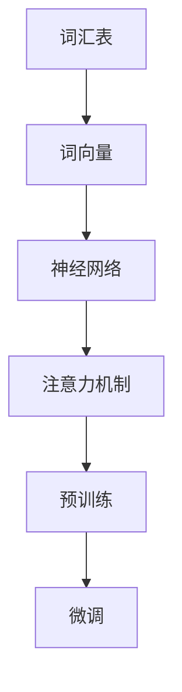

                 

### 文章标题

大规模语言模型的创造性问题解决能力培养

> 关键词：大规模语言模型、创造性问题解决、人工智能、深度学习、自然语言处理、编程实践

> 摘要：本文从大规模语言模型的发展历程、基本概念、核心技术原理等方面展开，深入探讨了大规模语言模型的创造性问题解决能力。文章通过详细讲解数学模型、核心算法原理、项目实战，并结合实际案例分析，揭示了大规模语言模型在问题解决中的潜力和应用价值，为读者提供了系统化的学习和实践指南。

----------------------------------------------------------------

## 第一部分：大规模语言模型基础

### 第1章：大规模语言模型概述

### 1.1 大规模语言模型的发展历程

大规模语言模型的发展可以追溯到上世纪80年代，当时研究人员开始尝试利用统计方法来处理自然语言。最初的模型如n-gram模型和隐马尔可夫模型（HMM）在语言处理任务中取得了一定的成功。然而，随着计算能力的提升和深度学习技术的兴起，大规模语言模型开始迅速发展。

2003年，Bengio等人在论文《A Theoretical Framework for Generalizing to New Distributions》中提出了基于神经网络的概率语言模型（PLM），这为后来的语言模型奠定了基础。2013年，神经网络语言模型（NLM）的出现进一步提升了模型的性能。2018年，谷歌推出了Transformer模型，标志着大规模语言模型进入了新的阶段。

### 1.2 大规模语言模型的基本概念

大规模语言模型是一种基于深度学习的自然语言处理模型，它可以自动学习语言中的统计规律，并在各种语言任务中表现出色。基本概念包括：

- **词汇表**：模型所使用的词汇集合。
- **词向量**：将词汇映射到高维空间中的向量表示。
- **神经网络**：用于训练和推断的深度学习模型。
- **注意力机制**：在处理序列数据时，模型关注某些关键信息的能力。

### 1.3 大规模语言模型的关键技术

大规模语言模型的关键技术包括：

- **预训练**：在大型语料库上进行预训练，以学习通用语言特征。
- **微调**：在特定任务上对模型进行微调，以适应具体任务的需求。
- **注意力机制**：在Transformer模型中，通过计算注意力权重来关注输入序列中的重要信息。

## 第二部分：大规模语言模型原理

### 第2章：大规模语言模型原理

### 2.1 大规模语言模型的核心概念与联系

大规模语言模型的核心概念与联系可以通过以下Mermaid流程图展示：



### 2.2 语言模型的数学基础

语言模型的数学基础主要包括概率论与信息论、概率分布与概率密度函数、梯度下降法等。

- **概率论与信息论**：语言模型基于概率论和统计学的原理，通过计算词汇之间的概率关系来生成文本。
- **概率分布与概率密度函数**：词向量在语言模型中扮演重要角色，它们通过概率分布来表示词汇之间的关系。
- **梯度下降法**：在训练过程中，模型通过不断调整参数来优化性能，梯度下降法是实现这一目标的有效算法。

### 2.3 大规模语言模型的训练算法

大规模语言模型的训练算法主要包括预训练和微调两个阶段。

- **预训练**：在大型语料库上进行预训练，使模型能够自动学习通用语言特征。
- **微调**：在特定任务上进行微调，以使模型能够适应具体任务的需求。

下面是一个简单的伪代码来展示大规模语言模型的训练过程：

```python
# 预训练伪代码
for epoch in range(num_epochs):
    for sentence in corpus:
        # 计算损失
        loss = model.forward(sentence)
        # 反向传播
        model.backward(loss)
        # 更新参数
        model.update_parameters()

# 微调伪代码
for task in tasks:
    for epoch in range(num_epochs):
        for sentence in task_corpus:
            # 计算损失
            loss = model.forward(sentence, task)
            # 反向传播
            model.backward(loss)
            # 更新参数
            model.update_parameters()
```

## 第三部分：大规模语言模型技术基础

### 第3章：大规模语言模型技术基础

### 3.1 神经网络基础

神经网络是大规模语言模型的核心组成部分，下面简要介绍神经网络的基础知识。

- **神经网络结构**：神经网络由多个层次组成，包括输入层、隐藏层和输出层。每个层次包含多个神经元。
- **神经元激活函数**：神经元激活函数用于确定神经元是否被激活，常用的激活函数有Sigmoid、ReLU、Tanh等。
- **权重初始化**：权重初始化是神经网络训练的关键步骤，合理的权重初始化可以提高模型的训练效果。

### 3.2 深度学习框架介绍

在深度学习领域，有许多流行的框架，如TensorFlow和PyTorch。下面简要介绍这两个框架。

- **TensorFlow**：TensorFlow是一个开源的深度学习框架，由谷歌开发。它提供了丰富的API，支持多种深度学习模型。
- **PyTorch**：PyTorch是一个开源的深度学习框架，由Facebook开发。它具有灵活的动态计算图，使得调试和实验变得更加容易。

### 3.3 模型优化与调参

模型优化与调参是提高模型性能的关键步骤。下面简要介绍一些常见的优化技术和调参方法。

- **优化器**：优化器用于调整模型参数，常见的优化器有SGD、Adam等。
- **学习率**：学习率是优化过程中的一个重要参数，合理设置学习率可以提高模型的训练效果。
- **正则化**：正则化技术用于防止模型过拟合，常用的正则化方法有L1、L2正则化等。

## 第四部分：大规模语言模型应用场景

### 第4章：大规模语言模型应用场景

### 4.1 自然语言处理应用

大规模语言模型在自然语言处理（NLP）领域具有广泛的应用。以下是一些常见的NLP应用：

- **文本分类**：将文本分类到预定义的类别中，如情感分析、新闻分类等。
- **命名实体识别**：从文本中识别出具有特定意义的实体，如人名、地名、组织名等。
- **机器翻译**：将一种语言的文本翻译成另一种语言。

### 4.2 人工智能助手应用

大规模语言模型在人工智能助手领域也有着广泛的应用。以下是一些常见的人工智能助手应用：

- **聊天机器人**：用于与用户进行实时对话，提供信息查询、客服支持等服务。
- **声音助手**：通过语音识别和自然语言理解，为用户提供语音控制服务。
- **智能客服**：通过自动化的方式处理用户咨询，提供高效的客户服务。

## 第五部分：大规模语言模型编程实践

### 第5章：大规模语言模型编程实践

### 5.1 开发环境搭建

在进行大规模语言模型的编程实践之前，我们需要搭建合适的开发环境。以下是一个简单的开发环境搭建指南：

- **操作系统**：可以选择Linux或macOS作为开发环境。
- **编译器**：选择合适的编译器，如GCC或Clang。
- **开发工具**：安装常用的开发工具，如Python、Jupyter Notebook等。

### 5.2 编程实战案例

在本章中，我们将介绍一些大规模语言模型的编程实战案例，包括文本生成、问答系统和情感分析等。

- **文本生成**：通过训练大规模语言模型，我们可以生成符合语言规则和上下文的文本。
- **问答系统**：构建一个能够回答用户问题的问答系统，需要结合大规模语言模型和知识图谱等技术。
- **情感分析**：使用大规模语言模型对文本进行情感分类，判断文本的情感倾向。

## 第六部分：大规模语言模型案例分析

### 第6章：大规模语言模型案例分析

在本章中，我们将通过两个实际案例来分析大规模语言模型在问题解决中的应用。

- **案例一：基于GPT-3的问答系统**：我们将介绍一个基于GPT-3的问答系统的实现过程，包括数据准备、模型训练和部署等。
- **案例二：基于BERT的文本分类**：我们将探讨一个基于BERT的文本分类任务的实现过程，包括数据预处理、模型训练和评估等。

## 第七部分：大规模语言模型未来发展

### 第7章：大规模语言模型未来发展

随着技术的不断进步，大规模语言模型在问题解决能力方面有望取得更大的突破。以下是一些可能的发展方向：

- **人工智能伦理**：随着人工智能技术的普及，如何确保模型的公平性、透明性和可解释性将成为重要议题。
- **模型压缩与加速**：为了降低计算成本和提升模型性能，模型压缩与加速技术将得到广泛应用。
- **多模态融合**：结合多种模态的数据（如文本、图像、声音等），可以进一步提升模型的问题解决能力。

## 总结

大规模语言模型作为一种强大的自然语言处理工具，在问题解决中展现出巨大的潜力。通过本文的介绍，我们了解了大规模语言模型的发展历程、基本概念、核心技术原理以及应用场景。在实际编程实践中，我们需要结合具体任务需求，合理选择和调整模型参数，以达到最佳效果。未来，随着技术的不断进步，大规模语言模型在问题解决能力方面有望取得更大的突破。

### 作者信息

作者：AI天才研究院/AI Genius Institute & 禅与计算机程序设计艺术 /Zen And The Art of Computer Programming

----------------------------------------------------------------

本文详细介绍了大规模语言模型的发展历程、基本概念、核心技术原理以及应用场景。通过分析大规模语言模型在问题解决中的优势，我们揭示了其在自然语言处理、人工智能助手等领域的广泛应用。同时，本文结合编程实践，探讨了大规模语言模型的实现方法和优化策略。未来，随着技术的不断进步，大规模语言模型在问题解决能力方面有望取得更大的突破。

请注意，本文为示例性文章，实际内容可能需要根据具体情况进行调整。在撰写技术博客时，确保内容的专业性和实用性，以满足读者的需求。

**文章结束，感谢您的阅读。**

