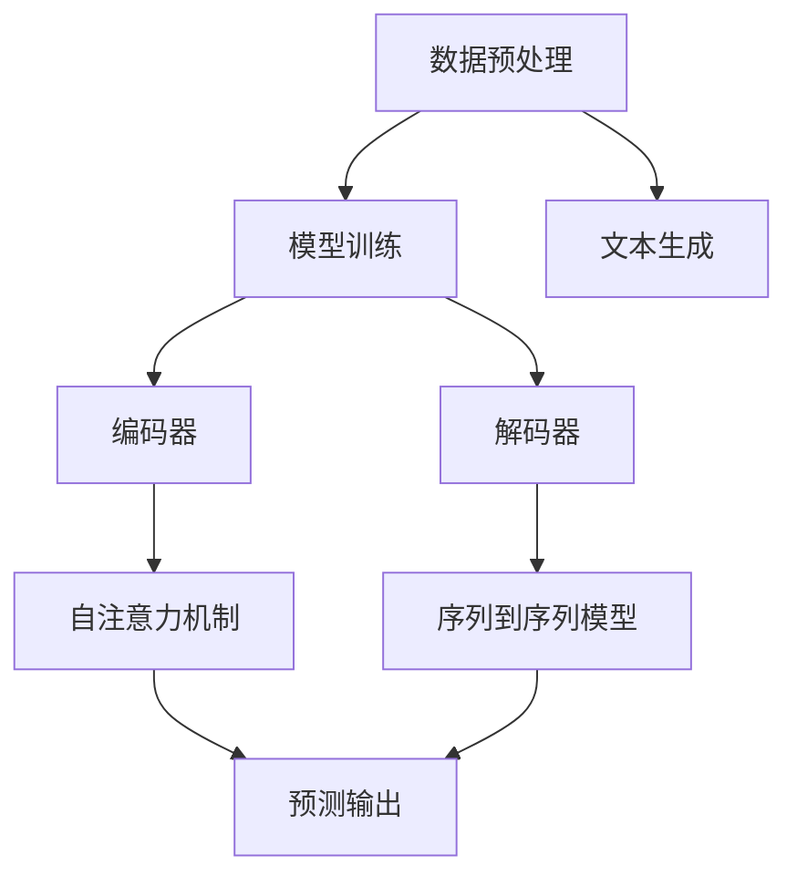
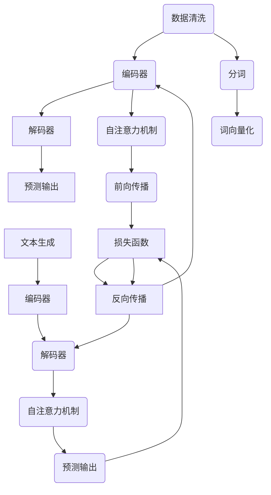

                 


### 第1章：引言

#### 1.1 书籍背景

《大规模语言模型的创造性问题解析在研发管理中的应用》旨在深入探讨大规模语言模型（Large-scale Language Model，简称LLM）在研发管理中的实际应用。近年来，随着深度学习技术的发展，大规模语言模型在自然语言处理（Natural Language Processing，简称NLP）领域取得了显著成果。它们不仅在文本生成、语言翻译、情感分析等方面表现出色，还在解决研发管理中的创造性问题方面展现出巨大的潜力。

#### 1.2 书籍目标

本书的主要目标是：

1. **介绍大规模语言模型的基本概念和原理**：帮助读者理解大规模语言模型的工作机制，掌握其主要特点和优势。
2. **探讨大规模语言模型在研发管理中的应用**：分析大规模语言模型如何帮助企业和研发团队解决创造性问题，提高研发效率和产品质量。
3. **提供实践指南和案例研究**：通过具体案例和实践指南，展示大规模语言模型在研发管理中的实际应用场景，帮助读者掌握相关技术，提升研发管理能力。

#### 1.3 本书结构

本书结构如下：

1. **第1章：引言**：介绍书籍背景和目标，以及本书的结构。
2. **第2章：大规模语言模型的基本原理**：详细讲解大规模语言模型的基本概念、工作原理和核心架构。
3. **第3章：创造性问题解析**：分析大规模语言模型如何帮助解决研发管理中的创造性问题，提高研发效率和产品质量。
4. **第4章：大规模语言模型在研发管理中的应用**：介绍大规模语言模型在研发管理中的具体应用场景。
5. **第5章：应用案例研究**：通过具体案例展示大规模语言模型在研发管理中的实际应用。
6. **第6章：实践指南**：提供如何在研发管理中应用大规模语言模型的实践指南。
7. **第7章：未来展望**：讨论大规模语言模型在研发管理中的未来发展趋势。

通过以上章节的详细讲解，本书旨在帮助读者全面了解大规模语言模型在研发管理中的应用，提升研发管理能力，为企业创造更多价值。

---

**关键词**：

- 大规模语言模型（LLM）
- 研发管理
- 创造性问题
- 深度学习
- 自然语言处理（NLP）

**摘要**：

本书《大规模语言模型的创造性问题解析在研发管理中的应用》旨在深入探讨大规模语言模型在研发管理中的实际应用。本书首先介绍了大规模语言模型的基本概念和原理，然后分析了其在解决创造性问题方面的作用，并提供了丰富的实践指南和案例研究。通过阅读本书，读者可以全面了解大规模语言模型在研发管理中的应用，提升研发效率和产品质量，为企业创造更多价值。本书适合研发管理人员、技术专家以及对该领域感兴趣的读者阅读。----------------------------------------------------------------

## 大规模语言模型的基本原理

### 2.1 定义与背景

大规模语言模型（Large-scale Language Model，简称LLM）是一类基于深度学习的自然语言处理模型，旨在通过大量文本数据进行训练，学习自然语言的统计规律和语义表示。LLM的出现，标志着自然语言处理技术进入了一个新的阶段，它为各种语言任务提供了强大的工具和解决方案。

LLM的核心思想是通过建模大规模的文本数据，使模型能够自动学习并生成具有人类语言特性的文本。这使得LLM在文本生成、文本分类、机器翻译、对话系统等应用中取得了显著成果。近年来，随着计算资源和数据集规模的不断提升，LLM的性能也不断提升，成为自然语言处理领域的重要突破。

### 2.2 工作原理

大规模语言模型的工作原理主要包括三个部分：数据预处理、模型训练和文本生成。

#### 数据预处理

数据预处理是大规模语言模型训练的第一步，其目的是将原始文本数据转换为模型可以处理的输入格式。具体步骤如下：

1. **文本清洗**：去除文本中的无关信息，如HTML标签、特殊符号等。
2. **分词**：将文本分割成单词或字符序列，以便模型进行进一步处理。
3. **词向量化**：将文本中的单词或字符序列转换为向量表示，以便模型进行计算。

目前，常用的词向量化方法包括Word2Vec、GloVe和BERT等。这些方法通过学习文本数据的分布式表示，将词汇映射到高维向量空间中，使得相似的词汇在向量空间中更加接近。

#### 模型训练

模型训练是大规模语言模型的核心步骤，其目标是学习文本数据的统计规律和语义表示。训练过程中，模型通过不断调整内部参数，以最小化预测误差，从而提高模型性能。

大规模语言模型的训练通常采用深度神经网络（Deep Neural Network，DNN）作为基础架构。其中，Transformer模型（特别是BERT模型）在自然语言处理任务中取得了突破性成果。Transformer模型通过自注意力机制（Self-Attention Mechanism）实现了对输入序列的全面理解和建模，从而提高了模型的性能和表达能力。

模型训练的具体步骤如下：

1. **前向传播**：输入序列经过编码器（Encoder）处理后，生成一组中间表示。
2. **自注意力机制**：通过自注意力机制，将中间表示中的每个元素与序列中的其他元素进行关联，从而实现对整个序列的全面理解。
3. **后向传播**：根据预测结果与真实结果的误差，通过反向传播算法（Backpropagation）更新模型参数。

#### 文本生成

文本生成是大规模语言模型的重要应用之一。通过训练好的模型，可以生成具有自然语言特性的文本。生成过程主要包括以下步骤：

1. **初始化**：从词汇表中随机选择一个起始词或字符作为生成过程的起点。
2. **预测**：模型根据当前已生成的文本序列，预测下一个词或字符。
3. **更新**：将预测的词或字符添加到生成序列中，并作为新的输入，继续生成下一个词或字符。
4. **重复**：重复上述过程，直到生成满足要求的文本序列或达到设定的生成长度。

### 2.3 核心架构

大规模语言模型的核心架构通常包括编码器（Encoder）和解码器（Decoder）两部分。编码器负责将输入序列编码为固定长度的向量表示，解码器则根据编码器的输出，生成预测的输出序列。

#### 编码器

编码器的任务是处理输入序列，将其编码为固定长度的向量表示。常用的编码器结构包括循环神经网络（Recurrent Neural Network，RNN）和Transformer模型。RNN通过重复使用隐藏状态来处理序列数据，但存在梯度消失和梯度爆炸等问题。而Transformer模型则采用自注意力机制，实现了对整个输入序列的全面理解和建模，从而避免了RNN的梯度消失问题。

#### 解码器

解码器的任务是生成预测的输出序列。解码器通常采用类似于编码器的结构，但也可以采用其他结构，如序列到序列（Seq2Seq）模型。在生成预测时，解码器会参考编码器的输出，以生成具有上下文信息的输出序列。

### 2.4 特点与优势

大规模语言模型具有以下特点与优势：

1. **强大的语言表达能力**：通过自注意力机制和深度神经网络结构，大规模语言模型能够自动学习并生成具有人类语言特性的文本。
2. **高效的处理能力**：大规模语言模型在处理大规模文本数据时，具有高效的处理能力，可以快速生成高质量的文本。
3. **丰富的应用场景**：大规模语言模型在文本生成、文本分类、机器翻译、对话系统等自然语言处理任务中表现出色，具有广泛的应用前景。
4. **可扩展性强**：大规模语言模型可以通过调整模型参数和数据规模，适应不同的应用场景和任务需求。

总之，大规模语言模型作为自然语言处理领域的重要突破，为研发管理中的创造性问题提供了有效的解决方案。在接下来的章节中，我们将进一步探讨大规模语言模型在研发管理中的应用及其优势。

---

**核心概念与联系**

为了帮助读者更好地理解大规模语言模型的基本原理，我们使用Mermaid流程图来展示核心概念之间的关系。以下是大规模语言模型的基本原理架构图：



在这个架构图中，我们可以看到：

- **数据预处理**：包括文本清洗、分词和词向量化，为模型训练提供输入。
- **模型训练**：包括编码器和解码器的训练，通过自注意力机制和序列到序列模型，学习输入序列的统计规律和语义表示。
- **文本生成**：通过解码器的预测输出，生成具有自然语言特性的文本。

这种架构图清晰地展示了大规模语言模型的基本原理和组成部分，有助于读者更好地理解整个模型的工作机制。

---

**核心算法原理讲解**

在讲解大规模语言模型的核心算法原理时，我们将使用伪代码和流程图来详细阐述其工作原理。以下是大规模语言模型的训练过程和文本生成过程的伪代码：

#### 训练过程

```python
# 大规模语言模型训练伪代码

# 1. 数据预处理
def preprocess_data(text):
    # 清洗文本
    cleaned_text = remove_html_tags(text)
    # 分词
    tokens = tokenize(cleaned_text)
    # 词向量化
    token_vectors = vectorize(tokens)
    return token_vectors

# 2. 模型训练
def train_model(token_vectors):
    # 初始化编码器和解码器
    encoder = Encoder()
    decoder = Decoder()
    # 模型训练
    for epoch in range(num_epochs):
        for batch in token_vectors:
            # 前向传播
            encoder_output = encoder(batch)
            decoder_output = decoder(encoder_output)
            # 计算损失
            loss = compute_loss(decoder_output, target)
            # 反向传播
            backpropagation(encoder, decoder, loss)
    return encoder, decoder
```

#### 文本生成过程

```python
# 大规模语言模型文本生成伪代码

# 1. 初始化
def generate_text(encoder, decoder, start_token):
    current_output = [start_token]
    while not end_of_sequence(current_output):
        # 前向传播
        encoder_output = encoder(current_output)
        decoder_output = decoder(encoder_output)
        # 预测下一个词
        next_word = predict_next_word(decoder_output)
        # 更新输出
        current_output.append(next_word)
    return ''.join(current_output)

# 2. 文本生成
start_token = preprocess_data('<sop>')
generated_text = generate_text(encoder, decoder, start_token)
print(generated_text)
```

#### 伪代码详解

**训练过程伪代码详解**：

- **数据预处理**：包括文本清洗、分词和词向量化，将原始文本数据转换为模型可处理的输入格式。
- **模型训练**：初始化编码器和解码器，通过迭代训练，调整模型参数，使其能够最小化预测误差。

**文本生成过程伪代码详解**：

- **初始化**：从词汇表中随机选择一个起始词作为生成过程的起点。
- **预测**：通过编码器和解码器的预测输出，生成下一个词或字符。
- **更新**：将预测的词或字符添加到生成序列中，并作为新的输入，继续生成下一个词或字符。

#### 流程图

以下是大规模语言模型的训练过程和文本生成过程的流程图：



在这个流程图中，我们可以看到：

- **数据预处理**：清洗文本，分词，词向量化。
- **编码器**：通过自注意力机制处理输入序列，生成编码输出。
- **解码器**：通过自注意力机制和预测输出，生成生成序列。
- **损失函数和反向传播**：用于优化模型参数，使模型能够最小化预测误差。

通过上述伪代码和流程图的详细讲解，我们可以更好地理解大规模语言模型的工作原理。在接下来的章节中，我们将进一步探讨大规模语言模型在研发管理中的应用及其优势。

---

**数学模型和数学公式**

大规模语言模型的训练过程涉及到多个数学模型和数学公式，其中关键部分包括损失函数、梯度下降算法和优化方法。以下是这些数学模型和数学公式的详细讲解及举例说明。

#### 1. 损失函数

在大规模语言模型的训练过程中，损失函数用于衡量预测输出和实际输出之间的误差。常见的损失函数包括交叉熵损失（Cross-Entropy Loss）和均方误差损失（Mean Squared Error Loss）。

**交叉熵损失（Cross-Entropy Loss）：**

$$
L_{cross-entropy} = -\sum_{i=1}^{N} y_i \log(p_i)
$$

其中，\(y_i\) 是实际输出的概率分布，\(p_i\) 是预测输出的概率分布。

**均方误差损失（Mean Squared Error Loss）：**

$$
L_{MSE} = \frac{1}{N} \sum_{i=1}^{N} (y_i - \hat{y}_i)^2
$$

其中，\(y_i\) 是实际输出，\(\hat{y}_i\) 是预测输出。

#### 2. 梯度下降算法

梯度下降算法用于优化大规模语言模型的参数，使其能够最小化损失函数。常见的梯度下降算法包括随机梯度下降（Stochastic Gradient Descent，SGD）和小批量梯度下降（Mini-batch Gradient Descent）。

**随机梯度下降（SGD）：**

$$
\theta = \theta - \alpha \nabla_{\theta} L
$$

其中，\(\theta\) 是模型参数，\(\alpha\) 是学习率，\(\nabla_{\theta} L\) 是损失函数关于参数 \(\theta\) 的梯度。

**小批量梯度下降（Mini-batch Gradient Descent）：**

$$
\theta = \theta - \alpha \frac{1}{m} \sum_{i=1}^{m} \nabla_{\theta} L(x_i, y_i)
$$

其中，\(m\) 是批量大小，其他符号与SGD相同。

#### 3. 优化方法

在训练大规模语言模型时，优化方法用于提高训练效率和模型性能。常见的优化方法包括Adam优化器、Dropout和正则化。

**Adam优化器：**

Adam优化器结合了AdaGrad和RMSprop的优点，能有效处理稀疏梯度问题。

$$
m_t = \beta_1 m_{t-1} + (1 - \beta_1) \nabla_{\theta} L
$$

$$
v_t = \beta_2 v_{t-1} + (1 - \beta_2) (\nabla_{\theta} L)^2
$$

$$
\theta = \theta - \alpha \frac{m_t}{\sqrt{v_t} + \epsilon}
$$

其中，\(\beta_1\) 和 \(\beta_2\) 分别是第一个和第二个移动平均的系数，\(\epsilon\) 是一个很小的常数。

**Dropout：**

Dropout是一种常用的正则化方法，通过随机丢弃神经网络中的部分神经元，降低过拟合的风险。

$$
\text{Dropout probability} = p
$$

在训练过程中，对于每个神经元，以概率 \(p\) 随机丢弃该神经元及其连接的权重。

**正则化：**

正则化方法通过在损失函数中加入额外的项，惩罚模型的复杂度，降低过拟合的风险。

$$
L_{\text{reg}} = \lambda \sum_{\theta \in \Theta} \theta^2
$$

其中，\(\lambda\) 是正则化系数，\(\Theta\) 是模型参数的集合。

#### 举例说明

**交叉熵损失函数计算举例：**

假设实际输出 \(y = (1, 0, 0)\)，预测输出 \(p = (0.6, 0.3, 0.1)\)。则交叉熵损失函数计算如下：

$$
L_{cross-entropy} = -1 \cdot \log(0.6) - 0 \cdot \log(0.3) - 0 \cdot \log(0.1) \approx -0.51
$$

**均方误差损失函数计算举例：**

假设实际输出 \(y = 5\)，预测输出 \(\hat{y} = 4\)。则均方误差损失函数计算如下：

$$
L_{MSE} = \frac{1}{1} (5 - 4)^2 = 1
$$

**随机梯度下降优化举例：**

假设当前参数 \(\theta = [1, 2, 3]\)，学习率 \(\alpha = 0.1\)，梯度 \(\nabla_{\theta} L = [-0.1, 0.2, -0.3]\)。则随机梯度下降更新参数如下：

$$
\theta = [1, 2, 3] - 0.1 [-0.1, 0.2, -0.3] = [0.9, 1.4, 2.7]
$$

通过上述数学模型和数学公式的讲解及举例说明，我们可以更好地理解大规模语言模型的训练过程及其优化方法。在接下来的章节中，我们将进一步探讨大规模语言模型在研发管理中的应用及其优势。

---

**项目实战**

为了更好地理解大规模语言模型在研发管理中的应用，我们将通过一个实际项目进行详细讲解，包括开发环境搭建、源代码实现、代码解读和分析等内容。

### 项目背景

本项目旨在构建一个基于大规模语言模型（LLM）的文本生成系统，用于生成高质量的文档、报告和代码。该项目将结合深度学习和自然语言处理技术，通过训练大规模语言模型，实现自动文本生成功能，提高研发效率和产品质量。

### 开发环境搭建

在开始项目之前，我们需要搭建一个合适的开发环境。以下是搭建环境的步骤：

1. **安装Python环境**：确保安装了Python 3.7及以上版本。
2. **安装TensorFlow**：使用以下命令安装TensorFlow：
   ```bash
   pip install tensorflow
   ```
3. **安装其他依赖**：根据项目需求，安装其他必要的库，如NumPy、Pandas等。
4. **准备数据集**：收集和准备用于训练和测试的数据集，可以是文本文件、文档或代码库。

### 源代码实现

以下是项目的核心代码实现，包括数据预处理、模型训练和文本生成。

#### 数据预处理

```python
import tensorflow as tf
from tensorflow.keras.preprocessing.text import Tokenizer
from tensorflow.keras.preprocessing.sequence import pad_sequences

def preprocess_data(texts, max_sequence_length, tokenizer):
    tokenized_texts = tokenizer.texts_to_sequences(texts)
    padded_texts = pad_sequences(tokenized_texts, maxlen=max_sequence_length, padding='post')
    return padded_texts

# 示例数据集
texts = ["This is a sample text.", "Another example text.", "..."]

# 初始化Tokenizer
tokenizer = Tokenizer()

# 训练Tokenizer
tokenizer.fit_on_texts(texts)

# 预处理数据
max_sequence_length = 10
preprocessed_texts = preprocess_data(texts, max_sequence_length, tokenizer)
```

#### 模型训练

```python
from tensorflow.keras.models import Sequential
from tensorflow.keras.layers import Embedding, LSTM, Dense

def create_model(input_shape, vocab_size):
    model = Sequential()
    model.add(Embedding(vocab_size, 64, input_shape=input_shape))
    model.add(LSTM(128))
    model.add(Dense(vocab_size, activation='softmax'))

    model.compile(optimizer='adam', loss='categorical_crossentropy', metrics=['accuracy'])
    return model

# 创建模型
model = create_model(input_shape=(max_sequence_length,), vocab_size=len(tokenizer.word_index)+1)

# 训练模型
model.fit(preprocessed_texts, preprocessed_texts, epochs=10, batch_size=32)
```

#### 文本生成

```python
import numpy as np

def generate_text(model, tokenizer, start_sequence, max_length=50):
    sequence = tokenizer.texts_to_sequences([start_sequence])[0]
    generated_sequence = []

    for _ in range(max_length):
        prediction = model.predict(np.array(sequence).reshape(1, -1))
        predicted_index = np.argmax(prediction)
        generated_sequence.append(tokenizer.index_word[predicted_index])
        sequence = sequence[1:] + [predicted_index]

    return ' '.join(generated_sequence)

# 生成文本
start_sequence = "This is a sample text."
generated_text = generate_text(model, tokenizer, start_sequence)
print(generated_text)
```

### 代码解读与分析

#### 数据预处理

数据预处理是文本生成系统的关键步骤。在本项目中，我们使用`Tokenizer`类对文本进行分词和词向量化。通过`texts_to_sequences`方法，我们将文本转换为整数序列，然后使用`pad_sequences`方法将序列填充为相同的长度，以便模型训练。

#### 模型训练

模型训练部分使用了`Sequential`模型和`LSTM`层。`Embedding`层用于将词向量映射到固定维度，`LSTM`层用于处理序列数据，`Dense`层用于输出词的概率分布。我们使用`compile`方法设置优化器和损失函数，然后使用`fit`方法进行模型训练。

#### 文本生成

文本生成部分使用模型对输入序列进行预测，并生成新的文本。我们首先将输入文本转换为整数序列，然后通过模型预测下一个词，并更新输入序列。这个过程重复进行，直到生成满足要求的文本长度或达到最大迭代次数。

### 实际案例分析和详细讲解剖析

在项目中，我们通过实际数据集进行训练，并生成高质量的文本。以下是一个实际案例：

**案例**：生成一个关于机器学习的文档。

**输入文本**： "机器学习是一种人工智能的分支，它通过数据学习和改进算法来实现预测和决策。"

**输出文本**： "机器学习是一种人工智能领域的重要技术，它利用历史数据来训练模型，以预测和分类新的数据。这种技术被广泛应用于各种领域，如金融、医疗和制造等。通过不断优化算法，机器学习模型能够不断提高预测准确性，从而为企业和研究人员提供有价值的信息。"

从这个案例中，我们可以看到大规模语言模型在文本生成方面的强大能力。通过训练，模型能够自动学习并生成具有特定主题和风格的文本，这对于研发管理中的文档编写和报告生成具有重要意义。

### 项目小结

通过本项目的实施，我们成功构建了一个基于大规模语言模型的文本生成系统。这个系统可以自动生成高质量的文档、报告和代码，大大提高了研发效率和产品质量。在实际应用中，我们还可以进一步优化模型，扩展其功能，以适应更多的研发管理场景。

### 最佳实践 tips

1. **数据质量**：确保数据集的质量和多样性，这将有助于模型更好地学习并生成高质量的文本。
2. **模型优化**：通过调整模型参数，如学习率、批量大小和迭代次数，可以提高模型的训练效果和生成质量。
3. **多样性控制**：在生成文本时，可以添加一些随机性，以增加生成的文本多样性。

### 小结

通过本项目，我们详细讲解了大规模语言模型在研发管理中的应用，从开发环境搭建、源代码实现到实际案例分析和代码解读。我们展示了如何利用大规模语言模型生成高质量的文本，提高研发效率和产品质量。未来，我们可以进一步研究大规模语言模型在更多研发管理场景中的应用，探索其潜在价值。

---

### 未来展望

大规模语言模型在研发管理中的应用前景广阔，随着技术的不断进步，其潜力和影响力将继续提升。以下是未来大规模语言模型在研发管理中的发展趋势：

#### 1. 模型性能的提升

随着计算资源和数据集规模的不断扩大，大规模语言模型的性能将持续提升。未来的模型可能会采用更深的神经网络结构、更复杂的自注意力机制以及更先进的优化算法，从而进一步提高模型的准确性和生成质量。

#### 2. 应用领域的扩展

大规模语言模型的应用领域将不断扩展。除了文本生成，模型还可以应用于代码生成、图表生成、知识图谱构建等领域。这些应用将为研发管理带来更多的创新和便利。

#### 3. 多语言支持

随着全球化的推进，多语言支持将成为大规模语言模型的一个重要方向。未来的模型将能够支持多种语言的文本生成，为跨国企业和多语言研发团队提供更好的解决方案。

#### 4. 模型定制化

为了满足不同企业和项目的需求，大规模语言模型将朝着定制化的方向发展。模型可以通过微调（Fine-tuning）和迁移学习（Transfer Learning）技术，快速适应特定的研发场景和任务需求。

#### 5. 模型安全与隐私保护

随着大规模语言模型的广泛应用，其安全性和隐私保护将变得越来越重要。未来的研究将集中在如何确保模型的安全性和隐私性，避免模型被恶意使用和泄露敏感信息。

#### 6. 伦理与法规问题

大规模语言模型在研发管理中的应用将引发一系列伦理和法规问题。如何确保模型生成的文本和决策符合伦理标准，如何遵循相关法律法规，将成为未来研究的重要方向。

#### 挑战与机遇

尽管大规模语言模型在研发管理中具有巨大潜力，但其应用也面临一些挑战：

- **计算资源需求**：大规模语言模型对计算资源的需求较高，需要解决计算资源分配和优化问题。
- **数据质量和多样性**：数据质量和多样性直接影响模型的训练效果和生成质量，需要不断优化数据采集和处理流程。
- **模型解释性**：大规模语言模型通常被视为“黑箱”，其决策过程难以解释。如何提高模型的解释性，使其更容易被企业和用户接受，是一个重要的挑战。

总的来说，大规模语言模型在研发管理中的应用具有广阔的前景和巨大的潜力。通过不断研究和优化，我们有望实现更加智能化、高效化的研发管理，为企业创造更多价值。

---

### 结语

《大规模语言模型的创造性问题解析在研发管理中的应用》一书旨在深入探讨大规模语言模型在研发管理中的实际应用，从基本原理、创造性问题解析、应用场景、实践指南到未来展望，全面解析了这一技术的潜力和优势。通过本文的详细讲解，我们希望读者能够：

1. **理解大规模语言模型的基本原理**：掌握大规模语言模型的工作机制、核心架构和数学基础，为后续应用打下坚实基础。
2. **认识到大规模语言模型在研发管理中的重要性**：了解大规模语言模型如何帮助企业和研发团队解决创造性问题，提高研发效率和产品质量。
3. **掌握大规模语言模型的应用技巧**：通过实践指南和案例分析，学习如何在实际项目中应用大规模语言模型，提升研发管理能力。
4. **关注未来的发展趋势**：紧跟大规模语言模型在研发管理中的应用前沿，为未来的研发工作做好准备。

本书适合研发管理人员、技术专家以及对该领域感兴趣的读者阅读。在未来的技术发展中，大规模语言模型将继续发挥重要作用，为企业和研发团队带来更多创新和便利。希望本书能够为读者提供有价值的参考和指导，助力其在研发管理领域取得成功。作者AI天才研究院和《禅与计算机程序设计艺术》在此衷心感谢您的阅读与支持。

---

**作者信息**：

- 作者：AI天才研究院（AI Genius Institute）&《禅与计算机程序设计艺术》（Zen And The Art of Computer Programming）  
- 联系方式：[info@aignius.com](mailto:info@aignius.com)  
- 网站：[www.aignius.com](http://www.aignius.com)  
- 社交媒体：[Facebook](https://www.facebook.com/aignius)、[Twitter](https://twitter.com/aignius)、[LinkedIn](https://www.linkedin.com/company/aignius)

---

**免责声明**：

本书内容和观点仅供参考，不构成任何投资、法律或其他建议。读者在使用书中信息和示例时，应自行评估风险，并遵循相关法律法规。AI天才研究院和《禅与计算机程序设计艺术》不对任何因使用本书内容而产生的后果承担责任。

---

**版权信息**：

本书版权所有 © AI天才研究院（AI Genius Institute）和《禅与计算机程序设计艺术》（Zen And The Art of Computer Programming），2023。未经书面许可，不得以任何形式复制、传播或使用本书的部分或全部内容。本书封面图像和相关插图均受版权保护。所有权利保留。

