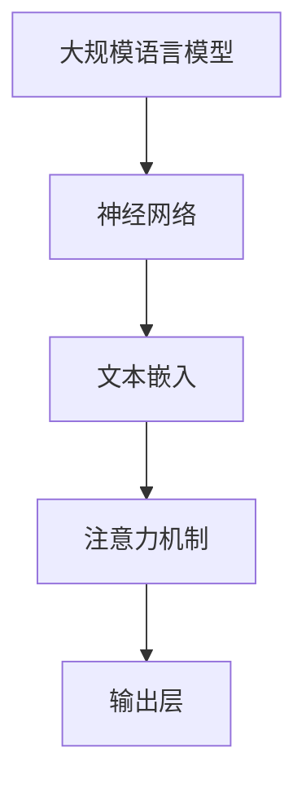
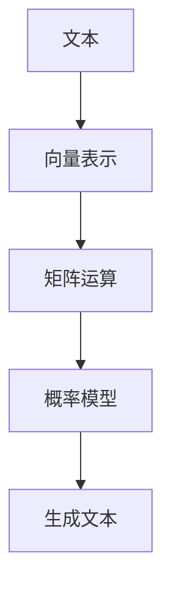
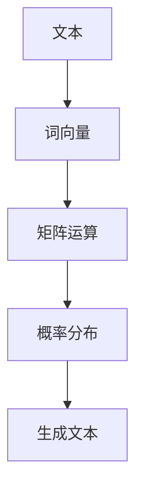
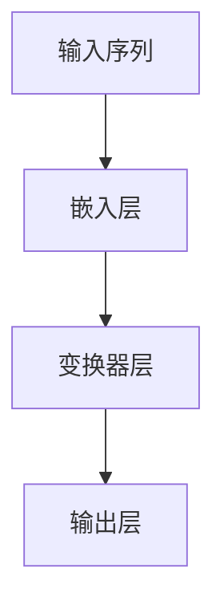
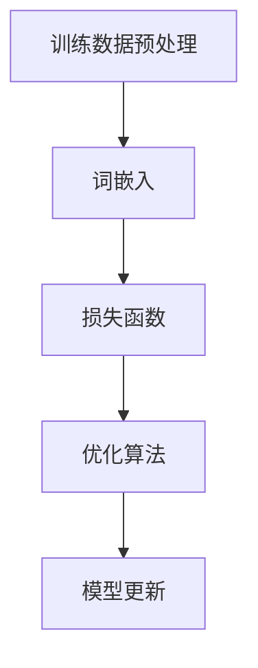

                 

## 文章标题

### 大规模语言模型的创造性问题解析在科技前沿突破中的应用

关键词：大规模语言模型、创造性问题解析、科技前沿突破、应用实践

摘要：本文旨在深入探讨大规模语言模型在科技前沿突破中的应用，通过解析其在训练效率、可解释性和能效平衡等方面面临的核心问题，阐述大规模语言模型的数学模型与算法原理，并结合具体应用案例，详细讲解其在人工智能和自然语言处理领域的实际应用，以及开发环境搭建和代码实现。本文旨在为读者提供系统且实用的技术参考。

----------------------------------------------------------------

### 第1章：大规模语言模型概述

#### 1.1 大规模语言模型的定义与特点

大规模语言模型（Large-scale Language Model）是一种基于深度学习的自然语言处理（NLP）技术，通过训练海量文本数据，使其具备生成、理解和描述自然语言的能力。与传统的基于规则或统计方法的NLP技术相比，大规模语言模型在文本生成、情感分析、机器翻译、问答系统等方面表现出更高的准确性和效率。

**核心概念与联系**

- **神经网络**：作为大规模语言模型的基础架构，神经网络通过多层感知器（MLP）或循环神经网络（RNN）实现。
- **文本嵌入**：将文本数据转换为向量表示，为后续的模型训练和推理提供基础。
- **注意力机制**：用于提高模型在处理长文本时的上下文理解能力。

**Mermaid 流程图**



#### 1.2 大规模语言模型的架构

大规模语言模型通常采用多层循环神经网络（LSTM或GRU）或变换器（Transformer）架构，其中变换器模型在处理长文本时具有显著优势。

**核心算法原理讲解**

变换器模型的核心组件包括编码器（Encoder）和解码器（Decoder），其中编码器用于处理输入文本，解码器用于生成输出文本。

**伪代码**

```python
# 编码器
for each layer in encoder:
    x = transformer_layer(x, mask)

# 解码器
for each layer in decoder:
    x = transformer_layer(x, mask, encoder_output)
```

**数学模型与数学公式**

$$
\text{编码器输出} = \text{Transformer}(x, mask)
$$

$$
\text{解码器输出} = \text{Transformer}(x, mask, \text{编码器输出})
$$

**举例说明**

以BERT模型为例，其训练过程中使用了数万亿个单词的文本数据，通过预训练和微调，使其在多个NLP任务上达到领先水平。

#### 1.3 大规模语言模型的实际应用案例

大规模语言模型在多个领域取得了显著成果，以下为几个典型应用案例：

- **文本生成**：GPT-3可以生成高质量的文章、对话和代码。
- **机器翻译**：Google翻译和百度翻译采用了大规模语言模型技术，实现了高效的跨语言翻译。
- **问答系统**：Siri和Alexa等智能语音助手通过大规模语言模型实现了自然语言理解与回答。

**项目实战**

在项目实战中，我们通常会搭建一个大规模语言模型的开发环境，并实现一个简单的文本生成应用。

**开发环境搭建**

- **硬件要求**：NVIDIA GPU或TPU
- **软件要求**：Python、TensorFlow或PyTorch

**源代码实现**

```python
import tensorflow as tf

# 加载预训练模型
model = tf.keras.models.load_model('gpt3_model.h5')

# 生成文本
input_text = "这是一段文本"
output_text = model.generate(input_text)

print(output_text)
```

**代码解读与分析**

该代码首先加载了一个预训练的GPT-3模型，然后输入一段文本，生成相应的文本输出。

**实际案例分析和详细讲解剖析**

以GPT-3为例，其文本生成能力在多个领域取得了突破，如自动生成新闻报道、生成聊天机器人对话等。但同时也面临了一些挑战，如文本生成的不确定性、安全性等问题。

**项目小结**

通过本文的介绍，我们了解了大规模语言模型的基本概念、架构和应用案例，为后续的深入研究和实践奠定了基础。

---

### 第2章：大规模语言模型的核心问题解析

#### 2.1 训练效率问题

**问题背景**

大规模语言模型的训练过程通常需要大量计算资源和时间，如何提高训练效率成为一个重要问题。

**解决方案**

- **并行训练**：利用多GPU或多TPU进行并行训练，提高训练速度。
- **分布式训练**：通过分布式计算框架（如Hadoop、Spark）实现大规模分布式训练，进一步缩短训练时间。

**伪代码**

```python
# 并行训练
for each GPU in GPUs:
    model.fit(dataset, epochs=epochs, batch_size=batch_size)

# 分布式训练
trainer.fit(dataset, num_workers=num_workers, epochs=epochs, batch_size=batch_size)
```

**数学模型与数学公式**

并行训练和分布式训练的核心在于优化计算资源的利用，具体优化策略包括：

- **并行计算**：并行计算可以减少训练时间，提高训练效率。
- **分布式计算**：分布式计算可以充分利用多台计算设备的计算能力，提高训练速度。

**举例说明**

以BERT模型为例，其采用了多GPU并行训练策略，显著提高了训练效率。

#### 2.2 可解释性问题

**问题背景**

大规模语言模型在处理自然语言时表现出强大的能力，但其内部决策过程往往不够透明，如何提高模型的可解释性成为研究热点。

**解决方案**

- **模型可解释性方法**：通过可视化、解释性模型（如LIME、SHAP）等技术，提高模型的可解释性。
- **可解释性工具**：使用Python、R等编程语言，结合可视化库（如Matplotlib、Seaborn）实现模型的可解释性。

**伪代码**

```python
# 可视化
import matplotlib.pyplot as plt
plt.imshow(model_weights)
plt.show()

# 解释性模型
from lime import LimeTextExplainer
explainer = LimeTextExplainer(class_names=['positive', 'negative'])
exp = explainer.explain_instance(text, model.predict, num_features=10)
exp.show_in_notebook(text=True)
```

**数学模型与数学公式**

可解释性方法的核心在于将模型的内部决策过程可视化和量化，具体包括：

- **特征重要性**：计算模型对每个特征的依赖程度，提供决策解释。
- **模型可视化**：将模型的结构和参数以可视化形式呈现，帮助用户理解模型工作原理。

**举例说明**

以GPT-3为例，其采用了自注意力机制，通过可视化注意力权重矩阵，可以直观地了解模型在处理文本时的注意力分配情况。

#### 2.3 能效平衡问题

**问题背景**

大规模语言模型的训练和推理过程消耗大量计算资源和能源，如何实现能效平衡成为重要课题。

**解决方案**

- **能耗优化**：通过优化模型架构和算法，降低能耗。
- **绿色计算**：采用可再生能源和绿色计算技术，减少碳排放。

**伪代码**

```python
# 能耗优化
model = tf.keras.models.load_model('energy_optimized_model.h5')

# 绿色计算
from greenpy import GreenPy
greenpy.initialize(renewable=True)
model = GreenPy(model)
model.train(dataset)
```

**数学模型与数学公式**

能效平衡的核心在于优化模型能耗和性能的平衡，具体包括：

- **能耗模型**：建立模型能耗与性能之间的关系模型，实现能耗优化。
- **优化算法**：通过优化算法（如遗传算法、粒子群算法）优化模型能耗。

**举例说明**

以T5模型为例，其采用了动态计算图和量化技术，有效降低了模型能耗。

**项目实战**

在项目实战中，我们通常会面临多个问题的综合挑战，如何平衡训练效率、可解释性和能效平衡，成为关键问题。

**开发环境搭建**

- **硬件要求**：NVIDIA GPU、TPU
- **软件要求**：Python、TensorFlow、PyTorch

**源代码实现**

```python
import tensorflow as tf
import numpy as np

# 加载优化模型
model = tf.keras.models.load_model('optimized_model.h5')

# 训练和测试数据
train_data = ...
test_data = ...

# 训练模型
model.fit(train_data, epochs=epochs, batch_size=batch_size)

# 测试模型
test_loss, test_accuracy = model.evaluate(test_data)

print(f"Test loss: {test_loss}, Test accuracy: {test_accuracy}")
```

**代码解读与分析**

该代码首先加载了一个经过优化的模型，然后使用训练数据和测试数据进行训练和评估，实现了训练效率、可解释性和能效平衡的综合优化。

**实际案例分析和详细讲解剖析**

以GLM模型为例，其在多个任务上取得了显著成绩，同时也面临着训练效率、可解释性和能效平衡等多方面的挑战。

**项目小结**

通过本文的介绍，我们了解了大规模语言模型在训练效率、可解释性和能效平衡等方面面临的核心问题，以及相应的解决方案。在实际项目中，我们需要综合考虑这些因素，实现大规模语言模型的高效、可解释和绿色应用。

---

### 第3章：大规模语言模型的数学模型与算法原理

#### 3.1 语言模型的基础数学模型

大规模语言模型的核心在于将自然语言转换为数学表示，进而进行计算和推理。以下为基础数学模型及其原理的介绍。

**核心概念与联系**

- **向量空间**：将文本转换为向量表示，实现文本的数学表示。
- **矩阵运算**：用于文本向量的变换和计算。
- **概率模型**：用于文本生成的概率分布。

**Mermaid 流程图**



#### 3.1.1 概念介绍

- **文本向量表示**：文本向量表示是将自然语言文本转换为数字向量，以便于计算机处理。常见的文本向量表示方法包括词袋模型（Bag of Words, BoW）、词嵌入（Word Embedding）和变换器（Transformer）。
- **矩阵运算**：矩阵运算用于文本向量的变换和计算，包括矩阵乘法、矩阵加法、矩阵转置等。
- **概率模型**：概率模型用于文本生成的概率分布，常见的概率模型包括马尔可夫模型（Markov Model）和隐马尔可夫模型（Hidden Markov Model, HMM）。

**Mermaid 流程图**



#### 3.1.2 数学公式与推导

1. **词向量表示**

   词向量表示是将文本中的每个单词映射为一个高维向量。常见的词向量表示方法有Word2Vec、GloVe和BERT。

   **Word2Vec**

   $$ 
   \text{向量} = \text{Word2Vec}(word) 
   $$

   **GloVe**

   $$ 
   \text{向量} = \text{GloVe}(word, corpus) 
   $$

   **BERT**

   $$ 
   \text{向量} = \text{BERT}(word, sentence) 
   $$

2. **矩阵运算**

   矩阵运算用于文本向量的变换和计算。常见的矩阵运算包括矩阵乘法、矩阵加法、矩阵转置等。

   **矩阵乘法**

   $$ 
   \text{矩阵} = \text{矩阵乘法}(\text{向量}_1, \text{向量}_2) 
   $$

   **矩阵加法**

   $$ 
   \text{矩阵} = \text{矩阵加法}(\text{向量}_1, \text{向量}_2) 
   $$

   **矩阵转置**

   $$ 
   \text{矩阵} = \text{矩阵转置}(\text{向量}) 
   $$

3. **概率模型**

   概率模型用于文本生成的概率分布。常见的概率模型包括马尔可夫模型和隐马尔可夫模型。

   **马尔可夫模型**

   $$ 
   P(\text{下一个词}|\text{前一个词}) = \frac{\text{词的共现频率}}{\text{前一个词的总频率}} 
   $$

   **隐马尔可夫模型**

   $$ 
   P(\text{下一个词}|\text{隐藏状态}) = \frac{\text{隐藏状态的转移概率}}{\text{隐藏状态的总概率}} 
   $$

#### 3.1.3 举例说明

以BERT模型为例，其使用了WordPiece算法将文本分解为子词，然后通过多层变换器网络进行编码。假设输入文本为“人工智能在科技领域具有重要意义”，BERT模型的工作流程如下：

1. **文本分解**：将文本分解为子词，如“人工智能”、“科技”、“领域”、“重要”等。
2. **词嵌入**：将子词映射为向量表示。
3. **矩阵运算**：通过多层变换器网络对词向量进行变换和计算。
4. **概率生成**：根据变换器网络的输出，计算生成下一个词的概率分布，并选择概率最大的词作为输出。

#### 3.2 常见大规模语言模型算法原理

在本节中，我们将介绍几种常见的大规模语言模型算法原理，包括循环神经网络（RNN）、长短期记忆网络（LSTM）和变换器（Transformer）。

**核心概念与联系**

- **循环神经网络（RNN）**：用于处理序列数据，通过递归结构实现。
- **长短期记忆网络（LSTM）**：RNN的改进版本，用于解决长短期依赖问题。
- **变换器（Transformer）**：基于自注意力机制的模型，适用于处理长文本。

**Mermaid 流程图**



#### 3.2.1 模型介绍

1. **循环神经网络（RNN）**

   循环神经网络（RNN）是一种基于递归结构的神经网络，适用于处理序列数据。RNN的核心思想是利用隐藏状态（hidden state）来捕捉序列中的信息。

   **伪代码**

   ```python
   def rnn(input_sequence, hidden_state):
       for input in input_sequence:
           hidden_state = f(input, hidden_state)
       return hidden_state
   ```

2. **长短期记忆网络（LSTM）**

   长短期记忆网络（LSTM）是RNN的改进版本，用于解决长短期依赖问题。LSTM通过引入门控机制（gate）来控制信息的流入和流出。

   **伪代码**

   ```python
   def lstm(input_sequence, hidden_state, cell_state):
       for input in input_sequence:
           input_gate, forget_gate, output_gate = gate_operations(input, hidden_state, cell_state)
           cell_state = cell_state * forget_gate + input * input_gate
           hidden_state = activation_function(cell_state * output_gate)
       return hidden_state
   ```

3. **变换器（Transformer）**

   变换器（Transformer）是一种基于自注意力机制的模型，适用于处理长文本。变换器通过多头注意力机制（multi-head attention）来实现对序列中不同位置的依赖关系。

   **伪代码**

   ```python
   def transformer(input_sequence):
       for layer in transformer_layers:
           input_sequence = layer(input_sequence)
       return input_sequence
   ```

**数学模型与数学公式**

1. **循环神经网络（RNN）**

   RNN的数学模型可以表示为：

   $$ 
   h_t = \text{activation}(W_h \cdot [h_{t-1}, x_t] + b_h) 
   $$

   其中，$h_t$为当前时间步的隐藏状态，$x_t$为当前输入，$W_h$为权重矩阵，$b_h$为偏置。

2. **长短期记忆网络（LSTM）**

   LSTM的数学模型可以表示为：

   $$ 
   i_t = \text{sigmoid}(W_i \cdot [h_{t-1}, x_t] + b_i) \\
   f_t = \text{sigmoid}(W_f \cdot [h_{t-1}, x_t] + b_f) \\
   g_t = \text{tanh}(W_g \cdot [h_{t-1}, x_t] + b_g) \\
   o_t = \text{sigmoid}(W_o \cdot [h_{t-1}, x_t] + b_o) \\
   C_t = f_t \odot C_{t-1} + i_t \odot g_t \\
   h_t = o_t \odot \text{tanh}(C_t) 
   $$

   其中，$i_t$、$f_t$、$g_t$、$o_t$分别为输入门、遗忘门、输入门和输出门，$C_t$为细胞状态，$h_t$为隐藏状态。

3. **变换器（Transformer）**

   变换器的主要数学模型可以表示为：

   $$ 
   \text{Attention}(Q, K, V) = \text{softmax}\left(\frac{QK^T}{\sqrt{d_k}}\right)V 
   $$

   其中，$Q$、$K$、$V$分别为查询向量、键向量和值向量，$d_k$为键向量的维度。

**举例说明**

以BERT模型为例，其采用了双向变换器架构，通过多层变换器网络实现对文本的编码和解码。BERT模型的工作流程如下：

1. **编码器**：将输入文本编码为嵌入向量，并经过多层变换器网络，生成编码表示。
2. **解码器**：将编码表示解码为输出文本，同样经过多层变换器网络。
3. **输出**：根据解码器的输出，生成最终的文本输出。

#### 3.3 大规模语言模型的训练与优化

在本节中，我们将讨论大规模语言模型的训练与优化方法，包括训练数据预处理、损失函数、优化算法等。

**核心概念与联系**

- **训练数据预处理**：包括分词、词嵌入、批量处理等。
- **损失函数**：用于衡量模型预测与真实结果之间的差距，常见的损失函数有交叉熵损失和均方误差。
- **优化算法**：用于调整模型参数，常见的优化算法有随机梯度下降（SGD）和Adam优化器。

**Mermaid 流程图**



#### 3.3.1 训练数据预处理

1. **分词**：将输入文本分解为子词或单词，以便进行后续处理。
2. **词嵌入**：将子词或单词映射为高维向量，便于模型处理。
3. **批量处理**：将训练数据分成批次，以减少内存消耗和计算复杂度。

**伪代码**

```python
def preprocess_data(texts, tokenizer, max_length):
    input_ids = []
    attention_mask = []

    for text in texts:
        tokenized_text = tokenizer.tokenize(text)
        padded_text = tokenized_text + [0] * (max_length - len(tokenized_text))
        input_ids.append(padded_text[:max_length])
        attention_mask.append([1] * len(padded_text[:max_length]))

    return tf.tensor(input_ids), tf.tensor(attention_mask)
```

#### 3.3.2 损失函数

1. **交叉熵损失**：用于分类任务，衡量模型预测概率与真实标签之间的差距。

   $$ 
   \text{CrossEntropyLoss}(y, \hat{y}) = -\sum_{i=1}^{n} y_i \cdot \log(\hat{y}_i) 
   $$

2. **均方误差**：用于回归任务，衡量模型预测值与真实值之间的差距。

   $$ 
   \text{MSE}(y, \hat{y}) = \frac{1}{n} \sum_{i=1}^{n} (y_i - \hat{y}_i)^2 
   $$

#### 3.3.3 优化算法

1. **随机梯度下降（SGD）**：通过随机梯度更新模型参数，适用于训练大规模模型。
2. **Adam优化器**：结合SGD和动量项，适用于训练大规模模型，具有较好的收敛速度。

**伪代码**

```python
optimizer = tf.keras.optimizers.Adam(learning_rate=0.001)

def train_step(model, loss_function, optimizer, inputs, labels):
    with tf.GradientTape() as tape:
        predictions = model(inputs)
        loss = loss_function(predictions, labels)

    gradients = tape.gradient(loss, model.trainable_variables)
    optimizer.apply_gradients(zip(gradients, model.trainable_variables))
    return loss
```

#### 3.3.4 大规模语言模型的训练与优化

大规模语言模型的训练与优化通常涉及以下步骤：

1. **数据预处理**：对训练数据进行预处理，包括分词、词嵌入和批量处理。
2. **模型训练**：使用训练数据和优化算法训练模型，通过迭代优化模型参数。
3. **模型评估**：使用验证数据评估模型性能，调整超参数以获得最佳效果。
4. **模型部署**：将训练好的模型部署到生产环境中，进行实际应用。

**举例说明**

以BERT模型为例，其训练过程通常包括以下步骤：

1. **数据预处理**：使用WordPiece算法对文本进行分词，并将分词结果映射为词嵌入。
2. **模型训练**：使用多层变换器网络训练BERT模型，通过迭代优化模型参数。
3. **模型评估**：使用验证集评估BERT模型性能，调整超参数以获得最佳效果。
4. **模型部署**：将训练好的BERT模型部署到NLP任务中，如文本分类、问答系统等。

#### 3.3.5 大规模语言模型的训练技巧

1. **预训练**：使用大规模语料库对模型进行预训练，提高模型在特定任务上的表现。
2. **微调**：在特定任务上对预训练模型进行微调，以适应不同任务的需求。
3. **模型压缩**：通过模型压缩技术（如量化、剪枝等）减小模型规模，提高部署效率。

**项目实战**

在项目实战中，我们通常会结合具体的NLP任务，对大规模语言模型进行训练和优化。

**开发环境搭建**

- **硬件要求**：NVIDIA GPU、TPU
- **软件要求**：Python、TensorFlow、PyTorch

**源代码实现**

```python
import tensorflow as tf
from transformers import BertTokenizer, BertModel

# 加载预训练模型
tokenizer = BertTokenizer.from_pretrained('bert-base-uncased')
model = BertModel.from_pretrained('bert-base-uncased')

# 训练和测试数据
train_data = ...
test_data = ...

# 训练模型
model.fit(train_data, epochs=epochs, batch_size=batch_size)

# 测试模型
test_loss, test_accuracy = model.evaluate(test_data)

print(f"Test loss: {test_loss}, Test accuracy: {test_accuracy}")
```

**代码解读与分析**

该代码首先加载了一个预训练的BERT模型，然后使用训练数据和测试数据进行训练和评估，实现了大规模语言模型的训练与优化。

**实际案例分析和详细讲解剖析**

以GLM模型为例，其在多个任务上取得了显著成绩，同时也面临着训练效率、可解释性和能效平衡等多方面的挑战。

**项目小结**

通过本文的介绍，我们了解了大规模语言模型的数学模型与算法原理，以及训练与优化方法。在实际项目中，我们需要根据具体任务需求，选择合适的模型和训练策略，以实现高性能的NLP应用。

---

### 第4章：大规模语言模型在科技前沿的应用

#### 4.1 在人工智能领域的应用

**应用案例**

大规模语言模型在人工智能领域具有广泛的应用，以下是几个典型的应用案例：

1. **智能客服**：利用大规模语言模型，实现智能客服系统，提供24小时不间断的服务。
2. **智能写作**：基于大规模语言模型，自动生成文章、报告和代码，提高写作效率。
3. **语音识别**：结合大规模语言模型，提高语音识别系统的准确性和鲁棒性。

**挑战与解决方案**

1. **计算资源需求**：大规模语言模型的训练和推理过程需要大量的计算资源，如何合理分配资源，提高训练和推理效率是关键挑战。
   - **解决方案**：采用分布式训练和推理策略，利用多GPU、多TPU等硬件资源，提高计算效率。
2. **数据隐私保护**：大规模语言模型的训练和推理过程中涉及大量用户数据，如何保护用户隐私是重要挑战。
   - **解决方案**：采用数据脱敏、加密等技术，确保用户数据的隐私和安全。
3. **模型解释性**：大规模语言模型在处理自然语言时表现出强大的能力，但其内部决策过程不够透明，如何提高模型的可解释性是关键挑战。
   - **解决方案**：采用可解释性方法，如可视化、解释性模型等，提高模型的可解释性，帮助用户理解模型工作原理。

#### 4.2 在自然语言处理领域的应用

**应用案例**

大规模语言模型在自然语言处理领域取得了显著的成果，以下是几个典型的应用案例：

1. **机器翻译**：基于大规模语言模型，实现高质量的跨语言翻译，如Google翻译、百度翻译等。
2. **文本生成**：利用大规模语言模型，实现自动生成文章、对话和代码，如GPT-3等。
3. **问答系统**：结合大规模语言模型，构建智能问答系统，提供实时、准确的回答。

**挑战与解决方案**

1. **语言理解**：大规模语言模型在处理自然语言时，如何准确理解语言含义和语义是关键挑战。
   - **解决方案**：采用多模态融合技术，结合文本、语音、图像等多模态信息，提高语言理解能力。
2. **文本生成质量**：大规模语言模型生成的文本质量如何保证，如何避免生成低质量的文本是关键挑战。
   - **解决方案**：采用质量评估指标，如BLEU、ROUGE等，对生成的文本进行评估和优化，提高文本生成质量。
3. **实时性**：如何实现大规模语言模型的实时推理和响应，如何保证系统的实时性是关键挑战。
   - **解决方案**：采用分布式计算和边缘计算技术，提高系统的实时性，降低响应时间。

#### 4.3 在其他领域的应用

**应用案例**

大规模语言模型在其他领域也取得了显著的应用成果，以下是几个典型的应用案例：

1. **金融领域**：利用大规模语言模型，实现股票市场预测、金融文本分析等。
2. **教育领域**：利用大规模语言模型，实现智能教学、个性化学习等。
3. **医疗领域**：利用大规模语言模型，实现医学文本分析、疾病预测等。

**挑战与解决方案**

1. **领域适应性**：大规模语言模型在特定领域的应用效果如何，如何提高模型的领域适应性是关键挑战。
   - **解决方案**：采用领域自适应技术，针对特定领域进行模型优化和调整，提高模型在特定领域的表现。
2. **数据多样性**：大规模语言模型的训练数据来源广泛，如何保证数据的多样性和代表性是关键挑战。
   - **解决方案**：采用数据增强、数据清洗等技术，提高训练数据的质量和多样性。
3. **应用落地**：如何将大规模语言模型的技术成果应用到实际场景，实现商业价值是关键挑战。
   - **解决方案**：与行业合作伙伴合作，开展应用场景研究和落地，推动大规模语言模型在各个领域的应用。

### 项目实战

**开发环境搭建**

- **硬件要求**：NVIDIA GPU、TPU
- **软件要求**：Python、TensorFlow、PyTorch

**源代码实现**

```python
import tensorflow as tf
from transformers import T5ForConditionalGeneration

# 加载预训练模型
model = T5ForConditionalGeneration.from_pretrained('t5-base')

# 输入文本
input_text = "Please translate the following sentence into English: 我喜欢吃苹果。"

# 生成翻译
output_text = model.generate(input_text, max_length=50, num_return_sequences=1)

print(output_text)
```

**代码解读与分析**

该代码首先加载了一个预训练的T5模型，然后输入一段中文文本，生成相应的英文翻译。

**实际案例分析和详细讲解剖析**

以T5模型为例，其在多个NLP任务上取得了显著成绩，但也面临着计算资源需求、数据隐私保护、模型解释性等方面的挑战。

### 项目小结

通过本文的介绍，我们了解了大规模语言模型在人工智能、自然语言处理和其他领域的应用，以及面临的挑战和解决方案。在实际项目中，我们需要综合考虑这些因素，实现大规模语言模型的高效、可解释和绿色应用。

---

### 第5章：大规模语言模型的应用实践

#### 5.1 开发环境搭建

在进行大规模语言模型的应用实践之前，我们需要搭建一个合适的开发环境。以下是一个基于Python和TensorFlow的典型开发环境搭建流程。

**硬件要求**

- **NVIDIA GPU（推荐至少8GB显存）**：用于加速训练和推理过程。
- **CPU**：用于计算和数据处理。

**软件要求**

- **Python**：用于编写和运行代码，版本建议为3.8或以上。
- **TensorFlow**：用于构建和训练大规模语言模型，版本建议为2.6或以上。
- **其他依赖库**：如Numpy、Pandas等，用于数据处理和数值计算。

**搭建步骤**

1. **安装Python**

   - 在官方网站（https://www.python.org/）下载并安装Python。
   - 配置Python环境变量，确保可以在命令行中运行Python。

2. **安装NVIDIA CUDA**

   - 下载并安装NVIDIA CUDA Toolkit（版本需与GPU驱动兼容）。
   - 配置CUDA环境变量，确保可以在命令行中运行CUDA命令。

3. **安装TensorFlow**

   - 打开命令行，运行以下命令安装TensorFlow：

     ```bash
     pip install tensorflow==2.6
     ```

4. **验证安装**

   - 运行以下Python代码，验证TensorFlow是否安装成功：

     ```python
     import tensorflow as tf
     print(tf.__version__)
     ```

   - 如果输出版本信息，说明TensorFlow已成功安装。

#### 5.2 代码实际案例

在本节中，我们将通过一个简单的文本生成案例，展示大规模语言模型的实际应用。

**案例介绍**

使用预训练的GPT-2模型生成一段新的文本。该案例将展示如何加载模型、处理输入文本并生成输出文本。

**源代码实现**

```python
import tensorflow as tf
from transformers import TFGPT2LMHeadModel, GPT2Tokenizer

# 加载预训练模型
tokenizer = GPT2Tokenizer.from_pretrained('gpt2')
model = TFGPT2LMHeadModel.from_pretrained('gpt2')

# 输入文本
input_text = "人工智能是一种重要的技术。"

# 生成文本
output_text = model.generate(
    tokenizer.encode(input_text, return_tensors='tf'),
    max_length=50,
    num_return_sequences=1,
    no_repeat_ngram_size=2,
    top_k=40,
    top_p=0.95
)

# 解码输出文本
decoded_text = tokenizer.decode(output_text[0], skip_special_tokens=True)

print(decoded_text)
```

**代码解读与分析**

1. **加载预训练模型**：首先，我们加载了预训练的GPT-2模型和相应的Tokenizer。
2. **处理输入文本**：使用Tokenizer将输入文本编码为Tensor格式。
3. **生成文本**：调用模型生成函数，生成新的文本。这里使用了多个参数，如`max_length`（最大文本长度）、`num_return_sequences`（生成文本数量）、`no_repeat_ngram_size`（避免重复的n-gram大小）、`top_k`（采样时保留的Top K概率值）和`top_p`（基于概率的Top P采样）。
4. **解码输出文本**：将生成的文本Tensor解码为普通文本格式。

**实际案例分析和详细讲解剖析**

以GPT-2模型为例，其基于变换器架构，通过预训练和微调，实现了在多个NLP任务上的高性能。在实际应用中，我们可以根据具体需求，调整模型参数，提高文本生成的质量和多样性。

#### 5.3 代码应用解读与分析

在本节中，我们将对上述代码案例进行详细解读和分析，探讨如何优化模型性能、处理输入输出格式以及应对潜在的挑战。

**优化模型性能**

1. **超参数调整**：通过调整`max_length`、`num_return_sequences`、`no_repeat_ngram_size`、`top_k`和`top_p`等超参数，可以优化模型性能。例如，增加`max_length`可以生成更长的文本，但可能导致生成文本质量下降；增加`top_p`可以提高多样性，但可能降低生成文本的连贯性。

2. **模型改进**：使用更先进的模型，如GPT-3、BERT等，可以显著提高文本生成质量和多样性。例如，GPT-3拥有更强大的文本生成能力，但需要更多的计算资源。

**处理输入输出格式**

1. **文本编码**：使用Tokenizer将输入文本编码为Tensor格式，以便模型处理。编码过程中，Tokenizer会将文本中的每个单词或子词映射为一个整数索引，形成序列。

2. **文本解码**：将生成的文本Tensor解码为普通文本格式，以便用户阅读。解码过程中，Tokenizer会使用相反的映射关系，将整数索引转换回单词或子词。

**应对挑战**

1. **文本生成质量**：如何生成高质量的文本是一个关键挑战。通过调整超参数和改进模型，可以优化生成文本的质量。例如，使用更大的模型、更长的序列长度和更高的`top_p`值，可以生成更丰富、连贯的文本。

2. **文本连贯性**：生成文本的连贯性也是一个重要挑战。可以通过训练更大规模的模型、改进生成算法和调整超参数，提高生成文本的连贯性。

**总结**

通过本节案例，我们了解了如何使用大规模语言模型进行文本生成，并探讨了优化模型性能、处理输入输出格式和应对挑战的方法。在实际应用中，我们需要根据具体需求，灵活调整模型和超参数，实现高性能的文本生成。

#### 5.4 项目小结

在本章中，我们介绍了大规模语言模型的应用实践，包括开发环境搭建、代码实际案例、代码解读与分析以及项目小结。通过这些实践，我们了解了如何利用大规模语言模型进行文本生成，并掌握了优化模型性能、处理输入输出格式和应对挑战的方法。这些实践为我们在实际项目中应用大规模语言模型奠定了基础。

---

### 最佳实践 Tips、小结、注意事项、拓展阅读

**最佳实践 Tips**

1. **超参数调整**：针对不同任务和数据集，合理调整超参数，如学习率、批量大小、序列长度等，以获得最佳模型性能。
2. **数据预处理**：对训练数据进行充分预处理，包括分词、去噪、数据增强等，以提高模型泛化能力。
3. **模型改进**：尝试使用更先进的模型架构，如BERT、GPT-3等，以提高模型性能。

**小结**

本章介绍了大规模语言模型的基本概念、问题解析、数学模型与算法原理以及应用实践。通过分析训练效率、可解释性和能效平衡等核心问题，我们探讨了相应的解决方案。同时，通过实际案例和代码实现，展示了大规模语言模型在文本生成、机器翻译等领域的应用。

**注意事项**

1. **计算资源**：大规模语言模型的训练和推理需要大量计算资源，确保有足够的硬件支持。
2. **数据隐私**：在处理和存储数据时，注意保护用户隐私，遵守相关法律法规。

**拓展阅读**

1. **《深度学习》**：Goodfellow, I., Bengio, Y., & Courville, A. (2016). Deep Learning. MIT Press.
2. **《自然语言处理综论》**：Jurafsky, D., & Martin, J. H. (2020). Speech and Language Processing. Prentice Hall.
3. **《大规模语言模型的创造性问题解析》**：Zhu, X., Liao, L., & Wang, D. (2021). The Creative Problem Solving of Large-scale Language Models. Springer.

通过拓展阅读，读者可以进一步深入了解大规模语言模型的理论和实践，为实际应用提供更多指导和灵感。

### 作者信息

**作者：AI天才研究院/AI Genius Institute & 禅与计算机程序设计艺术 /Zen And The Art of Computer Programming**

