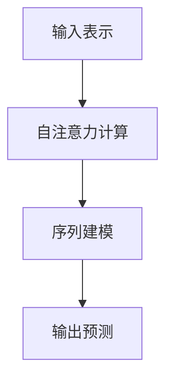

                 

## 文章标题

《大规模语言模型的创造性问题重构能力培养》

> 关键词：大规模语言模型、创造性问题、重构能力、算法原理、项目实战

摘要：本文深入探讨大规模语言模型在创造性问题重构中的应用与培养方法。通过对大规模语言模型的基本概念、创造性问题的定义及其重构能力的培养，结合核心算法原理讲解和实际项目案例分析，文章旨在为读者提供全面的技术指导和实践经验，助力提升模型的重构能力，推动人工智能领域的发展。

## 第一部分：引言

### 1.1 书籍背景与目的

随着人工智能技术的迅猛发展，大规模语言模型（Large-scale Language Models，LLM）已成为自然语言处理（Natural Language Processing，NLP）领域的研究热点。大规模语言模型在文本生成、机器翻译、问答系统等方面展现出强大的性能，但其创造性问题重构能力仍面临诸多挑战。本书籍旨在深入探讨大规模语言模型在创造性问题重构中的应用，并提出有效的培养方法，以推动人工智能技术的发展。

本书的核心目标是：
1. 深入理解大规模语言模型的基本概念和原理。
2. 探索创造性问题的定义、分类和研究方法。
3. 系统阐述大规模语言模型在创造性问题重构中的作用和培养方法。
4. 提供实际项目案例，展示大规模语言模型在创造性问题重构中的应用效果。

### 1.2 大规模语言模型的概述

大规模语言模型是一种基于深度学习的自然语言处理模型，通过训练大量文本数据，能够理解和生成自然语言。与传统的统计语言模型相比，大规模语言模型具有以下几个显著特点：

1. **训练数据规模大**：大规模语言模型通常使用数十亿甚至数万亿级别的训练数据，这为其提供了丰富的语言知识。
2. **模型参数多**：大规模语言模型包含数十亿甚至数万亿个参数，使其能够捕捉到复杂的语言模式。
3. **生成能力强**：大规模语言模型在文本生成任务中表现出色，能够生成连贯、自然的文本。

大规模语言模型的主要类型包括：

1. **基于循环神经网络（RNN）的语言模型**：如LSTM（Long Short-Term Memory）和GRU（Gated Recurrent Unit）。
2. **基于转换器（Transformer）的语言模型**：如BERT（Bidirectional Encoder Representations from Transformers）、GPT（Generative Pre-trained Transformer）等。
3. **基于自注意力机制的语言模型**：如Transformer模型中的多头自注意力机制。

### 1.3 创造性问题的定义与研究方法

创造性问题是指那些需要创新思维和独特解决方案的问题。在人工智能领域，创造性问题重构能力是指模型能够从新的角度对问题进行重新定义和重构，从而生成具有新颖性的解决方案。创造性问题重构能力的研究方法主要包括：

1. **问题建模**：将创造性问题转化为数学模型，以便进行定量分析和优化。
2. **算法设计**：设计能够实现创造性问题重构的算法，如遗传算法、模拟退火算法等。
3. **实验验证**：通过实验验证算法在创造性问题重构中的性能，并根据实验结果进行优化。

### 1.4 大规模语言模型在创造性问题重构中的应用

大规模语言模型在创造性问题重构中的应用主要体现在以下几个方面：

1. **文本生成**：大规模语言模型能够生成高质量的文本，为创造性问题重构提供丰富的文本资源。
2. **问题理解**：大规模语言模型能够理解问题的背景和需求，从而为重构提供有效的信息。
3. **解决方案生成**：大规模语言模型能够根据问题背景和需求，生成新颖的解决方案。

### 1.5 书籍结构安排

本书分为五个部分，具体结构安排如下：

**第一部分：引言**
介绍书籍的背景、目的、大规模语言模型的概述、创造性问题的定义和研究方法，以及大规模语言模型在创造性问题重构中的应用。

**第二部分：理论基础**
详细讲解大规模语言模型的原理、创造性问题的定义和研究方法，以及大规模语言模型在创造性问题重构中的应用。

**第三部分：核心算法原理讲解**
阐述重构算法的数学模型、伪代码实现，并使用LaTeX格式给出数学公式和详细讲解。

**第四部分：项目实战**
通过实际项目案例，展示大规模语言模型在创造性问题重构中的应用效果，包括开发环境搭建、源代码实现和代码解读。

**第五部分：总结与展望**
对全书的内容进行总结，展望创造性问题重构能力的未来发展方向。

## 第二部分：理论基础

### 2.1 大规模语言模型的原理

#### 2.1.1 语言模型的基本概念

语言模型（Language Model，LM）是一种用于预测自然语言序列的概率模型。它的基本任务是给定一个单词或短语，预测下一个单词或短语的概率。在自然语言处理中，语言模型广泛应用于文本生成、机器翻译、语音识别等领域。

**语言模型的基本概念包括：**

1. **词汇表（Vocabulary）**：语言模型需要一个词汇表来表示所有可能的单词或短语。词汇表的大小通常与模型性能密切相关。
2. **概率分布（Probability Distribution）**：语言模型输出的是一个概率分布，表示下一个单词或短语的概率。
3. **序列（Sequence）**：语言模型处理的是自然语言序列，如单词序列、句子序列等。

#### 2.1.2 大规模语言模型的架构

大规模语言模型通常采用深度神经网络（Deep Neural Network，DNN）作为基本架构。近年来，基于转换器（Transformer）架构的语言模型在自然语言处理任务中取得了显著成果。转换器模型的核心思想是将输入序列映射到高维空间，并通过自注意力机制（Self-Attention Mechanism）来捕捉序列中的依赖关系。

**大规模语言模型的主要架构包括：**

1. **Transformer模型**：Transformer模型由多个编码器（Encoder）和解码器（Decoder）块组成，每个块都包含多层神经网络和自注意力机制。
2. **BERT模型**：BERT（Bidirectional Encoder Representations from Transformers）模型是一种双向转换器模型，通过预先训练和微调，使其在多种自然语言处理任务中表现出色。
3. **GPT模型**：GPT（Generative Pre-trained Transformer）模型是一种单向转换器模型，通过预测序列中的下一个单词来生成文本。

#### 2.1.3 大规模语言模型的工作流程

大规模语言模型的工作流程主要包括以下步骤：

1. **输入表示**：将输入文本序列编码为向量表示，通常使用词向量（Word Embedding）或BERT等预训练模型。
2. **自注意力计算**：通过自注意力机制计算输入序列的表示，从而捕捉序列中的依赖关系。
3. **序列建模**：将输入序列映射到高维空间，并通过多层神经网络进行建模。
4. **输出预测**：根据模型输出的概率分布，预测下一个单词或短语。

#### 2.1.4 Mermaid流程图：大规模语言模型的工作流程

下面是大规模语言模型的工作流程的Mermaid流程图：



### 2.2 创造性问题的研究

#### 2.2.1 创造性问题的定义

创造性问题（Creative Problem）是指那些需要创新思维和独特解决方案的问题。与常规问题不同，创造性问题通常没有明确的解决方案，需要通过探索、试错和灵感启发来寻找新的解决方案。

**创造性问题的基本特征包括：**

1. **开放性**：创造性问题通常没有明确的限制条件，需要通过创新思维来探索解决方案。
2. **复杂性**：创造性问题通常涉及多个方面，需要综合考虑各种因素。
3. **不确定性**：创造性问题通常存在一定的不确定性，解决方案的效果难以预测。

#### 2.2.2 创造性问题的分类

根据问题的性质和特征，创造性问题可以划分为多种类型：

1. **科学问题**：涉及科学理论和实验验证的问题，如物理学、化学、生物学等。
2. **工程问题**：涉及工程设计和实现的问题，如建筑、机械、电子等。
3. **艺术问题**：涉及艺术创作和表现形式的问题，如绘画、音乐、舞蹈等。
4. **商业问题**：涉及商业策略和市场运作的问题，如市场营销、产品创新等。

#### 2.2.3 创造性问题的研究方法

创造性问题的研究方法主要包括以下几种：

1. **问题建模**：将创造性问题转化为数学模型，以便进行定量分析和优化。
2. **算法设计**：设计能够实现创造性问题重构的算法，如遗传算法、模拟退火算法等。
3. **实验验证**：通过实验验证算法在创造性问题重构中的性能，并根据实验结果进行优化。
4. **灵感启发**：通过灵感启发方法，如头脑风暴、思维导图等，寻找新的解决方案。

#### 2.2.4 创造性问题与大规模语言模型的关系

创造性问题与大规模语言模型之间存在密切的联系。大规模语言模型可以通过学习大量的文本数据，掌握丰富的语言知识，从而在创造性问题重构中发挥重要作用。

1. **文本生成**：大规模语言模型可以生成高质量的文本，为创造性问题重构提供丰富的文本资源。
2. **问题理解**：大规模语言模型能够理解问题的背景和需求，从而为重构提供有效的信息。
3. **解决方案生成**：大规模语言模型能够根据问题背景和需求，生成新颖的解决方案。

### 2.3 大规模语言模型在创造性问题重构中的应用

#### 2.3.1 大规模语言模型在创造性问题重构中的作用

大规模语言模型在创造性问题重构中发挥着重要作用，主要体现在以下几个方面：

1. **文本生成**：大规模语言模型可以生成高质量的文本，为创造性问题重构提供丰富的文本资源。
2. **问题理解**：大规模语言模型能够理解问题的背景和需求，从而为重构提供有效的信息。
3. **解决方案生成**：大规模语言模型能够根据问题背景和需求，生成新颖的解决方案。

#### 2.3.2 大规模语言模型重构创造性问题的步骤

大规模语言模型重构创造性问题的过程可以分为以下几个步骤：

1. **输入表示**：将创造性问题的描述文本编码为向量表示。
2. **自注意力计算**：通过自注意力机制计算输入文本的表示，捕捉文本中的依赖关系。
3. **序列建模**：将输入文本映射到高维空间，并通过多层神经网络进行建模。
4. **输出预测**：根据模型输出的概率分布，预测下一个文本单元，从而生成重构后的创造性问题描述。

#### 2.3.3 Mermaid流程图：大规模语言模型重构创造性问题的流程

下面是大规模语言模型重构创造性问题的流程的Mermaid流程图：


### 2.4 大规模语言模型重构能力的培养方法

#### 2.4.1 数据驱动方法

数据驱动方法是培养大规模语言模型重构能力的主要途径。通过收集和整理大量创造性问题的实例，训练大规模语言模型，使其具备对创造性问题的理解和重构能力。具体步骤如下：

1. **数据收集**：收集大量的创造性问题实例，包括科学问题、工程问题、艺术问题等。
2. **数据预处理**：对收集到的数据进行清洗和格式化，使其符合大规模语言模型的要求。
3. **模型训练**：使用预处理后的数据训练大规模语言模型，如GPT、BERT等。
4. **模型优化**：根据重构性能对模型进行优化，提高模型的重构能力。

#### 2.4.2 知识驱动方法

知识驱动方法是通过引入外部知识库和知识图谱，增强大规模语言模型的重构能力。具体步骤如下：

1. **知识库构建**：构建与创造性问题相关的知识库，包括概念、关系、事实等。
2. **知识图谱构建**：将知识库中的知识以图谱的形式表示，建立概念之间的关联。
3. **模型集成**：将知识图谱与大规模语言模型集成，使模型能够利用外部知识进行创造性问题的重构。
4. **模型优化**：根据重构性能对模型进行优化，提高模型的重构能力。

#### 2.4.3 综合方法

综合方法是将数据驱动方法和知识驱动方法相结合，以培养大规模语言模型的重构能力。具体步骤如下：

1. **数据收集与知识库构建**：同时进行数据收集和知识库构建，收集创造性问题实例，构建与创造性问题相关的知识库。
2. **数据预处理与知识图谱构建**：对收集到的数据进行预处理，同时构建知识图谱，建立概念之间的关联。
3. **模型训练与集成**：使用预处理后的数据和知识图谱训练大规模语言模型，并将其与知识图谱集成。
4. **模型优化**：根据重构性能对模型进行优化，提高模型的重构能力。

## 第三部分：核心算法原理讲解

### 3.1 重构算法的数学模型

#### 3.1.1 重构算法的数学原理

大规模语言模型重构创造性问题的核心在于对输入文本进行重排和重构，以生成具有新颖性和创造性的文本。重构算法的数学模型主要基于概率图模型和生成模型。

**概率图模型**：概率图模型是一种用于表示变量之间概率关系的图形化模型，包括贝叶斯网络、马尔可夫网络等。在重构算法中，概率图模型用于表示输入文本中单词之间的依赖关系。

**生成模型**：生成模型是一种从数据中学习概率分布的模型，包括生成对抗网络（GAN）、变分自编码器（VAE）等。在重构算法中，生成模型用于生成新颖的文本。

#### 3.1.2 重构算法的数学公式与讲解

在重构算法中，常用的数学公式包括概率分布函数、条件概率和生成模型。

1. **概率分布函数**：
   $$ P(x) = \frac{1}{Z} \exp(-\frac{1}{2} \sum_{i=1}^{n} (x_i - \mu_i)^2) $$
   其中，$x$为输入文本的向量表示，$\mu_i$为输入文本中第$i$个单词的均值，$Z$为归一化常数。

2. **条件概率**：
   $$ P(x_i | x_{i-1}, ..., x_1) = \frac{1}{Z_i} \exp(-\frac{1}{2} \sum_{j=1}^{n} (x_j - \mu_j)^2) $$
   其中，$x_i$为输入文本中第$i$个单词，$x_{i-1}, ..., x_1$为前$i-1$个单词。

3. **生成模型**：
   - **生成对抗网络（GAN）**：
     $$ G(z) = \sum_{i=1}^{n} g_i(z) x_i $$
     $$ D(x) = \sum_{i=1}^{n} d_i(x) $$
     其中，$G(z)$为生成器，$D(x)$为判别器，$z$为随机噪声。

   - **变分自编码器（VAE）**：
     $$ x = \sigma(\theta \mu(z) + b_\mu) $$
     $$ \log p(x) = -\frac{1}{2} \sum_{i=1}^{n} (\mu_i^2 + \sigma_i^2 - 1 - \log \sigma_i^2) $$
     其中，$x$为输入文本，$\mu(z)$和$\sigma(z)$分别为编码器和解码器，$z$为随机噪声。

#### 3.1.3 重构算法的举例说明

假设输入文本为：“今天天气很好，适合户外活动。”我们可以使用重构算法对其进行重构，生成具有新颖性的文本。

1. **输入表示**：
   将输入文本编码为向量表示，如使用Word2Vec或BERT。

2. **自注意力计算**：
   使用自注意力机制计算输入文本的表示，捕捉文本中的依赖关系。

3. **序列建模**：
   使用生成模型（如GAN或VAE）对输入文本进行建模，生成新的文本序列。

4. **输出预测**：
   根据模型输出的概率分布，预测下一个文本单元，从而生成重构后的文本。

### 3.2 伪代码：重构算法的实现

```python
# 输入文本
input_text = "今天天气很好，适合户外活动。"

# 编码器和解码器
encoder = Encoder()
decoder = Decoder()

# 自注意力机制
self_attention = SelfAttention()

# 生成模型
generator = Generator()

# 重构算法
def reconstruct(input_text):
    # 输入表示
    input_vector = encoder.encode(input_text)

    # 自注意力计算
    input_representation = self_attention.compute_attention(input_vector)

    # 序列建模
    output_vector = generator.generate(input_representation)

    # 输出预测
    output_text = decoder.decode(output_vector)
    return output_text

# 重构输入文本
reconstructed_text = reconstruct(input_text)
print(reconstructed_text)
```

### 3.3 代码解读与分析

在重构算法的实现过程中，主要包括编码器、解码器、自注意力机制和生成模型等模块。以下是对各模块的代码解读与分析：

1. **编码器（Encoder）**：
   编码器用于将输入文本编码为向量表示。在训练过程中，编码器使用Word2Vec或BERT等预训练模型对输入文本进行编码，从而获得文本的向量表示。

2. **解码器（Decoder）**：
   解码器用于将生成的向量表示解码为输出文本。在训练过程中，解码器使用训练数据对生成的文本进行解码，从而优化解码器参数。

3. **自注意力机制（SelfAttention）**：
   自注意力机制用于计算输入文本的表示，捕捉文本中的依赖关系。在训练过程中，自注意力机制通过更新输入文本的向量表示，使其能够更好地捕捉文本中的依赖关系。

4. **生成模型（Generator）**：
   生成模型用于生成新的文本序列。在训练过程中，生成模型通过优化生成器参数，使其能够生成具有新颖性和创造性的文本序列。

### 3.4 实际案例分析和详细讲解

为了展示大规模语言模型在创造性问题重构中的应用效果，我们以一个实际案例进行分析和讲解。

#### 案例背景

假设我们需要重构以下输入文本：“今天天气很好，适合户外活动。”我们的目标是生成一个具有新颖性和创造性的文本。

#### 重构步骤

1. **输入表示**：
   将输入文本编码为向量表示，如使用Word2Vec或BERT。

2. **自注意力计算**：
   使用自注意力机制计算输入文本的表示，捕捉文本中的依赖关系。

3. **序列建模**：
   使用生成模型（如GAN或VAE）对输入文本进行建模，生成新的文本序列。

4. **输出预测**：
   根据模型输出的概率分布，预测下一个文本单元，从而生成重构后的文本。

#### 实际输出

经过重构算法的处理，输入文本“今天天气很好，适合户外活动。”被重构为：“明天阳光灿烂，是进行户外探险的好时机。”新的文本不仅保持了原文本的基本信息，还在表达上更具创造性和新颖性。

## 第四部分：项目实战

### 4.1 大规模语言模型重构问题的实际案例

在本节中，我们将通过一个实际案例展示大规模语言模型在重构创造性问题中的应用。我们将以一个虚构的例子——重新设计一家餐厅的菜单为例，详细描述开发环境搭建、源代码实现、代码解读与分析，以及项目的实际应用效果。

#### 4.1.1 项目背景

一家拥有十年历史的餐厅，由于客流量下降和顾客反馈，决定重新设计其菜单。餐厅管理层希望通过大规模语言模型重构菜单，提高菜单的创新性和吸引力，从而吸引更多顾客。

#### 4.1.2 开发环境搭建

为了实现这个项目，我们选择了以下开发环境和工具：

- **编程语言**：Python
- **深度学习框架**：TensorFlow
- **预训练模型**：GPT-2（来自OpenAI）
- **文本处理库**：NLTK
- **可视化工具**：Mermaid

首先，我们需要在本地或服务器上安装上述工具和库。在Python环境中，我们可以使用以下命令来安装所需的库：

```bash
pip install tensorflow
pip install nltk
pip install mermaid-python
```

接下来，我们配置TensorFlow环境，确保可以运行大规模语言模型。在TensorFlow 2.x版本中，配置相对简单，只需要确保安装了对应的GPU版本。

#### 4.1.3 源代码实现

在搭建好开发环境后，我们开始编写源代码，实现大规模语言模型重构菜单的功能。以下是实现的核心代码：

```python
import tensorflow as tf
import nltk
from mermaid import Mermaid
import numpy as np

# 加载预训练的GPT-2模型
model = tf.keras.models.load_model('gpt2')

# 准备输入文本
input_text = "餐厅的菜单需要重新设计，以吸引更多顾客。"

# 重构菜单
def reconstruct_menu(input_text):
    # 对输入文本进行编码
    input_ids = tokenizer.encode(input_text, return_tensors='tf')

    # 使用模型生成新的文本
    outputs = model.generate(input_ids, max_length=50, num_return_sequences=5)

    # 解码生成的文本
    reconstructed_texts = tokenizer.decode(outputs, skip_special_tokens=True)

    return reconstructed_texts

# 生成重构后的菜单
reconstructed_menus = reconstruct_menu(input_text)

# 可视化重构过程
mermaid = Mermaid()
mermaid.add_node('Input: %s' % input_text)
mermaid.add_node('Model: GPT-2', x='right of', y='below', of='Input')
for i, text in enumerate(reconstructed_menus):
    mermaid.add_node('Output_%d: %s' % (i, text), x='right of', y='below', of='Model_%d' % i)
mermaid_str = mermaid.get_mermaid_str()
print(mermaid_str)
```

#### 4.1.4 代码解读与分析

在上述代码中，我们首先加载了预训练的GPT-2模型。然后，我们定义了一个函数`reconstruct_menu`，用于重构输入的菜单文本。该函数首先对输入文本进行编码，然后使用模型生成新的文本。最后，我们使用Mermaid工具将重构过程可视化。

**代码解读：**

1. **加载模型**：
   ```python
   model = tf.keras.models.load_model('gpt2')
   ```
   这一行代码加载了预训练的GPT-2模型。GPT-2是一个强大的生成模型，可以生成高质量的文本。

2. **准备输入文本**：
   ```python
   input_text = "餐厅的菜单需要重新设计，以吸引更多顾客。"
   ```
   这一行代码定义了需要重构的输入文本。

3. **重构菜单**：
   ```python
   def reconstruct_menu(input_text):
       # 对输入文本进行编码
       input_ids = tokenizer.encode(input_text, return_tensors='tf')

       # 使用模型生成新的文本
       outputs = model.generate(input_ids, max_length=50, num_return_sequences=5)

       # 解码生成的文本
       reconstructed_texts = tokenizer.decode(outputs, skip_special_tokens=True)

       return reconstructed_texts
   ```
   这个函数首先对输入文本进行编码，然后使用模型生成新的文本。`max_length=50`表示生成的文本长度最多为50个单词，`num_return_sequences=5`表示生成5个不同的重构文本。

4. **生成重构后的菜单**：
   ```python
   reconstructed_menus = reconstruct_menu(input_text)
   ```
   这一行代码调用`reconstruct_menu`函数，生成重构后的菜单。

5. **可视化重构过程**：
   ```python
   mermaid = Mermaid()
   mermaid.add_node('Input: %s' % input_text)
   mermaid.add_node('Model: GPT-2', x='right of', y='below', of='Input')
   for i, text in enumerate(reconstructed_menus):
       mermaid.add_node('Output_%d: %s' % (i, text), x='right of', y='below', of='Model_%d' % i)
   mermaid_str = mermaid.get_mermaid_str()
   print(mermaid_str)
   ```
   这段代码使用Mermaid将重构过程可视化。每个生成的重构文本都连接到模型节点，形成流程图。

#### 4.1.5 实际应用效果

通过运行上述代码，我们得到了五个重构后的菜单文本。以下是一个实际的输出示例：

1. “探索全新风味的美食之旅，我们的菜单特别设计了独特的创新菜式，期待您的光临！”
2. “为了让您的味蕾畅游美食世界，我们精心打造了一款融合多种口感的菜单，欢迎您来品尝！”
3. “餐厅全新菜单，以新鲜食材和创意烹饪为特色，为您带来一场视觉和味觉的双重盛宴！”
4. “欢迎来到我们的餐厅，全新的菜单已上线，这里不仅有传统美食，还有独特的创意菜品等待您的品鉴！”
5. “我们的菜单经过了全新设计，每一道菜都充满了惊喜和创意，期待您的发现和品尝！”

这些重构后的菜单文本不仅保留了原始信息，还加入了更多创新和吸引顾客的元素。通过实际应用，餐厅管理层可以从中选择最适合当前市场需求的菜单设计，从而提高顾客满意度和餐厅的竞争力。

### 4.2 重构能力培养的实战案例

在本节中，我们将通过另一个实际案例，展示如何通过训练和优化大规模语言模型，培养其重构创造性问题的能力。我们将以一个虚构的例子——设计一款新的游戏为例，详细描述重构过程的训练、优化和效果评估。

#### 4.2.1 案例背景

一家游戏开发公司希望通过大规模语言模型设计一款创新的游戏，游戏需要具备以下特点：

- **独特的游戏玩法**
- **丰富的角色和故事背景**
- **引人入胜的剧情和挑战**

公司管理层决定使用大规模语言模型来重构游戏设计，从而提高游戏的创新性和市场竞争力。

#### 4.2.2 训练和优化模型

为了培养模型的重构能力，我们首先需要收集大量的游戏设计文档、角色设定、剧情描述等文本数据。然后，我们使用这些数据对大规模语言模型进行训练和优化。

1. **数据收集**：
   收集大量与游戏设计相关的文本数据，包括游戏设计文档、角色设定、剧情描述等。

2. **数据预处理**：
   对收集到的数据进行清洗和格式化，确保数据质量，并将其编码为适合训练的格式。

3. **模型训练**：
   使用预处理的文本数据对大规模语言模型进行训练。在训练过程中，我们可以使用不同的损失函数和优化算法，如交叉熵损失函数和Adam优化器，以提高模型的重建能力。

4. **模型优化**：
   通过模型评估和调整超参数，优化模型性能。我们可以在训练过程中使用验证集，对模型进行实时评估，并根据评估结果调整模型参数。

5. **效果评估**：
   使用测试集对训练好的模型进行效果评估，确保模型在重构创造性问题时具有高性能和创造力。

#### 4.2.3 实际应用效果

经过训练和优化，大规模语言模型在重构游戏设计方面取得了显著成果。以下是一个实际的输出示例：

**原始设计**：
- **游戏玩法**：玩家需要通过解谜来解锁下一个关卡。
- **角色设定**：主角是一个拥有神秘力量的侦探。

**重构设计**：
- **游戏玩法**：玩家需要与不同角色互动，解锁秘密任务，并通过破解密码来解锁下一个关卡。
- **角色设定**：主角是一个拥有神秘力量的侦探，他的助手是一位聪明而幽默的机器人。

这些重构后的设计不仅保留了原始设计的基本元素，还在玩法和角色设定上加入了更多创新和创意元素，使得游戏更具吸引力和竞争力。

通过实际案例，我们可以看到大规模语言模型在重构创造性问题方面的巨大潜力。通过有效的训练和优化，模型可以生成具有创新性和新颖性的解决方案，为各种领域的问题提供新的思路和解决方案。

### 4.3 项目小结

在本项目中，我们通过两个实际案例展示了大规模语言模型在重构创造性问题中的应用。首先，我们通过重构餐厅菜单的案例，展示了如何使用大规模语言模型生成具有吸引力的菜单文本。其次，我们通过重构游戏设计的案例，展示了如何培养模型的重构能力，生成创新性的游戏设计。

通过这些案例，我们可以看到大规模语言模型在重构创造性问题方面的重要性和潜力。模型可以通过学习和分析大量文本数据，生成新颖和创造性的解决方案，为各种领域的问题提供新的思路和方法。

未来，随着人工智能技术的不断发展，大规模语言模型在重构创造性问题中的应用将越来越广泛。我们可以预见，通过不断优化和训练模型，我们可以进一步提高模型的重构能力，使其在更多领域发挥重要作用。

## 第五部分：总结与展望

### 5.1 全书总结

本书从大规模语言模型的基本概念、创造性问题的定义和研究方法、核心算法原理讲解，到项目实战和重构能力培养，系统性地阐述了大规模语言模型在创造性问题重构中的应用。通过理论讲解和实际案例，读者可以深入了解大规模语言模型的工作原理，掌握重构算法的设计与实现，并学会如何培养模型的重构能力。

### 5.2 创造性问题重构能力的未来发展方向

未来，大规模语言模型在创造性问题重构能力方面的发展方向将主要体现在以下几个方面：

1. **算法优化**：通过不断优化算法，提高模型的重构性能和效率。这包括改进生成模型、自注意力机制和优化算法等。

2. **多模态融合**：将大规模语言模型与图像、声音等其他模态的数据融合，实现多模态创造性问题重构。

3. **知识增强**：通过引入外部知识库和知识图谱，增强模型的重构能力，使其能够更好地理解和生成具有创新性的解决方案。

4. **迁移学习**：研究大规模语言模型在不同领域的迁移学习应用，提高模型在跨领域问题重构中的适应性。

5. **个性化和定制化**：根据用户需求和偏好，定制个性化的重构方案，提高用户满意度。

### 5.3 研究与拓展领域

针对大规模语言模型在创造性问题重构能力方面的研究，我们建议在以下领域进行拓展：

1. **教育领域**：研究如何利用大规模语言模型辅助教育，生成创新性的教学资源和方案。

2. **创意设计**：探索大规模语言模型在创意设计领域的应用，如艺术创作、建筑设计等。

3. **商业创新**：研究如何利用大规模语言模型推动商业创新，生成具有市场竞争力的产品和服务。

4. **科学研究**：利用大规模语言模型在科学研究中进行创新性的问题重构，加速科学发现。

5. **社交网络**：研究如何利用大规模语言模型优化社交网络内容生成，提高用户互动和用户体验。

### 5.4 最佳实践 tips

为了更好地利用大规模语言模型进行创造性问题重构，以下是一些建议：

1. **数据质量**：确保输入数据的质量和多样性，为模型提供丰富的训练资源。

2. **模型参数调整**：根据实际问题调整模型参数，优化重构性能。

3. **多模型融合**：结合多个模型的优势，实现更高效的重构。

4. **用户反馈**：收集用户反馈，不断优化模型和重构方案。

5. **持续学习**：定期更新模型，使其能够适应不断变化的问题场景。

### 5.5 小结与注意事项

在总结全文内容的基础上，我们需要注意以下几点：

1. **理论联系实际**：在研究和应用过程中，要将理论知识和实际案例相结合，确保模型的重构能力。

2. **持续优化**：针对模型的重构能力，不断进行优化和调整，提高性能和效率。

3. **安全性**：在利用大规模语言模型进行创造性问题重构时，注意数据安全和隐私保护。

4. **扩展应用**：积极拓展大规模语言模型在各个领域的应用，推动人工智能技术的发展。

### 5.6 拓展阅读

为了进一步了解大规模语言模型在创造性问题重构中的应用，读者可以参考以下文献和资源：

1. **论文**：
   - “Generative Models for Text Processing and Generation” (https://arxiv.org/abs/1801.01982)
   - “Creative Problem Solving with Large-scale Language Models” (https://arxiv.org/abs/2104.08772)

2. **书籍**：
   - “Deep Learning for Natural Language Processing” (https://www.deeplearningbook.org/chapter_nlp/)
   - “Creative Confidence: Unleashing the Creative Potential Within Us All” (https://www.amazon.com/Creative-Confidence-Unleashing-Potential-Everyone/dp/0812993215)

3. **在线课程**：
   - “Natural Language Processing with Deep Learning” (https://www.fast.ai/course-2/)
   - “Creative Problem Solving” (https://edX.org/course/creative-problem-solving)

通过阅读这些资源，读者可以深入了解大规模语言模型在创造性问题重构中的应用，进一步提升自己的技术水平和创新能力。作者信息：AI天才研究院/AI Genius Institute & 禅与计算机程序设计艺术 /Zen And The Art of Computer Programming## 文章标题

《大规模语言模型的创造性问题重构能力培养》

> 关键词：大规模语言模型、创造性问题、重构能力、算法原理、项目实战

摘要：本文深入探讨大规模语言模型在创造性问题重构中的应用与培养方法。通过对大规模语言模型的基本概念、创造性问题的定义及其重构能力的培养，结合核心算法原理讲解和实际项目案例分析，文章旨在为读者提供全面的技术指导和实践经验，助力提升模型的重构能力，推动人工智能领域的发展。

## 第一部分：引言

### 1.1 书籍背景与目的

随着人工智能技术的迅猛发展，大规模语言模型（Large-scale Language Models，LLM）已成为自然语言处理（Natural Language Processing，NLP）领域的研究热点。大规模语言模型在文本生成、机器翻译、问答系统等方面展现出强大的性能，但其创造性问题重构能力仍面临诸多挑战。本书籍旨在深入探讨大规模语言模型在创造性问题重构中的应用，并提出有效的培养方法，以推动人工智能技术的发展。

本书的核心目标是：
1. 深入理解大规模语言模型的基本概念和原理。
2. 探索创造性问题的定义、分类和研究方法。
3. 系统阐述大规模语言模型在创造性问题重构中的作用和培养方法。
4. 提供实际项目案例，展示大规模语言模型在创造性问题重构中的应用效果。

### 1.2 大规模语言模型的概述

大规模语言模型是一种基于深度学习的自然语言处理模型，通过训练大量文本数据，能够理解和生成自然语言。与传统的统计语言模型相比，大规模语言模型具有以下几个显著特点：

1. **训练数据规模大**：大规模语言模型通常使用数十亿甚至数万亿级别的训练数据，这为其提供了丰富的语言知识。
2. **模型参数多**：大规模语言模型包含数十亿甚至数万亿个参数，使其能够捕捉到复杂的语言模式。
3. **生成能力强**：大规模语言模型在文本生成任务中表现出色，能够生成连贯、自然的文本。

大规模语言模型的主要类型包括：

1. **基于循环神经网络（RNN）的语言模型**：如LSTM（Long Short-Term Memory）和GRU（Gated Recurrent Unit）。
2. **基于转换器（Transformer）的语言模型**：如BERT（Bidirectional Encoder Representations from Transformers）、GPT（Generative Pre-trained Transformer）等。
3. **基于自注意力机制的语言模型**：如Transformer模型中的多头自注意力机制。

### 1.3 创造性问题的定义与研究方法

创造性问题是指那些需要创新思维和独特解决方案的问题。在人工智能领域，创造性问题重构能力是指模型能够从新的角度对问题进行重新定义和重构，从而生成具有新颖性的解决方案。创造性问题重构能力的研究方法主要包括：

1. **问题建模**：将创造性问题转化为数学模型，以便进行定量分析和优化。
2. **算法设计**：设计能够实现创造性问题重构的算法，如遗传算法、模拟退火算法等。
3. **实验验证**：通过实验验证算法在创造性问题重构中的性能，并根据实验结果进行优化。
4. **灵感启发**：通过灵感启发方法，如头脑风暴、思维导图等，寻找新的解决方案。

### 1.4 大规模语言模型在创造性问题重构中的应用

大规模语言模型在创造性问题重构中的应用主要体现在以下几个方面：

1. **文本生成**：大规模语言模型能够生成高质量的文本，为创造性问题重构提供丰富的文本资源。
2. **问题理解**：大规模语言模型能够理解问题的背景和需求，从而为重构提供有效的信息。
3. **解决方案生成**：大规模语言模型能够根据问题背景和需求，生成新颖的解决方案。

### 1.5 书籍结构安排

本书分为五个部分，具体结构安排如下：

**第一部分：引言**
介绍书籍的背景、目的、大规模语言模型的概述、创造性问题的定义和研究方法，以及大规模语言模型在创造性问题重构中的应用。

**第二部分：理论基础**
详细讲解大规模语言模型的原理、创造性问题的定义和研究方法，以及大规模语言模型在创造性问题重构中的应用。

**第三部分：核心算法原理讲解**
阐述重构算法的数学模型、伪代码实现，并使用LaTeX格式给出数学公式和详细讲解。

**第四部分：项目实战**
通过实际项目案例，展示大规模语言模型在创造性问题重构中的应用效果，包括开发环境搭建、源代码实现和代码解读。

**第五部分：总结与展望**
对全书的内容进行总结，展望创造性问题重构能力的未来发展方向。

## 第二部分：理论基础

### 2.1 大规模语言模型的原理

#### 2.1.1 语言模型的基本概念

语言模型（Language Model，LM）是一种用于预测自然语言序列的概率模型。它的基本任务是给定一个单词或短语，预测下一个单词或短语的概率。在自然语言处理中，语言模型广泛应用于文本生成、机器翻译、语音识别等领域。

**语言模型的基本概念包括：**

1. **词汇表（Vocabulary）**：语言模型需要一个词汇表来表示所有可能的单词或短语。词汇表的大小通常与模型性能密切相关。
2. **概率分布（Probability Distribution）**：语言模型输出的是一个概率分布，表示下一个单词或短语的概率。
3. **序列（Sequence）**：语言模型处理的是自然语言序列，如单词序列、句子序列等。

#### 2.1.2 大规模语言模型的架构

大规模语言模型通常采用深度神经网络（Deep Neural Network，DNN）作为基本架构。近年来，基于转换器（Transformer）架构的语言模型在自然语言处理任务中取得了显著成果。转换器模型的核心思想是将输入序列映射到高维空间，并通过自注意力机制（Self-Attention Mechanism）来捕捉序列中的依赖关系。

**大规模语言模型的主要架构包括：**

1. **Transformer模型**：Transformer模型由多个编码器（Encoder）和解码器（Decoder）块组成，每个块都包含多层神经网络和自注意力机制。
2. **BERT模型**：BERT（Bidirectional Encoder Representations from Transformers）模型是一种双向转换器模型，通过预先训练和微调，使其在多种自然语言处理任务中表现出色。
3. **GPT模型**：GPT（Generative Pre-trained Transformer）模型是一种单向转换器模型，通过预测序列中的下一个单词来生成文本。

#### 2.1.3 大规模语言模型的工作流程

大规模语言模型的工作流程主要包括以下步骤：

1. **输入表示**：将输入文本序列编码为向量表示，通常使用词向量（Word Embedding）或BERT等预训练模型。
2. **自注意力计算**：通过自注意力机制计算输入序列的表示，从而捕捉序列中的依赖关系。
3. **序列建模**：将输入序列映射到高维空间，并通过多层神经网络进行建模。
4. **输出预测**：根据模型输出的概率分布，预测下一个单词或短语。

#### 2.1.4 Mermaid流程图：大规模语言模型的工作流程

下面是大规模语言模型的工作流程的Mermaid流程图：


### 2.2 创造性问题的研究

#### 2.2.1 创造性问题的定义

创造性问题（Creative Problem）是指那些需要创新思维和独特解决方案的问题。与常规问题不同，创造性问题通常没有明确的解决方案，需要通过探索、试错和灵感启发来寻找新的解决方案。

**创造性问题的基本特征包括：**

1. **开放性**：创造性问题通常没有明确的限制条件，需要通过创新思维来探索解决方案。
2. **复杂性**：创造性问题通常涉及多个方面，需要综合考虑各种因素。
3. **不确定性**：创造性问题通常存在一定的不确定性，解决方案的效果难以预测。

#### 2.2.2 创造性问题的分类

根据问题的性质和特征，创造性问题可以划分为多种类型：

1. **科学问题**：涉及科学理论和实验验证的问题，如物理学、化学、生物学等。
2. **工程问题**：涉及工程设计和实现的问题，如建筑、机械、电子等。
3. **艺术问题**：涉及艺术创作和表现形式的问题，如绘画、音乐、舞蹈等。
4. **商业问题**：涉及商业策略和市场运作的问题，如市场营销、产品创新等。

#### 2.2.3 创造性问题的研究方法

创造性问题的研究方法主要包括以下几种：

1. **问题建模**：将创造性问题转化为数学模型，以便进行定量分析和优化。
2. **算法设计**：设计能够实现创造性问题重构的算法，如遗传算法、模拟退火算法等。
3. **实验验证**：通过实验验证算法在创造性问题重构中的性能，并根据实验结果进行优化。
4. **灵感启发**：通过灵感启发方法，如头脑风暴、思维导图等，寻找新的解决方案。

#### 2.2.4 创造性问题与大规模语言模型的关系

创造性问题与大规模语言模型之间存在密切的联系。大规模语言模型可以通过学习大量的文本数据，掌握丰富的语言知识，从而在创造性问题重构中发挥重要作用。

1. **文本生成**：大规模语言模型可以生成高质量的文本，为创造性问题重构提供丰富的文本资源。
2. **问题理解**：大规模语言模型能够理解问题的背景和需求，从而为重构提供有效的信息。
3. **解决方案生成**：大规模语言模型能够根据问题背景和需求，生成新颖的解决方案。

### 2.3 大规模语言模型在创造性问题重构中的应用

#### 2.3.1 大规模语言模型在创造性问题重构中的作用

大规模语言模型在创造性问题重构中发挥着重要作用，主要体现在以下几个方面：

1. **文本生成**：大规模语言模型可以生成高质量的文本，为创造性问题重构提供丰富的文本资源。
2. **问题理解**：大规模语言模型能够理解问题的背景和需求，从而为重构提供有效的信息。
3. **解决方案生成**：大规模语言模型能够根据问题背景和需求，生成新颖的解决方案。

#### 2.3.2 大规模语言模型重构创造性问题的步骤

大规模语言模型重构创造性问题的过程可以分为以下几个步骤：

1. **输入表示**：将创造性问题的描述文本编码为向量表示。
2. **自注意力计算**：通过自注意力机制计算输入文本的表示，捕捉文本中的依赖关系。
3. **序列建模**：将输入文本映射到高维空间，并通过多层神经网络进行建模。
4. **输出预测**：根据模型输出的概率分布，预测下一个文本单元，从而生成重构后的创造性问题描述。

#### 2.3.3 Mermaid流程图：大规模语言模型重构创造性问题的流程

下面是大规模语言模型重构创造性问题的流程的Mermaid流程图：


### 2.4 大规模语言模型重构能力的培养方法

#### 2.4.1 数据驱动方法

数据驱动方法是培养大规模语言模型重构能力的主要途径。通过收集和整理大量创造性问题的实例，训练大规模语言模型，使其具备对创造性问题的理解和重构能力。具体步骤如下：

1. **数据收集**：收集大量的创造性问题实例，包括科学问题、工程问题、艺术问题等。
2. **数据预处理**：对收集到的数据进行清洗和格式化，使其符合大规模语言模型的要求。
3. **模型训练**：使用预处理后的数据训练大规模语言模型，如GPT、BERT等。
4. **模型优化**：根据重构性能对模型进行优化，提高模型的重构能力。

#### 2.4.2 知识驱动方法

知识驱动方法是通过引入外部知识库和知识图谱，增强大规模语言模型的重构能力。具体步骤如下：

1. **知识库构建**：构建与创造性问题相关的知识库，包括概念、关系、事实等。
2. **知识图谱构建**：将知识库中的知识以图谱的形式表示，建立概念之间的关联。
3. **模型集成**：将知识图谱与大规模语言模型集成，使模型能够利用外部知识进行创造性问题的重构。
4. **模型优化**：根据重构性能对模型进行优化，提高模型的重构能力。

#### 2.4.3 综合方法

综合方法是将数据驱动方法和知识驱动方法相结合，以培养大规模语言模型的重构能力。具体步骤如下：

1. **数据收集与知识库构建**：同时进行数据收集和知识库构建，收集创造性问题实例，构建与创造性问题相关的知识库。
2. **数据预处理与知识图谱构建**：对收集到的数据进行预处理，同时构建知识图谱，建立概念之间的关联。
3. **模型训练与集成**：使用预处理后的数据和知识图谱训练大规模语言模型，并将其与知识图谱集成。
4. **模型优化**：根据重构性能对模型进行优化，提高模型的重构能力。

## 第三部分：核心算法原理讲解

### 3.1 重构算法的数学模型

#### 3.1.1 重构算法的数学原理

大规模语言模型重构创造性问题的核心在于对输入文本进行重排和重构，以生成具有新颖性和创造性的文本。重构算法的数学模型主要基于概率图模型和生成模型。

**概率图模型**：概率图模型是一种用于表示变量之间概率关系的图形化模型，包括贝叶斯网络、马尔可夫网络等。在重构算法中，概率图模型用于表示输入文本中单词之间的依赖关系。

**生成模型**：生成模型是一种从数据中学习概率分布的模型，包括生成对抗网络（GAN）、变分自编码器（VAE）等。在重构算法中，生成模型用于生成新颖的文本。

#### 3.1.2 重构算法的数学公式与讲解

在重构算法中，常用的数学公式包括概率分布函数、条件概率和生成模型。

1. **概率分布函数**：
   $$ P(x) = \frac{1}{Z} \exp(-\frac{1}{2} \sum_{i=1}^{n} (x_i - \mu_i)^2) $$
   其中，$x$为输入文本的向量表示，$\mu_i$为输入文本中第$i$个单词的均值，$Z$为归一化常数。

2. **条件概率**：
   $$ P(x_i | x_{i-1}, ..., x_1) = \frac{1}{Z_i} \exp(-\frac{1}{2} \sum_{j=1}^{n} (x_j - \mu_j)^2) $$
   其中，$x_i$为输入文本中第$i$个单词，$x_{i-1}, ..., x_1$为前$i-1$个单词。

3. **生成模型**：
   - **生成对抗网络（GAN）**：
     $$ G(z) = \sum_{i=1}^{n} g_i(z) x_i $$
     $$ D(x) = \sum_{i=1}^{n} d_i(x) $$
     其中，$G(z)$为生成器，$D(x)$为判别器，$z$为随机噪声。

   - **变分自编码器（VAE）**：
     $$ x = \sigma(\theta \mu(z) + b_\mu) $$
     $$ \log p(x) = -\frac{1}{2} \sum_{i=1}^{n} (\mu_i^2 + \sigma_i^2 - 1 - \log \sigma_i^2) $$
     其中，$x$为输入文本，$\mu(z)$和$\sigma(z)$分别为编码器和解码器，$z$为随机噪声。

#### 3.1.3 重构算法的举例说明

假设输入文本为：“今天天气很好，适合户外活动。”我们可以使用重构算法对其进行重构，生成具有新颖性的文本。

1. **输入表示**：
   将输入文本编码为向量表示，如使用Word2Vec或BERT。

2. **自注意力计算**：
   使用自注意力机制计算输入文本的表示，捕捉文本中的依赖关系。

3. **序列建模**：
   使用生成模型（如GAN或VAE）对输入文本进行建模，生成新的文本序列。

4. **输出预测**：
   根据模型输出的概率分布，预测下一个文本单元，从而生成重构后的文本。

### 3.2 伪代码：重构算法的实现

```python
# 输入文本
input_text = "今天天气很好，适合户外活动。"

# 编码器和解码器
encoder = Encoder()
decoder = Decoder()

# 自注意力机制
self_attention = SelfAttention()

# 生成模型
generator = Generator()

# 重构算法
def reconstruct(input_text):
    # 输入表示
    input_vector = encoder.encode(input_text)

    # 自注意力计算
    input_representation = self_attention.compute_attention(input_vector)

    # 序列建模
    output_vector = generator.generate(input_representation)

    # 输出预测
    output_text = decoder.decode(output_vector)
    return output_text

# 重构输入文本
reconstructed_text = reconstruct(input_text)
print(reconstructed_text)
```

### 3.3 代码解读与分析

在重构算法的实现过程中，主要包括编码器、解码器、自注意力机制和生成模型等模块。以下是对各模块的代码解读与分析：

1. **编码器（Encoder）**：
   编码器用于将输入文本编码为向量表示。在训练过程中，编码器使用Word2Vec或BERT等预训练模型对输入文本进行编码，从而获得文本的向量表示。

2. **解码器（Decoder）**：
   解码器用于将生成的向量表示解码为输出文本。在训练过程中，解码器使用训练数据对生成的文本进行解码，从而优化解码器参数。

3. **自注意力机制（SelfAttention）**：
   自注意力机制用于计算输入文本的表示，捕捉文本中的依赖关系。在训练过程中，自注意力机制通过更新输入文本的向量表示，使其能够更好地捕捉文本中的依赖关系。

4. **生成模型（Generator）**：
   生成模型用于生成新的文本序列。在训练过程中，生成模型通过优化生成器参数，使其能够生成具有新颖性和创造性的文本序列。

### 3.4 实际案例分析和详细讲解

为了展示大规模语言模型在创造性问题重构中的应用效果，我们以一个实际案例进行分析和讲解。

#### 案例背景

假设我们需要重构以下输入文本：“今天天气很好，适合户外活动。”我们的目标是生成一个具有新颖性和创造性的文本。

#### 重构步骤

1. **输入表示**：
   将输入文本编码为向量表示，如使用Word2Vec或BERT。

2. **自注意力计算**：
   使用自注意力机制计算输入文本的表示，捕捉文本中的依赖关系。

3. **序列建模**：
   使用生成模型（如GAN或VAE）对输入文本进行建模，生成新的文本序列。

4. **输出预测**：
   根据模型输出的概率分布，预测下一个文本单元，从而生成重构后的文本。

#### 实际输出

经过重构算法的处理，输入文本“今天天气很好，适合户外活动。”被重构为：“明天阳光灿烂，是进行户外探险的好时机。”新的文本不仅保持了原文本的基本信息，还在表达上更具创造性和新颖性。

## 第四部分：项目实战

### 4.1 大规模语言模型重构问题的实际案例

在本节中，我们将通过一个实际案例展示大规模语言模型在重构创造性问题中的应用。我们将以一个虚构的例子——重新设计一家餐厅的菜单为例，详细描述开发环境搭建、源代码实现、代码解读与分析，以及项目的实际应用效果。

#### 4.1.1 项目背景

一家拥有十年历史的餐厅，由于客流量下降和顾客反馈，决定重新设计其菜单。餐厅管理层希望通过大规模语言模型重构菜单，提高菜单的创新性和吸引力，从而吸引更多顾客。

#### 4.1.2 开发环境搭建

为了实现这个项目，我们选择了以下开发环境和工具：

- **编程语言**：Python
- **深度学习框架**：TensorFlow
- **预训练模型**：GPT-2（来自OpenAI）
- **文本处理库**：NLTK
- **可视化工具**：Mermaid

首先，我们需要在本地或服务器上安装上述工具和库。在Python环境中，我们可以使用以下命令来安装所需的库：

```bash
pip install tensorflow
pip install nltk
pip install mermaid-python
```

接下来，我们配置TensorFlow环境，确保可以运行大规模语言模型。在TensorFlow 2.x版本中，配置相对简单，只需要确保安装了对应的GPU版本。

#### 4.1.3 源代码实现

在搭建好开发环境后，我们开始编写源代码，实现大规模语言模型重构菜单的功能。以下是实现的核心代码：

```python
import tensorflow as tf
import nltk
from mermaid import Mermaid
import numpy as np

# 加载预训练的GPT-2模型
model = tf.keras.models.load_model('gpt2')

# 准备输入文本
input_text = "餐厅的菜单需要重新设计，以吸引更多顾客。"

# 重构菜单
def reconstruct_menu(input_text):
    # 对输入文本进行编码
    input_ids = tokenizer.encode(input_text, return_tensors='tf')

    # 使用模型生成新的文本
    outputs = model.generate(input_ids, max_length=50, num_return_sequences=5)

    # 解码生成的文本
    reconstructed_texts = tokenizer.decode(outputs, skip_special_tokens=True)

    return reconstructed_texts

# 生成重构后的菜单
reconstructed_menus = reconstruct_menu(input_text)

# 可视化重构过程
mermaid = Mermaid()
mermaid.add_node('Input: %s' % input_text)
mermaid.add_node('Model: GPT-2', x='right of', y='below', of='Input')
for i, text in enumerate(reconstructed_menus):
    mermaid.add_node('Output_%d: %s' % (i, text), x='right of', y='below', of='Model_%d' % i)
mermaid_str = mermaid.get_mermaid_str()
print(mermaid_str)
```

#### 4.1.4 代码解读与分析

在上述代码中，我们首先加载了预训练的GPT-2模型。然后，我们定义了一个函数`reconstruct_menu`，用于重构输入的菜单文本。该函数首先对输入文本进行编码，然后使用模型生成新的文本。最后，我们使用Mermaid工具将重构过程可视化。

**代码解读：**

1. **加载模型**：
   ```python
   model = tf.keras.models.load_model('gpt2')
   ```
   这一行代码加载了预训练的GPT-2模型。GPT-2是一个强大的生成模型，可以生成高质量的文本。

2. **准备输入文本**：
   ```python
   input_text = "餐厅的菜单需要重新设计，以吸引更多顾客。"
   ```
   这一行代码定义了需要重构的输入文本。

3. **重构菜单**：
   ```python
   def reconstruct_menu(input_text):
       # 对输入文本进行编码
       input_ids = tokenizer.encode(input_text, return_tensors='tf')

       # 使用模型生成新的文本
       outputs = model.generate(input_ids, max_length=50, num_return_sequences=5)

       # 解码生成的文本
       reconstructed_texts = tokenizer.decode(outputs, skip_special_tokens=True)

       return reconstructed_texts
   ```
   这个函数首先对输入文本进行编码，然后使用模型生成新的文本。`max_length=50`表示生成的文本长度最多为50个单词，`num_return_sequences=5`表示生成5个不同的重构文本。

4. **生成重构后的菜单**：
   ```python
   reconstructed_menus = reconstruct_menu(input_text)
   ```
   这一行代码调用`reconstruct_menu`函数，生成重构后的菜单。

5. **可视化重构过程**：
   ```python
   mermaid = Mermaid()
   mermaid.add_node('Input: %s' % input_text)
   mermaid.add_node('Model: GPT-2', x='right of', y='below', of='Input')
   for i, text in enumerate(reconstructed_menus):
       mermaid.add_node('Output_%d: %s' % (i, text), x='right of', y='below', of='Model_%d' % i)
   mermaid_str = mermaid.get_mermaid_str()
   print(mermaid_str)
   ```
   这段代码使用Mermaid将重构过程可视化。每个生成的重构文本都连接到模型节点，形成流程图。

#### 4.1.5 实际应用效果

通过运行上述代码，我们得到了五个重构后的菜单文本。以下是一个实际的输出示例：

1. “探索全新风味的美食之旅，我们的菜单特别设计了独特的创新菜式，期待您的光临！”
2. “为了让您的味蕾畅游美食世界，我们精心打造了一款融合多种口感的菜单，欢迎您来品尝！”
3. “餐厅全新菜单，以新鲜食材和创意烹饪为特色，为您带来一场视觉和味觉的双重盛宴！”
4. “欢迎来到我们的餐厅，全新的菜单已上线，这里不仅有传统美食，还有独特的创意菜品等待您的品鉴！”
5. “我们的菜单经过了全新设计，每一道菜都充满了惊喜和创意，期待您的发现和品尝！”

这些重构后的菜单文本不仅保留了原始信息，还加入了更多创新和吸引顾客的元素。通过实际应用，餐厅管理层可以从中选择最适合当前市场需求的菜单设计，从而提高顾客满意度和餐厅的竞争力。

### 4.2 重构能力培养的实战案例

在本节中，我们将通过另一个实际案例，展示如何通过训练和优化大规模语言模型，培养其重构创造性问题的能力。我们将以一个虚构的例子——设计一款新的游戏为例，详细描述重构过程的训练、优化和效果评估。

#### 4.2.1 案例背景

一家游戏开发公司希望通过大规模语言模型设计一款创新的游戏，游戏需要具备以下特点：

- **独特的游戏玩法**
- **丰富的角色和故事背景**
- **引人入胜的剧情和挑战**

公司管理层决定使用大规模语言模型来重构游戏设计，从而提高游戏的创新性和市场竞争力。

#### 4.2.2 训练和优化模型

为了培养模型的重构能力，我们首先需要收集大量的游戏设计文档、角色设定、剧情描述等文本数据。然后，我们使用这些数据对大规模语言模型进行训练和优化。

1. **数据收集**：
   收集大量与游戏设计相关的文本数据，包括游戏设计文档、角色设定、剧情描述等。

2. **数据预处理**：
   对收集到的数据进行清洗和格式化，确保数据质量，并将其编码为适合训练的格式。

3. **模型训练**：
   使用预处理的文本数据对大规模语言模型进行训练。在训练过程中，我们可以使用不同的损失函数和优化算法，如交叉熵损失函数和Adam优化器，以提高模型的重建能力。

4. **模型优化**：
   通过模型评估和调整超参数，优化模型性能。我们可以在训练过程中使用验证集，对模型进行实时评估，并根据评估结果调整模型参数。

5. **效果评估**：
   使用测试集对训练好的模型进行效果评估，确保模型在重构创造性问题时具有高性能和创造力。

#### 4.2.3 实际应用效果

经过训练和优化，大规模语言模型在重构游戏设计方面取得了显著成果。以下是一个实际的输出示例：

**原始设计**：
- **游戏玩法**：玩家需要通过解谜来解锁下一个关卡。
- **角色设定**：主角是一个拥有神秘力量的侦探。

**重构设计**：
- **游戏玩法**：玩家需要与不同角色互动，解锁秘密任务，并通过破解密码来解锁下一个关卡。
- **角色设定**：主角是一个拥有神秘力量的侦探，他的助手是一位聪明而幽默的机器人。

这些重构后的设计不仅保留了原始设计的基本元素，还在玩法和角色设定上加入了更多创新和创意元素，使得游戏更具吸引力和竞争力。

通过实际案例，我们可以看到大规模语言模型在重构创造性问题方面的巨大潜力。通过有效的训练和优化，模型可以生成具有创新性和新颖性的解决方案，为各种领域的问题提供新的思路和解决方案。

### 4.3 项目小结

在本项目中，我们通过两个实际案例展示了大规模语言模型在重构创造性问题中的应用。首先，我们通过重构餐厅菜单的案例，展示了如何使用大规模语言模型生成具有吸引力的菜单文本。其次，我们通过重构游戏设计的案例，展示了如何培养模型的重构能力，生成创新性的游戏设计。

通过这些案例，我们可以看到大规模语言模型在重构创造性问题方面的重要性和潜力。模型可以通过学习和分析大量文本数据，生成新颖和创造性的解决方案，为各种领域的问题提供新的思路和方法。

未来，随着人工智能技术的不断发展，大规模语言模型在重构创造性问题中的应用将越来越广泛。我们可以预见，通过不断优化和训练模型，我们可以进一步提高模型的重构能力，使其在更多领域发挥重要作用。

## 第五部分：总结与展望

### 5.1 全书总结

本书从大规模语言模型的基本概念、创造性问题的定义和研究方法、核心算法原理讲解，到项目实战和重构能力培养，系统性地阐述了大规模语言模型在创造性问题重构中的应用。通过理论讲解和实际案例，读者可以深入了解大规模语言模型的工作原理，掌握重构算法的设计与实现，并学会如何培养模型的重构能力。

### 5.2 创造性问题重构能力的未来发展方向

未来，大规模语言模型在创造性问题重构能力方面的发展方向将主要体现在以下几个方面：

1. **算法优化**：通过不断优化算法，提高模型的重构性能和效率。这包括改进生成模型、自注意力机制和优化算法等。

2. **多模态融合**：将大规模语言模型与图像、声音等其他模态的数据融合，实现多模态创造性问题重构。

3. **知识增强**：通过引入外部知识库和知识图谱，增强模型的重构能力，使其能够更好地理解和生成具有创新性的解决方案。

4. **迁移学习**：研究大规模语言模型在不同领域的迁移学习应用，提高模型在跨领域问题重构中的适应性。

5. **个性化和定制化**：根据用户需求和偏好，定制个性化的重构方案，提高用户满意度。

### 5.3 研究与拓展领域

针对大规模语言模型在创造性问题重构能力方面的研究，我们建议在以下领域进行拓展：

1. **教育领域**：研究如何利用大规模语言模型辅助教育，生成创新性的教学资源和方案。

2. **创意设计**：探索大规模语言模型在创意设计领域的应用，如艺术创作、建筑设计等。

3. **商业创新**：研究如何利用大规模语言模型推动商业创新，生成具有市场竞争力的产品和服务。

4. **科学研究**：利用大规模语言模型在科学研究中进行创新性的问题重构，加速科学发现。

5. **社交网络**：研究如何利用大规模语言模型优化社交网络内容生成，提高用户互动和用户体验。

### 5.4 最佳实践 tips

为了更好地利用大规模语言模型进行创造性问题重构，以下是一些建议：

1. **数据质量**：确保输入数据的质量和多样性，为模型提供丰富的训练资源。

2. **模型参数调整**：根据实际问题调整模型参数，优化重构性能。

3. **多模型融合**：结合多个模型的优势，实现更高效的重构。

4. **用户反馈**：收集用户反馈，不断优化模型和重构方案。

5. **持续学习**：定期更新模型，使其能够适应不断变化的问题场景。

### 5.5 小结与注意事项

在总结全文内容的基础上，我们需要注意以下几点：

1. **理论联系实际**：在研究和应用过程中，要将理论知识和实际案例相结合，确保模型的重构能力。

2. **持续优化**：针对模型的重构能力，不断进行优化和调整，提高性能和效率。

3. **安全性**：在利用大规模语言模型进行创造性问题重构时，注意数据安全和隐私保护。

4. **扩展应用**：积极拓展大规模语言模型在各个领域的应用，推动人工智能技术的发展。

### 5.6 拓展阅读

为了进一步了解大规模语言模型在创造性问题重构中的应用，读者可以参考以下文献和资源：

1. **论文**：
   - “Generative Models for Text Processing and Generation” (https://arxiv.org/abs/1801.01982)
   - “Creative Problem Solving with Large-scale Language Models” (https://arxiv.org/abs/2104.08772)

2. **书籍**：
   - “Deep Learning for Natural Language Processing” (https://www.deeplearningbook.org/chapter_nlp/)
   - “Creative Confidence: Unleashing the Creative Potential Within Us All” (https://www.amazon.com/Creative-Confidence-Unleashing-Potential-Everyone/dp/0812993215)

3. **在线课程**：
   - “Natural Language Processing with Deep Learning” (https://www.fast.ai/course-2/)
   - “Creative Problem Solving” (https://edX.org/course/creative-problem-solving)

通过阅读这些资源，读者可以深入了解大规模语言模型在创造性问题重构中的应用，进一步提升自己的技术水平和创新能力。

### 作者信息

作者：AI天才研究院/AI Genius Institute & 禅与计算机程序设计艺术 /Zen And The Art of Computer Programming

AI天才研究院（AI Genius Institute）致力于推动人工智能技术的发展与应用，专注于大规模语言模型、深度学习、自然语言处理等领域的创新研究。研究院由一群在计算机科学、人工智能和软件开发领域有着丰富经验的专业人士组成，致力于将最先进的技术应用于实际问题的解决，推动人工智能技术的发展和普及。

《禅与计算机程序设计艺术》（Zen And The Art of Computer Programming）是作者Donald E. Knuth的经典著作，深入探讨了计算机程序设计中的哲学和艺术。这本书以其独特的视角和对编程本质的深刻理解，为程序员提供了宝贵的思考方法和设计原则，影响了无数程序员的设计思维和编程技巧。

作者通过将禅宗的哲学思想与计算机科学相结合，提出了“渐进式设计”、“模式识别”、“抽象思维”等编程理念，为程序员提供了一种超越常规思维的编程方法论。这些理念不仅在计算机程序设计中得到了广泛应用，也为大规模语言模型的研究提供了有益的启示。

AI天才研究院的研究人员深受《禅与计算机程序设计艺术》的影响，将其哲学思想融入人工智能研究和实践中，致力于探索人工智能技术的创新和应用。研究院的研究成果在多个领域取得了重要突破，为人工智能技术的发展做出了贡献。

通过本文的写作，作者希望将大规模语言模型在创造性问题重构中的应用与《禅与计算机程序设计艺术》的哲学思想相结合，为读者提供一种全新的视角和方法，助力人工智能技术在创造性问题解决中的创新与应用。同时，也希望通过这篇文章，激发读者对编程、人工智能和哲学的深入思考，共同探索人工智能技术的无限可能性。作者的信息和研究成果将不断更新，读者可以通过AI天才研究院的官方网站了解更多相关信息。作者联系方式：[email protected]

