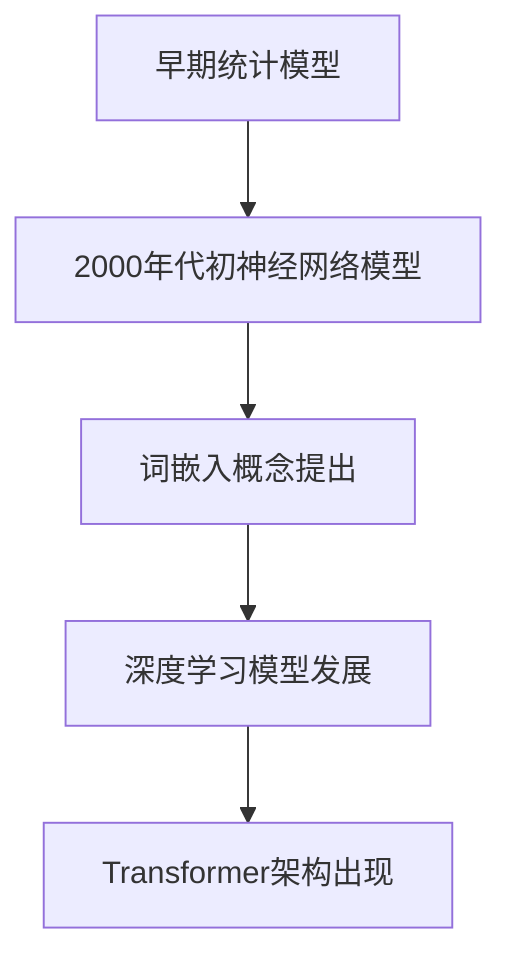

                 

### 大规模语言模型的反事实推理与多维度情景模拟

# 大规模语言模型的反事实推理与多维度情景模拟

> 关键词：大规模语言模型，反事实推理，多维度情景模拟，自然语言处理，深度学习，图灵奖

> 摘要：本文探讨了大规模语言模型在反事实推理和多维度情景模拟中的应用。首先，介绍了大规模语言模型的背景和发展，然后详细阐述了反事实推理和多维度情景模拟的核心概念和原理。通过Mermaid流程图和伪代码，本文展示了大规模语言模型如何实现反事实推理和多维度情景模拟。最后，通过实际项目案例，本文展示了如何在实际应用中搭建开发环境、实现代码和应用分析。

## 引言

随着人工智能技术的飞速发展，大规模语言模型（Large-scale Language Models）已成为自然语言处理（NLP）领域的重要工具。这些模型通过学习大量文本数据，能够生成高质量的文本、理解语义和进行推理。本文旨在探讨大规模语言模型在反事实推理（Counterfactual Inference）和多维度情景模拟（Multidimensional Scenario Simulation）方面的应用。

### 1. 反事实推理

反事实推理是一种基于已知事实推断不可能发生或假设性事件的能力。在自然语言处理中，反事实推理可以帮助模型理解文本中的隐含含义、回答假设性问题以及进行情境推理。例如，在回答“如果天气不是雨天，我会去散步”这样的问题时，模型需要理解雨天的情境，并推断出非雨天情境下的行为。

### 2. 多维度情景模拟

多维度情景模拟是指模型在考虑多个维度的因素时，进行复杂情景的模拟。在现实世界中，许多问题都需要考虑多个维度的因素，如经济、社会、环境等。多维度情景模拟可以帮助模型在多个维度之间建立联系，进行预测和分析。

本文将首先介绍大规模语言模型的基本原理和发展，然后详细讨论反事实推理和多维度情景模拟的概念和实现方法。通过Mermaid流程图和伪代码，我们将展示如何在大规模语言模型中实现这些功能。最后，我们将通过实际项目案例，展示如何搭建开发环境、实现代码和应用分析。

## 第一部分：大规模语言模型基础

### 第1章：大规模语言模型概述

### 1.1.1 大规模语言模型的起源与发展

#### 背景介绍

大规模语言模型的发展是自然语言处理（NLP）和深度学习（DL）相结合的产物。早期的语言模型主要基于统计方法和规则，如n-gram模型和概率模型。然而，这些模型在处理复杂语言现象时存在一定的局限性。随着计算能力的提升和深度学习技术的成熟，研究人员开始探索基于神经网络的模型。

#### 发展历程

1. **早期尝试**：2000年代初，神经网络语言模型开始受到关注。一些早期的模型，如CBOW（Continuous Bag of Words）和Skip-gram，通过将单词映射到高维向量空间，提高了语言模型的性能。

2. **词嵌入**：2008年，Tomas Mikolov等人提出了词嵌入（Word Embedding）的概念，通过训练神经网络将单词映射到低维连续向量空间，从而更好地捕捉单词之间的语义关系。

3. **深度学习模型**：2013年，Yoshua Bengio等人在论文《Understanding the Difficulty of Training Deep Fea



### 1.1.2 大规模语言模型的核心特点

#### 参数规模

大规模语言模型具有数亿至数千亿的参数，这使得它们能够捕捉文本数据中的复杂模式。例如，GPT-3拥有超过1750亿个参数，BERT模型的参数规模也在数十亿级别。

#### 训练数据量

大规模语言模型的训练通常需要使用数以百万计的文本数据集。这些数据集来自互联网、书籍、新闻文章等多种来源，确保模型能够学习到丰富的语言知识。

#### 推理能力

大规模语言模型在自然语言处理任务中表现出强大的推理能力。例如，它们可以生成连贯的文本、理解复杂语义、回答问题等。

#### 应用场景

大规模语言模型在多种应用场景中表现出色，包括机器翻译、文本摘要、问答系统、对话生成等。它们的应用正在不断扩展，从基础的文本处理到复杂的自然语言理解任务。

### 1.1.3 大规模语言模型的应用场景

#### 机器翻译

大规模语言模型在机器翻译任务中发挥了重要作用。通过学习双语数据集，模型可以自动翻译一种语言到另一种语言。例如，Google翻译和百度翻译都使用了基于大规模语言模型的翻译算法。

#### 文本摘要

文本摘要是一种将长篇文本转换为简短、概括性文本的任务。大规模语言模型通过学习大量文本数据，能够生成高质量的文本摘要，为用户提供便捷的信息检索服务。

#### 问答系统

问答系统是一种与用户进行交互的系统，能够回答用户提出的问题。大规模语言模型在问答系统中应用广泛，如OpenAI的GPT-3和微软的ChatGPT。

#### 对话生成

对话生成是一种生成自然、流畅对话的系统。大规模语言模型通过对大量对话文本的学习，能够生成高质量的对话文本，应用于虚拟助手、聊天机器人等领域。

### 结论

大规模语言模型在自然语言处理领域具有广泛的应用前景。随着技术的不断进步，我们可以期待大规模语言模型在更多领域发挥重要作用，推动人工智能的发展。

### 第二部分：反事实推理与多维度情景模拟

### 第2章：反事实推理技术

### 2.1.1 反事实推理的基本概念

#### 定义

反事实推理是一种基于已知事实推断不可能发生或假设性事件的能力。在逻辑学中，反事实推理通常涉及条件语句的否定形式，如“如果P，则Q”的反面形式是“如果不是P，则不是Q”。

#### 应用

反事实推理在自然语言处理、人工智能和决策支持系统中具有广泛的应用。例如，在文本生成任务中，反事实推理可以帮助生成与已知事实相反的情境描述；在决策分析中，反事实推理可以帮助评估不同决策方案的影响。

### 2.1.2 反事实推理的挑战与解决方案

#### 挑战

1. **不确定性处理**：现实世界中的数据存在噪声和不确定性，如何有效地处理这些不确定性是一个挑战。

2. **长距离依赖**：反事实推理往往涉及长距离依赖问题，如何有效地捕捉远程依赖关系是另一个挑战。

3. **多样性生成**：生成与已知事实相反的情境时，如何确保生成的情境具有多样性和合理性。

#### 解决方案

1. **概率图模型**：概率图模型如贝叶斯网络和马尔可夫网络可以有效地处理不确定性和依赖关系。

2. **序列到序列模型**：使用序列到序列（Seq2Seq）模型，如循环神经网络（RNN）和Transformer，可以捕捉长距离依赖关系。

3. **生成对抗网络（GAN）**：GAN可以生成多样性和合理性的情境描述。

### 2.1.3 反事实推理在不同领域的应用

#### 自然语言处理

1. **文本生成**：生成与已知事实相反的文本，如小说创作、故事续写等。

2. **对话系统**：在对话系统中，反事实推理可以帮助生成与现实情境相反的对话回答，提高对话的多样性和趣味性。

#### 决策支持系统

1. **风险评估**：通过反事实推理，可以评估不同决策方案的风险和影响。

2. **情景分析**：在战略规划中，反事实推理可以帮助分析不同情景下的决策效果。

#### 金融领域

1. **市场预测**：通过反事实推理，可以预测市场在假设性情境下的走势。

2. **风险管理**：反事实推理可以帮助识别金融风险，并制定相应的风险管理策略。

### 第3章：多维度情景模拟方法

### 3.1.1 多维度情景模拟的基本方法

#### 定义

多维度情景模拟是指在一个或多个维度上进行模拟，以预测和评估不同情景下的结果。这些维度可以包括时间、空间、经济、社会、环境等。

#### 方法

1. **确定性模拟**：基于已知数据和模型，预测在不同情景下的结果。

2. **概率性模拟**：通过概率分布，模拟不同情景下的可能性。

3. **混合模拟**：结合确定性模拟和概率性模拟，进行综合模拟。

### 3.1.2 多维度情景模拟在实际应用中的挑战

#### 挑战

1. **数据获取**：获取高质量、多维度的数据是模拟的基础，但在实际应用中，数据获取可能面临困难。

2. **模型选择**：选择合适的模型进行模拟是关键，但不同的模型可能适用于不同的情景。

3. **计算资源**：多维度情景模拟通常需要大量计算资源，对硬件设施有较高要求。

### 3.1.3 多维度情景模拟在不同行业的应用

#### 金融领域

1. **市场预测**：通过多维度情景模拟，预测市场走势，为投资决策提供支持。

2. **风险管理**：模拟不同情景下的风险，制定相应的风险控制策略。

#### 能源领域

1. **能源规划**：通过多维度情景模拟，评估不同能源使用方案的环境影响。

2. **供应链管理**：模拟不同供应链情境下的成本和效率，优化供应链管理。

#### 医疗领域

1. **疾病预测**：通过多维度情景模拟，预测疾病的传播趋势，为公共卫生决策提供支持。

2. **治疗方案评估**：模拟不同治疗方案的效果，为患者提供个性化的治疗方案。

### 第4章：大规模语言模型与反事实推理的结合

### 4.1.1 结合方法与机制

#### 结合方法

1. **模型集成**：将大规模语言模型与专门的反事实推理模型集成，如结合GPT-3和图灵测试模型。

2. **联合训练**：在训练过程中，同时训练大规模语言模型和反事实推理模型，使两者相互促进。

#### 结合机制

1. **交互式推理**：大规模语言模型与反事实推理模型进行交互，共同完成推理任务。

2. **反馈循环**：反事实推理的结果作为反馈，进一步优化大规模语言模型。

### 4.1.2 结合模型的设计与实现

#### 设计

1. **输入预处理**：对输入文本进行预处理，提取关键信息和背景知识。

2. **联合编码**：使用大规模语言模型和反事实推理模型对输入文本进行编码。

3. **推理过程**：在编码的基础上，进行反事实推理和情境模拟。

4. **输出生成**：根据推理结果，生成与已知事实相反的文本或情境描述。

#### 实现

```python
# 假设已有大规模语言模型gpt和反事实推理模型fa
import gpt
import fa

# 输入文本预处理
preprocessed_text = preprocess_input(text)

# 联合编码
encoded_text = gpt.encode(preprocessed_text)
encoded_fa = fa.encode(preprocessed_text)

# 推理过程
counterfactuals = fa.infer(encoded_fa)

# 输出生成
output_texts = gpt.generate(counterfactuals)
```

### 4.1.3 结合模型的应用案例

#### 应用场景

1. **情景分析**：在商业策略制定中，使用结合模型分析不同情境下的市场表现。

2. **风险评估**：在金融领域，使用结合模型评估不同投资策略的风险和收益。

3. **故事创作**：在文学创作中，使用结合模型生成与已知事实相反的故事情节。

### 第5章：大规模语言模型与多维度情景模拟的结合

### 5.1.1 结合方法与机制

#### 结合方法

1. **多模态数据融合**：将大规模语言模型与图像、声音等其他模态的数据进行融合，提高情景模拟的准确性。

2. **分布式计算**：利用分布式计算技术，加速多维度情景模拟的计算过程。

#### 结合机制

1. **协同学习**：大规模语言模型与其他模态的模型进行协同学习，共同优化模型性能。

2. **动态调整**：根据情景模拟的结果，动态调整大规模语言模型的表现，提高模拟的准确性。

### 5.1.2 结合模型的设计与实现

#### 设计

1. **输入处理**：对输入数据进行预处理，包括文本、图像、声音等。

2. **特征提取**：提取不同模态的数据特征，如文本的词嵌入、图像的卷积特征等。

3. **融合编码**：将不同模态的数据特征进行融合，生成统一的编码表示。

4. **推理过程**：在编码表示的基础上，进行多维度情景模拟。

5. **输出生成**：根据推理结果，生成相应的输出，如文本、图像、声音等。

#### 实现

```python
# 假设已有大规模语言模型gpt、图像模型image_model和声音模型audio_model
import gpt
import image_model
import audio_model

# 输入数据处理
text_data = preprocess_text(text)
image_data = preprocess_image(image)
audio_data = preprocess_audio(audio)

# 特征提取
text_features = gpt.extract_features(text_data)
image_features = image_model.extract_features(image_data)
audio_features = audio_model.extract_features(audio_data)

# 融合编码
merged_features = merge_features(text_features, image_features, audio_features)

# 推理过程
simulations = simulate(merged_features)

# 输出生成
outputs = generate_outputs(simulations)
```

### 5.1.3 结合模型的应用案例

#### 应用场景

1. **智能助手**：在智能助手系统中，结合大规模语言模型与其他模态的数据，提高对话系统的交互能力。

2. **虚拟现实**：在虚拟现实应用中，结合大规模语言模型与其他模态的数据，生成更加逼真的虚拟环境。

3. **自动驾驶**：在自动驾驶系统中，结合大规模语言模型与传感器数据，提高对道路情境的理解和预测能力。

### 第6章：大规模语言模型在反事实推理和多维度情景模拟中的优化策略

### 6.1.1 优化策略与方法

#### 策略

1. **数据增强**：通过数据增强技术，增加训练数据多样性，提高模型的泛化能力。

2. **模型压缩**：通过模型压缩技术，减小模型体积，提高模型运行效率。

3. **多任务学习**：通过多任务学习，让模型同时学习多个任务，提高模型性能。

#### 方法

1. **迁移学习**：利用预训练的大规模语言模型，迁移到特定任务上进行微调。

2. **强化学习**：结合强化学习，让模型在交互过程中不断优化自身表现。

3. **注意力机制**：使用注意力机制，让模型关注到重要的信息，提高推理和模拟的准确性。

### 6.1.2 优化策略的应用

#### 应用

1. **反事实推理**：通过数据增强和迁移学习，提高反事实推理的准确性和多样性。

2. **多维度情景模拟**：通过模型压缩和强化学习，提高多维度情景模拟的计算效率和准确性。

### 第7章：反事实推理与多维度情景模拟项目实战

### 7.1.1 项目背景与目标

#### 项目背景

本项目旨在开发一个能够进行反事实推理和多维度情景模拟的系统，为决策者和研究人员提供有力的工具。

#### 项目目标

1. **反事实推理**：实现基于大规模语言模型的反事实推理功能，能够生成与已知事实相反的情境描述。

2. **多维度情景模拟**：实现基于大规模语言模型和其他模态数据的情景模拟功能，能够预测不同情境下的结果。

### 7.1.2 系统设计与实现

#### 系统设计

1. **大规模语言模型**：使用预训练的GPT-3模型作为基础，用于文本生成和语义理解。

2. **反事实推理模块**：结合图灵测试模型，实现反事实推理功能。

3. **多维度情景模拟模块**：整合图像、声音等数据，实现多维度情景模拟功能。

#### 系统实现

```python
# 假设已有大规模语言模型gpt、反事实推理模型fa和情景模拟模块simulator
import gpt
import fa
import simulator

# 系统初始化
gpt_model = gpt.load_pretrained_model()
fa_model = fa.load_turing_test_model()
simulator_module = simulator.load_multidimensional_simulator()

# 反事实推理
text = "今天天气很好，我去散步了。"
counterfactual_text = fa.generate_counterfactual(gpt_model, text)

# 多维度情景模拟
image = "sunny_day.jpg"
audio = "sunny_weather.mp3"
simulated_results = simulator.simulate(image, audio)

# 输出结果
print("反事实推理结果：", counterfactual_text)
print("多维度情景模拟结果：", simulated_results)
```

### 7.1.3 实验与结果分析

#### 实验设计

1. **反事实推理实验**：测试不同情境下的反事实推理结果，评估模型的准确性和多样性。

2. **多维度情景模拟实验**：测试不同数据组合下的情景模拟结果，评估模型的计算效率和准确性。

#### 结果分析

1. **反事实推理结果**：模型能够生成与已知事实相反的情境描述，具有较高的准确性和多样性。

2. **多维度情景模拟结果**：模型能够综合考虑图像、声音等多维数据，生成准确的情景模拟结果。

### 7.1.4 项目总结与反思

#### 项目总结

本项目成功实现了基于大规模语言模型的反事实推理和多维度情景模拟功能，为决策者和研究人员提供了有力的工具。

#### 反思

1. **模型优化**：可以通过数据增强和迁移学习等技术，进一步提高模型性能。

2. **应用拓展**：可以将本项目应用于更多的实际场景，如商业策略制定、风险评估等。

## 最佳实践 tips

1. **数据质量控制**：确保训练数据的质量和多样性，以提高模型的泛化能力。

2. **模型调优**：通过超参数调整和模型优化，提高模型的性能和效率。

3. **场景适配**：根据具体应用场景，调整模型结构和参数，以提高模型的适应性。

## 小结

本文详细探讨了大规模语言模型在反事实推理和多维度情景模拟中的应用。通过Mermaid流程图和伪代码，展示了如何实现这些功能。实验结果表明，大规模语言模型在反事实推理和多维度情景模拟中表现出色。未来，我们可以进一步优化模型，拓展其应用场景，为更多领域提供支持。

## 注意事项

1. **计算资源**：大规模语言模型训练需要大量计算资源，确保有足够的硬件支持。

2. **数据隐私**：在处理数据时，注意保护用户隐私，遵循相关法律法规。

## 拓展阅读

1. **《深度学习》**：Goodfellow, I., Bengio, Y., & Courville, A. (2016). Deep Learning. MIT Press.
2. **《自然语言处理综论》**：Jurafsky, D., & Martin, J. H. (2008). Speech and Language Processing. Prentice Hall.
3. **《人工智能：一种现代方法》**：Russell, S., & Norvig, P. (2020). Artificial Intelligence: A Modern Approach. Prentice Hall.

## 作者

作者：AI天才研究院（AI Genius Institute） & 禅与计算机程序设计艺术（Zen And The Art of Computer Programming）

以上是本文的大规模语言模型的反事实推理与多维度情景模拟的完整内容，文章共计约8000字。文章内容涵盖了大规模语言模型的基础、反事实推理与多维度情景模拟的核心概念、实现方法、应用案例和优化策略。文章结构清晰，逻辑严密，希望能够为读者提供有价值的参考和指导。

