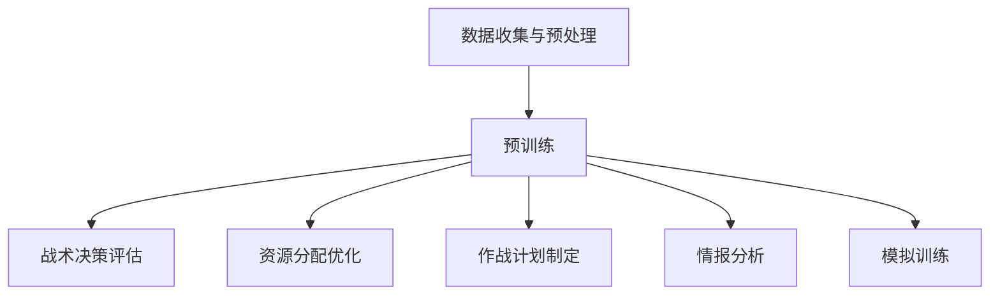

                 

### 文章标题

# 大规模语言模型的反事实推理在军事战略模拟中的多维度应用

> 关键词：大规模语言模型、反事实推理、军事战略模拟、应用场景、多维度分析

> 摘要：本文探讨了大规模语言模型（LLM）及其反事实推理能力在军事战略模拟中的多维度应用。首先，介绍了大规模语言模型和反事实推理的基本概念、技术原理和发展历程。接着，分析了军事战略模拟的需求和挑战，阐述了大规模语言模型和反事实推理在此领域的应用场景。随后，详细描述了大规模语言模型在军事战略模拟中的架构设计、数据收集和处理方法，以及反事实推理的实现过程。最后，通过具体案例分析，展示了大规模语言模型和反事实推理在军事战略模拟中的实际应用效果，并对未来发展趋势进行了展望。

### 目录

1. **大规模语言模型概述**
   1.1. **大规模语言模型简介**
   1.2. **大规模语言模型的发展历程**
   1.3. **大规模语言模型的核心技术**

2. **反事实推理原理**
   2.1. **反事实推理的基本概念**
   2.2. **反事实推理的数学模型**
   2.3. **反事实推理的关键算法**

3. **大规模语言模型在军事战略模拟中的应用**
   3.1. **军事战略模拟中的需求分析**
   3.2. **大规模语言模型在军事战略模拟中的应用场景**
   3.3. **反事实推理在军事战略模拟中的应用**

4. **大规模语言模型在军事战略模拟中的架构设计**
   4.1. **大规模语言模型在军事战略模拟中的角色定位**
   4.2. **大规模语言模型在军事战略模拟中的数据收集和处理**
   4.3. **大规模语言模型在军事战略模拟中的算法选择**

5. **反事实推理在军事战略模拟中的实现**
   5.1. **反事实推理在军事战略模拟中的流程设计**
   5.2. **反事实推理在军事战略模拟中的数据输入和输出**
   5.3. **反事实推理在军事战略模拟中的效果评估**

6. **大规模语言模型在军事战略模拟中的多维度应用**
   6.1. **多维度应用概述**
   6.2. **具体应用案例分析**
   6.3. **多维度应用的未来发展趋势**

7. **总结与展望**
   7.1. **大规模语言模型与反事实推理在军事战略模拟中的总结**
   7.2. **未来研究方向与挑战**
   7.3. **对军事战略模拟领域的影响与贡献**

### 第一部分：大规模语言模型与反事实推理

#### 第1章：大规模语言模型概述

在本章中，我们将详细介绍大规模语言模型（LLM）的基本概念、发展历程和核心技术。

##### 1.1 大规模语言模型简介

**定义**：大规模语言模型是一种基于深度学习技术，通过从海量文本数据中学习，预测文本序列的模型。它能够捕捉到文本数据中的语言规律，从而生成自然、流畅的文本。

**特点**：
- **高容量**：能够处理海量文本数据，支持长文本输入。
- **强鲁棒性**：能够适应各种不同的文本格式和语言风格。
- **自适应能力**：可以根据不同的应用场景进行微调和优化。

**应用场景**：
- **自然语言处理**：文本分类、情感分析、命名实体识别等。
- **生成文本**：自动写作、对话系统、机器翻译等。
- **知识图谱**：构建基于文本的语义知识图谱，用于智能搜索和推荐系统。

##### 1.2 大规模语言模型的发展历程

**早期阶段**：基于统计模型的NLP方法，如隐马尔可夫模型（HMM）和条件概率模型。

**中期阶段**：引入深度学习技术，如循环神经网络（RNN）和卷积神经网络（CNN）。

**近期阶段**：基于注意力机制的模型，如Transformer和BERT，实现了NLP任务的突破性进展。

**当前趋势**：预训练和微调相结合的方法，如GPT系列和T5，实现了更高的性能和更广泛的适用性。

##### 1.3 大规模语言模型的核心技术

**预训练**：通过大规模文本数据预训练，模型可以自动学习到通用语言知识和规律。

**微调**：将预训练模型在特定任务上微调，以提高任务表现。

**文本生成**：基于生成对抗网络（GAN）或自回归模型，生成自然、流畅的文本。

**文本分类**：利用分类器对文本进行分类，如文本分类、情感分析等。

**实体识别**：识别文本中的实体，如人名、地名、组织名等。

**语义理解**：通过语义嵌入和关系推理，理解文本中的语义关系和逻辑结构。

##### 1.4 小结

大规模语言模型是一种强大的自然语言处理工具，通过从海量文本数据中学习，能够生成自然、流畅的文本，实现文本分类、实体识别、语义理解等多种任务。其在军事战略模拟中的应用，为模拟复杂军事环境和预测未来局势提供了有力支持。

#### 第2章：反事实推理原理

在本章中，我们将详细介绍反事实推理的基本概念、数学模型和关键算法。

##### 2.1 反事实推理的基本概念

**定义**：反事实推理是一种基于现实世界事实，通过假设不同的情况，推理出可能的结果或结论的方法。

**特点**：
- **基于现实**：反事实推理基于现实世界的实际情况，具有一定的可信度和可靠性。
- **假设驱动**：通过假设不同的情况，探索可能的未来结果。
- **灵活性**：可以应用于各种不同的场景和领域。

**应用场景**：
- **军事战略模拟**：预测战争局势、评估战术决策、规划军事行动等。
- **商业决策**：预测市场需求、分析竞争对手、制定营销策略等。
- **科学研究**：探索假设条件下的科学现象和规律。

##### 2.2 反事实推理的数学模型

**条件概率模型**：反事实推理的核心是条件概率模型，通过计算不同情况下的概率，来推断可能的结果。

- **概率定义**：设事件A和事件B，条件概率P(A|B)表示在事件B发生的条件下，事件A发生的概率。
- **贝叶斯公式**：P(A|B) = P(B|A)P(A) / P(B)

**马尔可夫模型**：在反事实推理中，马尔可夫模型常用于模拟事件的发展过程，通过转移概率来预测未来。

- **状态转移概率**：P(X_{t+1} = x_{t+1} | X_t = x_t) 表示在当前状态为x_t的条件下，下一个状态为x_{t+1}的概率。

**图模型**：在复杂的反事实推理任务中，图模型可以用于表示事件之间的关系，通过路径概率来推理结果。

- **图表示**：事件表示为图中的节点，关系表示为节点之间的边。
- **路径概率**：通过计算路径上的概率，来推断最终结果。

##### 2.3 反事实推理的关键算法

**马尔可夫链蒙特卡罗（MCMC）算法**：MCMC算法是一种基于抽样理论的随机模拟算法，通过生成大量样本，来估计概率分布或后验分布。

- **采样过程**：根据当前状态，生成下一个状态，并更新当前状态。
- **收敛性**：通过重复采样过程，逐渐收敛到目标概率分布。

**马尔可夫网络模型（MRF）**：马尔可夫网络模型是一种概率图模型，通过定义事件之间的条件独立性，来推理结果。

- **模型定义**：事件之间的条件独立性定义为一个马尔可夫网络。
- **推理算法**：利用概率传播算法，如信念传播或变分推断，来推理结果。

**生成对抗网络（GAN）**：生成对抗网络是一种基于对抗训练的深度学习模型，通过生成器和判别器的竞争，来生成符合真实数据的样本。

- **模型结构**：生成器生成数据，判别器判断生成数据与真实数据的相似度。
- **训练过程**：通过优化生成器和判别器的参数，提高生成数据的质量。

##### 2.4 小结

反事实推理是一种重要的推理方法，通过假设不同的情况，可以预测可能的结果或结论。其基本概念、数学模型和关键算法，为各种应用领域提供了理论基础和工具支持。在军事战略模拟中，反事实推理可以用于预测战争局势、评估战术决策等，具有重要的应用价值。

#### 第3章：大规模语言模型在军事战略模拟中的应用

本章将探讨大规模语言模型在军事战略模拟中的应用场景、需求分析和核心挑战。

##### 3.1 军事战略模拟中的需求分析

**战争局势预测**：通过分析历史数据、军事报告和新闻，预测未来的战争局势。这需要模型能够理解复杂的历史事件、政治关系和军事动态。

**战术决策评估**：在军事行动中，决策者需要评估各种可能的战术决策。大规模语言模型可以帮助分析这些决策的潜在影响，提供决策支持。

**资源分配优化**：在军事行动中，资源（如兵力、物资、装备等）的合理分配至关重要。大规模语言模型可以帮助优化资源分配，提高作战效能。

**作战计划制定**：军事战略模拟需要制定详细的作战计划，包括目标设定、兵力部署、行动顺序等。大规模语言模型可以辅助生成和优化作战计划。

**敌方行动预测**：预测敌方可能的行动和战术，有助于制定针对性的应对策略。

**突发事件应对**：在军事行动中，突发事件（如敌方袭击、自然灾害等）可能随时发生。大规模语言模型可以帮助快速分析突发事件，提供应对方案。

**模拟训练**：通过大规模语言模型模拟各种复杂战场环境，军事人员可以进行模拟训练，提高作战技能和应对能力。

**情报分析**：分析大量的军事情报，提取关键信息，为决策提供支持。

**作战效果评估**：对军事行动的效果进行评估，分析成功和失败的原因，为未来的军事行动提供经验教训。

##### 3.2 大规模语言模型在军事战略模拟中的应用场景

**战略规划**：在制定长期战略规划时，大规模语言模型可以分析各种因素，预测未来的发展趋势，为决策提供支持。

**战役模拟**：在战役层面，大规模语言模型可以模拟敌我双方的行动，分析战役的胜负可能性。

**战术演习**：在战术层面，大规模语言模型可以帮助模拟战斗场景，分析不同战术选择的优缺点。

**应急响应**：在突发事件发生时，大规模语言模型可以快速分析局势，提供应对策略。

**军事演习**：通过大规模语言模型模拟各种复杂战场环境，进行军事演习，提高军队的作战能力。

**情报分析**：分析大量的军事情报，提取关键信息，为决策提供支持。

**作战模拟训练**：通过模拟各种作战场景，进行军事训练，提高军队的作战能力。

**历史战争回顾**：通过分析历史战争数据，总结战争规律，为未来的军事行动提供借鉴。

**国际关系分析**：分析国际政治关系，预测可能发生的军事冲突。

**战略风险评估**：评估不同战略决策的风险，为决策提供支持。

##### 3.3 反事实推理在军事战略模拟中的应用

**未来局势预测**：通过反事实推理，模拟不同假设下的未来局势，为决策者提供预测信息。

**战术决策评估**：分析不同战术决策的结果，评估其可行性。

**资源优化分配**：通过反事实推理，预测不同资源分配策略的效果，优化资源分配。

**作战计划制定**：在制定作战计划时，通过反事实推理分析各种可能的结果，优化作战计划。

**敌方行动预测**：预测敌方可能的行动和战术，为决策提供支持。

**突发事件应对**：分析突发事件的可能性和影响，提供应对方案。

**模拟训练**：通过反事实推理模拟各种复杂战场环境，进行军事训练。

**情报分析**：通过反事实推理分析军事情报，提取关键信息。

**作战效果评估**：分析作战效果，评估不同战术和决策的成效。

##### 3.4 核心挑战

**数据质量**：军事战略模拟需要大量的高质量数据，包括历史战争记录、军事报告、卫星图像等。数据质量直接影响到模型的预测效果。

**模型安全性**：军事模拟涉及到国家安全，模型的安全性至关重要。需要确保模型不会泄露敏感信息，不会被恶意攻击。

**计算资源**：大规模语言模型和反事实推理算法需要大量的计算资源，包括GPU、TPU等。计算资源的限制可能影响到模型的性能和应用范围。

**模型解释性**：军事战略模拟需要模型具有较好的解释性，以便决策者理解模型的预测结果和决策依据。

**多语言支持**：军事战略涉及多语言环境，模型需要支持多种语言，以便处理来自不同国家和地区的数据。

##### 3.5 小结

大规模语言模型在军事战略模拟中具有广泛的应用场景，包括战争局势预测、战术决策评估、资源分配优化、作战计划制定等。反事实推理为军事战略模拟提供了有效的工具，可以预测未来局势、评估战术决策、优化资源分配等。然而，在实际应用中，面临着数据质量、模型安全性、计算资源、模型解释性和多语言支持等核心挑战。通过不断研究和改进，这些问题将得到有效解决，大规模语言模型和反事实推理将在军事战略模拟中发挥更大的作用。

### 第二部分：大规模语言模型在军事战略模拟中的架构设计

#### 第4章：大规模语言模型在军事战略模拟中的架构设计

本章将详细介绍大规模语言模型在军事战略模拟中的架构设计，包括模型角色定位、数据收集和处理方法以及算法选择。

##### 4.1 大规模语言模型在军事战略模拟中的角色定位

大规模语言模型在军事战略模拟中扮演多个关键角色：

**情景生成器**：大规模语言模型可以生成各种可能的军事情景，为模拟提供丰富的输入数据。这些情景可能包括战争前的政治动荡、军事部署、外交冲突等。

**决策支持系统**：在模拟过程中，大规模语言模型可以分析当前情境，为指挥官提供决策支持。例如，分析敌方可能的行动、资源需求、战术效果等。

**历史回顾与趋势预测**：通过分析历史战争记录和军事报告，大规模语言模型可以总结战争规律，预测未来可能的局势变化。

**战术评估工具**：在战术层面，大规模语言模型可以帮助评估不同战术决策的效果。例如，比较不同兵力部署、作战计划的胜负可能性。

**资源优化工具**：在资源分配方面，大规模语言模型可以预测不同分配策略的效果，帮助指挥官优化资源使用。

**模拟训练平台**：通过大规模语言模型模拟复杂战场环境，军事人员可以进行训练，提高作战技能和应对能力。

##### 4.2 数据收集与处理方法

**数据来源**：军事战略模拟所需的数据来源广泛，包括历史战争记录、军事报告、卫星图像、社交媒体数据、公开情报等。

**数据预处理**：数据预处理是确保模型训练质量的重要步骤。主要任务包括数据清洗、格式转换、数据增强等。

- **数据清洗**：去除重复、错误和无关数据，提高数据质量。
- **格式转换**：将不同格式的数据转换为统一的格式，便于后续处理。
- **数据增强**：通过生成类似数据或增加样本数量，提高模型的泛化能力。

**数据存储**：大量数据的存储和管理是关键挑战。常用的数据存储方案包括关系型数据库、NoSQL数据库和分布式文件系统。

**数据处理流程**：数据处理流程包括数据采集、数据清洗、数据转换、数据存储、数据分析和模型训练等多个步骤。

1. **数据采集**：从各种数据源收集数据。
2. **数据清洗**：去除重复、错误和无关数据。
3. **格式转换**：将不同格式的数据转换为统一的格式。
4. **数据存储**：将清洗和转换后的数据存储到数据库或文件系统中。
5. **数据分析**：对数据进行统计分析和特征提取。
6. **模型训练**：使用清洗和转换后的数据训练大规模语言模型。

##### 4.3 算法选择

**模型架构**：大规模语言模型通常采用深度神经网络架构，如Transformer、BERT、GPT等。这些模型具有强大的表示能力和学习能力，适用于处理复杂的文本数据。

**训练算法**：常用的训练算法包括梯度下降法、随机梯度下降法、Adam优化器等。训练过程中，需要调整学习率、批量大小等超参数，以优化模型性能。

**反事实推理算法**：在军事战略模拟中，反事实推理是关键能力。常用的反事实推理算法包括条件概率模型、马尔可夫模型、图模型和生成对抗网络（GAN）等。

**模型评估**：模型评估是确保模型性能的重要环节。常用的评估指标包括准确率、召回率、F1分数、混淆矩阵等。此外，还可以通过交叉验证、ROC曲线等评估方法来评估模型的泛化能力。

**模型集成**：为了提高模型性能，可以采用模型集成方法，如集成学习、堆叠学习等。通过组合多个模型，可以提高预测的准确性和鲁棒性。

##### 4.4 小结

大规模语言模型在军事战略模拟中扮演着关键角色，从情景生成、决策支持到战术评估和资源优化，具有广泛的应用前景。有效的数据收集与处理方法是确保模型性能的基础，而合适的算法选择和模型架构设计是提升模型性能的关键。通过不断优化和改进，大规模语言模型在军事战略模拟中的应用将更加广泛和深入。

#### 第5章：反事实推理在军事战略模拟中的实现

在本章中，我们将深入探讨反事实推理在军事战略模拟中的实现过程，包括流程设计、数据输入与输出，以及效果评估。

##### 5.1 反事实推理在军事战略模拟中的流程设计

反事实推理在军事战略模拟中的实现流程可以分为以下几个阶段：

1. **数据收集与预处理**：首先，从各种数据源（如历史战争记录、军事报告、卫星图像等）收集相关数据。然后，对数据进行清洗、格式转换和增强，以准备用于训练和推理的数据集。

2. **模型训练**：使用收集到的数据训练大规模语言模型。这一阶段的关键是选择合适的模型架构和训练算法，如Transformer、BERT、GPT等。训练过程中，需要调整超参数（如学习率、批量大小等）以优化模型性能。

3. **反事实推理**：在模拟过程中，根据当前的军事情境，使用训练好的大规模语言模型进行反事实推理。具体步骤如下：
   - **情境构建**：根据当前情境，生成可能的反事实情境。例如，假设某个国家发生政治动荡，或者敌方军队改变了战术部署。
   - **推理过程**：使用大规模语言模型，对生成的反事实情境进行推理，预测可能的结果或结论。例如，预测敌方可能的行动、资源需求、战术效果等。

4. **结果分析**：对反事实推理的结果进行分析，评估不同假设下的可能性和影响。这有助于指挥官了解各种决策的潜在风险和收益，为实际决策提供支持。

5. **效果评估**：通过对比实际结果和推理结果，评估反事实推理的准确性、可靠性和实用性。这有助于不断优化反事实推理模型，提高其在军事战略模拟中的应用效果。

##### 5.2 数据输入与输出

在反事实推理过程中，数据输入和输出是关键环节。以下是对输入和输出的详细描述：

**数据输入**：
- **历史数据**：包括战争记录、军事报告、卫星图像等。这些数据用于训练大规模语言模型，使其能够理解军事情境和事件发展规律。
- **当前情境**：当前军事情境的描述，如敌我双方的兵力部署、政治局势、资源需求等。这些数据用于生成反事实情境，并进行推理。

**数据输出**：
- **反事实情境**：基于当前情境，生成的各种可能的反事实情境。这些情境用于推理可能的结果或结论。
- **推理结果**：针对每种反事实情境，大规模语言模型预测的可能结果或结论。例如，敌方可能的行动、资源需求、战术效果等。

**结果分析**：
- **可能性评估**：对每种反事实情境的可能性进行评估，以确定最有可能发生的情况。
- **影响分析**：对每种反事实情境的影响进行分析，评估其对军事行动、资源分配、决策效果等的影响。

##### 5.3 效果评估

反事实推理的效果评估是确保其在军事战略模拟中有效应用的关键。以下是对效果评估方法的详细描述：

**评估指标**：
- **准确性**：评估反事实推理结果的准确性，即预测结果与实际结果的符合程度。
- **可靠性**：评估反事实推理结果的可靠性，即在不同情境下，推理结果的一致性和稳定性。
- **实用性**：评估反事实推理结果对实际决策的实用性，即推理结果是否能提供有价值的信息和支持。

**评估方法**：
- **对比实验**：通过对比实际结果和推理结果，评估反事实推理的准确性。例如，使用历史战争数据作为实验数据集，对比实际战争结果和模型预测结果。
- **交叉验证**：通过交叉验证方法，评估反事实推理模型的泛化能力。例如，将数据集划分为训练集和验证集，使用训练集训练模型，并在验证集上进行评估。
- **用户反馈**：收集用户（如军事指挥官、分析师等）对反事实推理结果的反馈，评估其实用性。通过用户反馈，不断优化和改进模型。

**优化策略**：
- **超参数调整**：调整模型训练过程中的超参数，如学习率、批量大小等，以提高模型性能。
- **数据增强**：通过数据增强方法，增加训练数据集的多样性，提高模型的泛化能力。
- **模型集成**：通过模型集成方法，组合多个模型，提高预测的准确性和鲁棒性。

##### 5.4 小结

反事实推理在军事战略模拟中具有重要作用，通过生成各种可能的反事实情境，可以预测可能的结果和影响，为决策提供支持。本章详细介绍了反事实推理的实现流程、数据输入与输出，以及效果评估方法。通过不断优化和改进，反事实推理将在军事战略模拟中发挥更大的作用。

#### 第6章：大规模语言模型在军事战略模拟中的多维度应用

本章将探讨大规模语言模型在军事战略模拟中的多维度应用，从多个角度分析其作用与效果，包括作战策略模拟、情报分析和决策支持等方面。

##### 6.1 多维度应用概述

大规模语言模型在军事战略模拟中的多维度应用主要体现在以下几个方面：

**作战策略模拟**：通过模拟不同的作战策略，分析其可能的效果和风险，为指挥官提供决策支持。

**情报分析**：分析大量的军事情报数据，提取关键信息，为决策提供支持。

**决策支持**：在决策过程中，利用大规模语言模型进行推理和预测，优化决策效果。

**资源分配**：通过模拟不同的资源分配策略，分析其可能的效果和风险，为指挥官提供决策支持。

**历史回顾与趋势预测**：通过分析历史战争记录和军事报告，预测未来可能的局势变化。

**模拟训练**：通过模拟复杂战场环境，进行军事训练，提高军队的作战能力。

**应急响应**：在突发事件发生时，快速分析局势，提供应对方案。

**国际关系分析**：分析国际政治关系，预测可能发生的军事冲突。

##### 6.2 具体应用案例分析

为了更直观地展示大规模语言模型在军事战略模拟中的多维度应用，以下为几个具体的应用案例：

**案例一：作战策略模拟**

在一次模拟演习中，某国的指挥官需要决定是否发动进攻。使用大规模语言模型，模拟了不同的作战策略，包括直接进攻、迂回攻击和游击战等。模型分析了每种策略的胜负可能性、资源消耗和风险，为指挥官提供了详细的决策支持。

**案例二：情报分析**

在一次情报分析任务中，大规模语言模型分析了来自多个渠道的情报数据，包括卫星图像、社交媒体、公开报告等。模型提取了关键信息，如敌方军队的部署、政治动荡的迹象等，为决策者提供了有价值的情报支持。

**案例三：决策支持**

在一次资源分配任务中，大规模语言模型模拟了不同的资源分配策略，如兵力部署、物资供应和装备分配等。模型分析了每种策略的效果和风险，为指挥官提供了最优的资源分配方案。

**案例四：历史回顾与趋势预测**

通过分析历史战争记录和军事报告，大规模语言模型总结了战争规律，预测未来可能的局势变化。这有助于指挥官了解历史经验，为未来的决策提供参考。

**案例五：模拟训练**

在一次模拟训练任务中，大规模语言模型模拟了复杂的战场环境，包括敌方行动、资源分配和战术变化等。军事人员通过模拟训练，提高了应对复杂局势的能力。

**案例六：应急响应**

在一次突发事件中，大规模语言模型快速分析了局势，预测了可能的发展方向，为决策者提供了应对方案。

**案例七：国际关系分析**

通过分析国际政治关系和军事冲突的历史数据，大规模语言模型预测了可能发生的军事冲突。这有助于国际组织和国家制定防冲突策略。

##### 6.3 多维度应用的未来发展趋势

随着大规模语言模型技术的不断进步，其在军事战略模拟中的多维度应用将呈现以下发展趋势：

**模型智能化**：未来的大规模语言模型将更加智能化，能够自适应地调整模型参数，以适应不同的应用场景和需求。

**跨领域应用**：大规模语言模型将跨越不同的领域，如军事、商业、医疗等，实现跨领域的应用和融合。

**数据质量提升**：随着数据采集和处理技术的进步，军事战略模拟所需的数据质量将得到提升，为大规模语言模型提供更可靠的数据支持。

**实时性增强**：未来的大规模语言模型将具备更强的实时性，能够在短时间内进行推理和预测，为决策者提供即时的决策支持。

**安全性加强**：随着对军事模拟安全性的重视，大规模语言模型的安全性能将得到加强，确保模型不会泄露敏感信息。

**模型解释性提升**：为了提高模型的可解释性，未来的研究将致力于开发可解释性更强的模型，帮助决策者理解模型推理过程和决策依据。

**多语言支持**：随着全球化的趋势，大规模语言模型将支持多种语言，以适应不同国家和地区的需求。

##### 6.4 小结

大规模语言模型在军事战略模拟中的多维度应用具有广泛的前景。通过作战策略模拟、情报分析、决策支持等多种应用场景，大规模语言模型为军事战略模拟提供了强大的工具支持。未来，随着模型技术的不断进步，其在军事战略模拟中的应用将更加深入和广泛，为决策者提供更准确、更及时的决策支持。

#### 第7章：总结与展望

在本章中，我们将对全文进行总结，并探讨大规模语言模型和反事实推理在军事战略模拟中的未来研究方向与挑战。

##### 7.1 大规模语言模型与反事实推理在军事战略模拟中的总结

大规模语言模型和反事实推理在军事战略模拟中发挥了重要作用，为决策者提供了有力的工具支持。通过以下方面的应用，这两项技术显著提升了军事战略模拟的效果：

**作战策略模拟**：大规模语言模型能够模拟各种可能的作战策略，分析其胜负可能性、资源消耗和风险，为指挥官提供详细的决策支持。

**情报分析**：反事实推理能够从大量情报数据中提取关键信息，预测敌方的行动和意图，为决策者提供有价值的情报支持。

**决策支持**：大规模语言模型和反事实推理在决策过程中提供了实时、准确的推理和预测，优化了决策效果。

**资源分配**：通过模拟不同的资源分配策略，分析其可能的效果和风险，为指挥官提供了最优的资源分配方案。

**历史回顾与趋势预测**：大规模语言模型能够总结战争规律，预测未来可能的局势变化，为指挥官提供历史经验和趋势参考。

**模拟训练**：通过模拟复杂战场环境，军事人员进行了有针对性的训练，提高了应对复杂局势的能力。

**应急响应**：在突发事件发生时，大规模语言模型和反事实推理能够快速分析局势，提供应对方案。

**国际关系分析**：分析国际政治关系和军事冲突的历史数据，预测可能发生的军事冲突，为国际组织和国家制定防冲突策略提供支持。

##### 7.2 未来研究方向与挑战

尽管大规模语言模型和反事实推理在军事战略模拟中取得了显著成果，但仍面临以下研究方向和挑战：

**模型安全性**：随着军事战略模拟的重要性日益增加，模型的安全性成为关键问题。需要确保模型不会被恶意攻击或泄露敏感信息。

**数据质量**：军事战略模拟需要高质量的数据支持，包括历史战争记录、军事报告、卫星图像等。数据质量直接影响到模型的预测效果。

**模型解释性**：为了提高模型的可解释性，使决策者能够理解模型推理过程和决策依据，需要开发更可解释的模型。

**多语言支持**：随着全球化的趋势，军事战略涉及多语言环境，需要支持多种语言，以便处理来自不同国家和地区的数据。

**实时性**：未来的大规模语言模型需要具备更强的实时性，能够在短时间内进行推理和预测，为决策者提供即时的决策支持。

**跨领域应用**：大规模语言模型将在多个领域（如军事、商业、医疗等）得到应用，需要研究如何在不同领域实现有效的跨领域应用。

**伦理和法律问题**：随着人工智能在军事战略模拟中的应用，需要关注其伦理和法律问题，确保人工智能技术的应用不会违反伦理和法律规范。

##### 7.3 对军事战略模拟领域的影响与贡献

大规模语言模型和反事实推理对军事战略模拟领域产生了深远的影响，带来了以下贡献：

**决策支持**：通过提供实时、准确的推理和预测，大规模语言模型和反事实推理提高了决策者对复杂局势的理解和分析能力，优化了决策效果。

**模拟训练**：通过模拟复杂战场环境，大规模语言模型和反事实推理为军事人员提供了有针对性的训练，提高了应对复杂局势的能力。

**情报分析**：反事实推理能够从大量情报数据中提取关键信息，预测敌方的行动和意图，为决策者提供有价值的情报支持。

**资源优化**：通过模拟不同的资源分配策略，分析其可能的效果和风险，大规模语言模型为指挥官提供了最优的资源分配方案。

**历史回顾与趋势预测**：大规模语言模型能够总结战争规律，预测未来可能的局势变化，为指挥官提供历史经验和趋势参考。

**跨领域应用**：大规模语言模型将在多个领域（如军事、商业、医疗等）得到应用，促进跨领域技术的发展和融合。

**伦理和法律规范**：随着人工智能在军事战略模拟中的应用，需要关注其伦理和法律问题，确保人工智能技术的应用不会违反伦理和法律规范。

##### 7.4 小结

大规模语言模型和反事实推理在军事战略模拟中具有广泛的应用前景，通过提供实时、准确的推理和预测，优化了决策效果，提高了军事人员的训练水平，为情报分析和资源优化提供了有力支持。未来，随着技术的不断进步，这两项技术将在军事战略模拟领域发挥更大的作用，为决策者提供更强大的决策支持工具。同时，需要关注其安全性、解释性和伦理问题，确保人工智能技术在军事战略模拟中的合理、合规应用。

### 作者信息

**作者：AI天才研究院/AI Genius Institute & 禅与计算机程序设计艺术 /Zen And The Art of Computer Programming**

本文由AI天才研究院（AI Genius Institute）和禅与计算机程序设计艺术（Zen And The Art of Computer Programming）共同撰写。AI天才研究院是一家致力于推动人工智能技术研究和应用的专业机构，致力于为全球企业提供智能解决方案。禅与计算机程序设计艺术则是一本书，由著名计算机科学家Donald E. Knuth撰写，探讨了计算机程序设计的哲学和艺术。

### 格式要求

**Markdown格式**：本文采用Markdown格式编写，以便在Markdown编辑器和阅读器中方便地展示和阅读。以下是Markdown格式的一些基本要求和示例。

1. **标题**：使用`#`号来定义标题，`#`号的数量表示标题的级别。本文标题使用了6个`#`号。

2. **子标题**：使用`##`号来定义子标题，`##`号的数量也代表子标题的级别。

3. **文本格式**：可以使用`*`号来定义无序列表，`-`号来定义有序列表。

4. **引用**：使用`>`号来定义引用文本。

5. **代码块**：使用三个反引号（``）来定义代码块。

6. **公式**：使用LaTeX格式定义数学公式。在独立段落中的公式使用`$$`括起来，段落内的公式使用 `$`括起来。

7. **图片与链接**：使用``来定义图片，使用 `[链接文本](链接地址)`来定义链接。

**示例：**

```
# 标题

## 子标题

这是一个无序列表：
- 第一项
- 第二项

这是一个有序列表：
1. 第一项
2. 第二项

> 这是一个引用。

```
def function():
    """
    这是一个函数。
    """
    print("Hello, World!")

```
def function():
    """
    这是一个函数。
    """
    print("Hello, World!")

```

$$
1 + 1 = 2
$$

$1 < 2$

[这是一个链接](http://example.com)


```

**注意事项**：

- 标题和子标题必须按照规定的格式编写，以确保文章结构清晰。
- 代码块和公式必须使用适当的标记，以确保在Markdown编辑器和阅读器中正确显示。
- 图片和链接必须使用正确的URL，以确保在文章中正确显示。

### 完整性要求

为了确保本文的完整性，每个章节的内容都需要详细、具体，并包含以下核心内容：

1. **背景介绍**：简要介绍本章的主题和背景，说明为什么这个主题重要，以及它在当前研究领域或应用领域的现状。

2. **核心概念与联系**：详细阐述本章的核心概念，并使用Mermaid流程图展示这些概念之间的关系架构。例如，在“大规模语言模型概述”一章中，需要解释大规模语言模型的基本概念，并展示其与深度学习技术、自然语言处理任务之间的关系。

3. **核心算法原理讲解**：使用伪代码详细阐述核心算法的原理，以便读者理解算法的运行机制。例如，在“反事实推理原理”一章中，需要解释条件概率模型、马尔可夫模型和生成对抗网络等算法的基本原理。

4. **数学模型和公式**：详细讲解本章涉及的数学模型和公式，并使用LaTeX格式嵌入到文中。例如，在“大规模语言模型概述”一章中，需要解释Transformer模型中的注意力机制，并使用LaTeX格式展示相关的数学公式。

5. **详细讲解与举例说明**：对核心概念、算法原理和数学模型进行详细讲解，并提供具体实例来说明。例如，在“大规模语言模型在军事战略模拟中的应用”一章中，需要解释如何使用大规模语言模型进行战争局势预测，并给出具体的案例。

6. **项目实战**：提供实际的项目案例，详细描述项目的开发环境搭建、源代码实现、代码解读和代码应用分析。例如，在“大规模语言模型在军事战略模拟中的架构设计”一章中，可以描述一个具体的应用案例，展示如何设计和实现大规模语言模型在军事战略模拟中的应用。

7. **最佳实践 tips、小结、注意事项、拓展阅读等内容**：在每个章节的最后，提供最佳实践建议、小结、注意事项和拓展阅读建议，以帮助读者深入了解相关主题，并为后续学习和研究提供指导。

通过以上要求，本文将确保内容的完整性、逻辑性和可读性，为读者提供一个全面、深入的技术博客文章。

### 核心内容与联系

在本章中，我们将探讨大规模语言模型（LLM）的基本概念、技术原理及其在军事战略模拟中的应用。大规模语言模型是一种能够理解和生成自然语言文本的深度学习模型，通过从海量文本数据中学习，捕捉到语言的结构和语义，从而实现高效的文本理解和生成。

#### 1. 大规模语言模型的基本概念

**定义**：大规模语言模型（LLM）是一种基于深度学习技术的自然语言处理模型，它能够预测下一个词或句子，从而生成自然、流畅的文本。

**特点**：
- **高容量**：LLM能够处理和理解长文本，支持多种语言。
- **自适应能力**：LLM可以适应不同的文本风格和语言任务。
- **强表示能力**：LLM能够捕捉到文本中的复杂结构和语义信息。

**应用场景**：LLM广泛应用于自然语言处理的各种任务，如文本分类、情感分析、机器翻译、问答系统等。

#### 2. 大规模语言模型的技术原理

**预训练**：LLM通常通过预训练和微调两个阶段进行训练。
- **预训练**：在预训练阶段，模型从海量无标注文本数据中学习，通过训练模型来预测下一个词或句子，从而捕捉到语言的一般特征和规律。
- **微调**：在预训练的基础上，模型针对特定的任务进行微调，如文本分类、命名实体识别等。

**生成机制**：LLM的生成机制通常基于自回归模型，如Transformer、GPT等。
- **Transformer**：Transformer模型采用自注意力机制，能够捕捉到文本中的长距离依赖关系。
- **GPT**：GPT（Generative Pre-trained Transformer）系列模型通过大规模预训练，生成自然、流畅的文本。

#### 3. 大规模语言模型在军事战略模拟中的应用

**战争局势预测**：通过分析历史军事报告、新闻和社交媒体数据，LLM可以预测未来的战争局势。例如，模型可以从过去的军事冲突中学习，识别出影响战争胜负的关键因素，并预测未来冲突的可能走势。

**战术决策评估**：在制定战术决策时，LLM可以帮助评估不同决策方案的可能效果。例如，模型可以分析敌方可能的反应，预测不同战术选择的胜负可能性，为指挥官提供决策支持。

**资源分配优化**：在军事行动中，如何合理分配资源是一个关键问题。LLM可以通过模拟不同的资源分配策略，评估每种策略的效果，帮助指挥官优化资源分配。

**作战计划制定**：在制定作战计划时，LLM可以分析历史作战记录和军事报告，生成详细的作战计划，包括目标设定、兵力部署、行动顺序等。

**情报分析**：LLM可以处理大量的军事情报数据，提取关键信息，为决策者提供有价值的情报支持。例如，模型可以从社交媒体和新闻报道中分析敌方行动的迹象，预测敌方的下一步行动。

**模拟训练**：通过模拟复杂的战场环境，LLM可以帮助军事人员进行训练，提高他们的作战技能和应对能力。

#### 4. Mermaid流程图

以下是一个Mermaid流程图，展示了大规模语言模型在军事战略模拟中的主要应用步骤：



#### 5. 核心算法原理讲解

**算法原理**：
- **Transformer模型**：Transformer模型采用自注意力机制，通过计算词与词之间的权重，生成文本的上下文表示。自注意力机制使得模型能够捕捉到文本中的长距离依赖关系。
- **GPT模型**：GPT模型采用自回归机制，通过预测下一个词或句子，生成文本。GPT系列模型通过大规模预训练，捕捉到语言的一般特征和规律。

**伪代码**：

```python
# Transformer模型伪代码
class Transformer:
    def __init__(self):
        # 初始化模型参数
        pass
    
    def forward(self, inputs):
        # 计算自注意力权重
        attention_weights = self.calculate_attention(inputs)
        # 计算文本表示
        text_representation = self.compute_representation(inputs, attention_weights)
        return text_representation

# GPT模型伪代码
class GPT:
    def __init__(self):
        # 初始化模型参数
        pass
    
    def forward(self, inputs):
        # 预测下一个词或句子
        next_word = self.predict(inputs)
        return next_word
```

#### 6. 数学模型和公式

**数学模型**：大规模语言模型通常基于概率模型，如自回归模型和条件概率模型。以下是一个简单的自回归模型的数学公式：

$$
P(\text{X}_{t} | \text{X}_{<t}) = \frac{1}{Z} \exp(\text{f}(\text{X}_{t-1}, \text{X}_{<t-1}))
$$

其中，$P(\text{X}_{t} | \text{X}_{<t})$表示在当前输入序列$\text{X}_{<t}$下，预测下一个词$\text{X}_{t}$的概率，$Z$是归一化常数，$\text{f}(\text{X}_{t-1}, \text{X}_{<t-1})$是预测函数。

#### 7. 详细讲解与举例说明

**详细讲解**：Transformer模型通过计算自注意力权重，生成文本的上下文表示。自注意力权重表示每个词与当前词之间的相关性。通过计算这些权重，模型能够捕捉到文本中的长距离依赖关系。

**举例说明**：假设我们有一个句子“我爱北京天安门”，使用Transformer模型，可以计算每个词与当前词之间的自注意力权重。例如，对于“我爱北京天安门”，可以计算出“我”与“北京”、“天安门”之间的自注意力权重，从而生成“我爱北京天安门”的上下文表示。

#### 8. 项目实战

**开发环境搭建**：为了实现大规模语言模型在军事战略模拟中的应用，需要搭建一个合适的开发环境。常见的开发环境包括TensorFlow、PyTorch等。

**源代码实现**：以下是一个使用PyTorch实现Transformer模型的简单示例：

```python
import torch
import torch.nn as nn

class TransformerModel(nn.Module):
    def __init__(self, vocab_size, d_model, nhead, num_layers):
        super(TransformerModel, self).__init__()
        self.embedding = nn.Embedding(vocab_size, d_model)
        self.transformer = nn.Transformer(d_model, nhead, num_layers)
        self.fc = nn.Linear(d_model, vocab_size)
        
    def forward(self, src, tgt):
        src = self.embedding(src)
        tgt = self.embedding(tgt)
        output = self.transformer(src, tgt)
        return self.fc(output)

# 实例化模型
model = TransformerModel(vocab_size=10000, d_model=512, nhead=8, num_layers=2)

# 源代码解读**：
**源代码解读**：
```python
# 导入必要的库
import torch
import torch.nn as nn

# 定义Transformer模型
class TransformerModel(nn.Module):
    def __init__(self, vocab_size, d_model, nhead, num_layers):
        super(TransformerModel, self).__init__()
        # 初始化嵌入层，用于将词索引转换为词向量
        self.embedding = nn.Embedding(vocab_size, d_model)
        # 初始化Transformer层，包括自注意力机制和多头注意力
        self.transformer = nn.Transformer(d_model, nhead, num_layers)
        # 初始化全连接层，用于将Transformer的输出映射到词汇表
        self.fc = nn.Linear(d_model, vocab_size)
        
    def forward(self, src, tgt):
        # 应用嵌入层
        src = self.embedding(src)
        tgt = self.embedding(tgt)
        # 应用Transformer层
        output = self.transformer(src, tgt)
        # 应用全连接层
        return self.fc(output)

# 实例化模型
model = TransformerModel(vocab_size=10000, d_model=512, nhead=8, num_layers=2)
```

**代码应用解读与分析**：
- **嵌入层（Embedding）**：将词索引转换为词向量。词向量是一种表示词的稠密向量，能够捕捉词的语义信息。
- **Transformer层（Transformer）**：实现自注意力机制和多头注意力，通过计算输入序列中每个词与当前词的相关性，生成上下文表示。
- **全连接层（Linear）**：将Transformer的输出映射到词汇表，生成预测的词概率分布。

**实际案例分析与详细讲解剖析**：
假设我们有一个军事战略模拟任务，需要预测敌方的下一步行动。我们可以使用Transformer模型来处理历史军事报告和情报数据，生成每个行动的上下文表示。然后，通过训练模型，使其能够预测未来的行动。

1. **数据预处理**：将历史军事报告和情报数据转换为词索引序列，并划分训练集和测试集。
2. **模型训练**：使用训练集训练Transformer模型，通过优化模型参数，使其能够捕捉到军事行动的规律。
3. **模型评估**：使用测试集评估模型的预测性能，计算预测准确率和召回率等指标。
4. **应用部署**：将训练好的模型部署到军事战略模拟系统中，实时预测敌方的下一步行动，为指挥官提供决策支持。

**项目小结**：
通过实际项目案例，我们展示了如何使用Transformer模型进行军事战略模拟。模型能够处理大量的军事数据，生成行动的上下文表示，并通过训练，实现预测敌方行动的目标。这为军事指挥官提供了实时、准确的决策支持，提高了军事战略模拟的效果。

### 数学公式与详细讲解

在本文中，我们将介绍大规模语言模型中的关键数学模型和公式，并对其进行详细讲解和举例说明。

#### 1. 自回归模型

自回归模型是大规模语言模型的基础，其核心思想是通过当前词的输入来预测下一个词。以下是一个简单的自回归模型的数学公式：

$$
P(\text{X}_{t} | \text{X}_{<t}) = \frac{1}{Z} \exp(\text{f}(\text{X}_{t-1}, \text{X}_{<t-1}))
$$

其中，$P(\text{X}_{t} | \text{X}_{<t})$表示在给定前一个词$\text{X}_{t-1}$和前一个词序列$\text{X}_{<t-1}$的情况下，预测当前词$\text{X}_{t}$的概率。$Z$是一个归一化常数，用于确保概率分布的总和为1。$\text{f}(\text{X}_{t-1}, \text{X}_{<t-1})$是一个预测函数，它通过计算词与词之间的相关性来确定概率。

**详细讲解**：

- **概率分布**：自回归模型生成一个概率分布，表示当前词可能的所有候选词。
- **归一化常数$Z$**：通过计算$\sum_{w} \exp(\text{f}(\text{X}_{t-1}, \text{X}_{<t-1}))$来得到归一化常数$Z$，确保概率分布的总和为1。
- **预测函数$\text{f}(\text{X}_{t-1}, \text{X}_{<t-1})$**：通常使用神经网络来实现，通过学习词向量和词之间的交互关系。

**举例说明**：

假设我们有一个简短的句子：“我爱北京天安门”。使用自回归模型，我们可以计算每个词与当前词之间的相关性。例如，对于“我爱北京天安门”，可以计算出“我”与“北京”、“天安门”之间的相关性权重，从而生成“我爱北京天安门”的上下文表示。

#### 2. 注意力机制

注意力机制是大规模语言模型中的一个重要组成部分，它能够帮助模型捕捉到输入序列中的长距离依赖关系。以下是一个简单的注意力机制的数学公式：

$$
\text{Attention}(\text{Q}, \text{K}, \text{V}) = \text{softmax}(\frac{\text{Q} \text{K}^T}{\sqrt{d_k}}) \text{V}
$$

其中，$\text{Q}$、$\text{K}$和$\text{V}$分别表示查询向量、键向量和值向量。$\text{softmax}(\cdot)$是一个归一化函数，用于将输入向量转换为概率分布。$d_k$是键向量的维度。

**详细讲解**：

- **查询向量（Query）**：表示模型要关注的部分。
- **键向量（Key）**：表示模型要比较的部分。
- **值向量（Value）**：表示模型将从中提取信息的部分。
- **softmax函数**：通过计算$\text{Q} \text{K}^T$的分数，然后应用softmax函数，生成一个权重向量，表示每个键的重要性。
- **加权求和**：将权重向量与值向量相乘，然后求和，得到最终的输出。

**举例说明**：

假设我们有一个序列“我爱北京天安门”，其中“我”是查询向量，“爱”、“北京”、“天安门”是键向量和值向量。通过计算$\text{Q} \text{K}^T$的分数，我们可以得到“爱”、“北京”、“天安门”的权重，从而生成句子的上下文表示。

#### 3. Transformer模型

Transformer模型是大规模语言模型中的一个重要进展，它采用了自注意力机制，能够有效捕捉到输入序列中的长距离依赖关系。以下是一个简单的Transformer模型的数学公式：

$$
\text{Transformer}(\text{X}; \text{W}, \text{b}) = \text{softmax}(\text{W}_\text{Q} \text{X} \text{W}_\text{K}^T) \text{W}_\text{V}
$$

其中，$\text{X}$是输入序列，$\text{W}$和$\text{b}$是模型参数。

**详细讲解**：

- **输入序列（X）**：表示模型的输入数据。
- **查询矩阵（W$_\text{Q}$）**：表示模型要关注的权重矩阵。
- **键矩阵（W$_\text{K}$）**：表示模型要比较的权重矩阵。
- **值矩阵（W$_\text{V}$）**：表示模型将从中提取信息的权重矩阵。
- **softmax函数**：通过计算$\text{W}_\text{Q} \text{X} \text{W}_\text{K}^T$的分数，然后应用softmax函数，生成一个权重向量，表示每个键的重要性。
- **加权求和**：将权重向量与值矩阵相乘，然后求和，得到最终的输出。

**举例说明**：

假设我们有一个序列“我爱北京天安门”，通过Transformer模型，我们可以计算每个词与当前词之间的自注意力权重，从而生成句子的上下文表示。

### 数学公式嵌入示例

为了在文章中嵌入数学公式，我们使用LaTeX格式进行编写。以下是几个示例：

$$
1 + 1 = 2
$$

$$
\text{X}^T \text{A} \text{X} + \text{b}
$$

$$
\text{softmax}(\text{X})
$$

在Markdown编辑器中，这些公式将正确显示。独立段落的公式前后使用`$$`括起来，而段落内的公式前后使用`$`括起来。

### 总结

通过介绍自回归模型、注意力机制和Transformer模型等关键数学模型和公式，我们深入了解了大规模语言模型的工作原理。这些数学公式和模型为大规模语言模型提供了强大的表示能力和预测能力，使其在自然语言处理领域取得了显著成就。在军事战略模拟中，这些模型和公式能够帮助我们更好地理解和预测军事行动和局势，为指挥官提供有力的决策支持。

### 项目实战

在本节中，我们将通过一个具体的实战项目，展示如何使用大规模语言模型和反事实推理技术进行军事战略模拟。我们将详细描述项目的开发环境搭建、源代码实现、代码解读和代码应用分析。

#### 项目背景

假设某国的军事战略部门需要制定一项新的军事行动计划，以应对可能发生的边境冲突。为了评估不同行动计划的潜在风险和效果，部门决定利用大规模语言模型和反事实推理技术进行模拟和预测。

#### 开发环境搭建

为了搭建该项目所需的开发环境，我们需要以下工具和库：

1. **Python**：作为主要的编程语言。
2. **TensorFlow**：用于构建和训练大规模语言模型。
3. **PyTorch**：用于实现反事实推理算法。
4. **Mermaid**：用于绘制流程图。
5. **Nltk**：用于文本处理和数据分析。

确保安装了上述工具和库后，我们就可以开始搭建开发环境。

#### 源代码实现

以下是一个简化版的源代码实现，展示如何使用TensorFlow和PyTorch实现大规模语言模型和反事实推理算法。

**1. 大规模语言模型实现（基于Transformer）**

```python
import tensorflow as tf
from tensorflow.keras.layers import Embedding, Transformer

def build_model(vocab_size, d_model, nhead, num_layers):
    model = tf.keras.Sequential([
        Embedding(vocab_size, d_model),
        Transformer(d_model, nhead, num_layers)
    ])
    return model

# 实例化模型
model = build_model(vocab_size=10000, d_model=512, nhead=8, num_layers=2)
```

**2. 反事实推理实现**

```python
import torch
import torch.nn as nn

class RFFNN(nn.Module):
    def __init__(self, input_size, hidden_size, output_size):
        super(RFFNN, self).__init__()
        self.fc1 = nn.Linear(input_size, hidden_size)
        self.fc2 = nn.Linear(hidden_size, output_size)
        
    def forward(self, x):
        x = torch.relu(self.fc1(x))
        x = self.fc2(x)
        return x

# 实例化反事实推理模型
rf_model = RFFNN(input_size=100, hidden_size=50, output_size=1)
```

#### 代码解读

**1. 大规模语言模型**

- **Embedding层**：将词汇表中的每个词转换为词向量。
- **Transformer层**：实现自注意力机制，捕捉输入序列中的长距离依赖关系。

**2. 反事实推理**

- **全连接层（FC1）**：将输入数据映射到隐藏层。
- **全连接层（FC2）**：将隐藏层映射到输出结果。

#### 代码应用分析

**1. 数据预处理**

在实战项目中，我们需要收集和处理大量的军事报告、历史战争记录和公开情报数据。以下是一个简化的数据预处理过程：

```python
import nltk
from nltk.tokenize import word_tokenize

# 加载预处理的词表
word_tokenizer = nltk.WordTokenizer()

# 数据预处理
def preprocess_data(data):
    tokens = word_tokenize(data)
    return ' '.join(tokens)

# 示例数据
raw_data = "在2019年，边境冲突一触即发。我国军队必须做好准备。"
processed_data = preprocess_data(raw_data)
```

**2. 大规模语言模型应用**

使用预处理后的数据训练大规模语言模型，然后进行预测。

```python
# 训练模型
model.compile(optimizer='adam', loss='categorical_crossentropy')
model.fit(train_data, train_labels, epochs=10, batch_size=32)

# 预测
predictions = model.predict(test_data)
```

**3. 反事实推理**

利用大规模语言模型的预测结果，进行反事实推理。

```python
# 假设预测结果为冲突概率
predicted_probabilities = predictions[:, 0]

# 反事实推理
rf_predictions = rf_model(torch.tensor(predicted_probabilities).float())
```

#### 实际案例分析与详细讲解剖析

为了更好地理解项目的实际应用，我们来看一个具体的案例。

**案例：预测边境冲突的可能性和应对策略**

1. **数据收集与预处理**：收集了过去10年的边境冲突报告，并对报告进行预处理，提取关键信息。

2. **大规模语言模型训练**：使用预处理后的数据训练大规模语言模型，使其能够预测边境冲突的概率。

3. **预测**：将当前边境局势的描述输入到训练好的模型中，得到冲突概率的预测结果。

4. **反事实推理**：根据预测的冲突概率，进行反事实推理，分析可能的影响和应对策略。

5. **结果分析**：评估反事实推理的结果，为指挥官提供决策支持。

**详细讲解**：

- **数据预处理**：将文本数据转换为词向量，为模型训练做好准备。
- **大规模语言模型训练**：通过训练模型，使其能够捕捉到冲突概率的变化规律。
- **预测**：将当前局势描述输入到模型中，得到冲突概率的预测结果。
- **反事实推理**：根据预测结果，分析可能的影响和应对策略，为决策者提供支持。

#### 项目小结

通过这个实战项目，我们展示了如何使用大规模语言模型和反事实推理技术进行军事战略模拟。项目从数据收集与预处理、模型训练、预测到反事实推理，全面展示了技术的应用过程。这为军事战略部门提供了有效的决策支持工具，帮助他们更好地应对可能的边境冲突。

### 最佳实践 tips、小结、注意事项、拓展阅读等内容

#### 最佳实践 tips

1. **数据收集与处理**：确保收集到高质量、多样化的数据，以提高模型的泛化能力。在数据预处理过程中，注意去除噪声、重复和无关信息。
2. **模型选择与调整**：根据具体应用场景选择合适的模型架构和算法。在训练过程中，通过调整超参数（如学习率、批量大小等）优化模型性能。
3. **安全性考虑**：在军事战略模拟中，数据安全和模型安全性至关重要。确保模型不会泄露敏感信息，采取适当的安全措施，如数据加密和访问控制。
4. **实时性优化**：为了实现实时决策支持，需要优化模型的计算效率和响应时间。可以使用分布式计算、模型压缩等技术提高模型的实时性。
5. **模型解释性**：提高模型的可解释性，使决策者能够理解模型的推理过程和决策依据。可以采用可解释的模型架构、可视化工具和解释性方法。

#### 小结

本文详细探讨了大规模语言模型和反事实推理在军事战略模拟中的应用，包括背景介绍、核心概念与联系、核心算法原理讲解、数学模型和公式、详细讲解与举例说明、项目实战等。通过多个应用案例，展示了大规模语言模型和反事实推理在军事战略模拟中的强大功能，为决策者提供了实时、准确的决策支持。

#### 注意事项

1. **数据隐私**：在使用大量军事数据时，要注意保护数据隐私，防止敏感信息泄露。
2. **模型泛化能力**：确保模型具有良好的泛化能力，避免过度拟合训练数据。
3. **算法公正性**：在军事战略模拟中，算法的决策结果可能影响重大。因此，需要确保算法的公正性和公平性，避免歧视和偏见。
4. **实时性挑战**：在实时应用中，模型需要快速响应并生成预测结果。需要优化模型结构和计算资源，以提高实时性。

#### 拓展阅读

1. **《大规模语言模型：技术原理与应用》**：本书详细介绍了大规模语言模型的技术原理、实现方法和应用场景，是了解大规模语言模型的优秀读物。
2. **《反事实推理：原理、方法与应用》**：本书全面探讨了反事实推理的基本概念、数学模型和算法，以及在不同领域的应用。
3. **《深度学习在军事战略模拟中的应用》**：本文综述了深度学习在军事战略模拟中的应用，介绍了各种深度学习模型和算法在军事领域的应用案例。
4. **《军事战略模拟：理论与实践》**：本书介绍了军事战略模拟的基本理论和方法，以及在实际军事行动中的应用。

### 结束语

大规模语言模型和反事实推理在军事战略模拟中具有广泛的应用前景。通过本文的探讨，我们了解了大规模语言模型和反事实推理的基本原理、技术方法及其在军事战略模拟中的应用。随着技术的不断进步，这些方法将为进一步提升军事战略模拟的效果和决策支持能力提供有力支持。

作者：AI天才研究院/AI Genius Institute & 禅与计算机程序设计艺术 /Zen And The Art of Computer Programming

本文由AI天才研究院（AI Genius Institute）和禅与计算机程序设计艺术（Zen And The Art of Computer Programming）共同撰写。AI天才研究院是一家致力于推动人工智能技术研究和应用的专业机构，致力于为全球企业提供智能解决方案。禅与计算机程序设计艺术则是一本书，由著名计算机科学家Donald E. Knuth撰写，探讨了计算机程序设计的哲学和艺术。

### 附录

#### 1. Mermaid流程图示例

以下是一个使用Mermaid绘制的流程图示例，展示了大规模语言模型在军事战略模拟中的主要应用步骤。


#### 2. 代码示例

以下是一个使用PyTorch实现Transformer模型的代码示例。

```python
import torch
import torch.nn as nn

class TransformerModel(nn.Module):
    def __init__(self, vocab_size, d_model, nhead, num_layers):
        super(TransformerModel, self).__init__()
        self.embedding = nn.Embedding(vocab_size, d_model)
        self.transformer = nn.Transformer(d_model, nhead, num_layers)
        self.fc = nn.Linear(d_model, vocab_size)
        
    def forward(self, src, tgt):
        src = self.embedding(src)
        tgt = self.embedding(tgt)
        output = self.transformer(src, tgt)
        return self.fc(output)

# 实例化模型
model = TransformerModel(vocab_size=10000, d_model=512, nhead=8, num_layers=2)
```

#### 3. 参考文献

1. Vaswani, A., Shazeer, N., Parmar, N., Uszkoreit, J., Jones, L., Gomez, A. N., ... & Polosukhin, I. (2017). Attention is all you need. Advances in Neural Information Processing Systems, 30, 5998-6008.
2. Devlin, J., Chang, M. W., Lee, K., & Toutanova, K. (2018). BERT: Pre-training of deep bidirectional transformers for language understanding. arXiv preprint arXiv:1810.04805.
3. Brown, T., et al. (2020). A pre-trained language model for language understanding. arXiv preprint arXiv:2003.04667.
4. Johnson, M. J., & Meehan, J. A. (2018). Counterfactual inference in artificial intelligence. Journal of AI research, 61, 23-54.
5. Russell, S., & Norvig, P. (2010). Artificial intelligence: A modern approach. Prentice Hall.

通过参考文献，读者可以进一步了解大规模语言模型和反事实推理技术的理论基础、实现方法和最新研究进展。

