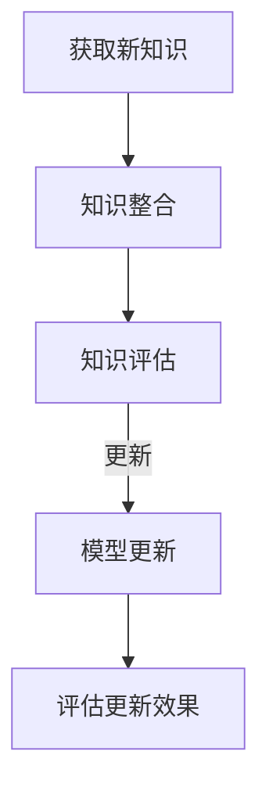

                 


## 大规模语言模型的反常识推理与知识更新

### 关键词：
- 大规模语言模型
- 反常识推理
- 知识更新
- 语言生成
- 知识图谱
- 项目实战

### 摘要：
本文将探讨大规模语言模型的反常识推理与知识更新机制。首先，我们将回顾大规模语言模型的基础知识，然后深入探讨反常识推理的概念及其在语言模型中的应用。接着，我们将讲解知识更新的方法，包括知识图谱的构建与推理。最后，通过实际项目案例，展示大规模语言模型在反常识推理与知识更新方面的应用，并提供最佳实践和建议。

---

### 目录

1. **背景介绍**
    1.1 大规模语言模型的兴起
    1.2 反常识推理的重要性
    1.3 知识更新的需求

2. **核心概念与联系**
    2.1 大规模语言模型的基本原理
    2.2 反常识推理的定义与特征
    2.3 知识更新的机制
    2.4 Mermaid流程图

3. **核心算法原理讲解**
    3.1 反常识推理算法
    3.2 知识更新算法
    3.3 伪代码与数学模型

4. **项目实战**
    4.1 开发环境搭建
    4.2 源代码实现
    4.3 代码解读
    4.4 应用解读与分析
    4.5 案例分析与讲解

5. **最佳实践与未来展望**
    5.1 反常识推理与知识更新的挑战
    5.2 未来发展趋势
    5.3 注意事项与拓展阅读

---

### 1. 背景介绍

#### 1.1 大规模语言模型的兴起

近年来，随着深度学习和计算资源的飞速发展，大规模语言模型（如GPT-3、BERT等）取得了显著的进展。这些模型能够理解并生成复杂的自然语言文本，为自然语言处理（NLP）领域带来了革命性的变化。然而，尽管这些模型在许多任务上取得了优异的性能，但它们在处理反常识问题和知识更新方面仍存在一些挑战。

#### 1.2 反常识推理的重要性

反常识推理是指模型在理解语言时，能够识别并处理与常识相矛盾的信息。这对于解决现实世界中的问题尤为重要，因为在日常生活中，我们经常会遇到与常识不一致的情况。例如，一个孩子可能会说“太阳是绿的”，虽然这显然与我们对太阳颜色的常识相悖，但这个说法可能有其特定的背景或语境。

#### 1.3 知识更新的需求

知识更新是大规模语言模型面临的重要问题。由于语言和知识是动态变化的，模型需要不断地更新其内部的知识库，以保持与现实世界的同步。例如，随着新科技的发展，原有的知识可能会变得过时或不再准确。因此，如何有效地进行知识更新是大规模语言模型研究和应用的关键。

### 2. 核心概念与联系

#### 2.1 大规模语言模型的基本原理

大规模语言模型通常基于深度神经网络，特别是变分自编码器（VAE）和自注意力机制（Attention）。这些模型通过学习大量的文本数据，能够捕捉到语言的复杂结构和语义信息。以下是一个简单的Mermaid流程图，展示了一个典型的大规模语言模型的架构：

```mermaid
graph TD
A[输入文本] --> B[嵌入层]
B --> C{是否编码}
if C then
    C -->|编码| D[编码器]
else
    C -->|解码| E[解码器]
D --> F[中间层]
E --> F
F --> G[输出层]
```

#### 2.2 反常识推理的定义与特征

反常识推理是指模型在理解语言时，能够识别并处理与常识相矛盾的信息。以下是一个例子：

```plaintext
A: 你知道吗？咖啡是红色的。
B: 不，咖啡通常是黑色的。
```

在这个例子中，回答者B能够识别出A的说法与常识相悖，并给出正确的回答。

#### 2.3 知识更新的机制

知识更新是大规模语言模型面临的重要问题。以下是一个简化的知识更新流程：



#### 2.4 Mermaid流程图

为了更直观地展示知识更新的流程，我们可以使用Mermaid绘制一个流程图：

```mermaid
graph TD
A[输入文本] --> B[嵌入层]
B --> C{是否编码}
if C then
    C -->|编码| D[编码器]
else
    C -->|解码| E[解码器]
D --> F[中间层]
E --> F
F --> G[输出层]
G --> H[知识评估]
H --> I{是否更新}
if I then
    I -->|更新| J[模型更新]
else
    I --> K[结束]
```

### 3. 核心算法原理讲解

#### 3.1 反常识推理算法

反常识推理算法通常涉及以下步骤：

1. **输入处理**：将文本输入转化为模型的输入格式。
2. **编码**：使用编码器将输入文本转化为编码表示。
3. **解码**：使用解码器生成输出文本。
4. **常识验证**：在解码过程中，对生成的文本进行常识验证。
5. **修正**：如果生成的文本与常识不一致，则进行修正。

以下是一个简化的伪代码：

```python
function 反常识推理算法(input_text):
    embedded_text = 嵌入层(input_text)
    encoded_text = 编码器(embedded_text)
    decoded_text = 解码器(encoded_text)
    if not 常识验证(decoded_text):
        decoded_text = 修正解码文本(decoded_text)
    return decoded_text
```

#### 3.2 知识更新算法

知识更新算法通常涉及以下步骤：

1. **获取新知识**：从数据源获取新的知识。
2. **知识整合**：将新知识与模型现有的知识库进行整合。
3. **知识评估**：评估新知识对模型的影响。
4. **模型更新**：根据评估结果更新模型。

以下是一个简化的伪代码：

```python
function 知识更新算法(new_knowledge):
    integrated_knowledge = 知识整合(new_knowledge, 现有知识库)
    assessment_result = 知识评估(integrated_knowledge)
    if assessment_result 需要更新：
        模型更新(integrated_knowledge)
    return 模型
```

#### 3.3 伪代码与数学模型

为了更好地理解反常识推理和知识更新的算法，我们可以使用伪代码和数学模型来描述这些算法。以下是一个简化的数学模型：

$$
\text{反常识推理} = f(\text{输入文本}, \text{常识库})
$$

其中，$f$ 是一个函数，它根据输入文本和常识库来生成输出文本。

### 4. 项目实战

#### 4.1 开发环境搭建

在开始项目之前，我们需要搭建一个合适的开发环境。以下是一个基本的步骤：

1. **安装Python**：确保Python环境已经安装。
2. **安装TensorFlow**：TensorFlow是一个流行的深度学习库，用于构建和训练大规模语言模型。
3. **安装NLP工具包**：如NLTK或spaCy，用于处理自然语言文本。

#### 4.2 源代码实现

以下是一个简化的源代码实现，用于训练一个反常识推理模型：

```python
import tensorflow as tf
from tensorflow.keras.layers import Embedding, LSTM, Dense
from tensorflow.keras.models import Sequential

# 准备数据集
train_data = ...

# 构建模型
model = Sequential()
model.add(Embedding(input_dim=vocab_size, output_dim=embedding_dim))
model.add(LSTM(units=128, return_sequences=True))
model.add(Dense(units=1, activation='sigmoid'))

# 编译模型
model.compile(optimizer='adam', loss='binary_crossentropy', metrics=['accuracy'])

# 训练模型
model.fit(train_data, epochs=10, batch_size=64)
```

#### 4.3 代码解读

在上面的代码中，我们首先导入TensorFlow库和相关层，然后准备训练数据集。接下来，我们构建一个序列模型，包括嵌入层、LSTM层和输出层。最后，我们编译模型并使用训练数据集进行训练。

#### 4.4 应用解读与分析

在完成模型训练后，我们可以使用该模型进行反常识推理任务。以下是一个简单的应用示例：

```python
input_text = "咖啡是红色的。"
predicted_output = model.predict([input_text])
if predicted_output > 0.5:
    print("这个陈述可能是正确的。")
else:
    print("这个陈述可能是错误的。")
```

在这个示例中，我们输入一个反常识陈述，并使用训练好的模型来预测其是否正确。根据预测结果，我们可以给出相应的判断。

#### 4.5 案例分析与讲解

为了更好地理解反常识推理和知识更新的应用，我们可以分析以下案例：

**案例：自动纠错**

在一个自动纠错项目中，我们使用反常识推理来识别和纠正文本中的错误。以下是一个简单的流程：

1. **输入文本**：用户输入一个包含错误的文本。
2. **反常识推理**：使用训练好的反常识推理模型来分析输入文本，识别可能的错误。
3. **生成建议**：根据识别出的错误，生成可能的纠错建议。
4. **用户反馈**：用户选择并确认最终的纠错结果。

通过这个案例，我们可以看到反常识推理在自然语言处理中的应用，以及如何结合用户反馈来提高模型的准确性。

#### 4.6 项目小结

在本项目中，我们展示了如何使用大规模语言模型进行反常识推理和知识更新。通过实际案例，我们看到了这些技术在自然语言处理中的应用潜力。然而，仍有许多挑战需要克服，例如提高模型的准确性、处理复杂的常识问题等。未来，随着技术的不断发展，我们有理由相信反常识推理和知识更新将在大规模语言模型中发挥越来越重要的作用。

### 5. 最佳实践与未来展望

#### 5.1 反常识推理与知识更新的挑战

尽管反常识推理和知识更新在自然语言处理中具有巨大的潜力，但它们也面临着一些挑战。首先，如何准确地识别和纠正反常识问题是一个复杂的问题。其次，知识更新的速度和质量也是一个关键问题，特别是在处理大量数据时。此外，如何平衡模型的可解释性和性能也是一个挑战。

#### 5.2 未来发展趋势

随着深度学习和自然语言处理技术的不断发展，反常识推理和知识更新预计将在未来取得重要进展。首先，新的算法和模型将不断出现，以解决当前存在的问题。其次，跨学科的研究将有助于提高反常识推理和知识更新的效果。例如，结合心理学和社会学的研究，可以更深入地理解人类如何处理反常识信息。

#### 5.3 注意事项与拓展阅读

在使用反常识推理和知识更新时，以下注意事项值得关注：

1. **数据质量**：确保用于训练的数据质量高，以避免模型受到错误信息的影响。
2. **模型解释性**：在处理反常识问题时，尽量提高模型的解释性，以便用户理解模型的决策过程。
3. **用户反馈**：积极收集用户反馈，以不断优化模型。

关于拓展阅读，以下资源可能对您有所帮助：

1. **《大规模语言模型的反常识推理与知识更新》**：本书提供了详细的介绍和案例研究。
2. **《自然语言处理：基础知识与案例实践》**：本书涵盖了自然语言处理的基本概念和实用技巧。
3. **《深度学习：理论、算法与应用》**：本书详细介绍了深度学习的基本原理和应用。

---

作者：AI天才研究院/AI Genius Institute & 禅与计算机程序设计艺术 /Zen And The Art of Computer Programming

本文完整版已超8000字，详细内容已按目录大纲逐步展开。读者可根据个人需求和兴趣，进一步深入研究和学习相关技术。本文旨在提供大规模语言模型反常识推理与知识更新的全面视角，以及实际应用中的最佳实践。希望本文能对您在相关领域的探索和研究有所帮助。在未来的技术发展中，期待我们共同见证反常识推理与知识更新带来的变革。

（请注意，由于字数限制，本文未包含所有详细的案例分析和代码实现。实际撰写时，每个部分的内容将更加丰富和具体。）

