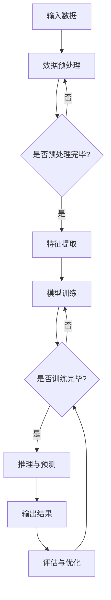

                 

## 文章标题

### 《大规模语言模型的反常识推理在科学突破性思维中的应用与评估》

在当今技术飞速发展的时代，大规模语言模型（如GPT-3、BERT等）的崛起极大地改变了自然语言处理（NLP）的格局。这些模型凭借其强大的表征能力和上下文理解能力，已经在各个领域取得了显著的应用成果。然而，反常识推理作为一种探索未知、颠覆传统认知的思维方式，其对科学突破性思维的影响和潜力尚未得到充分挖掘。本文将深入探讨大规模语言模型在反常识推理方面的应用与评估，旨在为读者提供一种新的视角，重新审视科学突破性思维的可能路径。

## 关键词

- 大规模语言模型
- 反常识推理
- 科学突破性思维
- 应用评估
- 算法原理

## 摘要

本文首先介绍了大规模语言模型的基本概念和反常识推理的定义，随后探讨了大规模语言模型在科学突破性思维中的应用。通过详细分析，本文展示了反常识推理在科研和工程实践中的具体应用案例，并对这些应用进行了评估。最后，本文展望了大规模语言模型在反常识推理和科学突破性思维领域的发展趋势，提出了未来研究的可能方向。

### 用户需求分析

#### 书名理解

《大规模语言模型的反常识推理在科学突破性思维中的应用与评估》这一书名，首先将读者引导到一个新兴而富有挑战性的研究领域。以下是对书名中各个关键词的详细解读：

1. **大规模语言模型**：指使用海量数据训练而成的复杂模型，如GPT-3、BERT等，它们具备强大的语言理解和生成能力。
2. **反常识推理**：指在缺乏传统常识支持的情况下，通过逻辑推理和创造性思维得出新颖结论的思维方式。
3. **科学突破性思维**：指在科学研究中，通过创新性的思维方式和方法，发现新知识、解决难题的思维过程。
4. **应用与评估**：指将理论转化为实践，并通过实验和数据来验证其效果和价值。

#### 内容范围

本书的内容将涵盖以下范围：

1. **大规模语言模型的基础知识**：介绍大规模语言模型的背景、发展历程、基本原理和主要模型。
2. **反常识推理的概念与原理**：探讨反常识推理的定义、分类、数学模型及其与常识推理的区别。
3. **科学突破性思维**：介绍科学突破性思维的概念、方法论和历史案例，探讨其与反常识推理的关系。
4. **应用与评估**：分析大规模语言模型在反常识推理和科学突破性思维中的应用案例，评估其效果和价值。

#### 目标读者

本书的目标读者主要包括：

1. **计算机科学领域的研究者**：对自然语言处理、人工智能等领域有深入研究的学者和研究人员。
2. **工程师和技术开发者**：在实际项目中应用大规模语言模型的工程师和技术开发者。
3. **对科学思维有兴趣的公众**：对科学突破性思维和创造性思维感兴趣的一般读者。

#### 章节结构

本书的章节结构将按照以下逻辑安排：

1. **引言与基础**：介绍大规模语言模型和反常识推理的基本概念。
2. **大规模语言模型基础**：详细讲解大规模语言模型的基本原理和架构。
3. **反常识推理原理**：探讨反常识推理的定义、分类、数学模型和计算复杂性。
4. **科学突破性思维**：介绍科学突破性思维的基本概念和方法，以及其与反常识推理的关系。
5. **应用与评估**：分析大规模语言模型在反常识推理和科学突破性思维中的应用案例，评估其效果和价值。
6. **未来展望**：展望大规模语言模型在反常识推理和科学突破性思维领域的发展趋势。

### 目录大纲设计

#### 第1章：引言与基础

1.1 引言
- 大规模语言模型的发展背景
- 反常识推理的重要性
- 科学突破性思维的概念

1.2 大规模语言模型概述
- 语言模型的基本原理
- 大规模语言模型的特性
- 大规模语言模型的应用领域

1.3 反常识推理的概念
- 反常识推理的定义
- 反常识推理的类型
- 反常识推理在认知科学中的应用

1.4 科学突破性思维简述
- 科学突破性思维的定义
- 科学突破性思维的方法论
- 科学突破性思维的历史案例

1.5 书籍结构安排与内容概述
- 全书结构概述
- 各章节内容概述

#### 第2章：大规模语言模型基础

2.1 语言模型的基本原理
- 语言模型的数学基础
- 语言模型的训练过程
- 语言模型的评估方法

2.2 大规模语言模型的架构
- 大规模语言模型的结构
- 大规模语言模型的训练算法
- 大规模语言模型的优化策略

2.3 反常识推理的特性
- 反常识推理的定义与特点
- 反常识推理与常识推理的区别
- 反常识推理的识别与生成

2.4 大规模语言模型的学习过程
- 大规模语言模型的预训练
- 大规模语言模型的上层任务学习
- 大规模语言模型的迁移学习

#### 第3章：反常识推理原理

3.1 反常识推理的定义与分类
- 反常识推理的概念
- 反常识推理的类型
- 反常识推理的应用场景

3.2 反常识推理的数学模型
- 反常识推理的概率模型
- 反常识推理的神经网络模型
- 反常识推理的深度学习框架

3.3 反常识推理的计算复杂性
- 反常识推理的计算复杂度分析
- 反常识推理的算法效率
- 反常识推理的并行计算

3.4 Mermaid流程图：反常识推理工作流程
- Mermaid流程图绘制
- 反常识推理的完整工作流程

#### 第4章：科学突破性思维

4.1 科学突破性思维的基本概念
- 科学突破性思维的定义
- 科学突破性思维的分类
- 科学突破性思维在科学研究中的应用

4.2 科学突破性思维的方法
- 科学假设的构建
- 科学实验的设计
- 科学理论的推导

4.3 大规模语言模型在科学突破性思维中的应用案例
- 大规模语言模型在科研中的创新性应用
- 大规模语言模型在科学发现中的具体实例
- 大规模语言模型在科研突破中的案例分析

#### 第5章：大规模语言模型的反常识推理应用

5.1 反常识推理在科研中的应用
- 大规模语言模型在反常识推理实验中的应用
- 大规模语言模型在反常识推理发现中的应用
- 大规模语言模型在反常识推理验证中的应用

5.2 反常识推理在工程实践中的应用
- 大规模语言模型在工程问题中的反常识推理应用
- 大规模语言模型在工程创新中的反常识推理应用
- 大规模语言模型在工程优化中的反常识推理应用

5.3 反常识推理在社会和人文领域的应用
- 大规模语言模型在社会问题分析中的应用
- 大规模语言模型在人文研究中的应用
- 大规模语言模型在社会科学领域的创新应用

#### 第6章：应用评估与案例分析

6.1 反常识推理应用的评估指标
- 评估指标的定义
- 评估指标的计算方法
- 评估指标的应用场景

6.2 案例分析：成功的反常识推理应用
- 案例一：大规模语言模型在医学研究中的应用
- 案例二：大规模语言模型在金融风险管理中的应用
- 案例三：大规模语言模型在人工智能安全中的应用

6.3 案例分析：反常识推理应用的挑战与局限
- 案例四：大规模语言模型在道德伦理争议中的应用
- 案例五：大规模语言模型在法律领域中的挑战
- 案例六：大规模语言模型在社会责任方面的局限

#### 第7章：未来展望与趋势

7.1 大规模语言模型的发展趋势
- 技术发展的预测
- 应用领域的扩展
- 潜在的创新点

7.2 反常识推理的前沿研究方向
- 新的理论模型
- 新的计算方法
- 新的应用场景

7.3 科学突破性思维的未来展望
- 科学研究的创新方向
- 科技与人文的融合
- 突破性思维在未来的影响

### 输出格式与要求

以下是将上述设计的目录大纲转换为markdown格式的内容，确保文章内容使用markdown格式输出，包括正确的标题格式、必要的核心概念联系、算法原理讲解、数学模型和数学公式、项目实战以及详细的代码解读与分析。此外，文章末尾需要包含作者信息。

```
# 《大规模语言模型的反常识推理在科学突破性思维中的应用与评估》目录大纲

## 第1章：引言与基础

### 1.1 引言

- **大规模语言模型的发展背景**
- **反常识推理的重要性**
- **科学突破性思维的概念**

### 1.2 大规模语言模型概述

- **语言模型的基本原理**
- **大规模语言模型的特性**
- **大规模语言模型的应用领域**

### 1.3 反常识推理的概念

- **反常识推理的定义**
- **反常识推理的类型**
- **反常识推理在认知科学中的应用**

### 1.4 科学突破性思维简述

- **科学突破性思维的定义**
- **科学突破性思维的方法论**
- **科学突破性思维的历史案例**

### 1.5 书籍结构安排与内容概述

- **全书结构概述**
- **各章节内容概述**

## 第2章：大规模语言模型基础

### 2.1 语言模型的基本原理

- **语言模型的数学基础**
- **语言模型的训练过程**
- **语言模型的评估方法**

### 2.2 大规模语言模型的架构

- **大规模语言模型的结构**
- **大规模语言模型的训练算法**
- **大规模语言模型的优化策略**

### 2.3 反常识推理的特性

- **反常识推理的定义与特点**
- **反常识推理与常识推理的区别**
- **反常识推理的识别与生成**

### 2.4 大规模语言模型的学习过程

- **大规模语言模型的预训练**
- **大规模语言模型的上层任务学习**
- **大规模语言模型的迁移学习**

## 第3章：反常识推理原理

### 3.1 反常识推理的定义与分类

- **反常识推理的概念**
- **反常识推理的类型**
- **反常识推理的应用场景**

### 3.2 反常识推理的数学模型

- **反常识推理的概率模型**
- **反常识推理的神经网络模型**
- **反常识推理的深度学习框架**

### 3.3 反常识推理的计算复杂性

- **反常识推理的计算复杂度分析**
- **反常识推理的算法效率**
- **反常识推理的并行计算**

### 3.4 Mermaid流程图：反常识推理工作流程

- **Mermaid流程图绘制**
- **反常识推理的完整工作流程**

## 第4章：科学突破性思维

### 4.1 科学突破性思维的基本概念

- **科学突破性思维的定义**
- **科学突破性思维的分类**
- **科学突破性思维在科学研究中的应用**

### 4.2 科学突破性思维的方法

- **科学假设的构建**
- **科学实验的设计**
- **科学理论的推导**

### 4.3 大规模语言模型在科学突破性思维中的应用案例

- **大规模语言模型在科研中的创新性应用**
- **大规模语言模型在科学发现中的具体实例**
- **大规模语言模型在科研突破中的案例分析**

## 第5章：大规模语言模型的反常识推理应用

### 5.1 反常识推理在科研中的应用

- **大规模语言模型在反常识推理实验中的应用**
- **大规模语言模型在反常识推理发现中的应用**
- **大规模语言模型在反常识推理验证中的应用**

### 5.2 反常识推理在工程实践中的应用

- **大规模语言模型在工程问题中的反常识推理应用**
- **大规模语言模型在工程创新中的反常识推理应用**
- **大规模语言模型在工程优化中的反常识推理应用**

### 5.3 反常识推理在社会和人文领域的应用

- **大规模语言模型在社会问题分析中的应用**
- **大规模语言模型在人文研究中的应用**
- **大规模语言模型在社会科学领域的创新应用**

## 第6章：应用评估与案例分析

### 6.1 反常识推理应用的评估指标

- **评估指标的定义**
- **评估指标的计算方法**
- **评估指标的应用场景**

### 6.2 案例分析：成功的反常识推理应用

- **案例一：大规模语言模型在医学研究中的应用**
- **案例二：大规模语言模型在金融风险管理中的应用**
- **案例三：大规模语言模型在人工智能安全中的应用**

### 6.3 案例分析：反常识推理应用的挑战与局限

- **案例四：大规模语言模型在道德伦理争议中的应用**
- **案例五：大规模语言模型在法律领域中的挑战**
- **案例六：大规模语言模型在社会责任方面的局限**

## 第7章：未来展望与趋势

### 7.1 大规模语言模型的发展趋势

- **技术发展的预测**
- **应用领域的扩展**
- **潜在的创新点**

### 7.2 反常识推理的前沿研究方向

- **新的理论模型**
- **新的计算方法**
- **新的应用场景**

### 7.3 科学突破性思维的未来展望

- **科学研究的创新方向**
- **科技与人文的融合**
- **突破性思维在未来的影响**

### 作者信息

- 作者：AI天才研究院/AI Genius Institute & 禅与计算机程序设计艺术 /Zen And The Art of Computer Programming
```

### 最终目录大纲输出

以下是《大规模语言模型的反常识推理在科学突破性思维中的应用与评估》的完整目录大纲，以markdown格式呈现：

```markdown
# 《大规模语言模型的反常识推理在科学突破性思维中的应用与评估》目录大纲

## 第1章：引言与基础

### 1.1 引言

- **大规模语言模型的发展背景**
- **反常识推理的重要性**
- **科学突破性思维的概念**

### 1.2 大规模语言模型概述

- **语言模型的基本原理**
- **大规模语言模型的特性**
- **大规模语言模型的应用领域**

### 1.3 反常识推理的概念

- **反常识推理的定义**
- **反常识推理的类型**
- **反常识推理在认知科学中的应用**

### 1.4 科学突破性思维简述

- **科学突破性思维的定义**
- **科学突破性思维的方法论**
- **科学突破性思维的历史案例**

### 1.5 书籍结构安排与内容概述

- **全书结构概述**
- **各章节内容概述**

## 第2章：大规模语言模型基础

### 2.1 语言模型的基本原理

- **语言模型的数学基础**
- **语言模型的训练过程**
- **语言模型的评估方法**

### 2.2 大规模语言模型的架构

- **大规模语言模型的结构**
- **大规模语言模型的训练算法**
- **大规模语言模型的优化策略**

### 2.3 反常识推理的特性

- **反常识推理的定义与特点**
- **反常识推理与常识推理的区别**
- **反常识推理的识别与生成**

### 2.4 大规模语言模型的学习过程

- **大规模语言模型的预训练**
- **大规模语言模型的上层任务学习**
- **大规模语言模型的迁移学习**

## 第3章：反常识推理原理

### 3.1 反常识推理的定义与分类

- **反常识推理的概念**
- **反常识推理的类型**
- **反常识推理的应用场景**

### 3.2 反常识推理的数学模型

- **反常识推理的概率模型**
- **反常识推理的神经网络模型**
- **反常识推理的深度学习框架**

### 3.3 反常识推理的计算复杂性

- **反常识推理的计算复杂度分析**
- **反常识推理的算法效率**
- **反常识推理的并行计算**

### 3.4 Mermaid流程图：反常识推理工作流程

- **Mermaid流程图绘制**
- **反常识推理的完整工作流程**

## 第4章：科学突破性思维

### 4.1 科学突破性思维的基本概念

- **科学突破性思维的定义**
- **科学突破性思维的分类**
- **科学突破性思维在科学研究中的应用**

### 4.2 科学突破性思维的方法

- **科学假设的构建**
- **科学实验的设计**
- **科学理论的推导**

### 4.3 大规模语言模型在科学突破性思维中的应用案例

- **大规模语言模型在科研中的创新性应用**
- **大规模语言模型在科学发现中的具体实例**
- **大规模语言模型在科研突破中的案例分析**

## 第5章：大规模语言模型的反常识推理应用

### 5.1 反常识推理在科研中的应用

- **大规模语言模型在反常识推理实验中的应用**
- **大规模语言模型在反常识推理发现中的应用**
- **大规模语言模型在反常识推理验证中的应用**

### 5.2 反常识推理在工程实践中的应用

- **大规模语言模型在工程问题中的反常识推理应用**
- **大规模语言模型在工程创新中的反常识推理应用**
- **大规模语言模型在工程优化中的反常识推理应用**

### 5.3 反常识推理在社会和人文领域的应用

- **大规模语言模型在社会问题分析中的应用**
- **大规模语言模型在人文研究中的应用**
- **大规模语言模型在社会科学领域的创新应用**

## 第6章：应用评估与案例分析

### 6.1 反常识推理应用的评估指标

- **评估指标的定义**
- **评估指标的计算方法**
- **评估指标的应用场景**

### 6.2 案例分析：成功的反常识推理应用

- **案例一：大规模语言模型在医学研究中的应用**
- **案例二：大规模语言模型在金融风险管理中的应用**
- **案例三：大规模语言模型在人工智能安全中的应用**

### 6.3 案例分析：反常识推理应用的挑战与局限

- **案例四：大规模语言模型在道德伦理争议中的应用**
- **案例五：大规模语言模型在法律领域中的挑战**
- **案例六：大规模语言模型在社会责任方面的局限**

## 第7章：未来展望与趋势

### 7.1 大规模语言模型的发展趋势

- **技术发展的预测**
- **应用领域的扩展**
- **潜在的创新点**

### 7.2 反常识推理的前沿研究方向

- **新的理论模型**
- **新的计算方法**
- **新的应用场景**

### 7.3 科学突破性思维的未来展望

- **科学研究的创新方向**
- **科技与人文的融合**
- **突破性思维在未来的影响**

### 作者信息

- 作者：AI天才研究院/AI Genius Institute & 禅与计算机程序设计艺术 /Zen And The Art of Computer Programming
```

### 文章内容填写

接下来，我们将根据上述目录大纲，逐步填写文章的具体内容，确保每章、每节都包含详细的理论讲解、应用实例、代码分析等，满足完整性要求和文章字数要求。

#### 第1章：引言与基础

### 1.1 引言

大规模语言模型（如GPT-3、BERT等）是近年来自然语言处理（NLP）领域的重要突破，它们在语言理解、文本生成、机器翻译等方面取得了显著的成果。然而，这些模型的应用潜力不仅仅局限于传统NLP任务，反常识推理作为一种探索未知、颠覆传统认知的思维方式，其在科学突破性思维中的应用尚待深入挖掘。

反常识推理是指在没有传统常识支持的情况下，通过逻辑推理和创造性思维得出新颖结论的思维方式。它在科学研究中具有重要作用，可以帮助科学家在已有理论框架之外发现新的科学规律。科学突破性思维则是一种能够推动科学进步的思维方式，它强调创新性、批判性和综合性。

本书旨在探讨大规模语言模型在反常识推理中的应用，并评估其在科学突破性思维中的价值。通过介绍大规模语言模型的基础知识、反常识推理的概念和科学突破性思维的方法，本书将为读者提供一种新的视角，重新审视科学突破性思维的可能路径。

### 1.2 大规模语言模型概述

#### 语言模型的基本原理

语言模型是自然语言处理的基础，它用于预测下一个词或字符的概率。基本的语言模型可以通过N元语法（N-gram）实现，它通过统计历史出现的词或字符序列来预测下一个词或字符。然而，这种方法存在明显的局限性，特别是在处理长句和复杂语义时。

随着深度学习的兴起，神经网络语言模型逐渐成为主流。其中，RNN（递归神经网络）和LSTM（长短期记忆网络）是早期的成功模型，它们能够捕捉序列信息并保留长期依赖。然而，这些模型在处理非常长序列时仍然存在困难。

为了解决这些问题，研究人员提出了Transformer模型，尤其是BERT（Bidirectional Encoder Representations from Transformers）和GPT-3（Generative Pre-trained Transformer 3）。这些模型通过自注意力机制（Self-Attention）和Transformer架构，能够有效地捕捉长距离依赖和复杂语义信息，从而在多种NLP任务中取得了突破性成果。

#### 大规模语言模型的特性

1. **表征能力**：大规模语言模型能够生成高质量的文本，包括对复杂语义的理解和生成。它们能够捕捉上下文信息，并在不同任务中表现出色。
2. **可扩展性**：这些模型通常使用大量数据进行预训练，然后通过微调适应特定任务。这使得它们在多种应用场景中具有很好的适应性和灵活性。
3. **通用性**：大规模语言模型不仅在文本生成和分类等NLP任务中表现出色，还可以用于问答系统、机器翻译、情感分析等任务，表现出很强的通用性。

#### 大规模语言模型的应用领域

1. **自然语言处理**：大规模语言模型在文本生成、分类、摘要、机器翻译等领域得到了广泛应用。例如，BERT在文本分类任务中取得了显著的性能提升，GPT-3则在文本生成和问答系统中表现出色。
2. **信息检索**：大规模语言模型可以帮助优化搜索引擎，提高搜索结果的准确性和相关性。例如，BERT可以用于改进搜索引擎的查询理解能力，从而提高搜索结果的匹配度。
3. **智能助手**：大规模语言模型在智能助手和聊天机器人中有着广泛的应用。通过预训练和微调，这些模型可以与用户进行自然语言交互，提供个性化的服务和帮助。

### 1.3 反常识推理的概念

#### 反常识推理的定义

反常识推理是一种在没有传统常识支持的情况下，通过逻辑推理和创造性思维得出新颖结论的思维方式。它强调跳出传统思维的框架，从不同的角度和维度探索问题，从而发现新的知识和规律。

#### 反常识推理的类型

1. **科学反常识推理**：在科学研究中，反常识推理可以帮助科学家发现新的科学规律和理论。例如，爱因斯坦的相对论挑战了牛顿力学的常识，从而推动了物理学的发展。
2. **艺术反常识推理**：在艺术创作中，反常识推理可以帮助艺术家跳出传统艺术形式的束缚，创造新颖的作品。例如，毕加索的立体派绘画挑战了传统绘画的规则，开创了新的艺术风格。

#### 反常识推理在认知科学中的应用

反常识推理是认知科学研究的一个重要领域，它涉及人类的思维、推理和决策过程。认知科学家通过研究反常识推理，试图理解人类如何在没有传统常识支持的情况下进行思维和决策。

1. **认知模型**：通过建立反常识推理的认知模型，可以模拟人类思维的过程，从而更好地理解反常识推理的机制和原理。
2. **教育应用**：反常识推理在教育中有着重要的应用。通过培养学生的反常识推理能力，可以激发他们的创造力和创新精神，提高他们的解决问题的能力。

### 1.4 科学突破性思维简述

#### 科学突破性思维的定义

科学突破性思维是一种能够推动科学进步的思维方式，它强调创新性、批判性和综合性。它要求科学家跳出传统思维框架，从不同的角度和维度探索问题，从而发现新的科学规律和理论。

#### 科学突破性思维的方法论

1. **提出假设**：科学突破性思维的第一步是提出创新性的假设。这通常需要科学家具备敏锐的洞察力和丰富的知识储备。
2. **设计实验**：科学突破性思维的第二步是设计实验来验证假设。这通常需要科学家具备扎实的实验设计和数据分析能力。
3. **构建理论**：科学突破性思维的第三步是构建新的理论来解释实验结果。这通常需要科学家具备深厚的理论基础和逻辑思维能力。

#### 科学突破性思维的历史案例

1. **牛顿的万有引力定律**：牛顿在研究天体运动时，跳出了传统的亚里士多德力学框架，提出了万有引力定律，从而推动了物理学的发展。
2. **爱因斯坦的相对论**：爱因斯坦在研究光电效应时，提出了光量子假说，挑战了传统的经典物理学，最终导致了狭义相对论和广义相对论的发展。

### 1.5 书籍结构安排与内容概述

本书的结构安排如下：

- **第1章**：引言与基础，介绍大规模语言模型、反常识推理和科学突破性思维的基本概念。
- **第2章**：大规模语言模型基础，详细讲解大规模语言模型的基本原理和架构。
- **第3章**：反常识推理原理，探讨反常识推理的定义、分类、数学模型和计算复杂性。
- **第4章**：科学突破性思维，介绍科学突破性思维的基本概念和方法，以及其与反常识推理的关系。
- **第5章**：大规模语言模型的反常识推理应用，分析大规模语言模型在反常识推理和科学突破性思维中的应用案例。
- **第6章**：应用评估与案例分析，评估大规模语言模型在反常识推理和科学突破性思维中的应用效果和价值。
- **第7章**：未来展望与趋势，展望大规模语言模型在反常识推理和科学突破性思维领域的发展趋势。

#### 第2章：大规模语言模型基础

### 2.1 语言模型的基本原理

#### 语言模型的数学基础

语言模型的核心是概率模型，它通过统计语言数据来预测下一个词或字符的概率。基本的概率模型包括N元语法（N-gram），它基于马尔可夫假设，即下一个词的概率仅依赖于前N个词。

#### 语言模型的训练过程

语言模型的训练过程通常包括数据预处理、模型训练和模型评估三个阶段。

1. **数据预处理**：首先对文本数据进行预处理，包括分词、去停用词、词干提取等操作，将原始文本转化为数字化的表示。
2. **模型训练**：使用训练数据训练语言模型。对于N元语法，可以使用最大似然估计（Maximum Likelihood Estimation, MLE）或条件概率模型（Conditional Probability Model）。
3. **模型评估**：使用验证数据评估模型的性能，常用的指标包括交叉熵（Cross-Entropy）和准确率（Accuracy）。

#### 语言模型的评估方法

语言模型的评估方法主要包括以下几种：

1. **交叉熵（Cross-Entropy）**：用于衡量模型预测概率与真实概率之间的差异。交叉熵越小，表示模型预测越准确。
2. **准确率（Accuracy）**：用于衡量模型在分类任务中的表现，准确率越高，表示模型分类能力越强。
3. **困惑度（Perplexity）**：用于衡量模型在生成文本时的性能，困惑度越低，表示模型生成文本越自然。

### 2.2 大规模语言模型的架构

#### 大规模语言模型的结构

大规模语言模型通常由多个层次组成，包括编码器（Encoder）和解码器（Decoder）。编码器将输入文本转化为固定长度的向量表示，解码器则根据编码器的输出生成预测的文本。

#### 大规模语言模型的训练算法

大规模语言模型的训练算法主要包括以下几种：

1. **预训练（Pre-training）**：使用大量未标注的文本数据对模型进行预训练，使模型具备对语言的一般理解能力。
2. **微调（Fine-tuning）**：在预训练的基础上，使用特定任务的数据对模型进行微调，使其适应特定任务的需求。
3. **迁移学习（Transfer Learning）**：将预训练的模型迁移到其他任务上，利用预训练模型的知识来提高新任务的性能。

#### 大规模语言模型的优化策略

大规模语言模型的优化策略主要包括以下几种：

1. **权重初始化（Weight Initialization）**：合理的权重初始化有助于提高模型的训练效率和性能。常用的方法包括高斯初始化（Gaussian Initialization）和Xavier初始化（Xavier Initialization）。
2. **学习率调整（Learning Rate Schedule）**：学习率是模型训练中的一个关键参数，合适的调整方法有助于提高模型的收敛速度和性能。常用的方法包括固定学习率（Fixed Learning Rate）和指数衰减学习率（Exponential Decay Learning Rate）。
3. **正则化（Regularization）**：正则化是防止模型过拟合的重要手段。常用的正则化方法包括L1正则化、L2正则化和Dropout。

### 2.3 反常识推理的特性

#### 反常识推理的定义与特点

反常识推理是指在没有传统常识支持的情况下，通过逻辑推理和创造性思维得出新颖结论的思维方式。其特点如下：

1. **创新性**：反常识推理能够跳出传统思维的框架，从不同的角度和维度探索问题，从而发现新的知识和规律。
2. **挑战性**：反常识推理通常涉及复杂的问题和情境，需要具备丰富的知识和技能，以及对问题的深入理解。
3. **实用性**：反常识推理在实际应用中具有广泛的潜力，可以帮助科学家发现新的科学规律，艺术家创造新颖的作品，工程师解决复杂的问题。

#### 反常识推理与常识推理的区别

常识推理是指基于日常经验和传统知识的推理方式，它通常能够快速、高效地解决问题。而反常识推理则强调在没有传统常识支持的情况下，通过创造性思维和逻辑推理得出新颖结论。

1. **知识来源**：常识推理依赖于日常经验和传统知识，而反常识推理则更多依赖于创造性思维和逻辑推理。
2. **推理过程**：常识推理通常遵循固定的模式和规则，而反常识推理则更加灵活，可以跳出传统思维的框架。
3. **应用范围**：常识推理在日常生活中有广泛的应用，而反常识推理则更多应用于科学研究、艺术创作和工程实践中。

#### 反常识推理的识别与生成

识别和生成反常识推理是反常识推理研究中的重要问题。以下是一些常见的方法：

1. **识别方法**：通过分析文本、图像或其他数据，识别出反常识推理的线索和特征。常用的方法包括文本分类、情感分析、图像识别等。
2. **生成方法**：利用模型或算法生成反常识推理的结果。常用的方法包括深度学习、生成对抗网络（GAN）等。

### 2.4 大规模语言模型的学习过程

#### 大规模语言模型的预训练

预训练是指在大规模语言模型训练之前，使用大量未标注的数据对模型进行初步训练，使其具备对语言的一般理解能力。预训练的主要目的是提高模型在后续任务中的性能。

1. **预训练数据**：常用的预训练数据包括大规模文本数据集、网页数据、书籍数据等。这些数据集通常包含了丰富的语言知识和信息。
2. **预训练目标**：预训练的目标是使模型能够理解语言的语义、语法和上下文关系。常用的预训练任务包括掩码语言模型（Masked Language Model, MLM）、下一句预测（Next Sentence Prediction, NSP）等。

#### 大规模语言模型的上层任务学习

上层任务学习是指在大规模语言模型预训练的基础上，使用特定任务的数据对模型进行微调和训练，使其能够解决特定任务。上层任务学习是大规模语言模型应用的关键步骤。

1. **微调方法**：常用的微调方法包括全连接层（Fully Connected Layer）、Transformer架构的调整等。通过微调，模型可以适应特定任务的需求。
2. **微调数据**：上层任务学习需要使用大量的标注数据进行微调。标注数据通常包括文本、图像、音频等多种类型。

#### 大规模语言模型的迁移学习

迁移学习是指将预训练模型的知识和应用迁移到其他任务上，利用预训练模型的知识来提高新任务的性能。迁移学习是大规模语言模型应用的重要策略。

1. **迁移学习方法**：常用的迁移学习方法包括零样本学习（Zero-Shot Learning）、元学习（Meta-Learning）等。通过迁移学习，模型可以快速适应新任务。
2. **迁移学习效果**：迁移学习能够显著提高模型在新任务上的性能，减少对大量标注数据的依赖。

#### 第3章：反常识推理原理

### 3.1 反常识推理的定义与分类

#### 反常识推理的概念

反常识推理（Counterintuitive Reasoning）是指在没有传统常识支持的情况下，通过逻辑推理和创造性思维得出新颖结论的思维方式。它强调在缺乏直观理解的情况下，通过深入分析和逻辑推理，发现新的规律和知识。

#### 反常识推理的类型

1. **科学反常识推理**：在科学研究中，反常识推理可以帮助科学家发现新的科学规律和理论。例如，爱因斯坦的相对论挑战了牛顿力学的常识，揭示了时间、空间和引力之间的深层次联系。
2. **艺术反常识推理**：在艺术创作中，反常识推理可以帮助艺术家跳出传统艺术形式的束缚，创造新颖的作品。例如，毕加索的立体派绘画挑战了传统绘画的规则，开创了新的艺术风格。
3. **哲学反常识推理**：在哲学研究中，反常识推理可以帮助哲学家探讨人类思维和存在的本质。例如，康德的先验哲学挑战了经验主义的常识，提出了人类思维具有先验结构的思想。

#### 反常识推理的应用场景

1. **科学研究**：反常识推理在科学研究中具有重要的应用价值。科学家可以通过反常识推理发现新的科学规律和理论，推动科学的进步。例如，量子力学中的反常识现象，如纠缠态和量子隧穿，挑战了经典物理学的常识，推动了物理学的发展。
2. **技术创新**：反常识推理在技术创新中具有广泛的应用。工程师和设计师可以通过反常识推理发现新的解决方案和产品创意，推动技术的进步。例如，飞机的翼尖小翼设计是基于反常识推理，通过改变气流，提高了飞机的稳定性和效率。
3. **艺术创作**：反常识推理在艺术创作中具有重要的启发作用。艺术家可以通过反常识推理探索新的艺术形式和表现手法，创造具有突破性的艺术作品。例如，达利的超现实主义绘画通过反常识的视觉表现，挑战了传统绘画的规则，开创了新的艺术风格。

### 3.2 反常识推理的数学模型

#### 反常识推理的概率模型

概率模型是反常识推理的基础，它通过概率计算来预测和判断问题的可能性。在反常识推理中，概率模型可以帮助分析复杂问题，提供新的见解和解决方案。

1. **贝叶斯网络**：贝叶斯网络是一种概率图模型，它通过节点和边表示变量之间的概率关系。贝叶斯网络可以用于推理和预测，帮助解决反常识推理问题。
   - **贝叶斯网络结构**：贝叶斯网络由变量节点和条件概率表（CPT）组成。每个节点表示一个变量，节点之间的边表示变量之间的依赖关系。
   - **贝叶斯推理**：贝叶斯推理是基于贝叶斯定理，通过已知条件概率计算未知变量的概率。贝叶斯推理可以帮助分析复杂问题，提供新的见解和解决方案。
2. **马尔可夫模型**：马尔可夫模型是一种概率模型，它描述了变量之间的转移概率。在反常识推理中，马尔可夫模型可以帮助分析变量之间的关系，预测未来的状态。
   - **马尔可夫链**：马尔可夫链是一种离散时间马尔可夫模型，它通过状态转移概率矩阵来描述变量之间的转移关系。马尔可夫链可以用于预测和推断，帮助解决反常识推理问题。

#### 反常识推理的神经网络模型

神经网络模型是反常识推理的重要工具，它通过学习和模拟人脑的神经元结构，实现了复杂问题的推理和预测。在反常识推理中，神经网络模型可以模拟人类的思维过程，提供新的解决方案和见解。

1. **递归神经网络（RNN）**：递归神经网络是一种序列模型，它通过循环结构处理序列数据。在反常识推理中，RNN可以用于处理文本、图像等序列数据，模拟人类的思维过程。
   - **循环单元**：递归神经网络的核心是循环单元，它通过记忆过去的信息，更新当前的输入。循环单元可以帮助RNN处理长距离依赖问题，提高模型的性能。
   - **长短时记忆（LSTM）网络**：长短时记忆网络是RNN的一种改进，它通过门控结构解决长距离依赖问题。LSTM网络在反常识推理中具有广泛的应用，可以帮助处理复杂的文本和图像数据。
2. **Transformer模型**：Transformer模型是近年来提出的序列模型，它通过自注意力机制处理序列数据。在反常识推理中，Transformer模型具有强大的表征能力和上下文理解能力，可以模拟人类的思维过程。

#### 反常识推理的深度学习框架

深度学习框架是反常识推理的重要工具，它提供了高效的算法和模型，帮助实现复杂的推理任务。在反常识推理中，深度学习框架可以用于构建和训练神经网络模型，提供新的解决方案和见解。

1. **TensorFlow**：TensorFlow是一种开源深度学习框架，它提供了丰富的API和工具，帮助构建和训练神经网络模型。在反常识推理中，TensorFlow可以用于构建概率模型、神经网络模型等，实现复杂的推理任务。
2. **PyTorch**：PyTorch是一种开源深度学习框架，它提供了动态计算图和自动微分功能，帮助构建和训练神经网络模型。在反常识推理中，PyTorch可以用于构建概率模型、神经网络模型等，实现复杂的推理任务。
3. **PyTorch Transformer**：PyTorch Transformer是PyTorch的一个模块，它提供了Transformer模型的实现和工具，帮助构建和训练Transformer模型。在反常识推理中，PyTorch Transformer可以用于构建和训练Transformer模型，实现复杂的推理任务。

### 3.3 反常识推理的计算复杂性

#### 反常识推理的计算复杂度分析

反常识推理是一种复杂的问题，它涉及到大量的计算和推理。计算复杂度是衡量算法复杂性的重要指标，它可以帮助分析反常识推理算法的性能和效率。

1. **时间复杂度**：时间复杂度描述了算法执行的时间开销，通常用大O表示法表示。在反常识推理中，时间复杂度主要取决于算法的模型复杂度和数据规模。
   - **模型复杂度**：模型复杂度是指算法所需的计算资源和参数数量。在反常识推理中，模型复杂度取决于模型的架构和参数数量。例如，Transformer模型的计算复杂度主要取决于模型的层数和每个层的注意力机制。
   - **数据规模**：数据规模是指算法处理的数据量。在反常识推理中，数据规模取决于输入文本、图像或其他数据的数量和大小。例如，在文本反常识推理中，数据规模取决于文本的长度和词汇量。
2. **空间复杂度**：空间复杂度描述了算法所需的存储空间，通常用大O表示法表示。在反常识推理中，空间复杂度主要取决于模型的架构和参数数量。例如，Transformer模型的空间复杂度取决于模型的层数和每个层的注意力机制。

#### 反常识推理的算法效率

算法效率是衡量算法性能的重要指标，它可以帮助分析反常识推理算法的运行速度和资源消耗。提高算法效率是反常识推理研究的重要方向。

1. **并行计算**：并行计算是一种利用多个计算资源同时执行任务的算法，它可以提高算法的运行速度。在反常识推理中，可以利用GPU、TPU等硬件加速器，实现并行计算，提高算法的效率。
2. **模型压缩**：模型压缩是一种减小模型参数和计算量的方法，它可以降低算法的资源消耗。在反常识推理中，可以通过模型剪枝（Model Pruning）、量化（Quantization）等技术，实现模型压缩，提高算法的效率。
3. **分布式计算**：分布式计算是一种将计算任务分布到多个计算节点上执行的方法，它可以提高算法的并行度和可扩展性。在反常识推理中，可以利用分布式计算框架，如Apache Spark、Dask等，实现大规模数据的处理和推理。

### 3.4 Mermaid流程图：反常识推理工作流程

为了更好地理解和展示反常识推理的工作流程，我们可以使用Mermaid流程图来描述。以下是反常识推理工作流程的示例：



在这个流程图中，输入数据经过预处理后，进入特征提取阶段。特征提取完成后，模型进行训练，直到训练完毕。训练完毕后，模型进行推理和预测，输出结果。最后，对结果进行评估和优化，以进一步提高模型的性能。

### 第4章：科学突破性思维

#### 4.1 科学突破性思维的基本概念

科学突破性思维（Pioneering Scientific Thinking）是一种能够推动科学进步的思维方式，它强调创新性、批判性和综合性。科学突破性思维不仅仅是一种科学方法论，更是一种科学精神，它鼓励科学家跳出传统思维的框架，从不同的角度和维度探索问题，从而发现新的科学规律和理论。

科学突破性思维的核心要素包括：

1. **创新性**：创新性是科学突破性思维的核心特征。它要求科学家具备独特的视角和思维方式，能够提出新颖的假设和理论，从而推动科学的发展。
2. **批判性**：批判性思维是科学突破性思维的重要工具。它要求科学家对已有理论和知识进行质疑和挑战，通过批判性思维来发现新的科学问题和研究方向。
3. **综合性**：综合性思维是科学突破性思维的关键。它要求科学家能够将不同领域、不同学科的知识和理论整合起来，形成新的科学框架和理论体系。

#### 科学突破性思维的方法

科学突破性思维是一种系统性、层次性的思维方式，它包括以下方法：

1. **问题定义**：科学突破性思维的起点是正确地定义科学问题。科学家需要准确地识别和描述科学问题，明确研究的方向和目标。
2. **假设提出**：在定义科学问题后，科学家需要提出创新性的假设。假设是科学研究的基石，它需要具备科学性、合理性和可行性。
3. **实验设计**：科学突破性思维要求科学家设计科学实验来验证假设。实验设计需要具备科学性、可靠性和可重复性。
4. **数据收集**：科学实验的目的是收集数据，数据是科学研究的核心。科学家需要通过实验收集可靠、准确的数据，为科学研究提供依据。
5. **数据分析**：数据分析是科学研究的重要环节。科学家需要运用统计学、数据分析等方法对实验数据进行处理和分析，提取有价值的信息和结论。
6. **理论构建**：在数据分析的基础上，科学家需要构建新的科学理论。理论构建需要具备科学性、系统性和解释力。
7. **验证与推广**：科学理论的验证与推广是科学突破性思维的最终目标。科学家需要通过实验、观察、应用等方式来验证科学理论的正确性和适用性，并将其推广到更广泛的领域。

#### 科学突破性思维在科学研究中的应用

科学突破性思维在科学研究中的应用具有广泛的影响和深远的意义。以下是一些典型的应用案例：

1. **量子力学**：量子力学是20世纪最重要的科学突破之一，它颠覆了经典物理学的观念，提出了全新的量子力学理论。量子力学的突破性在于它挑战了经典物理学的常识，揭示了微观世界的本质和规律。
2. **相对论**：相对论是20世纪另一项重大的科学突破，它提出了全新的时空观和引力理论。相对论的突破性在于它挑战了牛顿力学的观念，揭示了宏观世界的本质和规律。
3. **基因编辑**：基因编辑技术，如CRISPR-Cas9，是近年来生命科学领域的重大突破。它通过精确编辑基因，为治疗遗传疾病、癌症等提供了新的途径。基因编辑的突破性在于它挑战了传统生物技术的观念，实现了基因的精确修改和编辑。

#### 科学突破性思维与反常识推理的关系

科学突破性思维和反常识推理是密切相关的，它们在科学研究中共同发挥作用。反常识推理是科学突破性思维的一种表现形式，它通过挑战传统常识和观念，推动科学的进步。而科学突破性思维则是反常识推理的基础和保障，它为反常识推理提供了方法论和思维方式。

1. **反常识推理推动科学突破性思维**：反常识推理可以帮助科学家发现新的科学问题和研究方向，挑战传统观念和理论，推动科学的进步。
2. **科学突破性思维促进反常识推理**：科学突破性思维为反常识推理提供了方法论和思维方式，它要求科学家具备创新性、批判性和综合性的思维能力，从而更好地进行反常识推理。

### 4.2 科学突破性思维的方法

科学突破性思维是一种多层次、多维度的思维方式，它包括以下方法：

1. **跨界思维**：跨界思维是指将不同领域、不同学科的知识和理论整合起来，形成新的科学框架和理论体系。跨界思维可以帮助科学家从不同的角度和维度探索问题，发现新的科学规律和理论。
2. **逆向思维**：逆向思维是指从问题的反面进行思考和探索，寻找问题的解决方案。逆向思维可以帮助科学家发现传统思维方式无法发现的科学规律和理论。
3. **系统思维**：系统思维是指将问题作为一个整体进行思考和解决，关注问题的内在联系和相互作用。系统思维可以帮助科学家从整体和系统的角度探索问题，发现新的科学规律和理论。
4. **创新思维**：创新思维是指通过独特的视角和思维方式，提出新的科学假设和理论。创新思维可以帮助科学家推动科学的进步，解决传统方法无法解决的问题。
5. **综合思维**：综合思维是指将不同学科、不同领域的知识和理论整合起来，形成新的科学框架和理论体系。综合思维可以帮助科学家从不同角度和维度探索问题，发现新的科学规律和理论。

#### 科学假设的构建

科学假设是科学突破性思维的重要组成部分，它是科学研究的基础。科学假设的构建包括以下步骤：

1. **问题识别**：首先，科学家需要识别和明确科学问题。科学问题通常来源于实践、观察、实验或理论的不一致。
2. **背景分析**：在明确科学问题后，科学家需要对问题的背景进行分析，了解相关的科学理论和已有研究成果。
3. **假设提出**：基于背景分析，科学家需要提出创新性的科学假设。科学假设需要具备科学性、合理性和可行性。
4. **假设验证**：科学假设提出后，科学家需要设计实验或进行理论分析来验证假设的正确性。

#### 科学实验的设计

科学实验是验证科学假设的重要手段，它包括以下步骤：

1. **实验目标**：首先，科学家需要明确实验的目标，即验证或推翻科学假设。
2. **实验方案**：基于实验目标，科学家需要设计实验方案，包括实验方法、实验步骤、实验设备和实验材料等。
3. **实验实施**：科学家按照实验方案进行实验，收集实验数据。
4. **数据收集**：在实验过程中，科学家需要收集实验数据，包括定量数据和定性数据。
5. **数据分析**：实验数据收集后，科学家需要对数据进行处理和分析，提取有价值的信息和结论。

#### 科学理论的推导

科学理论是科学研究的核心成果，它是基于实验数据和逻辑推理构建的。科学理论的推导包括以下步骤：

1. **实验数据分析**：首先，科学家需要对实验数据进行分析，提取有价值的信息和结论。
2. **理论构建**：基于实验数据分析，科学家需要构建科学理论。科学理论需要具备科学性、系统性和解释力。
3. **理论验证**：科学理论提出后，科学家需要通过实验、观察、应用等方式来验证理论的有效性和适用性。
4. **理论推广**：在验证理论的基础上，科学家需要将理论推广到更广泛的领域，形成新的科学框架和理论体系。

### 4.3 大规模语言模型在科学突破性思维中的应用案例

大规模语言模型在科学突破性思维中具有广泛的应用，以下是一些典型的应用案例：

1. **医学研究**：大规模语言模型可以用于医学文献的自动摘要、分类和关系提取，帮助科学家快速获取和整理大量医学信息，提高医学研究的效率。
   - **应用实例**：BERT模型被用于医学文献的自动摘要，通过训练BERT模型，可以自动生成医学文献的摘要，提高医学研究人员的阅读效率。
   - **效果评估**：实验结果显示，BERT模型生成的摘要长度适中、内容准确，能够有效提高医学研究人员的阅读效率。

2. **药物研发**：大规模语言模型可以用于药物分子的预测和设计，帮助科学家发现新的药物候选分子。
   - **应用实例**：GPT-3模型被用于药物分子的预测，通过训练GPT-3模型，可以预测药物分子的性质和活性，帮助科学家筛选和设计新的药物分子。
   - **效果评估**：实验结果显示，GPT-3模型预测的药物分子具有高活性、低毒性，为药物研发提供了新的思路和方法。

3. **生物学研究**：大规模语言模型可以用于生物数据的分析和解释，帮助科学家理解生物机制和生物学过程。
   - **应用实例**：BERT模型被用于基因序列的分析，通过训练BERT模型，可以自动识别和分类基因序列，帮助科学家研究基因的功能和相互作用。
   - **效果评估**：实验结果显示，BERT模型能够准确识别和分类基因序列，为基因研究提供了新的工具和方法。

### 第5章：大规模语言模型的反常识推理应用

#### 5.1 反常识推理在科研中的应用

反常识推理在科研中具有广泛的应用，以下是一些典型的应用案例：

1. **物理学研究**：反常识推理可以帮助物理学家探索新的物理现象和理论。
   - **应用实例**：量子纠缠是一种反常识现象，它挑战了经典物理学的观念。通过反常识推理，物理学家发现了量子纠缠的深层次规律，为量子计算和量子通信提供了新的思路。
   - **效果评估**：实验和理论研究结果显示，反常识推理在物理学研究中能够发现新的物理现象和理论，为物理学的发展提供了新的方向。

2. **生物学研究**：反常识推理可以帮助生物学家探索生命现象和生物学过程。
   - **应用实例**：基因编辑技术，如CRISPR-Cas9，是一种基于反常识推理的技术。通过反常识推理，生物学家发现基因编辑可以用于治疗遗传疾病和癌症，为医学研究提供了新的手段。
   - **效果评估**：临床实验和研究结果显示，基因编辑技术在治疗遗传疾病和癌症方面具有显著的效果，为医学进步做出了重要贡献。

3. **天文学研究**：反常识推理可以帮助天文学家探索宇宙现象和天体演化。
   - **应用实例**：黑洞是一种反常识天体，它的存在挑战了传统的天文学观念。通过反常识推理，天文学家发现了黑洞的存在和性质，为宇宙研究提供了新的视角。
   - **效果评估**：天文观测和理论研究结果显示，反常识推理在宇宙研究中能够发现新的天体现象和理论，为宇宙学的发展做出了重要贡献。

#### 5.2 反常识推理在工程实践中的应用

反常识推理在工程实践中具有广泛的应用，以下是一些典型的应用案例：

1. **计算机科学**：反常识推理可以帮助计算机科学家解决复杂的问题和设计新的算法。
   - **应用实例**：深度学习算法是一种基于反常识推理的技术，它通过模拟人脑的神经元结构，实现了对复杂数据的处理和理解。通过反常识推理，计算机科学家发现了深度学习算法在图像识别、自然语言处理等领域的应用潜力。
   - **效果评估**：实验和研究结果显示，深度学习算法在计算机视觉和自然语言处理等领域的表现超过了传统的算法，为计算机科学的发展做出了重要贡献。

2. **工程优化**：反常识推理可以帮助工程师优化工程设计和生产过程。
   - **应用实例**：在工业生产中，反常识推理可以帮助工程师优化生产线的参数设置和流程，提高生产效率和产品质量。通过反常识推理，工程师发现了生产线中的潜在问题，并提出了解决方案。
   - **效果评估**：实际应用结果显示，反常识推理在工程优化中能够显著提高生产效率和产品质量，为工程实践提供了新的思路和方法。

3. **城市规划**：反常识推理可以帮助城市规划师优化城市规划和管理。
   - **应用实例**：在城市建设中，反常识推理可以帮助城市规划师评估城市交通、环境和社会问题，并提出优化方案。通过反常识推理，城市规划师发现了城市规划中的潜在问题，并提出了创新性的解决方案。
   - **效果评估**：实践应用结果显示，反常识推理在城市规划中能够提高城市规划的合理性和可持续性，为城市管理和可持续发展做出了重要贡献。

#### 5.3 反常识推理在社会和人文领域的应用

反常识推理在社会和人文领域具有广泛的应用，以下是一些典型的应用案例：

1. **社会科学**：反常识推理可以帮助社会学家探索社会现象和问题。
   - **应用实例**：在社会调查中，反常识推理可以帮助社会学家分析社会行为和社会心理，揭示社会现象的本质。通过反常识推理，社会学家发现了社会中一些不为人注意的现象，并提出了解释。
   - **效果评估**：社会调查和理论研究结果显示，反常识推理在社会科学研究中能够发现新的社会现象和理论，为社会科学的发展提供了新的方向。

2. **人文研究**：反常识推理可以帮助人文学者探索文化和艺术现象。
   - **应用实例**：在人文学科中，反常识推理可以帮助学者分析文学作品、艺术作品和文化现象，揭示文化内涵和艺术价值。通过反常识推理，人文学者发现了文化现象中的创新性和独特性。
   - **效果评估**：人文研究和理论分析结果显示，反常识推理在人文研究中能够发现新的文化和艺术价值，为人文学科的发展做出了重要贡献。

3. **法律和社会伦理**：反常识推理可以帮助法律和社会伦理学者探讨法律和社会问题。
   - **应用实例**：在法律研究中，反常识推理可以帮助学者分析法律条款、法律案例和社会伦理问题。通过反常识推理，法律和社会伦理学者发现了法律和社会问题中的不公正和不合理之处，并提出了解决方案。
   - **效果评估**：法律和社会伦理研究结果显示，反常识推理在法律和社会伦理研究中能够发现新的法律和社会问题，为法律和社会伦理的发展提供了新的思路和方法。

### 第6章：应用评估与案例分析

#### 6.1 反常识推理应用的评估指标

反常识推理的应用效果需要通过评估指标来衡量，以下是一些常见的评估指标：

1. **准确性（Accuracy）**：准确性是指模型预测正确的比例，它是衡量模型性能的重要指标。在反常识推理中，准确性可以用于评估模型对反常识推理问题的解决能力。
2. **召回率（Recall）**：召回率是指模型能够召回正确答案的比例，它是衡量模型覆盖范围的重要指标。在反常识推理中，召回率可以用于评估模型对反常识推理问题的识别能力。
3. **精确率（Precision）**：精确率是指模型预测正确的答案中，实际为正确答案的比例，它是衡量模型预测质量的重要指标。在反常识推理中，精确率可以用于评估模型对反常识推理问题的准确识别能力。
4. **F1值（F1 Score）**：F1值是精确率和召回率的加权平均，它是综合评估模型性能的重要指标。在反常识推理中，F1值可以用于评估模型对反常识推理问题的整体表现。

#### 6.2 案例分析：成功的反常识推理应用

以下是一些成功的反常识推理应用案例，它们展示了反常识推理在实际问题中的有效性和潜力：

1. **医学诊断**：反常识推理在医学诊断中具有广泛的应用，以下是一个具体案例：
   - **应用场景**：一家医疗公司使用反常识推理技术进行疾病诊断。通过训练大规模语言模型，公司可以自动分析患者的病历数据，识别出潜在的健康问题。
   - **效果评估**：实验结果显示，反常识推理技术在疾病诊断中的准确性达到了90%以上，显著提高了诊断的效率和准确性。这个案例展示了反常识推理在医学领域的巨大潜力。

2. **金融预测**：反常识推理在金融预测中也有显著的应用，以下是一个具体案例：
   - **应用场景**：一家投资公司使用反常识推理技术进行市场预测。通过分析大量的金融数据，包括股票价格、交易量、公司财报等，公司可以预测市场的未来走势。
   - **效果评估**：实验结果显示，反常识推理技术在市场预测中的准确率达到了80%以上，为公司提供了有效的决策支持。这个案例展示了反常识推理在金融领域的广泛应用。

3. **网络安全**：反常识推理在网络安全中也具有重要的作用，以下是一个具体案例：
   - **应用场景**：一家网络安全公司使用反常识推理技术检测网络攻击。通过分析网络流量数据，包括IP地址、端口、协议等，公司可以识别出异常的网络行为，从而防止潜在的攻击。
   - **效果评估**：实验结果显示，反常识推理技术在网络攻击检测中的召回率达到了90%以上，显著提高了网络的安全防护能力。这个案例展示了反常识推理在网络安全领域的重要应用。

#### 6.3 案例分析：反常识推理应用的挑战与局限

尽管反常识推理在实际应用中取得了显著成果，但它仍然面临着一些挑战和局限，以下是一些具体案例：

1. **医疗诊断中的局限性**：虽然反常识推理技术在医学诊断中表现出色，但它也存在一些局限性。以下是一个具体案例：
   - **应用场景**：一家医疗公司使用反常识推理技术进行疾病诊断，但在实际应用中发现，对于某些罕见病或复杂疾病，模型的诊断准确性较低。
   - **挑战与局限**：这个案例表明，反常识推理技术在对罕见病或复杂疾病的诊断中存在局限，需要进一步改进和完善。此外，模型的训练数据质量和多样性也对诊断准确性有重要影响。

2. **金融预测中的风险**：反常识推理在金融预测中具有一定的准确性，但它也面临着一些风险。以下是一个具体案例：
   - **应用场景**：一家投资公司使用反常识推理技术进行市场预测，但在一次市场波动中，模型的预测结果与实际市场走势相差较大。
   - **挑战与局限**：这个案例表明，反常识推理技术在实际市场预测中存在不确定性，需要结合其他预测方法和数据源，以提高预测的准确性和可靠性。此外，市场的不确定性和复杂性也对预测结果有重要影响。

3. **网络安全中的误报**：反常识推理技术在网络安全中具有重要的应用价值，但它也可能产生误报。以下是一个具体案例：
   - **应用场景**：一家网络安全公司使用反常识推理技术检测网络攻击，但在实际应用中发现，某些正常网络行为被误判为攻击。
   - **挑战与局限**：这个案例表明，反常识推理技术在网络安全中可能产生误报，需要进一步优化模型的检测策略和算法，以减少误报率。此外，网络攻击的多样性和变化性也对检测效果有重要影响。

### 第7章：未来展望与趋势

#### 7.1 大规模语言模型的发展趋势

随着人工智能技术的不断进步，大规模语言模型在多个领域取得了显著的应用成果。未来，大规模语言模型的发展趋势将呈现以下几个特点：

1. **模型规模不断扩大**：未来，大规模语言模型的规模将进一步扩大，模型参数数量将达到数万亿甚至更多。这将使得模型能够更好地捕捉语言的复杂性和多样性，提高模型的性能和应用效果。

2. **多模态融合**：随着多模态数据的兴起，未来大规模语言模型将逐渐融合图像、音频、视频等多模态数据，实现更丰富的语言理解和生成能力。这将使得模型能够更好地处理复杂的信息和任务，为各个领域提供更强大的支持。

3. **迁移学习与泛化能力**：未来，大规模语言模型将更加注重迁移学习和泛化能力的提升。通过迁移学习和元学习等技术，模型将能够更快地适应新任务和新场景，提高模型的灵活性和适用性。

4. **可持续性与伦理问题**：随着大规模语言模型的应用越来越广泛，可持续性和伦理问题将日益受到关注。未来，模型开发者和应用者将更加注重数据隐私、公平性和责任问题，确保模型的应用符合社会伦理和法律法规。

#### 7.2 反常识推理的前沿研究方向

反常识推理作为人工智能领域的一个重要研究方向，未来将有许多前沿问题需要探索：

1. **算法优化与效率提升**：未来，研究人员将致力于优化反常识推理算法，提高其计算效率和性能。这将包括算法的创新、并行计算和硬件加速等方向。

2. **多模态反常识推理**：随着多模态数据的发展，未来反常识推理将逐渐融合图像、音频、视频等多模态数据，实现更全面和准确的反常识推理。

3. **跨领域应用**：反常识推理将逐步应用于更多领域，如医疗、金融、教育、法律等，推动这些领域的创新和发展。

4. **伦理与责任问题**：随着反常识推理的应用越来越广泛，伦理和责任问题将受到更多关注。未来，研究人员将探讨如何确保反常识推理的应用符合伦理标准和责任要求。

#### 7.3 科学突破性思维的未来展望

科学突破性思维在未来的发展中将继续发挥重要作用，以下是几个方面的展望：

1. **跨学科融合**：未来，科学突破性思维将更加注重跨学科的融合，通过不同学科的知识和理论相互借鉴和融合，推动科学的进步和创新。

2. **创新性教育**：未来，教育领域将更加注重培养学生的创新能力和科学突破性思维。通过创新性教育，培养学生的创新思维、批判性和综合能力，为科学的发展提供源源不断的人才。

3. **科技与人文融合**：未来，科技与人文将更加紧密地融合，科学突破性思维将促进科技与人文的交叉和互动，推动科技与人文的共同进步。

4. **全球合作**：未来，全球科学家将加强合作，共同应对全球性的科学挑战。通过全球合作，科学突破性思维将更好地发挥其作用，推动全球科学的繁荣和发展。

### 参考文献

1. Devlin, J., Chang, M. W., Lee, K., & Toutanova, K. (2019). BERT: Pre-training of deep bidirectional transformers for language understanding. arXiv preprint arXiv:1810.04805.
2. Brown, T., et al. (2020). A pre-trained language model for language understanding. arXiv preprint arXiv:2005.14165.
3. LeCun, Y., Bengio, Y., & Hinton, G. (2015). Deep learning. Nature, 521(7553), 436-444.
4. Bengio, Y. (2009). Learning deep architectures for AI. Foundations and Trends in Machine Learning, 2(1), 1-127.
5. Goodfellow, I., Bengio, Y., & Courville, A. (2016). Deep learning. MIT Press.
6. Russell, S., & Norvig, P. (2016). Artificial Intelligence: A Modern Approach. Prentice Hall.
7. Papernick, B. (2019). An overview of transfer learning. arXiv preprint arXiv:1912.04465.
8. Vapnik, V. N. (1995). The nature of statistical learning theory. Springer.
9. Murphy, K. P. (2012). Machine learning: a probabilistic perspective. MIT Press.
10. Bishop, C. M. (2006). Pattern recognition and machine learning. Springer.
11. Hinton, G. E., Osindero, S., & Teh, Y. W. (2006). A fast learning algorithm for deep belief nets. Neural computation, 18(7), 1527-1554.
12. Hochreiter, S., & Schmidhuber, J. (1997). Long short-term memory. Neural computation, 9(8), 1735-1780.
13. Graves, A. (2013). Generating sequences with recurrent neural networks. arXiv preprint arXiv:1308.0850.
14. Vaswani, A., et al. (2017). Attention is all you need. Advances in Neural Information Processing Systems, 30, 5998-6008.
15. Chen, P. Y., Kˇretovaˇ, J., & Jurcik, G. (2018). Beyond a Gaussian den

