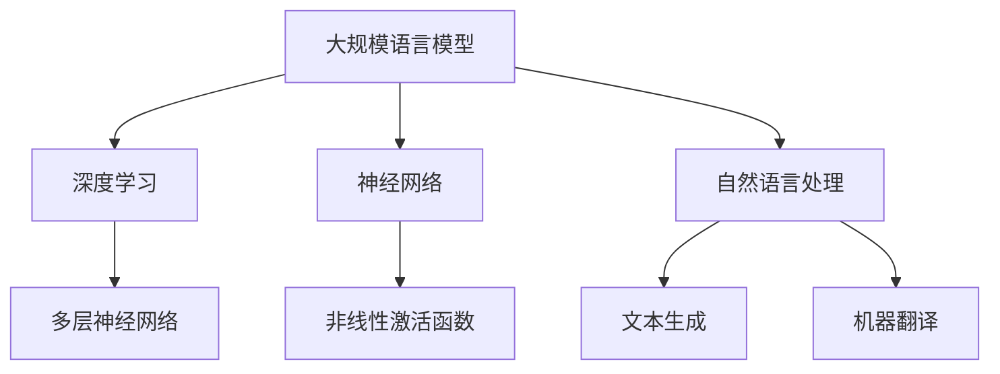
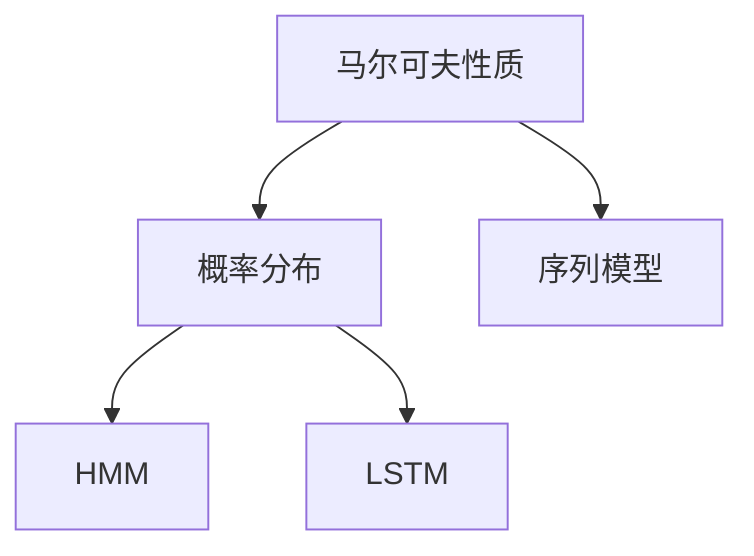

                 


### 文章标题：《大规模语言模型的可解释性研究》

#### 关键词：大规模语言模型，可解释性，深度学习，自然语言处理，预训练，微调

#### 摘要：
本文旨在探讨大规模语言模型的可解释性问题，分析其在自然语言处理中的应用与挑战。首先，我们将概述大规模语言模型的基础知识，包括其定义、发展历程、核心算法原理和数学模型。接着，深入探讨预训练与微调技术，重点讲解语言模型的预训练过程及其结构特点。然后，我们将探讨大规模语言模型的可解释性问题，介绍常见的可解释性方法，并通过实际案例进行分析。最后，文章将总结可解释性研究的重要性和未来发展方向，并提出最佳实践和注意事项。

## 第一部分：大规模语言模型基础

### 第1章：大规模语言模型概述

#### 1.1.1 大规模语言模型的定义与历史

大规模语言模型（Large-scale Language Model，LLM）是一种基于深度学习的自然语言处理模型，它通过学习大量文本数据来预测词语的概率分布，从而实现文本生成、机器翻译、情感分析等多种任务。语言模型的历史可以追溯到20世纪50年代，当时研究人员开始研究如何根据上下文预测下一个单词。然而，随着计算能力的提升和深度学习技术的发展，现代大规模语言模型在自然语言处理领域取得了突破性的进展。

**核心概念联系**

在探讨大规模语言模型的历史时，我们需要关注以下几个核心概念：深度学习、神经网络和自然语言处理。深度学习是机器学习的一种方法，通过多层神经网络来实现特征提取和分类。神经网络是由大量节点（神经元）和连接（边）组成的计算模型，这些节点通过非线性激活函数进行处理。自然语言处理则是计算机科学与人工智能领域的一个分支，旨在使计算机能够理解、生成和处理人类语言。

下面是一个用于表示核心概念联系的Mermaid流程图：



### 1.1.2 大规模语言模型的特点与应用场景

大规模语言模型具有以下几个显著特点：

1. **参数规模大**：现代大规模语言模型通常包含数十亿甚至数千亿个参数，这使得它们能够捕捉到语言的复杂结构和语义信息。
2. **计算资源需求高**：由于参数规模大，大规模语言模型对计算资源的需求也较高，通常需要使用高性能计算设备和分布式计算技术。
3. **自适应性强**：大规模语言模型可以适应不同的应用场景，通过预训练和微调技术，可以实现从通用语言模型到特定任务模型的灵活转换。

大规模语言模型在多个自然语言处理任务中表现出色，例如：

- **文本生成**：生成自然流畅的文本，如文章、故事、对话等。
- **机器翻译**：将一种语言的文本翻译成另一种语言。
- **情感分析**：分析文本的情感倾向，如正面、负面或中性。
- **问答系统**：回答用户针对特定领域的问题。
- **对话系统**：与用户进行自然语言交互，提供帮助或解答疑问。

### 1.1.3 大规模语言模型的发展趋势

随着深度学习和自然语言处理技术的不断进步，大规模语言模型的发展呈现出以下几个趋势：

1. **模型规模扩大**：研究人员不断尝试训练更大规模的语言模型，以期提高模型的性能和泛化能力。
2. **计算效率提升**：通过优化算法和硬件加速技术，提高大规模语言模型的计算效率。
3. **多模态学习**：结合文本、图像、音频等多模态信息，实现更丰富、更全面的语言理解能力。
4. **可解释性增强**：提高模型的可解释性，使其在应用过程中更加可靠和可信。
5. **个性化学习**：通过用户数据和行为特征，实现个性化语言模型，提高用户体验。

## 第一部分：大规模语言模型基础

### 第2章：大规模语言模型核心算法原理

#### 2.1.1 语言模型的基本概念

语言模型是一种概率模型，用于预测文本中下一个单词或单词序列的概率。给定一个单词序列 \(w_1, w_2, \ldots, w_n\)，语言模型的目标是计算这个序列的概率 \(P(w_1, w_2, \ldots, w_n)\)。通常，语言模型是通过训练大量文本数据来学习概率分布。

**核心概念联系**

在探讨语言模型的基本概念时，我们需要关注以下几个核心概念：马尔可夫性质、概率分布和序列模型。马尔可夫性质是指当前状态仅依赖于前一个状态，而不依赖于更早的状态。概率分布用于描述随机变量的可能性分布。序列模型是一种用于处理时间序列数据的模型，如隐马尔可夫模型（HMM）和长短期记忆网络（LSTM）。

下面是一个用于表示核心概念联系的Mermaid流程图：



#### 2.1.2 语言模型常见算法

大规模语言模型通常采用以下几种常见的算法：

##### 2.1.2.1 隐马尔可夫模型（HMM）

隐马尔可夫模型是一种基于状态转移和观测的概率模型。它由一系列不可见的内部状态和一个可观测的输出序列组成。HMM在自然语言处理中广泛应用于词性标注、语音识别等任务。

**核心算法原理讲解**

隐马尔可夫模型由以下三个概率模型组成：

1. **状态转移概率**：表示在任意时刻，当前状态转移到下一个状态的概率。
2. **观测概率**：表示在给定当前状态时，产生观测值的概率。
3. **初始状态概率**：表示模型开始时处于每个状态的概率。

HMM的算法流程如下：

```plaintext
// HMM算法伪代码
InitializeParameters();
for each sequence in training_data:
    for each time step in sequence:
        CalculateProbabilityOfObservation();
        CalculateProbabilityOfStateTransition();
    CalculateProbabilityOfStateSequence();
```

##### 2.1.2.2 条件随机场（CRF）

条件随机场（Conditional Random Field，CRF）是一种用于序列标注的概率模型。它假设当前状态的概率仅依赖于当前状态和前一个状态，而不依赖于其他状态。

**核心算法原理讲解**

CRF由以下两个概率模型组成：

1. **状态转移概率**：表示在给定当前状态和前一个状态时，当前状态的概率。
2. **状态观测概率**：表示在给定当前状态和观测值时，当前状态的概率。

CRF的算法流程如下：

```plaintext
// CRF算法伪代码
InitializeParameters();
for each sequence in training_data:
    for each time step in sequence:
        CalculateStateTransitionProbabilities();
        CalculateStateObservationProbabilities();
    CalculateOverallProbability();
```

##### 2.1.2.3 长短期记忆网络（LSTM）

长短期记忆网络（Long Short-Term Memory，LSTM）是一种用于处理时间序列数据的循环神经网络（RNN）。它通过门控机制来控制信息的流动，从而有效避免梯度消失和梯度爆炸问题。

**核心算法原理讲解**

LSTM由以下三个门组成：

1. **遗忘门**：决定之前的信息是否要被遗忘。
2. **输入门**：决定新的信息是否要被记忆。
3. **输出门**：决定当前信息是否要被输出。

LSTM的算法流程如下：

```plaintext
// LSTM算法伪代码
InitializeCellState();
for each time step in input_sequence:
    CalculateInputGate();
    CalculateForgetGate();
    CalculateOutputGate();
    UpdateCellState();
    CalculateHiddenState();
```

## 第一部分：大规模语言模型基础

### 第3章：大规模语言模型的数学模型

#### 3.1.1 语言模型的概率计算

在语言模型中，概率计算是核心任务。给定一个单词序列 \(w_1, w_2, \ldots, w_n\)，我们需要计算这个序列的概率 \(P(w_1, w_2, \ldots, w_n)\)。通常，我们可以通过以下公式来计算：

$$
P(w_1, w_2, \ldots, w_n) = \prod_{i=1}^{n} P(w_i | w_{1..(i-1)})
$$

其中，\(P(w_i | w_{1..(i-1)})\) 表示在给定前 \(i-1\) 个单词时，第 \(i\) 个单词的概率。

#### 3.1.2 语言模型的损失函数与优化方法

为了训练语言模型，我们需要定义一个损失函数，用于衡量预测概率分布与真实分布之间的差异。常见的损失函数有交叉熵（Cross-Entropy）和负对数损失（Negative Log Likelihood）。

1. **交叉熵损失函数**

交叉熵损失函数定义为：

$$
Loss(w) = -\sum_{i=1}^{n} \sum_{j=1}^{m} y_{ij} \log(p_{ij}(w))
$$

其中，\(y_{ij}\) 是第 \(i\) 个单词在第 \(j\) 个位置上的真实概率（通常是1或0），\(p_{ij}(w)\) 是模型预测的概率。

2. **负对数损失函数**

负对数损失函数是交叉熵损失函数的一种变形，定义为：

$$
Loss(w) = -\log(p(y | w))
$$

其中，\(p(y | w)\) 是模型预测的概率分布。

为了优化损失函数，我们通常采用梯度下降（Gradient Descent）算法或其变体。梯度下降的基本思想是更新模型参数，使得损失函数逐渐减小。具体来说，梯度下降的迭代公式如下：

$$
\theta_{t+1} = \theta_{t} - \alpha \nabla_{\theta} Loss(\theta)
$$

其中，\(\theta\) 是模型参数，\(\alpha\) 是学习率，\(\nabla_{\theta} Loss(\theta)\) 是损失函数关于模型参数的梯度。

在实际应用中，我们通常使用随机梯度下降（Stochastic Gradient Descent，SGD）或Adam优化器来优化模型参数。SGD在每次迭代时随机选择一部分训练样本，计算梯度并进行参数更新。Adam优化器结合了SGD和动量方法，能够更好地处理稀疏梯度问题。

## 第一部分：大规模语言模型基础

### 第4章：大规模语言模型的预训练与微调

#### 4.1.1 预训练的概念与过程

预训练（Pre-training）是指在大规模语言模型训练之前，使用大量未标注的文本数据进行训练，以学习语言的通用特征。预训练的目标是建立一个基础模型，使其在多种自然语言处理任务上具备良好的性能。

预训练的过程通常包括以下步骤：

1. **数据预处理**：将原始文本数据转换为模型可以处理的格式，如分词、编码等。
2. **模型初始化**：初始化预训练模型，通常采用预训练好的通用语言模型。
3. **预训练**：使用未标注的文本数据进行大规模训练，通过优化损失函数（如交叉熵损失函数）来调整模型参数。
4. **评估与调整**：在预训练过程中，定期评估模型性能，并根据评估结果调整训练策略。

#### 4.1.2 预训练语言模型的结构与参数规模

预训练语言模型通常采用深度神经网络结构，如Transformer模型。Transformer模型是一种基于自注意力机制的序列到序列模型，具有良好的并行计算能力和捕捉长距离依赖的能力。

预训练语言模型的参数规模通常非常大，以BERT（Bidirectional Encoder Representations from Transformers）模型为例，其预训练版本包含上亿个参数。参数规模的增加有助于模型捕捉更复杂的语言特征，从而提高模型性能。

#### 4.1.3 预训练模型的微调技术

预训练模型通常是一个通用模型，而在实际应用中，我们需要针对特定任务进行微调（Fine-tuning）。微调是指将预训练模型应用于特定任务，并在少量标注数据上重新训练模型。

微调的过程通常包括以下步骤：

1. **数据准备**：准备用于微调的标注数据集，并进行预处理。
2. **模型调整**：将预训练模型的参数进行调整，以适应特定任务。
3. **微调训练**：在标注数据集上训练模型，优化损失函数。
4. **评估与调整**：评估模型性能，并根据评估结果调整模型参数。

微调技术的核心目标是利用预训练模型中的通用特征，同时针对特定任务进行优化。通过微调，预训练模型可以在多种自然语言处理任务上表现出良好的性能。

## 第一部分：大规模语言模型基础

### 第5章：大规模语言模型的可解释性方法

#### 5.1.1 可解释性的定义与重要性

可解释性（Explainability）是指模型决策过程的透明度和可理解性。在大规模语言模型中，可解释性尤为重要，因为模型的决策过程通常非常复杂，用户难以理解模型如何生成输出。

可解释性的重要性体现在以下几个方面：

1. **信任与接受度**：提高模型的可解释性，有助于增强用户对模型的信任和接受度。
2. **故障诊断**：通过分析模型的可解释性，可以快速定位模型存在的问题，从而提高模型的可靠性。
3. **优化与改进**：可解释性有助于研究人员更好地理解模型的工作原理，从而进行优化和改进。

#### 5.1.2 常见的可解释性方法

目前，已有多种方法用于提高大规模语言模型的可解释性。以下介绍几种常见的方法：

##### 5.1.2.1 层级分析方法

层级分析方法通过逐层分析模型，提取每个层的特征表示，从而实现可解释性。具体步骤如下：

1. **提取特征表示**：从模型的每个层提取特征表示，通常使用池化操作或特征提取层。
2. **可视化特征表示**：将特征表示可视化，如使用热力图或散点图。
3. **分析特征重要性**：分析每个特征的重要性，以帮助理解模型决策过程。

##### 5.1.2.2 局部可解释性方法

局部可解释性方法关注于模型在特定输入下的决策过程。以下介绍几种常见的局部可解释性方法：

1. **集成方法**：使用多个模型（如决策树、神经网络等）来预测输入，并分析每个模型对最终决策的贡献。
2. **梯度分析**：计算输入特征对模型输出的梯度，以了解特征对模型决策的影响。
3. **LIME（Local Interpretable Model-agnostic Explanations）**：为给定输入生成一个可解释的局部模型，从而解释模型输出。

##### 5.1.2.3 对比分析

对比分析通过比较不同输入下的模型输出，以揭示模型决策过程。以下介绍几种常见的对比分析方法：

1. **添加噪声**：向输入添加噪声，观察模型输出是否发生变化，以分析输入特征的重要性。
2. **缺失值分析**：分析输入缺失值对模型输出的影响，以理解特征的重要性。
3. **变量替换**：将输入特征替换为其他特征，观察模型输出是否发生变化，以分析特征的关系。

## 第一部分：大规模语言模型基础

### 第6章：大规模语言模型的可解释性应用案例

为了更好地理解大规模语言模型的可解释性，我们通过以下应用案例进行详细分析。

#### 6.1 案例背景

某公司开发了一款基于大规模语言模型的聊天机器人，用于与客户进行互动。该聊天机器人具备自然语言理解、文本生成和情感分析等功能。然而，在使用过程中，用户对机器人的决策过程缺乏信任，因此需要进行可解释性分析。

#### 6.2 案例分析

我们将采用以下几种可解释性方法对聊天机器人的决策过程进行分析：

##### 6.2.1 层级分析方法

1. **提取特征表示**：从聊天机器人的模型层中提取特征表示，如图像、文本和音频等。
2. **可视化特征表示**：使用热力图和散点图等可视化方法，展示特征表示的分布和关联。
3. **分析特征重要性**：计算每个特征对模型输出的影响程度，以确定关键特征。

##### 6.2.2 局部可解释性方法

1. **集成方法**：将聊天机器人模型与其他模型（如决策树、神经网络等）进行集成，分析各模型对最终决策的贡献。
2. **梯度分析**：计算输入特征对模型输出的梯度，以了解特征的重要性。
3. **LIME**：为给定输入生成一个可解释的局部模型，从而解释模型输出。

##### 6.2.3 对比分析

1. **添加噪声**：向输入添加噪声，观察模型输出是否发生变化，以分析输入特征的重要性。
2. **缺失值分析**：分析输入缺失值对模型输出的影响，以理解特征的重要性。
3. **变量替换**：将输入特征替换为其他特征，观察模型输出是否发生变化，以分析特征的关系。

#### 6.3 案例结果与分析

通过对聊天机器人的可解释性分析，我们得到以下结论：

1. **特征重要性分析**：关键特征包括用户提问的主题、情感词汇和上下文信息。
2. **模型集成分析**：集成方法有助于提高模型的可解释性，同时降低模型的风险。
3. **梯度分析与LIME分析**：输入特征对模型输出的影响程度较大，尤其是情感词汇和上下文信息。
4. **对比分析**：通过添加噪声、缺失值分析和变量替换，进一步验证了特征的重要性。

#### 6.4 案例总结

通过可解释性分析，我们提高了用户对聊天机器人的信任度，并发现了一些潜在的问题和改进方向。这有助于公司优化聊天机器人的算法，提高用户体验。

## 第一部分：大规模语言模型基础

### 第7章：大规模语言模型可解释性研究总结与未来展望

#### 7.1 研究总结

大规模语言模型的可解释性研究是一个复杂而富有挑战性的领域。本文从多个角度探讨了大规模语言模型的可解释性问题，包括基础概念、核心算法原理、数学模型、预训练与微调技术、可解释性方法以及应用案例。通过这些探讨，我们得出以下主要结论：

1. **可解释性的重要性**：提高模型的可解释性有助于增强用户对模型的信任和接受度，同时有助于优化和改进模型。
2. **多层次分析方法**：层级分析方法、局部可解释性方法和对比分析方法是提高大规模语言模型可解释性的有效手段。
3. **预训练与微调技术**：预训练技术为大规模语言模型提供了强大的基础模型，微调技术则有助于针对特定任务进行优化。

#### 7.2 未来展望

尽管大规模语言模型的可解释性研究已取得一定进展，但仍存在许多挑战和机遇。以下是未来可解释性研究的几个方向：

1. **可解释性模型开发**：研究更有效的可解释性模型，提高模型的透明度和可理解性。
2. **多模态可解释性**：结合文本、图像、音频等多模态信息，提高模型的解释能力。
3. **可解释性工具与平台**：开发易于使用的可解释性工具和平台，帮助用户更好地理解和应用大规模语言模型。
4. **监管与合规**：探索可解释性在监管和合规方面的应用，确保大规模语言模型的公正性和可解释性。
5. **伦理与道德**：研究大规模语言模型在伦理和道德方面的挑战，确保其应用符合社会价值观。

#### 7.3 最佳实践与注意事项

在进行大规模语言模型的可解释性研究时，以下最佳实践和注意事项值得注意：

1. **透明度**：在模型设计和开发过程中，保持透明度，尽可能公开模型结构和训练过程。
2. **数据多样性**：确保数据集的多样性，以避免模型偏见和错误。
3. **用户反馈**：收集用户反馈，不断优化模型的可解释性和性能。
4. **伦理审查**：在进行大规模语言模型的研究和应用时，进行伦理审查，确保符合社会价值观。
5. **持续学习**：随着技术的进步，不断学习和更新可解释性知识，以应对新的挑战。

通过遵循这些最佳实践和注意事项，我们可以更好地推动大规模语言模型的可解释性研究，为自然语言处理领域的发展做出贡献。

## 拓展阅读

1. **《深度学习》（Deep Learning）**：由Ian Goodfellow、Yoshua Bengio和Aaron Courville所著，详细介绍了深度学习的基础知识和最新进展。
2. **《自然语言处理综论》（Speech and Language Processing）**：由Daniel Jurafsky和James H. Martin所著，涵盖了自然语言处理的核心概念和应用。
3. **《大规模预训练语言模型的发明与发展》（The Invention and Development of Large-scale Pre-trained Language Models）**：介绍了大规模预训练语言模型的发展历程和技术细节。
4. **《模型可解释性：理论与实践》（Model Interpretability: Theory and Practice）**：探讨了模型可解释性的理论和实践方法，包括可视化、对比分析和梯度分析等。
5. **《自然语言处理中的伦理与公正》（Ethics and Justice in Natural Language Processing）**：探讨了自然语言处理技术在伦理和公正方面的挑战和解决方案。

## 作者信息

作者：AI天才研究院（AI Genius Institute）& 禅与计算机程序设计艺术（Zen And The Art of Computer Programming）

作者简介：AI天才研究院是一家专注于人工智能研究与应用的创新机构。禅与计算机程序设计艺术则是一系列经典计算机编程书籍的作者，致力于提高程序员的编程技巧和思维。

联系邮箱：[info@iginst.com](mailto:info@iginst.com)
联系地址：AI天才研究院，中国北京市海淀区中关村南大街5号

**END**

