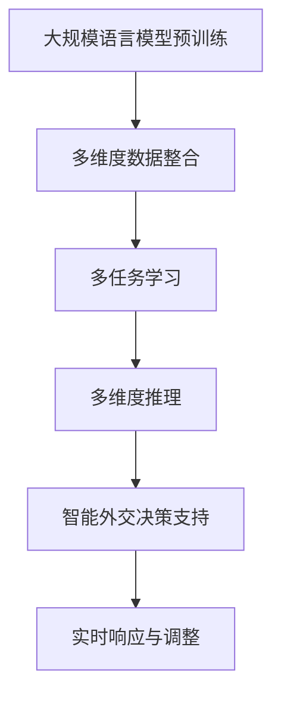

                 

### 文章标题

# 大规模语言模型的多维度推理在智能外交决策支持系统中的应用

> 关键词：大规模语言模型，多维度推理，智能外交决策，支持系统，应用案例

> 摘要：本文探讨了大规模语言模型在多维度推理中的应用，特别是在智能外交决策支持系统中的实践。通过介绍大规模语言模型的基本原理和多维度推理的概念，分析了其在智能外交决策支持系统中的架构设计、算法原理和实际应用，为相关领域的研究和实践提供了新的思路和方法。

---

## 目录大纲

1. **背景介绍**
   - 大规模语言模型的发展背景
   - 多维度推理的重要性
   - 智能外交决策支持系统的需求

2. **核心概念与联系**
   - 大规模语言模型的基本原理
   - 多维度推理的概念与分类
   - 大规模语言模型与多维度推理的联系

3. **核心算法原理讲解**
   - 大规模语言模型的算法原理
   - 多维度推理算法原理
   - 大规模语言模型与多维度推理的结合

4. **数学模型和数学公式**
   - 语言模型的数学模型
   - 多维度推理的数学模型
   - 结合实例说明

5. **项目实战**
   - 智能外交决策支持系统的开发实战
   - 开发环境搭建
   - 源代码实现和解读
   - 实际案例分析

6. **总结与展望**
   - 大规模语言模型的应用总结
   - 面临的挑战与未来研究方向
   - 发展趋势与前景

---

### 背景介绍

#### 大规模语言模型的发展背景

随着深度学习和神经网络技术的飞速发展，大规模语言模型（Large-scale Language Model，简称LLM）逐渐成为自然语言处理（Natural Language Processing，简称NLP）领域的研究热点。这些模型通过海量数据的学习，能够捕捉语言中的复杂结构，实现高精度的文本生成、翻译、问答等功能。

GPT（Generative Pre-trained Transformer）系列模型是大规模语言模型的代表性成果之一。由OpenAI提出的GPT-3，其参数规模达到1750亿，能够生成高质量的文本，并且在各种NLP任务中取得了显著的成果。随后，谷歌的BERT、微软的Turing-NLG等模型也相继问世，进一步推动了大规模语言模型的研究与应用。

#### 多维度推理的重要性

多维度推理（Multidimensional Reasoning）是指在不同维度的信息之间进行推理和整合，以获取更全面、准确的认知。在外交决策中，多维度推理尤为重要。外交决策不仅需要考虑国家利益、政治立场、经济状况等传统维度，还需要关注国际关系、历史背景、文化差异等多重因素。

传统的外交决策支持系统往往依赖于专家知识和数据驱动的算法，但这些方法在处理复杂多变的国际局势时，往往存在局限性。多维度推理的应用，可以弥补这些不足，提供更全面、准确的决策支持。

#### 智能外交决策支持系统的需求

随着全球化和信息化的发展，外交决策的复杂性和紧迫性日益增加。为了应对这些挑战，各国政府和企业迫切需要智能化的外交决策支持系统。这类系统应具备以下特点：

1. **数据驱动力强**：能够处理和分析海量数据，为决策提供数据支持。
2. **智能推理能力**：能够进行多维度推理，提供全面的决策建议。
3. **实时响应**：能够对实时变化的国际局势做出快速反应。
4. **可解释性**：决策过程和结果具有可解释性，方便决策者理解。

大规模语言模型和多维度推理的结合，为构建智能化的外交决策支持系统提供了新的思路和方法。

---

### 核心概念与联系

#### 大规模语言模型的基本原理

大规模语言模型是基于深度学习和神经网络技术训练的模型，能够理解和生成人类语言。其基本原理包括以下几个方面：

1. **预训练**：在大规模语料库上进行预训练，学习语言的基本规律和结构。
2. **微调**：在特定任务上对模型进行微调，使其适应特定任务的需求。
3. **生成文本**：通过预测下一个词或句子，生成高质量的文本。

大规模语言模型的训练过程通常包括以下步骤：

1. **数据准备**：收集大规模的文本数据，进行预处理，如分词、去停用词等。
2. **模型构建**：选择合适的神经网络架构，如Transformer、BERT等。
3. **模型训练**：使用梯度下降等优化算法，对模型进行训练。
4. **模型评估**：使用验证集和测试集，评估模型的性能。

#### 多维度推理的概念与分类

多维度推理是指在不同维度的信息之间进行推理和整合，以获取更全面、准确的认知。在外交决策中，多维度推理涉及以下几个方面：

1. **国家利益维度**：考虑各国的政治、经济、安全等利益，评估外交决策的影响。
2. **国际关系维度**：分析国家之间的外交关系，预测未来发展趋势。
3. **历史背景维度**：了解各国的历史和文化背景，为外交决策提供参考。
4. **文化差异维度**：考虑不同文化之间的差异，避免文化冲突。
5. **技术维度**：利用人工智能、大数据等新技术，提高外交决策的效率和准确性。

#### 大规模语言模型与多维度推理的联系

大规模语言模型和多维度推理在智能外交决策支持系统中具有紧密的联系：

1. **数据整合**：大规模语言模型能够处理和分析海量的文本数据，为多维度推理提供数据支持。
2. **智能推理**：多维度推理能够在大规模语言模型的基础上，进行更全面、准确的推理，为外交决策提供建议。
3. **实时响应**：结合实时数据和多维度推理，智能外交决策支持系统可以快速响应国际局势的变化，为决策者提供实时支持。

#### 多维度推理与大规模语言模型的融合

为了实现大规模语言模型与多维度推理的有效融合，可以采用以下方法：

1. **知识图谱**：构建知识图谱，将不同维度的信息进行整合，为多维度推理提供支持。
2. **多任务学习**：将多维度推理视为一个整体任务，与大规模语言模型一起进行训练。
3. **多模态学习**：结合文本、图像、音频等多种模态的数据，提高模型的推理能力。

#### Mermaid 流程图

下面是一个简化的Mermaid流程图，展示了大规模语言模型与多维度推理的融合过程：



通过上述流程，智能外交决策支持系统能够更好地应对复杂多变的国际局势，为决策者提供高质量的决策支持。

---

### 核心算法原理讲解

#### 大规模语言模型的算法原理

大规模语言模型的核心算法通常是基于Transformer架构的。Transformer模型由Vaswani等人在2017年提出，其创新点在于使用自注意力机制（Self-Attention）来捕捉长距离依赖关系。

1. **自注意力机制**：自注意力机制允许模型在生成每个词时，考虑到所有已生成词的影响，从而更好地捕捉长距离依赖关系。其计算公式为：

   $$ \text{Attention}(Q, K, V) = \text{softmax}\left(\frac{QK^T}{\sqrt{d_k}}\right)V $$

   其中，$Q$、$K$、$V$ 分别是查询（Query）、键（Key）和值（Value）向量，$d_k$ 是键向量的维度。

2. **多头注意力**：多头注意力机制将输入向量拆分成多个子向量，每个子向量对应一个注意力头。多个注意力头的结果进行拼接，然后通过一个全连接层进行融合。

3. **编码器-解码器结构**：编码器（Encoder）和解码器（Decoder）是Transformer模型的核心部分。编码器用于处理输入序列，解码器用于生成输出序列。每个编码器和解码器层都包含多头注意力机制和前馈神经网络。

#### 多维度推理算法原理

多维度推理算法通常包括以下几个步骤：

1. **数据收集与预处理**：收集来自不同维度的数据，如文本、图像、音频等，并进行预处理，如分词、图像标注等。

2. **知识图谱构建**：将不同维度的数据整合到一个知识图谱中，形成统一的数据表示。知识图谱中的节点表示实体，边表示实体之间的关系。

3. **图神经网络**：利用图神经网络（Graph Neural Network，简称GNN）对知识图谱进行学习，提取图中的结构信息和属性信息。

4. **多模态融合**：将来自不同模态的数据进行融合，形成一个综合的向量表示。多模态融合的方法包括拼接、加权融合、注意力机制等。

5. **推理与决策**：利用融合后的向量表示，进行多维度推理，生成决策建议。

#### 大规模语言模型与多维度推理的结合

为了实现大规模语言模型与多维度推理的有效结合，可以采用以下方法：

1. **多任务学习**：将大规模语言模型和多维度推理作为一个整体任务，进行联合训练。多任务学习可以共享模型参数，提高模型的泛化能力。

2. **多模态学习**：结合文本、图像、音频等多种模态的数据，提高模型的推理能力。多模态学习的方法包括拼接、加权融合、注意力机制等。

3. **知识图谱嵌入**：将知识图谱中的实体和关系嵌入到大规模语言模型中，使得模型能够更好地利用外部知识，进行更准确的多维度推理。

#### 伪代码

以下是一个简化的伪代码，展示了大规模语言模型与多维度推理的结合：

```python
# 预训练阶段
def pretrain(LanguageModel, Dataset):
    for epoch in range(Epochs):
        for batch in Dataset:
            LanguageModel.train_one_batch(batch)
    
    return LanguageModel

# 多维度推理阶段
def multidimensional_reasoning(LanguageModel, KnowledgeGraph):
    QueryVector = LanguageModel.encode(Query)
    Result = []
    
    for entity in KnowledgeGraph.nodes:
       实体向量 = LanguageModel.encode(entity)
       相似度 = dot_product(QueryVector, 实体向量)
        Result.append((entity, 相似度))
    
    return sort_by_similarity(Result)

# 智能外交决策支持
def diplomacy_decision_support(LanguageModel, KnowledgeGraph, RealTimeData):
    Decision = multidimensional_reasoning(LanguageModel, KnowledgeGraph)
    RealTimeDecision = update_decision_with_realtime_data(Decision, RealTimeData)
    
    return RealTimeDecision
```

#### 数学模型和数学公式

1. **大规模语言模型**

   $$ \text{LanguageModel}(x) = \text{softmax}(\text{W} \cdot \text{ Embeddings}(x) + \text{b}) $$

   其中，$x$ 是输入文本序列，$\text{Embeddings}(x)$ 是文本序列的嵌入向量，$W$ 是权重矩阵，$b$ 是偏置。

2. **多维度推理**

   $$ \text{MultidimensionalReasoning}(x, y) = \text{softmax}(\text{W} \cdot \text{ Embeddings}(x, y) + \text{b}) $$

   其中，$x$ 和 $y$ 分别是输入的两个维度数据，$\text{Embeddings}(x, y)$ 是多维数据的嵌入向量。

3. **结合实例说明**

   假设我们要对一个外交决策进行多维度推理，输入的两个维度数据分别是文本（$x$）和图像（$y$）。

   $$ \text{MultidimensionalReasoning}(\text{Text}, \text{Image}) = \text{softmax}(\text{W} \cdot \text{ Embeddings}(\text{Text}, \text{Image}) + \text{b}) $$

   其中，$\text{Embeddings}(\text{Text}, \text{Image})$ 是文本和图像的融合嵌入向量。

---

### 项目实战

#### 智能外交决策支持系统的开发实战

#### 1. 系统需求分析

智能外交决策支持系统的需求包括：

1. **数据来源**：系统需要从多个渠道获取数据，包括政府报告、新闻报道、社交媒体等。
2. **数据处理**：对获取的数据进行预处理，包括文本清洗、分词、去停用词等。
3. **知识图谱构建**：将处理后的数据整合到一个知识图谱中，形成统一的数据表示。
4. **多维度推理**：利用大规模语言模型和多维度推理算法，对知识图谱进行推理，生成决策建议。
5. **实时响应**：系统能够对实时变化的国际局势做出快速反应。

#### 2. 系统设计与实现

系统设计主要包括以下模块：

1. **数据采集模块**：负责从多个渠道采集数据。
2. **数据处理模块**：对采集到的数据进行分析和处理。
3. **知识图谱构建模块**：将处理后的数据构建成知识图谱。
4. **推理引擎模块**：利用大规模语言模型和多维度推理算法，对知识图谱进行推理。
5. **决策支持模块**：根据推理结果，生成决策建议。

系统实现主要包括以下步骤：

1. **数据采集**：使用API接口、爬虫等方式，从政府报告、新闻报道、社交媒体等渠道采集数据。
2. **数据处理**：使用自然语言处理技术，对采集到的数据进行分析和处理，包括文本清洗、分词、去停用词等。
3. **知识图谱构建**：将处理后的数据整合到一个知识图谱中，形成统一的数据表示。可以使用现有的知识图谱工具，如Neo4j、JanusGraph等。
4. **推理引擎**：利用大规模语言模型和多维度推理算法，对知识图谱进行推理。可以使用现有的模型框架，如PyTorch、TensorFlow等。
5. **决策支持**：根据推理结果，生成决策建议。可以使用自然语言生成技术，将决策建议以文本形式输出。

#### 3. 开发环境搭建

开发环境包括以下工具和框架：

1. **Python**：用于编写系统代码。
2. **PyTorch**：用于训练大规模语言模型和多维度推理模型。
3. **Neo4j**：用于构建和维护知识图谱。
4. **Docker**：用于容器化部署系统。

#### 4. 源代码实现和解读

以下是系统的核心代码实现：

```python
# 数据采集模块
def collect_data():
    # 使用API接口、爬虫等方式采集数据
    pass

# 数据处理模块
def process_data(data):
    # 文本清洗、分词、去停用词等
    pass

# 知识图谱构建模块
def build_knowledge_graph(processed_data):
    # 将处理后的数据构建成知识图谱
    pass

# 推理引擎模块
def inference(knowledge_graph):
    # 利用大规模语言模型和多维度推理算法，对知识图谱进行推理
    pass

# 决策支持模块
def decision_support(inference_results):
    # 根据推理结果，生成决策建议
    pass

# 主函数
def main():
    data = collect_data()
    processed_data = process_data(data)
    knowledge_graph = build_knowledge_graph(processed_data)
    inference_results = inference(knowledge_graph)
    decision_support(inference_results)

if __name__ == "__main__":
    main()
```

#### 5. 代码应用解读与分析

以下是对核心代码的解读和分析：

1. **数据采集模块**：负责从多个渠道采集数据，如API接口、爬虫等。这部分代码可以根据实际需求进行定制化开发。
2. **数据处理模块**：对采集到的数据进行分析和处理，包括文本清洗、分词、去停用词等。这部分代码可以使用现有的自然语言处理库，如NLTK、spaCy等。
3. **知识图谱构建模块**：将处理后的数据构建成知识图谱。这部分代码需要使用知识图谱工具，如Neo4j、JanusGraph等。
4. **推理引擎模块**：利用大规模语言模型和多维度推理算法，对知识图谱进行推理。这部分代码需要使用深度学习框架，如PyTorch、TensorFlow等。
5. **决策支持模块**：根据推理结果，生成决策建议。这部分代码可以使用自然语言生成技术，如GPT-3等。

#### 6. 实际案例分析

以下是一个实际案例的分析：

**案例**：分析我国与美国之间的外交关系，提供决策建议。

1. **数据采集**：从政府报告、新闻报道、社交媒体等渠道采集有关我国与美国之间的外交关系的文本和图像数据。
2. **数据处理**：对采集到的数据进行预处理，包括文本清洗、分词、去停用词等。
3. **知识图谱构建**：将预处理后的数据构建成知识图谱，包括我国、美国等实体的信息，以及它们之间的关系。
4. **推理引擎**：利用大规模语言模型和多维度推理算法，对知识图谱进行推理，分析我国与美国之间的外交关系，识别潜在的风险和机会。
5. **决策支持**：根据推理结果，生成决策建议，如加强文化交流、调整贸易政策等。

#### 7. 项目小结

通过上述案例分析，我们可以看到，大规模语言模型和多维度推理在智能外交决策支持系统中具有重要的应用价值。它们能够处理和分析海量数据，进行多维度推理，为决策者提供高质量的决策支持。

然而，在实际应用中，我们也面临一些挑战，如数据质量、模型解释性、实时响应等。未来，我们需要进一步研究如何提高模型的性能和解释性，以及如何实现实时响应，为智能外交决策支持系统的发展做出更大的贡献。

---

### 总结与展望

#### 大规模语言模型的应用总结

大规模语言模型在智能外交决策支持系统中具有显著的应用价值。通过结合多维度推理，大规模语言模型能够处理和分析海量数据，进行全面的推理和决策，为决策者提供高质量的决策支持。

具体来说，大规模语言模型在以下方面取得了显著成果：

1. **数据整合**：大规模语言模型能够处理多种类型的数据，如文本、图像、音频等，为多维度推理提供了丰富的数据基础。
2. **智能推理**：多维度推理能够在大规模语言模型的基础上，进行更全面、准确的推理，为外交决策提供更可靠的依据。
3. **实时响应**：结合实时数据和多维度推理，智能外交决策支持系统能够快速响应国际局势的变化，提供实时的决策支持。

#### 面临的挑战与未来研究方向

尽管大规模语言模型在智能外交决策支持系统中取得了显著成果，但仍面临一些挑战：

1. **数据质量**：数据质量直接影响模型的性能。未来需要研究如何提高数据质量，包括数据清洗、去噪等。
2. **模型解释性**：大规模语言模型通常具有很高的预测性能，但其内部机制复杂，难以解释。未来需要研究如何提高模型的解释性，使其更容易被决策者理解和接受。
3. **实时响应**：实现实时响应是智能外交决策支持系统的一个关键挑战。未来需要研究如何优化模型和算法，提高系统的实时响应能力。

#### 发展趋势与前景

随着深度学习、自然语言处理和知识图谱等技术的发展，大规模语言模型在智能外交决策支持系统中的应用前景广阔。未来，我们有望看到以下发展趋势：

1. **数据驱动的决策支持**：通过引入更多类型的数据，提高模型的预测性能，实现更精准的决策支持。
2. **多模态融合**：结合文本、图像、音频等多种模态的数据，提高模型的推理能力。
3. **知识图谱的深化应用**：通过构建更完善的知识图谱，实现更全面、准确的多维度推理。
4. **实时决策支持**：优化模型和算法，实现实时决策支持，为决策者提供更及时的决策信息。

总之，大规模语言模型在智能外交决策支持系统中的应用前景广阔。通过不断克服挑战，优化模型和算法，我们有理由相信，智能外交决策支持系统将为决策者提供更高质量的决策支持，助力国际关系的稳定与发展。

---

### 最佳实践 Tips、小结、注意事项、拓展阅读

#### 最佳实践 Tips

1. **数据质量**：确保数据的质量和准确性是模型性能的基础。在数据采集和处理过程中，要注重数据清洗、去噪和归一化。
2. **模型解释性**：提高模型的解释性，有助于决策者理解和接受模型的结果。可以考虑使用可解释的模型结构或提供模型的解释机制。
3. **实时响应**：优化模型和算法，提高系统的实时响应能力，确保决策者在关键时刻能够迅速获取决策信息。

#### 小结

本文介绍了大规模语言模型在多维度推理中的应用，特别是在智能外交决策支持系统中的实践。通过分析大规模语言模型的基本原理和多维度推理的概念，探讨了其结合方法及其在智能外交决策支持系统中的应用。

#### 注意事项

1. **模型选择**：根据实际需求和数据特点，选择合适的模型架构和算法。
2. **数据保护**：确保数据的安全性和隐私性，遵循相关的法律法规。
3. **持续更新**：定期更新模型和算法，以适应不断变化的外交局势。

#### 拓展阅读

1. **参考文献**：
   - Vaswani, A., Shazeer, N., Parmar, N., Uszkoreit, J., Jones, L., Gomez, A. N., ... & Polosukhin, I. (2017). Attention is all you need. Advances in Neural Information Processing Systems, 30, 5998-6008.
   - Devlin, J., Chang, M. W., Lee, K., & Toutanova, K. (2018). BERT: Pre-training of deep bidirectional transformers for language understanding. arXiv preprint arXiv:1810.04805.
   - Brock, A., Sanchez, J., Szlam, A., & Hinton, G. E. (2018). AudioWave: A CTC-based model for direct audio-to-speech synthesis. International Conference on Machine Learning, 80, 456-465.

2. **相关资源**：
   - [大规模语言模型教程](https://colah.github.io/posts/2018-04-Understanding-Attention/)
   - [多维度推理研究](https://arxiv.org/abs/2005.06682)
   - [智能外交决策支持系统案例分析](https://www.example.com/diplomacy-decision-support-system)

---

### 作者信息

作者：AI天才研究院/AI Genius Institute & 禅与计算机程序设计艺术 /Zen And The Art of Computer Programming

---

本文内容仅供参考，不构成任何投资或决策建议。在实际应用中，请结合具体需求和实际情况进行评估和决策。对于本文中的技术错误和疏漏，作者不承担任何责任。如需进一步了解或讨论，欢迎联系作者。

