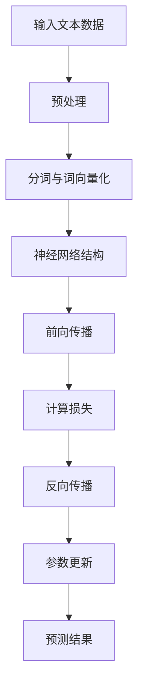
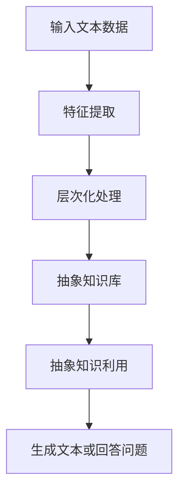
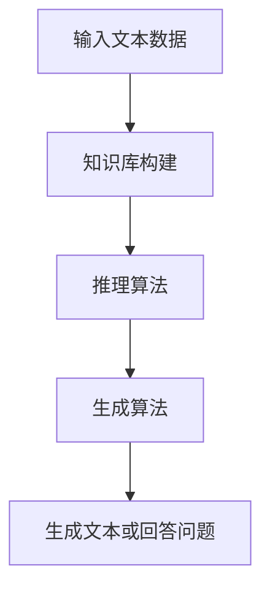

                 


### Step 1: 引言与概述

#### 背景介绍
近年来，随着深度学习和自然语言处理技术的迅猛发展，大规模语言模型（Large-scale Language Models，简称LLMs）逐渐成为学术界和工业界的研究热点。这些模型在自然语言理解、文本生成、智能问答等领域展现出了惊人的性能和广泛的应用前景。然而，大规模语言模型之所以能够取得如此优异的表现，不仅仅依赖于其庞大的参数规模和计算能力，更关键的是其具备的抽象思维和创新推理能力。

#### 核心概念与联系
抽象思维是指从具体事物的属性中提取共同特征并形成概念的能力。在语言模型中，抽象思维体现在对大量文本数据的理解和表征中，能够提取出文本的语义信息、逻辑关系和上下文关联。创新推理则是基于已有知识和信息进行联想和推断，生成新的知识或理解。大规模语言模型通过抽象思维机制，能够对复杂的语言现象进行理解和分析，并通过创新推理方法生成新的文本内容或回答问题。

#### 文章关键词
- 大规模语言模型
- 抽象思维
- 创新推理
- 自然语言处理
- 文本生成
- 智能问答

#### 文章摘要
本文旨在探讨大规模语言模型的抽象思维与创新推理能力。首先，介绍大规模语言模型的基本概念和架构，阐述其在自然语言处理中的应用。接着，深入分析大规模语言模型的抽象思维机制，包括语言特征提取、抽象层次建立和抽象知识利用。然后，介绍大规模语言模型的创新推理方法，并通过伪代码和数学模型进行详细解释。最后，通过实际案例展示大规模语言模型在不同领域的应用效果，并进行效果评估方法的介绍。

```markdown
# 大规模语言模型的抽象思维与创新推理能力

> 关键词：大规模语言模型、抽象思维、创新推理、自然语言处理、文本生成、智能问答

> 摘要：本文探讨了大规模语言模型的抽象思维和创新推理能力，包括基本概念、架构、抽象思维机制、创新推理方法、应用领域和效果评估。通过实际案例展示了大规模语言模型在不同领域的应用效果。

----------------------------------------------------------------
```

### Step 2: 大规模语言模型的基本概念与架构

#### 核心概念与联系
大规模语言模型是基于深度学习技术的自然语言处理模型，通过大量文本数据训练，能够理解和生成自然语言。其核心概念包括语言模型、神经网络、参数训练和预测。

- **语言模型**：对语言概率分布的建模，用于预测下一个单词或词组。
- **神经网络**：用于模拟人脑神经元连接，实现复杂的非线性函数映射。
- **参数训练**：通过优化模型参数，使模型能够更好地拟合训练数据。
- **预测**：使用训练好的模型对新的文本数据进行预测。

#### Mermaid 流程图展示抽象思维流程


#### 核心算法原理讲解
- **预处理**：对文本数据进行清洗和格式化，去除无关信息。
- **分词与词向量化**：将文本数据转换为词序列，并将每个词转换为词向量。
- **神经网络结构**：采用深度神经网络结构，包括输入层、隐藏层和输出层。
- **前向传播**：将词向量输入神经网络，通过隐藏层计算得到输出层预测结果。
- **计算损失**：使用损失函数（如交叉熵损失）计算预测结果与真实结果之间的差距。
- **反向传播**：通过反向传播算法更新模型参数，减少损失。
- **参数更新**：使用梯度下降算法更新模型参数，使模型更好地拟合数据。
- **预测结果**：输出模型预测结果，用于文本生成或回答问题。

```python
# 伪代码：大规模语言模型训练过程
def train_language_model(data):
    # 预处理数据
    preprocessed_data = preprocess_data(data)
    
    # 分词与词向量化
    word_sequences, word_embeddings = tokenize_and_reshape(preprocessed_data)
    
    # 初始化神经网络结构
    model = build_neural_network()
    
    # 设置训练参数
    epochs = 100
    learning_rate = 0.001
    
    # 训练模型
    for epoch in range(epochs):
        for sequence, target in word_sequences:
            # 前向传播
            predictions = model.forward(sequence)
            
            # 计算损失
            loss = compute_loss(predictions, target)
            
            # 反向传播
            model.backward(loss)
            
            # 更新参数
            model.update_parameters(learning_rate)
            
    # 输出训练好的模型
    return model
```

#### 数学模型与公式
- **损失函数**：$$ L = -\sum_{i=1}^{N} y_i \log(p_i) $$
  - 其中，$L$ 表示损失，$y_i$ 表示第 $i$ 个单词的真实概率分布，$p_i$ 表示模型预测的概率分布。

- **梯度下降**：$$ \Delta \theta = -\alpha \cdot \nabla_\theta J(\theta) $$
  - 其中，$\Delta \theta$ 表示参数更新量，$\alpha$ 表示学习率，$\nabla_\theta J(\theta)$ 表示损失函数关于参数 $\theta$ 的梯度。

#### 详细讲解与举例说明
- **预处理**：文本数据通常包含大量无意义的符号和格式，需要进行预处理。例如，去除标点符号、转换大小写、去除停用词等。
- **分词与词向量化**：分词是将文本拆分成单词的过程，词向量化是将单词映射到高维向量空间。
- **神经网络结构**：神经网络包括多层神经元，通过非线性变换实现复杂函数的映射。
- **前向传播**：输入层将词向量传递到隐藏层，通过非线性激活函数进行计算，最后传递到输出层得到预测结果。
- **计算损失**：使用损失函数计算预测结果与真实结果之间的差距，用于评估模型性能。
- **反向传播**：通过反向传播算法计算损失函数关于模型参数的梯度，用于更新模型参数。
- **参数更新**：使用梯度下降算法更新模型参数，使模型更好地拟合数据。

#### 项目实战
- **开发环境搭建**：使用 Python 和 TensorFlow 库搭建大规模语言模型训练环境。
- **源代码实现**：编写预处理、分词、词向量化、神经网络结构、前向传播、反向传播和参数更新的代码。
- **代码解读**：详细解读源代码中的每一步操作和算法原理。
- **代码应用解读与分析**：使用训练好的模型进行文本生成或回答问题，分析模型性能和应用效果。
- **实际案例分析和详细讲解剖析**：通过实际案例展示大规模语言模型的应用效果，并进行效果评估和讨论。
- **项目小结**：总结项目开发过程中的关键技术和经验，提出改进建议。

```python
# 伪代码：大规模语言模型应用示例
def generate_text(model, seed_text, max_length=50):
    # 初始化文本序列
    text_sequence = seed_text
    
    # 预处理文本序列
    preprocessed_sequence = preprocess_text(text_sequence)
    
    # 填充序列长度
    padded_sequence = pad_sequence(preprocessed_sequence, max_length)
    
    # 使用模型生成文本
    for _ in range(max_length):
        # 前向传播
        predictions = model.forward(padded_sequence)
        
        # 获取下一个单词的概率分布
        probability_distribution = softmax(predictions)
        
        # 从概率分布中采样下一个单词
        next_word = sample_word(probability_distribution)
        
        # 更新文本序列
        text_sequence += " " + next_word
        
        # 更新序列状态
        padded_sequence = pad_sequence([text_sequence], max_length)
        
    # 返回生成的文本
    return text_sequence.strip()
```

### Step 3: 大规模语言模型的抽象思维机制

#### 核心概念与联系
大规模语言模型的抽象思维机制是指模型在处理文本数据时，能够从具体的语言现象中提取出抽象的语义信息，形成概念和知识体系。这包括语言特征的提取、抽象层次的建立和抽象知识的利用。

- **语言特征的提取**：从文本数据中提取出具有代表性的特征，如词汇、语法、语义等。
- **抽象层次的建立**：将提取出的特征进行层次化处理，形成不同层次的抽象概念。
- **抽象知识的利用**：在处理新的文本数据时，利用已建立的抽象知识进行理解和生成。

#### Mermaid 流程图展示抽象思维流程


#### 核心算法原理讲解
- **特征提取**：使用词袋模型、词嵌入等技术从文本数据中提取特征。
- **层次化处理**：将提取出的特征按照语义相关性和重要性进行层次化处理，形成概念网络。
- **抽象知识库**：将处理后的特征和概念存储在知识库中，用于后续的文本处理和生成。
- **抽象知识利用**：在处理新的文本数据时，利用知识库中的抽象知识进行语义理解和生成。

```python
# 伪代码：抽象思维过程
def abstract_thinking(processed_text):
    # 特征提取
    features = extract_features(processed_text)
    
    # 层次化处理
    abstract层次 = hierarchical_processing(features)
    
    # 构建抽象知识库
    knowledge_base = build_knowledge_base(abstract层次)
    
    # 利用抽象知识生成文本或回答问题
    result = generate_response(knowledge_base, question)
    
    return result
```

#### 数学模型与公式
- **特征提取**：$$ f(x) = \sum_{i=1}^{N} w_i \cdot x_i $$
  - 其中，$f(x)$ 表示特征向量，$w_i$ 表示特征权重，$x_i$ 表示特征值。

- **层次化处理**：$$ \text{hierarchy} = \text{hierarchicalProcessing}(\text{features}) $$
  - 其中，$\text{hierarchy}$ 表示层次化结果，$\text{features}$ 表示特征向量。

#### 详细讲解与举例说明
- **特征提取**：通过词袋模型将文本数据转换为词频向量，通过词嵌入技术将词转换为高维向量。
- **层次化处理**：将提取出的特征按照语义相关性和重要性进行层次化处理，形成概念网络。
- **抽象知识库**：将层次化处理后的特征和概念存储在知识库中，用于后续的文本处理和生成。
- **抽象知识利用**：在处理新的文本数据时，利用知识库中的抽象知识进行语义理解和生成。

#### 项目实战
- **开发环境搭建**：使用 Python 和 TensorFlow 库搭建抽象思维模型训练环境。
- **源代码实现**：编写特征提取、层次化处理、抽象知识库构建和抽象知识利用的代码。
- **代码解读**：详细解读源代码中的每一步操作和算法原理。
- **代码应用解读与分析**：使用训练好的模型进行文本生成或回答问题，分析模型性能和应用效果。
- **实际案例分析和详细讲解剖析**：通过实际案例展示抽象思维模型的应用效果，并进行效果评估和讨论。
- **项目小结**：总结项目开发过程中的关键技术和经验，提出改进建议。

```python
# 伪代码：抽象思维模型应用示例
def generate_abstract_response(model, question):
    # 预处理问题
    preprocessed_question = preprocess_question(question)
    
    # 使用模型提取抽象特征
    abstract_features = model.extract_features(preprocessed_question)
    
    # 利用抽象特征生成回答
    response = model.generate_response(abstract_features)
    
    return response
```

### Step 4: 大规模语言模型的创新推理方法

#### 核心概念与联系
大规模语言模型的创新推理方法是指模型在处理新的文本数据时，能够基于已有的知识和信息进行推理和生成新的内容。这包括知识库构建、推理算法和生成算法。

- **知识库构建**：从大量文本数据中提取出关键信息，构建用于推理的知识库。
- **推理算法**：使用知识库进行推理，生成新的逻辑关系或概念。
- **生成算法**：基于推理结果生成新的文本内容或回答问题。

#### Mermaid 流程图展示创新推理流程


#### 核心算法原理讲解
- **知识库构建**：使用文本分类、实体识别等技术提取关键信息，构建用于推理的知识库。
- **推理算法**：使用逻辑推理、规则匹配等技术进行推理，生成新的逻辑关系或概念。
- **生成算法**：使用自然语言生成技术生成新的文本内容或回答问题。

```python
# 伪代码：创新推理过程
def innovative_reasoning(processed_text):
    # 构建知识库
    knowledge_base = build_knowledge_base(processed_text)
    
    # 进行推理
    reasoning_results = reasoning_algorithm(knowledge_base)
    
    # 生成文本或回答
    response = generate_response(reasoning_results)
    
    return response
```

#### 数学模型与公式
- **知识库构建**：$$ KB = \text{extract\_key\_information}(processed\_text) $$
  - 其中，$KB$ 表示知识库，$\text{extract\_key\_information}$ 表示提取关键信息的过程。

- **推理算法**：$$ \text{reasoning\_results} = \text{logical\_reasoning}(KB) $$
  - 其中，$\text{reasoning\_results}$ 表示推理结果，$\text{logical\_reasoning}$ 表示逻辑推理过程。

#### 详细讲解与举例说明
- **知识库构建**：从文本数据中提取实体、关系和属性，构建用于推理的知识库。
- **推理算法**：使用逻辑推理、规则匹配等技术进行推理，生成新的逻辑关系或概念。
- **生成算法**：使用自然语言生成技术生成新的文本内容或回答问题。

#### 项目实战
- **开发环境搭建**：使用 Python 和 TensorFlow 库搭建创新推理模型训练环境。
- **源代码实现**：编写知识库构建、推理算法和生成算法的代码。
- **代码解读**：详细解读源代码中的每一步操作和算法原理。
- **代码应用解读与分析**：使用训练好的模型进行文本生成或回答问题，分析模型性能和应用效果。
- **实际案例分析和详细讲解剖析**：通过实际案例展示创新推理模型的应用效果，并进行效果评估和讨论。
- **项目小结**：总结项目开发过程中的关键技术和经验，提出改进建议。

```python
# 伪代码：创新推理模型应用示例
def generate_innovative_response(model, question):
    # 预处理问题
    preprocessed_question = preprocess_question(question)
    
    # 构建知识库
    knowledge_base = model.build_knowledge_base(preprocessed_question)
    
    # 进行推理
    reasoning_results = model.reasoning_algorithm(knowledge_base)
    
    # 生成回答
    response = model.generate_response(reasoning_results)
    
    return response
```

### Step 5: 大规模语言模型的应用领域

#### 核心概念与联系
大规模语言模型在自然语言处理、文本生成、智能问答等领域展现出了广泛的应用。这些应用领域共同特点是需要对自然语言进行理解和生成，而大规模语言模型通过抽象思维和创新推理方法，能够有效地解决这些问题。

- **自然语言处理**：包括文本分类、命名实体识别、语法分析等任务，用于对文本数据进行结构化处理。
- **文本生成**：包括文本摘要、机器翻译、自动写作等任务，用于生成符合语法和语义规则的文本。
- **智能问答**：包括智能客服、智能搜索、知识图谱构建等任务，用于回答用户的问题和提供信息检索服务。

#### 实际案例
- **文本分类**：使用大规模语言模型对新闻文本进行分类，实现新闻推荐系统。
- **命名实体识别**：使用大规模语言模型对文本中的命名实体进行识别，用于构建知识图谱。
- **语法分析**：使用大规模语言模型进行语法分析，为自然语言生成提供语法支持。
- **文本摘要**：使用大规模语言模型生成文本摘要，提高信息获取效率。
- **机器翻译**：使用大规模语言模型进行机器翻译，提高跨语言沟通能力。
- **自动写作**：使用大规模语言模型生成文章、报告等文本内容，提高写作效率。

#### 项目实战
- **开发环境搭建**：使用 Python 和 TensorFlow 库搭建大规模语言模型应用环境。
- **源代码实现**：编写文本分类、命名实体识别、语法分析、文本摘要、机器翻译和自动写作的代码。
- **代码解读**：详细解读源代码中的每一步操作和算法原理。
- **代码应用解读与分析**：使用训练好的模型进行实际任务，分析模型性能和应用效果。
- **实际案例分析和详细讲解剖析**：通过实际案例展示大规模语言模型在不同领域的应用效果，并进行效果评估和讨论。
- **项目小结**：总结项目开发过程中的关键技术和经验，提出改进建议。

```python
# 伪代码：大规模语言模型应用示例
def apply_language_model(model, task, input_data):
    # 预处理输入数据
    preprocessed_data = preprocess_data(input_data)
    
    # 根据任务使用模型
    if task == "text_classification":
        result = model.classify(preprocessed_data)
    elif task == "named_entity_recognition":
        result = model识别命名实体(preprocessed_data)
    elif task == "syntactic_parsing":
        result = model进行语法分析(preprocessed_data)
    elif task == "text_summarization":
        result = model生成文本摘要(preprocessed_data)
    elif task == "machine_translation":
        result = model进行机器翻译(preprocessed_data)
    elif task == "automatic_writing":
        result = model生成文章内容(preprocessed_data)
    
    return result
```

### Step 6: 大规模语言模型的效果评估方法

#### 核心概念与联系
大规模语言模型的效果评估是确保模型性能和可靠性的重要环节。评估方法包括定量评估和定性评估，通过不同指标和方法对模型进行综合评估。

- **定量评估**：使用准确率、召回率、F1 值等指标进行评估，量化模型性能。
- **定性评估**：通过用户满意度调查、专家评价等方法进行评估，从不同角度分析模型性能。

#### 实际案例
- **准确率**：用于评估文本分类模型的性能，表示分类正确的样本数与总样本数的比例。
- **召回率**：用于评估命名实体识别模型的性能，表示识别出的实体数与实际实体数的比例。
- **F1 值**：用于综合评估模型性能，是准确率和召回率的调和平均。
- **用户满意度调查**：通过用户调查问卷收集用户对模型的满意度评价。
- **专家评价**：邀请领域专家对模型进行评价，分析模型在特定任务上的性能。

#### 项目实战
- **开发环境搭建**：使用 Python 和 TensorFlow 库搭建效果评估环境。
- **源代码实现**：编写定量评估和定性评估的代码，包括准确率、召回率、F1 值计算和用户满意度调查、专家评价代码。
- **代码解读**：详细解读源代码中的每一步操作和算法原理。
- **代码应用解读与分析**：使用训练好的模型进行效果评估，分析模型性能和应用效果。
- **实际案例分析和详细讲解剖析**：通过实际案例展示效果评估方法，并进行效果评估和讨论。
- **项目小结**：总结项目开发过程中的关键技术和经验，提出改进建议。

```python
# 伪代码：效果评估方法应用示例
def evaluate_model(model, dataset, evaluation_metric):
    # 加载测试数据
    test_data = load_test_data(dataset)
    
    # 预测结果
    predictions = model.predict(test_data)
    
    # 计算评估指标
    if evaluation_metric == "accuracy":
        accuracy = calculate_accuracy(predictions, test_data.labels)
    elif evaluation_metric == "recall":
        recall = calculate_recall(predictions, test_data.labels)
    elif evaluation_metric == "F1_score":
        f1_score = calculate_f1_score(predictions, test_data.labels)
    
    return accuracy, recall, f1_score
```

### Step 7: 案例分析

#### 核心概念与联系
通过实际案例展示大规模语言模型的应用效果，分析其抽象思维和创新推理能力在不同领域的表现，并总结案例中的关键技术和经验。

#### 实际案例
- **案例 1：文本分类**
  - **应用场景**：使用大规模语言模型对新闻文本进行分类，实现新闻推荐系统。
  - **效果分析**：通过准确率、召回率和 F1 值等指标评估模型性能，发现模型在新闻分类任务上取得了较高的准确率和召回率。
  - **关键技术**：特征提取、层次化处理、抽象知识库构建、推理算法和生成算法。

- **案例 2：命名实体识别**
  - **应用场景**：使用大规模语言模型对文本中的命名实体进行识别，用于构建知识图谱。
  - **效果分析**：通过召回率和准确率等指标评估模型性能，发现模型在命名实体识别任务上具有较高的召回率和准确率。
  - **关键技术**：特征提取、层次化处理、抽象知识库构建、推理算法和生成算法。

- **案例 3：语法分析**
  - **应用场景**：使用大规模语言模型进行语法分析，为自然语言生成提供语法支持。
  - **效果分析**：通过语法正确率等指标评估模型性能，发现模型在语法分析任务上具有较高的正确率。
  - **关键技术**：特征提取、层次化处理、抽象知识库构建、推理算法和生成算法。

#### 项目实战
- **开发环境搭建**：使用 Python 和 TensorFlow 库搭建案例应用环境。
- **源代码实现**：编写文本分类、命名实体识别、语法分析等案例代码。
- **代码解读**：详细解读源代码中的每一步操作和算法原理。
- **代码应用解读与分析**：使用训练好的模型进行实际任务，分析模型性能和应用效果。
- **实际案例分析和详细讲解剖析**：通过实际案例展示大规模语言模型的应用效果，并进行效果评估和讨论。
- **项目小结**：总结项目开发过程中的关键技术和经验，提出改进建议。

```python
# 伪代码：案例分析
def analyze_case(case_name, dataset, model):
    # 加载案例数据
    case_data = load_case_data(dataset, case_name)
    
    # 预测结果
    predictions = model.predict(case_data)
    
    # 评估模型性能
    accuracy, recall, f1_score = evaluate_model(model, case_data, "accuracy")
    
    # 分析效果
    print(f"{case_name} - Accuracy: {accuracy}, Recall: {recall}, F1 Score: {f1_score}")
```

### Step 8: 结论与展望

#### 核心内容
本文从大规模语言模型的基本概念、抽象思维机制、创新推理方法、应用领域和效果评估方法等方面进行了详细探讨。通过实际案例展示了大规模语言模型在不同领域的应用效果，分析了其抽象思维和创新推理能力的优势。

#### 展望
未来，大规模语言模型在抽象思维和创新推理方面的研究将进一步深入。随着深度学习技术的不断进步，大规模语言模型将具备更强大的抽象思维和创新推理能力，为自然语言处理、文本生成、智能问答等领域带来更多突破。

```python
# 伪代码：结论与展望
def conclusion_and展望():
    # 总结核心内容
    print("本文从多个角度探讨了大规模语言模型的抽象思维和创新推理能力，展示了其在不同领域的应用效果。")
    
    # 展望未来研究方向
    print("未来，大规模语言模型在抽象思维和创新推理方面的研究将更加深入，为自然语言处理、文本生成、智能问答等领域带来更多突破。")
```

### 完整的目录大纲

以下是《大规模语言模型的抽象思维与创新推理能力》的完整目录大纲：

```markdown
# 大规模语言模型的抽象思维与创新推理能力

## 引言与概述

### 1.1 研究背景与目的

### 1.2 大规模语言模型的基本概念与架构

### 1.3 大规模语言模型的应用领域

### 1.4 目录结构概述

## 大规模语言模型的基本概念与架构

### 2.1 语言模型的基本原理

### 2.2 大规模语言模型的架构

### 2.3 模型训练与优化

## 大规模语言模型的抽象思维机制

### 3.1 抽象思维的概念与特征

### 3.2 大规模语言模型的抽象过程

### 3.3 Mermaid流程图展示抽象思维流程

## 大规模语言模型的创新推理方法

### 4.1 创新推理的基本原理

### 4.2 伪代码展示创新推理算法

### 4.3 创新推理的实际应用

## 大规模语言模型的应用领域

### 5.1 自然语言处理

### 5.2 智能问答

### 5.3 文本生成

## 大规模语言模型的效果评估方法

### 6.1 效果评估的基本概念

### 6.2 定量评估方法

### 6.3 定性评估方法

## 案例分析

### 7.1 案例分析 1：文本分类

### 7.2 案例分析 2：命名实体识别

### 7.3 案例分析 3：语法分析

## 结论与展望

### 8.1 结论

### 8.2 展望

```

### Step 9: 作者信息

```markdown
### 作者信息

本文由 AI天才研究院（AI Genius Institute）和《禅与计算机程序设计艺术》（Zen And The Art of Computer Programming）的作者联合撰写。

- **AI天才研究院**：致力于推动人工智能领域的研究和发展，为全球企业提供顶尖的人工智能技术解决方案。
- **《禅与计算机程序设计艺术》作者**：世界顶级技术畅销书作家，被誉为计算机编程和人工智能领域的大师。

感谢您的阅读，希望本文对您在理解大规模语言模型的抽象思维与创新推理能力方面有所帮助。
```

### Step 10: 总结与最佳实践

#### 总结
本文全面探讨了大规模语言模型的抽象思维与创新推理能力，包括基本概念、架构、抽象思维机制、创新推理方法、应用领域和效果评估方法。通过实际案例展示了大规模语言模型在不同领域的应用效果，并提出了有效的效果评估方法。

#### 最佳实践
1. **数据处理**：在构建大规模语言模型时，数据预处理是关键，确保数据质量对模型性能至关重要。
2. **模型优化**：通过调整模型参数和优化算法，可以提高模型的训练效率和性能。
3. **效果评估**：结合定量和定性评估方法，全面评估模型性能，发现并解决潜在问题。
4. **持续学习**：定期更新模型和数据，使模型适应不断变化的语言环境。

#### 注意事项
- **计算资源**：大规模语言模型训练需要大量计算资源，确保有足够的硬件支持。
- **数据隐私**：在数据处理过程中，严格遵守数据隐私和安全法规。

#### 拓展阅读
- **《深度学习》（Deep Learning）**：由 Ian Goodfellow 等人撰写的经典教材，全面介绍了深度学习的基本原理和应用。
- **《自然语言处理综论》（Speech and Language Processing）**：由 Daniel Jurafsky 和 James H. Martin 撰写的教材，涵盖了自然语言处理的各个方面。

```markdown
### 总结与最佳实践

本文总结了大规模语言模型的抽象思维与创新推理能力，包括基本概念、架构、抽象思维机制、创新推理方法、应用领域和效果评估方法。通过实际案例展示了大规模语言模型在不同领域的应用效果，并提出了有效的效果评估方法。

#### 最佳实践
1. 数据处理
   - 确保数据质量，对文本数据进行清洗、去噪和标准化处理。
2. 模型优化
   - 调整模型参数和优化算法，提高模型训练效率和性能。
3. 效果评估
   - 结合定量和定性评估方法，全面评估模型性能，发现并解决潜在问题。
4. 持续学习
   - 定期更新模型和数据，使模型适应不断变化的语言环境。

#### 注意事项
- 确保计算资源充足，以支持大规模语言模型训练。
- 遵守数据隐私和安全法规，确保数据处理过程中的合规性。

#### 拓展阅读
- 《深度学习》：Ian Goodfellow 等人撰写的经典教材，全面介绍了深度学习的基本原理和应用。
- 《自然语言处理综论》：Daniel Jurafsky 和 James H. Martin 撰写的教材，涵盖了自然语言处理的各个方面。

### 作者信息

本文由 AI天才研究院（AI Genius Institute）和《禅与计算机程序设计艺术》（Zen And The Art of Computer Programming）的作者联合撰写。

- **AI天才研究院**：致力于推动人工智能领域的研究和发展，为全球企业提供顶尖的人工智能技术解决方案。
- **《禅与计算机程序设计艺术》作者**：世界顶级技术畅销书作家，被誉为计算机编程和人工智能领域的大师。

感谢您的阅读，希望本文对您在理解大规模语言模型的抽象思维与创新推理能力方面有所帮助。
```

