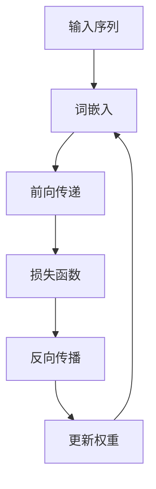
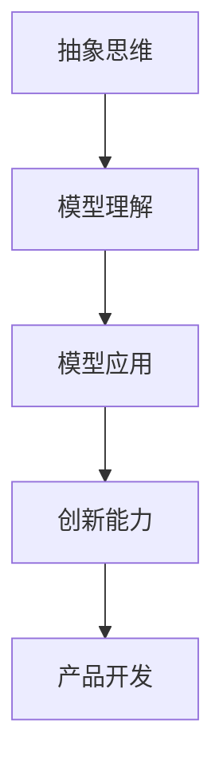
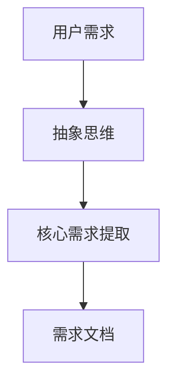
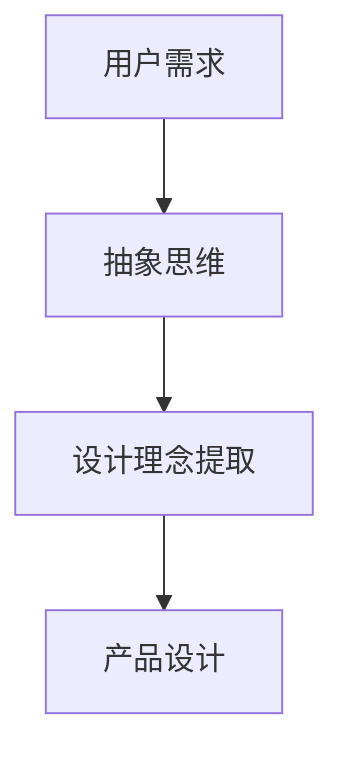
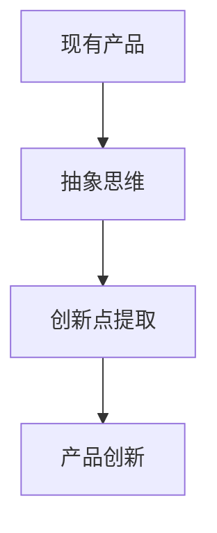
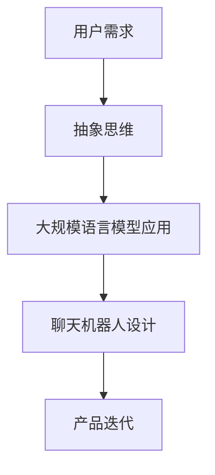
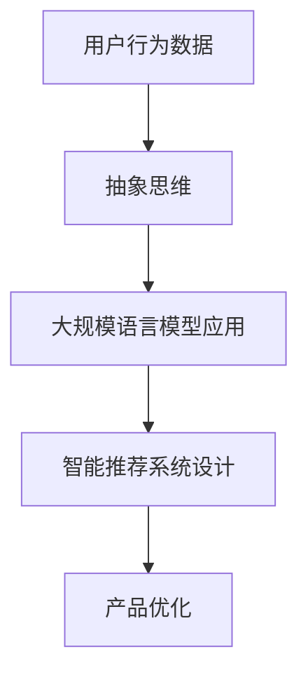
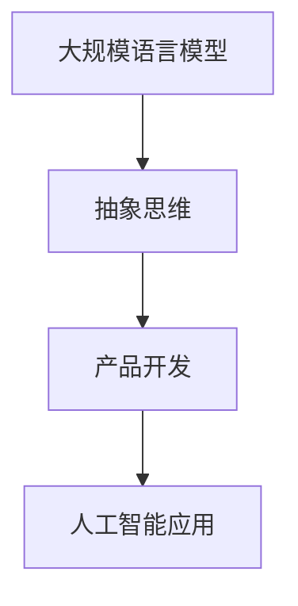
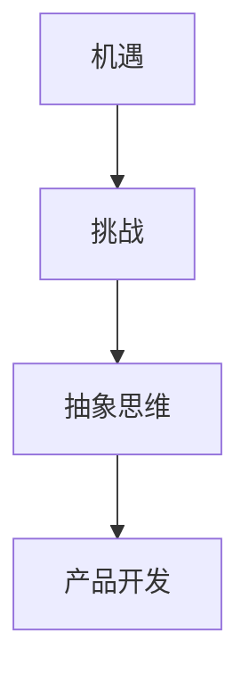

                 


### 目录大纲

# 《大规模语言模型的抽象思维与创新能力在产品开发中的应用》

> 关键词：大规模语言模型、抽象思维、产品开发、创新能力、人工智能

> 摘要：本文探讨了大规模语言模型在产品开发中的应用，特别强调了抽象思维和创新能力的重要性。通过详细分析大规模语言模型的技术原理、抽象思维的概念及其在产品开发中的应用，本文旨在揭示如何通过抽象思维提升产品开发的创新能力和效率。

## 第一部分：引论

### 1.1 背景介绍

大规模语言模型作为深度学习的一个重要分支，已经在自然语言处理（NLP）领域取得了显著的成果。随着模型规模的不断扩大，其应用范围也逐渐扩展到产品开发领域。抽象思维作为一种高层次的认知活动，能够帮助开发者理解和解决问题，从而提高产品的创新性和用户体验。

### 1.2 大规模语言模型的基本概念

大规模语言模型，如GPT-3、BERT等，通过训练大量文本数据，学习语言的统计规律和结构。这些模型具有强大的表征能力，可以用于文本生成、问答系统、情感分析等应用。抽象思维则是将复杂问题简化为基本要素的能力，这一能力在大规模语言模型的应用中起到了关键作用。

### 1.3 创新能力在产品开发中的意义

在快速变化的市场环境中，创新能力是产品开发成功的关键。通过抽象思维，开发者可以从众多可能性中提炼出核心需求，从而设计出更具创新性和市场竞争力产品。

## 第二部分：大规模语言模型的技术原理

### 2.1 语言模型的数学基础

语言模型的核心在于概率计算。通过概率论和统计学方法，模型能够预测下一个单词或词组。Mermaid流程图如下：



### 2.2 语言模型的算法原理

大规模语言模型通常基于神经网络，如RNN、Transformer等。以下为Transformer模型的伪代码：

```python
# Transformer模型伪代码
class Transformer:
    def __init__(self, input_dim, hidden_dim, output_dim):
        self.encoder = Encoder(input_dim, hidden_dim)
        self.decoder = Decoder(hidden_dim, output_dim)
        
    def forward(self, input_seq, target_seq):
        encoder_output = self.encoder(input_seq)
        decoder_output = self.decoder(encoder_output, target_seq)
        return decoder_output
```

### 2.3 抽象思维与语言模型的结合

抽象思维可以帮助开发者理解模型的内在机制，从而更好地应用这些模型。以下为抽象思维与语言模型结合的示意图：



## 第三部分：大规模语言模型在产品开发中的应用

### 3.1 抽象思维在需求分析中的应用

在需求分析阶段，抽象思维可以帮助开发者从大量需求中提取核心需求。以下为需求分析的Mermaid流程图：



### 3.2 抽象思维在产品设计中的应用

在产品设计阶段，抽象思维可以帮助开发者从用户需求中提炼出设计理念。以下为设计理念的Mermaid流程图：



### 3.3 抽象思维在产品创新中的应用

在产品创新阶段，抽象思维可以帮助开发者从现有产品中提炼出创新点。以下为创新点的Mermaid流程图：



## 第四部分：案例分析

### 4.1 案例研究：A公司的产品开发实践

A公司通过运用大规模语言模型和抽象思维，成功开发出了一款具有创新性的聊天机器人。以下为案例分析的Mermaid流程图：



### 4.2 案例研究：B公司的产品开发实践

B公司通过运用抽象思维和大规模语言模型，开发出了一款智能推荐系统，大幅提高了产品的用户满意度。以下为案例分析的Mermaid流程图：



## 第五部分：未来展望与趋势

### 5.1 大规模语言模型与抽象思维的未来发展

随着技术的不断进步，大规模语言模型和抽象思维将在产品开发中发挥更加重要的作用。以下为未来发展的Mermaid流程图：



### 5.2 抽象思维在产品开发中的挑战与机遇

在产品开发中，抽象思维既带来了机遇，也带来了挑战。以下为挑战与机遇的Mermaid流程图：



### 5.3 结论

本文通过分析大规模语言模型和抽象思维在产品开发中的应用，揭示了它们在提升产品创新能力和效率方面的重要性。未来，随着技术的不断进步，这一领域将充满机遇和挑战。

---

## 附录

### 1. Mermaid图解

- Mermaid流程图1：抽象思维作用图
- Mermaid流程图2：语言模型发展历程图
- Mermaid流程图3：抽象思维与语言模型结合图
- Mermaid流程图4：需求分析流程图
- Mermaid流程图5：设计理念提取流程图
- Mermaid流程图6：创新点提取流程图
- Mermaid流程图7：聊天机器人设计流程图
- Mermaid流程图8：智能推荐系统设计流程图
- Mermaid流程图9：未来发展流程图
- Mermaid流程图10：挑战与机遇流程图

### 2. 代码实现

- 代码实现1：Transformer模型伪代码
- 代码实现2：需求分析代码示例
- 代码实现3：设计理念提取代码示例
- 代码实现4：创新点提取代码示例
- 代码实现5：聊天机器人设计代码示例
- 代码实现6：智能推荐系统设计代码示例

### 3. 拓展阅读

- 参考资料1：《大规模语言模型：理论与实践》
- 参考资料2：《抽象思维与创造性设计》
- 参考资料3：《产品开发中的抽象思维应用研究》
- 参考资料4：《智能推荐系统设计与应用》

---

## 作者信息

作者：AI天才研究院/AI Genius Institute & 禅与计算机程序设计艺术 /Zen And The Art of Computer Programming

