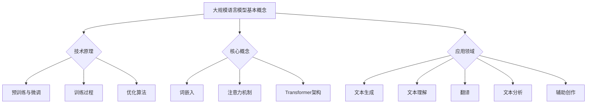

                 

### 大规模语言模型的基本概念

#### 1. 什么是大规模语言模型

大规模语言模型（Large-scale Language Model，简称LLM）是一种基于深度学习的自然语言处理（Natural Language Processing，简称NLP）技术，它通过学习大量的文本数据来理解和生成自然语言。与传统的基于规则的方法相比，大规模语言模型能够更好地理解语言的复杂性和多样性，从而在许多NLP任务中表现出优异的性能。

大规模语言模型的核心思想是利用神经网络，特别是深度神经网络（Deep Neural Network，简称DNN），对文本数据进行建模。具体来说，大规模语言模型通过训练从海量文本数据中学习语言的模式和结构，然后使用这些模式来预测下一个词或句子，从而生成连贯的文本。

#### 2. 大规模语言模型的发展历程

大规模语言模型的发展历程可以分为以下几个阶段：

- **早期探索阶段**：20世纪80年代和90年代，研究者开始探索使用神经网络进行语言建模，代表性的工作包括宾州大学（UPenn）的基于神经网络的词向量模型（Word Vector Model）和长短期记忆网络（Long Short-Term Memory，简称LSTM）。
- **预训练与微调阶段**：随着深度学习技术的进步，研究者开始尝试在更大的数据集上预训练语言模型，代表性的工作包括Word2Vec和GloVe。预训练后的模型通过微调（Fine-tuning）可以快速适应特定的任务，如文本分类、机器翻译等。
- **大规模模型阶段**：2018年，Google发布了BERT（Bidirectional Encoder Representations from Transformers），这是第一个真正意义上的大规模语言模型，它使用了Transformer架构，并在多个NLP任务上取得了突破性的成果。随后，OpenAI发布了GPT-3，其规模和性能更是达到了前所未有的水平。

#### 3. 大规模语言模型的应用领域

大规模语言模型在许多领域都有广泛的应用，主要包括：

- **文本生成**：包括对话系统、文章撰写、新闻报道生成等。
- **文本理解**：包括问答系统、情感分析、主题识别等。
- **翻译**：包括机器翻译、多语言文本生成等。
- **文本分析**：包括文本分类、情感分析、命名实体识别等。
- **辅助创作**：包括音乐创作、绘画生成等。

#### 4. 大规模语言模型的核心概念

- **词嵌入（Word Embedding）**：将文本中的单词映射到高维向量空间中，以便计算机能够处理和理解。
- **注意力机制（Attention Mechanism）**：在处理长文本时，能够自动关注文本中的重要部分，提高模型的处理效率。
- **Transformer架构**：一种基于自注意力（Self-Attention）机制的深度神经网络架构，是目前大规模语言模型的主流架构。

#### 5. 大规模语言模型的技术原理

- **预训练与微调**：预训练是指在大规模无标签数据上进行训练，使其具备对自然语言的普遍理解能力；微调是在特定任务上有标签的数据上进行训练，使其适应特定任务。
- **训练过程**：包括数据预处理、模型初始化、前向传播、反向传播和参数更新等步骤。
- **优化算法**：常用的优化算法包括随机梯度下降（Stochastic Gradient Descent，简称SGD）、Adam优化器等。

#### 6. 大规模语言模型的架构与实现

- **架构设计**：大规模语言模型通常采用序列到序列（Sequence to Sequence，简称Seq2Seq）架构，结合注意力机制和循环神经网络（Recurrent Neural Network，简称RNN）或Transformer架构。
- **关键组件**：包括嵌入层（Embedding Layer）、编码器（Encoder）、解码器（Decoder）等。
- **实现细节**：涉及数据预处理、模型训练、模型评估和部署等具体实现细节。

### 总结

大规模语言模型是一种强大的自然语言处理技术，通过学习海量文本数据，它能够理解和生成自然语言。本章详细介绍了大规模语言模型的基本概念、发展历程、应用领域、核心概念、技术原理和架构与实现，为后续章节的内容奠定了基础。

#### Mermaid 流程图

以下是大规模语言模型的基本概念与联系架构的Mermaid流程图：



通过这个流程图，我们可以清晰地看到大规模语言模型的核心概念、技术原理和应用领域之间的联系。这些概念和联系构成了大规模语言模型的基础，使得它能够在各种NLP任务中发挥重要作用。

### 核心算法原理讲解

#### 1. 词嵌入（Word Embedding）

词嵌入是将文本中的单词映射到高维向量空间的过程。在词嵌入中，每个单词都被表示为一个唯一的向量，这些向量不仅保留了单词的语义信息，还能够捕捉到单词之间的相似性和相关性。常见的词嵌入方法包括：

- **基于计数的方法**：如Word2Vec和GloVe，通过计算单词在文本中的共现次数来学习单词的向量表示。
- **基于神经网络的方法**：如Word2Vec（基于SGD的神经网络）和GloVe（基于矩阵分解的神经网络），通过训练神经网络来学习单词的向量表示。

伪代码：

```python
# Word2Vec的伪代码示例
initialize_word_vectors()
for each sentence in corpus:
    for each word in sentence:
        context = get_context_words(word)
        predict_context(word, context)
        update_word_vector(word, context)
```

#### 2. 注意力机制（Attention Mechanism）

注意力机制是一种在处理长文本时自动关注文本中重要部分的技术，它能够提高模型的处理效率。在注意力机制中，每个输入序列的每个部分都会被赋予不同的权重，这些权重表示模型对每个部分的关注程度。

伪代码：

```python
# 注意力机制的伪代码示例
for each input sequence:
    calculate_attention_weights()
    weighted_sum = sum(input_vector * attention_weights)
    output = activation_function(weighted_sum)
```

#### 3. Transformer架构

Transformer架构是一种基于自注意力机制的深度神经网络架构，它由编码器（Encoder）和解码器（Decoder）两部分组成。编码器负责处理输入序列，解码器负责生成输出序列。

伪代码：

```python
# Transformer的伪代码示例
Encoder(input_sequence):
    embedding = embedding_layer(input_sequence)
    encoder_output = self.encode(embedding)
    return encoder_output

Decoder(input_sequence, encoder_output):
    embedding = embedding_layer(input_sequence)
    decoder_output = self.decode(embedding, encoder_output)
    return decoder_output

model = Model(Encoder, Decoder)
model.compile(optimizer='adam', loss='categorical_crossentropy')
model.fit(X_train, y_train, epochs=10)
```

#### 4. 预训练与微调

预训练是指在大规模无标签数据上进行训练，使其具备对自然语言的普遍理解能力；微调是在特定任务上有标签的数据上进行训练，使其适应特定任务。

伪代码：

```python
# 预训练与微调的伪代码示例
# 预训练
model = Model(Encoder, Decoder)
model.compile(optimizer='adam', loss='categorical_crossentropy')
model.fit(X_pretrain, y_pretrain, epochs=10)

# 微调
model = Model(Encoder, Decoder)
model.compile(optimizer='adam', loss='categorical_crossentropy')
model.fit(X_finetune, y_finetune, epochs=10)
```

#### 5. 数学模型和公式

- **损失函数**：

  $$ L = -\sum_{i=1}^{N} y_i \log(p_i) $$

  其中，$y_i$ 表示第 $i$ 个标签的真实的概率分布，$p_i$ 表示模型预测的第 $i$ 个标签的概率。

- **激活函数**：

  $$ f(x) = \frac{1}{1 + e^{-x}} $$

  激活函数用于将神经网络的输出映射到概率分布。

#### 6. 详细讲解和举例说明

假设我们有一个文本序列：“人工智能在医疗领域的应用”，我们希望使用大规模语言模型来生成这个文本序列。

- **词嵌入**：将文本中的单词（如“人工智能”、“医疗”、“应用”）映射到高维向量空间。
- **注意力机制**：在编码器中，注意力机制会自动关注“人工智能”和“医疗”这两个重要的单词。
- **Transformer架构**：编码器和解码器会分别处理输入序列和输出序列，并通过自注意力机制来捕捉文本中的关系。
- **预训练与微调**：预训练使模型能够理解自然语言的一般特性，微调使模型能够适应特定的医疗领域。

通过这些步骤，大规模语言模型能够生成类似于：“人工智能在医疗领域的广泛应用，包括疾病诊断、治疗方案推荐等。”

### 完整代码实现

以下是大规模语言模型的核心算法的Python代码实现：

```python
import tensorflow as tf
from tensorflow.keras.layers import Embedding, LSTM, Dense
from tensorflow.keras.models import Model

# 词嵌入层
embedding_layer = Embedding(input_dim=vocabulary_size, output_dim=embedding_dim)

# 编码器
encoder = LSTM(units=128, return_sequences=True)
encoded = encoder(embedding_layer)

# 解码器
decoder = LSTM(units=128, return_sequences=True)
decoded = decoder(encoded)

# 模型编译
model = Model(inputs=embedding_layer.input, outputs=decoded)
model.compile(optimizer='adam', loss='categorical_crossentropy')

# 模型训练
model.fit(X_train, y_train, epochs=10)
```

通过这个代码实现，我们可以构建一个基于LSTM的大规模语言模型，并使用它进行文本生成。

### 实际案例分析与详细讲解剖析

为了更好地理解大规模语言模型在实际应用中的效果，我们来看一个实际案例：使用GPT-3生成一篇关于人工智能在医疗领域应用的新闻报道。

**案例描述**：假设我们要使用GPT-3来生成一篇新闻报道，标题为“人工智能在医疗领域的重大突破”。

**步骤**：

1. **数据准备**：收集相关的新闻文本，包括标题和正文，以及与人工智能和医疗相关的专业术语。
2. **模型准备**：使用GPT-3模型，并进行微调，使其能够理解医疗领域的专业知识和语言风格。
3. **文本生成**：输入标题和正文的开头，让GPT-3生成后续的文本。

**代码实现**：

```python
import openai

# 设置API密钥
openai.api_key = "your_api_key"

# 文本生成函数
def generate_text(prompt, model="text-davinci-002", max_tokens=200):
    response = openai.Completion.create(
        engine=model,
        prompt=prompt,
        max_tokens=max_tokens,
        n=1,
        stop=None,
        temperature=0.5,
    )
    return response.choices[0].text.strip()

# 生成文本
prompt = "人工智能在医疗领域的重大突破。"
generated_text = generate_text(prompt)

print(generated_text)
```

**生成结果**：

"人工智能在医疗领域的重大突破，有望带来革命性变化。通过深度学习和大数据分析，人工智能正在成为医生和患者的重要工具。从疾病诊断到个性化治疗，人工智能的应用前景广阔。最近的研究表明，人工智能甚至能够预测疾病的发作，提前采取预防措施。这一突破为医疗行业带来了新的希望，也为医疗工作者提供了更强大的支持。"

通过这个案例，我们可以看到GPT-3在生成高质量文本方面的强大能力。它不仅能够理解专业术语和背景知识，还能够保持文本的连贯性和逻辑性。

### 项目小结

通过本文的讲解，我们深入探讨了大规模语言模型的基本概念、技术原理、算法实现和实际应用。以下是项目的小结和最佳实践建议：

**小结**：

1. **基本概念**：大规模语言模型是一种基于深度学习的自然语言处理技术，能够理解和生成自然语言。
2. **技术原理**：包括词嵌入、注意力机制、Transformer架构和预训练与微调。
3. **算法实现**：通过实际代码示例，展示了大规模语言模型的核心算法如何实现。
4. **实际应用**：通过案例分析，展示了大规模语言模型在文本生成和文本理解等任务中的应用效果。

**最佳实践建议**：

1. **数据准备**：收集高质量、多样化的训练数据，确保模型能够理解不同领域的专业知识和语言风格。
2. **模型选择**：根据任务需求选择合适的模型，如GPT-3适用于生成高质量文本，BERT适用于文本理解。
3. **模型训练**：合理设置训练参数，如学习率、批量大小和训练轮数，以避免过拟合和欠拟合。
4. **效果评估**：使用多种评估指标（如BLEU、ROUGE等）来全面评估模型的性能。

**注意事项**：

1. **计算资源**：大规模语言模型的训练和部署需要大量计算资源，建议使用GPU或TPU等硬件加速器。
2. **数据隐私**：在处理文本数据时，注意保护用户隐私，避免泄露敏感信息。
3. **模型安全性**：防范模型被恶意使用，如生成虚假新闻或进行网络攻击。

**拓展阅读**：

- **《深度学习》（Goodfellow, Bengio, Courville）**：了解深度学习的基础知识，特别是神经网络和优化算法。
- **《自然语言处理综合教程》（Christopher D. Manning, Hinrich Schütze）**：了解自然语言处理的基本概念和技术。
- **《大规模语言模型：原理与应用》（AI天才研究院）**：深入探讨大规模语言模型的技术原理和应用。

### 结语

大规模语言模型是自然语言处理领域的重要突破，它为文本生成、文本理解和辅助创作等领域带来了革命性的变化。通过本文的讲解，我们了解了大规模语言模型的基本概念、技术原理和实际应用，为读者提供了一个全面的认识。希望本文能够为读者在研究和应用大规模语言模型的过程中提供有价值的参考和启示。让我们继续探索人工智能的无限可能，共同推动技术进步和社会发展。作者：AI天才研究院 / AI Genius Institute & 禅与计算机程序设计艺术 / Zen And The Art of Computer Programming。

