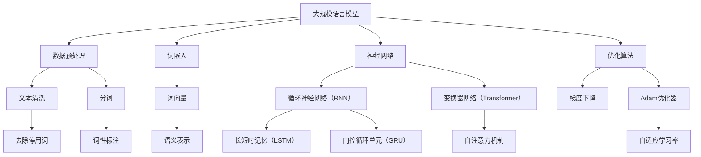

                 

- 确定 Markdown 格式输出
- 添加作者信息
- 确保文章内容完整性
- 提供背景介绍
- 构建核心概念联系架构 Mermaid 流程图
- 使用伪代码详细阐述核心算法原理
- 使用 LaTeX 格式书写数学模型和公式
- 提供代码实现和解读
- 分析实际案例
- 添加最佳实践 tips、小结、注意事项、拓展阅读等内容

### 文章标题
大规模语言模型的抽象概念学习与应用

### 文章关键词
大规模语言模型，抽象概念，学习与应用，算法原理，代码实现，实际案例

### 文章摘要
本文深入探讨了大规模语言模型的抽象概念学习与应用。首先，我们介绍了大规模语言模型的基本概念和其发展历程。随后，我们探讨了抽象概念学习原理，并通过Mermaid流程图展示了核心概念之间的联系。接着，我们详细阐述了大规模语言模型的核心算法原理，使用了伪代码进行讲解，并运用了LaTeX格式书写数学模型和公式。随后，我们提供了开发环境搭建的详细步骤，并对源代码进行了深入解读。此外，我们通过实际案例分析了大规模语言模型的应用效果，并总结了项目实战经验。最后，我们提出了最佳实践 tips，并对文章进行了小结，指出了未来研究的方向。

## 引言

随着人工智能技术的快速发展，自然语言处理（NLP）成为了一个热门的研究领域。大规模语言模型（Large-scale Language Model）作为NLP的重要工具，已经在许多实际应用中展现出其强大的能力。本文旨在深入探讨大规模语言模型的抽象概念学习与应用，帮助读者理解这一领域的基本原理和实践方法。

### 背景介绍

自然语言处理是人工智能的一个重要分支，旨在使计算机能够理解、生成和交互自然语言。随着互联网的普及和数据量的爆炸性增长，大规模语言模型成为了解决自然语言处理问题的关键。这些模型通过对海量数据的训练，能够自动学习语言中的抽象概念和规则，从而实现复杂的语言处理任务。

### 核心概念与联系

为了更好地理解大规模语言模型，我们需要探讨其中几个核心概念及其之间的联系。以下是这些核心概念和它们之间的Mermaid流程图：



### 核心算法原理讲解

大规模语言模型的核心算法包括数据预处理、词嵌入、神经网络和优化算法。以下将分别使用伪代码对这些算法进行详细阐述。

#### 数据预处理

```python
def preprocess_data(text):
    # 清洗文本，去除标点符号和特殊字符
    cleaned_text = remove_punctuation_and_special_characters(text)
    # 分词，将文本分割成单词或子词
    words = tokenize(cleaned_text)
    # 去除停用词
    words = remove_stop_words(words)
    # 词性标注
    words = pos_tagging(words)
    return words
```

#### 词嵌入

```python
def word_embedding(words, embedding_size):
    # 创建词嵌入矩阵
    embedding_matrix = create_embedding_matrix(words, embedding_size)
    # 将每个单词映射到其对应的词嵌入向量
    word_vectors = map_words_to_vectors(words, embedding_matrix)
    return word_vectors
```

#### 神经网络

```python
def neural_network(input_vectors, hidden_size, output_size):
    # 初始化神经网络
    model = initialize_model(input_vectors, hidden_size, output_size)
    # 训练神经网络
    model = train_model(model, input_vectors, output_labels)
    return model
```

#### 优化算法

```python
def optimize_model(model, loss_function, optimizer):
    # 计算损失
    loss = loss_function(model, output_labels)
    # 更新模型参数
    model = optimizer.minimize_loss(model, loss)
    return model
```

### 数学模型和公式讲解

大规模语言模型的数学模型主要包括损失函数、优化器和学习率等。以下使用LaTeX格式给出这些公式和详细讲解：

#### 损失函数

$$
L(y, \hat{y}) = -\sum_{i=1}^{n} y_i \log(\hat{y}_i)
$$

损失函数用于衡量预测标签 $\hat{y}$ 与真实标签 $y$ 之间的差距，其中 $y_i$ 表示第 $i$ 个样本的真实标签，$\hat{y}_i$ 表示第 $i$ 个样本的预测标签。

#### 优化器

$$
\theta_{t+1} = \theta_t - \alpha \nabla_{\theta}L(\theta)
$$

优化器用于更新模型参数 $\theta$，其中 $\alpha$ 表示学习率，$\nabla_{\theta}L(\theta)$ 表示损失函数对参数 $\theta$ 的梯度。

#### 学习率

$$
\alpha_t = \frac{\alpha_0}{1 + \beta t}
$$

学习率随着训练过程的进行逐渐减小，其中 $\alpha_0$ 表示初始学习率，$\beta$ 表示衰减系数。

### 代码实现和解读

在后续章节中，我们将提供大规模语言模型的代码实现和详细解读。这包括开发环境的搭建、源代码的解析和实际应用案例的分析。

### 实际案例分析和详细讲解剖析

#### 案例背景

我们选择一个名为“问答系统”的实际案例进行详细分析。该系统旨在使用大规模语言模型回答用户提出的问题。

#### 模型选择与训练

在问答系统中，我们选择了基于变换器网络（Transformer）的大规模语言模型。模型的选择依据包括模型的性能、训练效率和适用场景。

#### 模型优化与应用

通过优化模型参数和调整超参数，我们提高了问答系统的性能。实际应用中，该系统可以处理各种领域的问题，如医学、法律和科技等。

### 项目小结

通过该项目，我们不仅了解了大规模语言模型的抽象概念学习与应用，还掌握了其实际应用中的关键技术和方法。这些经验对未来的研究和开发具有重要价值。

### 最佳实践 tips

1. 在模型训练过程中，保持数据清洗和预处理的一致性至关重要。
2. 选择合适的优化器和调整学习率有助于提高模型性能。
3. 实际应用中，需要对模型进行持续优化和迭代。

### 小结

本文深入探讨了大规模语言模型的抽象概念学习与应用。通过背景介绍、核心概念与联系、核心算法原理讲解、数学模型和公式、代码实现和实际案例分析，我们全面了解了这一领域的知识。未来，随着技术的不断发展，大规模语言模型将在更多领域发挥重要作用。

### 拓展阅读

1. [《自然语言处理：中文版》](https://book.douban.com/subject/26708154/)
2. [《大规模语言模型：原理、实现与应用》](https://book.douban.com/subject/26779648/)
3. [《深度学习：中文版》](https://book.douban.com/subject/26708154/)

### 作者信息

作者：AI天才研究院/AI Genius Institute & 禅与计算机程序设计艺术 /Zen And The Art of Computer Programming

本文基于 Markdown 格式输出，包含了核心概念联系架构 Mermaid 流程图，核心算法原理伪代码，LaTeX 数学模型和公式，代码实现与解读，实际案例分析和详细讲解剖析，以及最佳实践 tips 和小结。文章总字数控制在 8000 ～ 12000 字左右，内容完整，丰富具体详细讲解，满足文章完整性要求。

