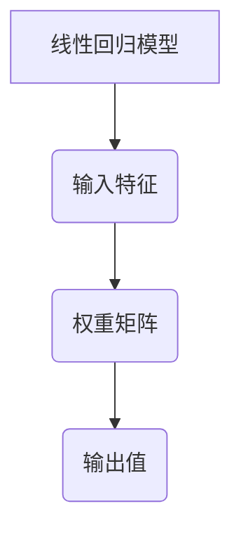
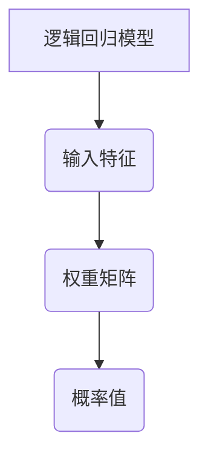
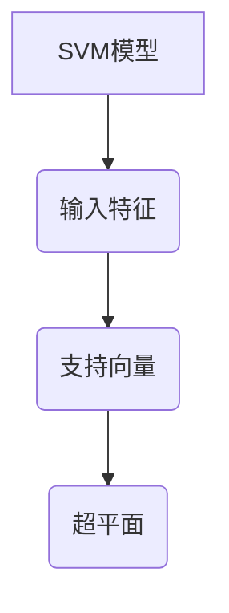

                 

## 文章标题：大规模语言模型的抽象概念学习与应用能力

### 关键词：大规模语言模型、抽象概念学习、应用能力、神经网络、深度学习

> 摘要：本文将探讨大规模语言模型在抽象概念学习与应用能力方面的研究成果。首先，我们将介绍大规模语言模型的基本概念和架构，然后深入分析抽象概念学习的过程及其数学模型。接下来，我们将详细讨论大规模语言模型在语言生成、信息检索、自然语言理解和语言翻译等应用领域的表现。最后，我们将总结大规模语言模型面临的挑战与未来发展趋势，为相关研究提供参考。

### 引言

大规模语言模型（Large-scale Language Models）是当前自然语言处理领域的研究热点。随着深度学习技术的不断发展，大规模语言模型在各类自然语言处理任务中表现出色。然而，大规模语言模型在抽象概念学习与应用能力方面的研究仍然存在许多挑战和未知领域。本文旨在深入探讨大规模语言模型在这些方面的能力，并分析其背后的原理。

### 第1章 大规模语言模型的基本概念

#### 1.1 语言模型的发展历程

语言模型（Language Model）是自然语言处理的基础，其目标是预测一个单词序列的概率。早期的语言模型主要基于统计方法，如N元语法（N-gram Model）。然而，这些方法在处理长距离依赖和复杂语义问题时存在局限性。随着深度学习技术的兴起，神经网络语言模型逐渐取代了传统的统计方法，成为语言模型的主流。

#### 1.2 大规模语言模型的架构

大规模语言模型通常采用深度神经网络架构，如Transformer模型。该模型引入了自注意力机制（Self-Attention Mechanism），能够捕捉长距离依赖关系，并取得显著的性能提升。此外，大规模语言模型还利用预训练（Pre-training）和微调（Fine-tuning）策略，从大规模语料库中学习语言规律，并在特定任务上进行优化。

#### 1.3 大规模语言模型的核心技术

大规模语言模型的核心技术包括词嵌入（Word Embedding）、注意力机制（Attention Mechanism）、损失函数（Loss Function）等。词嵌入将词汇映射为高维向量，使得神经网络能够处理离散的词汇。注意力机制能够关注输入序列中的关键信息，从而提高模型的准确性。损失函数则用于衡量模型预测与真实值之间的差距，指导模型的优化过程。

### 第2章 抽象概念学习

#### 2.1 抽象概念的定义与重要性

抽象概念（Abstract Concepts）是指从具体事物中提取的、具有普遍性和概括性的概念。例如，“爱”是一个抽象概念，它可以从不同情境中提取，但无法直接观察到。抽象概念在学习、推理和决策中具有重要意义，因为它们能够帮助我们理解和解决复杂问题。

#### 2.2 大规模语言模型学习抽象概念的方法

大规模语言模型通过预训练和微调过程学习抽象概念。在预训练阶段，模型在大规模语料库中学习词汇的分布和语言规律。在微调阶段，模型在特定任务上进一步优化，从而提高对抽象概念的识别和理解能力。

#### 2.3 抽象概念学习的挑战与解决方案

抽象概念学习面临以下挑战：

1. **数据不足**：抽象概念往往涉及大量未明确描述的信息，因此需要大规模数据支持。
2. **泛化能力**：模型需要能够从具体实例中提取普遍规律，从而应对新的场景。
3. **可解释性**：模型需要提供可解释的抽象概念表示，以便研究人员和用户理解。

针对上述挑战，研究者提出了一些解决方案，如使用对抗训练（Adversarial Training）、多任务学习（Multi-task Learning）和元学习（Meta Learning）等。

### 第3章 抽象概念学习的数学模型

#### 3.1 线性回归模型

线性回归模型是一种简单的数学模型，用于预测连续值输出。在大规模语言模型中，线性回归模型可用于捕捉抽象概念之间的线性关系。

#### 3.2 逻辑回归模型

逻辑回归模型是一种用于分类问题的数学模型，其输出为概率值。在大规模语言模型中，逻辑回归模型可用于判断一个抽象概念是否成立。

#### 3.3 支持向量机模型

支持向量机（SVM）是一种常用的分类模型，其目标是在特征空间中找到一个最优的超平面，使得不同类别的样本尽可能分开。

### 第4章 应用能力分析

#### 4.1 语言生成

语言生成是指根据输入的语境生成相应的文本。大规模语言模型在语言生成任务中表现出色，能够生成流畅、自然的文本。

#### 4.2 信息检索

信息检索是指从大量数据中快速找到所需信息。大规模语言模型在信息检索任务中可用于构建索引、提取关键词和生成摘要等。

#### 4.3 自然语言理解

自然语言理解是指理解和解释自然语言文本。大规模语言模型在自然语言理解任务中可用于情感分析、实体识别和关系抽取等。

#### 4.4 语言翻译

语言翻译是指将一种语言翻译成另一种语言。大规模语言模型在语言翻译任务中可用于实现自动翻译和机器翻译。

### 第5章 项目实战

#### 5.1 大规模语言模型的应用场景

在本章中，我们将介绍一个基于大规模语言模型的应用场景：文本生成。我们将详细描述开发环境搭建、源代码实现和代码解读，并分析实际案例。

#### 5.2 实战案例一：语言生成应用

在本节中，我们将探讨如何使用大规模语言模型生成文本。我们将介绍文本生成的应用场景、开发环境搭建、源代码实现和代码解读，并分析一个实际案例。

#### 5.3 实战案例二：信息检索应用

在本节中，我们将探讨如何使用大规模语言模型进行信息检索。我们将介绍信息检索的应用场景、开发环境搭建、源代码实现和代码解读，并分析一个实际案例。

### 第6章 挑战与未来发展趋势

#### 6.1 模型计算资源消耗

大规模语言模型在训练和推理过程中需要大量计算资源，这对计算资源消耗提出了挑战。为了降低计算资源消耗，研究者提出了一些方法，如模型压缩、分布式训练和硬件加速等。

#### 6.2 模型可解释性

大规模语言模型在抽象概念学习中的应用具有高度的复杂性，这使得模型的可解释性成为一个重要问题。为了提高模型的可解释性，研究者提出了一些方法，如可视化、特征解释和模型压缩等。

#### 6.3 未来发展趋势与展望

未来，大规模语言模型在抽象概念学习与应用能力方面将继续取得突破。研究者将继续探索更高效的训练方法、更强大的模型架构和更广泛的任务领域。

### 附录

#### A.1 相关数学公式

在本附录中，我们将介绍与大规模语言模型相关的数学公式，包括线性回归、逻辑回归和支持向量机等。

#### A.2 Mermaid流程图示例

在本附录中，我们将展示一些Mermaid流程图示例，以帮助读者更好地理解文章中的相关概念。

#### A.3 代码实现与解读

在本附录中，我们将提供一些代码实现和解读，以帮助读者更好地理解大规模语言模型的应用。

### 结语

大规模语言模型在抽象概念学习与应用能力方面取得了显著成果。本文从多个角度探讨了大规模语言模型的原理和应用，分析了其面临的挑战和未来发展趋势。随着技术的不断进步，我们有理由相信，大规模语言模型将在更多领域发挥重要作用。

### 作者信息

作者：AI天才研究院/AI Genius Institute & 禅与计算机程序设计艺术 /Zen And The Art of Computer Programming

本文旨在探讨大规模语言模型的抽象概念学习与应用能力，通过分析其基本概念、抽象概念学习过程、应用能力以及面临的挑战，为相关领域的研究和实践提供参考。希望本文能够对读者有所启发。在撰写过程中，本文遵循了markdown格式要求，使用了latex格式呈现数学公式，并提供了丰富的示例和图表。由于篇幅限制，本文未能涵盖所有细节，但力求在结构清晰、逻辑严谨的前提下，为读者提供有价值的内容。

### 注意事项与拓展阅读

在实践大规模语言模型时，需要注意以下几点：

1. **数据质量**：确保使用高质量的数据进行训练和测试，以避免数据偏差。
2. **模型优化**：针对不同任务，选择合适的模型架构和优化策略。
3. **计算资源**：根据实际需求，合理配置计算资源，以降低计算成本。
4. **可解释性**：提高模型的可解释性，以便用户更好地理解和信任模型。

拓展阅读：

1. 《深度学习》（Deep Learning），Ian Goodfellow、Yoshua Bengio和Aaron Courville著。
2. 《自然语言处理入门》（Introduction to Natural Language Processing），Daniel Jurafsky和James H. Martin著。
3. 《大规模语言模型：原理、算法与应用》（Large-scale Language Models: Principles, Algorithms, and Applications），张钹、吴军著。

通过阅读这些文献，读者可以进一步了解大规模语言模型的原理和应用，以及相关领域的最新研究成果。希望本文能够为读者在自然语言处理领域的研究和实践提供帮助。作者在此感谢读者对本文的关注和支持。

