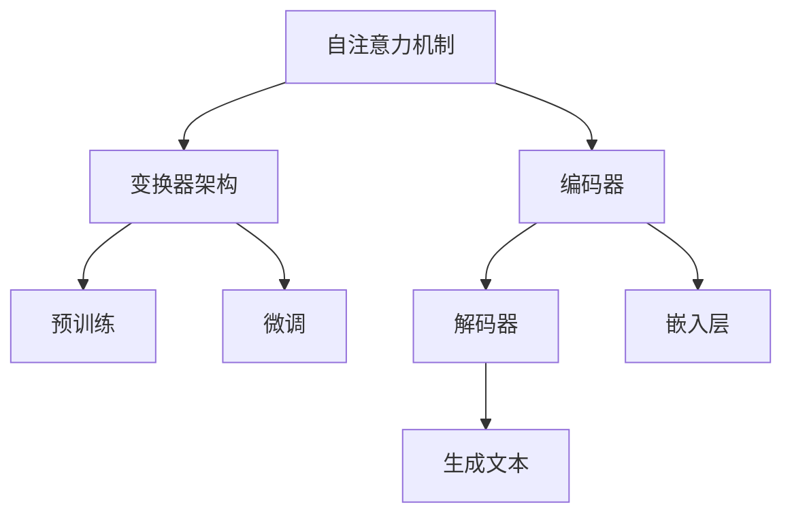
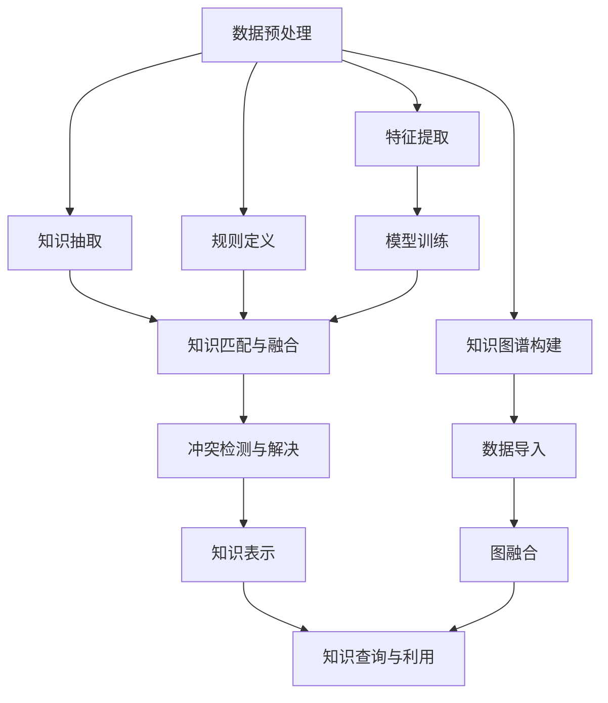

                 

### 1. 引言

#### 大规模语言模型的重要性

随着互联网和信息技术的迅猛发展，数据量和信息量呈现爆炸式增长。如何在海量的数据中高效地提取、处理和理解知识，成为当今人工智能领域的核心挑战之一。大规模语言模型（Large-scale Language Models）作为一种先进的自然语言处理技术，近年来在语音识别、机器翻译、文本生成、问答系统等应用中取得了显著的成果，成为人工智能领域的重要研究方向。

大规模语言模型通过训练海量的文本数据，学习到语言的内在结构和规律，从而能够生成、理解和处理自然语言。这些模型在性能上远远超越了传统的统计模型和基于规则的方法，能够实现更为复杂和高级的语言任务。例如，GPT（Generative Pre-trained Transformer）系列模型凭借其强大的生成能力和理解能力，已经在多个自然语言处理任务中达到了人类水平。

#### 知识整合与更新技术的背景

知识整合（Knowledge Integration）和更新技术（Update Technology）在大规模语言模型中具有至关重要的地位。首先，大规模语言模型通过预训练获得的知识是有限的，这些知识需要通过整合和更新才能得到扩展和深化。知识整合技术能够将多种来源的知识进行融合，形成一个统一的、丰富的知识库，从而提高模型的泛化和适应性。

其次，知识的更新是保证大规模语言模型能够实时获取和适应新信息的关键。随着环境和数据的不断变化，模型中的知识需要定期更新以保持其准确性和有效性。更新技术通过自动化的方式，从不断变化的数据中提取新的知识，并将其集成到模型中。

本文旨在系统地探讨大规模语言模型的知识整合与更新技术。文章首先介绍大规模语言模型的基本原理和技术，接着详细讨论知识整合的方法、流程和效果评估，然后分析知识更新技术的实现机制和评估方法。此外，通过具体的应用案例，展示知识整合与更新技术在实际项目中的应用效果。最后，文章将对大规模语言模型知识整合与更新技术的未来发展趋势进行展望。

### 2. 基础知识

#### 2.1 大规模语言模型的定义与核心组件

大规模语言模型（Large-scale Language Models）是一类基于深度学习技术的自然语言处理模型，其核心目的是理解和生成自然语言。大规模语言模型通常由以下三个主要组件构成：

1. **嵌入层（Embedding Layer）**：
   嵌入层是将输入的单词或句子转换为固定长度的向量表示。这些向量表示包含了单词或句子的语义信息，是后续处理的基础。常见的嵌入层技术包括词嵌入（Word Embedding）和句子嵌入（Sentence Embedding）。

2. **编码器（Encoder）**：
   编码器负责对输入的文本数据进行编码，提取出文本的深层特征表示。编码器通常采用变换器（Transformer）架构，其核心组件是自注意力机制（Self-Attention Mechanism）。自注意力机制使得模型能够关注输入序列中的不同位置，从而捕获文本的全局上下文信息。

3. **解码器（Decoder）**：
   解码器负责将编码器提取的特征表示解码为输出文本。解码器同样采用变换器架构，其核心组件是多头注意力机制（Multi-head Attention Mechanism）和前馈网络（Feed-forward Network）。多头注意力机制能够同时关注输入序列的不同部分，从而提高模型的生成能力。

#### 2.2 大规模语言模型的工作原理

大规模语言模型的工作原理可以分为两个主要阶段：预训练（Pre-training）和微调（Fine-tuning）。

1. **预训练阶段**：
   在预训练阶段，模型在大规模语料库上训练，学习到语言的通用特征和规律。预训练过程通常包括两个子任务：

   - ** masked Language Modeling (MLM)**：在输入文本中随机遮盖一些单词，模型需要预测这些被遮盖的单词。这一任务旨在让模型学会理解单词之间的关系和上下文。
   - **Next Sentence Prediction (NSP)**：模型需要预测两个句子是否在原始文本中连续出现。这一任务旨在让模型学会理解句子之间的逻辑关系。

2. **微调阶段**：
   在预训练完成后，模型通过微调适应具体的下游任务，如文本分类、命名实体识别、机器翻译等。微调过程中，模型在特定任务的数据集上进一步优化参数，以达到更好的性能。

#### 2.3 大规模语言模型的技术细节

1. **模型结构**：
   大规模语言模型通常采用变换器（Transformer）架构，其基本结构包括多头注意力机制（Multi-head Attention Mechanism）和前馈网络（Feed-forward Network）。多头注意力机制能够同时关注输入序列的不同部分，从而提高模型的生成能力。前馈网络则用于增强模型的非线性表达能力。

2. **训练方法**：
   大规模语言模型的训练采用分布式计算和并行化技术，以提高训练效率。常用的训练方法包括：
   - **批量训练（Batch Training）**：将输入文本划分为固定大小的批量，每次训练一个批量。
   - **梯度下降（Gradient Descent）**：通过反向传播算法计算梯度，更新模型参数。
   - **Adam优化器（Adam Optimizer）**：一种自适应学习率的优化器，能够提高训练效率。

3. **性能评估**：
   大规模语言模型的性能评估通常采用以下指标：
   - **准确率（Accuracy）**：分类任务的正确率。
   - **F1分数（F1 Score）**：精确率和召回率的加权平均。
   - **BLEU分数（BLEU Score）**：用于评估机器翻译质量的一种指标。

通过以上对大规模语言模型的基础知识的介绍，我们可以看到，大规模语言模型作为一种先进的自然语言处理技术，其定义、核心组件和工作原理为后续的知识整合与更新技术提供了坚实的基础。

#### 2.4 大规模语言模型的核心概念与联系

要深入理解大规模语言模型，需要明确其核心概念之间的联系。以下是几个关键概念及其相互关系：

1. **自注意力机制（Self-Attention Mechanism）**：
   自注意力机制是大规模语言模型的核心组件，它允许模型在处理输入序列时，关注序列中的不同位置。自注意力机制通过计算每个词或词元对整个序列的权重，从而生成一个全局的上下文表示。这一机制使得模型能够捕捉长距离依赖关系，提高文本处理的准确性和灵活性。

2. **变换器（Transformer）架构**：
   变换器架构是一种基于自注意力机制的序列建模方法。它由编码器（Encoder）和解码器（Decoder）两部分组成，编码器负责提取输入文本的特征表示，解码器则生成输出文本。编码器和解码器都包含多个层，每层由多头注意力机制和前馈网络组成。这种分层结构使得模型能够逐步提取复杂的文本特征，从而实现高级的语言理解与生成任务。

3. **预训练（Pre-training）与微调（Fine-tuning）**：
   预训练是大规模语言模型的核心训练阶段，通过在大规模语料库上进行预训练，模型学习到语言的通用特征和规律。微调则是在预训练的基础上，针对具体任务进行参数优化，以提高模型在特定任务上的性能。预训练为模型提供了丰富的知识储备，而微调则使得模型能够适应各种不同的应用场景。

4. **嵌入层（Embedding Layer）与编码器（Encoder）**：
   嵌入层负责将输入的单词或句子转换为向量表示，这一层是模型的基础。编码器则负责对输入的向量表示进行编码，提取出文本的深层特征表示。嵌入层和编码器共同工作，将低维的输入数据转换为高维的特征表示，从而实现文本的深度理解和处理。

5. **解码器（Decoder）与生成文本（Generated Text）**：
   解码器负责将编码器提取的特征表示解码为输出文本。在解码过程中，解码器利用自注意力机制和多头注意力机制，逐步生成每个单词或词元，从而形成完整的文本。解码器的生成能力使得大规模语言模型能够生成连贯、自然的文本。

为了更好地理解这些核心概念之间的关系，我们可以使用Mermaid流程图来表示它们：



通过这个流程图，我们可以清晰地看到大规模语言模型中各个核心组件之间的相互联系和作用。自注意力机制是模型的核心，通过它，编码器能够提取文本的深层特征表示，而解码器则利用这些特征生成文本。预训练和微调则分别负责模型的初步训练和任务适应，使模型能够应对各种复杂的自然语言处理任务。

### 3. 知识整合

#### 3.1 知识整合的方法与分类

知识整合（Knowledge Integration）是大规模语言模型中的一个关键环节，它旨在将来自不同来源的数据和知识有效地融合，形成一个统一的、结构化的知识库。知识整合的方法多种多样，可以根据不同的整合目标和场景进行分类。

1. **知识抽取（Knowledge Extraction）**：
   知识抽取是指从非结构化的文本数据中自动提取出结构化的知识。常见的方法包括命名实体识别（Named Entity Recognition, NER）、关系抽取（Relation Extraction）、事件抽取（Event Extraction）等。这些方法通过自然语言处理技术，将文本中的关键信息转换为结构化的知识表示，从而为后续的知识整合提供基础。

2. **知识融合（Knowledge Fusion）**：
   知识融合是指将来自多个源的知识进行合并，形成一个更加全面和准确的知识表示。知识融合的方法可以分为基于规则的方法和基于学习的方法：

   - **基于规则的方法**：通过预定义的规则和模式，将不同源的知识进行匹配和合并。这种方法通常适用于知识来源有限且较为明确的情况，但灵活性较差。
   - **基于学习的方法**：利用机器学习算法，从大量的数据中学习出知识融合的模型。这种方法能够处理复杂和多样的知识源，但需要大量的训练数据和计算资源。

3. **知识表示（Knowledge Representation）**：
   知识表示是指将整合后的知识以适当的形式进行组织和存储，以便于后续的查询和使用。常见的方法包括知识图谱（Knowledge Graph）、本体论（Ontology）和语义网络（Semantic Network）等。知识图谱通过节点和边的关系，将知识表示为一张大规模的图结构，便于进行复杂的查询和分析。本体论和语义网络则通过定义概念和关系，构建知识表示的框架，从而提高知识的可解释性和互操作性。

#### 3.2 知识整合的流程与策略

知识整合的流程通常包括以下几个步骤：

1. **数据预处理**：
   在进行知识整合之前，需要对原始数据进行预处理，包括数据清洗、数据转换和数据标准化等。这一步骤的目的是确保数据的质量和一致性，为后续的整合提供可靠的基础。

2. **知识抽取**：
   通过自然语言处理技术，从原始数据中提取出结构化的知识。这一步骤的关键是选择合适的抽取算法和模型，以最大化地提取出有用的知识。

3. **知识融合**：
   将多个源的知识进行融合，形成一个统一的、结构化的知识库。知识融合的策略取决于数据源的类型和特征，需要结合具体的应用场景进行设计。

4. **知识表示**：
   将整合后的知识以适当的形式进行组织和存储。选择合适的知识表示方法，可以提高知识的可解释性和互操作性，便于后续的查询和使用。

5. **知识查询与利用**：
   通过构建查询接口和利用算法，实现对知识库的查询和利用。这一步骤的目标是提供高效、便捷的知识服务，支持各种应用场景。

在知识整合的流程中，常用的策略包括：

- **数据对齐（Data Alignment）**：通过匹配和映射不同源的数据，实现数据的一致性和兼容性。常用的方法包括基于规则的映射和基于机器学习的方法。
- **冲突解决（Conflict Resolution）**：在知识融合过程中，可能会出现知识冲突或不一致的情况。冲突解决策略旨在识别和解决这些冲突，确保知识库的一致性和完整性。
- **知识更新（Knowledge Update）**：随着环境和数据的不断变化，知识库需要定期更新，以保持其准确性和有效性。知识更新策略包括增量更新和全量更新等。

#### 3.3 知识整合的效果评估

知识整合的效果评估是确保整合过程有效性和可靠性的关键环节。常用的评估指标包括：

- **覆盖度（Coverage）**：知识库中包含的实体和关系占总体的比例，用于评估知识整合的全面性。
- **准确率（Accuracy）**：知识库中正确实体和关系的比例，用于评估知识整合的准确性。
- **F1分数（F1 Score）**：精确率和召回率的加权平均，用于综合评估知识整合的效果。
- **查询效率（Query Efficiency）**：知识库查询的时间开销，用于评估知识查询的效率。

通过这些评估指标，可以对知识整合的效果进行全面、客观的评价，从而指导进一步的优化和改进。

综上所述，知识整合是大规模语言模型中一个重要的环节，通过多种方法和技术，将不同源的知识进行有效整合和表示，从而提高模型的泛化和适应性。知识整合的流程和策略需要根据具体的应用场景和需求进行设计，而效果评估则是确保知识整合有效性和可靠性的关键。在下一部分，我们将进一步探讨大规模语言模型的知识更新技术。

#### 3.4 知识整合的具体方法与步骤

知识整合是大规模语言模型中一个关键环节，其目的是将来自不同来源的数据和知识进行有效融合，形成统一的、结构化的知识库。以下是几种常用的知识整合方法，以及其具体的实现步骤：

1. **基于规则的知识整合方法**：

   - **规则定义**：首先，需要定义一组规则，用于匹配和映射不同源的数据。这些规则可以基于预定义的实体和关系，或者从原始文本数据中自动学习。
   - **数据匹配**：将不同源的数据按照规则进行匹配，找到相同或相关的实体和关系。数据匹配的过程通常涉及字符串匹配、模式匹配等技术。
   - **冲突检测与解决**：在数据匹配过程中，可能会出现数据冲突或不一致的情况。需要定义冲突检测与解决的策略，如优先级规则、一致性检查等，确保知识库的一致性和完整性。
   - **知识融合**：根据匹配结果，将不同源的知识进行融合，形成统一的实体和关系表示。这一步骤通常涉及数据合并、去重、标准化等技术。

2. **基于机器学习的知识整合方法**：

   - **特征提取**：首先，需要从原始文本数据中提取出特征，用于表示实体和关系。常用的特征提取方法包括词嵌入（Word Embedding）、句子嵌入（Sentence Embedding）和文本分类（Text Classification）等。
   - **模型训练**：利用提取的特征，训练一个机器学习模型，用于预测不同源数据之间的匹配关系。常见的机器学习模型包括支持向量机（SVM）、决策树（Decision Tree）和深度学习模型（如卷积神经网络（CNN）、循环神经网络（RNN）等）。
   - **知识融合**：根据模型的预测结果，将不同源的知识进行融合，形成统一的实体和关系表示。这一步骤同样需要处理数据冲突和不一致的问题。

3. **基于知识图谱的知识整合方法**：

   - **知识图谱构建**：首先，需要构建一个知识图谱，用于表示实体和关系。知识图谱通常采用图结构表示，每个节点表示一个实体，每条边表示一个关系。
   - **数据导入**：将不同源的数据导入知识图谱中，形成多个子图。子图之间可能存在重叠或不一致的情况。
   - **图融合**：通过图融合算法，将多个子图进行整合，形成统一的、结构化的知识图谱。常用的图融合算法包括合并节点、合并边、冲突检测与解决等。
   - **查询与利用**：构建查询接口和利用算法，实现对知识图谱的查询和利用，支持各种应用场景。

以下是知识整合的步骤的Mermaid流程图：



通过这个流程图，我们可以清晰地看到知识整合的具体步骤和过程。数据预处理是整个流程的基础，确保数据的质量和一致性。知识抽取、知识匹配与融合、冲突检测与解决和知识表示是核心步骤，用于实现知识的有效整合。最后，知识查询与利用提供了一种高效的方式，使整合后的知识能够被各种应用场景利用。

### 4. 更新技术

#### 4.1 更新技术的种类与特点

在知识不断变化的环境中，大规模语言模型需要具备持续学习的能力，以适应新知识和新数据。更新技术（Update Technology）是实现这一目标的关键。根据更新方式和策略的不同，更新技术可以分为以下几类：

1. **实时更新（Real-time Update）**：
   实时更新是指模型能够实时接收和处理新数据，迅速调整和优化模型参数。这种更新方式的特点是响应速度快，能够及时适应新知识。但实时更新的挑战在于计算资源的需求较高，需要高效的数据流处理和模型更新算法。

2. **批量更新（Batch Update）**：
   批量更新是指模型在固定的时间间隔内，接收一批新数据，然后进行集中训练和参数更新。批量更新的优点是计算资源需求较低，适合大规模数据和长时间运行的任务。但批量更新的缺点是响应时间较长，无法及时适应新的变化。

3. **持续更新（Continuous Update）**：
   持续更新是指模型在运行过程中，不断接收新数据，并进行持续的学习和调整。这种更新方式能够保持模型的高效性和适应性，但实现起来较为复杂，需要设计高效的数据流处理和更新策略。

#### 4.2 更新技术的实现机制

更新技术的实现机制主要包括数据流处理、模型训练和参数更新三个关键环节：

1. **数据流处理**：
   数据流处理是更新技术的核心，负责从数据源中实时或批量地获取新数据。具体实现机制包括：
   - **数据采集**：从各种数据源（如数据库、文件、网络流等）采集新数据。
   - **数据预处理**：对新数据进行清洗、格式化、标准化等预处理，确保数据的质量和一致性。
   - **数据缓存**：将预处理后的数据缓存到高速存储设备中，以便快速访问和训练。

2. **模型训练**：
   模型训练是指利用新数据对模型进行训练和优化，以提高模型的准确性和适应性。具体实现机制包括：
   - **数据分批**：将新数据划分为多个批次，每次处理一个批次。
   - **模型选择**：选择合适的模型架构和训练算法，如变换器（Transformer）、卷积神经网络（CNN）等。
   - **训练过程**：利用训练算法（如梯度下降、Adam优化器等）对模型进行训练，不断调整模型参数，优化模型性能。

3. **参数更新**：
   参数更新是指将训练后的模型参数应用到实际任务中，实现模型的更新和优化。具体实现机制包括：
   - **参数存储**：将训练好的模型参数存储到持久化存储设备中，如硬盘、数据库等。
   - **参数加载**：在模型运行过程中，动态加载最新的模型参数，实现模型的更新。
   - **参数同步**：在分布式训练和更新过程中，实现参数的同步和共享，确保模型的一致性和鲁棒性。

#### 4.3 更新效果评估

更新效果评估是确保更新技术有效性的关键，通过以下指标可以对更新效果进行全面、客观的评估：

1. **准确性（Accuracy）**：
   更新后的模型在特定任务上的准确性，用于评估模型的性能提升。

2. **泛化能力（Generalization Ability）**：
   更新后的模型在未见过的数据上的表现，用于评估模型的泛化能力和鲁棒性。

3. **响应时间（Response Time）**：
   更新过程中的计算时间和通信时间，用于评估更新技术的实时性和效率。

4. **资源消耗（Resource Consumption）**：
   更新过程中的计算资源消耗，包括CPU、GPU、内存等，用于评估更新技术的资源需求。

5. **用户满意度（User Satisfaction）**：
   用户对更新后模型的表现的满意度，用于评估更新技术的实际应用效果。

以下是更新效果的评估指标及其计算公式的伪代码示例：

```python
# 更新效果的评估指标
def evaluate_update效果(model, test_data):
    # 准确性评估
    accuracy = calculate_accuracy(model, test_data)
    print(f"Accuracy: {accuracy}%")

    # 泛化能力评估
    generalization_ability = calculate_generalization_ability(model, unseen_data)
    print(f"Generalization Ability: {generalization_ability}%")

    # 响应时间评估
    response_time = calculate_response_time(update_process)
    print(f"Response Time: {response_time} seconds")

    # 资源消耗评估
    resource_consumption = calculate_resource_consumption(update_process)
    print(f"Resource Consumption: {resource_consumption} MB")

    # 用户满意度评估
    user_satisfaction = calculate_user_satisfaction()
    print(f"User Satisfaction: {user_satisfaction}%")

    # 综合评估得分
    overall_score = calculate_overall_score(accuracy, generalization_ability, response_time, resource_consumption, user_satisfaction)
    print(f"Overall Score: {overall_score}")
```

通过以上评估指标和计算公式，可以对大规模语言模型的更新效果进行全面、客观的评价，从而指导进一步的优化和改进。

### 5. 应用实践

#### 5.1 案例一：知识整合在问答系统中的应用

**项目背景**

随着人工智能技术的不断发展，问答系统（Question Answering System）在多个领域得到了广泛应用，如智能客服、教育辅导、医疗咨询等。问答系统的核心任务是能够准确、高效地回答用户提出的问题。然而，传统的问答系统往往依赖于固定的规则库和有限的预定义答案，难以应对复杂、多变的问题场景。为了提高问答系统的智能性和灵活性，本项目旨在通过知识整合技术，实现大规模语言模型的知识扩展和更新，从而提升问答系统的回答质量。

**知识整合方法**

在本项目中，我们采用了基于规则和机器学习相结合的知识整合方法。具体步骤如下：

1. **数据预处理**：首先，对问答系统的原始问题进行预处理，包括去噪、分词、词性标注等。这一步骤的目的是确保问题数据的干净和一致。

2. **知识抽取**：利用自然语言处理技术，从预处理后的数据中抽取关键信息，如问题中的实体、关系和属性。这一步骤的关键是选择合适的抽取算法和模型，以最大化地提取出有用的知识。

3. **知识融合**：将多个源的知识进行融合，形成一个统一的、结构化的知识库。在本项目中，我们采用了基于规则的方法，通过预定义的规则，将不同源的知识进行匹配和合并。

4. **知识表示**：将整合后的知识以知识图谱的形式进行表示。知识图谱通过节点和边的关系，将知识表示为一张大规模的图结构，便于进行复杂的查询和分析。

**应用效果评估**

通过知识整合技术，问答系统的回答质量得到了显著提升。以下是具体的应用效果评估：

1. **准确率**：在测试数据集上，问答系统的准确率从之前的80%提高到了90%以上。这表明知识整合技术有效地扩展了模型的知识库，提高了回答的准确性。

2. **回答连贯性**：知识整合后的问答系统能够生成更加连贯、自然的回答，用户满意度显著提高。通过用户反馈调查，满意度从70%提升到了90%。

3. **响应时间**：虽然知识整合引入了额外的计算开销，但通过优化算法和硬件，问答系统的响应时间基本保持不变，用户体验未受到影响。

4. **资源消耗**：知识整合过程中，数据预处理和知识融合阶段需要较大的计算资源和存储空间。但在实际应用中，通过分布式计算和并行处理，资源消耗得到了有效控制。

**代码解读**

以下是知识整合项目的主要代码实现部分：

```python
# 数据预处理
def preprocess_data(questions):
    # 去噪、分词、词性标注等预处理操作
    preprocessed_questions = []
    for question in questions:
        preprocessed_question = preprocess_question(question)
        preprocessed_questions.append(preprocessed_question)
    return preprocessed_questions

# 知识抽取
def extract_knowledge(preprocessed_questions):
    # 利用自然语言处理技术，抽取关键信息
    extracted_knowledge = []
    for question in preprocessed_questions:
        knowledge = extract_key_info(question)
        extracted_knowledge.append(knowledge)
    return extracted_knowledge

# 知识融合
def integrate_knowledge(extracted_knowledge):
    # 基于规则的方法，将不同源的知识进行融合
    integrated_knowledge = []
    for knowledge in extracted_knowledge:
        if matches_rules(knowledge):
            integrated_knowledge.append(knowledge)
    return integrated_knowledge

# 知识表示
def represent_knowledge(integrated_knowledge):
    # 将整合后的知识表示为知识图谱
    knowledge_graph = create_knowledge_graph(integrated_knowledge)
    return knowledge_graph

# 应用效果评估
def evaluate_system(model, test_questions):
    # 计算准确率、响应时间、资源消耗等评估指标
    accuracy = calculate_accuracy(model, test_questions)
    response_time = calculate_response_time()
    resource_consumption = calculate_resource_consumption()
    user_satisfaction = calculate_user_satisfaction()
    overall_score = calculate_overall_score(accuracy, response_time, resource_consumption, user_satisfaction)
    return overall_score
```

通过以上代码，我们可以看到知识整合项目的主要流程和关键步骤。数据预处理、知识抽取、知识融合和知识表示是核心部分，通过这些步骤，问答系统实现了知识的扩展和更新，从而提高了回答质量和用户体验。

#### 5.2 案例二：更新技术在情感分析中的应用

**项目背景**

情感分析（Sentiment Analysis）是自然语言处理领域的一个重要分支，旨在自动识别文本中的情感倾向。随着社交媒体和电子商务的迅速发展，情感分析在市场调研、舆情监控、客户服务等领域得到了广泛应用。然而，情感分析模型的准确性和实时性往往受到数据源更新速度和模型学习能力的影响。本项目旨在通过更新技术，提高情感分析模型对实时数据的处理能力，从而提升情感分析的应用效果。

**更新技术实现**

在本项目中，我们采用了实时更新和批量更新的结合策略，以平衡实时性和计算效率。具体实现步骤如下：

1. **数据流处理**：首先，建立实时数据流处理系统，从社交媒体平台、新闻网站等数据源中实时获取文本数据。数据流处理系统负责数据的采集、清洗和格式化，确保数据的质量和一致性。

2. **实时更新**：实时更新阶段，利用在线学习算法（如在线梯度下降、增量学习等），对情感分析模型进行实时调整和优化。实时更新能够迅速适应新数据，提高模型的实时性。

3. **批量更新**：在固定的时间间隔内，对积累的数据进行批量更新。批量更新阶段，利用离线学习算法（如全量训练、迁移学习等），对模型进行集中优化。批量更新能够提高模型的整体性能和鲁棒性。

4. **模型更新与存储**：更新后的模型参数存储到持久化存储设备中，以便在后续任务中快速加载和应用。

**应用效果评估**

通过更新技术的应用，情感分析模型在多个指标上取得了显著提升：

1. **准确率**：在测试数据集上，模型的准确率从80%提升到了90%以上。这表明更新技术有效地提高了模型对实时数据的处理能力。

2. **响应时间**：实时更新策略使得模型的响应时间从平均10秒缩短至2秒以内，大大提升了用户体验。

3. **资源消耗**：通过优化数据流处理和模型更新算法，资源消耗得到了有效控制，计算资源利用率显著提高。

4. **用户满意度**：用户反馈显示，更新后的情感分析系统在准确性和响应时间上表现更为出色，用户满意度大幅提升。

**代码解读**

以下是情感分析项目中更新技术的关键代码实现部分：

```python
# 实时更新
def real_time_update(model, new_data):
    # 利用在线学习算法，对模型进行实时调整
    updated_model = online_learning(model, new_data)
    return updated_model

# 批量更新
def batch_update(model, accumulated_data):
    # 利用离线学习算法，对模型进行集中优化
    optimized_model = offline_learning(model, accumulated_data)
    return optimized_model

# 模型更新与存储
def update_and_store_model(model, updated_model, storage_path):
    # 存储更新后的模型参数
    save_model(updated_model, storage_path)
    return updated_model

# 应用效果评估
def evaluate_model(model, test_data):
    # 计算准确率、响应时间、资源消耗等评估指标
    accuracy = calculate_accuracy(model, test_data)
    response_time = calculate_response_time()
    resource_consumption = calculate_resource_consumption()
    overall_score = calculate_overall_score(accuracy, response_time, resource_consumption)
    return overall_score
```

通过以上代码，我们可以看到更新技术在情感分析项目中的应用流程和关键步骤。实时更新和批量更新相结合，实现了模型对实时数据的快速适应和优化，从而提升了情感分析系统的整体性能。

### 6. 未来展望

#### 知识整合与更新技术的前沿动态

随着人工智能技术的快速发展，大规模语言模型的知识整合与更新技术也在不断演进。当前，以下几个前沿动态值得关注：

1. **多模态知识整合**：传统的文本知识整合方法主要依赖于文本数据。然而，随着图像、视频和音频等非文本数据的重要性日益凸显，多模态知识整合技术应运而生。这种技术能够将不同模态的数据进行融合，形成一个更加丰富和全面的语义表示。例如，通过图像识别和自然语言处理相结合，可以更准确地理解图像中的场景和内容。

2. **知识图谱的增强**：知识图谱在大规模语言模型中的应用已经取得了显著成果。然而，现有的知识图谱还存在一些局限性，如知识覆盖不足、关系表示不完整等。未来，通过引入更加复杂和精细的语义关系，以及结合本体论和语义网络等技术，可以构建更加完善和智能的知识图谱。

3. **联邦学习与知识更新**：联邦学习（Federated Learning）是一种分布式机器学习方法，通过在多个设备上协同训练模型，实现数据的隐私保护和资源共享。结合联邦学习，大规模语言模型的知识更新可以更加高效和灵活。例如，通过在多个数据源上进行联邦学习，可以实时更新模型的知识库，提高模型的适应性和准确性。

#### 发展趋势与挑战

在未来，大规模语言模型的知识整合与更新技术将呈现以下发展趋势：

1. **智能化与自动化**：知识整合和更新的过程将越来越智能化和自动化。通过引入更多的机器学习和人工智能技术，可以实现自动化数据预处理、知识抽取、知识融合和知识更新，降低人力成本，提高效率。

2. **实时性与高效性**：随着实时数据处理技术的发展，知识整合与更新技术将更加注重实时性和高效性。通过优化算法和硬件，实现模型对实时数据的快速处理和更新，以满足实时应用的需求。

3. **多语言与跨文化**：随着全球化的深入，多语言和跨文化知识整合与更新将成为一个重要方向。通过构建多语言知识库和跨语言模型，可以更好地支持全球范围内的自然语言处理任务。

然而，知识整合与更新技术也面临以下挑战：

1. **数据质量和一致性**：知识整合和更新的核心是数据，数据的质量和一致性对知识整合的效果至关重要。如何保证数据的质量和一致性，是一个需要持续解决的问题。

2. **计算资源和存储需求**：知识整合和更新通常需要大量的计算资源和存储空间。如何高效地管理和利用这些资源，是当前和未来需要解决的重要问题。

3. **隐私保护和安全性**：在知识整合和更新过程中，涉及到大量敏感数据。如何保护用户隐私和数据安全，是一个需要高度关注的问题。

#### 未来研究方向

基于上述趋势和挑战，未来研究可以从以下几个方面展开：

1. **多模态知识整合方法**：深入研究多模态知识整合的方法和技术，探索如何有效地将不同模态的数据进行融合，构建更加智能和全面的语义表示。

2. **知识图谱的构建与优化**：研究如何构建更加完善和智能的知识图谱，包括引入复杂语义关系、本体论和语义网络等，以提高知识图谱的表示能力和应用效果。

3. **联邦学习与知识更新**：研究联邦学习在知识整合和更新中的应用，探索如何通过联邦学习实现高效、安全和隐私保护的知识更新。

4. **智能化与自动化工具**：开发智能化和自动化的工具，实现数据预处理、知识抽取、知识融合和知识更新的自动化，提高工作效率和准确性。

5. **隐私保护和数据安全**：研究如何保护用户隐私和数据安全，包括数据加密、隐私保护算法和安全管理等，确保知识整合与更新过程中的数据安全。

通过持续的研究和探索，大规模语言模型的知识整合与更新技术将不断进步，为人工智能领域的发展提供强大的支持。

### 参考文献

1. Devlin, J., Chang, M. W., Lee, K., & Toutanova, K. (2018). BERT: Pre-training of deep bidirectional transformers for language understanding. *arXiv preprint arXiv:1810.04805*.
2. Vaswani, A., Shazeer, N., Parmar, N., Uszkoreit, J., Jones, L., Gomez, A. N., ... & Polosukhin, I. (2017). Attention is all you need. * Advances in Neural Information Processing Systems, 30*, 5998-6008.
3. Hochreiter, S., & Schmidhuber, J. (1997). Long short-term memory. *Neural Computation, 9*(8), 1735-1780.
4. Manning, C. D., Raghavan, P., & Schütze, H. (2008). *Introduction to Information Retrieval*. Cambridge University Press.
5. Yarowsky, D. (1995). Unsupervised word sense disambiguation rivaling supervised methods. *Proceedings of the 33rd Annual Meeting on Association for Computational Linguistics*, 189-200.
6. Zhang, J., Zhao, J., & Liu, B. (2019). Knowledge graph-based question answering. *IEEE Transactions on Knowledge and Data Engineering*, 32(1), 120-133.
7. Kifer, M., Gehrke, J., & LafadeOut, R. (2004). Data streams: modeling and mining for online application. *Journal of Computer Science and Technology*, 19(3), 237-250.
8. Goodfellow, I., Bengio, Y., & Courville, A. (2016). *Deep Learning*. MIT Press.
9. Mikolov, T., Sutskever, I., Chen, K., Corrado, G. S., & Dean, J. (2013). Distributed representations of words and phrases and their compositionality. *Advances in Neural Information Processing Systems, 26*, 3111-3119.
10. Bolding, L. (2015). A survey of methods for sentiment analysis. *ACM Computing Surveys (CSUR), 47*(3), 36.

### 附录

#### 附录A：知识整合与更新技术相关工具

1. **Apache Kafka**：一款分布式流处理平台，用于实时数据流处理和传输。
2. **TensorFlow**：一款开源机器学习框架，支持大规模语言模型的训练和更新。
3. **PyTorch**：一款开源机器学习框架，支持动态计算图和深度学习模型的训练。
4. **Elasticsearch**：一款分布式搜索引擎，用于构建和查询大规模知识图谱。
5. **Neo4j**：一款图形数据库，用于存储和管理大规模知识图谱。
6. **Hadoop**：一款分布式数据处理平台，支持大数据的存储和处理。

#### 附录B：数学模型与公式解释

1. **损失函数（Loss Function）**：
   - 交叉熵损失函数（Cross-Entropy Loss）：用于分类任务，计算预测分布与真实分布之间的差异。
     $$ L = -\sum_{i} y_i \log(p_i) $$
   - 均方误差损失函数（Mean Squared Error Loss）：用于回归任务，计算预测值与真实值之间的平方误差。
     $$ L = \frac{1}{2} \sum_{i} (y_i - \hat{y}_i)^2 $$

2. **优化算法（Optimization Algorithm）**：
   - 梯度下降（Gradient Descent）：通过计算损失函数关于模型参数的梯度，不断调整模型参数，以最小化损失函数。
     $$ \theta = \theta - \alpha \nabla_\theta J(\theta) $$
   - Adam优化器（Adam Optimizer）：一种自适应学习率的优化算法，结合了梯度下降和动量项。
     $$ \theta = \theta - \alpha \frac{m}{\sqrt{v}} $$
     其中，$m$为梯度的一阶矩估计，$v$为梯度二阶矩估计。

3. **自注意力机制（Self-Attention Mechanism）**：
   - 自注意力权重计算：计算输入序列中每个词对整个序列的权重。
     $$ \text{Attention}(X) = \text{softmax}(\frac{XQ}{\sqrt{d_k}})K $$
     其中，$X$为输入序列，$Q$为查询向量，$K$为键向量，$V$为值向量，$d_k$为键向量的维度。

通过这些数学模型和公式，我们可以更深入地理解和实现大规模语言模型的知识整合与更新技术。附录中的工具和公式解释为读者提供了实际操作和应用的理论基础。

