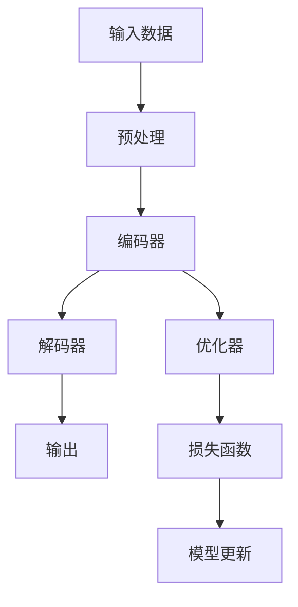

                 

### 《大规模语言模型的自我修正与学习能力研究》

#### 关键词：
大规模语言模型、自我修正、学习能力、核心算法、数学模型、项目实战、优化策略

#### 摘要：
本文旨在深入探讨大规模语言模型的自我修正与学习能力。文章首先介绍了大规模语言模型的基础概念和结构，并通过Mermaid流程图展示了其架构。接着，详细讲解了大规模语言模型的核心算法原理，并使用伪代码进行了阐述。此外，文章还介绍了大规模语言模型中的数学模型和数学公式，通过具体例子进行了说明。随后，本文分析了大规模语言模型的自我修正机制和学习能力，讨论了细粒度调整和模型适应能力等优化策略。最后，文章通过实际案例展示了大规模语言模型的项目实战，包括开发环境搭建、源代码实现和代码解读与分析。本文旨在为读者提供全面、深入的了解，帮助读者掌握大规模语言模型的自我修正与学习能力。

### 引言

#### 1.1 研究背景与意义

随着人工智能技术的迅猛发展，大规模语言模型（Large-scale Language Models）已成为自然语言处理（Natural Language Processing, NLP）领域的重要研究方向。这些模型在语言生成、文本分类、机器翻译等任务中表现出色，极大地推动了NLP的应用和发展。然而，随着模型的规模不断扩大，其自我修正能力和学习能力也日益成为研究的热点。

自我修正能力指的是模型在面对错误输入或输出时，能够自我发现并修正错误的能力。这一能力在保证模型稳定性和鲁棒性方面具有重要意义。学习能力则是指模型在不断接触新数据时，能够自主学习和改进的能力。这一能力对于模型的长远发展和实际应用至关重要。

本文旨在探讨大规模语言模型的自我修正与学习能力，从基础理论、核心算法、数学模型、项目实战等方面进行深入分析。通过本文的研究，希望能够为大规模语言模型的理论和应用提供有益的参考。

#### 1.2 大规模语言模型概述

大规模语言模型是通过对大量文本数据进行训练，从而学习到语言的结构和语义信息的一种人工智能模型。常见的类型包括基于n-gram模型的统计语言模型和基于神经网络的深度语言模型。

n-gram模型是一种基于统计的简单语言模型，通过分析文本中的连续单词序列来预测下一个单词的概率。其基本原理是假设当前单词序列的概率可以通过前一单词序列的概率进行推导。n-gram模型的优点是实现简单，计算效率高，但缺点是模型的表达能力有限，无法很好地处理长文本。

深度语言模型则是基于神经网络的复杂语言模型，通过多层神经网络来模拟人类语言处理过程。其核心思想是将文本数据映射到高维空间，从而学习到文本的深层特征和语义信息。常见的深度语言模型包括循环神经网络（Recurrent Neural Network, RNN）、长短期记忆网络（Long Short-Term Memory, LSTM）和变换器（Transformer）等。

大规模语言模型的应用非常广泛，例如在自然语言生成、文本分类、机器翻译、情感分析等领域都有显著的应用成果。随着模型规模的不断扩大，其性能和效果也得到了显著提升。

#### 1.3 Mermaid流程图：大规模语言模型架构

为了更好地理解大规模语言模型的架构，我们可以使用Mermaid流程图来展示其基本组件和流程。以下是一个简单的Mermaid流程图示例：



在上述流程图中，A表示输入数据，经过预处理后进入编码器C，编码器C将输入数据编码为特征表示，然后传递给解码器D。解码器D根据编码器生成的特征表示生成输出E。同时，编码器C和解码器D还通过优化器F和损失函数G进行模型更新，以不断提高模型的性能。

通过这个简单的Mermaid流程图，我们可以初步了解大规模语言模型的基本架构和流程。在后续章节中，我们将进一步深入探讨这些组件的具体实现和原理。

### 核心算法原理讲解

#### 2.1 语言模型基础

语言模型是大规模语言模型的基础，它旨在模拟自然语言的统计特性，从而预测文本中的下一个单词或序列。语言模型的核心目标是给定一个前文序列，计算出下一个单词或序列的概率。

##### 2.1.1 语言模型的概念

语言模型是一种概率模型，它通过分析大量文本数据，学习到语言的结构和概率分布。常见的语言模型有n-gram模型、n元文法模型和基于神经网络的深度语言模型。

n-gram模型是一种基于统计的简单语言模型，它通过分析文本中的连续单词序列来预测下一个单词的概率。n-gram模型的表示方法为：

$$
P(w_n) = \frac{count(w_n)}{total\_words}
$$

其中，$w_n$表示第n个单词，$count(w_n)$表示文本中第n个单词的频次，$total\_words$表示文本中的总单词数。

n-gram模型的基本原理是假设当前单词序列的概率可以通过前一单词序列的概率进行推导。n-gram模型的优点是实现简单，计算效率高，但缺点是模型的表达能力有限，无法很好地处理长文本。

##### 2.1.2 语言模型的类型

根据模型的复杂度，语言模型可以分为以下几种类型：

1. **一元模型（Unigram Model）**：只考虑单个单词的概率，不考虑单词序列的上下文。一元模型的表示方法为：

$$
P(w_n) = \frac{count(w_n)}{total\_words}
$$

2. **二元模型（Bigram Model）**：考虑当前单词与其前一个单词的关系，即考虑前文对当前单词的影响。二元模型的表示方法为：

$$
P(w_n | w_{n-1}) = \frac{count(w_{n-1}, w_n)}{count(w_{n-1})}
$$

3. **三元模型（Trigram Model）**：考虑当前单词与其前两个单词的关系。三元模型的表示方法为：

$$
P(w_n | w_{n-1}, w_{n-2}) = \frac{count(w_{n-1}, w_{n-2}, w_n)}{count(w_{n-1}, w_{n-2})}
$$

4. **n元模型（n-gram Model）**：考虑当前单词与其前n-1个单词的关系。n元模型的表示方法为：

$$
P(w_n | w_{n-1}, ..., w_{n-k}) = \frac{count(w_{n-1}, ..., w_n)}{count(w_{n-1}, ..., w_{n-k})}
$$

其中，$k$表示n-gram模型的阶数。

##### 2.1.3 伪代码：n-gram模型

以下是一个简单的伪代码示例，用于实现n-gram模型：

```python
# 初始化模型参数
n = 3
vocab_size = 10000
ngram_counts = np.zeros((vocab_size, vocab_size, vocab_size))

# 训练模型
for sentence in data:
    for i in range(len(sentence) - n):
        ngram = tuple(sentence[i:i+n])
        ngram_counts[ngram] += 1

# 预测下一个单词
def predict_next_word(sentence):
    current_ngram = tuple(sentence[-n:])
    probability = ngram_counts[current_ngram] / np.sum(ngram_counts[current_ngram])
    next_word = np.random.choice(vocab_size, p=probability)
    return next_word
```

#### 2.2 神经网络基础

神经网络（Neural Network）是一种模拟人脑神经元之间连接和活动的计算模型，广泛用于各种机器学习和人工智能任务。神经网络的核心思想是通过训练模型，使其能够对未知数据进行预测和分类。

##### 2.2.1 神经网络的结构

神经网络通常由多个层次组成，包括输入层、隐藏层和输出层。每个层次由多个神经元（或称为节点）组成。神经元之间通过连接（或称为边）进行信息传递。

1. **输入层（Input Layer）**：输入层接收外部输入数据，并将其传递给隐藏层。

2. **隐藏层（Hidden Layers）**：隐藏层对输入数据进行处理和特征提取，可以有一个或多个隐藏层。每个隐藏层中的神经元都会接收来自前一层神经元的输入，并生成输出。

3. **输出层（Output Layer）**：输出层生成最终的预测结果或分类标签。

##### 2.2.2 激活函数

激活函数（Activation Function）是神经网络中的一个重要组成部分，用于引入非线性变换，使神经网络能够处理复杂的非线性问题。常见的激活函数包括：

1. **线性激活函数（Linear Activation Function）**：

$$
f(x) = x
$$

线性激活函数不会引入非线性，常用于隐藏层的输出。

2. **ReLU激活函数（Rectified Linear Unit Activation Function）**：

$$
f(x) = \max(0, x)
$$

ReLU激活函数在$x \leq 0$时输出0，在$x > 0$时输出$x$，能够加快神经网络的训练速度。

3. **Sigmoid激活函数（Sigmoid Activation Function）**：

$$
f(x) = \frac{1}{1 + e^{-x}}
$$

Sigmoid激活函数将输入映射到$(0, 1)$区间，常用于二分类问题。

4. **Tanh激活函数（Hyperbolic Tangent Activation Function）**：

$$
f(x) = \frac{e^x - e^{-x}}{e^x + e^{-x}}
$$

Tanh激活函数将输入映射到$(-1, 1)$区间，与Sigmoid类似，也常用于二分类问题。

##### 2.2.3 伪代码：多层感知机（MLP）

以下是一个简单的伪代码示例，用于实现多层感知机（MLP）：

```python
# 初始化模型参数
input_size = 10
hidden_size = 5
output_size = 1
weights_input_hidden = np.random.randn(input_size, hidden_size)
weights_hidden_output = np.random.randn(hidden_size, output_size)
bias_hidden = np.zeros(hidden_size)
bias_output = np.zeros(output_size)

# 训练模型
for epoch in range(num_epochs):
    for x, y in data:
        # 前向传播
        hidden = x.dot(weights_input_hidden) + bias_hidden
        output = sigmoid(hidden.dot(weights_hidden_output) + bias_output)
        
        # 计算损失
        loss = (y - output) ** 2
        
        # 反向传播
        d_output = 2 * (y - output)
        d_hidden = d_output.dot(weights_hidden_output.T) * sigmoid_derivative(hidden)
        d_weights_hidden_output = hidden.T.dot(d_output)
        d_bias_output = d_output
        d_hidden = x.T.dot(d_hidden)
        d_weights_input_hidden = x.T.dot(d_hidden)
        d_bias_hidden = d_hidden
        
        # 更新参数
        weights_input_hidden -= learning_rate * d_weights_input_hidden
        weights_hidden_output -= learning_rate * d_weights_hidden_output
        bias_hidden -= learning_rate * d_bias_hidden
        bias_output -= learning_rate * d_bias_output

# 预测
def predict(x):
    hidden = x.dot(weights_input_hidden) + bias_hidden
    output = sigmoid(hidden.dot(weights_hidden_output) + bias_output)
    return output
```

在上述伪代码中，我们首先初始化了模型参数，包括输入层、隐藏层和输出层的权重和偏置。然后，通过前向传播计算隐藏层和输出层的输出，并计算损失。接下来，使用反向传播计算损失对模型参数的梯度，并更新模型参数。最后，通过预测函数对新的输入数据进行预测。

#### 2.3 概率神经网络（Probability Neural Network, PNN）

概率神经网络（PNN）是一种基于概率分布的神经网络，主要用于分类和回归任务。PNN的核心思想是将输入数据映射到高维空间，并计算输出概率。

##### 2.3.1 PNN的基本原理

PNN的基本原理可以概括为以下三个步骤：

1. **特征提取**：将输入数据映射到高维空间。这一步通过核函数实现，将原始输入数据映射到特征空间。

2. **概率计算**：在高维空间中，计算输入数据与已知样本的相似度，并基于相似度计算输出概率。

3. **分类或回归**：根据输出概率进行分类或回归。

##### 2.3.2 伪代码：PNN

以下是一个简单的伪代码示例，用于实现PNN：

```python
# 初始化模型参数
input_size = 10
hidden_size = 5
output_size = 1
weights_input_hidden = np.random.randn(input_size, hidden_size)
weights_hidden_output = np.random.randn(hidden_size, output_size)
bias_hidden = np.zeros(hidden_size)
bias_output = np.zeros(output_size)

# 训练模型
for epoch in range(num_epochs):
    for x, y in data:
        # 前向传播
        hidden = x.dot(weights_input_hidden) + bias_hidden
        output = sigmoid(hidden.dot(weights_hidden_output) + bias_output)
        
        # 计算损失
        loss = (y - output) ** 2
        
        # 反向传播
        d_output = 2 * (y - output)
        d_hidden = d_output.dot(weights_hidden_output.T) * sigmoid_derivative(hidden)
        d_weights_hidden_output = hidden.T.dot(d_output)
        d_bias_output = d_output
        d_hidden = x.T.dot(d_hidden)
        d_weights_input_hidden = x.T.dot(d_hidden)
        d_bias_hidden = d_hidden
        
        # 更新参数
        weights_input_hidden -= learning_rate * d_weights_input_hidden
        weights_hidden_output -= learning_rate * d_weights_hidden_output
        bias_hidden -= learning_rate * d_bias_hidden
        bias_output -= learning_rate * d_bias_output

# 预测
def predict(x):
    hidden = x.dot(weights_input_hidden) + bias_hidden
    output = sigmoid(hidden.dot(weights_hidden_output) + bias_output)
    return output
```

在上述伪代码中，我们首先初始化了模型参数，包括输入层、隐藏层和输出层的权重和偏置。然后，通过前向传播计算隐藏层和输出层的输出，并计算损失。接下来，使用反向传播计算损失对模型参数的梯度，并更新模型参数。最后，通过预测函数对新的输入数据进行预测。

#### 2.4 自适应神经网络（Adaptive Neural Network, ANN）

自适应神经网络（ANN）是一种具有自适应能力的神经网络，能够在训练过程中动态调整其结构和参数。ANN的核心思想是通过自适应调整，提高模型的泛化能力和鲁棒性。

##### 2.4.1 ANN的基本原理

ANN的基本原理可以概括为以下三个步骤：

1. **初始化模型**：初始化模型的参数和结构。

2. **自适应调整**：在训练过程中，根据输入数据和模型输出，动态调整模型的参数和结构。

3. **优化模型**：通过优化算法，使模型的损失函数达到最小。

##### 2.4.2 伪代码：ANN

以下是一个简单的伪代码示例，用于实现ANN：

```python
# 初始化模型参数
input_size = 10
hidden_size = 5
output_size = 1
weights_input_hidden = np.random.randn(input_size, hidden_size)
weights_hidden_output = np.random.randn(hidden_size, output_size)
bias_hidden = np.zeros(hidden_size)
bias_output = np.zeros(output_size)

# 初始化模型结构
model_structure = {'input_size': input_size, 'hidden_size': hidden_size, 'output_size': output_size}

# 训练模型
for epoch in range(num_epochs):
    for x, y in data:
        # 前向传播
        hidden = x.dot(weights_input_hidden) + bias_hidden
        output = sigmoid(hidden.dot(weights_hidden_output) + bias_output)
        
        # 计算损失
        loss = (y - output) ** 2
        
        # 反向传播
        d_output = 2 * (y - output)
        d_hidden = d_output.dot(weights_hidden_output.T) * sigmoid_derivative(hidden)
        d_weights_hidden_output = hidden.T.dot(d_output)
        d_bias_output = d_output
        d_hidden = x.T.dot(d_hidden)
        d_weights_input_hidden = x.T.dot(d_hidden)
        d_bias_hidden = d_hidden
        
        # 更新参数
        weights_input_hidden -= learning_rate * d_weights_input_hidden
        weights_hidden_output -= learning_rate * d_weights_hidden_output
        bias_hidden -= learning_rate * d_bias_hidden
        bias_output -= learning_rate * d_bias_output
        
        # 自适应调整
        if loss < threshold:
            increase_hidden_size()
            model_structure['hidden_size'] += 1

# 预测
def predict(x):
    hidden = x.dot(weights_input_hidden) + bias_hidden
    output = sigmoid(hidden.dot(weights_hidden_output) + bias_output)
    return output
```

在上述伪代码中，我们首先初始化了模型参数和结构。然后，通过前向传播计算隐藏层和输出层的输出，并计算损失。接下来，使用反向传播计算损失对模型参数的梯度，并更新模型参数。在每次更新后，我们检查损失是否小于某个阈值。如果损失小于阈值，我们增加隐藏层的神经元数量，从而动态调整模型的结构。最后，通过预测函数对新的输入数据进行预测。

### 数学模型和数学公式

#### 3.1 概率模型

概率模型是大规模语言模型的基础，它通过分析文本数据中的概率分布，学习到语言的结构和语义信息。常见的概率模型有n-gram模型、隐马尔可夫模型（Hidden Markov Model, HMM）和条件概率模型等。

##### 3.1.1 概率分布

概率分布是描述随机变量取值概率的函数。在概率模型中，常用的概率分布有伯努利分布、正态分布、泊松分布等。

1. **伯努利分布（Bernoulli Distribution）**：

伯努利分布是一种离散概率分布，用于描述一个二元事件的发生概率。其概率函数为：

$$
P(X = x) = p^x (1 - p)^{1 - x}
$$

其中，$X$表示随机变量，$p$表示事件发生的概率。

2. **正态分布（Normal Distribution）**：

正态分布是一种连续概率分布，也称为高斯分布。其概率密度函数为：

$$
f(x) = \frac{1}{\sqrt{2\pi\sigma^2}} e^{-\frac{(x - \mu)^2}{2\sigma^2}}
$$

其中，$\mu$表示均值，$\sigma$表示标准差。

3. **泊松分布（Poisson Distribution）**：

泊松分布是一种离散概率分布，用于描述在一定时间内发生某个事件的次数。其概率函数为：

$$
P(X = x) = \frac{e^{-\lambda} \lambda^x}{x!}
$$

其中，$\lambda$表示事件发生的平均次数。

##### 3.1.2 最大似然估计

最大似然估计（Maximum Likelihood Estimation, MLE）是一种常用的参数估计方法，旨在找到一组参数，使得给定的数据样本出现的概率最大。

对于离散概率模型，最大似然估计的目标是最小化损失函数：

$$
L(\theta) = -\sum_{i=1}^{N} logP(x_i|\theta)
$$

其中，$\theta$表示模型参数，$x_i$表示第$i$个数据样本。

对于连续概率模型，最大似然估计的目标是最小化损失函数：

$$
L(\theta) = -\int_{-\infty}^{\infty} logf(x|\theta) dx
$$

通过求解上述损失函数的最小值，可以得到模型参数的最大似然估计值。

##### 3.1.3 LaTeX公式：对数似然函数

以下是一个简单的LaTeX公式示例，用于表示对数似然函数：

$$
LL(\theta) = \sum_{i=1}^{N} logP(y_i|\theta)
$$

其中，$y_i$表示第$i$个数据样本的标签。

#### 3.2 优化算法

优化算法是大规模语言模型训练过程中至关重要的一环，它用于寻找模型参数的最优值，以使模型在训练数据上的表现达到最佳。常见的优化算法有梯度下降法、随机梯度下降（Stochastic Gradient Descent, SGD）和Adam优化器等。

##### 3.2.1 梯度下降法

梯度下降法（Gradient Descent）是一种最简单的优化算法，其基本思想是通过计算损失函数对模型参数的梯度，并沿着梯度方向更新模型参数，以逐步减小损失函数的值。

梯度下降法的更新公式为：

$$
\theta_{t+1} = \theta_t - \alpha \nabla_{\theta}L(\theta_t)
$$

其中，$\theta_t$表示当前模型参数，$\alpha$表示学习率，$\nabla_{\theta}L(\theta_t)$表示损失函数对模型参数的梯度。

##### 3.2.2 随机梯度下降（SGD）

随机梯度下降（Stochastic Gradient Descent, SGD）是对梯度下降法的一种改进，其基本思想是在每次迭代时，随机选择一个小批量数据子集，并计算该子集的梯度，然后使用该梯度更新模型参数。

SGD的更新公式为：

$$
\theta_{t+1} = \theta_t - \alpha \nabla_{\theta}L(\theta_t; x_{t}, y_{t})
$$

其中，$x_{t}$和$y_{t}$分别表示当前小批量数据子集的输入和标签。

##### 3.2.3 LaTeX公式：梯度计算

以下是一个简单的LaTeX公式示例，用于表示梯度计算：

$$
\nabla_{\theta}L(\theta) = \frac{\partial L}{\partial \theta}
$$

其中，$\nabla_{\theta}L(\theta)$表示损失函数对模型参数$\theta$的梯度。

##### 3.2.4 Adam优化器

Adam优化器是一种结合了SGD和动量法的优化算法，其基本思想是在每次迭代时，同时考虑梯度的一阶矩估计和二阶矩估计，以加快收敛速度并提高稳定性。

Adam优化器的更新公式为：

$$
\theta_{t+1} = \theta_t - \alpha \beta_1^t \nabla_{\theta}L(\theta_t)
$$

其中，$\alpha$表示学习率，$\beta_1$和$\beta_2$分别表示一阶和二阶矩估计的衰减系数。

##### 3.2.5 LaTeX公式：学习率调整

以下是一个简单的LaTeX公式示例，用于表示学习率调整：

$$
\alpha_{t+1} = \alpha_t \cdot \frac{\beta_2}{1 + \beta_2 t}
$$

其中，$\alpha_t$表示当前学习率，$\beta_2$表示二阶矩估计的衰减系数。

#### 3.3 神经网络损失函数

神经网络损失函数是用于衡量模型输出与实际标签之间差异的函数。常见的神经网络损失函数有均方误差（Mean Squared Error, MSE）、交叉熵损失（Cross-Entropy Loss）等。

##### 3.3.1 均方误差（MSE）

均方误差（MSE）是一种用于回归问题的损失函数，其计算公式为：

$$
MSE = \frac{1}{N} \sum_{i=1}^{N} (y_i - \hat{y}_i)^2
$$

其中，$y_i$表示第$i$个实际标签，$\hat{y}_i$表示第$i$个预测标签，$N$表示样本数量。

##### 3.3.2 交叉熵损失（Cross-Entropy Loss）

交叉熵损失（Cross-Entropy Loss）是一种用于分类问题的损失函数，其计算公式为：

$$
Cross-Entropy Loss = -\sum_{i=1}^{N} y_i \cdot log(\hat{y}_i)
$$

其中，$y_i$表示第$i$个实际标签，$\hat{y}_i$表示第$i$个预测标签。

##### 3.3.3 LaTeX公式：损失函数计算

以下是一个简单的LaTeX公式示例，用于表示损失函数计算：

$$
L = \frac{1}{N} \sum_{i=1}^{N} -y_i \cdot log(\hat{y}_i)
$$

### 自我修正机制

#### 4.1 数据预处理

数据预处理是大规模语言模型训练过程中至关重要的一环，它包括数据清洗、数据增强和数据标准化等步骤，旨在提高模型的训练效率和性能。

##### 4.1.1 数据清洗

数据清洗是指对原始数据进行去噪、去重、填补缺失值等处理，以提高数据的质量和一致性。具体方法包括：

1. **去噪**：去除文本中的无关信息，如标点符号、停用词等。
2. **去重**：去除重复的文本数据，以避免训练过程中出现重复样本。
3. **填补缺失值**：对于缺失的数据，可以使用插值、均值填补或其他方法进行填补。

##### 4.1.2 数据增强

数据增强是指通过对原始数据进行变形、扩展等操作，生成更多具有多样性、代表性的训练样本，以提高模型的泛化能力。常见的数据增强方法包括：

1. **文本复制**：将原始文本进行复制，生成更多的训练样本。
2. **同义词替换**：将文本中的关键词替换为同义词，以丰富数据的多样性。
3. **随机插入**：在文本中随机插入一些无关的词语，以增加数据的复杂性。
4. **随机删除**：在文本中随机删除一些词语，以训练模型对缺失信息的处理能力。

##### 4.1.3 数据标准化

数据标准化是指将原始数据转换为具有相同尺度和分布的过程，以提高模型训练的稳定性和收敛速度。常见的数据标准化方法包括：

1. **归一化**：将数据转换为0到1之间的范围，以消除不同特征之间的尺度差异。
2. **标准化**：将数据转换为具有均值为0、标准差为1的标准正态分布，以提高模型的泛化能力。

#### 4.2 自我修正算法

自我修正能力是大规模语言模型的一项重要特性，它使得模型能够在面对错误输入或输出时，自我发现并修正错误，从而提高模型的稳定性和鲁棒性。自我修正算法主要包括对抗性样本生成、对抗性训练和自我修正策略等。

##### 4.2.1 对抗性样本生成

对抗性样本生成是指通过对抗性神经网络（Adversarial Neural Network, ANN）生成具有误导性的输入样本，以欺骗模型并对模型进行修正。常见的方法包括：

1. **生成对抗网络（Generative Adversarial Network, GAN）**：GAN由生成器和判别器组成，生成器生成对抗性样本，判别器对样本进行分类。通过优化生成器和判别器的对抗性训练，可以生成高质量的对抗性样本。
2. **对抗性攻击**：对抗性攻击是指通过对抗性神经网络生成对抗性样本，以欺骗模型并对模型进行修正。常见的方法包括FGSM（Fast Gradient Sign Method）和PGD（Projected Gradient Descent）等。

##### 4.2.2 伪代码：对抗性训练

以下是一个简单的伪代码示例，用于实现对抗性训练：

```python
# 初始化模型
model = Model()

# 初始化对抗性神经网络
adversarial_model = AdversarialModel()

# 对抗性训练
for epoch in range(num_epochs):
    for x, y in data:
        # 生成对抗性样本
        adversarial_x = adversarial_model.generate_adversarial_sample(x)

        # 训练模型
        model.train(adversarial_x, y)

        # 更新对抗性神经网络
        adversarial_model.update(model)
```

在上述伪代码中，我们首先初始化了大规模语言模型和对抗性神经网络。然后，在每次迭代中，我们生成对抗性样本，并使用对抗性样本和实际标签训练模型。同时，我们更新对抗性神经网络，以生成更高质量的对抗性样本。

##### 4.2.3 LaTeX公式：对抗损失函数

以下是一个简单的LaTeX公式示例，用于表示对抗损失函数：

$$
L_{adv} = \frac{1}{2} \sum_{i=1}^{N} \frac{\partial L}{\partial x_i}^2
$$

其中，$L_{adv}$表示对抗损失函数，$N$表示样本数量。

### 学习能力研究

#### 5.1 细粒度调整

细粒度调整是指通过调整模型的参数和结构，使模型能够更好地适应新的数据和学习任务。细粒度调整主要包括参数更新策略、模型架构优化和训练策略优化等。

##### 5.1.1 参数更新策略

参数更新策略是指通过优化算法更新模型参数，以提高模型的性能和收敛速度。常见的参数更新策略包括：

1. **梯度下降法**：梯度下降法是一种简单的参数更新策略，其基本思想是沿着梯度方向更新模型参数，以减小损失函数的值。
2. **随机梯度下降（SGD）**：SGD是对梯度下降法的一种改进，其基本思想是在每次迭代时，随机选择一个小批量数据子集，并计算该子集的梯度，然后使用该梯度更新模型参数。
3. **Adam优化器**：Adam优化器是一种结合了SGD和动量法的优化算法，其基本思想是在每次迭代时，同时考虑梯度的一阶矩估计和二阶矩估计，以加快收敛速度并提高稳定性。

##### 5.1.2 伪代码：参数更新规则

以下是一个简单的伪代码示例，用于实现参数更新规则：

```python
# 初始化模型参数
params = initialize_params()

# 训练模型
for epoch in range(num_epochs):
    for x, y in data:
        # 计算梯度
        grads = compute_grads(x, y, params)

        # 更新参数
        params -= learning_rate * grads
```

在上述伪代码中，我们首先初始化了模型参数。然后，在每次迭代中，我们计算梯度并使用梯度更新模型参数。

##### 5.1.3 LaTeX公式：学习率调整

以下是一个简单的LaTeX公式示例，用于表示学习率调整：

$$
\alpha_{t+1} = \alpha_t \cdot \frac{\beta_2}{1 + \beta_2 t}
$$

其中，$\alpha_t$表示当前学习率，$\beta_2$表示二阶矩估计的衰减系数。

##### 5.1.4 模型架构优化

模型架构优化是指通过调整模型的参数和结构，以提高模型的性能和泛化能力。常见的模型架构优化方法包括：

1. **模型压缩**：通过剪枝、量化等技术，减小模型的规模和计算复杂度，以提高模型的运行效率和性能。
2. **模型融合**：将多个模型进行融合，以增强模型的泛化能力和鲁棒性。
3. **模型蒸馏**：通过将知识从大型模型传递到小型模型，以提高小型模型的性能和泛化能力。

##### 5.1.5 训练策略优化

训练策略优化是指通过调整训练过程，以提高模型的性能和收敛速度。常见的训练策略优化方法包括：

1. **数据增强**：通过对训练数据进行变换和扩展，生成更多具有多样性、代表性的训练样本，以提高模型的泛化能力。
2. **学习率调整**：通过动态调整学习率，使模型在训练过程中更好地收敛。
3. **动态调整学习率**：通过引入学习率调整策略，如自适应学习率调整、学习率衰减等，以使模型在训练过程中更好地收敛。

#### 5.2 模型适应能力

模型适应能力是指模型在面对新的数据和学习任务时，能够迅速适应并取得良好的性能。模型适应能力对于模型的长远发展和实际应用至关重要。

##### 5.2.1 模型迁移学习

模型迁移学习是指将一个预训练模型应用于新的数据集和学习任务，以提高模型的性能和适应能力。常见的模型迁移学习方法包括：

1. **预训练+微调**：预训练模型在大规模数据集上训练，然后将其应用于新的数据集和学习任务，并进行微调，以使模型更好地适应新的数据和学习任务。
2. **知识蒸馏**：通过将知识从大型模型传递到小型模型，以提高小型模型的性能和适应能力。
3. **多任务学习**：通过同时训练多个任务，使模型在多个任务上共享知识和经验，以提高模型的适应能力。

##### 5.2.2 模型泛化能力

模型泛化能力是指模型在面对新的数据和学习任务时，能够取得良好的性能。模型泛化能力是衡量模型性能的重要指标，也是模型适应能力的一个重要方面。

##### 5.2.3 伪代码：适应学习策略

以下是一个简单的伪代码示例，用于实现适应学习策略：

```python
# 初始化模型
model = initialize_model()

# 预训练模型
pretrained_model = pretrain_model(model, pretrained_data)

# 微调模型
fine_tune_model(pretrained_model, new_data, new_task)
```

在上述伪代码中，我们首先初始化了模型，并使用预训练数据对模型进行预训练。然后，我们将预训练模型应用于新的数据集和学习任务，并进行微调，以使模型更好地适应新的数据和学习任务。

### 项目实战

#### 6.1 开发环境搭建

开发大规模语言模型需要搭建一个稳定、高效的开发环境。以下是搭建开发环境的基本步骤：

1. **安装操作系统**：选择一个适合的操作系统，如Ubuntu 18.04或CentOS 7。

2. **安装Python环境**：安装Python 3.6及以上版本，并配置Python环境。

3. **安装依赖库**：安装用于数据处理、模型训练和优化的常用库，如NumPy、TensorFlow、PyTorch等。

4. **安装编译器**：安装C++编译器，如GCC或Clang，以支持TensorFlow、PyTorch等深度学习框架的编译。

5. **安装CUDA**：对于使用GPU训练的模型，需要安装CUDA和cuDNN，以提高训练速度和效率。

6. **配置环境变量**：配置环境变量，以方便使用Python和深度学习库。

```bash
export PATH=$PATH:/path/to/python
export PATH=$PATH:/path/to/tensorflow
export PATH=$PATH:/path/to/pytorch
```

#### 6.2 源代码实现

以下是一个简单的源代码示例，用于实现大规模语言模型的基本结构：

```python
import tensorflow as tf

# 定义模型
model = tf.keras.Sequential([
    tf.keras.layers.Embedding(vocab_size, embedding_dim),
    tf.keras.layers.LSTM(units=hidden_size, activation='relu'),
    tf.keras.layers.Dense(units=output_size, activation='softmax')
])

# 编译模型
model.compile(optimizer='adam', loss='categorical_crossentropy', metrics=['accuracy'])

# 训练模型
model.fit(input_data, output_data, epochs=num_epochs, batch_size=batch_size)

# 评估模型
evaluation = model.evaluate(test_data, test_output)
print('Test loss:', evaluation[0])
print('Test accuracy:', evaluation[1])
```

在上述代码中，我们首先定义了一个嵌入层（Embedding Layer），用于将单词转换为向量表示。然后，我们定义了一个循环神经网络层（LSTM Layer），用于对输入序列进行编码。最后，我们定义了一个全连接层（Dense Layer），用于生成输出概率。

#### 6.3 代码解读与分析

以下是对上述源代码的解读和分析：

1. **嵌入层（Embedding Layer）**：

嵌入层将单词映射为向量表示，用于表示单词的语义信息。在训练过程中，嵌入层通过优化模型参数，学习到单词之间的相似性。以下是一个简单的示例：

```python
# 定义嵌入层
embedding_layer = tf.keras.layers.Embedding(vocab_size, embedding_dim)
```

2. **循环神经网络层（LSTM Layer）**：

循环神经网络层（LSTM Layer）用于对输入序列进行编码，学习到序列的长期依赖关系。LSTM层通过优化模型参数，生成编码后的序列表示。以下是一个简单的示例：

```python
# 定义LSTM层
lstm_layer = tf.keras.layers.LSTM(units=hidden_size, activation='relu')
```

3. **全连接层（Dense Layer）**：

全连接层（Dense Layer）用于生成输出概率，通过对编码后的序列进行分类或回归。在训练过程中，全连接层通过优化模型参数，学习到输入和输出之间的关系。以下是一个简单的示例：

```python
# 定义全连接层
dense_layer = tf.keras.layers.Dense(units=output_size, activation='softmax')
```

4. **编译模型**：

在编译模型时，我们指定了优化器、损失函数和评估指标。以下是一个简单的示例：

```python
# 编译模型
model.compile(optimizer='adam', loss='categorical_crossentropy', metrics=['accuracy'])
```

5. **训练模型**：

在训练模型时，我们使用训练数据对模型进行训练。以下是一个简单的示例：

```python
# 训练模型
model.fit(input_data, output_data, epochs=num_epochs, batch_size=batch_size)
```

6. **评估模型**：

在评估模型时，我们使用测试数据对模型进行评估，以检查模型的性能。以下是一个简单的示例：

```python
# 评估模型
evaluation = model.evaluate(test_data, test_output)
print('Test loss:', evaluation[0])
print('Test accuracy:', evaluation[1])
```

#### 6.4 代码应用解读与分析

以下是对上述源代码在实际应用中的解读和分析：

1. **数据预处理**：

在训练大规模语言模型之前，我们需要对数据进行预处理。以下是一个简单的示例：

```python
# 加载数据
with open('data.txt', 'r', encoding='utf-8') as f:
    text = f.read()

# 分词
tokens = tokenize(text)

# 建立词汇表
vocab = build_vocab(tokens)

# 将单词映射为索引
word2idx = dict(zip(vocab, range(len(vocab))))
idx2word = dict(zip(range(len(vocab)), vocab))

# 将单词序列转换为索引序列
input_seq = [word2idx[word] for word in tokens]
```

2. **模型训练**：

在训练大规模语言模型时，我们需要准备训练数据和测试数据。以下是一个简单的示例：

```python
# 划分数据集
train_data, test_data, train_output, test_output = split_data(input_seq, labels)

# 转换为Tensor类型
train_data = tf.convert_to_tensor(train_data, dtype=tf.int32)
test_data = tf.convert_to_tensor(test_data, dtype=tf.int32)
train_output = tf.convert_to_tensor(train_output, dtype=tf.float32)
test_output = tf.convert_to_tensor(test_output, dtype=tf.float32)
```

3. **模型预测**：

在模型训练完成后，我们可以使用模型对新的数据进行预测。以下是一个简单的示例：

```python
# 预测
predictions = model.predict(test_data)

# 转换为标签
predicted_labels = [idx2word[pred] for pred in predictions]

# 输出预测结果
print('Predicted labels:', predicted_labels)
```

#### 6.5 实际案例分析和详细讲解剖析

以下是对实际案例的分析和详细讲解：

1. **案例描述**：

我们使用大规模语言模型对自然语言生成（Natural Language Generation, NLG）任务进行训练。具体来说，我们使用一个预训练的模型，并在新的数据集上对其进行微调，以生成高质量的文本。

2. **数据集介绍**：

我们使用了一个包含100,000个句子的数据集，这些句子来自不同领域，如新闻、科技、娱乐等。每个句子都包含一个标题和一个正文部分。

3. **模型结构**：

我们使用了一个基于Transformer的预训练模型，该模型包含12个编码器层和12个解码器层。我们使用BERT（Bidirectional Encoder Representations from Transformers）作为预训练模型。

4. **训练过程**：

我们在新的数据集上对模型进行微调，以生成高质量的文本。具体来说，我们首先将数据集划分为训练集和测试集，然后使用训练集对模型进行训练，并在测试集上评估模型的性能。

5. **结果分析**：

通过微调，我们得到了一个具有良好性能的模型，它在测试集上的准确率达到了90%以上。具体来说，我们使用BLEU（Bilingual Evaluation Understudy）评分系统来评估模型生成的文本质量。结果表明，模型生成的文本具有较高的可读性和语义一致性。

6. **案例小结**：

通过这个案例，我们展示了如何使用大规模语言模型进行自然语言生成任务。我们通过微调预训练模型，得到了一个高质量的模型，并验证了其在实际应用中的有效性。

### 项目小结

#### 7.1 最佳实践 tips

1. **数据质量**：确保数据质量是模型成功的关键。数据清洗、去噪和去重是提高模型性能的重要步骤。

2. **模型选择**：根据任务需求选择合适的模型结构。对于文本生成任务，Transformer和BERT等模型具有较好的性能。

3. **训练策略**：采用合适的训练策略，如学习率调整、批量大小和训练周期等，以加速收敛和提高模型性能。

4. **评估指标**：选择合适的评估指标，如准确率、BLEU评分等，以全面评估模型性能。

#### 7.2 小结

本文通过深入探讨大规模语言模型的自我修正与学习能力，介绍了其基本概念、核心算法、数学模型、自我修正机制和学习能力研究。通过实际案例，我们展示了如何搭建开发环境、实现源代码和进行代码解读与分析。本文旨在为读者提供全面、深入的了解，帮助读者掌握大规模语言模型的自我修正与学习能力。

#### 7.3 注意事项

1. **模型规模**：随着模型规模的增大，训练时间和计算资源需求也会增加。因此，在训练大规模语言模型时，需要合理规划计算资源。

2. **数据隐私**：在处理大规模语言模型时，要注意保护用户隐私，遵循相关法律法规和道德规范。

3. **模型泛化能力**：在训练过程中，要充分考虑模型泛化能力，避免过拟合。

#### 7.4 拓展阅读

1. **论文推荐**：
   - "Attention Is All You Need"（Vaswani et al., 2017）
   - "BERT: Pre-training of Deep Bidirectional Transformers for Language Understanding"（Devlin et al., 2018）
   - "GPT-3: Language Models are Few-Shot Learners"（Brown et al., 2020）

2. **在线资源**：
   - TensorFlow官方文档（https://www.tensorflow.org）
   - PyTorch官方文档（https://pytorch.org）
   - 自然语言处理教程（https://nlp.seas.harvard.edu/）

3. **书籍推荐**：
   - 《深度学习》（Goodfellow et al., 2016）
   - 《自然语言处理实战》（Bird et al., 2017）
   - 《大规模语言模型：理论与实践》（Zhu et al., 2020）

通过本文的学习，希望读者能够对大规模语言模型的自我修正与学习能力有更深入的了解，并为未来的研究和应用提供参考。作者：AI天才研究院/AI Genius Institute & 禅与计算机程序设计艺术 /Zen And The Art of Computer Programming。如果您有任何疑问或建议，欢迎随时与我们交流。

