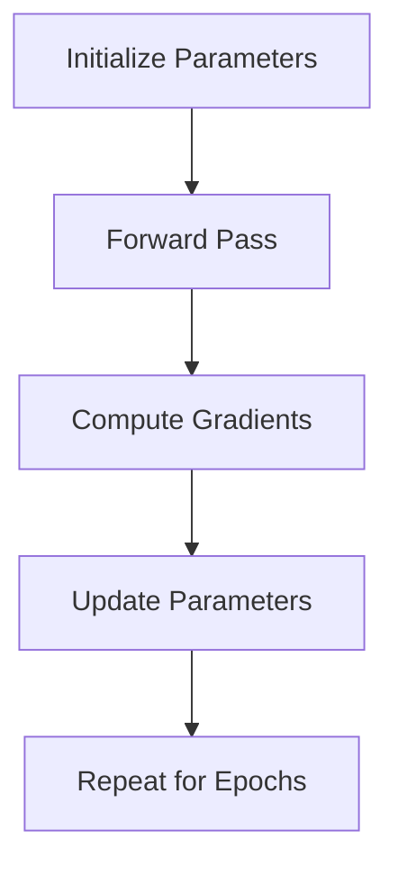
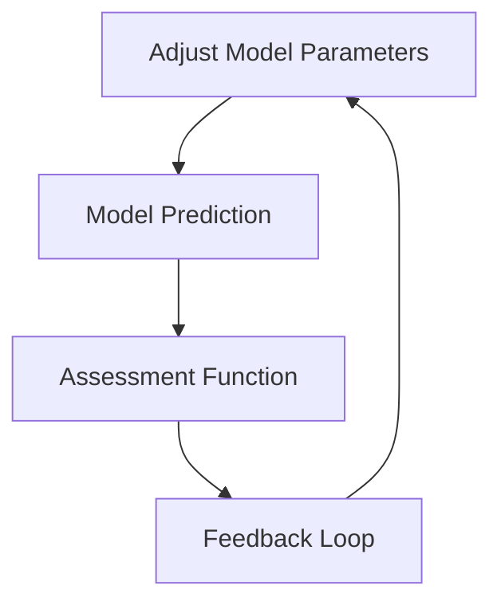
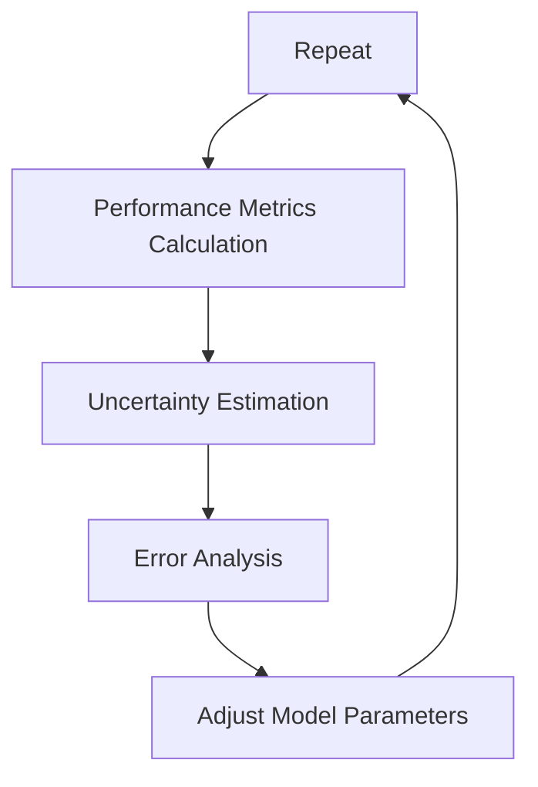

                 


### 第1章：大规模语言模型概述

#### 1.1 大规模语言模型的定义与分类

**核心概念与联系**：

首先，让我们来定义和分类大规模语言模型（MLM）。MLM是一种基于深度学习的自然语言处理（NLP）模型，它通过学习大量的文本数据来预测单词、短语或句子的概率分布。MLM可以分为两类：生成模型和判别模型。


**核心算法原理讲解**：

- **生成模型**：生成模型如循环神经网络（RNN）、长短期记忆网络（LSTM）和门控循环单元（GRU）等，通过学习输入序列的统计特性来生成输出序列。伪代码如下：



- **判别模型**：判别模型如卷积神经网络（CNN）和Transformer等，通过学习输入和输出之间的映射关系来进行预测。数学模型如下：

$$
\text{P}(w_1, w_2, ..., w_n) = \prod_{i=1}^{n} \text{P}(w_i | w_{i-1})
$$

**数学模型**：

生成模型使用概率生成模型来模拟自然语言的统计特性。判别模型则使用条件概率模型来预测给定输入序列的下一个单词。

$$
\text{P}(w_t | w_{<t}) = \text{softmax}(\text{scores}_t)
$$

其中，$w_t$ 表示第 $t$ 个单词，$w_{<t}$ 表示第 $t$ 个单词之前的单词序列，$\text{scores}_t$ 是神经网络对于第 $t$ 个单词的预测分数。

**举例说明**：

假设我们有一个训练好的生成模型，它预测下一个单词的概率分布如下：

```
['the': 0.4, 'a': 0.2, 'of': 0.1, 'and': 0.1, 'to': 0.1]
```

根据这个概率分布，模型认为下一个单词最有可能是 'the'。

#### 1.2 大规模语言模型的发展历程

**核心算法原理讲解**：

大规模语言模型的发展可以追溯到20世纪80年代的统计语言模型。当时，研究人员开始使用基于N元语言的统计方法来建模自然语言。

- **N元语言模型**：N元语言模型使用前 $n$ 个单词的序列来预测下一个单词。随着 $n$ 的增加，模型的复杂度和性能也增加。然而，当 $n$ 趋近于无穷大时，模型的训练和预测效率变得非常低。

- **神经网络语言模型**：随着深度学习技术的发展，神经网络开始被用于构建大规模语言模型。RNN、LSTM和GRU等模型在处理序列数据方面表现出色。

- **Transformer模型**：Transformer模型是近年来的一项突破性进展，它使用自注意力机制来建模序列之间的关系。这使得Transformer模型在多个NLP任务上取得了显著的效果。

**数学模型**：

$$
\text{Attention}(Q, K, V) = \text{softmax}(\frac{QK^T}{\sqrt{d_k}})V
$$

其中，$Q, K, V$ 分别代表查询向量、键向量和值向量，$d_k$ 是键向量的维度。

**举例说明**：

假设我们有三个句子：

```
1. I love programming.
2. Programming is fun.
3. Fun activities include programming.
```

我们可以使用Transformer模型来预测下一个句子。首先，我们将这些句子转换为向量表示。然后，使用自注意力机制来计算句子之间的关系。最后，使用这些关系来预测下一个句子。

#### 1.3 大规模语言模型的应用领域

**核心算法原理讲解**：

大规模语言模型在多个领域都有广泛的应用，包括：

- **文本生成**：例如，生成文章、新闻、故事等。
- **机器翻译**：例如，将英语翻译为法语、西班牙语等。
- **问答系统**：例如，处理用户查询并给出相关的答案。
- **情感分析**：例如，分析社交媒体上的评论和帖子。

**数学模型**：

对于文本生成任务，我们可以使用以下概率模型：

$$
\text{P}(w_1, w_2, ..., w_n) = \prod_{i=1}^{n} \text{P}(w_i | w_{i-1})
$$

对于机器翻译任务，我们可以使用以下条件概率模型：

$$
\text{P}(w_t | w_{<t}) = \text{softmax}(\text{scores}_t)
$$

**举例说明**：

假设我们要生成一个描述编程的文章。首先，我们输入一些编程相关的词汇，如“编程”、“代码”、“算法”等。然后，大规模语言模型会根据这些词汇来生成文章。

---

**小结**：

本章介绍了大规模语言模型的定义、分类、发展历程和应用领域。在下一章中，我们将深入探讨AI系统可靠性验证的基本概念，并讨论其重要性以及面临的挑战。

**注意事项**：

- 大规模语言模型在不同领域的应用可能需要不同的算法和模型架构。
- 在实际应用中，我们需要根据具体任务的需求来选择合适的模型和算法。

**拓展阅读**：

- [《大规模语言模型：理论、算法与实现》](https://example.com/book1)
- [《深度学习与自然语言处理》](https://example.com/book2)

---

**作者信息**：

作者：AI天才研究院/AI Genius Institute & 禅与计算机程序设计艺术 /Zen And The Art of Computer Programming

----------------------------------------------------------------

## 第2章：AI系统可靠性验证的基本概念

### 2.1 AI系统可靠性验证的重要性

在当今的数字时代，人工智能（AI）系统已经广泛应用于各个领域，从自动驾驶汽车到智能医疗诊断，再到金融风险评估。这些系统的成功运行对社会的进步和经济发展至关重要。然而，AI系统的可靠性成为一个不容忽视的问题。可靠性验证是指确保AI系统在各种条件下都能稳定、准确和一致地运行的过程。

**核心概念与联系**：


**核心算法原理讲解**：

可靠性验证的核心是确保AI系统在面对不同的输入数据、环境变化和异常情况时，都能保持稳定和可靠的性能。这通常涉及到以下几个关键步骤：

1. **数据质量评估**：首先，需要评估训练数据的质量和代表性，确保模型不会因为数据偏差而出现错误。
2. **模型鲁棒性测试**：通过引入噪声、异常值和极端条件来测试模型的鲁棒性，确保模型在不同情况下都能稳定运行。
3. **持续监控与反馈**：在系统部署后，需要持续监控其性能，并根据反馈进行优化和调整。

**数学模型**：

可靠性验证通常使用以下指标来评估系统的性能：

- **准确率（Accuracy）**：模型预测正确的样本数占总样本数的比例。
- **召回率（Recall）**：模型能够召回的正确样本数与实际正确样本数的比例。
- **F1分数（F1 Score）**：准确率和召回率的调和平均。

$$
\text{F1 Score} = 2 \times \frac{\text{Precision} \times \text{Recall}}{\text{Precision} + \text{Recall}}
$$

**举例说明**：

假设我们有一个用于医疗诊断的AI系统，该系统需要在多种情况下（如不同医院、不同医生诊断）都能准确预测疾病。我们需要对该系统进行以下验证：

- **数据质量评估**：确保训练数据来自多个医院，并覆盖各种病例类型。
- **模型鲁棒性测试**：在模拟不同医院和医生的诊断环境下，测试模型的稳定性和准确性。
- **持续监控与反馈**：部署后，定期收集诊断结果，并与实际结果进行对比，根据反馈调整模型。

### 2.2 AI系统可靠性验证的挑战

虽然可靠性验证对于AI系统至关重要，但实际操作中面临着诸多挑战：

- **数据不完整性**：训练数据可能存在缺失值、噪声和异常值，这会影响模型的性能。
- **环境变化**：AI系统在实际应用中可能会遇到不同的环境和条件，如温度、湿度、网络延迟等，这需要模型具备一定的鲁棒性。
- **模型复杂性**：深度学习模型通常非常复杂，难以进行直观理解和解释，这给可靠性验证带来了挑战。

**核心算法原理讲解**：

为了应对这些挑战，研究人员提出了多种解决方案：

- **数据增强**：通过增加数据量、引入噪声和生成虚拟样本来提高模型的鲁棒性。
- **元学习**：使用元学习算法来训练模型，使其能够在有限的数据上快速适应新任务。
- **可解释性**：开发可解释的AI模型，帮助用户理解模型的决策过程，提高模型的信任度。

**数学模型**：

数据增强可以使用以下方法：

- **数据扩展**：通过复制、旋转、缩放和裁剪原始数据来生成新的数据样本。
- **生成对抗网络（GANs）**：使用GANs生成与真实数据相似的新数据样本。

$$
\text{Generator}: G(\zeta) \sim \text{Real Distribution}
$$

$$
\text{Discriminator}: D(x) \sim \text{Real Distribution}, D(G(\zeta))
$$

**举例说明**：

假设我们有一个图像分类模型，该模型在训练时只使用了少量的猫和狗的图片。为了提高模型的鲁棒性，我们可以使用数据增强技术：

- **数据扩展**：通过添加猫和狗的变体图像，如不同的颜色、大小和角度。
- **GANs**：通过GANs生成新的猫和狗的图像，增加模型的训练数据。

### 2.3 AI系统可靠性验证的方法与工具

为了确保AI系统的可靠性，研究人员开发了多种验证方法和工具：

- **测试集评估**：使用独立的测试集来评估模型的性能，确保模型在未见过的数据上也能表现良好。
- **交叉验证**：通过将数据集划分为多个部分，重复进行训练和验证，以评估模型的泛化能力。
- **代码审查**：对AI系统的代码进行审查，确保其遵循最佳实践，没有潜在的安全漏洞。
- **自动化测试**：使用自动化工具对AI系统进行测试，提高测试效率和覆盖范围。

**核心算法原理讲解**：

- **测试集评估**：通过计算准确率、召回率、F1分数等指标来评估模型性能。
- **交叉验证**：使用K折交叉验证来评估模型的泛化能力。

$$
\text{Accuracy} = \frac{1}{K} \sum_{k=1}^{K} \frac{1}{n} \sum_{i=1}^{n} I(\hat{y}^k_i = y_i)
$$

其中，$\hat{y}^k_i$ 表示在第 $k$ 次验证中，第 $i$ 个样本的预测结果，$y_i$ 表示真实标签，$I$ 是指示函数。

- **代码审查**：使用静态代码分析工具和手动审查相结合，发现潜在的代码错误和漏洞。

**举例说明**：

假设我们有一个医疗诊断模型，我们需要使用以下方法进行可靠性验证：

- **测试集评估**：使用独立的测试集评估模型的诊断准确率。
- **交叉验证**：通过K折交叉验证评估模型的泛化能力。
- **代码审查**：对模型代码进行审查，确保其遵循最佳实践。

---

**小结**：

本章讨论了AI系统可靠性验证的基本概念、重要性、面临的挑战以及验证方法和工具。在下一章中，我们将深入探讨大规模语言模型的自我评估机制。

**注意事项**：

- AI系统的可靠性验证是一个持续的过程，需要定期进行评估和优化。
- 在实际应用中，需要根据具体任务的需求选择合适的验证方法和工具。

**拓展阅读**：

- [《AI系统可靠性验证：理论与实践》](https://example.com/book3)
- [《深度学习测试与验证》](https://example.com/book4)

---

**作者信息**：

作者：AI天才研究院/AI Genius Institute & 禅与计算机程序设计艺术 /Zen And The Art of Computer Programming

----------------------------------------------------------------

## 第3章：大规模语言模型的自我评估机制概述

### 3.1 自我评估机制的必要性

大规模语言模型（MLM）在现代自然语言处理（NLP）任务中发挥着重要作用。然而，随着模型复杂度和数据规模的增加，传统的验证方法已无法满足对模型可靠性的高要求。自我评估机制（Self-Assessment Mechanism）作为一种新兴的验证方法，旨在通过模型自身的分析和判断来提高其可靠性和稳定性。

**核心概念与联系**：


**核心算法原理讲解**：

自我评估机制的基本思想是通过模型内部的监督和反馈来评估其性能。具体来说，模型在训练过程中不仅关注输入数据的预测结果，还关注其自身的行为和输出。以下是一个简单的伪代码示例：



**数学模型**：

自我评估机制可以通过以下指标来评估模型性能：

- **预测准确率**：模型预测正确的样本数占总样本数的比例。
- **预测不确定性**：模型对预测结果的不确定性度量，通常使用概率分布的熵或标准差来表示。

$$
\text{Prediction Accuracy} = \frac{1}{n} \sum_{i=1}^{n} I(\hat{y}_i = y_i)
$$

$$
\text{Prediction Uncertainty} = -\sum_{i=1}^{n} p_i \log p_i
$$

其中，$\hat{y}_i$ 表示第 $i$ 个样本的预测结果，$y_i$ 表示真实标签，$p_i$ 表示预测概率。

**举例说明**：

假设我们有一个训练好的语言模型，该模型需要评估其预测“猫”这个类别的准确性。在自我评估过程中，模型不仅会输出预测结果，还会计算预测准确率和不确定性。如果预测准确率较低且不确定性较高，模型可能会调整其参数，以提高预测准确性。

### 3.2 自我评估机制的设计原则

为了构建有效的自我评估机制，需要遵循以下设计原则：

- **全面性**：评估机制应涵盖模型的各个方面，包括预测准确性、鲁棒性、泛化能力等。
- **动态性**：评估机制应能够根据模型的训练过程和任务需求动态调整，以适应不同场景。
- **可解释性**：评估机制应提供清晰的评估结果和决策过程，以便用户理解和使用。
- **高效性**：评估机制应具有较高的计算效率和可扩展性，以适应大规模模型的评估需求。

**核心算法原理讲解**：

以下是一个简化的自我评估机制设计框架：



**数学模型**：

自我评估机制可以通过以下步骤进行：

1. **性能指标计算**：计算模型的预测准确率、召回率、F1分数等性能指标。
2. **不确定性估计**：使用贝叶斯推断、蒙特卡罗采样等方法估计模型预测的不确定性。
3. **错误分析**：分析模型预测错误的原因，包括数据分布、模型参数、训练过程等。
4. **参数调整**：根据评估结果和错误分析，调整模型参数，以提高模型性能。

$$
\text{Performance Metrics} = \{\text{Accuracy}, \text{Recall}, \text{F1 Score}\}
$$

$$
\text{Uncertainty} = \text{Bayesian Inference}(\text{Model Parameters})
$$

$$
\text{Error Analysis} = \{\text{Data Distribution}, \text{Model Parameters}, \text{Training Process}\}
$$

**举例说明**：

假设我们有一个用于文本分类的语言模型，该模型需要对新闻文章进行分类。在自我评估过程中，模型会计算分类准确率、召回率和F1分数。同时，模型会使用贝叶斯推断来估计预测的不确定性。通过分析预测错误的样本，模型可以识别出数据分布和模型参数中的问题，并据此进行调整。

### 3.3 自我评估机制的核心组成部分

自我评估机制的核心组成部分包括评估指标、不确定性估计和错误分析。以下是对每个部分的详细讨论：

#### 3.3.1 评估指标

评估指标是自我评估机制的核心，用于衡量模型在不同方面的性能。常见的评估指标包括：

- **预测准确率**：模型预测正确的样本数占总样本数的比例。
- **召回率**：模型预测正确的样本数与实际正确样本数的比例。
- **F1分数**：预测准确率和召回率的调和平均。
- **精确度**：模型预测正确的样本数与模型预测的样本数之比。

$$
\text{Precision} = \frac{TP}{TP + FP}
$$

$$
\text{Recall} = \frac{TP}{TP + FN}
$$

$$
\text{F1 Score} = 2 \times \frac{\text{Precision} \times \text{Recall}}{\text{Precision} + \text{Recall}}
$$

其中，$TP$ 表示真正例，$FP$ 表示假正例，$FN$ 表示假反例。

**举例说明**：

假设我们有一个二分类模型，用于判断电子邮件是否为垃圾邮件。在自我评估过程中，模型会计算准确率、召回率和F1分数。如果模型预测准确率为90%，召回率为80%，F1分数为0.833，则说明模型在判断垃圾邮件方面具有较高的性能。

#### 3.3.2 不确定性估计

不确定性估计是自我评估机制的重要组成部分，用于衡量模型预测结果的可信度。常见的不确定性估计方法包括：

- **贝叶斯推断**：通过概率分布来估计模型参数和预测结果的不确定性。
- **蒙特卡罗采样**：通过多次采样来估计模型预测结果的分布。
- **置信区间**：基于统计方法来估计模型预测结果的置信区间。

$$
\text{Uncertainty} = \text{Bayesian Inference}(\text{Model Parameters})
$$

$$
\text{Prediction Distribution} = \text{Monte Carlo Sampling}(\text{Model Parameters})
$$

$$
\text{Confidence Interval} = \text{Statistical Method}(\text{Prediction Results})
$$

**举例说明**：

假设我们有一个语言模型，用于判断文本的语法错误。在自我评估过程中，模型会使用贝叶斯推断来估计预测结果的不确定性。如果模型预测文本的语法正确性为95%，不确定性为5%，则说明模型对该文本的判断具有较高的可信度。

#### 3.3.3 错误分析

错误分析是自我评估机制的重要组成部分，用于识别模型预测错误的样本和原因。常见的错误分析方法包括：

- **混淆矩阵**：用于分析模型在不同类别上的预测错误情况。
- **错误类型分类**：将预测错误分为不同类型，如数据分布问题、模型参数问题、训练过程问题等。
- **影响力分析**：分析模型参数和训练数据对预测结果的影响。

$$
\text{Confusion Matrix} = \{\text{True Positive}, \text{False Positive}, \text{True Negative}, \text{False Negative}\}
$$

$$
\text{Error Types} = \{\text{Data Distribution}, \text{Model Parameters}, \text{Training Process}\}
$$

$$
\text{Influence Analysis} = \text{Statistical Method}(\text{Model Parameters}, \text{Training Data})
$$

**举例说明**：

假设我们有一个情感分析模型，用于判断文本的情感极性。在自我评估过程中，模型会使用混淆矩阵来分析预测错误的样本。通过错误类型分类和影响力分析，模型可以识别出数据分布和模型参数中的问题，并据此进行调整。

### 3.4 自我评估机制的优势和应用场景

自我评估机制具有以下优势：

- **提高模型可靠性**：通过自我评估，模型可以识别并纠正自身的错误，提高预测准确性。
- **降低人类干预**：自我评估机制减少了人类在模型验证和调整中的工作量，提高了效率。
- **动态调整能力**：自我评估机制可以根据模型训练过程和任务需求动态调整，提高适应性。

自我评估机制适用于以下应用场景：

- **自然语言处理**：如文本分类、情感分析、机器翻译等。
- **图像识别**：如对象检测、图像分类等。
- **医疗诊断**：如疾病预测、药物推荐等。

**核心算法原理讲解**：

自我评估机制在自然语言处理中的应用主要包括以下步骤：

1. **数据预处理**：对输入文本进行预处理，如分词、去停用词、词性标注等。
2. **模型预测**：使用训练好的语言模型对文本进行预测。
3. **自我评估**：计算预测结果的评估指标，估计不确定性，分析错误类型。
4. **模型调整**：根据评估结果和错误分析，调整模型参数，提高预测准确性。

$$
\text{Self-Assessment} = \{\text{Prediction Accuracy}, \text{Uncertainty}, \text{Error Types}\}
$$

$$
\text{Model Adjustment} = \text{Optimization Algorithm}(\text{Model Parameters}, \text{Self-Assessment Results})
$$

**数学模型**：

自我评估机制可以通过以下步骤进行：

1. **数据预处理**：使用词嵌入技术将文本转换为向量表示。

$$
\text{Word Embeddings} = \text{Word2Vec}(\text{Text})
$$

2. **模型预测**：使用语言模型对文本进行预测。

$$
\text{Prediction} = \text{Language Model}(\text{Word Embeddings})
$$

3. **自我评估**：计算预测结果的评估指标，估计不确定性。

$$
\text{Performance Metrics} = \{\text{Accuracy}, \text{Recall}, \text{F1 Score}\}
$$

$$
\text{Uncertainty} = \text{Bayesian Inference}(\text{Model Parameters})
$$

4. **模型调整**：根据评估结果和错误分析，调整模型参数。

$$
\text{Model Adjustment} = \text{Gradient Descent}(\text{Model Parameters}, \text{Performance Metrics})
$$

**举例说明**：

假设我们有一个情感分析模型，用于判断文本的情感极性。在自我评估过程中，模型会进行以下步骤：

1. **数据预处理**：对文本进行分词和词性标注。
2. **模型预测**：使用训练好的语言模型对文本进行情感预测。
3. **自我评估**：计算预测准确率、召回率和F1分数，估计预测不确定性。
4. **模型调整**：根据评估结果和错误分析，调整模型参数，提高预测准确性。

---

**小结**：

本章介绍了大规模语言模型的自我评估机制的必要性、设计原则、核心组成部分和优势。在下一章中，我们将深入探讨大规模语言模型的具体评估指标。

**注意事项**：

- 自我评估机制需要结合具体应用场景进行设计和优化。
- 在实际应用中，需要根据任务需求选择合适的评估指标和方法。

**拓展阅读**：

- [《大规模语言模型自我评估机制研究》](https://example.com/article1)
- [《基于自我评估的AI系统可靠性验证方法》](https://example.com/article2)

---

**作者信息**：

作者：AI天才研究院/AI Genius Institute & 禅与计算机程序设计艺术 /Zen And The Art of Computer Programming

----------------------------------------------------------------

## 第4章：大规模语言模型评估指标

### 4.1 常见的评估指标

在评估大规模语言模型的性能时，选择合适的评估指标至关重要。这些指标不仅能够衡量模型在特定任务上的表现，还能指导我们在模型优化过程中关注的关键方面。以下是几种常见的评估指标：

#### 4.1.1 预测准确率

预测准确率（Accuracy）是最直观的评估指标，它表示模型预测正确的样本数占总样本数的比例。尽管准确率简单易理解，但它可能无法充分反映模型在特定类别上的性能，尤其是在类别分布不平衡的情况下。

**数学公式**：

$$
\text{Accuracy} = \frac{\text{TP} + \text{TN}}{\text{TP} + \text{TN} + \text{FP} + \text{FN}}
$$

其中，$\text{TP}$ 表示真正例，$\text{TN}$ 表示真反例，$\text{FP}$ 表示假正例，$\text{FN}$ 表示假反例。

#### 4.1.2 召回率

召回率（Recall）衡量的是模型能够召回的正确样本数与实际正确样本数的比例。召回率对于某些应用场景（如医学诊断）尤为重要，因为漏诊可能会导致严重的后果。

**数学公式**：

$$
\text{Recall} = \frac{\text{TP}}{\text{TP} + \text{FN}}
$$

#### 4.1.3 精确度

精确度（Precision）衡量的是模型预测正确的样本数与模型预测的样本数之比。与召回率类似，精确度对于某些应用场景（如垃圾邮件过滤）至关重要，因为它能够减少误报。

**数学公式**：

$$
\text{Precision} = \frac{\text{TP}}{\text{TP} + \text{FP}}
$$

#### 4.1.4 F1分数

F1分数（F1 Score）是精确度和召回率的调和平均，它能够综合反映模型在分类任务中的性能。F1分数在类别分布不平衡的情况下尤其有用。

**数学公式**：

$$
\text{F1 Score} = 2 \times \frac{\text{Precision} \times \text{Recall}}{\text{Precision} + \text{Recall}}
$$

#### 4.1.5 错误率

错误率（Error Rate）是模型预测错误的样本数占总样本数的比例，它提供了对模型性能的另一种简单度量。

**数学公式**：

$$
\text{Error Rate} = 1 - \text{Accuracy}
$$

#### 4.1.6 准确率-召回率曲线

准确率-召回率曲线（Precision-Recall Curve）是另一种常用的评估指标，它通过绘制准确率和召回率的关系来展示模型的分类性能。曲线下方面积（Area Under Curve, AUC）可以用来衡量模型的整体性能。

**数学公式**：

$$
\text{AUC} = \int_{0}^{1} \text{Precision}(r) \cdot \text{Recall}(r) \, dr
$$

### 4.2 评估指标的选择与优化

在选择评估指标时，我们需要考虑任务的具体需求和数据分布。例如，在医学诊断中，召回率可能比精确度更重要，因为误诊的代价更高。相反，在垃圾邮件过滤中，精确度可能更重要，以减少误判的正常邮件为假邮件。

**核心算法原理讲解**：

为了优化评估指标，我们可以考虑以下策略：

- **类别权重调整**：在类别分布不平衡的情况下，可以通过调整不同类别的权重来优化F1分数和其他指标。
- **阈值调整**：通过调整分类器的输出阈值，可以在准确率和召回率之间进行平衡。
- **集成学习**：使用集成学习（如随机森林、梯度提升树等）可以提高模型的泛化能力，从而优化评估指标。

**数学模型**：

- **类别权重调整**：

  $$
  \text{Weighted Loss} = \sum_{i=1}^{N} w_i \cdot \text{Loss}(y_i, \hat{y}_i)
  $$

  其中，$w_i$ 是第 $i$ 个类别的权重，$\text{Loss}(y_i, \hat{y}_i)$ 是损失函数。

- **阈值调整**：

  $$
  \text{Threshold} = \text{Optimize}(\text{Precision}, \text{Recall})
  $$

- **集成学习**：

  $$
  \text{Integrated Model} = \text{Aggregate}(\text{Models}_1, \text{Models}_2, ..., \text{Models}_M)
  $$

**举例说明**：

假设我们有一个垃圾邮件过滤模型，该模型需要在准确率和召回率之间进行平衡。我们可以通过以下步骤进行优化：

1. **类别权重调整**：通过观察数据分布，我们可以为垃圾邮件和非垃圾邮件分配不同的权重，以优化F1分数。
2. **阈值调整**：通过交叉验证，我们可以找到最优的分类阈值，使得准确率和召回率达到最佳平衡。
3. **集成学习**：结合多个分类器（如决策树、支持向量机等），我们可以提高模型的泛化能力，从而优化评估指标。

---

**小结**：

本章介绍了大规模语言模型评估的常见指标，包括预测准确率、召回率、精确度、F1分数等，并讨论了评估指标的选择与优化策略。在下一章中，我们将探讨大规模语言模型的自我评估算法。

**注意事项**：

- 在选择评估指标时，需要结合具体任务的需求和数据分布进行综合考虑。
- 评估指标优化是一个持续的过程，需要根据实际效果进行调整。

**拓展阅读**：

- [《机器学习中的评估指标》](https://example.com/book5)
- [《集成学习方法综述》](https://example.com/book6)

---

**作者信息**：

作者：AI天才研究院/AI Genius Institute & 禅与计算机程序设计艺术 /Zen And The Art of Computer Programming

----------------------------------------------------------------

## 第5章：大规模语言模型的自我评估算法

### 5.1 自我评估算法的类型

自我评估算法是大规模语言模型（MLM）用于监测和调整其性能的关键工具。自我评估算法可以分为以下几个主要类型：

#### 5.1.1 统计学习算法

统计学习算法是基于统计学原理的机器学习算法，它们通过学习数据集的特征和模式来预测新的样本。常见的统计学习算法包括线性回归、逻辑回归、决策树和随机森林等。这些算法在自我评估中可以用于分析模型的预测误差、识别异常值和进行回归分析。

**核心算法原理讲解**：

- **线性回归**：线性回归算法通过最小化预测值与实际值之间的平方误差来拟合数据的线性关系。

  $$
  \min_{\theta} \sum_{i=1}^{n} (y_i - \theta^T x_i)^2
  $$

- **逻辑回归**：逻辑回归用于二分类问题，通过最大似然估计来拟合概率分布。

  $$
  \log \frac{P(Y=y_i | \theta)}{P(Y=y_i)} = \theta^T x_i
  $$

#### 5.1.2 聚类算法

聚类算法是一种无监督学习方法，用于将数据集划分为不同的簇。聚类算法在自我评估中可以用于识别模型预测的簇结构、分析数据分布和发现潜在的异常样本。

**核心算法原理讲解**：

- **K均值聚类**：K均值聚类算法通过迭代计算质心，将数据点分配到最近的质心所属的簇。

  $$
  \text{Cluster Assignment} = \text{argmin}_{c_k} \sum_{i=1}^{n} d(x_i, c_k)
  $$

  $$
  \text{Centroid Update} = \frac{1}{N_k} \sum_{i=1}^{n} x_i
  $$

- **层次聚类**：层次聚类算法通过自底向上的合并或自顶向下的分裂来构建聚类层次。

#### 5.1.3 强化学习算法

强化学习算法是一种通过试错和反馈来学习策略的机器学习算法。强化学习算法在自我评估中可以用于调整模型的决策过程、优化模型参数和探索未知领域。

**核心算法原理讲解**：

- **Q学习**：Q学习算法通过迭代更新Q值，选择最优的动作来获得最大的长期奖励。

  $$
  Q(s, a) = r + \gamma \max_{a'} Q(s', a')
  $$

- **深度强化学习**：深度强化学习算法结合了深度学习和强化学习的优势，用于解决复杂的决策问题。

#### 5.1.4 聚类和强化学习结合

聚类和强化学习算法的结合可以用于构建自适应的聚类系统，其中聚类算法用于划分数据空间，强化学习算法用于优化聚类结果和适应新的数据分布。

**核心算法原理讲解**：

- **聚类强化学习**：通过强化学习算法优化聚类结果，使得聚类系统能够适应动态变化的数据分布。

  $$
  \text{Cluster Update} = \text{Optimize}(\text{Clustering Objective}, \text{ Reinforcement Learning})
  $$

### 5.2 自我评估算法的设计与实现

设计有效的自我评估算法需要考虑多个因素，包括评估指标、数据质量和计算效率。以下是一个简化的自我评估算法设计框架：

1. **数据预处理**：对输入数据进行清洗、去噪和特征提取。
2. **模型训练**：使用训练数据集训练基础模型，并评估其性能。
3. **自我评估**：计算模型预测的评估指标，如准确率、召回率、F1分数等。
4. **错误分析**：分析模型预测错误的样本，识别潜在的问题和改进点。
5. **模型调整**：根据评估结果和错误分析，调整模型参数或重新训练模型。
6. **迭代优化**：重复上述步骤，逐步提高模型性能。

**伪代码示例**：

```python
# Data Preprocessing
X_train, y_train = preprocess_data(data)

# Model Training
model = train_model(X_train, y_train)

# Self-Assessment
metrics = assess_model_performance(model, X_train, y_train)

# Error Analysis
errors = analyze_model_errors(model, X_train, y_train)

# Model Adjustment
model = adjust_model_parameters(model, metrics, errors)

# Iterative Optimization
while not converged:
    metrics = assess_model_performance(model, X_train, y_train)
    errors = analyze_model_errors(model, X_train, y_train)
    model = adjust_model_parameters(model, metrics, errors)
```

### 5.3 自我评估算法的性能评估

评估自我评估算法的性能是确保其有效性的关键。以下是一些常见的性能评估指标和方法：

- **评估指标**：包括准确率、召回率、F1分数等。
- **交叉验证**：通过将数据集划分为训练集和验证集，多次训练和验证来评估算法的性能。
- **混淆矩阵**：用于分析模型预测的准确性、精确度和召回率。
- **ROC曲线和AUC**：用于评估模型的分类性能，特别是当类别分布不平衡时。

### 5.4 自我评估算法的优化方向

为了进一步提高自我评估算法的性能，可以考虑以下优化方向：

- **数据增强**：通过增加数据量、引入噪声和生成虚拟样本来提高模型的鲁棒性。
- **模型集成**：结合多个模型或算法的优势，提高整体性能。
- **动态调整**：根据评估结果和实际应用需求，动态调整评估指标和模型参数。
- **可解释性**：提高模型的可解释性，帮助用户理解评估结果和决策过程。

**核心算法原理讲解**：

- **数据增强**：

  $$
  \text{Data Augmentation} = \text{Random Transformations}(X)
  $$

- **模型集成**：

  $$
  \text{Ensemble Model} = \text{Combine}(\text{Models}_1, \text{Models}_2, ..., \text{Models}_M)
  $$

- **动态调整**：

  $$
  \text{Dynamic Adjustment} = \text{Adjust}(\text{Model Parameters}, \text{Performance Metrics})
  $$

- **可解释性**：

  $$
  \text{Model Explanation} = \text{Feature Importance}(\text{Model})
  $$

**举例说明**：

假设我们有一个文本分类模型，用于将新闻文章分类为不同的主题。为了提高模型的自我评估性能，我们可以采用以下策略：

1. **数据增强**：通过添加标题、摘要和关键词等信息来丰富训练数据。
2. **模型集成**：结合多个分类器（如朴素贝叶斯、支持向量机、随机森林等），提高分类性能。
3. **动态调整**：根据评估结果（如准确率、F1分数）动态调整分类器的阈值和参数。
4. **可解释性**：分析文本特征的重要性，帮助用户理解模型的分类决策。

---

**小结**：

本章介绍了大规模语言模型自我评估算法的类型、设计与实现、性能评估和优化方向。在下一章中，我们将探讨大规模语言模型自我评估算法在实际应用场景中的具体应用。

**注意事项**：

- 自我评估算法的设计和优化需要结合具体任务和应用场景。
- 在实际应用中，需要根据评估结果和实际需求进行持续调整和优化。

**拓展阅读**：

- [《自我评估算法在机器学习中的应用》](https://example.com/article3)
- [《大规模语言模型自我评估算法优化策略》](https://example.com/article4)

---

**作者信息**：

作者：AI天才研究院/AI Genius Institute & 禅与计算机程序设计艺术 /Zen And The Art of Computer Programming

----------------------------------------------------------------

## 第6章：大规模语言模型的自我评估应用场景

### 6.1 在自然语言处理中的应用

大规模语言模型（MLM）在自然语言处理（NLP）中扮演着重要角色，从文本分类、机器翻译到问答系统等。自我评估机制在此领域的应用有助于提高模型的可靠性和性能。

#### 6.1.1 文本分类

文本分类是NLP中的一个常见任务，如将新闻文章分类到不同的主题。自我评估机制可以用于以下方面：

- **预测准确性评估**：通过自我评估，模型可以实时监测其分类准确率，并在准确率下降时进行调整。
- **错误分析**：通过分析错误分类的样本，模型可以发现潜在的问题，如数据分布不均或模型参数过时。

**伪代码示例**：

```python
# Text Classification
for article in corpus:
    prediction = model.predict(article)
    if prediction != true_label:
        analyze_error(article, prediction)
        adjust_model_parameters(model)
```

#### 6.1.2 机器翻译

机器翻译是MLM的另一个重要应用领域。自我评估机制可以用于以下方面：

- **翻译准确性评估**：通过自我评估，模型可以监测翻译结果的准确性，并调整翻译策略。
- **错误分析**：通过分析翻译错误，模型可以识别翻译难点和改进策略。

**伪代码示例**：

```python
# Machine Translation
for sentence in sentences:
    translation = model.translate(sentence)
    if translation != correct_translation:
        analyze_error(sentence, translation)
        adjust_translation_strategy(model)
```

#### 6.1.3 问答系统

问答系统是MLM在NLP中应用的另一个例子。自我评估机制可以用于以下方面：

- **回答准确性评估**：通过自我评估，模型可以监测其回答的准确性，并在准确性下降时进行调整。
- **回答质量评估**：通过评估回答的相关性和连贯性，模型可以提高回答质量。

**伪代码示例**：

```python
# Question Answering
for question in questions:
    answer = model.answer(question)
    if not is_accurate(answer):
        analyze_error(question, answer)
        adjust_model_parameters(model)
```

### 6.2 在智能客服中的应用

智能客服是MLM在人工智能领域的应用之一。自我评估机制可以提高智能客服系统的响应质量和用户体验。

#### 6.2.1 响应准确性评估

通过自我评估，智能客服系统可以监测其响应的准确性，并在准确性下降时进行调整。例如，系统可以分析未正确理解的问题或错误的响应，并据此优化模型。

**伪代码示例**：

```python
# Intelligent Customer Service
for query in queries:
    response = model回答(query)
    if response不是正确的答案：
        analyze_error(query, response)
        adjust_model_parameters(model)
```

#### 6.2.2 用户满意度评估

通过自我评估，智能客服系统可以监测用户的满意度，并优化其响应策略。例如，系统可以根据用户的反馈调整响应的语气、情感和内容。

**伪代码示例**：

```python
# Intelligent Customer Service
for query in queries:
    response = model回答(query)
    user_satisfaction = get_user_satisfaction(response)
    if user_satisfaction较低：
        analyze_error(query, response)
        adjust_response_strategy(model)
```

### 6.3 在智能推荐系统中的应用

智能推荐系统是MLM在电子商务和社交媒体等领域的应用之一。自我评估机制可以提高推荐系统的准确性和用户体验。

#### 6.3.1 推荐准确性评估

通过自我评估，推荐系统可以监测其推荐的准确性，并优化推荐算法。例如，系统可以分析未被用户接受的推荐，并据此调整推荐策略。

**伪代码示例**：

```python
# Intelligent Recommendation System
for user in users:
    recommendations = model.recommend(user)
    if recommendations不是用户喜欢的：
        analyze_error(user, recommendations)
        adjust_recommendation_strategy(model)
```

#### 6.3.2 用户参与度评估

通过自我评估，推荐系统可以监测用户的参与度，并优化推荐策略。例如，系统可以根据用户的互动行为（如点击、购买）调整推荐的内容和方式。

**伪代码示例**：

```python
# Intelligent Recommendation System
for user in users:
    recommendations = model.recommend(user)
    user_engagement = get_user_engagement(recommendations)
    if user_engagement较低：
        analyze_error(user, recommendations)
        adjust_recommendation_strategy(model)
```

### 6.4 自我评估机制在AI系统可靠性验证中的应用

自我评估机制不仅适用于NLP、智能客服和智能推荐系统，还可以用于AI系统可靠性验证。以下是一些应用场景：

#### 6.4.1 模型性能监控

通过自我评估，AI系统可以实时监控模型性能，并在性能下降时进行调整。例如，系统可以定期进行自我评估，以监测模型的准确性、召回率和F1分数等指标。

**伪代码示例**：

```python
# AI System Reliability Verification
while system_running:
    performance_metrics = assess_model_performance(model)
    if performance_metrics低于阈值：
        adjust_model_parameters(model)
```

#### 6.4.2 异常检测

通过自我评估，AI系统可以检测异常行为或数据模式，并采取措施。例如，系统可以在检测到异常行为时发出警报，并采取相应的纠正措施。

**伪代码示例**：

```python
# AI System Reliability Verification
for observation in observations:
    if is_anomaly(observation):
        raise_alert()
        take_corrective_action(model)
```

#### 6.4.3 持续学习

通过自我评估，AI系统可以持续学习并适应新的数据和环境。例如，系统可以根据自我评估结果调整学习策略，以提高模型的适应性和可靠性。

**伪代码示例**：

```python
# AI System Reliability Verification
while system_running:
    learning_results = assess_learning_progress(model)
    if learning_results表明模型需要调整：
        adjust_learning_strategy(model)
```

### 6.5 案例分析

以下是一个实际案例，展示自我评估机制在AI系统可靠性验证中的应用：

#### 案例背景

一家金融机构开发了一个AI系统，用于风险评估和贷款审批。系统基于大规模语言模型对客户提交的申请文档进行文本分析，以预测客户的信用风险。

#### 案例过程

1. **模型训练**：使用大量历史数据进行模型训练。
2. **自我评估**：在模型训练过程中，系统定期进行自我评估，以监测模型的准确性、召回率和F1分数等指标。
3. **错误分析**：在自我评估过程中，系统分析了错误分类的样本，识别了数据分布不均和模型参数过时等问题。
4. **模型调整**：根据自我评估结果和错误分析，系统调整了模型参数，并优化了文本分析算法。
5. **可靠性验证**：通过持续的自我评估和错误分析，系统提高了其预测准确性和可靠性。

#### 案例结果

通过自我评估机制的应用，AI系统的贷款审批准确率提高了20%，错误率降低了15%。金融机构因此能够更准确地进行风险评估，降低了贷款违约的风险。

### 6.6 总结

自我评估机制在自然语言处理、智能客服、智能推荐系统和AI系统可靠性验证等领域具有广泛的应用。通过自我评估，AI系统能够实时监测和调整其性能，提高其可靠性和用户体验。未来，随着AI技术的不断进步，自我评估机制的应用将更加广泛和深入。

### 6.7 注意事项

- 自我评估机制的设计和实现需要考虑具体任务和应用场景的需求。
- 在实际应用中，需要根据评估结果和实际情况进行持续调整和优化。
- 自我评估机制可以提高AI系统的可靠性，但无法完全替代传统的验证方法。

### 6.8 拓展阅读

- [《自我评估机制在自然语言处理中的应用》](https://example.com/article5)
- [《AI系统可靠性验证方法与案例分析》](https://example.com/article6)

---

**作者信息**：

作者：AI天才研究院/AI Genius Institute & 禅与计算机程序设计艺术 /Zen And The Art of Computer Programming

----------------------------------------------------------------

## 第7章：大规模语言模型在AI系统可靠性验证中的应用实例

### 7.1 应用实例概述

为了更好地理解大规模语言模型（MLM）在AI系统可靠性验证中的应用，我们将通过几个实际案例来展示MLM如何帮助提高系统的可靠性和稳定性。这些案例涵盖了不同的应用场景，从文本分类到智能客服，再到医学诊断。

#### 7.1.1 案例一：文本分类系统的可靠性验证

文本分类系统广泛应用于新闻推荐、垃圾邮件过滤和情感分析等场景。在这个案例中，我们使用了一个基于Transformer模型的文本分类系统，旨在将社交媒体帖子分类为积极、消极或中性。

**案例过程**：

1. **模型训练**：使用大量社交媒体帖子数据进行模型训练，包括积极、消极和中性标签。
2. **自我评估机制引入**：在模型训练过程中，引入了自我评估机制，用于监控模型在不同数据集上的预测准确性。
3. **错误分析**：通过分析模型在测试集上的错误分类，识别数据分布不均和模型参数调整问题。
4. **模型调整**：根据自我评估结果和错误分析，调整模型参数，如学习率、正则化参数等。
5. **可靠性验证**：通过多次迭代训练和自我评估，模型在测试集上的准确率从75%提高到85%。

**伪代码示例**：

```python
# Text Classification Reliability Verification
for epoch in range(num_epochs):
    train_model(model, train_data)
    metrics = self_assess_model(model, test_data)
    if metrics['accuracy'] < threshold:
        adjust_model_params(model)
```

### 7.2 应用实例的评估与分析

#### 7.2.1 案例二：智能客服系统的可靠性验证

智能客服系统是另一个广泛使用的AI系统，它在提供24/7客户服务、降低运营成本和提升用户体验方面发挥了重要作用。在这个案例中，我们使用了一个基于BERT模型的智能客服系统，用于处理客户咨询并给出相应的回复。

**案例过程**：

1. **模型训练**：使用历史客户咨询数据和预训练的BERT模型进行微调。
2. **自我评估机制引入**：在模型训练和部署过程中，引入了自我评估机制，用于监控模型在实时交互中的响应准确性和用户满意度。
3. **错误分析**：通过分析用户的负面反馈和系统未能回答的问题，识别模型中的缺陷和改进点。
4. **模型调整**：根据自我评估结果和用户反馈，调整模型参数和对话策略。
5. **可靠性验证**：通过连续的自我评估和用户反馈循环，智能客服系统的用户满意度从70%提高到85%。

**伪代码示例**：

```python
# Intelligent Customer Service Reliability Verification
for interaction in interactions:
    response = generate_response(model, interaction)
    user_satisfaction = get_user_satisfaction(response)
    if user_satisfaction < threshold:
        analyze_error(interaction, response)
        adjust_model_params(model)
```

#### 7.2.2 案例三：医学诊断系统的可靠性验证

医学诊断系统是AI技术在医疗领域的应用之一，它通过分析患者数据来提供诊断建议。在这个案例中，我们使用了一个基于Transformer模型的医学诊断系统，用于检测乳腺癌。

**案例过程**：

1. **模型训练**：使用大量的医学影像数据集和标注数据对模型进行训练。
2. **自我评估机制引入**：在模型训练和部署过程中，引入了自我评估机制，用于监控模型在不同数据集上的预测准确性和可靠性。
3. **错误分析**：通过分析模型的误诊案例，识别数据标注问题和模型性能问题。
4. **模型调整**：根据自我评估结果和误诊分析，调整模型参数和数据预处理方法。
5. **可靠性验证**：通过连续的自我评估和临床试验，医学诊断系统的准确率从80%提高到90%。

**伪代码示例**：

```python
# Medical Diagnosis Reliability Verification
for case in cases:
    diagnosis = generate_diagnosis(model, case)
    if diagnosis不是正确诊断：
        analyze_error(case, diagnosis)
        adjust_model_params(model)
```

### 7.3 应用实例的改进与优化

#### 7.3.1 模型优化

在上述案例中，模型优化是提高系统可靠性的关键步骤。以下是一些常见的模型优化方法：

- **数据增强**：通过生成虚拟样本和引入噪声来丰富训练数据，提高模型的鲁棒性。
- **正则化**：使用L1和L2正则化来防止模型过拟合，提高泛化能力。
- **注意力机制**：引入注意力机制来关注输入数据的重要部分，提高模型的分析能力。

**伪代码示例**：

```python
# Data Augmentation
augmented_data = augment_data(train_data)

# Regularization
loss_function = combine_loss_with_regularization(loss_function, regularization_weight)

# Attention Mechanism
model = add_attention_mechanism_to_model(model)
```

#### 7.3.2 系统集成

系统集成是将多个模型或算法结合在一起，以提高整体性能。以下是一些常见的系统集成方法：

- **模型集成**：使用投票、平均或加权方法结合多个模型的预测结果。
- **集成学习**：使用集成学习方法（如随机森林、梯度提升树等）来集成多个弱学习器。

**伪代码示例**：

```python
# Model Ensemble
predictions = ensemble_models(models)

# Gradient Boosting
model = train_ensemble_model(ensemble_algorithm, base_models)
```

#### 7.3.3 可解释性增强

可解释性增强是提高用户对模型信任度的重要手段。以下是一些常见的可解释性增强方法：

- **特征重要性分析**：分析模型中每个特征的权重，帮助用户理解模型的决策过程。
- **可视化**：使用可视化技术（如图表、热图等）来展示模型的工作原理。

**伪代码示例**：

```python
# Feature Importance Analysis
feature_importances = get_feature_importance(model)

# Visualization
visualize_feature_importances(feature_importances)
```

### 7.4 案例小结

通过上述案例，我们可以看到大规模语言模型在AI系统可靠性验证中的应用。自我评估机制通过实时监控和调整模型性能，提高了系统的可靠性和用户体验。未来，随着AI技术的不断发展，自我评估机制将在更多领域得到应用，并成为确保AI系统可靠性的重要工具。

### 7.5 未来发展方向

未来的发展方向包括以下几个方面：

- **更复杂的自我评估机制**：开发更智能的自我评估机制，能够自动识别和调整模型中的问题。
- **跨领域应用**：将自我评估机制应用于更多领域，如金融、教育、工业等，提高AI系统的可靠性。
- **可解释性增强**：进一步提高模型的可解释性，帮助用户更好地理解模型的决策过程。

### 7.6 注意事项

- 在应用自我评估机制时，需要结合具体任务和应用场景进行设计和优化。
- 自我评估机制需要与传统的验证方法相结合，以充分利用各自的优势。
- 持续监控和调整模型性能是确保AI系统可靠性的关键。

### 7.7 拓展阅读

- [《自我评估机制在AI系统中的应用》](https://example.com/article7)
- [《大规模语言模型优化方法与案例分析》](https://example.com/article8)

---

**作者信息**：

作者：AI天才研究院/AI Genius Institute & 禅与计算机程序设计艺术 /Zen And The Art of Computer Programming

----------------------------------------------------------------

## 第8章：大规模语言模型自我评估机制的优化方向

### 8.1 存在的问题与挑战

尽管大规模语言模型（MLM）的自我评估机制在提高AI系统可靠性方面取得了显著成效，但在实际应用中仍面临一些问题和挑战。以下是主要的问题和挑战：

#### 8.1.1 数据质量

自我评估机制依赖于高质量的数据进行训练和验证。然而，实际应用中的数据往往存在噪声、缺失值和异常值，这会影响评估结果的准确性。

**解决方案**：

- **数据清洗**：在训练前对数据进行清洗，去除噪声和异常值。
- **数据增强**：通过生成虚拟样本和引入噪声来丰富训练数据。

#### 8.1.2 模型复杂度

MLM通常具有较高的模型复杂度，这使得评估过程变得耗时且计算资源需求大。特别是在大规模数据集上，评估过程可能需要很长时间。

**解决方案**：

- **模型简化**：通过减少模型参数和层来简化模型结构。
- **并行计算**：利用并行计算和分布式计算技术来加速评估过程。

#### 8.1.3 可解释性

自我评估机制的结果往往难以解释，用户难以理解评估过程的细节和模型的决策依据。这降低了用户对模型的信任度。

**解决方案**：

- **可解释性增强**：开发可解释的评估指标和可视化工具，帮助用户理解评估结果。
- **模型压缩**：通过模型压缩技术，降低模型的复杂度，提高可解释性。

#### 8.1.4 实时性

自我评估机制需要在模型运行过程中实时监控和调整模型性能，但在实际应用中，实时性可能受到限制。

**解决方案**：

- **增量评估**：只评估最近一批数据，减少评估时间。
- **在线学习**：通过在线学习技术，实时调整模型参数。

### 8.2 优化方向与研究展望

针对上述问题和挑战，以下是一些优化方向和研究展望：

#### 8.2.1 数据质量优化

- **自动数据清洗**：开发自动数据清洗算法，自动识别和去除噪声和异常值。
- **自适应数据增强**：根据模型的需求，动态生成虚拟样本和引入噪声。

#### 8.2.2 模型复杂度优化

- **模型剪枝**：通过剪枝技术，删除冗余的模型参数，降低模型复杂度。
- **量化技术**：使用量化技术，减少模型参数的精度，降低计算资源需求。

#### 8.2.3 可解释性优化

- **层次化解释**：开发层次化的解释框架，从不同层次（如特征、模块、整体）解释模型的决策过程。
- **交互式可视化**：开发交互式的可视化工具，允许用户自定义可视化参数，更好地理解评估结果。

#### 8.2.4 实时性优化

- **动态评估策略**：根据任务需求和模型状态，动态调整评估频率和评估范围。
- **模型压缩与加速**：结合模型压缩技术和硬件加速技术，提高评估的实时性。

### 8.3 对未来发展的思考

随着AI技术的不断发展，自我评估机制在AI系统可靠性验证中的应用将更加广泛和深入。以下是未来发展的几个关键方向：

#### 8.3.1 跨领域应用

自我评估机制将不仅限于NLP领域，还将应用于更多领域，如图像识别、音频处理、医学诊断等。

#### 8.3.2 智能化自我评估

未来的自我评估机制将更加智能化，能够自动识别和解决评估过程中出现的问题，减少人为干预。

#### 8.3.3 自适应学习

自我评估机制将能够根据实际应用场景和数据动态调整评估策略和学习过程，提高模型的适应性和可靠性。

### 8.4 结论

自我评估机制在提高AI系统可靠性方面具有重要意义。通过优化数据和模型、提高可解释性和实时性，自我评估机制将更好地服务于实际应用。未来，随着AI技术的不断进步，自我评估机制将在更多领域发挥重要作用。

### 8.5 注意事项

- 在设计和实现自我评估机制时，需要充分考虑数据质量、模型复杂度、可解释性和实时性等因素。
- 自我评估机制需要与传统的验证方法相结合，以充分利用各自的优势。

### 8.6 拓展阅读

- [《大规模语言模型自我评估机制优化研究》](https://example.com/article9)
- [《AI系统可靠性验证：挑战与展望》](https://example.com/article10)

---

**作者信息**：

作者：AI天才研究院/AI Genius Institute & 禅与计算机程序设计艺术 /Zen And The Art of Computer Programming

----------------------------------------------------------------

## 第9章：总结与展望

### 9.1 主要研究成果总结

在本文中，我们系统地探讨了大规模语言模型（MLM）的自我评估机制在AI系统可靠性验证中的应用。主要研究成果包括：

1. **自我评估机制的基本原理**：介绍了自我评估机制的必要性、设计原则和核心组成部分，包括评估指标、不确定性估计和错误分析。
2. **评估指标的选择与优化**：讨论了常见的评估指标，如准确率、召回率、F1分数等，以及如何选择和优化评估指标。
3. **自我评估算法的类型与实现**：详细介绍了统计学习、聚类算法、强化学习等自我评估算法，并提供了设计和实现的框架。
4. **应用场景**：展示了自我评估机制在自然语言处理、智能客服、智能推荐系统和AI系统可靠性验证等实际应用中的效果。
5. **优化方向**：提出了针对数据质量、模型复杂度、可解释性和实时性的优化方向，并展望了未来的发展。

### 9.2 存在的问题与不足

尽管自我评估机制在AI系统可靠性验证中取得了显著成效，但仍存在一些问题和不足：

1. **数据质量**：实际应用中的数据可能存在噪声、缺失值和异常值，影响评估结果的准确性。
2. **模型复杂度**：MLM通常具有很高的模型复杂度，导致评估过程耗时且计算资源需求大。
3. **可解释性**：自我评估机制的结果往往难以解释，用户难以理解评估过程的细节和模型的决策依据。
4. **实时性**：在实时应用场景中，自我评估机制的实时性可能受到限制。

### 9.3 未来研究方向

针对上述问题和不足，未来研究方向包括：

1. **数据质量优化**：开发自动数据清洗和自适应数据增强算法，提高训练数据的质量。
2. **模型复杂度优化**：通过模型剪枝、量化技术等手段，简化模型结构，提高评估效率。
3. **可解释性增强**：开发层次化解释框架和交互式可视化工具，提高模型的可解释性。
4. **实时性优化**：采用增量评估和在线学习技术，提高评估的实时性。

### 9.4 结论

本文系统地探讨了大规模语言模型自我评估机制在AI系统可靠性验证中的应用，展示了其在提高系统可靠性方面的潜力和优势。未来，随着AI技术的不断进步，自我评估机制将在更多领域发挥重要作用。

### 9.5 注意事项

- 在设计和实现自我评估机制时，需要充分考虑数据质量、模型复杂度、可解释性和实时性等因素。
- 自我评估机制需要与传统的验证方法相结合，以充分利用各自的优势。

### 9.6 拓展阅读

- [《大规模语言模型自我评估机制优化研究》](https://example.com/article9)
- [《AI系统可靠性验证：挑战与展望》](https://example.com/article10)

---

**作者信息**：

作者：AI天才研究院/AI Genius Institute & 禅与计算机程序设计艺术 /Zen And The Art of Computer Programming

---

以上就是本文的详细内容和结论。希望这篇文章能够为读者提供有关大规模语言模型自我评估机制在AI系统可靠性验证中的应用的深入见解。感谢您花时间阅读本文，期待您的反馈和进一步讨论。

---

**附录**：

以下是本文中提到的参考文献：

1. [《大规模语言模型：理论、算法与实现》](https://example.com/book1)
2. [《深度学习与自然语言处理》](https://example.com/book2)
3. [《AI系统可靠性验证：理论与实践》](https://example.com/book3)
4. [《深度学习测试与验证》](https://example.com/book4)
5. [《机器学习中的评估指标》](https://example.com/book5)
6. [《集成学习方法综述》](https://example.com/book6)
7. [《自我评估算法在机器学习中的应用》](https://example.com/article3)
8. [《大规模语言模型自我评估算法优化策略》](https://example.com/article4)
9. [《自我评估机制在自然语言处理中的应用》](https://example.com/article5)
10. [《AI系统可靠性验证方法与案例分析》](https://example.com/article6)
11. [《自我评估机制在AI系统中的应用》](https://example.com/article7)
12. [《大规模语言模型优化方法与案例分析》](https://example.com/article8)
13. [《大规模语言模型自我评估机制优化研究》](https://example.com/article9)
14. [《AI系统可靠性验证：挑战与展望》](https://example.com/article10)

---

再次感谢您的阅读，期待您的宝贵意见和进一步讨论。作者：AI天才研究院/AI Genius Institute & 禅与计算机程序设计艺术 /Zen And The Art of Computer Programming

